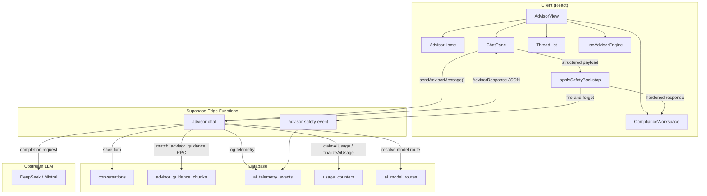
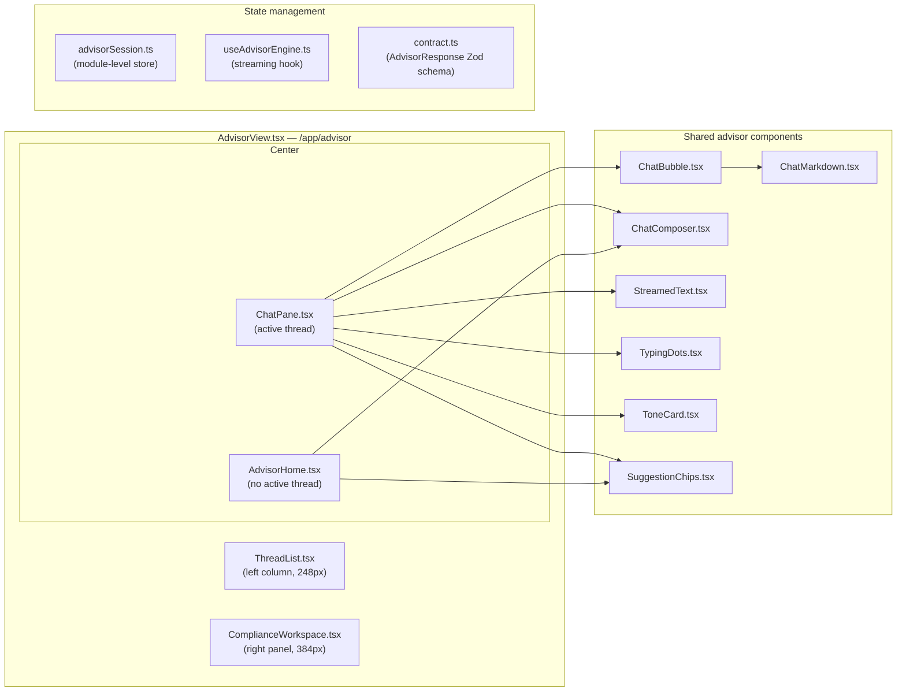
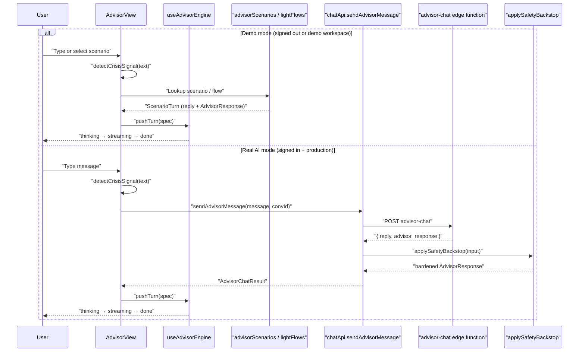

# AI Advisor System

Relevant source files

The following files were used as context for generating this wiki page:

- [docs/AI_USAGE_STRATEGY.md](docs/AI_USAGE_STRATEGY.md)
- [docs/LAW_MONITORING.md](docs/LAW_MONITORING.md)
- [docs/advisor-corpus-review-pack-ontario.md](docs/advisor-corpus-review-pack-ontario.md)
- [src/features/app/advisor/chatApi.test.ts](src/features/app/advisor/chatApi.test.ts)
- [src/features/app/advisor/chatApi.ts](src/features/app/advisor/chatApi.ts)
- [src/features/app/advisor/safety/safetyBackstop.ts](src/features/app/advisor/safety/safetyBackstop.ts)
- [src/features/app/advisor/safety/statutoryFigures.test.ts](src/features/app/advisor/safety/statutoryFigures.test.ts)
- [src/features/app/advisor/safety/statutoryFigures.ts](src/features/app/advisor/safety/statutoryFigures.ts)
- [src/features/app/advisor/usageLimit.test.ts](src/features/app/advisor/usageLimit.test.ts)
- [src/features/app/advisor/usageLimit.ts](src/features/app/advisor/usageLimit.ts)
- [src/features/app/views/advisor/AdvisorView.test.tsx](src/features/app/views/advisor/AdvisorView.test.tsx)
- [src/features/app/views/advisor/AdvisorView.tsx](src/features/app/views/advisor/AdvisorView.tsx)
- [src/features/app/views/advisor/ChatPane.tsx](src/features/app/views/advisor/ChatPane.tsx)
- [src/features/app/views/cases/CaseDetailView.test.tsx](src/features/app/views/cases/CaseDetailView.test.tsx)
- [src/features/app/views/home/homeData.ts](src/features/app/views/home/homeData.ts)
- [src/i18n/messages/advisorView.ts](src/i18n/messages/advisorView.ts)
- [supabase/functions/advisor-chat/index.ts](supabase/functions/advisor-chat/index.ts)
- [supabase/functions/advisor-chat/responsePayload.test.ts](supabase/functions/advisor-chat/responsePayload.test.ts)
- [supabase/functions/monitor-law-changes/index.ts](supabase/functions/monitor-law-changes/index.ts)
- [supabase/functions/support-call-scheduler/index.ts](supabase/functions/support-call-scheduler/index.ts)
- [supabase/migrations/0049_cron_trigger_shared_secret.sql](supabase/migrations/0049_cron_trigger_shared_secret.sql)

The AI Advisor is Dutiva's chat-based HR compliance assistant, accessible at `/app/advisor`. It provides jurisdiction-aware guidance for Canadian employers across Ontario, Québec, and federally regulated workplaces. The system operates in two execution modes — a **scripted demo mode** (fixture-driven, no backend required) and a **real AI mode** (Supabase edge function calling an upstream LLM) — and layers a deterministic safety system over every model response.

The guiding design principle, codified in `docs/AI_USAGE_STRATEGY.md`, is: **the LLM proposes, deterministic code disposes**. The model writes prose; routing, gating, risk classification, jurisdiction detection, crisis intercept, and statutory figures are all computed by rules that are exact, reproducible, and auditable.

Sources: [docs/AI_USAGE_STRATEGY.md:1-21](), [src/features/app/views/advisor/AdvisorView.tsx:66-81]()

---

## System Architecture

**Architecture overview: from user input to rendered response**

Sources: [src/features/app/views/advisor/AdvisorView.tsx:1-64](), [src/features/app/advisor/chatApi.ts:90-131](), [supabase/functions/advisor-chat/index.ts:1-28](), [src/features/app/advisor/safety/safetyBackstop.ts:93-155]()

---

## Two Execution Modes

The Advisor runs in one of two modes depending on the user's authentication status and workspace mode.

| Aspect              | Demo Mode (scripted)                                             | Real AI Mode                                                                          |
| ------------------- | ---------------------------------------------------------------- | ------------------------------------------------------------------------------------- |
| **Trigger**         | Signed out, or workspace mode = `demo`                           | Signed in, workspace mode = `production`                                              |
| **Response source** | `advisorScenarios`, `lightFlows`, `followupReplies` fixture data | `advisor-chat` edge function → upstream LLM                                           |
| **Streaming**       | Client-side simulated: 850ms thinking → 3 chars/16ms             | Server response rendered through same `useAdvisorEngine`                              |
| **Safety layer**    | Crisis intercept only (`detectCrisisSignal`)                     | Full `applySafetyBackstop` pipeline (crisis + jurisdiction gate + notice cross-check) |
| **Workspace panel** | Pre-built `AdvisorResponse` fixtures per scenario                | Live structured payload from `buildAdvisorResponse`                                   |

In demo mode, six pre-authored scenarios (`s1`–`s6` in `advisorScenarios`) demonstrate the three response modes (`hr`, `escalation`, `supportive`) along with jurisdiction-unknown and web-search experiences. The `routeFlowKeyFromText` function does keyword routing for typed queries to select flows like `termination`, `hiring`, `accommodation`, etc. In real AI mode, `sendAdvisorMessage` in `chatApi.ts` invokes the `advisor-chat` edge function, validates the response against the `advisorResponseSchema` Zod contract, and passes it through the safety backstop before rendering.

For details on the chat interface, demo flows, and streaming engine, see [Advisor Chat Interface & Demo Flows](#3.1).

Sources: [src/features/app/views/advisor/advisorScenarios.ts:1-55](), [src/features/app/views/advisor/advisorFlows.ts:22-54](), [src/features/app/advisor/chatApi.ts:90-131](), [src/features/app/advisor/useAdvisorEngine.ts:1-22]()

---

## Key Components

**Component map: file names to UI regions**

| Component             | File                                                     | Role                                                                                                                                                   |
| --------------------- | -------------------------------------------------------- | ------------------------------------------------------------------------------------------------------------------------------------------------------ |
| `AdvisorView`         | `src/features/app/views/advisor/AdvisorView.tsx`         | Top-level view; owns thread selection, mode dispatch, crisis intercept                                                                                 |
| `AdvisorHome`         | `src/features/app/views/advisor/AdvisorHome.tsx`         | Empty-state: metrics, daily brief, priorities, home composer, suggestion grid                                                                          |
| `ChatPane`            | `src/features/app/views/advisor/ChatPane.tsx`            | Active transcript: jurisdiction pill, user/advisor turns, composer footer                                                                              |
| `ComplianceWorkspace` | `src/features/app/views/advisor/ComplianceWorkspace.tsx` | Structured payload panel (mode, risk, jurisdiction, legal basis, retrieval, confidence). Inline 384px aside at `≥1024px`; full-screen sheet below `lg` |
| `ThreadList`          | `src/features/app/views/advisor/ThreadList.tsx`          | Desktop left column: grouped threads (Pinned / Today / 7 days / Older). Below `md`, replaced by `ThreadListMobileAccess` bar + sheet                   |
| `AdvisorRail`         | `src/features/app/rail/AdvisorRail.tsx`                  | 400px slide-over panel for contextual Advisor from other workspace views                                                                               |
| `useAdvisorEngine`    | `src/features/app/advisor/useAdvisorEngine.ts`           | Streaming lifecycle hook: thinking → streaming → done                                                                                                  |
| `advisorSession`      | `src/features/app/views/advisor/advisorSession.ts`       | Module-level session store: transcripts, extras, response state                                                                                        |

Sources: [src/features/app/views/advisor/AdvisorView.tsx:32-63](), [src/features/app/views/advisor/AdvisorHome.tsx:17-66](), [src/features/app/views/advisor/ChatPane.tsx:35-65](), [src/features/app/views/advisor/ComplianceWorkspace.tsx:44-60](), [src/features/app/views/advisor/ThreadList.tsx:1-34](), [src/features/app/rail/AdvisorRail.tsx:14-21](), [src/features/app/advisor/useAdvisorEngine.ts:71-93](), [src/features/app/views/advisor/advisorSession.ts:46-64]()

On phones, `AdvisorView` stacks vertically: mobile thread access bar, then chat. Side rails (thread list, compliance workspace) use full-screen sheets gated by `useMdUp()` / `useLgUp()` — see [App Shell & Navigation — View-level mobile sheets](#2.4).

---

## Safety & Guardrails Overview

The Advisor applies a **deterministic safety layer** on both client and server. The rules are monotonic — they can only tighten a gate, never loosen one. The three main checks:

1. **Crisis intercept** — `detectCrisisSignal` scans every user message against a maintained, bilingual set of 35 crisis phrases (e.g. `"suicidal"`, `"me suicider"`). When triggered, all structured surfaces are gated off and the user sees the 9-8-8 Suicide Crisis Helpline resource. This runs both on the client and server (mirrored lists, enforced by a drift test).

2. **Jurisdiction / statutory-figure gate** — If the model's reply mentions a statutory figure (e.g. "8 weeks' notice") but the jurisdiction is unconfirmed, `applySafetyBackstop` forces `legalBasisAllowed = false` and adds a warning to the operator.

3. **Notice-figure cross-check** — `crossCheckNoticeFigure` compares a stated notice figure against the encoded statutory schedule (e.g. Ontario ESA s.57 bands). A mismatch withholds the legal-basis surface and warns the operator.

Safety telemetry is fire-and-forget via `reportSafetyEvent` → `advisor-safety-event` edge function → `ai_telemetry_events` table.

For the full safety pipeline, see [Advisor Safety & Guardrails](#3.2).

Sources: [src/features/app/advisor/safety/crisisSignals.ts:31-78](), [src/features/app/advisor/safety/safetyBackstop.ts:93-155](), [src/features/app/advisor/safetyTelemetry.ts:11-23](), [supabase/functions/advisor-safety-event/index.ts:1-16]()

---

## Edge Function Pipeline Overview

The `advisor-chat` Supabase edge function handles real AI turns. The pipeline in summary:

1. **JWT auth** — Bearer token validated, workspace membership checked via `current_user_is_workspace_member` RPC
2. **Parse request** — Extract `message`, `conversationId`, `timezone`
3. **Resolve model route** — Look up `ai_model_routes` / `ai_model_providers` for `route_key = 'advisor_chat'`
4. **Load/create conversation** — Retrieve or create a `conversations` row
5. **Retrieve guidance chunks** — `match_advisor_guidance` RPC over `advisor_guidance_chunks` using a `buildRetrievalQuery` that includes the previous user turn for context
6. **Claim usage** — `claimAiUsage` atomically checks burst/daily/token/platform ceilings
7. **Call upstream LLM** — OpenAI-compatible completion with `SYSTEM_PROMPT` + notice schedule injection + retrieved chunks
8. **Finalize usage** — `finalizeAiUsage` stamps the telemetry row with tokens, latency, outcome
9. **Build response payload** — `buildAdvisorResponse` deterministically computes routing, jurisdiction, risk, legal basis, confidence
10. **Save & return** — Persist the turn to `conversations`, return the `advisorResponse` payload

The `SYSTEM_PROMPT` establishes the Advisor's identity: compliance-oriented HR assistant for Canadian employers, not a lawyer, never cites specific section/regulation numbers from memory, asks for jurisdiction when it changes the answer.

For the full pipeline and response contract, see [Advisor Edge Function & Response Contract](#3.3).

Sources: [supabase/functions/advisor-chat/index.ts:43-103](), [supabase/functions/advisor-chat/responsePayload.ts:1-21](), [supabase/functions/advisor-chat/retrievalQuery.ts:27-33](), [supabase/functions/_shared/aiUsage.ts:1-28]()

---

## The AdvisorResponse Contract

The `AdvisorResponse` is a Zod-validated contract (`advisorResponseSchema`) that carries the structured payload between the server and the `ComplianceWorkspace` panel. It is defined in `src/features/app/advisor/contract.ts` and mirrored in the edge function's `responsePayload.ts`.

| Field                | Type                  | Purpose                                                                          |
| -------------------- | --------------------- | -------------------------------------------------------------------------------- |
| `route`              | `AdvisorRoute`        | Response mode (`hr`/`escalation`/`supportive`) + five boolean gates              |
| `jurisdiction`       | `JurisdictionRead`    | Status (`known`/`assumed`/`unknown`/`conflict`/`not_applicable`) + display value |
| `risk`               | `RiskRead`            | Dual ramps: `compliance` (low→critical) and `safety` (none→critical)             |
| `professionalReview` | `ProfessionalReview?` | Recommended review type (legal, medical, hr, union, emergency)                   |
| `supportNotice`      | `boolean`             | Show "support mode — intentionally off" in the workspace                         |
| `legalBasis`         | `LegalBasisRead`      | Statute citation items, each marked `valid` (human-reviewed) or not              |
| `retrieval`          | `RetrievalRead`       | Corpus tags (e.g. "Termination · ON")                                            |
| `confidence`         | `ConfidenceRead?`     | Label + 0–100 meter fill                                                         |
| `isCrisis`           | `boolean`             | When true, all structured surfaces are gated off                                 |

The `allowedSurfaces` function is the single gating check — no workspace block renders without passing its corresponding gate.

Sources: [src/features/app/advisor/contract.ts:56-170]()

---

## AI Usage Metering

During the beta, the AI surface is metered by `claimAiUsage`/`finalizeAiUsage` in `supabase/functions/_shared/aiUsage.ts`. Four ceilings apply:

| Ceiling        | Default            | Scope                              |
| -------------- | ------------------ | ---------------------------------- |
| Burst          | 10 requests / 300s | Per-user, per-operation            |
| Daily requests | 120 / day          | Per-user, shared across operations |
| Daily tokens   | 250,000 / day      | Per-user                           |
| Platform daily | 2,000 / day        | Beta-wide                          |

A refused turn returns HTTP 429, surfaced to the user via `AdvisorUsageLimitError` with a friendly message and a `retryAfterSeconds` countdown. All ceilings are env-overridable. The claim is taken **before** the model call and finalized after; an unfinalized claim stays counted as a fail-safe against retry loops.

Sources: [supabase/functions/_shared/aiUsage.ts:30-103](), [src/features/app/advisor/chatApi.ts:33-73]()

---

## Data Flow: Demo vs Production

**Message flow comparison for the two execution modes**

In both modes, the crisis pre-classifier (`detectCrisisSignal`) runs on the client **before** any routing decision. A crisis signal always takes precedence — it overrides scenario routing, flow dispatch, and model responses alike.

Sources: [src/features/app/views/advisor/AdvisorView.tsx:126-139](), [src/features/app/advisor/chatApi.ts:90-131](), [src/features/app/advisor/safety/crisisSignals.ts:74-78]()

---

## Child Pages

| Page                                              | Scope                                                                                                                                                                                                                                                                                                 |
| ------------------------------------------------- | ----------------------------------------------------------------------------------------------------------------------------------------------------------------------------------------------------------------------------------------------------------------------------------------------------- |
| [Advisor Chat Interface & Demo Flows](#3.1)       | `AdvisorView`, `ChatPane`, `ComplianceWorkspace`, `ThreadList`, `AdvisorHome`, the streaming engine (`useAdvisorEngine`), demo scenarios (`advisorScenarios`), light flows, the termination quick form, suggestion chips, province prompt, `AdvisorRail`                                              |
| [Advisor Safety & Guardrails](#3.2)               | Crisis intercept (`detectCrisisSignal`, 9-8-8 resource), `applySafetyBackstop` (monotonic tightening), `mentionsStatutoryFigure`, jurisdiction gate, `statutoryCrossCheck`, safety telemetry (`advisor-safety-event`), AI usage metering (`claimAiUsage`/`finalizeAiUsage`, `AdvisorUsageLimitError`) |
| [Advisor Edge Function & Response Contract](#3.3) | The `advisor-chat` edge function pipeline, `buildAdvisorResponse` deterministic payload builder, `advisorResponseSchema` Zod contract, response modes, workspace state kinds, `match_advisor_guidance` RPC, notice schedule injection, `ChatMarkdown` renderer, `ChatChart` fenced blocks             |

---
