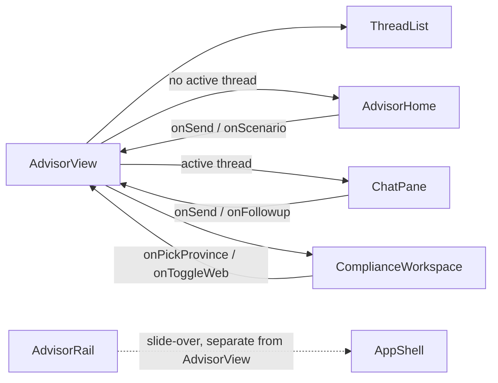
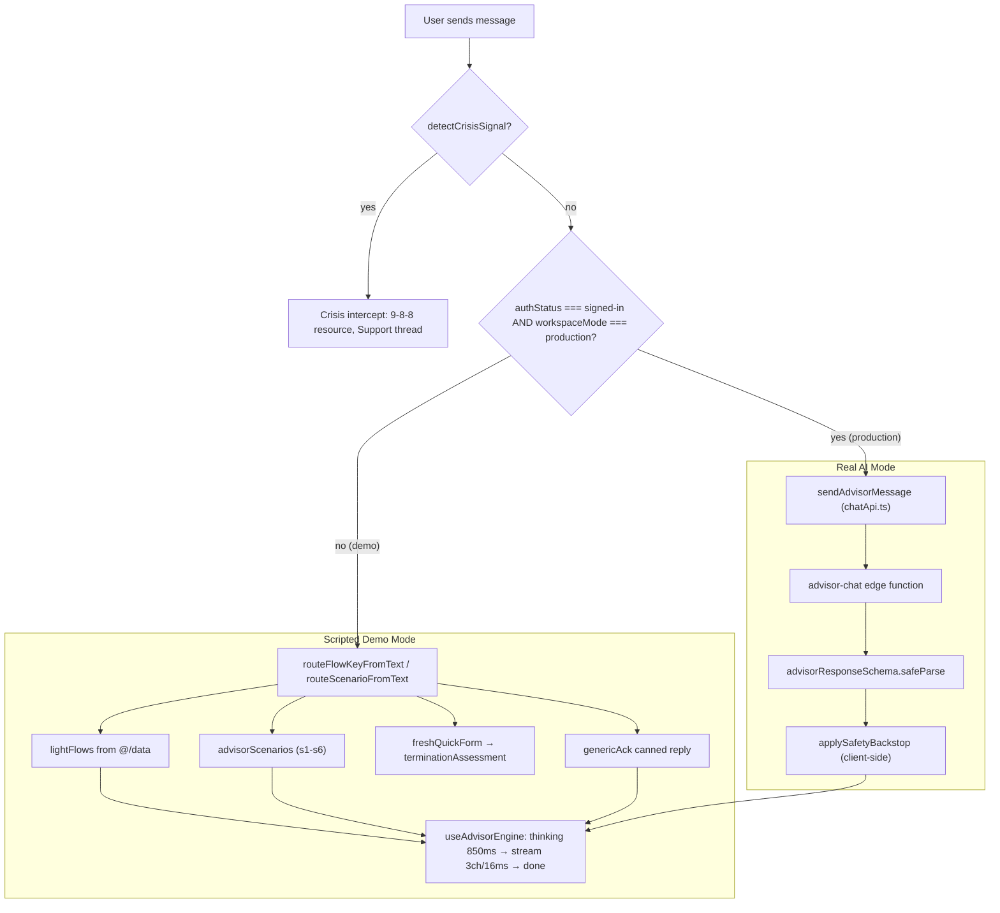
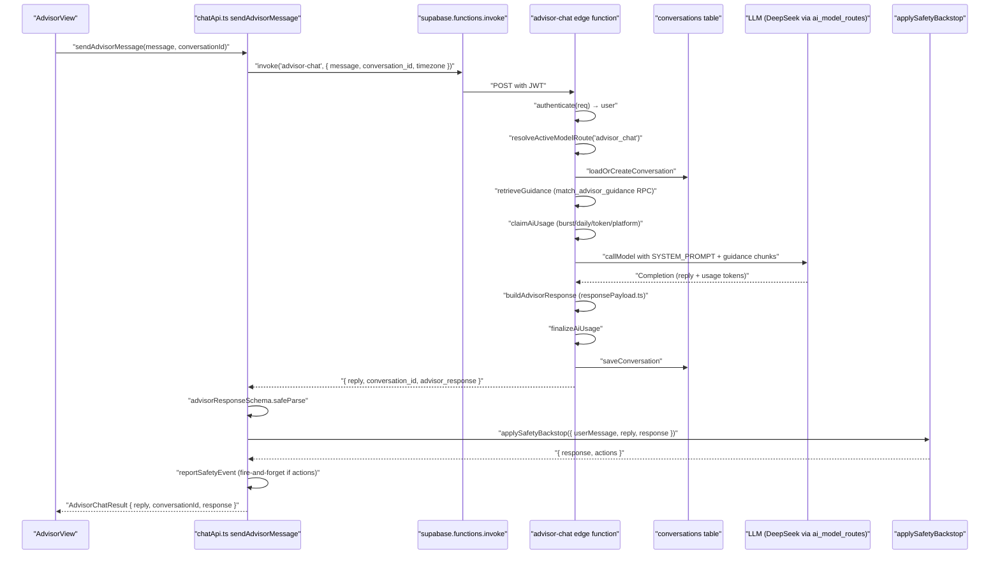
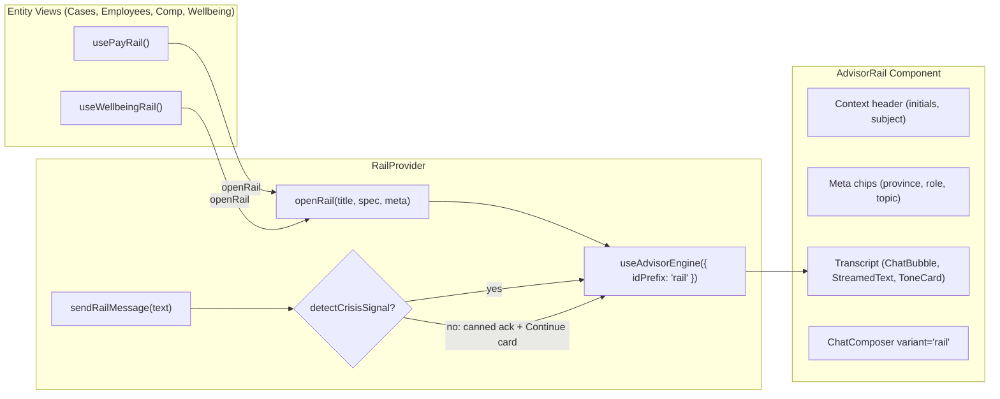
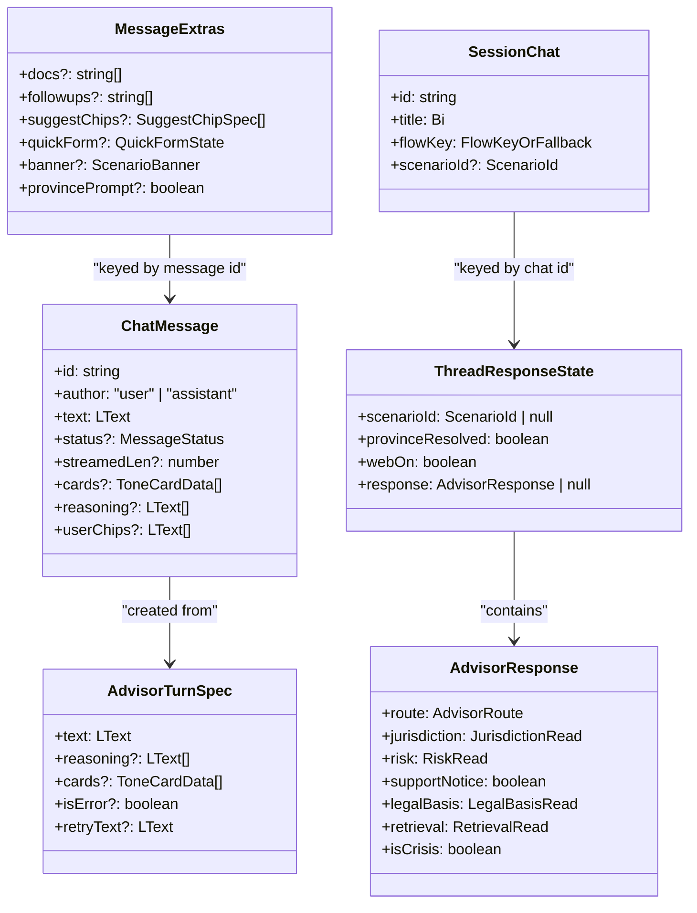

# Advisor Chat Interface & Demo Flows

<details>
<summary>Relevant source files</summary>

The following files were used as context for generating this wiki page:

- [src/components/advisor/ChatChart.tsx](src/components/advisor/ChatChart.tsx)
- [src/components/advisor/chat-markdown.css](src/components/advisor/chat-markdown.css)
- [src/features/app/advisor/ChatBubble.tsx](src/features/app/advisor/ChatBubble.tsx)
- [src/features/app/advisor/StreamedText.tsx](src/features/app/advisor/StreamedText.tsx)
- [src/features/app/advisor/chatApi.test.ts](src/features/app/advisor/chatApi.test.ts)
- [src/features/app/advisor/chatApi.ts](src/features/app/advisor/chatApi.ts)
- [src/features/app/advisor/contract.test.ts](src/features/app/advisor/contract.test.ts)
- [src/features/app/advisor/contract.ts](src/features/app/advisor/contract.ts)
- [src/features/app/advisor/types.ts](src/features/app/advisor/types.ts)
- [src/features/app/advisor/usageLimit.test.ts](src/features/app/advisor/usageLimit.test.ts)
- [src/features/app/advisor/usageLimit.ts](src/features/app/advisor/usageLimit.ts)
- [src/features/app/rail/AdvisorRail.tsx](src/features/app/rail/AdvisorRail.tsx)
- [src/features/app/rail/RailProvider.tsx](src/features/app/rail/RailProvider.tsx)
- [src/features/app/rail/railContext.ts](src/features/app/rail/railContext.ts)
- [src/features/app/search/SearchProvider.tsx](src/features/app/search/SearchProvider.tsx)
- [src/features/app/search/searchContext.ts](src/features/app/search/searchContext.ts)
- [src/features/app/toasts/toastsContext.ts](src/features/app/toasts/toastsContext.ts)
- [src/features/app/views/advisor/AdvisorHome.tsx](src/features/app/views/advisor/AdvisorHome.tsx)
- [src/features/app/views/advisor/AdvisorView.test.tsx](src/features/app/views/advisor/AdvisorView.test.tsx)
- [src/features/app/views/advisor/AdvisorView.tsx](src/features/app/views/advisor/AdvisorView.tsx)
- [src/features/app/views/advisor/ChatPane.tsx](src/features/app/views/advisor/ChatPane.tsx)
- [src/features/app/views/advisor/ComplianceWorkspace.test.tsx](src/features/app/views/advisor/ComplianceWorkspace.test.tsx)
- [src/features/app/views/advisor/ComplianceWorkspace.tsx](src/features/app/views/advisor/ComplianceWorkspace.tsx)
- [src/features/app/views/advisor/advisorFlows.ts](src/features/app/views/advisor/advisorFlows.ts)
- [src/features/app/views/advisor/advisorScenarios.ts](src/features/app/views/advisor/advisorScenarios.ts)
- [src/features/app/views/cases/CaseDetailView.test.tsx](src/features/app/views/cases/CaseDetailView.test.tsx)
- [src/features/app/views/home/homeData.ts](src/features/app/views/home/homeData.ts)
- [src/features/marketing/LandingPage.tsx](src/features/marketing/LandingPage.tsx)
- [src/i18n/core.ts](src/i18n/core.ts)
- [src/i18n/messages/advisorCore.ts](src/i18n/messages/advisorCore.ts)
- [src/i18n/messages/advisorView.ts](src/i18n/messages/advisorView.ts)
- [src/index.css](src/index.css)
- [src/styles/patterns.css](src/styles/patterns.css)
- [src/styles/surfaces.css](src/styles/surfaces.css)
- [supabase/functions/advisor-chat/index.ts](supabase/functions/advisor-chat/index.ts)
- [supabase/functions/advisor-chat/responsePayload.test.ts](supabase/functions/advisor-chat/responsePayload.test.ts)

</details>

The Advisor is Dutiva's full-page AI chat surface, mounted at `/app/advisor`. It operates in two execution modes: a **scripted demo** mode (fixture-driven light flows, scenario threads, canned acknowledgements) and a **real AI** mode (calling the `advisor-chat` Supabase edge function backed by DeepSeek). The view is a three-column layout — thread list, chat pane, and Compliance Workspace sidebar — orchestrated by the `AdvisorView` component. A contextual slide-over panel (`AdvisorRail`) provides entity-scoped Advisor conversations from any workspace view.

## Route Registration & Lazy Loading

`AdvisorView` is registered in the app route table as a lazy-loaded view. Unlike most workspace views, it is **not** wrapped in the `gated()` / `ModeGate` gate — it has its own production variant logic internally.

```
/app/advisor  →  AdvisorView (lazy, ungated)
```

The route entry at [src/app/appViews.tsx:27]() performs `lazy(() => import(...))`. The view is accessible in both demo and production workspace modes; it branches internally based on `useWorkspaceMode()` [src/features/app/views/advisor/AdvisorHome.tsx:62-90]().

Sources: [src/app/appViews.tsx:27](), [src/features/app/views/advisor/AdvisorHome.tsx:69]()

## Component Architecture

**AdvisorView component layout diagram**



Sources: [src/features/app/views/advisor/AdvisorView.tsx:66-81](), [src/features/app/views/advisor/AdvisorView.tsx:226]()

### AdvisorView

The main orchestrator component. It composes `ThreadList`, `AdvisorHome` (or `ChatPane`), and `ComplianceWorkspace` in a flex row. Key responsibilities:

| Concern             | Implementation                                                                                                                                                         |
| ------------------- | ---------------------------------------------------------------------------------------------------------------------------------------------------------------------- |
| Streaming engine    | `useAdvisorEngine({ idPrefix: enginePrefix })` — shared hook for thinking → streaming → done lifecycle [src/features/app/views/advisor/AdvisorView.tsx:8]()            |
| Session persistence | Module-level `advisorSession` store survives navigation; local `useState` mirrors it for rendering [src/features/app/views/advisor/advisorSession.ts:56-64]()          |
| Thread selection    | `selectChat` callback stashes/restores transcripts from `advisorSession.transcripts` Map [src/features/app/views/advisor/AdvisorView.tsx:278]()                        |
| Flow routing        | `routeFlowKeyFromText` keyword router for unsigned-in free-text; `readNavStartFlow` for explicit router state [src/features/app/views/advisor/advisorFlows.ts:23-54]() |
| Crisis intercept    | `detectCrisisSignal` runs before any flow routing or model call [src/features/app/views/advisor/AdvisorView.tsx:13]()                                                  |
| Real AI send        | `sendAdvisorMessage` via `chatApi.ts` when `authStatus === 'signed-in'` and `workspaceMode === 'production'` [src/features/app/advisor/chatApi.ts:90-131]()            |

The view handles router state contracts for cross-view navigation:

- `{ chatId }` — select a thread (search result click) [src/features/app/views/advisor/AdvisorView.tsx:141-147]()
- `{ prompt, flowKey }` — start a flow from Home/Workflows [src/features/app/views/advisor/advisorNav.ts:14-18]()
- `{ newConversation: true }` — reset to fresh state [src/features/app/views/advisor/advisorNav.ts:21-23]()

Sources: [src/features/app/views/advisor/AdvisorView.tsx:1-226](), [src/features/app/views/advisor/advisorNav.ts:1-53]()

### ThreadList

On desktop/tablet (`≥768px`), a 248px left-column `<nav>` renders conversation groups: Pinned, Today, Previous 7 days, Older. Each thread row shows a `MessageCircle` icon, title, and a filled `Star` for pinned threads. A navy "New conversation" button sits at the top.

Below `768px`, the column is replaced by **`ThreadListMobileAccess`**: a bar showing the active thread title (or “Conversations”) plus a full-screen sheet containing the same list, new-conversation control, and delete actions. The sheet closes on thread select.

Thread sources are merged from three pools:

1. **Fixture chats** — seeded from `chats` in `@/data` [src/features/app/views/advisor/AdvisorView.tsx:95-100]()
2. **Session chats** — new conversations created this session [src/features/app/views/advisor/advisorSession.ts:8-16]()
3. **Scenario threads** — six demo response-mode threads prefixed `scn-` [src/features/app/views/advisor/AdvisorView.tsx:107-112]()

Sources: [src/features/app/views/advisor/ThreadList.tsx:1-290]()

### AdvisorHome

The empty state shown when no thread is active. In **demo mode** it renders:

- Spark hero with greeting ("Good to see you, Riley.")
- Four metric tiles (compliance score, open risk items, active cases, support signals) from `buildHomeMetrics()` [src/features/app/views/advisor/advisorHomeData.ts:38-82]()
- Daily brief card from `buildDailyBrief()` [src/features/app/views/advisor/advisorHomeData.ts:90-104]()
- Priorities feed from `homePriorities` with collapsible "Why" expanders [src/features/app/views/advisor/AdvisorHome.tsx:144-200]()
- Home composer (`ChatComposer` variant `home`) [src/features/app/views/advisor/AdvisorHome.tsx:204-209]()
- Suggestion chip grid — the six scenario starters via `scenarioSuggestions` [src/features/app/views/advisor/AdvisorHome.tsx:212-221]()

In **production mode**, it shows only the greeting and composer (no fixture metrics/priorities) [src/features/app/views/advisor/AdvisorHome.tsx:69-90]().

Sources: [src/features/app/views/advisor/AdvisorHome.tsx:1-226](), [src/features/app/views/advisor/advisorHomeData.ts:1-104]()

### ChatPane

The active conversation pane (max-width 740px). It renders:

1. **Jurisdiction pill** — always-visible context line above the transcript, tinted by `JurisdictionPillTone` (`gold` | `warn` | `support`) [src/features/app/views/advisor/ChatPane.tsx:67-73]()
2. **Transcript** — user/assistant turns in a scrolling `aria-live="polite"` region [src/features/app/views/advisor/ChatPane.tsx:141-165]()
3. **Composer footer** — `ChatComposer` variant `chat`, disabled while `busy` [src/features/app/views/advisor/ChatPane.tsx:168-177]()

Each assistant turn (`AdvisorTurn`) renders status-dependent content:

- `thinking` → `TypingDots` with "Advisor is thinking" label
- `streaming` → `StreamedText` with blinking caret
- `done` → full text + tone cards + doc chips + follow-up chips + quick form + province prompt + banners
- `error` → error bubble with Retry button

Sources: [src/features/app/views/advisor/ChatPane.tsx:1-95](), [src/features/app/views/advisor/ChatPane.tsx:92-177]()

### ComplianceWorkspace

The 384px right sidebar showing the structured `AdvisorResponse` payload. It has four states defined by the `WorkspaceState` union:

| State     | Condition                     | Rendering                                                                                           |
| --------- | ----------------------------- | --------------------------------------------------------------------------------------------------- |
| `locked`  | Not signed in                 | Sign-in form + skeleton blocks [src/features/app/views/advisor/ComplianceWorkspace.tsx:199-219]()   |
| `running` | Reply in progress             | Pulsing dot animation + skeleton [src/features/app/views/advisor/ComplianceWorkspace.tsx:222-243]() |
| `idle`    | Thread active, no engine turn | "Send a message" prompt [src/features/app/views/advisor/ComplianceWorkspace.tsx:245-258]()          |
| `ready`   | Structured payload available  | Full payload display [src/features/app/views/advisor/ComplianceWorkspace.tsx:269-589]()             |

The `ReadyState` renders sections gated by `allowedSurfaces(response)` [src/features/app/advisor/contract.ts:161-170](): response mode chip, jurisdiction card (with optional province-pick chips), dual risk meters (compliance + safety), professional review recommendation, support-mode notice, legal basis items (valid/needs-review), retrieved guidance tags, web sources with authority badges, confidence meter, quality warnings, and the five rendering-gate pills (workspace, retrieval, legal, docs, web).

Below the **`lg` (1024px)** breakpoint, the aside is hidden and the same content renders as a full-screen sheet toggled from the gold “Workspace” pill in `ChatPane` [src/features/app/views/advisor/ComplianceWorkspace.tsx:200-217](), [src/features/app/views/advisor/ChatPane.tsx:180-186](). This aligns the compliance panel with the app shell’s desktop breakpoint (sidebar expanded/compact vs drawer).

Sources: [src/features/app/views/advisor/ComplianceWorkspace.tsx:1-646](), [src/features/app/advisor/contract.ts:138-170]()

## Two Execution Modes

**End-to-end data flow diagram: scripted demo vs real AI**



Sources: [src/features/app/views/advisor/AdvisorView.tsx:13-14](), [src/features/app/advisor/chatApi.ts:90-131](), [src/features/app/views/advisor/advisorFlows.ts:23-54]()

### Scripted Demo Mode

When the user is not signed in, or the workspace is in demo mode, all replies are deterministic.

#### Light Flows

`lightFlows` (imported from `@/data`) are keyed by `ChatFlowKey` — `'termination'`, `'hiring'`, `'onboarding'`, `'performance'`, `'accommodation'`, `'policy'`. Each flow provides canned advisor turns, reasoning traces, tone cards, doc-generate chips, and follow-up chips.

The flow is selected by `routeFlowKeyFromText`, a keyword router that scans the lowercased user text for terms like `terminat`, `offer`, `pip`, `accommodat`, etc. [src/features/app/views/advisor/advisorFlows.ts:23-54](). Each flow maps to:

- A **title** from `flowTitles` [src/features/app/views/advisor/advisorFlows.ts:59-67]()
- A **jurisdiction line** from `flowJurisdictions` [src/features/app/views/advisor/advisorFlows.ts:77-97]()
- Per-flow canned turns from the `lightFlows` data

The **termination flow** is the most elaborate — it includes a quick-form intake:

1. Intro message with reasoning trace [src/features/app/views/advisor/advisorFlows.ts:138-153]()
2. `freshQuickForm()` with five fields: employment type, tenure, reason, contract type, union status [src/features/app/views/advisor/advisorFlows.ts:160-220]()
3. On submit → `terminationAssessment`: full assessment text with risk/warning tone cards, ESA citation chips, doc-generate chips (Termination Letter, Full & Final Release, Offboarding Checklist), and four follow-up chips [src/features/app/views/advisor/advisorFlows.ts:246-307]()

The **fallback flow** fires when no keyword matches. It shows an intro prompt with six suggestion chips routing to the named flows [src/features/app/views/advisor/advisorFlows.ts:102-120]().

For free-form sends within an existing thread, the view pushes `genericAck` [src/features/app/views/advisor/advisorFlows.ts:331-334]().

Sources: [src/features/app/views/advisor/advisorFlows.ts:1-403]()

#### Advisor Scenarios

Six demo response-mode threads showcase the Advisor Response Experience. Each `AdvisorScenario` has a `ScenarioId` (`s1`–`s6`), a pinned flag, the user prompt, and a `ScenarioTurn` carrying the reply, banner, doc/follow-up chips, jurisdiction line, and a full `AdvisorResponse` payload for the Compliance Workspace.

| ID   | Title                            | Response Mode | Key Feature                                                     |
| ---- | -------------------------------- | ------------- | --------------------------------------------------------------- |
| `s1` | Termination — Ontario, no clause | `hr`          | Full compliance workspace, doc chips, legal basis               |
| `s2` | Harassment complaint             | `escalation`  | Risk banner, legal counsel recommendation                       |
| `s3` | Medical accommodation            | `hr`          | Medical review suggestion, topic-alignment filter               |
| `s4` | Notice period — jurisdiction?    | `hr` (gated)  | Province prompt, `resolved` variant after pick                  |
| `s5` | Feeling overwhelmed              | `supportive`  | All gates off, 9-8-8 resource, support notice                   |
| `s6` | What changed in ON law?          | `hr` + web    | Web sources with authority badges, web toggle, `webOff` variant |

Scenarios `s4` and `s6` have alternate turns: `s4.resolved` activates when the user picks a province (jurisdiction becomes `assumed`); `s6.webOff` activates when the web toggle is off [src/features/app/views/advisor/advisorScenarios.ts:45-55]().

The `routeScenarioFromText` function routes signed-out home-composer input to a matching scenario via keywords [src/features/app/views/advisor/advisorScenarios.ts:20]().

Sources: [src/features/app/views/advisor/advisorScenarios.ts:1-55](), [src/features/app/views/advisor/advisorScenarios.ts:77-542]()

### Real AI Mode

When `authStatus === 'signed-in'` and `workspaceMode === 'production'`, free-form messages call `sendAdvisorMessage` in `chatApi.ts`.

**Real AI request pipeline diagram**



Sources: [src/features/app/advisor/chatApi.ts:1-131](), [supabase/functions/advisor-chat/index.ts:1-170]()

#### chatApi.ts

`sendAdvisorMessage(message, conversationId)` [src/features/app/advisor/chatApi.ts:90-131]():

1. Guards: throws if `supabase` is null (unconfigured environment) [src/features/app/advisor/chatApi.ts:94-96]()
2. Invokes `advisor-chat` edge function with `{ message, conversation_id, timezone }` [src/features/app/advisor/chatApi.ts:100-106]()
3. On error: checks for 429 → `AdvisorUsageLimitError` with scope and retry-after [src/features/app/advisor/chatApi.ts:35-44]()
4. Parses response via `advisorChatResponseSchema` (Zod) [src/features/app/advisor/chatApi.ts:75-81]()
5. If `advisor_response` present: validates against `advisorResponseSchema`, then runs `applySafetyBackstop` (monotonic tightening — can only close gates, never open them) [src/features/app/advisor/chatApi.ts:110-128]()
6. If safety backstop fires, records `reportSafetyEvent` fire-and-forget [src/features/app/advisor/chatApi.ts:121-125]()

#### advisor-chat Edge Function

The server-side pipeline [supabase/functions/advisor-chat/index.ts:1-170]():

1. **CORS** handling [supabase/functions/advisor-chat/index.ts:30-34]()
2. **JWT auth** → extracts user from bearer token
3. **Model route resolution** → looks up `advisor_chat` route in `ai_model_routes` / `ai_model_providers`
4. **Conversation load/create** → `conversations` table
5. **Guidance retrieval** → `match_advisor_guidance` RPC over `advisor_guidance_chunks`, with `buildRetrievalQuery` [supabase/functions/advisor-chat/index.ts:5]()
6. **Usage claim** → `claimAiUsage` from `_shared/aiUsage.ts` (burst/daily/token/platform ceilings) [supabase/functions/advisor-chat/index.ts:8-11]()
7. **LLM call** → `SYSTEM_PROMPT` (compliance HR assistant instructions, Markdown formatting rules, chart fenced block spec) + `currentTimeLine(timezone)` + guidance chunks + conversation history [supabase/functions/advisor-chat/index.ts:43-103]()
8. **Response build** → `buildAdvisorResponse` from `responsePayload.ts` [supabase/functions/advisor-chat/index.ts:3]()
9. **Usage finalize** → `finalizeAiUsage` stamps token counts [supabase/functions/advisor-chat/index.ts:9]()
10. **Conversation save** + telemetry

Sources: [supabase/functions/advisor-chat/index.ts:1-170]()

#### Usage Limit Handling

When the edge function returns HTTP 429, `chatApi.ts` constructs an `AdvisorUsageLimitError` with `scope` (`burst` | `daily` | `daily_tokens` | `platform_daily`) and `retryAfterSeconds` [src/features/app/advisor/chatApi.ts:35-44](). The view calls `usageLimitReply(error)` to produce a vague-but-honest wait phrase ("about 20 minutes") and renders it as a normal advisor reply rather than an error turn [src/features/app/advisor/usageLimit.ts:53-60]().

Sources: [src/features/app/advisor/chatApi.ts:33-73](), [src/features/app/advisor/usageLimit.ts:1-60]()

## Streaming Engine

The `useAdvisorEngine` hook [src/features/app/advisor/useAdvisorEngine.ts:92-226]() provides the shared streaming lifecycle used by both `AdvisorView` and `AdvisorRail`:

| Constant                        | Value | Purpose                                                                                    |
| ------------------------------- | ----- | ------------------------------------------------------------------------------------------ |
| `ADVISOR_THINK_MS`              | 850ms | Thinking delay before streaming starts [src/features/app/advisor/useAdvisorEngine.ts:19]() |
| `ADVISOR_STREAM_TICK_MS`        | 16ms  | Interval between character reveals [src/features/app/advisor/useAdvisorEngine.ts:20]()     |
| `ADVISOR_STREAM_CHARS_PER_TICK` | 3     | Characters revealed per tick [src/features/app/advisor/useAdvisorEngine.ts:21]()           |

The lifecycle per message: `thinking` → `streaming` (character-by-character reveal) → `done` (cards/chips render). When `prefers-reduced-motion` is detected, the thinking delay and streaming are skipped — turns land fully rendered [src/features/app/advisor/useAdvisorEngine.ts:164-171]().

The engine exposes: `sendUser`, `pushTurn`, `retryTurn`, `reset`, `messages`, `busy` [src/features/app/advisor/useAdvisorEngine.ts:71-83]().

### StreamedText & ChatMarkdown

`StreamedText` slices the localized string to `streamedLen` characters during streaming, appending a blinking CSS caret [src/features/app/advisor/StreamedText.tsx:30-40]().

The sliced text is rendered through `ChatMarkdown`, a GFM-capable Markdown renderer built on `react-markdown` + `remark-gfm` [src/components/advisor/ChatMarkdown.tsx:238-251](). Features:

- Tables with responsive stacked-card layout on mobile (column headers stamped via `data-label` attributes) [src/components/advisor/ChatMarkdown.tsx:110-145]()
- `chart` fenced code blocks rendered via lazy-loaded `ChatChart` (recharts, ~420kB separate chunk) [src/components/advisor/ChatMarkdown.tsx:52-54]()
- `hideIncompleteTable` suppresses half-arrived tables during streaming [src/components/advisor/ChatMarkdown.tsx:239-242]()
- Raw HTML is **never** rendered (no rehype-raw) — security boundary against model output injection [src/components/advisor/ChatMarkdown.tsx:24-25]()

Sources: [src/features/app/advisor/StreamedText.tsx:1-41](), [src/components/advisor/ChatMarkdown.tsx:1-252]()

## AdvisorResponse Contract

The `AdvisorResponse` type is defined as a Zod schema in `contract.ts` and shared between client and server [src/features/app/advisor/contract.ts:138-154]():

```
AdvisorResponse {
  route:           { responseMode, workspaceAllowed, retrievalAllowed, legalBasisAllowed, documentsAllowed, webSearchAllowed }
  jurisdiction:    { status, value, note? }
  risk:            { compliance, safety }
  professionalReview: { type, label, reason } | null
  supportNotice:   boolean
  legalBasis:      { items[], withheldReason? }
  retrieval:       { items[], note?, withheldReason? }
  webSearch:       { sources[], unavailableReason? } | null
  confidence:      { label, pct, note? } | null
  warnings:        LText[]
  isCrisis:        boolean
}
```

The `allowedSurfaces(response)` function is the single gating check — when `isCrisis` is true, all gates return false [src/features/app/advisor/contract.ts:161-170]().

Sources: [src/features/app/advisor/contract.ts:1-170]()

## Session State Management

The `advisorSession` module store persists conversations for the browser session without localStorage [src/features/app/views/advisor/advisorSession.ts:46-64]():

| Field           | Type                                  | Purpose                                                               |
| --------------- | ------------------------------------- | --------------------------------------------------------------------- |
| `chats`         | `SessionChat[]`                       | New conversations created this session                                |
| `extras`        | `Record<string, MessageExtras>`       | Per-message doc chips, follow-ups, quick forms, banners               |
| `transcripts`   | `Map<string, ChatMessage[]>`          | Stashed message arrays keyed by chatId                                |
| `responseState` | `Record<string, ThreadResponseState>` | Per-thread scenario ID, province resolved, web toggle, latest payload |
| `activeChatId`  | `string \| null`                      | Currently selected thread                                             |
| `nextChatSeq`   | `number`                              | Sequential ID for new session chats                                   |
| `mountSeq`      | `number`                              | Engine prefix per mount (prevents ID collisions on restore)           |

`ThreadResponseState` tracks per-thread response experience state: `scenarioId`, `provinceResolved`, `webOn`, and `response` (the latest `AdvisorResponse`) [src/features/app/views/advisor/advisorSession.ts:25-33]().

Sources: [src/features/app/views/advisor/advisorSession.ts:1-76]()

## AdvisorRail Slide-Over Panel

**AdvisorRail context and data flow diagram**



The `RailProvider` wraps the app shell and provides `useRail()` context [src/features/app/rail/RailProvider.tsx:29-98](). It manages:

- **Opening**: `openRail(title, spec, meta)` resets the engine and pushes the initial turn [src/features/app/rail/RailProvider.tsx:35-42]()
- **Sending**: `sendRailMessage` runs crisis intercept first; if clean, pushes a canned acknowledgement with a "Continue in Advisor Home" action card that navigates to `/app/advisor` [src/features/app/rail/RailProvider.tsx:48-85]()
- **Closing**: preserves transcript (prototype behavior) [src/features/app/rail/RailProvider.tsx:44-46]()

The `AdvisorRail` component renders as a 400px fixed dialog docked to the right with a scrim overlay [src/features/app/rail/AdvisorRail.tsx:22-165](). It uses `useEscapeToClose` for keyboard dismissal [src/features/app/rail/AdvisorRail.tsx:28](), auto-scrolls the transcript, and returns focus to the trigger element on close [src/features/app/rail/AdvisorRail.tsx:31-39]().

Two entity-specific rail openers are provided:

- `usePayRail()` — opens with compensation analysis (base vs market, pay-equity citation) [src/features/app/rail/useEntityRails.ts:19-78]()
- `useWellbeingRail()` — opens with supportive, non-diagnostic check-in [src/features/app/rail/useEntityRails.ts:81-127]()

Sources: [src/features/app/rail/AdvisorRail.tsx:1-166](), [src/features/app/rail/RailProvider.tsx:1-99](), [src/features/app/rail/railContext.ts:1-39](), [src/features/app/rail/useEntityRails.ts:1-128]()

## Chat UI Primitives

### ChatComposer

Three size variants (`home`, `chat`, `rail`) with graduated border-radius, font size, and send-button dimensions [src/features/app/advisor/ChatComposer.tsx:34-56](). Enter sends; Shift+Enter inserts a newline; empty/whitespace is ignored [src/features/app/advisor/ChatComposer.tsx:74-86]().

### ToneCard

Tone-tinted panels embedded in assistant replies. Five tones: `risk`, `warning`, `suggestion`, `info`, `success` [src/features/app/advisor/types.ts:13](). Cards render a status dot, title, body, optional confidence line, citation chips, trust note (auto on risk/warning), and action buttons [src/features/app/advisor/ToneCard.tsx:25-74]().

### SuggestionChips

Two chip variants and a grid:

- `suggest` — accent-tinted pills for topic-routing prompts [src/features/app/advisor/SuggestionChips.tsx:23-38]()
- `followup` — outline pills after completed replies
- `SuggestionChipGrid` — two-column cards with label + subtitle for the home empty state [src/features/app/advisor/SuggestionChips.tsx:47-65]()

### Quick Form

The termination intake quick form is defined by `QuickFormState` with five `QuickFormFieldSpec` fields [src/features/app/views/advisor/advisorFlows.ts:124-136](). Each field renders as segmented pill options in the chat transcript. On submit, the view pushes `terminationAssessment` with risk/warning cards and doc chips [src/features/app/views/advisor/advisorFlows.ts:246-307]().

Sources: [src/features/app/advisor/ChatComposer.tsx:1-110](), [src/features/app/advisor/ToneCard.tsx:1-75](), [src/features/app/advisor/SuggestionChips.tsx:1-66](), [src/features/app/views/advisor/advisorFlows.ts:124-220]()

## Crisis Intercept

Crisis detection runs as the **first** check on every user message — before flow routing, scenario dispatch, or real AI calls. The `detectCrisisSignal` function (from `safety/crisisSignals.ts`) pattern-matches first-person distress signals in both English and French [src/features/app/advisor/safety/index.ts:7]().

When triggered:

1. The thread title becomes "Support" [src/features/app/views/advisor/AdvisorView.test.tsx:125-126]()
2. The maintained 9-8-8 Suicide Crisis Helpline resource is shown (never model-generated) [src/i18n/messages/advisorView.ts:92-93]()
3. The jurisdiction pill switches to "Supportive — not a compliance matter" [src/features/app/views/advisor/AdvisorView.tsx:130-131]()
4. The Compliance Workspace shows the supportive payload (all gates off) [src/features/app/views/advisor/AdvisorView.tsx:129]()
5. A safety telemetry event is recorded via `reportSafetyEvent` [src/features/app/views/advisor/AdvisorView.tsx:14]()

Crisis intercept takes precedence over dispatched flows — even a `{ prompt, flowKey: 'termination' }` navigation state is overridden if the prompt contains a crisis signal [src/features/app/views/advisor/AdvisorView.test.tsx:129-152]().

Sources: [src/features/app/advisor/safety/index.ts:1-21](), [src/features/app/views/advisor/AdvisorView.test.tsx:112-152](), [src/i18n/messages/advisorView.ts:86-95]()

## Type System

**Core types and their relationships**



Sources: [src/features/app/advisor/types.ts:1-77](), [src/features/app/views/advisor/advisorFlows.ts:107-240](), [src/features/app/views/advisor/advisorSession.ts:1-76](), [src/features/app/advisor/contract.ts:138-154]()

## i18n Message Modules

The advisor surface spans three i18n message modules:

| Module                     | File                                    | Scope                                                                                    |
| -------------------------- | --------------------------------------- | ---------------------------------------------------------------------------------------- |
| `advisorCore`              | `src/i18n/messages/advisorCore.ts`      | Shared strings (send label, thinking, rail aria, trust notes)                            |
| `advisorViewMessages`      | `src/i18n/messages/advisorView.ts`      | AdvisorView chrome (greeting, composer, thread groups, crisis copy, usage limits)        |
| `advisorWorkspaceMessages` | `src/i18n/messages/advisorWorkspace.ts` | ComplianceWorkspace sections (mode labels, jurisdiction badges, risk meters, gate pills) |

All strings are bilingual `{ en, fr }` using `defineMessages` [src/i18n/messages/advisorView.ts:1-98]().

Sources: [src/i18n/messages/advisorView.ts:1-98](), [src/features/app/views/advisor/ChatPane.tsx:18-19]()

## Test Coverage

The `AdvisorView.test.tsx` suite covers:

- Home empty state rendering (metrics, brief, priorities, thread groups) [src/features/app/views/advisor/AdvisorView.test.tsx:28-49]()
- Seeded thread rendering without re-streaming [src/features/app/views/advisor/AdvisorView.test.tsx:60-79]()
- Streaming lifecycle with fake timers [src/features/app/views/advisor/AdvisorView.test.tsx:89-109]()
- Crisis intercept precedence over scenario and flow routing [src/features/app/views/advisor/AdvisorView.test.tsx:112-152]()
- Termination intake flow: quick form → answer chips → assessment [src/features/app/views/advisor/AdvisorView.test.tsx:154]()

The `chatApi.test.ts` suite pins:

- Supabase-unconfigured guard [src/features/app/advisor/chatApi.test.ts:23-26]()
- Invoke arguments and response parsing [src/features/app/advisor/chatApi.test.ts:28-49]()
- Structured payload contract validation [src/features/app/advisor/chatApi.test.ts:51-82]()
- Safety backstop telemetry on gate fires [src/features/app/advisor/chatApi.test.ts:84-125]()
- 429 usage limit error extraction [src/features/app/advisor/chatApi.test.ts:192]()

The `responsePayload.test.ts` validates the server-side payload builder against the client Zod schema (drift guard) [supabase/functions/advisor-chat/responsePayload.test.ts:1-35]().

Sources: [src/features/app/views/advisor/AdvisorView.test.tsx:1-152](), [src/features/app/advisor/chatApi.test.ts:1-185](), [supabase/functions/advisor-chat/responsePayload.test.ts:1-35]()

---
