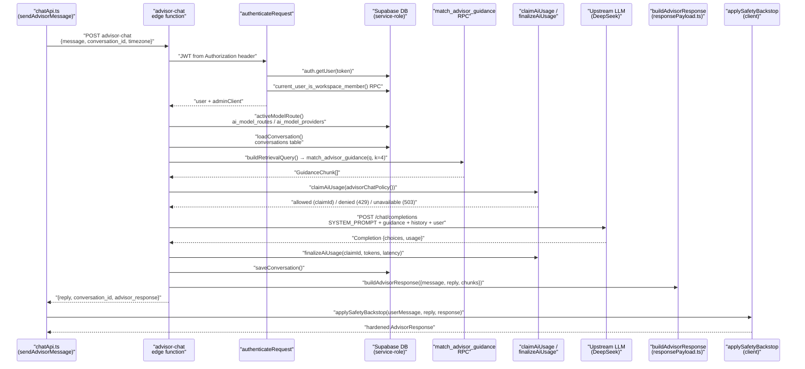
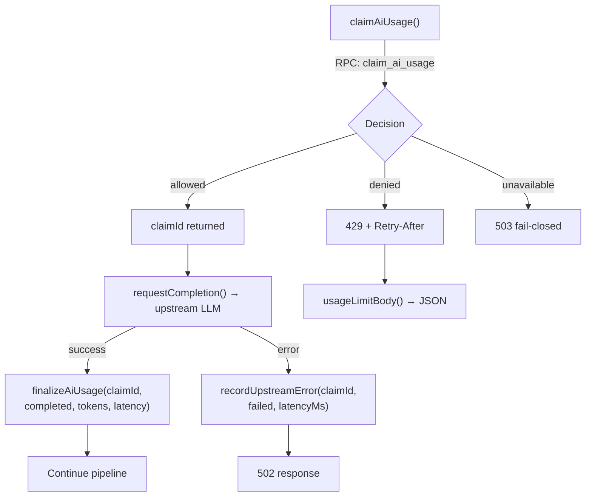
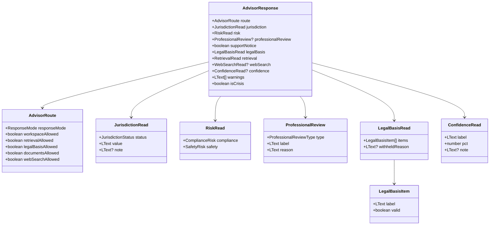
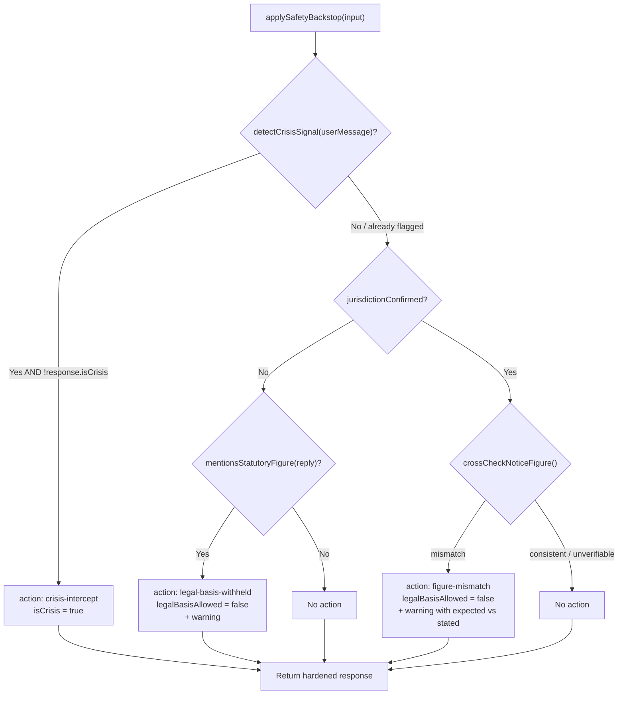
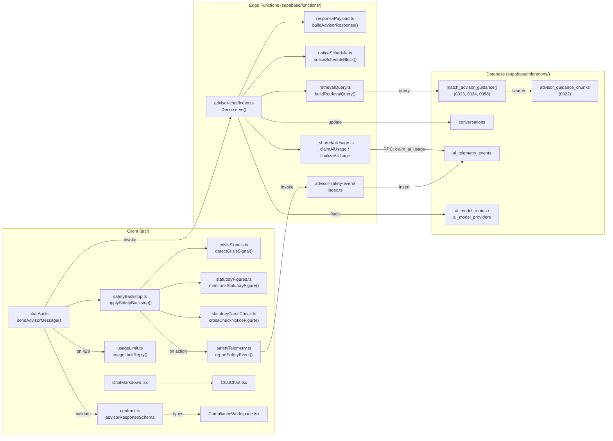

# Advisor Edge Function & Response Contract

<details>
<summary>Relevant source files</summary>

The following files were used as context for generating this wiki page:

- [.oxlintrc.json](.oxlintrc.json)
- [services/attachment-scanner/server.js](services/attachment-scanner/server.js)
- [src/components/advisor/ChatMarkdown.test.tsx](src/components/advisor/ChatMarkdown.test.tsx)
- [src/components/advisor/ChatMarkdown.tsx](src/components/advisor/ChatMarkdown.tsx)
- [src/components/advisor/chatMarkdownUtils.ts](src/components/advisor/chatMarkdownUtils.ts)
- [src/features/app/advisor/chatApi.test.ts](src/features/app/advisor/chatApi.test.ts)
- [src/features/app/advisor/chatApi.ts](src/features/app/advisor/chatApi.ts)
- [src/features/app/advisor/safety/safetyBackstop.test.ts](src/features/app/advisor/safety/safetyBackstop.test.ts)
- [src/features/app/advisor/safety/statutoryCrossCheck.test.ts](src/features/app/advisor/safety/statutoryCrossCheck.test.ts)
- [src/features/app/advisor/safety/statutoryCrossCheck.ts](src/features/app/advisor/safety/statutoryCrossCheck.ts)
- [src/features/app/advisor/safetyTelemetry.test.ts](src/features/app/advisor/safetyTelemetry.test.ts)
- [src/features/app/advisor/safetyTelemetry.ts](src/features/app/advisor/safetyTelemetry.ts)
- [src/features/app/advisor/usageLimit.test.ts](src/features/app/advisor/usageLimit.test.ts)
- [src/features/app/advisor/usageLimit.ts](src/features/app/advisor/usageLimit.ts)
- [src/features/app/guidance/updatesAreStale.ts](src/features/app/guidance/updatesAreStale.ts)
- [src/features/app/toasts/ToastsProvider.tsx](src/features/app/toasts/ToastsProvider.tsx)
- [src/features/app/views/advisor/AdvisorView.test.tsx](src/features/app/views/advisor/AdvisorView.test.tsx)
- [src/features/app/views/advisor/AdvisorView.tsx](src/features/app/views/advisor/AdvisorView.tsx)
- [src/features/app/views/advisor/ChatPane.tsx](src/features/app/views/advisor/ChatPane.tsx)
- [src/features/app/views/cases/CaseDetailView.test.tsx](src/features/app/views/cases/CaseDetailView.test.tsx)
- [src/features/app/views/home/homeData.ts](src/features/app/views/home/homeData.ts)
- [src/i18n/messages/advisorView.ts](src/i18n/messages/advisorView.ts)
- [supabase/functions/advisor-chat/index.ts](supabase/functions/advisor-chat/index.ts)
- [supabase/functions/advisor-chat/noticeSchedule.test.ts](supabase/functions/advisor-chat/noticeSchedule.test.ts)
- [supabase/functions/advisor-chat/responsePayload.test.ts](supabase/functions/advisor-chat/responsePayload.test.ts)
- [supabase/functions/advisor-chat/responsePayload.ts](supabase/functions/advisor-chat/responsePayload.ts)
- [supabase/functions/advisor-safety-event/index.ts](supabase/functions/advisor-safety-event/index.ts)
- [supabase/migrations/0072_flag_trigger_idempotent_guard.sql](supabase/migrations/0072_flag_trigger_idempotent_guard.sql)

</details>

This page documents the `advisor-chat` Supabase edge function — the server-side pipeline that turns a user message into a grounded, metered, deterministically-annotated AI reply — and the `AdvisorResponse` contract that bridges the server payload to the client-side Compliance Workspace. It also covers the rendering layer (`ChatMarkdown`, `ChatChart`) that presents model output.

## End-to-End Pipeline Overview

**Pipeline stages diagram**



Sources: [supabase/functions/advisor-chat/index.ts:434-554](), [src/features/app/advisor/chatApi.ts:90-131]()

## Authentication & Authorization

The edge function requires a bearer JWT in the `Authorization` header. Two checks gate access:

1. **Token validation** — `auth.getUser(token)` via a user-scoped Supabase client verifies the JWT is valid and extracts the user identity. [supabase/functions/advisor-chat/index.ts:236-249]()
2. **Workspace membership** — `current_user_is_workspace_member()` RPC, called through the user's own JWT client so the RPC resolves `auth.jwt()` correctly. This is the same invite-only gate used by `AuthProvider` client-side and by RLS policies (migration 0026). [supabase/functions/advisor-chat/index.ts:258-263]()

On success, a service-role `adminClient` is created for all subsequent DB operations (bypasses RLS). [supabase/functions/advisor-chat/index.ts:265]()

Sources: [supabase/functions/advisor-chat/index.ts:236-266]()

## Request Parsing

`readChatRequest()` extracts four fields from the JSON body:

| Field             | Type             | Required | Purpose                                   |
| ----------------- | ---------------- | -------- | ----------------------------------------- |
| `message`         | `string`         | Yes      | The user's current message                |
| `conversation_id` | `string \| null` | No       | Existing conversation to continue         |
| `organization_id` | `string \| null` | No       | Tenant scope for the conversation         |
| `timezone`        | `string \| null` | No       | IANA timezone for the system prompt clock |

The client sends the timezone via `Intl.DateTimeFormat().resolvedOptions().timeZone`. [src/features/app/advisor/chatApi.ts:100-106]()

The `currentTimeLine()` helper validates the timezone with `Intl.DateTimeFormat` (invalid values fall back to UTC) and formats a human-readable date/time string injected into the system prompt so the model knows the correct time of day. [supabase/functions/advisor-chat/index.ts:87-103]()

Sources: [supabase/functions/advisor-chat/index.ts:268-283](), [src/features/app/advisor/chatApi.ts:100-106]()

## Model Route Resolution

`activeModelRoute()` queries `ai_model_routes` joined with `ai_model_providers` for the highest-priority active route with `route_key = 'advisor_chat'`. [supabase/functions/advisor-chat/index.ts:285-302]()

The returned `ActiveModelRoute` carries:

| Interface       | Fields                                               | Source                     |
| --------------- | ---------------------------------------------------- | -------------------------- |
| `ModelRoute`    | `model_name`, `config` (`max_tokens`, `temperature`) | `ai_model_routes` table    |
| `ModelProvider` | `provider_key`, `base_url`, `secret_ref`, `status`   | `ai_model_providers` table |

Temperature is DB-tunable — some reasoning models reject `temperature != 1`, so this avoids a redeploy. [supabase/functions/advisor-chat/index.ts:382-386]()

Sources: [supabase/functions/advisor-chat/index.ts:129-147](), [supabase/functions/advisor-chat/index.ts:285-302]()

## Conversation Load / Create

`loadConversation()` either loads an existing conversation (by `id` + `user_id` ownership check) or inserts a fresh row into the `conversations` table with an empty `messages` array. [supabase/functions/advisor-chat/index.ts:304-328]()

The full transcript is persisted in the `conversations.messages` JSONB column. However, the prompt sent upstream is capped to the last 20 messages (10 exchange pairs) to bound cost, latency, and context window overflow. [supabase/functions/advisor-chat/index.ts:454-459]()

Sources: [supabase/functions/advisor-chat/index.ts:304-328](), [supabase/functions/advisor-chat/index.ts:454-459]()

## Retrieval: `match_advisor_guidance` RPC

### Corpus Table

The `advisor_guidance_chunks` table stores the curated grounding corpus — one row per reviewable fact-chunk with jurisdiction, topic, official source URL, and a `review_status` column (`machine_curated` | `reviewed`). Full-text search uses an `fts` tsvector column generated from `title || ' ' || content` using the `english` configuration. [supabase/migrations/0022_advisor_guidance_chunks.sql:13-33]()

### Query Building

`buildRetrievalQuery()` concatenates the previous user turn (up to 400 chars) with the current message so follow-up questions like "and after 5 years?" still carry the lexemes that found the right chunk one turn earlier. Only user messages are included — assistant replies are excluded to prevent corpus vocabulary from echoing itself. [supabase/functions/advisor-chat/retrievalQuery.ts:27-33]()

### The RPC

`match_advisor_guidance(q, k)` (migration 0023, refined in 0024 and 0058) tokenizes the query into lexemes, single-quotes each one (to escape tsquery metacharacters from URLs), OR-joins them, and ranks results by `ts_rank`. Only `status = 'active'` chunks participate. Results are capped at `k` (default 4, max 8). [supabase/migrations/0023_match_advisor_guidance.sql:14-38]()

Migration 0024 added `topic` and `review_status` to the return columns for the structured payload. [supabase/migrations/0024_match_advisor_guidance_review_topic.sql:11-41]()

### Retrieval Error Handling

`retrieveGuidance()` wraps the RPC call; on any error it returns `{ chunks: [], failed: true }`. The `failed` flag is distinct from a genuine zero-hit — the structured payload and telemetry say "retrieval was unavailable" instead of "nothing matched" (this conflation hid the 0058 tsquery bug for ten days). [supabase/functions/advisor-chat/index.ts:189-207]()

### Guidance Block Formatting

Retrieved chunks are formatted into a prompt block by `guidanceBlock()`, instructing the model to treat them as the ONLY authoritative basis for statutory figures that turn. [supabase/functions/advisor-chat/index.ts:209-224]()

Sources: [supabase/migrations/0022_advisor_guidance_chunks.sql:13-33](), [supabase/migrations/0023_match_advisor_guidance.sql:14-38](), [supabase/migrations/0024_match_advisor_guidance_review_topic.sql:11-41](), [supabase/functions/advisor-chat/retrievalQuery.ts:27-33](), [supabase/functions/advisor-chat/index.ts:189-224]()

## Notice Schedule Injection

When the turn is recognizably an Ontario notice question, `noticeScheduleBlock()` injects the ESA s.57 statutory notice ladder directly into the system prompt as authoritative. This ensures the figure is looked up, not generated from parametric memory. [supabase/functions/advisor-chat/noticeSchedule.ts:81-102]()

Detection uses `isNoticeQuestion()` (matches termination/notice terms in both languages) combined with `detectJurisdictions()` checking for `'ON'`. Québec and Federal schedules are not injected until their bands pass legal review. [supabase/functions/advisor-chat/noticeSchedule.ts:52-74]()

The Ontario bands are mirrored from the client's `statutoryNotice.ts`, pinned by a drift test in `noticeSchedule.test.ts`. [supabase/functions/advisor-chat/noticeSchedule.test.ts:20-33]()

```
ONTARIO_NOTICE_BANDS (ESA, 2000 s.57):
  0–2 months:   0 weeks     3–11 months:  1 week
  12–35 months: 2 weeks     36–47 months: 3 weeks
  48–59 months: 4 weeks     60–71 months: 5 weeks
  72–83 months: 6 weeks     84–95 months: 7 weeks
  96+ months:   8 weeks
```

Sources: [supabase/functions/advisor-chat/noticeSchedule.ts:29-102](), [supabase/functions/advisor-chat/noticeSchedule.test.ts:20-33]()

## AI Usage Metering (Claim / Finalize)

Usage metering gates upstream calls during the beta. The mechanism lives in `_shared/aiUsage.ts` and uses a claim-then-finalize pattern:

**Metering flow diagram**



Sources: [supabase/functions/_shared/aiUsage.ts:177-204](), [supabase/functions/_shared/aiUsage.ts:222-243]()

### Policy Ceilings

`advisorChatPolicy()` defines the ceilings for the `chat` operation. All values are env-overridable:

| Ceiling        | Default     | Env Var                                           | Scope                              |
| -------------- | ----------- | ------------------------------------------------- | ---------------------------------- |
| Burst          | 10 per 300s | `AI_BURST_LIMIT_CHAT` / `AI_BURST_WINDOW_SECONDS` | Per-user, per-operation            |
| Daily requests | 120         | `AI_DAILY_REQUEST_LIMIT`                          | Per-user, shared across operations |
| Daily tokens   | 250,000     | `AI_DAILY_TOKEN_LIMIT`                            | Per-user, shared                   |
| Platform daily | 2,000       | `AI_PLATFORM_DAILY_LIMIT`                         | All users combined                 |

[supabase/functions/_shared/aiUsage.ts:74-103]()

A claim that is never finalized (function timeout) stays `started` and keeps counting — fail-safe over-counting. Failed upstream calls are deliberately NOT refunded: a client hammering a broken provider is exactly what the burst ceiling prevents. [supabase/functions/advisor-chat/index.ts:330-347]()

### Client-Side Usage Limit Handling

A 429 response becomes an `AdvisorUsageLimitError` on the client, carrying `scope` and `retryAfterSeconds`. [src/features/app/advisor/chatApi.ts:35-73]() The `usageLimitReply()` function converts it to a bilingual user-facing message with deliberately vague wait phrasing ("about 20 minutes") — rounding is always up. [src/features/app/advisor/usageLimit.ts:25-59]()

Sources: [supabase/functions/_shared/aiUsage.ts:87-103](), [supabase/functions/advisor-chat/index.ts:330-347](), [supabase/functions/advisor-chat/index.ts:468-495](), [src/features/app/advisor/chatApi.ts:35-73](), [src/features/app/advisor/usageLimit.ts:25-59]()

## Upstream LLM Call

`requestCompletion()` fetches `{provider.base_url}/chat/completions` with the assembled messages array:

1. **System message**: `SYSTEM_PROMPT` + `currentTimeLine(timezone)` + guidance block + notice schedule block
2. **History**: last 20 messages from the conversation
3. **User message**: the current turn

The `SYSTEM_PROMPT` instructs the model to be a compliance-oriented HR assistant for Canadian employers, with explicit rules about statutory precision (never cite section numbers from memory), factual grounding (correct inaccurate statements), and formatting (GFM tables, `chart` fenced blocks, no raw HTML). [supabase/functions/advisor-chat/index.ts:43-80]()

The API key is read from the Deno env using the provider's `secret_ref`. [supabase/functions/advisor-chat/index.ts:359]()

Sources: [supabase/functions/advisor-chat/index.ts:43-80](), [supabase/functions/advisor-chat/index.ts:349-397]()

## Conversation Save & Telemetry

After the LLM responds:

1. **`recordCompletion()`** — stamps the claimed `ai_telemetry_events` row with `status: 'completed'`, token counts, latency, and retrieval metadata (`retrieved_chunks`, `retrieval_failed`). This runs BEFORE conversation save so tokens are recorded even if the write fails. [supabase/functions/advisor-chat/index.ts:414-432]()

2. **`saveConversation()`** — updates the `conversations` row with the full message history (including the new user + assistant turns) and `updated_at`. [supabase/functions/advisor-chat/index.ts:399-409]()

Sources: [supabase/functions/advisor-chat/index.ts:517-533]()

## The `AdvisorResponse` Contract

### Zod Schema (`contract.ts`)

The `advisorResponseSchema` is the single source of truth for the structured payload shape. It is defined with Zod in the client at [src/features/app/advisor/contract.ts:138-154]() and validated by the client on every response. The server builds a payload that must conform to this schema.

**Contract entity diagram**



Sources: [src/features/app/advisor/contract.ts:1-170]()

### Key Enums

| Enum                     | Values                                                                  | Defined at                                     |
| ------------------------ | ----------------------------------------------------------------------- | ---------------------------------------------- |
| `ResponseMode`           | `hr`, `escalation`, `supportive`                                        | [src/features/app/advisor/contract.ts:21]()    |
| `JurisdictionStatus`     | `known`, `assumed`, `unknown`, `conflict`, `not_applicable`             | [src/features/app/advisor/contract.ts:24-30]() |
| `ComplianceRisk`         | `low`, `medium`, `high`, `critical`                                     | [src/features/app/advisor/contract.ts:33]()    |
| `SafetyRisk`             | `none`, `watch`, `urgent`, `critical`                                   | [src/features/app/advisor/contract.ts:36]()    |
| `ProfessionalReviewType` | `hr`, `legal`, `medical`, `union`, `emergency`                          | [src/features/app/advisor/contract.ts:39]()    |
| `WebAuthority`           | `legislation`, `official`, `regulator`, `court`, `secondary`, `general` | [src/features/app/advisor/contract.ts:43-50]() |

### `LText` Boundary Form

Strings in the contract use `LText` — a union of plain `string` and `{ en: string, fr: string }`. The live engine may return a single localized string; fixtures ship bilingual pairs. [src/features/app/advisor/contract.ts:53-54]()

### Gate Semantics (`allowedSurfaces`)

The `allowedSurfaces()` function is the single gating check every consumer must go through. When `isCrisis` is true, ALL gates are forced off. [src/features/app/advisor/contract.ts:161-170]()

```
workspace  = !isCrisis && route.workspaceAllowed
retrieval  = !isCrisis && route.retrievalAllowed
legalBasis = !isCrisis && route.legalBasisAllowed
documents  = !isCrisis && route.documentsAllowed
webSearch  = !isCrisis && route.webSearchAllowed
```

Sources: [src/features/app/advisor/contract.ts:161-170]()

## `buildAdvisorResponse` — The Server Payload Builder

Defined in `responsePayload.ts`, this function is **pure and deterministic** — routing, gates, risk, jurisdiction, legal basis and confidence are computed from the user's message, retrieved corpus chunks, and the reply prose. The model is never asked for these values. [supabase/functions/advisor-chat/responsePayload.ts:1-21]()

### Response Modes

| Mode             | Trigger                                               | Effect                                                                                                       |
| ---------------- | ----------------------------------------------------- | ------------------------------------------------------------------------------------------------------------ |
| **`supportive`** | Crisis detected (`detectsCrisis`)                     | All gates off, `supportNotice: true`, safety risk `critical`, professional review → `medical` (EAP referral) |
| **`escalation`** | Escalation terms (harassment, violence, threat, etc.) | Safety risk `watch`, compliance `high`, professional review → `legal`, documents gate OFF                    |
| **`hr`**         | Default (no crisis, no escalation)                    | Standard compliance gates, documents allowed                                                                 |

[supabase/functions/advisor-chat/responsePayload.ts:281-338](), [supabase/functions/advisor-chat/responsePayload.ts:337-338]()

### Jurisdiction Detection

`detectJurisdictions()` normalizes the message and pattern-matches against jurisdiction-specific terms. Bare two-letter codes are deliberately excluded — "on" is a common English word. [supabase/functions/advisor-chat/responsePayload.ts:207-229]()

| Code  | Match Terms                                                                                |
| ----- | ------------------------------------------------------------------------------------------ |
| `ON`  | `ontario`, `employment standards act`, `esa` (bounded), `ohsa`                             |
| `QC`  | `quebec`, `cnesst`, `normes du travail`, `lnt`, `charte des droits`                        |
| `FED` | `federally regulated`, `canada labour code`, `code canadien du travail`, `interprovincial` |

Jurisdiction status resolution:

- 1 match → `known`
- 2+ matches → `conflict`
- 0 matches → `unknown`

[supabase/functions/advisor-chat/responsePayload.ts:340-343]()

### Risk Classification

| Level    | Trigger terms                                                                                               |
| -------- | ----------------------------------------------------------------------------------------------------------- |
| `high`   | `HIGH_RISK_TERMS` — termination, dismissal, severance, discipline, accommodation, plus all escalation terms |
| `medium` | `MEDIUM_RISK_TERMS` — overtime, vacation, minimum wage, holiday, leave, pay                                 |
| `low`    | Default (no risk terms detected)                                                                            |

[supabase/functions/advisor-chat/responsePayload.ts:154-197]()

### Legal Basis Gating

Legal basis is allowed ONLY when jurisdiction is confirmed AND the corpus grounded the turn (`chunks.length > 0`). A citation item is `valid` only when `review_status === 'reviewed'` AND `source_changed_at` is null (the law monitor stamps this field when a source changes post-curation). [supabase/functions/advisor-chat/responsePayload.ts:354-375]()

### Confidence Score

Confidence tracks grounding quality, never model self-assessment:

```
pct = min(88, 20 + (jurisdictionConfirmed ? 30 : 0) + min(chunks.length, 4) × 10)
```

| pct range | Label    |
| --------- | -------- |
| ≥ 70      | High     |
| 45–69     | Moderate |
| < 45      | Low      |

[supabase/functions/advisor-chat/responsePayload.ts:436-445]()

Sources: [supabase/functions/advisor-chat/responsePayload.ts:277-533]()

## Client-Side Safety Backstop

After the server payload is parsed and validated against `advisorResponseSchema`, the client applies `applySafetyBackstop()` as defense-in-depth. The rules are **monotonic — they can only tighten** gates, never loosen them. [src/features/app/advisor/safety/safetyBackstop.ts:1-19]()

**Safety backstop decision flow**



The three safety actions are:

| Action                 | Trigger                                                      | Effect                                                 |
| ---------------------- | ------------------------------------------------------------ | ------------------------------------------------------ |
| `crisis-intercept`     | Client's `detectCrisisSignal` catches what the server missed | Sets `isCrisis: true`, all gates OFF                   |
| `legal-basis-withheld` | Reply contains statutory figure + jurisdiction unknown       | `legalBasisAllowed: false` + warning                   |
| `figure-mismatch`      | Stated Ontario notice figure ≠ encoded ESA schedule          | `legalBasisAllowed: false` + warning with both numbers |

When any action fires, `reportSafetyEvent()` sends a fire-and-forget call to the `advisor-safety-event` edge function, which records an `ai_telemetry_events` row with `operation = 'safety_backstop'`. [src/features/app/advisor/safetyTelemetry.ts:11-23](), [supabase/functions/advisor-safety-event/index.ts:146-158]()

Sources: [src/features/app/advisor/safety/safetyBackstop.ts:93-155](), [src/features/app/advisor/chatApi.ts:109-131](), [src/features/app/advisor/safetyTelemetry.ts:11-23]()

### Statutory Cross-Check Detail

`crossCheckNoticeFigure()` in `statutoryCrossCheck.ts` extracts tenure from the user message and reply (pooled), extracts notice-weeks claims from the reply using adjacency-aware patterns (e.g., "8 weeks of notice" but NOT just any number near the word "notice"), and compares against `lookupStatutoryNoticeWeeks()`. Only Ontario is currently encoded; QC/FED return `unverifiable`. [src/features/app/advisor/safety/statutoryCrossCheck.ts:158-194]()

Sources: [src/features/app/advisor/safety/statutoryCrossCheck.ts:1-194]()

## Compliance Workspace Rendering

The `ComplianceWorkspace` component renders the structured payload as a 384px right panel at `≥1024px` (`lg`); below that breakpoint the same content opens as a full-screen sheet from the chat header pill. [src/features/app/views/advisor/ComplianceWorkspace.tsx:43-60]()

### Workspace State Kinds

```typescript
type WorkspaceState =
  | { kind: 'locked' } // Signed out — preview mode with sign-in form
  | { kind: 'idle' } // Thread open, no engine turn yet
  | { kind: 'running' } // Routing skeleton while LLM is thinking
  | { kind: 'ready'; response: AdvisorResponse; provincePrompt?: boolean }
```

[src/features/app/views/advisor/ComplianceWorkspace.tsx:45-49]()

The `ReadyState` component consults `allowedSurfaces()` and renders each section conditionally. Gate pills show on/off status for all five gates. [src/features/app/views/advisor/ComplianceWorkspace.tsx:269-287]()

Sources: [src/features/app/views/advisor/ComplianceWorkspace.tsx:45-49](), [src/features/app/views/advisor/ComplianceWorkspace.tsx:131-195](), [src/features/app/views/advisor/ComplianceWorkspace.tsx:269-287]()

## `ChatMarkdown` — Reply Rendering

`ChatMarkdown` renders model replies using `react-markdown` with `remark-gfm`. It supports GFM tables (with mobile card layout via `data-label` attributes), headings, lists, links (opened in new tab with `rel="noopener noreferrer nofollow"`), images, code blocks, and `chart` fenced blocks. [src/components/advisor/ChatMarkdown.tsx:1-251]()

**Raw HTML is NOT rendered** — `rehype-raw` is deliberately omitted to prevent model output from injecting markup. [src/components/advisor/ChatMarkdown.tsx:22-24]()

### Streaming Table Suppression

During streaming, `hideIncompleteTable()` hides trailing pipe-row fragments that have no separator row yet, preventing the visual flicker of raw pipes snapping into a table. [src/components/advisor/chatMarkdownUtils.ts:9-20]()

Sources: [src/components/advisor/ChatMarkdown.tsx:238-251](), [src/components/advisor/chatMarkdownUtils.ts:9-20]()

## `ChatChart` — Fenced Chart Blocks

The system prompt instructs the model to emit a ` ```chart ` fenced block containing a JSON `ChartSpec` for comparative data. `ChatChart` is code-split via `React.lazy()` (recharts + d3 tree is ~420 KB) and loaded on demand only when a reply contains a chart block. [src/components/advisor/ChatMarkdown.tsx:47-54]()

### Chart Spec Format

```typescript
interface ChartSpec {
  type?: 'bar' | 'hbar' | 'line' | 'area' | 'donut'
  title?: string
  x?: string // category axis key
  format?: { prefix?: string; suffix?: string; decimals?: number }
  series?: { key: string; label?: string }[]
  data?: Array<Record<string, string | number>>
}
```

[src/components/advisor/ChatChart.tsx:62-70]()

| Type    | Use case                    | Notes                                     |
| ------- | --------------------------- | ----------------------------------------- |
| `bar`   | Magnitude across categories | Direct labels for single series ≤ 8 items |
| `hbar`  | Same, with long labels      | Dynamic height based on data count        |
| `line`  | Change over time            | Monotone interpolation                    |
| `area`  | Change over time, filled    | 12% fill opacity                          |
| `donut` | Parts of a whole            | Inner radius 58%, outer 82%               |

Every chart includes a **"Show data" toggle** that reveals a fully accessible data table — identity is never carried by color alone. Malformed JSON falls back to a `<code className="cm-codeblock">` preformatted block. [src/components/advisor/ChatChart.tsx:158-169](), [src/components/advisor/ChatChart.tsx:347-354]()

Sources: [src/components/advisor/ChatChart.tsx:1-395]()

## Full Data Flow: Code Entity Map

**Bridging diagram — file-to-pipeline mapping**



Sources: [supabase/functions/advisor-chat/index.ts:1-11](), [src/features/app/advisor/chatApi.ts:1-7](), [src/features/app/advisor/safety/safetyBackstop.ts:1-7]()

## Drift Guards

Several mirrored data structures span the client/server boundary. Each is pinned by a dedicated drift test:

| Data                 | Client copy                           | Server copy                              | Drift test                                                  |
| -------------------- | ------------------------------------- | ---------------------------------------- | ----------------------------------------------------------- |
| Crisis phrases       | `crisisSignals.ts#CRISIS_PHRASES`     | `responsePayload.ts#CRISIS_PHRASES`      | `responsePayload.test.ts` (imports both)                    |
| Ontario notice bands | `statutoryNotice.ts#NOTICE_SCHEDULES` | `noticeSchedule.ts#ONTARIO_NOTICE_BANDS` | `noticeSchedule.test.ts`                                    |
| Jurisdiction labels  | `contract.ts` (via Zod)               | `responsePayload.ts#JURISDICTION_VALUE`  | `safetyBackstop.test.ts`                                    |
| Response shape       | `advisorResponseSchema` (Zod)         | `buildAdvisorResponse` output            | `responsePayload.test.ts` (parses every output through Zod) |

Sources: [supabase/functions/advisor-chat/responsePayload.test.ts:28-35](), [supabase/functions/advisor-chat/noticeSchedule.test.ts:20-33](), [src/features/app/advisor/safety/safetyBackstop.test.ts:101-123]()

---
