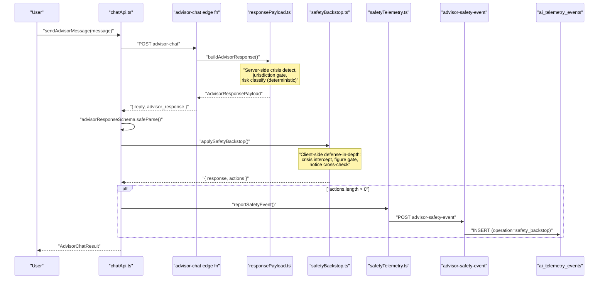
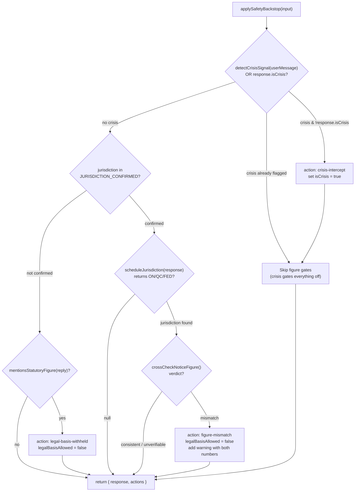
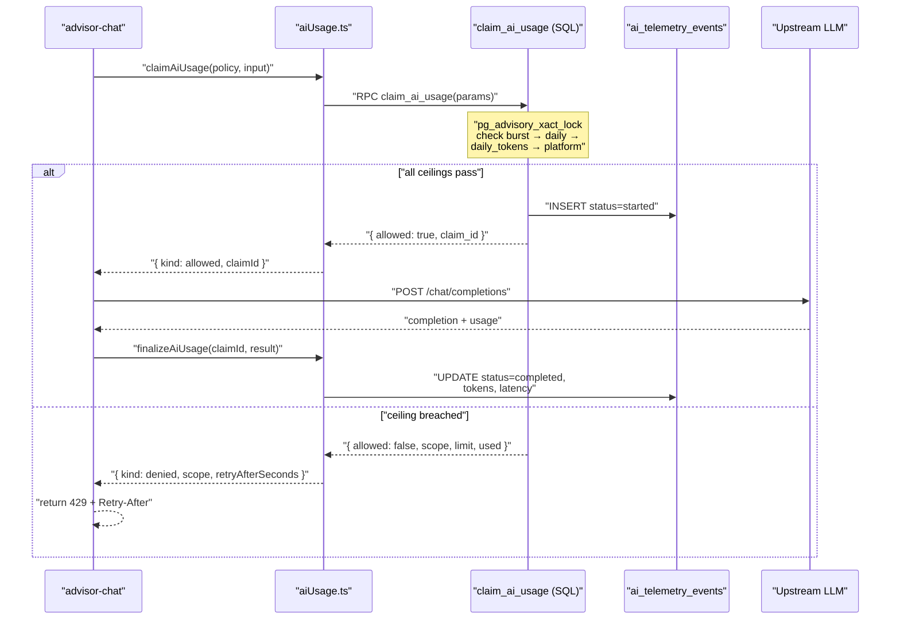

# Advisor Safety & Guardrails

<details>
<summary>Relevant source files</summary>

The following files were used as context for generating this wiki page:

- [docs/AI_USAGE_STRATEGY.md](docs/AI_USAGE_STRATEGY.md)
- [docs/LAW_MONITORING.md](docs/LAW_MONITORING.md)
- [docs/advisor-corpus-review-pack-ontario.md](docs/advisor-corpus-review-pack-ontario.md)
- [src/features/app/advisor/safety/crisisSignals.test.ts](src/features/app/advisor/safety/crisisSignals.test.ts)
- [src/features/app/advisor/safety/crisisSignals.ts](src/features/app/advisor/safety/crisisSignals.ts)
- [src/features/app/advisor/safety/crisisSignalsDrift.test.ts](src/features/app/advisor/safety/crisisSignalsDrift.test.ts)
- [src/features/app/advisor/safety/index.ts](src/features/app/advisor/safety/index.ts)
- [src/features/app/advisor/safety/safetyBackstop.test.ts](src/features/app/advisor/safety/safetyBackstop.test.ts)
- [src/features/app/advisor/safety/safetyBackstop.ts](src/features/app/advisor/safety/safetyBackstop.ts)
- [src/features/app/advisor/safety/statutoryCrossCheck.test.ts](src/features/app/advisor/safety/statutoryCrossCheck.test.ts)
- [src/features/app/advisor/safety/statutoryCrossCheck.ts](src/features/app/advisor/safety/statutoryCrossCheck.ts)
- [src/features/app/advisor/safety/statutoryFigures.test.ts](src/features/app/advisor/safety/statutoryFigures.test.ts)
- [src/features/app/advisor/safety/statutoryFigures.ts](src/features/app/advisor/safety/statutoryFigures.ts)
- [src/features/app/advisor/safety/statutoryNotice.test.ts](src/features/app/advisor/safety/statutoryNotice.test.ts)
- [src/features/app/advisor/safetyTelemetry.test.ts](src/features/app/advisor/safetyTelemetry.test.ts)
- [src/features/app/advisor/safetyTelemetry.ts](src/features/app/advisor/safetyTelemetry.ts)
- [supabase/functions/advisor-chat/responsePayload.ts](supabase/functions/advisor-chat/responsePayload.ts)
- [supabase/functions/advisor-safety-event/index.ts](supabase/functions/advisor-safety-event/index.ts)
- [supabase/functions/monitor-law-changes/index.ts](supabase/functions/monitor-law-changes/index.ts)
- [supabase/functions/support-call-scheduler/index.ts](supabase/functions/support-call-scheduler/index.ts)
- [supabase/migrations/0049_cron_trigger_shared_secret.sql](supabase/migrations/0049_cron_trigger_shared_secret.sql)
- [supabase/migrations/0072_flag_trigger_idempotent_guard.sql](supabase/migrations/0072_flag_trigger_idempotent_guard.sql)

</details>

The Advisor safety system is a **deterministic rule layer** that runs on every advisor turn — both server-side (inside the `advisor-chat` edge function) and client-side (after the response arrives). Its design principle, codified in `docs/AI_USAGE_STRATEGY.md`, is: _"the LLM proposes, deterministic code disposes."_ Routing, risk classification, jurisdiction gating, crisis detection, and statutory figure verification are never delegated to the model.

This page covers three subsystems:

1. **Safety backstop** — the client-side rule layer that monotonically tightens the engine's structured response
2. **Server-side deterministic payload** — the `buildAdvisorResponse` function that computes all structured fields without consulting the model
3. **AI usage metering** — the claim/finalize guardrail that bounds model calls during the beta

## Architecture Overview

**Safety layer data flow**



Sources: [src/features/app/advisor/chatApi.ts:90-131](), [supabase/functions/advisor-chat/index.ts:538-553](), [src/features/app/advisor/safetyTelemetry.ts:1-23](), [supabase/functions/advisor-safety-event/index.ts:132-159]()

## Module Structure

The safety code is organized into a self-contained module at `src/features/app/advisor/safety/` with a barrel export:

| File                         | Role                                                                                                    |
| ---------------------------- | ------------------------------------------------------------------------------------------------------- |
| `index.ts`                   | Barrel export — re-exports all public symbols                                                           |
| `text.ts`                    | `normalizeText()` — locale-tolerant normalization (NFD, strip diacritics/apostrophes, lowercase)        |
| `crisisSignals.ts`           | `detectCrisisSignal()` + `CRISIS_PHRASES` — bilingual self-harm phrase matching                         |
| `statutoryFigures.ts`        | `mentionsStatutoryFigure()` — detects notice/severance/dollar/percentage figures with statutory context |
| `statutoryNotice.ts`         | `lookupStatutoryNoticeWeeks()` + `NOTICE_SCHEDULES` — Ontario ESA s.57 notice table                     |
| `statutoryCrossCheck.ts`     | `crossCheckNoticeFigure()` — verifies a stated notice figure against the encoded schedule               |
| `safetyBackstop.ts`          | `applySafetyBackstop()` — the orchestrator that runs all rules and returns a hardened response          |
| `crisisSignalsDrift.test.ts` | Drift guard enforcing client/server phrase-list sync                                                    |

Sources: [src/features/app/advisor/safety/index.ts:1-21]()

## Crisis Intercept (`detectCrisisSignal`)

The crisis intercept is the highest-priority safety rule. It detects first-person self-harm signals in user messages using a **maintained, bilingual phrase list** — never model-generated. When triggered, it routes the response to `supportive` mode with all structured surfaces gated off, and the 9-8-8 Suicide Crisis Helpline resource is surfaced.

### How It Works

`detectCrisisSignal` in [src/features/app/advisor/safety/crisisSignals.ts:74-78]() normalizes the input via `normalizeText()` and checks for substring matches against `CRISIS_PHRASES` — 35 phrases covering English and French:

```
kill myself, ending my life, suicidal, cant go on, ...
me suicider, suicidaire, envie de mourir, plus envie de vivre, ...
```

All phrases are stored **pre-normalized** (lowercase, no accents, no apostrophes) so normalization is idempotent on them.

Sources: [src/features/app/advisor/safety/crisisSignals.ts:31-71](), [src/features/app/advisor/safety/text.ts:11-19]()

### Dual-Side Detection

Crisis detection runs on **both** client and server. The server copy is `detectsCrisis()` in `responsePayload.ts` with an identical `CRISIS_PHRASES` array and `normalize()` function. The two lists are kept in sync by a drift test:

| Invariant                                                    | Enforcement                                  |
| ------------------------------------------------------------ | -------------------------------------------- |
| Phrase sets are byte-identical                               | `crisisSignalsDrift.test.ts` compares arrays |
| No duplicate phrases on either side                          | Set-size check                               |
| Every phrase is stable under its own normalizer              | `normalizeText(phrase) === phrase` for all   |
| `normalizeText()` and `normalize()` produce identical output | Cross-tested with representative samples     |

The union of both detectors wins — if either side detects crisis, the flag is raised. This is the **fail-safe-on** rule: a model that fails to flag crisis cannot suppress the intercept.

Sources: [src/features/app/advisor/safety/crisisSignalsDrift.test.ts:1-55](), [supabase/functions/advisor-chat/responsePayload.ts:70-130]()

### Server-Side Crisis Response

When the server's `buildAdvisorResponse` detects a crisis, it returns a fully-gated payload — every `*Allowed` flag is `false`, `isCrisis` is `true`, `responseMode` is `'supportive'`, and `professionalReview` recommends EAP referral:

```
route.workspaceAllowed = false
route.retrievalAllowed = false
route.legalBasisAllowed = false
route.documentsAllowed = false
risk.safety = 'critical'
isCrisis = true
```

Sources: [supabase/functions/advisor-chat/responsePayload.ts:277-335]()

## Safety Backstop (`applySafetyBackstop`)

The safety backstop is the **client-side defense-in-depth layer** defined in [src/features/app/advisor/safety/safetyBackstop.ts:93-155](). It runs after the engine response is received and Zod-validated, but before the Compliance Workspace renders it. It is wired in `chatApi.ts` at [src/features/app/advisor/chatApi.ts:113-125]().

### Core Design: Monotonic Tightening

The rules are **monotonic** — they can only tighten a gate, never loosen one. The worst case is an over-cautious turn. The three possible `SafetyAction` values are:

| Action                 | Rule                                                                     | Effect                                                                    |
| ---------------------- | ------------------------------------------------------------------------ | ------------------------------------------------------------------------- |
| `crisis-intercept`     | User message matches a crisis phrase but engine's `isCrisis` is `false`  | Sets `isCrisis = true`                                                    |
| `legal-basis-withheld` | Reply mentions a statutory figure but jurisdiction is not confirmed      | Sets `legalBasisAllowed = false`, adds `withheldReason` and warning       |
| `figure-mismatch`      | A notice figure in the reply disagrees with the encoded Ontario schedule | Sets `legalBasisAllowed = false`, adds mismatch warning with both numbers |

When no rule fires, `applySafetyBackstop` returns the **same object reference** — the caller can cheaply check `result.response === input.response`.

Sources: [src/features/app/advisor/safety/safetyBackstop.ts:21-37](), [src/features/app/advisor/safety/safetyBackstop.ts:93-155]()

### Rule Execution Order

**Backstop rule evaluation**



Sources: [src/features/app/advisor/safety/safetyBackstop.ts:98-154]()

### Jurisdiction Confirmation

A jurisdiction status is considered "confirmed" when it is one of: `'known'`, `'assumed'`, or `'not_applicable'`. This is defined by the `JURISDICTION_CONFIRMED` set at [src/features/app/advisor/safety/safetyBackstop.ts:40-44]().

The `scheduleJurisdiction` helper maps the engine's display-string jurisdiction value (e.g. `"Ontario · Provincially regulated"`) back to a schedule code (`'ON'`, `'QC'`, `'FED'`) by prefix-matching. This mapping is tested against the `JURISDICTION_VALUE` constants exported from `responsePayload.ts` — a drift test ensures changes to the server labels break the test, not silently disarm the cross-check.

Sources: [src/features/app/advisor/safety/safetyBackstop.ts:79-87](), [src/features/app/advisor/safety/safetyBackstop.test.ts:97-123]()

## Statutory Figure Detection (`mentionsStatutoryFigure`)

Defined in [src/features/app/advisor/safety/statutoryFigures.ts:68-72](), this function detects when a reply appears to state a statutory figure. It requires the **co-occurrence** of:

1. **A numeric pattern** — one of four regex patterns:
   - `DURATION`: e.g. "8 weeks", "3 mois"
   - `DAY_COUNT`: e.g. "10 days", "3 jours"
   - `DOLLAR`: e.g. "$17.60", "2.5 million"
   - `PERCENT`: e.g. "4%", "6 per cent", "4 pour cent"

2. **A statutory context term** — from a list of 22 bilingual terms including `notice`, `severance`, `minimum`, `wage`, `vacation`, `preavis`, `indemnite`, `conge`, etc.

Both conditions must be met — a bare number without statutory context does not trigger, and statutory context without a figure does not trigger. This prevents false positives on messages like "she started 3 months ago" or "here is some general guidance on notice".

Sources: [src/features/app/advisor/safety/statutoryFigures.ts:24-72](), [src/features/app/advisor/safety/statutoryFigures.test.ts:1-50]()

## Statutory Notice Cross-Check (`crossCheckNoticeFigure`)

The cross-check at [src/features/app/advisor/safety/statutoryCrossCheck.ts:158-191]() is the **verification half** of §5.2. It compares a notice-period figure stated in the model's reply against the encoded statutory schedule.

### Prerequisites for a Check

The check requires all of:

1. **A known jurisdiction** with a populated schedule (Ontario only; QC/FED are `null` pending legal review)
2. **Exactly one distinct tenure value** extractable from the turn (user message + reply pooled)
3. **At least one notice-period claim** with a notice noun adjacent to it

If any prerequisite is missing, the verdict is `'unverifiable'` — the system never guesses.

### Tenure Extraction (`extractTenureMonths`)

`extractTenureMonths` at [src/features/app/advisor/safety/statutoryCrossCheck.ts:112-119]() pools tenure candidates from all provided texts. A tenure candidate requires:

- A duration pattern (years/months) with **tenure context** within a 40-character window: terms like `service`, `employment`, `employed`, `tenure`, `anciennete`, etc.
- Or the `N-year employee` form where the following noun is itself the context

**Ambiguity rule**: if more than one distinct tenure value is found across all texts, the result is `null`. A wrong guess is worse than no check.

Sources: [src/features/app/advisor/safety/statutoryCrossCheck.ts:56-119]()

### Notice Claim Extraction (`extractNoticeWeeksClaims`)

`extractNoticeWeeksClaims` at [src/features/app/advisor/safety/statutoryCrossCheck.ts:137-153]() extracts notice period claims where a notice noun (`notice`, `termination pay`, `pay in lieu`, `preavis`) appears **adjacent** to a weeks figure — in either order. Range claims ("between 4 and 8 weeks") are supported; a range is consistent when the expected statutory value falls inside it.

Sources: [src/features/app/advisor/safety/statutoryCrossCheck.ts:122-153]()

### Statutory Notice Schedule

The Ontario ESA s.57 schedule is encoded in [src/features/app/advisor/safety/statutoryNotice.ts:52-62]():

| Completed Tenure     | Statutory Notice  |
| -------------------- | ----------------- |
| < 3 months           | 0 weeks           |
| 3 months to < 1 year | 1 week            |
| 1 to < 3 years       | 2 weeks           |
| 3 to < 4 years       | 3 weeks           |
| 4 to < 5 years       | 4 weeks           |
| 5 to < 6 years       | 5 weeks           |
| 6 to < 7 years       | 6 weeks           |
| 7 to < 8 years       | 7 weeks           |
| 8+ years             | 8 weeks (maximum) |

`lookupStatutoryNoticeWeeks` at [src/features/app/advisor/safety/statutoryNotice.ts:108-121]() returns `null` for QC and FED (bands are `null` pending review documented in `docs/notice-bands-review-pack.md`), and `null` for invalid/negative tenure.

A **server-side mirror** of the Ontario bands exists at [supabase/functions/advisor-chat/noticeSchedule.ts:29-39]() and is injected into the system prompt when the turn is an Ontario notice question (`noticeScheduleBlock` at line 81). A drift test ensures the two copies stay synchronized.

Sources: [src/features/app/advisor/safety/statutoryNotice.ts:36-121](), [supabase/functions/advisor-chat/noticeSchedule.ts:1-102]()

## Server-Side Deterministic Payload (`buildAdvisorResponse`)

`buildAdvisorResponse` at [supabase/functions/advisor-chat/responsePayload.ts:277-533]() computes the entire `AdvisorResponsePayload` deterministically from the user message, retrieved corpus chunks, and reply prose. **The model is never asked for any structured field.**

### Jurisdiction Detection

`detectJurisdictions` at [supabase/functions/advisor-chat/responsePayload.ts:226-229]() scans the normalized message for jurisdiction-specific terms:

| Code  | Terms                                                                                      |
| ----- | ------------------------------------------------------------------------------------------ |
| `ON`  | `ontario`, `employment standards act`, ` esa`, `esa `, `ohsa`                              |
| `QC`  | `quebec`, `cnesst`, `normes du travail`, `lnt`, `charte des droits`                        |
| `FED` | `federally regulated`, `canada labour code`, `code canadien du travail`, `interprovincial` |

Bare two-letter codes are excluded — `"on"` is a common English word and a false jurisdiction read is worse than `unknown`.

The jurisdiction gate: `legalBasisAllowed` is `true` **only when** exactly one jurisdiction is detected AND corpus chunks were retrieved. Unknown or conflicting jurisdiction shuts the legal-basis surface.

Sources: [supabase/functions/advisor-chat/responsePayload.ts:203-229](), [supabase/functions/advisor-chat/responsePayload.ts:340-356]()

### Risk Classification

Risk is computed from normalized-message term matching:

| Risk Level          | Term Sets                                                                                                     |
| ------------------- | ------------------------------------------------------------------------------------------------------------- |
| `high` compliance   | `HIGH_RISK_TERMS` — termination, dismissal, severance, discipline, accommodation, plus all `ESCALATION_TERMS` |
| `medium` compliance | `MEDIUM_RISK_TERMS` — overtime, vacation, minimum wage, holiday, leave, sick, pay                             |
| `low` compliance    | No matching terms                                                                                             |
| `watch` safety      | `ESCALATION_TERMS` match — harassment, violence, assault, threat, discrimination, retaliation, whistleblow    |

Sources: [supabase/functions/advisor-chat/responsePayload.ts:132-201]()

### Legal Basis Validity

A citation is `valid: true` only when **both** conditions hold:

1. The chunk has `review_status = 'reviewed'` (human-reviewed)
2. The chunk has no `source_changed_at` timestamp (the law monitor has not seen a post-curation source change)

Machine-curated rows honestly surface as "needs review" rather than claiming vetted authority.

Sources: [supabase/functions/advisor-chat/responsePayload.ts:372-375]()

## Safety Telemetry

When the client-side backstop fires, telemetry is recorded via the `advisor-safety-event` edge function. This makes the gates **observable in production** — operators can see how often crisis intercept or figure gates actually catch something.

### Client-Side Reporter

`reportSafetyEvent` at [src/features/app/advisor/safetyTelemetry.ts:11-23]() is **fire-and-forget** — it is called with `void` and never blocks the reply. If Supabase is not configured or the call throws, it silently does nothing.

### Edge Function

The `advisor-safety-event` edge function at [supabase/functions/advisor-safety-event/index.ts:1-159]():

1. Authenticates via bearer JWT and checks `current_user_is_workspace_member`
2. Validates `actions` against `ALLOWED_ACTIONS`: `crisis-intercept`, `legal-basis-withheld`, `figure-mismatch`
3. Looks up the active `advisor_chat` model route for attribution
4. Inserts one `ai_telemetry_events` row with `operation = 'safety_backstop'`, `status = 'completed'`, and actions in `metadata`

Importantly, `safety_backstop` is excluded from `METERED_OPERATIONS` — being kept safe must never consume a user's AI budget.

Sources: [supabase/functions/advisor-safety-event/index.ts:31-158](), [supabase/functions/_shared/aiUsage.ts:38-39]()

## AI Usage Metering

During the beta, the AI surface is the only feature that costs real money per request. The metering system at [supabase/functions/_shared/aiUsage.ts:1-265]() enforces ceilings via an atomic **claim/finalize** pattern.

### Claim/Finalize Pattern

**AI usage metering lifecycle**



Sources: [supabase/functions/_shared/aiUsage.ts:177-204](), [supabase/functions/_shared/aiUsage.ts:222-243](), [supabase/functions/advisor-chat/index.ts:469-495]()

### Usage Ceilings

All ceilings are env-overridable (tuning the beta is a secret change, not a deploy):

| Ceiling                   | Default                                       | Scope                            | Env Override                                                               |
| ------------------------- | --------------------------------------------- | -------------------------------- | -------------------------------------------------------------------------- |
| **Burst** (per-operation) | 10 requests / 300s (chat), 6 / 300s (support) | Per user, per operation          | `AI_BURST_LIMIT_CHAT`, `AI_BURST_LIMIT_SUPPORT`, `AI_BURST_WINDOW_SECONDS` |
| **Daily requests**        | 120 / 24h                                     | Per user, all metered operations | `AI_DAILY_REQUEST_LIMIT`                                                   |
| **Daily tokens**          | 250,000 / 24h                                 | Per user, all metered operations | `AI_DAILY_TOKEN_LIMIT`                                                     |
| **Platform daily**        | 2,000 / 24h                                   | All users combined               | `AI_PLATFORM_DAILY_LIMIT`                                                  |

The daily budget is **shared** across the Advisor (`chat`) and support first-line (`support_firstline`) — moving between surfaces cannot double the budget.

Sources: [supabase/functions/_shared/aiUsage.ts:74-103](), [supabase/functions/_shared/aiUsage.ts:42-51]()

### SQL Implementation (`claim_ai_usage`)

The `claim_ai_usage` RPC at [supabase/migrations/0027_ai_usage_guardrails.sql:97-222]() uses `pg_advisory_xact_lock` to serialize all claims with a single lock key. This prevents the race condition where N concurrent requests all read a count below the limit and all proceed.

Ceiling checks are evaluated in order: burst → daily → daily_tokens → platform_daily. Each returns a jsonb verdict with `scope`, `limit`, `used`, and `retry_after_seconds` if denied. `retry_after_seconds` is computed from when the oldest call in the window will age out.

**Key fail-safe properties:**

- Unclaimed calls (function timeout/crash) stay `status = 'started'` and keep counting — over-counts, never leaks
- Failed upstream calls are **not refunded** — a client hammering a broken provider is exactly what burst limits prevent
- Denials are **not recorded as rows** — they would either compound the limit or need excluding from counts
- The function is only callable by `service_role` — an authenticated caller invoking it directly could set any ceiling

Sources: [supabase/migrations/0027_ai_usage_guardrails.sql:75-232]()

### `UsageDecision` Parsing

`decisionFromRpc` at [supabase/functions/_shared/aiUsage.ts:148-170]() treats anything it does not recognize as `unavailable` rather than as permission. When a decision is `unavailable`, the edge function **fails closed** — returning a 503 rather than making an unmetered call.

The `retryAfterSeconds` is clamped to ≥ 1. A `Retry-After` of 0 would invite an immediate retry, which is the behavior the burst ceiling exists to stop.

Sources: [supabase/functions/_shared/aiUsage.ts:148-170](), [supabase/functions/advisor-chat/index.ts:489-494]()

### Client-Side Error Handling (`AdvisorUsageLimitError`)

When the edge function returns 429, `chatApi.ts` parses the response into an `AdvisorUsageLimitError` at [src/features/app/advisor/chatApi.ts:35-44](). This is a typed error the UI can match on to show an appropriate message rather than a generic retry prompt:

```typescript
export class AdvisorUsageLimitError extends Error {
  constructor(
    readonly scope: AdvisorUsageScope,
    readonly retryAfterSeconds: number,
  ) { ... }
}
```

The four scopes (`burst`, `daily`, `daily_tokens`, `platform_daily`) let the UI distinguish "you personally hit a limit" from "the whole beta platform is saturated".

Sources: [src/features/app/advisor/chatApi.ts:33-46](), [src/features/app/advisor/chatApi.ts:54-73]()

## Integration Point: `sendAdvisorMessage`

`sendAdvisorMessage` at [src/features/app/advisor/chatApi.ts:90-131]() is the single integration point that wires together the edge function call, contract validation, safety backstop, and telemetry:

1. Invokes `advisor-chat` edge function with message, conversation_id, timezone
2. On 429, throws `AdvisorUsageLimitError`; on other errors, re-throws
3. Parses the response with `advisorChatResponseSchema`
4. If `advisor_response` is present, validates against `advisorResponseSchema` (Zod)
5. If validation passes, runs `applySafetyBackstop` with the user message, reply text, and validated response
6. If any safety actions fired, calls `reportSafetyEvent` (fire-and-forget)
7. Returns `{ reply, conversationId, response }` — `response` is `null` if the engine didn't send one or validation failed

The rendering layer uses `allowedSurfaces(response)` from [src/features/app/advisor/contract.ts:161-170]() as the single gating check — when `isCrisis` is `true`, all surfaces return `false`.

Sources: [src/features/app/advisor/chatApi.ts:90-131](), [src/features/app/advisor/contract.ts:161-170]()

## Test Coverage

The safety module has extensive test coverage across multiple test files:

| Test File                     | What It Covers                                                                             |
| ----------------------------- | ------------------------------------------------------------------------------------------ |
| `crisisSignals.test.ts`       | English/French crisis detection, case/accent insensitivity, no false positives on HR terms |
| `crisisSignalsDrift.test.ts`  | Client/server phrase list sync, normalizer parity                                          |
| `statutoryFigures.test.ts`    | Duration, dollar, percentage, day-count detection with/without statutory context           |
| `statutoryNotice.test.ts`     | Ontario ESA band lookup, fail-safe on invalid input, null for QC/FED                       |
| `statutoryCrossCheck.test.ts` | Tenure extraction (ambiguity, context), notice claim extraction, cross-check verdicts      |
| `safetyBackstop.test.ts`      | Crisis monotonicity, jurisdiction/figure gate, notice mismatch, pass-through               |
| `safetyTelemetry.test.ts`     | Fire-and-forget behavior, Supabase-unconfigured, swallowed failures                        |
| `aiUsage.test.ts`             | RPC verdict parsing, fail-closed on errors, shared daily budget, metered operations        |

Sources: [src/features/app/advisor/safety/crisisSignals.test.ts:1-32](), [src/features/app/advisor/safety/crisisSignalsDrift.test.ts:1-55](), [src/features/app/advisor/safety/safetyBackstop.test.ts:1-185](), [src/features/app/advisor/safetyTelemetry.test.ts:1-58](), [supabase/functions/_shared/aiUsage.test.ts:1-275]()

---
