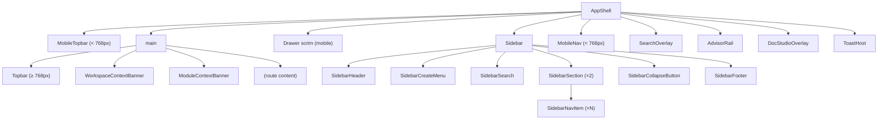
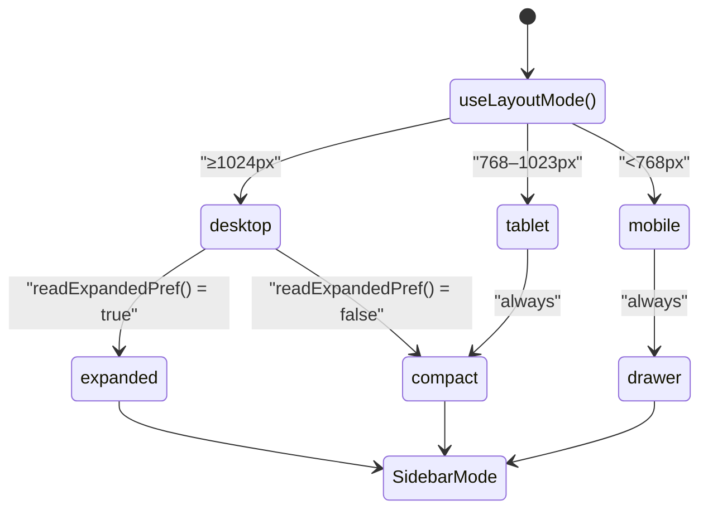
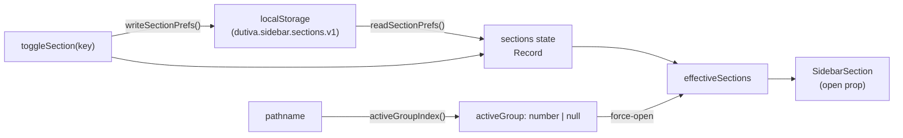
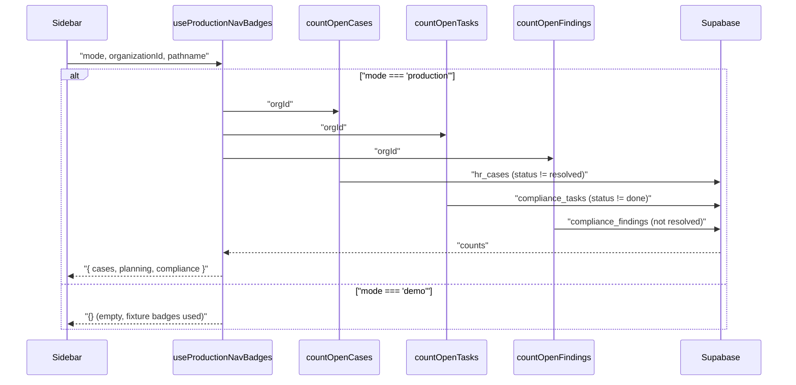
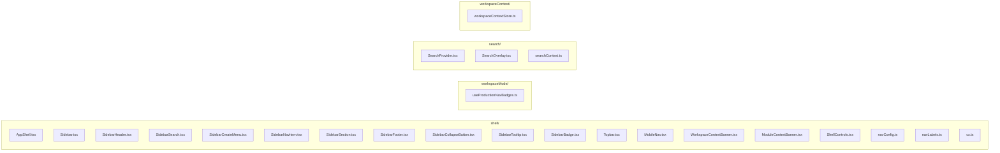

# App Shell & Navigation

<details>
<summary>Relevant source files</summary>

The following files were used as context for generating this wiki page:

- [src/data/memories.ts](src/data/memories.ts)
- [src/features/app/auth/AuthMenuButton.tsx](src/features/app/auth/AuthMenuButton.tsx)
- [src/features/app/documents/DocumentsLayout.tsx](src/features/app/documents/DocumentsLayout.tsx)
- [src/features/app/documents/screens/StudioScreen.tsx](src/features/app/documents/screens/StudioScreen.tsx)
- [src/features/app/shell/AppShell.tsx](src/features/app/shell/AppShell.tsx)
- [src/features/app/shell/MobileNav.tsx](src/features/app/shell/MobileNav.tsx)
- [src/features/app/shell/ModuleContextBanner.tsx](src/features/app/shell/ModuleContextBanner.tsx)
- [src/features/app/shell/Sidebar.test.tsx](src/features/app/shell/Sidebar.test.tsx)
- [src/features/app/shell/Sidebar.tsx](src/features/app/shell/Sidebar.tsx)
- [src/features/app/shell/SidebarCollapseButton.tsx](src/features/app/shell/SidebarCollapseButton.tsx)
- [src/features/app/shell/SidebarCreateMenu.tsx](src/features/app/shell/SidebarCreateMenu.tsx)
- [src/features/app/shell/SidebarFooter.tsx](src/features/app/shell/SidebarFooter.tsx)
- [src/features/app/shell/SidebarHeader.tsx](src/features/app/shell/SidebarHeader.tsx)
- [src/features/app/shell/SidebarNavItem.tsx](src/features/app/shell/SidebarNavItem.tsx)
- [src/features/app/shell/SidebarSearch.tsx](src/features/app/shell/SidebarSearch.tsx)
- [src/features/app/shell/SidebarSection.tsx](src/features/app/shell/SidebarSection.tsx)
- [src/features/app/shell/SidebarTooltip.tsx](src/features/app/shell/SidebarTooltip.tsx)
- [src/features/app/shell/Topbar.tsx](src/features/app/shell/Topbar.tsx)
- [src/lib/keyboardShortcut.ts](src/lib/keyboardShortcut.ts)
- [src/features/app/shell/WorkspaceContextBanner.tsx](src/features/app/shell/WorkspaceContextBanner.tsx)
- [src/features/app/shell/navConfig.ts](src/features/app/shell/navConfig.ts)
- [src/features/app/views/memory/MemoryFactRow.tsx](src/features/app/views/memory/MemoryFactRow.tsx)
- [src/features/app/views/memory/MemoryManagerView.tsx](src/features/app/views/memory/MemoryManagerView.tsx)
- [src/features/app/workspaceContext/WorkspaceContextProvider.tsx](src/features/app/workspaceContext/WorkspaceContextProvider.tsx)
- [src/features/app/workspaceContext/workspaceContextStore.ts](src/features/app/workspaceContext/workspaceContextStore.ts)
- [src/features/app/workspaceMode/useProductionNavBadges.test.tsx](src/features/app/workspaceMode/useProductionNavBadges.test.tsx)
- [src/features/app/workspaceMode/useProductionNavBadges.ts](src/features/app/workspaceMode/useProductionNavBadges.ts)
- [src/features/marketing/sections/Header.tsx](src/features/marketing/sections/Header.tsx)
- [src/i18n/messages/memory.ts](src/i18n/messages/memory.ts)
- [src/i18n/messages/shell.ts](src/i18n/messages/shell.ts)
- [src/styles/base.css](src/styles/base.css)

</details>

The workspace UI is enclosed in `AppShell`, a responsive layout component that coordinates a sidebar, topbar, mobile navigation, context banners, and global overlays. Every `/app/*` and `/demo/*` route renders inside this frame. On the public demo, `PublicDemoBanner` and `DemoTourRail` render above the main flex area; the sidebar defaults to compact width.

The shell adapts across three breakpoints and persists user layout preferences to `localStorage`.

## Architecture Overview

**Component tree diagram**



Sources: [src/features/app/shell/AppShell.tsx:1-221](), [src/features/app/shell/Sidebar.tsx:168-233]()

## AppShell Layout

`AppShell` is the outermost workspace component, exported from `src/features/app/shell/AppShell.tsx`. It renders a full-viewport `h-dvh` flex column (using `dvh` instead of `vh` to handle iOS Safari's dynamic toolbar correctly) and coordinates three device tiers via `useLayoutMode()`.

[src/features/app/shell/AppShell.tsx:84-221]()

### LayoutMode Resolution

The `useLayoutMode` hook returns one of three modes based on CSS media queries:

| LayoutMode | Breakpoint | Sidebar                                                                                                                           | Topbar                    | Bottom Nav  |
| ---------- | ---------- | --------------------------------------------------------------------------------------------------------------------------------- | ------------------------- | ----------- |
| `desktop`  | ≥ 1024px   | expanded or compact (user toggle)                                                                                                 | `Topbar` + sidebar toggle | —           |
| `tablet`   | 768–1023px | compact by default; same expand toggle + `localStorage` as desktop ([#280](https://github.com/Dutiva-Canada/Dutiva_Web/pull/280)) | `Topbar` + sidebar toggle | —           |
| `mobile`   | < 768px    | drawer (slide-in)                                                                                                                 | `MobileTopbar`            | `MobileNav` |

The `currentLayoutMode()` function uses `window.matchMedia` queries, and `useLayoutMode` listens for `change` events on both media queries to re-evaluate on resize/rotation.

[src/features/app/shell/AppShell.tsx:27-82]()

### SidebarMode Derivation

The `AppShell` combines `LayoutMode` with a persisted user preference to produce a `SidebarMode`:

```
sidebarMode = 'compact'                       // default
if (isMobile)         sidebarMode = 'drawer'
else if (sidebarExpanded) sidebarMode = 'expanded'
```

The expanded preference is stored under `dutiva.sidebar.expanded.v1` via `readPref`/`writePref` from `@/lib/prefs`. Toggle via footer `SidebarCollapseButton`, **topbar** `PanelLeftOpen`/`PanelLeftClose` button, or **`Ctrl+\` / `⌘\`** (desktop and tablet only).

Rail width animates with `transition-[width] duration-200`; nav label opacity/transform uses matched expand/collapse timing ([#280](https://github.com/Dutiva-Canada/Dutiva_Web/pull/280)).

[src/features/app/shell/AppShell.tsx:29-44](), [src/features/app/shell/AppShell.tsx:123-125]()

### Drawer Transition

On mobile, the sidebar opens as a drawer with a scrim overlay. `useDrawerTransition` manages a two-phase mount/enter state machine to enable CSS-driven slide-in/out animations (220ms duration). The drawer is wrapped in a `<dialog>` element with `aria-modal="true"` and supports `Escape` dismissal via `useEscapeToClose` from the shared escape stack.

Opening the drawer moves focus to the header close button (44px target). Closing restores focus to whichever control opened it — topbar hamburger or bottom **More** tab ([#280](https://github.com/Dutiva-Canada/Dutiva_Web/pull/280)).

[src/features/app/shell/AppShell.tsx:46-68](), [src/features/app/shell/AppShell.tsx:172-195]()

### Title Derivation

The topbar/mobile-topbar title adapts to workspace mode. In **production** mode, `moduleLabelFor()` returns the module's canonical label (never a fixture person's name). In **demo** mode, `viewLabelFor()` uses richer labels including employee names on profile routes.

[src/features/app/shell/AppShell.tsx:110-113]()

**Layout modes diagram**



Sources: [src/features/app/shell/AppShell.tsx:27-125](), [src/lib/prefs.ts:1-16]()

## Sidebar System

The `Sidebar` component (`src/features/app/shell/Sidebar.tsx`) accepts a `SidebarMode` prop and renders a vertical `<aside>` with header, create menu, search, scrollable nav groups, collapse button, and footer.

### SidebarMode Visual Properties

| Mode       | Width               | Positioning                  | Labels            | Sections                    |
| ---------- | ------------------- | ---------------------------- | ----------------- | --------------------------- |
| `expanded` | 292px (`w-[292px]`) | In-flow                      | Visible text      | Collapsible headings        |
| `compact`  | 64px (`w-[64px]`)   | In-flow, `z-1`               | Hidden (tooltips) | Always visible, no headings |
| `drawer`   | 292px               | Fixed, `z-70`, CSS translate | Visible text      | Collapsible headings        |

[src/features/app/shell/Sidebar.tsx:19-87]()

### SidebarHeader

`SidebarHeader` displays the organization badge (first letter of `identity.companyName`), the company name, and an "HR workspace" subtitle. In drawer mode, a close button (×) is shown. In compact mode, the company name is hidden with `max-w-0` and a `SidebarTooltip` provides hover context.

[src/features/app/shell/SidebarHeader.tsx:1-60]()

### SidebarSearch (⌘K / Ctrl+K)

`SidebarSearch` renders a search trigger that calls `openSearch()` from the `SearchContext`. In expanded mode, it shows a full-width button with "Search" label and a platform-aware shortcut hint via `searchShortcutLabel()` from `@/lib/keyboardShortcut` (`⌘K` on Apple, `CtrlK` on Windows/Linux). In compact mode, it renders as an icon-only button with a tooltip.

The `SearchProvider` registers a global `keydown` listener that opens the search overlay on `⌘K` / `Ctrl+K`.

[src/features/app/shell/SidebarSearch.tsx:1-45](), [src/features/app/search/SearchProvider.tsx:11-19]()

### SidebarCreateMenu

`SidebarCreateMenu` is a dropdown menu for quick entity creation. It uses `useCreateActions()` to define six action items:

| Action        | Key             | Route                   | Status   |
| ------------- | --------------- | ----------------------- | -------- |
| Conversation  | `conversation`  | `/app/advisor`          | Active   |
| Document      | `document`      | `/app/documents/studio` | Active   |
| Case          | `case`          | `/app/cases`            | Active   |
| Workflow      | `workflow`      | —                       | Disabled |
| Employee      | `employee`      | —                       | Disabled |
| Communication | `communication` | —                       | Disabled |

Disabled items show an "Unavailable" badge and have `aria-disabled="true"` with a shared `aria-describedby` pointing to a hidden description. The menu supports full keyboard navigation: `ArrowUp`/`ArrowDown` for item focus, `Escape` to close with focus return to the trigger button.

In **compact** sidebar mode, the panel anchors to `left-full ml-2` beside the 64px rail so the menu is not clipped off-screen ([#280](https://github.com/Dutiva-Canada/Dutiva_Web/pull/280)).

[src/features/app/shell/SidebarCreateMenu.tsx:9-46](), [src/features/app/shell/SidebarCreateMenu.tsx:73-102]()

### SidebarNavItem

Each nav link is rendered by `SidebarNavItem`. It wraps a React Router `<Link>` in a `SidebarTooltip` (shown only in compact mode). Active items receive `aria-current="page"` and a left border accent. In expanded mode, the active item uses `bg-accent-soft text-accent`; in compact mode, it uses `bg-navy text-gold-on-navy`.

Badges are rendered via `SidebarBadge`, which supports four tones: `gold`, `neutral`, `risk`, and `warn`. Each tone maps to a distinct CSS class set. Badge accessible labels are derived from `shell_badge_*_aria` i18n templates with `{count}` replacement.

[src/features/app/shell/SidebarNavItem.tsx:1-60](), [src/features/app/shell/SidebarBadge.tsx:1-44]()

### SidebarTooltip

`SidebarTooltip` provides positioned tooltips that appear on hover/focus for compact-mode items. It renders as a `role="tooltip"` span fixed-positioned to the right of the trigger (or below, for bottom position). It tracks `resize` and `scroll` events to reposition dynamically, including scroll events on the nearest `[data-rail-scroll]` ancestor.

[src/features/app/shell/SidebarTooltip.tsx:1-74]()

Sources: [src/features/app/shell/Sidebar.tsx:96-233](), [src/features/app/shell/SidebarCreateMenu.tsx:1-231](), [src/features/app/shell/SidebarNavItem.tsx:1-60](), [src/features/app/shell/SidebarSearch.tsx:1-45]()

## Collapsible SidebarSections with localStorage Persistence

### Section Model

The sidebar organizes `NAV_GROUPS` into collapsible sections. Only groups with a non-null `heading` are collapsible; heading-less groups render as always-visible top-level items. The section keys are positionally aligned with the heading groups in `NAV_GROUPS`:

| Section Key  | Heading (EN/FR)                 | Items                                      |
| ------------ | ------------------------------- | ------------------------------------------ |
| `people`     | People & HR / Personnes et RH   | Employees, Cases, Hiring, Wellbeing        |
| `operations` | Operations / Opérations         | Documents, Knowledge, Planning, Compliance |
| `comms`      | Communications / Communications | Comms Platform, HR Communications          |
| `finance`    | Finance / Finance               | Compensation, Finance                      |
| `growth`     | Growth / Croissance             | CRM                                        |

[src/features/app/shell/Sidebar.tsx:21-33]()

### Persistence Mechanism

Section open/closed state is stored in `localStorage` under the key `dutiva.sidebar.sections.v1` as a JSON object. The functions `readSectionPrefs()` and `writeSectionPrefs()` handle serialization with graceful fallback to defaults (all sections open).

[src/features/app/shell/Sidebar.tsx:29-55]()

### Auto-Expansion

When the current route falls within a collapsed section, that section is forced open via `effectiveSections`. The `activeGroupIndex()` function scans `NAV_GROUPS` for the group containing the active route, and if found, overrides the stored preference for that section:

```
effectiveSections = { ...storedSections }
if (activeGroup matches a section) effectiveSections[key] = true
```

[src/features/app/shell/Sidebar.tsx:57-68](), [src/features/app/shell/Sidebar.tsx:119-126]()

### SidebarSection Component

`SidebarSection` renders a collapsible group with a heading button (only in expanded mode) and a `grid-rows` CSS transition for smooth open/close animation. In compact mode, it skips the heading and renders children directly in a visible `<div>`.

[src/features/app/shell/SidebarSection.tsx:1-63]()

**Section collapse state flow diagram**



Sources: [src/features/app/shell/Sidebar.tsx:26-126](), [src/features/app/shell/SidebarSection.tsx:1-63](), [src/lib/prefs.ts:1-16]()

## navConfig — NAV_GROUPS and isNavActive

The navigation structure is defined in `src/features/app/shell/navConfig.ts`. It exports `NAV_GROUPS`, the `NavItem` and `NavGroup` types, and route-matching utilities.

### NAV_GROUPS Structure

```mermaid
graph TD
    G0["Group 0\n(heading: null)"]
    G0 --> home["home → /app/home"]
    G0 --> advisor["advisor → /app/advisor"]
    G0 --> memory["memory → /app/settings/memory\ncustom isActive"]
    G0 --> workflows["workflows → /app/workflows"]

    G1["Group 1 — Records"]
    G1 --> employees["employees → /app/employees"]
    G1 --> cases["cases → /app/cases\nbadge: count (neutral)"]
    G1 --> hiring["hiring → /app/hiring"]
    G1 --> documents["documents → /app/documents/hr-library\ncustom isActive"]
    G1 --> knowledge["knowledge → /app/knowledge"]

    G2["Group 2 — Programs"]
    G2 --> compliance["compliance → /app/compliance\nbadge: 3 (warn)"]
    G2 --> compensation["compensation → /app/compensation"]
    G2 --> communications["communications → /app/communications"]
    G2 --> comms["comms → /app/comms/overview\ncustom isActive"]
    G2 --> finance["finance → /app/finance/overview\ncustom isActive"]
    G2 --> wellbeing["wellbeing → /app/wellbeing\nbadge: count (warn)"]
    G2 --> planning["planning → /app/planning/tasks\ncustom isActive"]

    G3["Group 3\n(heading: null)"]
    G3 --> analytics["analytics → /app/analytics"]
```



Sources: [src/features/app/shell/navConfig.ts:66-181]()

### NavItem Interface

```typescript
interface NavItem {
  key: string // stable key, first path segment under /app
  to: string // route target
  icon: LucideIcon // sidebar icon component
  label: Bi // bilingual label { en, fr }
  badge?: { value: string; tone: NavBadgeTone }
  isActive?: (pathname: string) => boolean // custom active predicate
}
```

Two items have custom `isActive` predicates: `documents` (matches any `/app/documents/*`) and `planning` (matches any `/app/planning/*`).

[src/features/app/shell/navConfig.ts:30-39](), [src/features/app/shell/navConfig.ts:88-93](), [src/features/app/shell/navConfig.ts:130-133]()

### isNavActive

The default active-route check is `isNavActive(to, pathname)` from `navLabels.ts`: it returns `true` when `pathname === to` or `pathname` starts with `to + '/'`. Items with a custom `isActive` override this default.

[src/features/app/shell/navLabels.ts:40-42]()

### Demo Badge Derivation

In demo mode, badge counts are computed from fixture data at module load time:

- **Workflows**: hardcoded `'3'`
- **Cases**: `cases.filter(c => c.status.en !== 'Resolved').length`
- **Compliance**: hardcoded `'3'`
- **Wellbeing**: `employeeDetails` entries with `sentiment < 55`

[src/features/app/shell/navConfig.ts:47-56]()

### navLabels.ts — Entry Graph Safety

The route-to-label vocabulary is split into a separate `navLabels.ts` file to keep `@/data` fixtures out of the eager entry graph. `ModeGate` imports labels from `navLabels.ts` (not `navConfig.ts`), because `navConfig.ts` value-imports fixture data for badge counts. The `check-entry-graph.mjs` CI script enforces this boundary.

[src/features/app/shell/navLabels.ts:4-18]()

Sources: [src/features/app/shell/navConfig.ts:1-191](), [src/features/app/shell/navLabels.ts:1-64]()

## Production Nav Badges — useProductionNavBadges

In production mode, fixture badge counts are replaced by live server counts via the `useProductionNavBadges` hook.

### Data Flow



The hook re-fetches on every `pathname` change so that completing work (e.g., resolving a case) updates the badge as the user navigates. Failures silently return `{}` — badges are never worth an error state.

[src/features/app/workspaceMode/useProductionNavBadges.ts:1-55]()

### Badge Application in Sidebar

In `Sidebar.renderGroupItems`, when `workspaceMode === 'production'`, each item's badge is replaced with the production badge (if any). In demo mode, items retain their fixture badges.

[src/features/app/shell/Sidebar.tsx:153-166]()

Sources: [src/features/app/workspaceMode/useProductionNavBadges.ts:1-55](), [src/features/app/shell/Sidebar.tsx:104-106](), [src/features/app/shell/Sidebar.tsx:153-166]()

## SidebarFooter with Admin Detection

`SidebarFooter` renders the Settings link, user profile popover, and conditionally a "Support dashboard" link for admin users.

### Admin Detection

On mount, `SidebarFooter` calls `isCurrentUserAdmin()` from `supportAdminApi.ts`. This function checks the current Supabase session and calls the `is_admin` RPC. If the user is an admin, the profile popover includes a "Support dashboard" menu item linking to `/app/support/admin`.

[src/features/app/shell/SidebarFooter.tsx:23-35](), [src/features/support/supportAdminApi.ts:107-114]()

### Profile Popover

The popover is a `role="menu"` dialog positioned above the trigger button. It shows:

1. User name and email
2. Settings link
3. Help Centre link (locale-aware: `/help` or `/fr/aide`)
4. Contact support link
5. Support dashboard (admin only)
6. Sign out (styled with `text-risk-dot`)

[src/features/app/shell/SidebarFooter.tsx:107-186]()

### Settings Link

The Settings link uses `aria-current="page"` when the pathname starts with `/app/settings`. It adapts its visual treatment between expanded (text + icon) and compact (icon-only with tooltip) modes, matching the same active-state styling as `SidebarNavItem`.

[src/features/app/shell/SidebarFooter.tsx:37-73]()

Sources: [src/features/app/shell/SidebarFooter.tsx:1-186](), [src/features/support/supportAdminApi.ts:107-114]()

## SidebarCollapseButton

Available on desktop and tablet (not in drawer mode), `SidebarCollapseButton` toggles between expanded and compact sidebar. It renders `PanelLeftClose` (when expanded) or `PanelLeftOpen` (when compact), with bilingual aria labels `shell_collapse_sidebar` / `shell_expand_sidebar`. The same toggle is duplicated in `Topbar` for discoverability.

[src/features/app/shell/SidebarCollapseButton.tsx:1-44](), [src/features/app/shell/Topbar.tsx]()

## Topbar

The `Topbar` component renders on desktop and tablet layouts (≥ 768px). It occupies a 60px height strip and contains:

| Element              | Description                                                                                                                                   |
| -------------------- | --------------------------------------------------------------------------------------------------------------------------------------------- |
| Sidebar toggle       | `PanelLeftOpen` / `PanelLeftClose` — same preference as footer collapse button ([#280](https://github.com/Dutiva-Canada/Dutiva_Web/pull/280)) |
| Route title          | `<h1>` displaying the current view/module label                                                                                               |
| "Ask Advisor" button | Gold-bordered button opening the contextual `AdvisorRail` (hidden on `/app/advisor`)                                                          |
| `LangToggle`         | EN/FR segmented pill                                                                                                                          |
| `ThemeToggle`        | Sun/moon icon button                                                                                                                          |
| Search trigger       | Opens `SearchOverlay` via `openSearch()`                                                                                                      |
| `AuthMenuButton`     | Account/sign-in popover                                                                                                                       |
| Notifications bell   | Popover with sample notifications (demo mode) or empty state (production)                                                                     |

[src/features/app/shell/Topbar.tsx:70-178]()

### Shell Controls

`LangToggle` and `ThemeToggle` are shared controls used by both `Topbar` and `MobileTopbar`:

- `LangToggle` renders a segmented pill with `aria-pressed` states
- `ThemeToggle` shows `Sun` in dark mode and `Moon` in light mode

[src/features/app/shell/ShellControls.tsx:1-69]()

Sources: [src/features/app/shell/Topbar.tsx:1-178](), [src/features/app/shell/ShellControls.tsx:1-69]()

## MobileNav

The mobile navigation system has two parts:

### MobileTopbar

Rendered at < 768px, `MobileTopbar` is a 56px header with a hamburger button (opens the sidebar drawer), the route title, and controls (theme toggle, search, `AuthMenuButton`). All interactive targets have a minimum 44×44px hit area for iOS accessibility compliance.

[src/features/app/shell/MobileNav.tsx:19-61]()

### MobileNav (Bottom Tab Bar)

A fixed-bottom tab bar with five items:

| Tab          | Route          | Icon                            |
| ------------ | -------------- | ------------------------------- |
| Home         | `/app/home`    | `House`                         |
| Cases        | `/app/cases`   | `Briefcase`                     |
| Ask (raised) | `/app/advisor` | `Sparkle` (gold on navy circle) |
| Tasks        | `/app/tasks`   | `ListChecks`                    |
| More         | opens drawer   | `Menu`                          |

The "Ask" tab is visually elevated with a 50px navy circle that overlaps the tab bar's top edge by 16px. It passes `{ newConversation: true }` as route state to start a fresh advisor session. The tab bar handles safe-area bottom insets with `pb-[calc(5px_+_env(safe-area-inset-bottom))]`.

[src/features/app/shell/MobileNav.tsx:92-153]()

### Drawer Focus Trap

When the sidebar is open in drawer mode, a `keydown` listener traps Tab focus within the `<aside>` element, cycling between the first and last focusable elements.

[src/features/app/shell/Sidebar.tsx:128-151]()

Sources: [src/features/app/shell/MobileNav.tsx:1-154](), [src/features/app/shell/Sidebar.tsx:128-151]()

### View-level mobile sheets (<768px)

Some modules hide their desktop side rails below `md` and expose them through full-screen sheets opened from a compact bar. This matches the Advisor and Memory design handoffs (`Advisor Response Experience.dc.html`, `Advisor Memory.dc.html`).

| Module                 | Desktop rail                      | Mobile access                                                                         | Close behaviour            |
| ---------------------- | --------------------------------- | ------------------------------------------------------------------------------------- | -------------------------- |
| **Advisor threads**    | 248px `ThreadList` column         | `ThreadListMobileAccess` bar (active title + list icon) + sheet                       | Select thread or tap close |
| **Memory nav**         | 252px `MemoryLayout` nav          | `MemoryMobileNavAccess` bar + sheet with full `MemoryNavPanel`                        | Navigate or tap close      |
| **Advisor compliance** | 384px `ComplianceWorkspace` aside | Inline at `≥1024px` only; below `lg`, gold “Workspace” pill in `ChatPane` opens sheet | Sheet close button         |
| **Chat recall rail**   | “What I know” aside at `≥1024px`  | Pill in jurisdiction line opens sheet below `lg`                                      | Sheet close button         |

Layout mode uses `useMdUp()` / `useLgUp()` from `@/lib/useMediaQuery` so only one variant mounts (important for Vitest, where both Tailwind `hidden`/`md:flex` classes would otherwise render).

Sources: [src/features/app/views/advisor/ThreadList.tsx](), [src/features/app/views/memory/MemoryLayout.tsx](), [src/features/app/views/advisor/ComplianceWorkspace.tsx](), [src/features/app/views/memory/ChatRecallDemoView.tsx](), [src/lib/useMediaQuery.ts]()

## WorkspaceContextBanner

`WorkspaceContextBanner` renders a gold "Advisor is using · ..." strip below the topbar when a workspace entity (employee, case, document, etc.) is pinned as the Advisor's working context.

### Entity Types

The banner supports six entity types defined by `WorkspaceEntityType`:

`employee` | `document` | `compliance` | `compensation` | `wellbeing` | `case`

Each type has a localized label from `shellMessages`.

[src/features/app/shell/WorkspaceContextBanner.tsx:9-16](), [src/features/app/workspaceContext/workspaceContextStore.ts:11-17]()

### Display

The banner shows:

- An initials avatar circle
- "ADVISOR IS USING · [type]" label in uppercase gold
- The entity subject name
- Meta chips (province, role, topic) — each individually removable — desktop/tablet only
- "Open record" button (links to `/app/employees/:empId`) — desktop/tablet only
- Clear (×) button to dismiss the context

The context state is managed by `WorkspaceContext` from `workspaceContextStore.ts`, with methods `setContext`, `clearContext`, and `removeContextMeta`.

[src/features/app/shell/WorkspaceContextBanner.tsx:25-83](), [src/features/app/workspaceContext/workspaceContextStore.ts:19-40]()

## ModuleContextBanner

`ModuleContextBanner` shows a specialist mode banner on certain workspace views. It maps the current route segment to an Advisor specialty:

| Route segment    | Specialty                 |
| ---------------- | ------------------------- |
| `compensation`   | Compensation Analyst      |
| `compliance`     | Compliance Specialist     |
| `wellbeing`      | Wellbeing Specialist      |
| `communications` | Communications Specialist |
| `templates`      | Template Specialist       |
| `cases`          | Case Specialist           |

The banner is hidden when a `WorkspaceContext` is already set, or when viewing a detail page (route has a second segment).

[src/features/app/shell/ModuleContextBanner.tsx:1-54]()

Sources: [src/features/app/shell/WorkspaceContextBanner.tsx:1-83](), [src/features/app/shell/ModuleContextBanner.tsx:1-54](), [src/features/app/workspaceContext/workspaceContextStore.ts:1-55]()

## SearchOverlay and ⌘K

The global search overlay is triggered from multiple points: the `SidebarSearch` button, the `Topbar` search icon, the `MobileTopbar` search icon, and the `⌘K` keyboard shortcut.

### SearchProvider

`SearchProvider` wraps the app tree and manages the `open` boolean state. It registers a global `keydown` handler for `⌘K` / `Ctrl+K` to open the overlay.

[src/features/app/search/SearchProvider.tsx:1-25]()

### SearchOverlay

When open, `SearchOverlay` mounts `SearchDialog`, which provides:

- Text input with live filtering
- Tab strip across entity types (`all`, employees, cases, chats, documents, views)
- Arrow key navigation of results
- Enter to open the selected result (navigates to the entity's route)
- Escape to close (via `useEscapeToClose`)

In production mode, the search corpus is empty (fixture data is not available).

[src/features/app/search/SearchOverlay.tsx:1-96](), [src/features/app/search/searchContext.ts:1-16]()

Sources: [src/features/app/search/SearchProvider.tsx:1-25](), [src/features/app/search/SearchOverlay.tsx:1-96]()

## Global Overlays and Escape Stack

`AppShell` mounts four global overlays as siblings at the bottom of its render tree:

1. `SearchOverlay` — ⌘K search
2. `AdvisorRail` — contextual Advisor slide-over panel
3. `DocStudioOverlay` — document studio editor
4. `ToastHost` — toast notification host

These overlays can stack, so the `escapeStack` module (`src/lib/escapeStack.ts`) coordinates `Escape` key handling: each overlay registers a handler with `useEscapeToClose(active, handler)`, and only the most-recently-opened overlay receives the `Escape` event.

[src/features/app/shell/AppShell.tsx:215-218](), [src/lib/escapeStack.ts:1-46]()

Sources: [src/features/app/shell/AppShell.tsx:215-218](), [src/lib/escapeStack.ts:1-46]()

## localStorage Keys

The shell persists several preferences to `localStorage` via the `readPref`/`writePref` helpers from `@/lib/prefs`, which wrap `localStorage` in try/catch for private-mode/SSR safety.

| Key                          | Purpose                        | Default                             | Used by    |
| ---------------------------- | ------------------------------ | ----------------------------------- | ---------- |
| `dutiva.sidebar.expanded.v1` | Sidebar expanded vs compact    | `'true'`                            | `AppShell` |
| `dutiva.sidebar.sections.v1` | Section collapse states (JSON) | `{ records: true, programs: true }` | `Sidebar`  |

[src/features/app/shell/AppShell.tsx:29-44](), [src/features/app/shell/Sidebar.tsx:26-55](), [src/lib/prefs.ts:1-16]()

Sources: [src/lib/prefs.ts:1-16](), [src/features/app/shell/AppShell.tsx:29-44](), [src/features/app/shell/Sidebar.tsx:26-55]()

## i18n Integration

All shell components resolve messages through `shellMessages` from `@/i18n/messages/shell.ts` via the `useI18n()` hook's `x()` function. The shell message namespace uses the `shell_` prefix. Key message groups include:

| Prefix               | Purpose                                                 |
| -------------------- | ------------------------------------------------------- |
| `shell_nav_*`        | Navigation link labels                                  |
| `shell_sec_*`        | Section headings                                        |
| `shell_v_*`          | View/page titles                                        |
| `shell_create_*`     | Create menu labels                                      |
| `shell_badge_*_aria` | Badge accessible descriptions (with `{count}` template) |
| `shell_ctx_*`        | Workspace context banner                                |
| `shell_mod_*`        | Module context banner specialties                       |
| `shell_tab_*`        | Mobile bottom tab labels                                |

[src/i18n/messages/shell.ts:1-130]()

Sources: [src/i18n/messages/shell.ts:1-130]()

## Component-to-File Mapping



All files under `src/features/app/shell/`, `src/features/app/search/`, `src/features/app/workspaceMode/`, and `src/features/app/workspaceContext/`.

Sources: [src/features/app/shell/AppShell.tsx:1-1](), [src/features/app/shell/Sidebar.tsx:1-1](), [src/features/app/shell/navConfig.ts:1-1](), [src/features/app/shell/navLabels.ts:1-1](), [src/features/app/workspaceMode/useProductionNavBadges.ts:1-1]()

## Testing

The sidebar has a comprehensive test suite in `Sidebar.test.tsx` covering:

- English and French label rendering
- `aria-current="page"` on active routes
- Section expand/collapse via click
- Analytics remaining visible with all sections collapsed
- Auto-expansion of sections for nested routes
- Create menu functional and disabled items
- Keyboard navigation within the Create menu (ArrowDown/Up, Escape)
- Badge rendering with accessible descriptions
- Expanded vs compact mode differences
- Drawer mode close button behavior
- Settings link outside the scrollable nav region

[src/features/app/shell/Sidebar.test.tsx:1-251]()

The production nav badges are tested through `useProductionNavBadges.test.tsx`, which mocks the Supabase client to verify:

- Demo mode retains fixture badge counts
- Production mode displays live counts from `hr_cases`, `compliance_tasks`, and `compliance_findings` tables
- Fixture-only badges (Workflows, Wellbeing) disappear in production mode

[src/features/app/workspaceMode/useProductionNavBadges.test.tsx:1-133]()

Sources: [src/features/app/shell/Sidebar.test.tsx:1-251](), [src/features/app/workspaceMode/useProductionNavBadges.test.tsx:1-133]()

---
