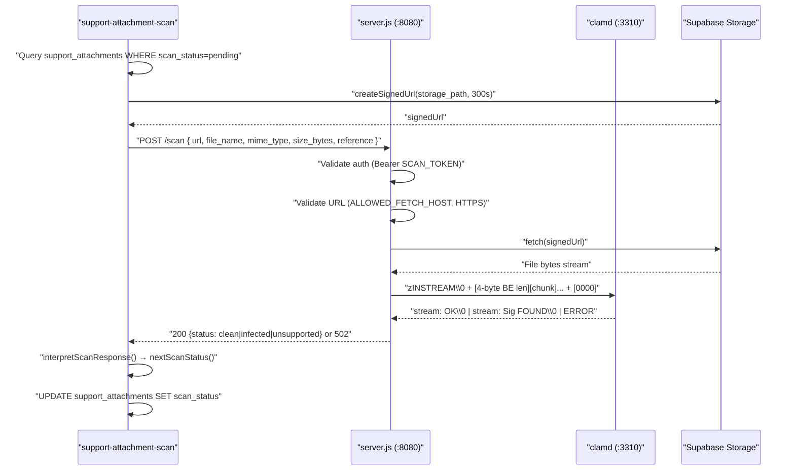
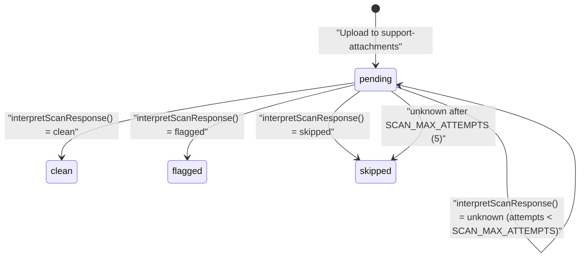
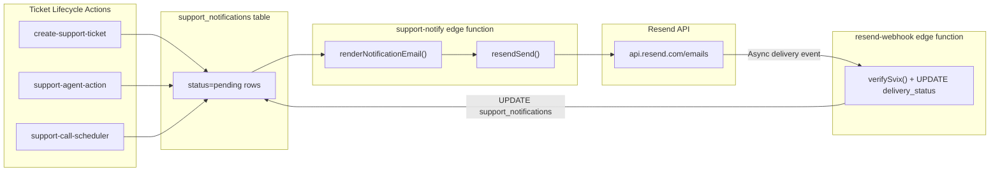
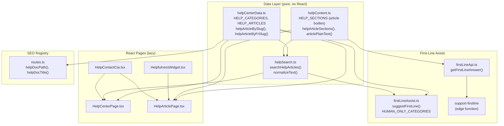
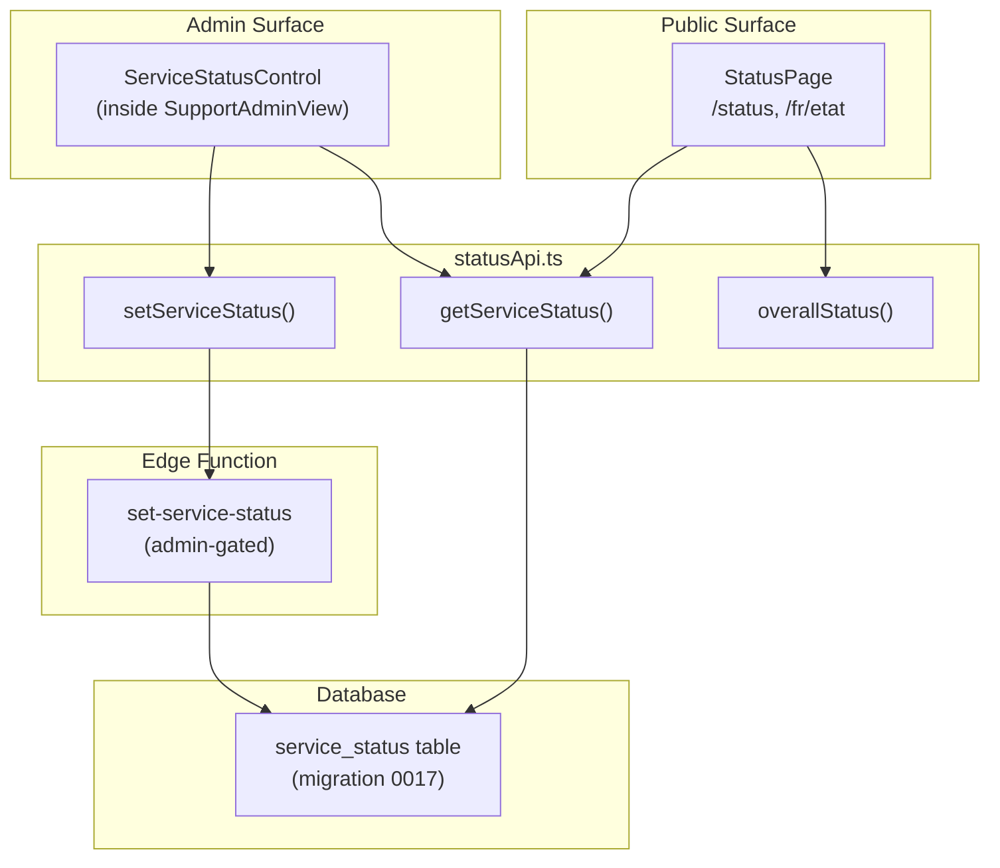
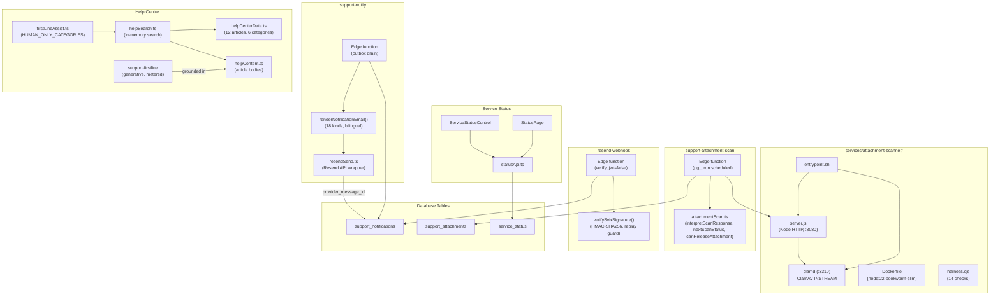

# Attachment Scanner, Help Centre & Notifications

<details>
<summary>Relevant source files</summary>

The following files were used as context for generating this wiki page:

- [services/attachment-scanner/.dockerignore](services/attachment-scanner/.dockerignore)
- [services/attachment-scanner/Dockerfile](services/attachment-scanner/Dockerfile)
- [services/attachment-scanner/README.md](services/attachment-scanner/README.md)
- [services/attachment-scanner/do-app.yaml](services/attachment-scanner/do-app.yaml)
- [services/attachment-scanner/entrypoint.sh](services/attachment-scanner/entrypoint.sh)
- [services/attachment-scanner/harness.cjs](services/attachment-scanner/harness.cjs)
- [services/attachment-scanner/package.json](services/attachment-scanner/package.json)
- [src/features/marketing/pages/HelpArticlePage.tsx](src/features/marketing/pages/HelpArticlePage.tsx)
- [src/features/support/email/svixSignature.test.ts](src/features/support/email/svixSignature.test.ts)
- [src/features/support/email/svixSignature.ts](src/features/support/email/svixSignature.ts)
- [src/features/support/firstLineApi.ts](src/features/support/firstLineApi.ts)
- [src/features/support/firstLineAssist.test.ts](src/features/support/firstLineAssist.test.ts)
- [src/features/support/firstLineAssist.ts](src/features/support/firstLineAssist.ts)
- [src/features/support/help/helpCenterData.test.ts](src/features/support/help/helpCenterData.test.ts)
- [src/features/support/help/helpCenterData.ts](src/features/support/help/helpCenterData.ts)
- [src/features/support/help/helpContent.ts](src/features/support/help/helpContent.ts)
- [src/features/support/help/helpSearch.test.ts](src/features/support/help/helpSearch.test.ts)
- [src/features/support/help/helpSearch.ts](src/features/support/help/helpSearch.ts)
- [supabase/functions/resend-webhook/index.ts](supabase/functions/resend-webhook/index.ts)
- [supabase/migrations/0018_notification_delivery.sql](supabase/migrations/0018_notification_delivery.sql)

</details>

This page covers three interconnected subsystems of the Dutiva support infrastructure: the ClamAV-based attachment malware scanner microservice, the notification outbox worker with Resend email delivery and webhook tracking, and the self-service Help Centre layer including first-line AI assist and the service status board.

## Attachment Scanner Microservice

The attachment scanner is a standalone containerised microservice under `services/attachment-scanner/`. It wraps ClamAV in a zero-dependency Node.js HTTP server that accepts file URLs from the `support-attachment-scan` edge function and returns a malware verdict.

### Architecture Overview

**End-to-end attachment scan flow**



Sources: [services/attachment-scanner/server.js:1-281](), [supabase/functions/support-attachment-scan/index.ts:1-247](), [src/features/support/attachmentScan.ts:1-129]()

### server.js — Zero-Dependency HTTP Server

The server is a ~280-line CommonJS Node.js module with no npm dependencies. It uses only `node:http`, `node:net`, and `node:events`. The `package.json` explicitly sets `"type": "commonjs"` because the repo root uses `type=module` and Node resolves module type from the nearest `package.json`.

[services/attachment-scanner/package.json:6-7]()

Key constants and security controls:

| Constant      | Value               | Purpose                                                         |
| ------------- | ------------------- | --------------------------------------------------------------- |
| `MAX_BYTES`   | 26,214,400 (25 MiB) | Server-side cap matching the `support-attachments` bucket limit |
| `BUDGET_MS`   | 25,000 ms           | Scan time budget (worker aborts at 30s)                         |
| `CHUNK_BYTES` | 32,768              | INSTREAM chunk ceiling                                          |
| `SCAN_TOKEN`  | env var             | Bearer token — server refuses to start if unset                 |

[services/attachment-scanner/server.js:44-57]()

The server exposes two endpoints:

- **`GET /health`** — Sends `zPING\0` to clamd and returns `{"ok":true,"clamd":"PONG"}` on success, `503` otherwise. Used by platform health checks.
- **`POST /scan`** — The main scan endpoint, authenticated via `Bearer $SCAN_TOKEN`.

[services/attachment-scanner/server.js:258-270]()

### INSTREAM Protocol Implementation

The `scanStream()` function implements ClamAV's INSTREAM wire protocol:

1. Opens a TCP connection to clamd at `CLAMD_HOST:CLAMD_PORT`
2. Sends `zINSTREAM\0` header
3. Streams file content as `[4-byte big-endian length][bytes]` frames, capped at `CHUNK_BYTES` per frame
4. Sends a zero-length frame (4 zero bytes) to terminate the stream
5. Parses clamd's reply: `stream: OK\0` → clean, `stream: <Signature> FOUND\0` → infected, `size limit exceeded` → unsupported

If `total > MAX_BYTES` the socket is destroyed immediately and `unsupported/too_large` is returned — this cap fires _before_ clamd sees the data, so an oversized file never gets a false `clean` verdict.

[services/attachment-scanner/server.js:79-150]()

### SSRF Protection

The `handleScan()` function validates the fetch URL:

- Only HTTPS is allowed (HTTP only if `ALLOW_HTTP_FETCH=1`, for local dev)
- If `ALLOWED_FETCH_HOST` is set, the URL hostname must match exactly
- This prevents authenticated callers from using the scanner as a generic URL fetcher

[services/attachment-scanner/server.js:186-200]()

### The 200-vs-502 Design

This split is the central design principle:

| HTTP Status | Scanner Response                        | Worker Action           | Meaning                                       |
| ----------- | --------------------------------------- | ----------------------- | --------------------------------------------- |
| `200`       | `{"status":"clean"}`                    | `scan_status = clean`   | Scanned, safe to download                     |
| `200`       | `{"status":"infected","signature":"…"}` | `scan_status = flagged` | Malware found, downloads blocked permanently  |
| `200`       | `{"status":"unsupported","reason":"…"}` | `scan_status = skipped` | Cannot scan (settled — retrying won't help)   |
| `502`       | any                                     | `scan_status = pending` | Unknown — retry up to 5 times, then `skipped` |

An expired signed URL, a network blip, or a sick clamd **must** produce a 502, never `unsupported`. The `unsupported` verdict is permanent; a 502 is transient.

Sources: [services/attachment-scanner/server.js:17-29](), [services/attachment-scanner/README.md:26-36]()

### Dockerfile & Deployment

The Dockerfile is based on `node:22-bookworm-slim` with `clamav-daemon` and `clamav-freshclam` installed. Signatures are **baked at build time** via `freshclam --stdout` so cold starts don't spend minutes downloading ~250 MB. The `freshclam` call is **not** wrapped with `|| true` — if signatures cannot be fetched, the build fails.

[services/attachment-scanner/Dockerfile:12-56]()

Key clamd configuration written inline:

| Setting                 | Value | Purpose                        |
| ----------------------- | ----- | ------------------------------ |
| `TCPSocket`             | 3310  | Loopback TCP (not unix socket) |
| `StreamMaxLength`       | 25M   | Matches `MAX_BYTES`            |
| `MaxThreads`            | 4     | Bounded parallelism            |
| `AlertEncryptedArchive` | yes   | Flag encrypted archives        |

[services/attachment-scanner/Dockerfile:28-40]()

The `entrypoint.sh` starts freshclam (daemon mode), then clamd, then waits up to 3 minutes for clamd to respond to `zPING\0` before starting `server.js`. The wait prevents the server from coming up and returning 502s while clamd parses the database (30–90s).

[services/attachment-scanner/entrypoint.sh:1-43]()

**DigitalOcean App Platform deployment** (`do-app.yaml`) is configured for **Toronto (`tor`)** region deliberately — PIPEDA data residency. The instance requires **2 GB RAM** (`apps-s-1vcpu-2gb`, ~$25/mo) because clamd loads the entire signature database (~3.3M signatures) into memory. `deploy_on_push: false` prevents unreviewed pushes from redeploying the security gate.

[services/attachment-scanner/do-app.yaml:1-68]()

### scan_status Lifecycle

**scan_status state machine**



Sources: [src/features/support/attachmentScan.ts:101-110](), [supabase/functions/support-attachment-scan/index.ts:100-105]()

### Client-Side Verdict Interpretation

`attachmentScan.ts` is the tested source of truth for verdict parsing. It uses three word sets (`CLEAN_WORDS`, `FLAGGED_WORDS`, `SKIPPED_WORDS`) and accepts multiple response shapes:

- Explicit booleans: `{infected: true}` → flagged, `{infected: false}` → clean
- Status words: `{status: 'clean'}`, `{result: 'OK'}`, `{verdict: 'FOUND'}`
- Bare strings: `'clean'`, `'infected'`

The critical safety property: **unrecognised is never clean**. `{clean: false}` maps to `unknown` (not `flagged`) because "not clean" ≠ "malware found".

[src/features/support/attachmentScan.ts:36-81]()

The `canReleaseAttachment()` function controls downloads:

- `flagged` is **always refused**, even with the scanner switched off
- With scanning enabled, only `clean` files are downloadable
- With scanning disabled, all non-flagged files are downloadable (backwards compatible)

[src/features/support/attachmentScan.ts:120-128]()

### Test Harness (harness.cjs)

`harness.cjs` runs 14 checks against the real `server.js` using a mock clamd that speaks the actual INSTREAM wire protocol plus a local file server. It verifies auth, URL validation, INSTREAM framing (4-byte big-endian lengths + zero-length terminator), reply parsing, and exact JSON response bodies.

The critical test: a 27 MiB file is sent with clamd answering "clean" — the test asserts `unsupported/too_large` is returned. If the size cap breaks, this test catches it by returning `clean` for an oversized file.

[services/attachment-scanner/harness.cjs:1-8](), [services/attachment-scanner/harness.cjs:166-174]()

Sources: [services/attachment-scanner/harness.cjs:1-174](), [src/features/support/attachmentScan.test.ts:1-108]()

---

## support-notify Outbox Worker

The `support-notify` edge function drains the `support_notifications` outbox table and sends emails through Resend.

### Outbox Pattern

**Notification outbox data flow**



Sources: [supabase/functions/support-notify/index.ts:1-345](), [supabase/functions/resend-webhook/index.ts:1-157]()

### Worker Behaviour

The worker queries `support_notifications` for rows with `status = 'pending'` and `attempts < MAX_ATTEMPTS` (5), limited to `BATCH_SIZE` (50), ordered by `created_at` ascending.

[supabase/functions/support-notify/index.ts:288-295]()

For each row it:

1. Renders a bilingual email via `renderNotificationEmail()` using the row's `kind` and `language`
2. Sends through `resendSend()` (the shared Resend wrapper)
3. On success: marks the row `sent`, records `provider_message_id` and `sent_at`
4. On failure: increments `attempts`, stores `last_error`; gives up as `failed` after `MAX_ATTEMPTS`

[supabase/functions/support-notify/index.ts:310-343]()

**Configured-or-inert pattern**: If no `RESEND_API_KEY` / `SUPPORT_EMAIL_PROVIDER_API_KEY` is set, pending rows are left untouched — wiring the key later flushes the backlog. But if a provider _is_ configured, `SUPPORT_NOTIFY_SECRET` must also be set (fail-closed).

[supabase/functions/support-notify/index.ts:284-286](), [supabase/functions/support-notify/index.ts:299-303]()

### Notification Kinds

The `renderNotificationEmail()` function handles 18 notification kinds:

| Kind                   | Audience | Purpose                                    |
| ---------------------- | -------- | ------------------------------------------ |
| `ticket_received`      | customer | Acknowledgement with response target       |
| `agent_reply`          | customer | New reply notification                     |
| `info_requested`       | customer | More information needed                    |
| `resolved`             | customer | Ticket resolved                            |
| `closed`               | customer | Ticket closed                              |
| `call_proposed`        | customer | Call scheduling offered                    |
| `call_confirmed`       | customer | Call confirmed                             |
| `call_reminder`        | customer | Upcoming call reminder                     |
| `call_followup_needed` | operator | Post-call summary needed                   |
| `privacy_ack`          | customer | Privacy request acknowledged               |
| `accessibility_ack`    | customer | Accessibility feedback acknowledged        |
| `security_ack`         | customer | Security report acknowledged               |
| `complaint_ack`        | customer | Complaint acknowledged                     |
| `operator_alert`       | operator | New ticket alert for operators             |
| `beta_signup`          | operator | New beta waitlist signup                   |
| `beta_confirmation`    | customer | Visitor confirmation of a beta signup      |
| `account_signup`       | operator | New auth/free account (`handle_new_user`)  |
| `plan_signup`          | operator | Paid checkout completed (`stripe-webhook`) |

[supabase/functions/support-notify/index.ts:88-91](), [supabase/functions/support-notify/index.ts:109-228]()

### Resend Email Wrapper

The `resendSend()` shared module (`_shared/resendSend.ts`) is a minimal wrapper around Resend's API. It returns the `provider_message_id` so callers can correlate later delivery/bounce webhooks — acceptance is explicitly documented as NOT delivery.

[supabase/functions/_shared/resendSend.ts:1-25]()

---

## Resend Webhook & Delivery Tracking

### Migration 0018 — Delivery Columns

Migration `0018_notification_delivery.sql` adds four columns to `support_notifications`:

| Column                | Type           | Purpose                                         |
| --------------------- | -------------- | ----------------------------------------------- |
| `provider_message_id` | `text`         | Resend's message ID for correlation             |
| `delivery_status`     | `text` (CHECK) | `delivered`, `bounced`, `complained`, `delayed` |
| `delivery_detail`     | `text`         | Bounce message detail (truncated to 500 chars)  |
| `delivery_updated_at` | `timestamptz`  | When the delivery event arrived                 |

Two indexes support lookups: `support_notifications_provider_msg_idx` for webhook correlation and `support_notifications_undelivered_idx` for surfacing problems (bounced/complained).

[supabase/migrations/0018_notification_delivery.sql:1-38]()

### resend-webhook Edge Function

The `resend-webhook` function receives delivery events from Resend. It runs with `verify_jwt=false` (public endpoint), so Svix signature verification IS the authentication.

**Fail-closed**: If `RESEND_WEBHOOK_SECRET` is not configured, the function returns 503 — it never accepts unsigned webhooks.

[supabase/functions/resend-webhook/index.ts:110-112]()

The event type mapping (`EVENT_MAP`):

| Resend Event             | `delivery_status` |
| ------------------------ | ----------------- |
| `email.delivered`        | `delivered`       |
| `email.bounced`          | `bounced`         |
| `email.complained`       | `complained`      |
| `email.delivery_delayed` | `delayed`         |

Unknown event types are acknowledged (200) but ignored, so Resend doesn't retry them forever.

[supabase/functions/resend-webhook/index.ts:95-100](), [supabase/functions/resend-webhook/index.ts:134-137]()

### Svix Signature Verification

The `verifySvixSignature()` function in `src/features/support/email/svixSignature.ts` is the unit-tested source of truth. The edge function mirrors this implementation.

Verification steps:

1. Check required headers (`svix-id`, `svix-timestamp`, `svix-signature`)
2. Validate timestamp is numeric and within `SVIX_TOLERANCE_SECONDS` (5 minutes) — bounds replay attacks
3. Decode the `whsec_`-prefixed base64 secret
4. HMAC-SHA256 sign `"${id}.${timestamp}.${body}"`
5. Compare against all `v1,` prefixed signatures (supports key rotation) using timing-safe comparison

[src/features/support/email/svixSignature.ts:55-99]()

The `SvixFailure` type captures five rejection reasons: `missing_headers`, `bad_timestamp`, `stale_timestamp`, `bad_secret`, `no_match`.

[src/features/support/email/svixSignature.ts:22-28]()

The test suite verifies against the **published Svix test vector** to prove the implementation matches the real spec, not just self-consistency:

```
secret: whsec_MfKQ9r8GKYqrTwjUPD8ILPZIo2LaLaSw
id:     msg_p5jXN8AQM9LWM0D4loKWxJek
body:   {"test": 2432232314}
```

[src/features/support/email/svixSignature.test.ts:7-13]()

Sources: [src/features/support/email/svixSignature.ts:1-100](), [src/features/support/email/svixSignature.test.ts:1-79]()

---

## Help Centre Self-Service Layer

The Help Centre is a bilingual self-service knowledge base at `/help` (EN) / `/fr/aide` (FR), serving as the first line of Dutiva's digital-first support model.

### Data Architecture

**Help Centre module relationships**



Sources: [src/features/support/help/helpCenterData.ts:1-333](), [src/features/support/help/helpContent.ts:1-22](), [src/features/support/help/helpSearch.ts:1-103](), [src/features/support/firstLineAssist.ts:1-60]()

### helpCenterData.ts — Article Registry

`HELP_CATEGORIES` defines 6 categories: `getting_started`, `documents`, `advisor`, `account_billing`, `privacy_security`, `support_contact`. Each has a `Bi` title, description, and Lucide icon name.

[src/features/support/help/helpCenterData.ts:17-97]()

`HELP_ARTICLES` defines 12 articles, each with:

| Field      | Type             | Purpose                                                    |
| ---------- | ---------------- | ---------------------------------------------------------- |
| `slug`     | `string`         | English URL path segment (`/help/<slug>`) — also stable ID |
| `frSlug`   | `string`         | French URL path segment (`/fr/aide/<frSlug>`)              |
| `category` | `HelpCategoryId` | Grouping                                                   |
| `title`    | `Bi`             | Bilingual title                                            |
| `summary`  | `Bi`             | One-line blurb for cards, search, SEO                      |
| `keywords` | `Bi` (optional)  | Extra search terms, never rendered                         |

[src/features/support/help/helpCenterData.ts:109-120]()

Lookup functions: `helpArticleBySlug()`, `helpArticleByFrSlug()`, `helpArticlesByCategory()`.

[src/features/support/help/helpCenterData.ts:305-315]()

### helpContent.ts — Article Bodies (Lazy)

Article bodies are split into a separate module to keep them out of the eager entry graph. The SEO route registry imports `helpCenterData.ts` (for URL minting), and if bodies were inlined, every public page would carry the entire Help Centre text. `scripts/check-entry-graph.mjs` enforces this boundary.

[src/features/support/help/helpContent.ts:5-17]()

`HELP_SECTIONS` is a `Record<string, readonly HelpSection[]>` keyed by English slug. Each `HelpSection` has optional `heading` (`Bi`) and `blocks` (`HelpBlock[]`). `HelpBlock` is a union: `{ type: 'p', text: Bi }` or `{ type: 'li', text: Bi }`.

[src/features/support/help/helpCenterData.ts:101-107]()

The `groupHelpBlocks()` function collapses consecutive `li` blocks into semantic lists for rendering.

[src/features/support/help/helpCenterData.ts:321-333]()

### helpSearch.ts — Client-Side Search

Search is a plain in-memory scan over the small article set. Matching is accent- and case-insensitive via `normalizeText()` (NFD + strip diacritics + lowercase), so "resilie" finds "résilié".

[src/features/support/help/helpSearch.ts:18-21]()

`searchHelpArticles()` supports two modes:

| Mode              | Behaviour                            | Use Case                                     |
| ----------------- | ------------------------------------ | -------------------------------------------- |
| `'all'` (default) | Every term must match somewhere      | Help Centre search box (keyword queries)     |
| `'any'`           | At least one term (≥3 chars) matches | First-line assist (whole-sentence questions) |

Ranking uses field weights: title match = 3, summary = 2, rest (keywords + category + body) = 1. Results are sorted by total score descending.

[src/features/support/help/helpSearch.ts:49-54](), [src/features/support/help/helpSearch.ts:75-103]()

### HelpCenterPage & HelpArticlePage

`HelpCenterPage` (`/help`, `/fr/aide`) provides a search box with debounced analytics tracking (1s delay), category browsing via `BrowseByTopic`, and a `HelpContactCta` escalation link.

[src/features/marketing/pages/HelpCenterPage.tsx:28-128]()

`HelpArticlePage` (`/help/:slug`, `/fr/aide/:slug`) renders one article. It resolves slugs in both locales (cross-locale fallback), tracks `help_article_view` events, renders article sections with `helpArticleSections()`, shows related articles from the same category, and includes a `HelpfulnessWidget` and `HelpContactCta`.

[src/features/marketing/pages/HelpArticlePage.tsx:35-159]()

The `HelpfulnessWidget` stores a yes/no vote in `localStorage` (via `helpFeedback`) — no data is transmitted, and the vote is remembered per article.

[src/features/support/help/HelpfulnessWidget.tsx:1-54]()

Sources: [src/features/marketing/pages/HelpCenterPage.tsx:1-208](), [src/features/marketing/pages/HelpArticlePage.tsx:1-159](), [src/features/support/help/HelpfulnessWidget.tsx:1-54](), [src/features/support/help/HelpContactCta.tsx:1-48]()

---

## First-Line AI Assist

The first-line assist layer deflects simple questions before they become tickets, with a hard escalation gate for sensitive categories.

### Client-Side Retrieval (firstLineAssist.ts)

`HUMAN_ONLY_CATEGORIES` defines 6 categories that **always** reach a human and are never auto-answered: `privacy`, `security`, `accessibility`, `complaint`, `billing`, `account_access`.

[src/features/support/firstLineAssist.ts:23-30]()

`suggestFirstLine()` checks escalation first, then uses `searchHelpArticles()` in `'any'` mode to find up to 3 matching articles. Queries under 3 characters return no results.

[src/features/support/firstLineAssist.ts:46-59]()

### Generative First-Line (support-firstline Edge Function)

The `support-firstline` edge function is the **authenticated** generative layer. The client does the retrieval (passing Help Centre excerpts it already found) and the server does guarded generation.

Hard guardrails:

- `HUMAN_ONLY` set mirrors the client — sensitive categories return `{ escalate: true }` without calling the model
- Grounded only in provided Help Centre excerpts (max 3, 1500 chars each)
- System prompt forbids legal advice, guessing, inventing policies/citations
- Max 320 tokens, temperature 0.2
- Authenticated (JWT) + metered through `claimAiUsage`/`finalizeAiUsage` (same daily budget as the Advisor)

[supabase/functions/support-firstline/index.ts:45-47](), [supabase/functions/support-firstline/index.ts:49-52](), [supabase/functions/support-firstline/index.ts:54-69]()

The function reuses the active `advisor_chat` model route (same provider/model as the main Advisor).

[supabase/functions/support-firstline/index.ts:129-141]()

The client wrapper `firstLineApi.ts` calls the edge function via `supabase.functions.invoke('support-firstline')` and returns `FirstLineAnswer { escalate: boolean, answer: string }`.

[src/features/support/firstLineApi.ts:46-66]()

Sources: [src/features/support/firstLineAssist.ts:1-60](), [supabase/functions/support-firstline/index.ts:1-215](), [src/features/support/firstLineApi.ts:1-66](), [src/features/support/firstLineAssist.test.ts:1-39]()

---

## Service Status Board

### statusApi.ts — Data Model

The service status board tracks 4 components: `platform`, `advisor`, `documents`, `support`. Each has one of 4 levels: `operational`, `degraded`, `maintenance`, `outage`.

[src/features/support/statusApi.ts:14-15]()

`SERVICE_COMPONENTS` defines the canonical component list with bilingual labels. `STATUS_LEVEL_LABELS` provides bilingual labels for each level. `STATUS_LEVEL_COLOR` maps levels to dot colours. `STATUS_SEVERITY` orders levels for rollup (operational=0, maintenance=1, degraded=2, outage=3).

[src/features/support/statusApi.ts:17-45]()

`getServiceStatus()` reads from the `service_status` table. Missing components default to `operational`. When Supabase isn't configured, it falls back to all-operational.

[src/features/support/statusApi.ts:71-84]()

`overallStatus()` returns the worst component status (highest severity).

[src/features/support/statusApi.ts:87-92]()

`setServiceStatus()` posts changes through the `set-service-status` admin-gated edge function.

[src/features/support/statusApi.ts:94-104]()

### StatusPage (Public)

`StatusPage` at `/status` (EN) / `/fr/etat` (FR) is a public, self-reported status board. It shows an overall banner (all-operational or degraded), per-component status with colored dots and optional messages, and a link to the contact page.

[src/features/marketing/pages/StatusPage.tsx:19-96]()

### ServiceStatusControl (Admin)

`ServiceStatusControl` is an admin-only component rendered inside `SupportAdminView`. It allows operators to change component status levels and set optional messages, posting changes via `setServiceStatus()`.

[src/features/app/views/support/ServiceStatusControl.tsx:19-112]()

**Status board component diagram**



Sources: [src/features/support/statusApi.ts:1-105](), [src/features/marketing/pages/StatusPage.tsx:1-97](), [src/features/app/views/support/ServiceStatusControl.tsx:1-112](), [src/features/support/statusApi.test.ts:1-78]()

---

## System Integration Map

**Complete subsystem integration**



Sources: [services/attachment-scanner/server.js:1-281](), [supabase/functions/support-attachment-scan/index.ts:1-247](), [supabase/functions/support-notify/index.ts:1-345](), [supabase/functions/resend-webhook/index.ts:1-157](), [src/features/support/help/helpCenterData.ts:1-333](), [src/features/support/firstLineAssist.ts:1-60](), [src/features/support/statusApi.ts:1-105]()

---
