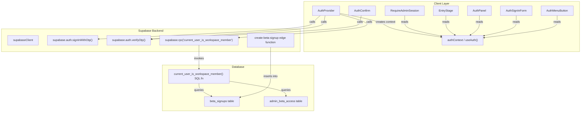
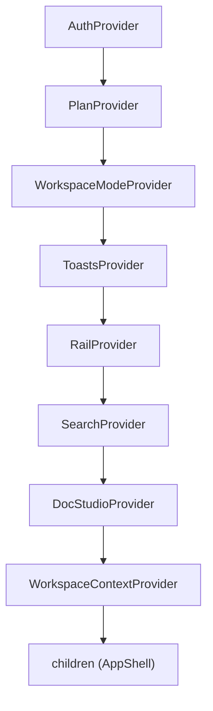
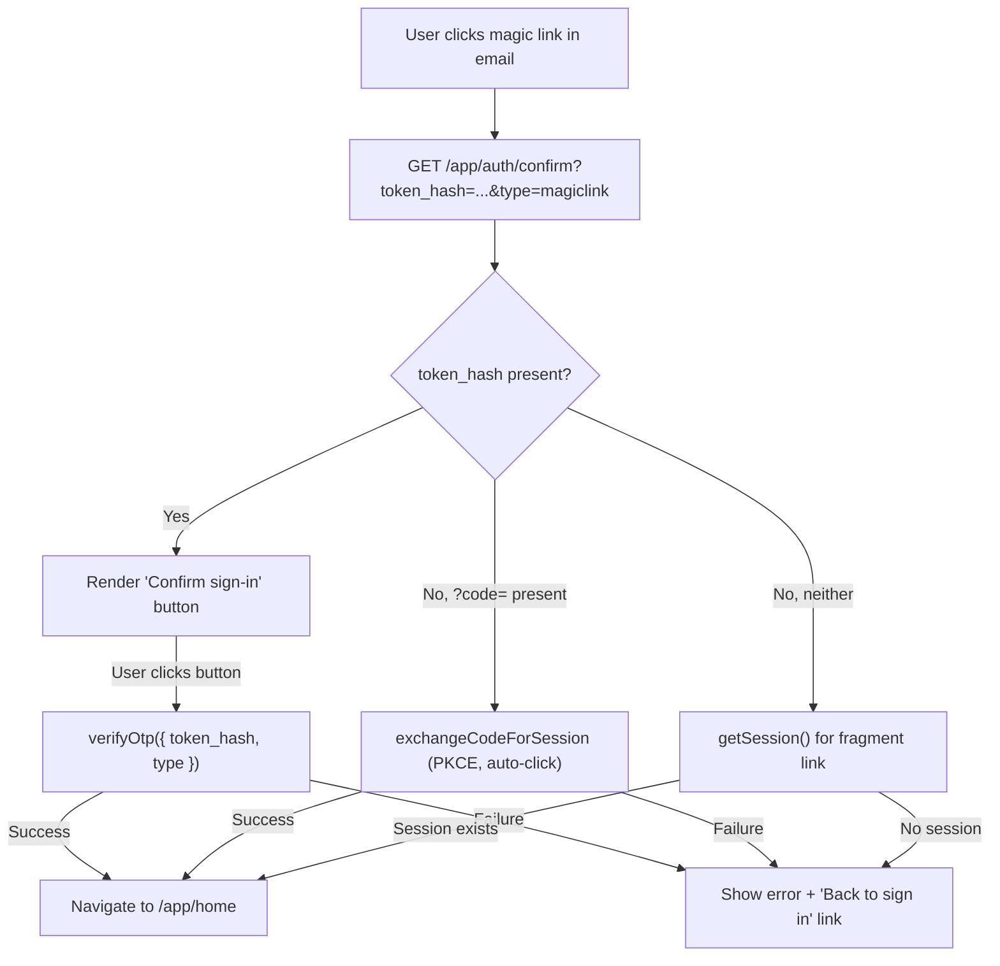
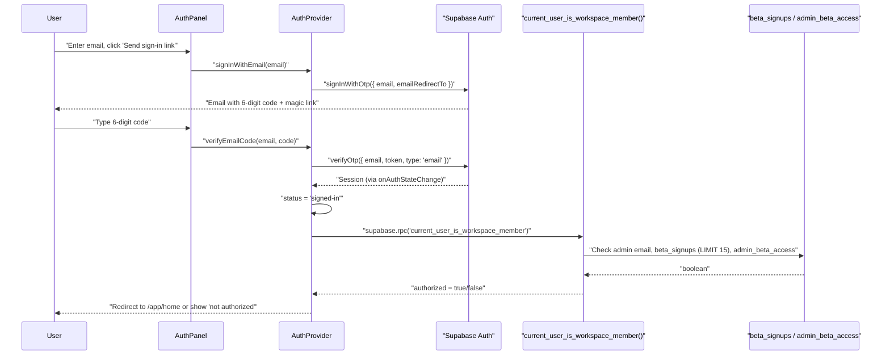
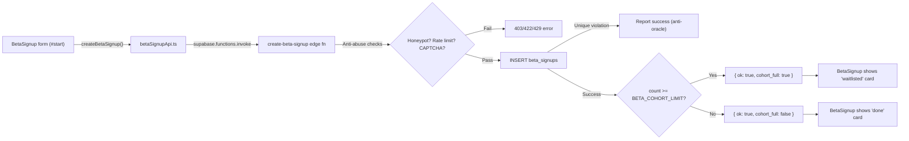

# Authentication System

<details>
<summary>Relevant source files</summary>

The following files were used as context for generating this wiki page:

- [SECURITY.md](SECURITY.md)
- [docs/AUTH_MAGIC_LINK.md](docs/AUTH_MAGIC_LINK.md)
- [docs/BILLING_BETA_AUDIT.md](docs/BILLING_BETA_AUDIT.md)
- [public/.well-known/security.txt](public/.well-known/security.txt)
- [src/features/app/auth/AuthConfirm.test.tsx](src/features/app/auth/AuthConfirm.test.tsx)
- [src/features/app/auth/AuthConfirm.tsx](src/features/app/auth/AuthConfirm.tsx)
- [src/features/app/auth/AuthPanel.test.tsx](src/features/app/auth/AuthPanel.test.tsx)
- [src/features/app/auth/AuthPanel.tsx](src/features/app/auth/AuthPanel.tsx)
- [src/features/app/auth/AuthProvider.test.tsx](src/features/app/auth/AuthProvider.test.tsx)
- [src/features/app/auth/AuthProvider.tsx](src/features/app/auth/AuthProvider.tsx)
- [src/features/app/auth/AuthSignInForm.tsx](src/features/app/auth/AuthSignInForm.tsx)
- [src/features/app/auth/authContext.ts](src/features/app/auth/authContext.ts)
- [src/features/marketing/betaSignupApi.test.ts](src/features/marketing/betaSignupApi.test.ts)
- [src/features/marketing/betaSignupApi.ts](src/features/marketing/betaSignupApi.ts)
- [src/features/marketing/sections/BetaSignup.test.tsx](src/features/marketing/sections/BetaSignup.test.tsx)
- [src/features/marketing/sections/BetaSignup.tsx](src/features/marketing/sections/BetaSignup.tsx)
- [src/i18n/messages/auth.ts](src/i18n/messages/auth.ts)
- [src/i18n/messages/faq.ts](src/i18n/messages/faq.ts)
- [src/i18n/messages/landing.ts](src/i18n/messages/landing.ts)
- [supabase/functions/create-beta-signup/index.ts](supabase/functions/create-beta-signup/index.ts)

</details>

The Dutiva workspace uses a **passwordless magic-link** authentication flow built on Supabase OTP. There are no passwords anywhere in the system. Authentication is provided by `AuthProvider`, consumed via the `useAuth()` hook, and enforced by `RequireAdminSession`. Workspace membership authorization is resolved server-side by the `current_user_is_workspace_member()` Postgres RPC, which implements beta cohort admission logic capped at `BETA_COHORT_LIMIT` (15) signups.

## Architecture Overview

**Auth system to code entity mapping:**



Sources: [src/features/app/auth/AuthProvider.tsx:1-134](), [src/features/app/auth/authContext.ts:1-67](), [src/features/app/auth/RequireAdminSession.tsx:1-53](), [src/features/app/auth/AuthConfirm.tsx:1-178](), [src/features/app/auth/AuthPanel.tsx:1-341](), [src/features/app/auth/AuthSignInForm.tsx:1-117](), [src/features/app/auth/AuthMenuButton.tsx:1-91](), [supabase/migrations/0067_beta_cohort_capacity.sql:40-64]()

## Supabase Client & Configured-or-Inert Pattern

The browser-side Supabase client is created in `src/lib/supabaseClient.ts`. It follows the **configured-or-inert** pattern: without `VITE_SUPABASE_URL` and `VITE_SUPABASE_ANON_KEY` environment variables, the exported `supabase` is `null`, and every auth-gated feature degrades to its signed-out state rather than throwing.

```typescript
export const supabase: SupabaseClient | null =
  SUPA_URL && SUPA_KEY ? createClient(SUPA_URL, SUPA_KEY) : null
```

This single null-check propagates through the entire auth system: `AuthProvider` initializes to `'signed-out'` when `supabase` is null, `RequireAdminSession` passes children through as a no-op, and `EntryStage` renders an `EnterWorkspaceCard` instead of `AuthPanel`.

Sources: [src/lib/supabaseClient.ts:1-16](), [src/features/app/auth/AuthProvider.tsx:19](), [src/features/app/auth/RequireAdminSession.tsx:37](), [src/features/app/shell/EntryStage.tsx:200]()

## AuthContext & AuthStatus Lifecycle

### `AuthStatus` Type

Defined in `authContext.ts`, the `AuthStatus` type is a four-value union representing the authentication lifecycle:

```typescript
export type AuthStatus = 'loading' | 'signed-out' | 'sent-link' | 'signed-in'
```

| Status       | Meaning                                          | Trigger                                                                                    |
| ------------ | ------------------------------------------------ | ------------------------------------------------------------------------------------------ |
| `loading`    | Initial state; Supabase `getSession()` in flight | Component mount (when `supabase` is non-null)                                              |
| `signed-out` | No active session; or Supabase unconfigured      | `getSession()` returns null, `onAuthStateChange` fires `SIGNED_OUT`, or `supabase` is null |
| `sent-link`  | Magic link email dispatched successfully         | `signInWithOtp` resolves without error                                                     |
| `signed-in`  | Active Supabase session present                  | `getSession()` returns session, or `onAuthStateChange` fires with a session                |

Sources: [src/features/app/auth/authContext.ts:14]()

### `AuthContextValue` Interface

The context exposes six fields:

| Field             | Type                                             | Purpose                                                                         |
| ----------------- | ------------------------------------------------ | ------------------------------------------------------------------------------- |
| `status`          | `AuthStatus`                                     | Current lifecycle state                                                         |
| `session`         | `Session \| null`                                | Raw Supabase session (JWT, user info)                                           |
| `authorized`      | `boolean \| null`                                | Workspace membership result; `null` while check is in flight or when signed out |
| `signInWithEmail` | `(email, opts?) => Promise<string \| undefined>` | Sends magic link; returns error message or `undefined` on success               |
| `verifyEmailCode` | `(email, code) => Promise<string \| undefined>`  | Verifies 6-digit code; returns error message or `undefined`                     |
| `signOut`         | `() => Promise<void>`                            | Ends the session                                                                |

The `useAuth()` hook consumes this context and throws if used outside `AuthProvider`.

Sources: [src/features/app/auth/authContext.ts:16-66]()

## AuthProvider Implementation

`AuthProvider` is defined in `src/features/app/auth/AuthProvider.tsx` and sits at the top of the `AppProviders` composition tree.

### Provider Position in the Stack



`AuthProvider` must be outermost because `WorkspaceModeProvider` reads the session to resolve demo/production mode, and `PlanProvider` reads the signed-in account's plan.

Sources: [src/features/app/AppProviders.tsx:25-43]()

### Session Bootstrap

On mount, the provider:

1. Calls `supabase.auth.getSession()` to check for an existing session (e.g. from `localStorage`)
2. Subscribes to `supabase.auth.onAuthStateChange()` for real-time session updates
3. Sets `status` to `'signed-in'` or `'signed-out'` based on the result

The subscription is cleaned up on unmount.

Sources: [src/features/app/auth/AuthProvider.tsx:22-38]()

### Magic Link Dispatch (`signInWithEmail`)

The `signInWithEmail` callback calls `supabase.auth.signInWithOtp()` with:

- The user's email
- `emailRedirectTo` set to `${window.location.origin}/app/auth/confirm`
- Optional `data: { full_name: name }` when the sign-up tab provides a display name

Key design decisions:

- **No client-side eligibility check** — the link is sent to any syntactically valid address. Checking membership before sending would create an oracle for beta-list membership.
- **Bilingual error handling** — Supabase's raw English `error.message` is never surfaced. Instead, the error is logged and a localized `auth_generic_error` message is returned.
- On success, `status` transitions to `'sent-link'`.

Sources: [src/features/app/auth/AuthProvider.tsx:61-93]()

### 6-Digit Code Verification (`verifyEmailCode`)

The `verifyEmailCode` callback handles the typed-code path, which is **scanner-proof** — unlike a magic link URL, a 6-digit code cannot be consumed by anything that merely fetches or renders a page.

Implementation detail: the code tries both OTP types (`'email'` then `'signup'`) because GoTrue assigns different types depending on whether the user already existed. A type mismatch is a lookup miss (not a spend), so the token survives a wrong guess.

```typescript
for (const type of ['email', 'signup'] as const) {
  const { error } = await supabase.auth.verifyOtp({ email, token, type })
  if (!error) return undefined
  lastError = error
}
```

Sources: [src/features/app/auth/AuthProvider.tsx:95-121]()

### Workspace Membership Check

A second `useEffect` fires when `status` becomes `'signed-in'`. It calls the `current_user_is_workspace_member` RPC and sets `authorized` to the boolean result. If the RPC errors, `authorized` defaults to `false`.

```typescript
supabase.rpc('current_user_is_workspace_member').then(({ data, error }) => {
  if (cancelled) return
  if (error) {
    setAuthorized(false)
    return
  }
  setAuthorized(data === true)
})
```

The `authorized` field is `null` while the check is in flight. Downstream gates (`RequireAdminSession`, `EntryStage`) treat `null` as a loading state to avoid flashing the "not authorized" screen.

Sources: [src/features/app/auth/AuthProvider.tsx:40-59]()

## AuthConfirm — Click-Gate for Token Exchange

`AuthConfirm` is the route component at `/app/auth/confirm`. It is the magic-link landing page.

### Scanner-Proof Design

**The problem:** Email-provider link scanners (notably Google Workspace's) not only prefetch URLs but also run JavaScript. On 2026-08-08, a Google scanner loaded the confirm page 33 seconds after send, executed `verifyOtp`, and consumed the one-time token before the user clicked.

**The solution:** When a `token_hash` is present in the query string, `AuthConfirm` stores it in component state (`pending`) and renders a **"Confirm sign-in" button**. The token is spent only on click. Scanners render pages but do not press buttons.

**Auth confirm flow:**



The `?code=` PKCE branch is exempt from the click gate because PKCE already requires a `code_verifier` from the requesting browser's storage, which scanners don't have.

Sources: [src/features/app/auth/AuthConfirm.tsx:1-178](), [docs/AUTH_EMAIL_TEMPLATES.md:1-60]()

## Sign-In UI Components

### AuthPanel

`AuthPanel` at [src/features/app/auth/AuthPanel.tsx:35-341]() is the dedicated sign-in / sign-up card rendered on `/app/welcome` by `EntryStage`. It has:

- **Sign in / Sign up toggle** — both tabs use the same `signInWithOtp` call. The sign-up tab additionally captures a `full_name` carried as user metadata.
- **Account signup alert** — after Supabase creates the `auth.users` row, `handle_new_user()` (migration 0093) inserts `profiles` and enqueues an operator `account_signup` notification (`plan: free`, `source: auth`). The address is the outbox `recipient`, not the payload.
- **"Check your inbox" state** — after link dispatch, shows the 6-digit code entry form as the primary path.
- **"Not authorized" state** — when a session exists but `authorized` is false, shows the `auth_not_authorized` message (referencing `BETA_COHORT_LIMIT`).

Sources: [src/features/app/auth/AuthPanel.tsx:35-341]()

### AuthSignInForm

`AuthSignInForm` at [src/features/app/auth/AuthSignInForm.tsx:17-117]() is a compact magic-link form embedded in `AuthMenuButton` (topbar) and `GuidanceSourcesPanel` (Knowledge view). It provides a two-step flow: email entry → 6-digit code.

Sources: [src/features/app/auth/AuthSignInForm.tsx:1-117]()

### AuthMenuButton

`AuthMenuButton` at [src/features/app/auth/AuthMenuButton.tsx:15-91]() is the topbar account icon. It renders a popover with: `AuthSignInForm` when signed out, a signed-in indicator with sign-out button when authenticated.

Sources: [src/features/app/auth/AuthMenuButton.tsx:1-91]()

## Email Templates & the Code-First Pattern

The Supabase email templates must include both `{{ .Token }}` (the 6-digit code) and a link using `{{ .TokenHash }}`. The script `scripts/apply-auth-email-templates.mjs` applies these templates via the Supabase Management API.

The magic link template:

```html
<p>Your sign-in code:</p>
<p style="font-size:28px;font-weight:700;letter-spacing:6px;">{{ .Token }}</p>
<p>
  Or
  <a href="{{ .RedirectTo }}?token_hash={{ .TokenHash }}&type=magiclink"> sign in on this device</a
  >.
</p>
```

`{{ .Token }}` and `{{ .TokenHash }}` are two representations of the same one-time credential — spending either spends both. The code is presented first because it is the robust path.

Sources: [scripts/apply-auth-email-templates.mjs:47-65](), [docs/AUTH_EMAIL_TEMPLATES.md:83-95]()

## RequireAdminSession Gate

`RequireAdminSession` at [src/features/app/auth/RequireAdminSession.tsx:33-53]() wraps all `/app` routes and enforces the invite-only workspace boundary.

| Condition                                       | Behavior                                                    |
| ----------------------------------------------- | ----------------------------------------------------------- |
| `supabase` is null                              | Pass through (local dev/tests)                              |
| `isVercelPreview()` is true                     | Pass through (internal preview deployments)                 |
| `status === 'loading'` or `authorized === null` | Render blank div (avoid flash)                              |
| `status === 'signed-in' && authorized === true` | Render children                                             |
| All other cases                                 | `<Navigate to="/app/welcome">` with `state.from` for return |

`isVercelPreview()` returns true only when `VERCEL_ENV === 'preview'`, which is baked in at build time. Production always enforces the gate.

Sources: [src/features/app/auth/RequireAdminSession.tsx:33-53](), [src/lib/deployEnv.ts:1-25]()

## EntryStage (Welcome Page)

`EntryStage` at [src/features/app/shell/EntryStage.tsx:195-223]() is the `/app/welcome` route. It renders:

- `AuthPanel` — when Supabase is configured and the user is not authorized
- `EnterWorkspaceCard` — when Supabase is not configured (local dev)
- Nothing (blank) — when `authorized === null` (membership check in flight)
- Auto-redirect to `/app/home` (or `state.from`) — when `authorized === true`

Sources: [src/features/app/shell/EntryStage.tsx:195-223]()

## Workspace Membership Authorization

### `current_user_is_workspace_member()` RPC

This Postgres function (created in migration `0026`, capacity-capped in migration `0067`) is the single source of truth for workspace access. It is `SECURITY DEFINER`, takes no parameters, and evaluates only the calling session's own JWT email — preventing use as a list-membership oracle.

**Complete sign-in and authorization flow:**



### Admission Logic (Three Tiers)

The function grants access if the caller's email matches any of three sources:

| Source              | Condition                                                                                 | Purpose                                 |
| ------------------- | ----------------------------------------------------------------------------------------- | --------------------------------------- |
| Hardcoded admin     | `lower(email) = 'martin.constantineau@dutiva.ca'`                                         | Founder/admin always admitted           |
| `beta_signups`      | First 15 rows (by `created_at ASC, id ASC`) where `status NOT IN ('declined', 'bounced')` | Self-serve beta cohort, capacity-capped |
| `admin_beta_access` | `status IN ('invited', 'active')`                                                         | Manual operator invites, unlimited      |

The `LIMIT 15` on `beta_signups` matches `BETA_COHORT_LIMIT` in `src/config/beta.ts` and `create-beta-signup/index.ts`. Drift between these three copies is caught by `canonicalFacts.test.ts`.

Freeing a seat is done by setting a signup's status to `'declined'` (via the admin UPDATE policy from migration 0055), which excludes it from the cohort window without deleting the CASL consent record.

Sources: [supabase/migrations/0067_beta_cohort_capacity.sql:1-69](), [supabase/migrations/0026_open_workspace_to_beta_list.sql:1-59](), [src/config/beta.ts:1-19]()

### RLS Policy Integration

The same `current_user_is_workspace_member()` function gates RLS policies on sensitive tables:

| Table              | Policy                     |
| ------------------ | -------------------------- |
| `guidance_sources` | Read active public sources |
| `guidance_chunks`  | Read guidance chunks       |
| `law_updates`      | Read law updates           |

Edge functions (`advisor-chat`, `advisor-safety-event`) also call this function server-side via their own JWT client.

Sources: [supabase/migrations/0026_open_workspace_to_beta_list.sql:63-95]()

## Beta Signup Flow

The beta waiting-list is the pipeline that feeds `beta_signups` rows, which `current_user_is_workspace_member()` queries.



The `create-beta-signup` edge function (`verify_jwt: false`, public) enforces:

- **Honeypot** (`contact_fax` field) — bots fill it, real users don't see it
- **CAPTCHA** — Turnstile/hCaptcha, active once `CAPTCHA_SECRET_KEY` is set
- **Rate limits** — per-IP (5/hour) and per-email (3/hour) via `beta_signup_intake` table storing only salted hashes
- **CASL consent** — `consent === true` required (422 otherwise)
- **Anti-oracle** — repeat addresses are reported as success (unique index violation is caught silently)

The `cohort_full` flag tells the form whether the user joined the active cohort or the waiting list.

Sources: [src/features/marketing/betaSignupApi.ts:1-101](), [supabase/functions/create-beta-signup/index.ts:1-155](), [src/features/marketing/sections/BetaSignup.tsx:45-108]()

## Admin Access & Billing Bypass

Separate from workspace membership, `adminAccess.ts` determines billing bypass:

| Function                         | Logic                                                    |
| -------------------------------- | -------------------------------------------------------- |
| `isAdminEmail(email)`            | Matches explicit list (`martin.constantineau@dutiva.ca`) |
| `isInternalDutivaAccount(email)` | Any `@dutiva.ca` address                                 |
| `bypassesPaywall(email)`         | Either of the above                                      |

This is intentionally separate from `current_user_is_workspace_member()` — billing bypass is for `@dutiva.ca` staff only, while workspace access includes beta signups and manual invites.

Sources: [src/lib/billing/adminAccess.ts:1-40](), [supabase/functions/_shared/adminAccess.ts:1-16]()

## Session Storage & Security

Sessions are stored in `localStorage` (the supabase-js default). The security audit (2026-08-08) flagged that XSS could read the refresh token, but the decision was to keep `localStorage` because:

- `sessionStorage` is equally JS-readable
- The only real fix (httpOnly cookies) requires an auth proxy the SPA doesn't have
- Mitigations are in place: no `dangerouslySetInnerHTML`, `react-markdown` with no `rehype-raw`, CSP headers, and recommended refresh-token rotation with reuse detection

Sources: [docs/AUTH_MAGIC_LINK.md:118-150]()

## i18n Integration

All auth UI strings are defined in `authMessages` at [src/i18n/messages/auth.ts:10-175](). Both `AuthProvider` and all UI components consume `useI18n()` to resolve the current language. Error messages from Supabase are never surfaced directly — they are logged for diagnostics, and a localized generic message is shown instead. This is verified by test: the French locale produces French error strings, not hard-coded English.

Sources: [src/i18n/messages/auth.ts:1-175](), [src/features/app/auth/AuthProvider.tsx:17](), [src/features/app/auth/AuthProvider.test.tsx:59-91]()

---
