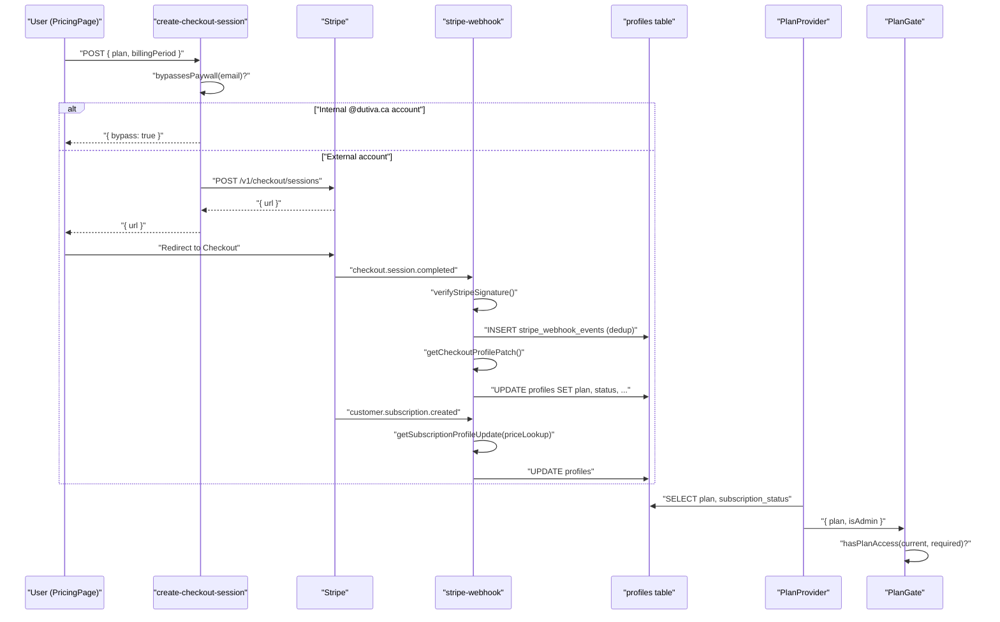
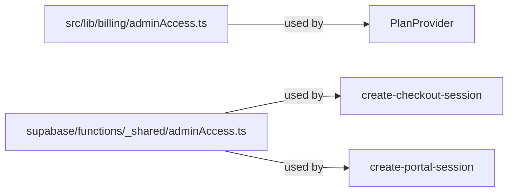
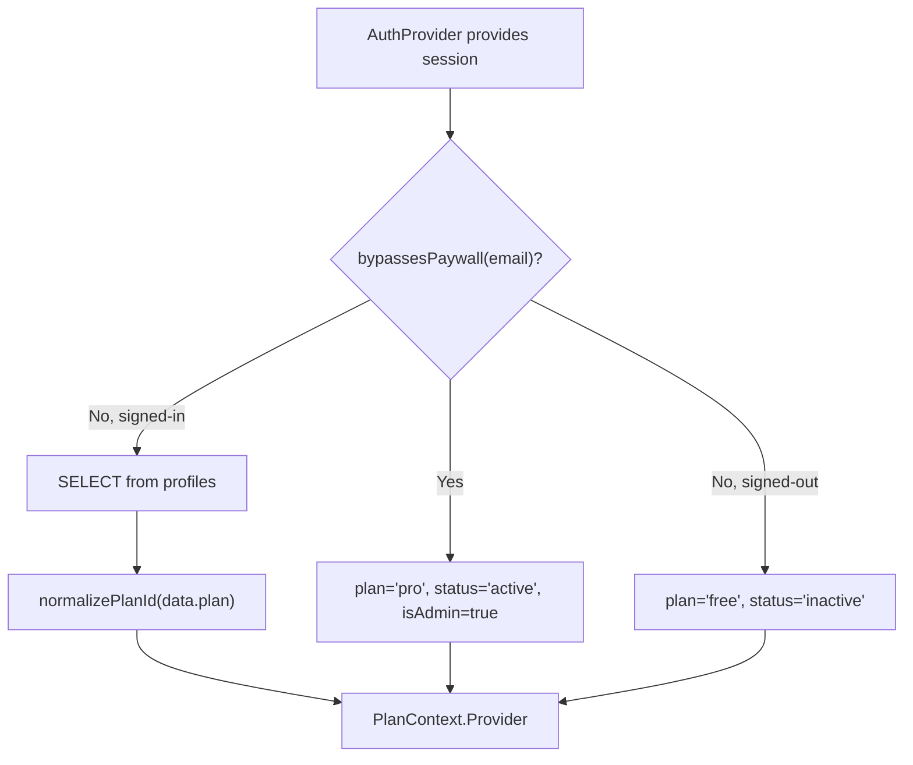
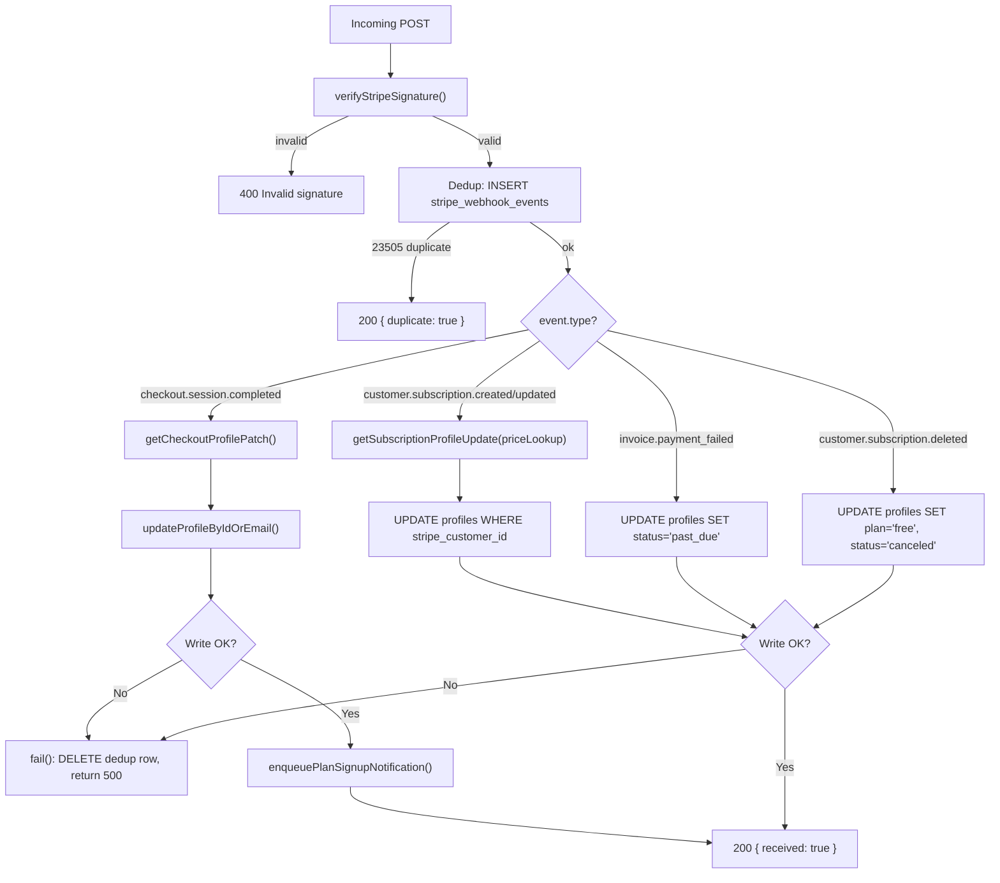
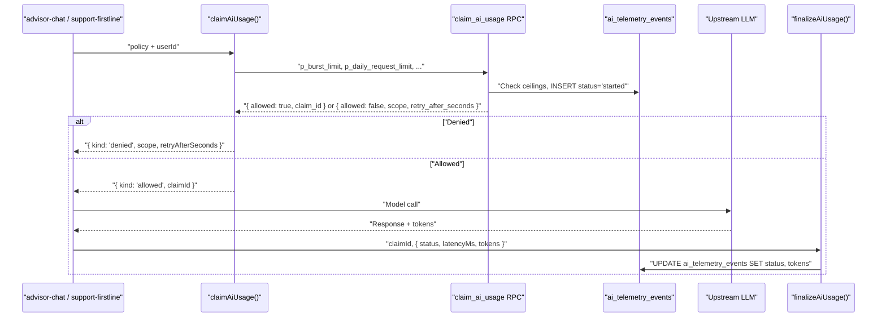

# Billing & Stripe Integration

Relevant source files

The following files were used as context for generating this wiki page:

- [docs/advisor-guidance-corpus-2026-07-26.md](docs/advisor-guidance-corpus-2026-07-26.md)
- [docs/notice-bands-review-pack.md](docs/notice-bands-review-pack.md)
- [src/app/router.tsx](src/app/router.tsx)
- [src/config/planComparison.ts](src/config/planComparison.ts)
- [src/config/plans.ts](src/config/plans.ts)
- [src/features/app/AppProviders.tsx](src/features/app/AppProviders.tsx)
- [src/features/app/advisor/safety/statutoryNotice.ts](src/features/app/advisor/safety/statutoryNotice.ts)
- [src/features/app/billing/PlanGate.tsx](src/features/app/billing/PlanGate.tsx)
- [src/features/app/docstudio/DocStudioOverlay.tsx](src/features/app/docstudio/DocStudioOverlay.tsx)
- [src/features/app/documents/screens/RepositoryScreen.tsx](src/features/app/documents/screens/RepositoryScreen.tsx)
- [src/features/app/views/templates/TemplatesView.test.tsx](src/features/app/views/templates/TemplatesView.test.tsx)
- [src/features/app/views/templates/TemplatesView.tsx](src/features/app/views/templates/TemplatesView.tsx)
- [src/features/marketing/pages/AboutPage.tsx](src/features/marketing/pages/AboutPage.tsx)
- [src/features/marketing/pages/FaqPage.tsx](src/features/marketing/pages/FaqPage.tsx)
- [src/features/marketing/pages/KnownLimitationsPage.tsx](src/features/marketing/pages/KnownLimitationsPage.tsx)
- [src/features/marketing/pages/TemplateUsagePage.tsx](src/features/marketing/pages/TemplateUsagePage.tsx)
- [supabase/functions/create-checkout-session/index.ts](supabase/functions/create-checkout-session/index.ts)
- [supabase/functions/stripe-webhook/billing-event.test.ts](supabase/functions/stripe-webhook/billing-event.test.ts)
- [supabase/functions/stripe-webhook/billing-event.ts](supabase/functions/stripe-webhook/billing-event.ts)
- [supabase/functions/stripe-webhook/index.ts](supabase/functions/stripe-webhook/index.ts)

The Dutiva billing subsystem connects a four-tier plan catalogue (Free / Starter / Growth / Pro) to Stripe Checkout, a webhook pipeline that keeps the `profiles` table in sync, and a client-side `PlanProvider` + `PlanGate` enforcement layer. **All paid plans are currently disabled** via the `PAID_PLANS_DISABLED_DURING_BETA` flag — the code is wired end-to-end but no purchase can complete until the flag is flipped and Stripe secrets are configured. Internal `@dutiva.ca` accounts bypass the paywall entirely at every layer.

## Beta Billing State

The billing system was subjected to a thorough audit documented in `docs/BILLING_BETA_AUDIT.md`. The current operational state:

| Aspect                             | Status                                                               |
| ---------------------------------- | -------------------------------------------------------------------- |
| `PAID_PLANS_DISABLED_DURING_BETA`  | `true` — paid CTAs show "coming soon"                                |
| Stripe secrets on Supabase project | Not yet set                                                          |
| Annual price IDs in Stripe         | Do not exist yet (TODO.md OA11)                                      |
| `stripe_webhook_events` table      | Exists (migration 0024 applied)                                      |
| `profiles` plan constraint         | Accepts `free`, `starter`, `growth`, `pro`, `advanced`, `enterprise` |
| Billing toggle on `/pricing`       | Hidden while beta flag is on                                         |

Sources: [docs/BILLING_BETA_AUDIT.md:1-10](), [src/config/plans.ts:79]()

## Architecture Overview

**Billing data flow — from checkout to entitlement:**

Sources: [supabase/functions/create-checkout-session/index.ts:85-184](), [supabase/functions/stripe-webhook/index.ts:107-215](), [src/features/app/billing/PlanProvider.tsx:29-95](), [src/features/app/billing/PlanGate.tsx:25-39]()

## Plan Catalogue (`src/config/plans.ts`)

The `PLANS` array defines four tiers with CAD monthly prices:

| Plan ID   | Monthly (CAD) | `stripePriceEnvVar`            | Purchasable during beta?  |
| --------- | ------------- | ------------------------------ | ------------------------- |
| `free`    | $0            | `null`                         | Yes (enters app directly) |
| `starter` | $24           | `STRIPE_PRICE_STARTER_MONTHLY` | No                        |
| `growth`  | $49           | `STRIPE_PRICE_GROWTH_MONTHLY`  | No (marked `popular`)     |
| `pro`     | $99           | `STRIPE_PRICE_PRO_MONTHLY`     | No                        |

The type `PlanId` is the union `'free' | 'starter' | 'growth' | 'pro'` [src/config/plans.ts:3](). Plans have a numeric rank (`PLAN_RANK`) used by `hasPlanAccess()` to check whether a user's current plan meets or exceeds a required tier [src/config/plans.ts:111-123]().

### Annual Pricing Convention

Annual billing charges for **10 of 12 months** (two months free), controlled by the constant `ANNUAL_MONTHS_BILLED = 10` [src/config/plans.ts:95]().

- `annualPerMonth(monthlyPrice)` = `Math.round((monthlyPrice * 10) / 12)` [src/config/plans.ts:98-99]()
- `annualTotal(monthlyPrice)` = `annualPerMonth(monthlyPrice) * 12` — derived from the rounded per-month figure so the displayed "$X/mo" and "billed $Y/yr" always reconcile [src/config/plans.ts:107-109]()

Annual billing is wired in code but **not reachable**: `PAID_PLANS_DISABLED_DURING_BETA` hides the toggle, and the annual Stripe Price objects don't exist yet [src/features/marketing/pages/PricingPage.tsx:321]().

### Beta Purchasability Gate

`isPurchasable(plan)` returns `false` for any paid plan while `PAID_PLANS_DISABLED_DURING_BETA` is `true` [src/config/plans.ts:82-84](). The `PricingPage` uses this to disable checkout buttons and overlay a "coming soon" badge [src/features/marketing/pages/PricingPage.tsx:112-113]().

Sources: [src/config/plans.ts:1-124](), [src/features/marketing/pages/PricingPage.tsx:312-408]()

### Plan Comparison Matrix

`PLAN_COMPARISON` in `src/config/planComparison.ts` defines feature-by-feature rows grouped into Advisor, Documents, Workspace, and Billing categories. Each cell is `true` (check mark), `false` (dash), or a `MarketingMessageKey` qualifier like `'pricing_v_limited'` [src/config/planComparison.ts:28-108](). This powers the `ComparisonTable` rendered on `/pricing` [src/features/marketing/pages/PricingPage.tsx:230-293]().

Sources: [src/config/planComparison.ts:1-108]()

## Admin / Paywall Bypass (`adminAccess.ts`)

Three independent copies of the bypass logic exist — a deliberate constraint because Deno edge functions cannot import from `src/`:

The client-side `bypassesPaywall(email)` returns `true` if the email is in the explicit `ADMIN_EMAILS` list (currently `martin.constantineau@dutiva.ca`) **or** if it ends with `@dutiva.ca` [src/lib/billing/adminAccess.ts:38-39](). The server-side `_shared/adminAccess.ts` mirrors this logic identically [supabase/functions/_shared/adminAccess.ts:11-15]().

Three helper functions are exported from the client-side module:

| Function                         | Purpose                                 |
| -------------------------------- | --------------------------------------- |
| `isAdminEmail(email)`            | Checks the explicit admin list          |
| `isInternalDutivaAccount(email)` | Checks the `@dutiva.ca` domain suffix   |
| `bypassesPaywall(email)`         | Either of the above — the paywall check |

The test suite verifies case-insensitivity, whitespace trimming, lookalike domain rejection (`@notdutiva.ca.evil.com`), and null/undefined safety [src/lib/billing/adminAccess.test.ts:1-36]().

Sources: [src/lib/billing/adminAccess.ts:1-40](), [supabase/functions/_shared/adminAccess.ts:1-16](), [src/lib/billing/adminAccess.test.ts:1-36]()

## Client-Side: PlanProvider & PlanGate

### PlanProvider

`PlanProvider` sits inside `AuthProvider` and outside `WorkspaceModeProvider` in the provider hierarchy [src/features/app/AppProviders.tsx:27-40](). It resolves the signed-in account's billing state:

For admin accounts, the provider immediately resolves to `plan: 'pro'` with `subscriptionStatus: 'active'` without touching the database [src/features/app/billing/PlanProvider.tsx:43-51](). For regular accounts it queries `profiles` and normalizes the plan via `normalizePlanId()`, which maps any unrecognized value to `'free'` [src/config/plans.ts:113-118]().

The `PlanContextValue` interface exposes `plan`, `subscriptionStatus`, `stripeCustomerId`, `isAdmin`, and `loading` [src/features/app/billing/planContext.ts:4-11](). The `usePlan()` hook consumes it [src/features/app/billing/planContext.ts:15-19]().

Sources: [src/features/app/billing/PlanProvider.tsx:1-95](), [src/features/app/billing/planContext.ts:1-19](), [src/features/app/AppProviders.tsx:25-43]()

### PlanGate Component

`PlanGate` is a declarative paywall gate for workspace views. It accepts a `required` plan tier and renders children or an upgrade nudge:

| Condition                       | Behavior                                                        |
| ------------------------------- | --------------------------------------------------------------- |
| `loading`                       | Renders nothing                                                 |
| `mode === 'demo'`               | Always renders children (demo shows full product)               |
| `isAdmin`                       | Always renders children (admin bypass)                          |
| `hasPlanAccess(plan, required)` | Renders children                                                |
| Otherwise                       | Renders `UpgradeNudge` linking to `/pricing?upgrade={required}` |

[src/features/app/billing/PlanGate.tsx:25-39]()

The `DocStudioOverlay` imports `PlanGate` to gate premium document studio features [src/features/app/docstudio/DocStudioOverlay.tsx:9]().

The test suite covers all five paths: demo mode bypass, sufficient plan, exceeding plan, admin bypass, insufficient plan (nudge), and loading state [src/features/app/billing/PlanGate.test.tsx:68-101]().

Sources: [src/features/app/billing/PlanGate.tsx:1-62](), [src/features/app/billing/PlanGate.test.tsx:1-101]()

## Edge Function: `create-checkout-session`

**Auth mode:** `verify_jwt = true` (implicit — not listed in `config.toml` overrides). Authenticates the caller via bearer JWT.

The function flow:

1. **Validate secrets** — returns 503 if `STRIPE_SECRET_KEY` is missing [supabase/functions/create-checkout-session/index.ts:89-90]()
2. **Authenticate user** — extracts JWT from `Authorization` header, calls `getUser(token)` [supabase/functions/create-checkout-session/index.ts:108-110]()
3. **Admin bypass** — if `bypassesPaywall(user.email)`, returns `{ bypass: true }` without calling Stripe [supabase/functions/create-checkout-session/index.ts:112-117]()
4. **Normalize inputs** — `normalizePlan()` allowlists `starter | growth | pro`; `normalizePeriod()` defaults unrecognized values to `'monthly'` (failing to the cheaper interval) [supabase/functions/create-checkout-session/index.ts:55-69]()
5. **Resolve price ID** — looks up `PRICE_ENV_KEYS[period][plan]` from env; returns 503 if missing (never silently falls back to a different interval) [supabase/functions/create-checkout-session/index.ts:133-140]()
6. **Customer management** — reads `stripe_customer_id` from `profiles`; creates a Stripe customer if absent and upserts the profile [supabase/functions/create-checkout-session/index.ts:142-159]()
7. **Create session** — calls `POST /v1/checkout/sessions` with server-set metadata (`user_id`, `plan`, `billing_interval`) on both the session and `subscription_data` [supabase/functions/create-checkout-session/index.ts:162-179]()
8. **Return URL** — the client redirects to `session.url` [supabase/functions/create-checkout-session/index.ts:181-183]()

The `PRICE_ENV_KEYS` matrix maps billing period × plan to environment variable names:

| Period  | Starter                        | Growth                        | Pro                        |
| ------- | ------------------------------ | ----------------------------- | -------------------------- |
| monthly | `STRIPE_PRICE_STARTER_MONTHLY` | `STRIPE_PRICE_GROWTH_MONTHLY` | `STRIPE_PRICE_PRO_MONTHLY` |
| annual  | `STRIPE_PRICE_STARTER_ANNUAL`  | `STRIPE_PRICE_GROWTH_ANNUAL`  | `STRIPE_PRICE_PRO_ANNUAL`  |

[supabase/functions/create-checkout-session/index.ts:42-53]()

Sources: [supabase/functions/create-checkout-session/index.ts:1-184]()

## Edge Function: `create-portal-session`

**Auth mode:** `verify_jwt = true`. Opens a Stripe billing portal for existing subscribers.

The function authenticates the user, checks `bypassesPaywall()` (returning `{ bypass: true }` for internal accounts) [supabase/functions/create-portal-session/index.ts:65-67](), reads `stripe_customer_id` from `profiles` (404 if absent) [supabase/functions/create-portal-session/index.ts:69-77](), and creates a portal session via `POST /v1/billing_portal/sessions` with `return_url` pointing back to `/pricing` [supabase/functions/create-portal-session/index.ts:80-84]().

Sources: [supabase/functions/create-portal-session/index.ts:1-89]()

## Edge Function: `stripe-webhook`

**Auth mode:** `verify_jwt = false` — authenticated by Stripe signature, not a JWT [supabase/config.toml:25-26]().

### Signature Verification

`verifyStripeSignature()` in `verify-signature.ts` implements Stripe's HMAC-SHA-256 scheme using only WebCrypto (no third-party dependency):

1. Parses `t=` (timestamp) and `v1=` (signature) from the `Stripe-Signature` header [supabase/functions/stripe-webhook/verify-signature.ts:47-49]()
2. Rejects payloads outside a 300-second replay window [supabase/functions/stripe-webhook/verify-signature.ts:53-56]()
3. Computes `HMAC_SHA256(secret, "${timestamp}.${body}")` [supabase/functions/stripe-webhook/verify-signature.ts:58-69]()
4. Uses a length-aware constant-time compare (`constantTimeEqual`) to defeat timing attacks [supabase/functions/stripe-webhook/verify-signature.ts:79-85]()

### Idempotency via `stripe_webhook_events`

Before processing, the handler inserts `{ event_id, event_type }` into `stripe_webhook_events`. A unique constraint violation (Postgres error `23505`) means the event was already processed — the handler returns `{ received: true, duplicate: true }` [supabase/functions/stripe-webhook/index.ts:128-139]().

If the business logic fails, the `fail()` helper **deletes the dedup row** before returning non-2xx, so that Stripe's retry hits a clean table and can reprocess the event [supabase/functions/stripe-webhook/index.ts:146-151]().

### Event Processing

Sources: [supabase/functions/stripe-webhook/index.ts:1-267](), [supabase/functions/stripe-webhook/verify-signature.ts:1-86]()

### Handled Stripe Events

| Event                           | Handler                                                            | Profile Update                                                                                                                              |
| ------------------------------- | ------------------------------------------------------------------ | ------------------------------------------------------------------------------------------------------------------------------------------- |
| `checkout.session.completed`    | `getCheckoutProfilePatch()` then `enqueuePlanSignupNotification()` | `plan`, `subscription_status='active'`, `billing_period`, `stripe_customer_id`, `stripe_subscription_id`; operator `plan_signup` outbox row |
| `customer.subscription.created` | `getSubscriptionProfileUpdate()`                                   | `plan` (from price lookup), `subscription_status`, `billing_period`, `stripe_subscription_id`                                               |
| `customer.subscription.updated` | `getSubscriptionProfileUpdate()`                                   | Same as above — handles plan changes and status transitions                                                                                 |
| `invoice.payment_failed`        | Inline                                                             | `subscription_status='past_due'`                                                                                                            |
| `customer.subscription.deleted` | Inline                                                             | `plan='free'`, `subscription_status='canceled'`                                                                                             |

Sources: [supabase/functions/stripe-webhook/index.ts:153-231]()

When the profile write succeeds, `enqueuePlanSignupNotification()` inserts a `plan_signup` row on `support_notifications` (operator audience). The payload is `{ plan, billing_period, source: 'stripe_checkout' }` and never includes the customer email — that stays on `profiles`. A notify insert failure is logged and does not fail the Stripe delivery, so entitlement is not rolled back for a mail outbox miss. Advisor-pack checkouts return before this path.

Sources: [supabase/functions/stripe-webhook/index.ts:116-134](), [supabase/functions/stripe-webhook/index.ts:211-213](), [supabase/functions/stripe-webhook/billing-event.ts:26-30]()

## Billing Event Helpers (`billing-event.ts`)

Pure functions that translate Stripe payloads into `profiles` patches:

### `getCheckoutProfilePatch(session)`

Reads plan from **server-set metadata only** (`metadata.plan`) — never from `session.line_items`, which Stripe does not include in webhook payloads (see the EF5 note at [supabase/functions/stripe-webhook/billing-event.ts:74-101]()). Unrecognized plans default to `'free'` (never silently grants a paid plan) [supabase/functions/stripe-webhook/billing-event.ts:115](). Missing `billing_interval` defaults to `'monthly'` [supabase/functions/stripe-webhook/billing-event.ts:119]().

User identity resolution: `metadata.user_id` → `session.client_reference_id` for the user ID; `session.customer_email` → `session.customer_details.email` for the email fallback [supabase/functions/stripe-webhook/billing-event.ts:122-125]().

### `getSubscriptionProfileUpdate(subscription, priceLookup)`

Unlike checkout sessions, subscription payloads **do carry** `items.data[0].price`, so this handler performs **price-authoritative** plan resolution. The `buildPriceLookup()` in the webhook maps env-var price IDs to plan/period pairs [supabase/functions/stripe-webhook/index.ts:39-46](). Price match takes precedence over metadata, so a dashboard-side plan change propagates correctly [supabase/functions/stripe-webhook/billing-event.ts:148]().

When the price is unrecognized and metadata is silent, `billing_period` is **omitted** (not defaulted to monthly) — this prevents silently rewriting a stored `'annual'` back to `'monthly'` [supabase/functions/stripe-webhook/billing-event.ts:158-159]().

### `normalizeSubscriptionStatus(value)`

Maps Stripe's wider status vocabulary onto the five values the `profiles` CHECK constraint accepts:

| Stripe Status        | Stored As  |
| -------------------- | ---------- |
| `active`             | `active`   |
| `trialing`           | `trialing` |
| `past_due`           | `past_due` |
| `canceled`           | `canceled` |
| `unpaid`             | `past_due` |
| `incomplete`         | `inactive` |
| `incomplete_expired` | `inactive` |
| `paused`             | `inactive` |
| Anything else        | `inactive` |

This fails closed: an unrecognized status reads as `inactive` rather than something that would grant entitlement [supabase/functions/stripe-webhook/billing-event.ts:57-71]().

Sources: [supabase/functions/stripe-webhook/billing-event.ts:1-165](), [supabase/functions/stripe-webhook/billing-event.test.ts:1-200]()

## Database Schema

### `profiles` Table

Created by migration `0013_add_billing_profiles.sql`, reconciled by `0024`, and extended by `0043`:

| Column                   | Type          | Default      | Constraint                                                     |
| ------------------------ | ------------- | ------------ | -------------------------------------------------------------- |
| `id`                     | `uuid` PK     | —            | FK → `auth.users(id) ON DELETE CASCADE`                        |
| `account_email`          | `text`        | —            | —                                                              |
| `plan`                   | `text`        | `'free'`     | `IN ('free','starter','growth','pro','advanced','enterprise')` |
| `subscription_status`    | `text`        | `'inactive'` | `IN ('active','trialing','past_due','canceled','inactive')`    |
| `billing_period`         | `text`        | `'monthly'`  | `IN ('monthly','annual')` (after migration 0043)               |
| `stripe_customer_id`     | `text`        | —            | Indexed where not null                                         |
| `stripe_subscription_id` | `text`        | —            | —                                                              |
| `created_at`             | `timestamptz` | `now()`      | —                                                              |
| `updated_at`             | `timestamptz` | `now()`      | Auto-set by trigger                                            |

[supabase/migrations/0013_add_billing_profiles.sql:12-25]()

**RLS:** Enabled. Single select-only policy scoped to `auth.uid()` — all billing writes use the service-role key [supabase/migrations/0013_add_billing_profiles.sql:53-56]().

**Billing column pinning:** Migration `0024` adds a `BEFORE UPDATE` trigger `pin_profile_billing_columns` that silently reverts any change to `plan`, `subscription_status`, `billing_period`, `stripe_customer_id`, or `stripe_subscription_id` made by an `authenticated` or `anon` role. The service-role key bypasses this trigger, ensuring only edge functions can modify billing state [supabase/migrations/0024_reconcile_billing_schema.sql:56-80]().

### `stripe_webhook_events` Table

| Column        | Type          | Notes                                             |
| ------------- | ------------- | ------------------------------------------------- |
| `event_id`    | `text` PK     | Stripe event ID, unique constraint provides dedup |
| `event_type`  | `text`        | e.g. `checkout.session.completed`                 |
| `received_at` | `timestamptz` | Default `now()`                                   |

RLS enabled with no policies — only the service-role key can read/write [supabase/migrations/0013_add_billing_profiles.sql:63-69]().

Sources: [supabase/migrations/0013_add_billing_profiles.sql:1-69](), [supabase/migrations/0024_reconcile_billing_schema.sql:1-81](), [supabase/migrations/0043_billing_period_annual.sql:1-62]()

## AI Usage Metering

While billing is disabled during beta, the AI API is the only surface that generates upstream cost. Usage metering is enforced via the `claim_ai_usage` / `finalizeAiUsage` pattern in `supabase/functions/_shared/aiUsage.ts`.

### Metering Flow

### Usage Ceilings

| Ceiling         | Default            | Env Override              | Scope                    |
| --------------- | ------------------ | ------------------------- | ------------------------ |
| Burst (chat)    | 10 requests / 300s | `AI_BURST_LIMIT_CHAT`     | Per-user, per-operation  |
| Burst (support) | 6 requests / 300s  | `AI_BURST_LIMIT_SUPPORT`  | Per-user, per-operation  |
| Daily requests  | 120                | `AI_DAILY_REQUEST_LIMIT`  | Per-user, all operations |
| Daily tokens    | 250,000            | `AI_DAILY_TOKEN_LIMIT`    | Per-user, all operations |
| Platform daily  | 2,000              | `AI_PLATFORM_DAILY_LIMIT` | All users combined       |

[supabase/functions/_shared/aiUsage.ts:74-79]()

The `METERED_OPERATIONS` are `'chat'` and `'support_firstline'`. The `safety_backstop` operation is deliberately excluded — it records a deterministic gate firing client-side, costs nothing upstream, and must never consume a user's budget [supabase/functions/_shared/aiUsage.ts:37-39]().

A claim that is never finalized (e.g. function timeout) stays at `status = 'started'` and continues counting against the caller — this is the fail-safe direction, over-counting rather than leaking free calls [supabase/functions/_shared/aiUsage.ts:21-23]().

Sources: [supabase/functions/_shared/aiUsage.ts:1-240](), [docs/BILLING_BETA_AUDIT.md:341-386]()

## PricingPage Client Flow

`PricingPage` (`/pricing`) is the user-facing surface that ties the billing components together:

1. **Reads auth & plan state** via `useAuth()` and `usePlan()` [src/features/marketing/pages/PricingPage.tsx:315-316]()
2. **Beta banner** shown when `PAID_PLANS_DISABLED_DURING_BETA` is true; billing toggle is hidden [src/features/marketing/pages/PricingPage.tsx:525-534]()
3. **Admin banner** shown for `isAdmin` accounts [src/features/marketing/pages/PricingPage.tsx:450-462]()
4. **`handleCheckout(plan)`** — free plan redirects to `/app/welcome`; paid plans invoke `create-checkout-session` via `supabase.functions.invoke()` [src/features/marketing/pages/PricingPage.tsx:357-408]()
5. **`handleManageBilling()`** — invokes `create-portal-session` for existing subscribers [src/features/marketing/pages/PricingPage.tsx:410-433]()
6. **Checkout return** — reads `?checkout=success|cancelled` from the URL, shows a status notice, then strips the param [src/features/marketing/pages/PricingPage.tsx:337-355]()

The "Manage billing" button only appears when `stripeCustomerId` is set on the profile [src/features/marketing/pages/PricingPage.tsx:508-523]().

Sources: [src/features/marketing/pages/PricingPage.tsx:1-606]()

## Required Stripe Secrets

These must be set as Supabase function secrets before billing goes live:

| Secret                         | Used By                                            | Notes                                                     |
| ------------------------------ | -------------------------------------------------- | --------------------------------------------------------- |
| `STRIPE_SECRET_KEY`            | `create-checkout-session`, `create-portal-session` | —                                                         |
| `STRIPE_WEBHOOK_SECRET`        | `stripe-webhook`                                   | The `whsec_…` for the webhook endpoint                    |
| `STRIPE_PRICE_STARTER_MONTHLY` | `create-checkout-session`, `stripe-webhook`        | Stripe Price ID                                           |
| `STRIPE_PRICE_GROWTH_MONTHLY`  | `create-checkout-session`, `stripe-webhook`        | Stripe Price ID                                           |
| `STRIPE_PRICE_PRO_MONTHLY`     | `create-checkout-session`, `stripe-webhook`        | Stripe Price ID                                           |
| `SITE_URL`                     | `create-checkout-session`, `create-portal-session` | Set to `https://dutiva.ca` (the default `www.` redirects) |

The Stripe webhook endpoint must be pointed at `https://<project>.supabase.co/functions/v1/stripe-webhook` and subscribed to `checkout.session.completed`, `customer.subscription.created`, `customer.subscription.updated`, `customer.subscription.deleted`, and `invoice.payment_failed` [docs/BILLING_BETA_AUDIT.md:263-268]().

Sources: [docs/BILLING_BETA_AUDIT.md:248-268]()

## Security Properties

| Property                           | Implementation                                                                                                                                        |
| ---------------------------------- | ----------------------------------------------------------------------------------------------------------------------------------------------------- |
| Client cannot set own plan         | `pin_profile_billing_columns` trigger reverts billing columns for authenticated roles [supabase/migrations/0024_reconcile_billing_schema.sql:56-80]() |
| Client cannot supply price ID      | `create-checkout-session` maps plan → env var → price ID server-side [supabase/functions/create-checkout-session/index.ts:133-139]()                  |
| Webhook signature verified         | HMAC-SHA-256 with constant-time compare and 300s replay window [supabase/functions/stripe-webhook/verify-signature.ts:35-72]()                        |
| No filter injection                | Email lookup uses parameterized `.eq()`, not `.or()` string interpolation [supabase/functions/stripe-webhook/index.ts:90-94]()                        |
| Unrecognized plan defaults to free | `normalizePlan()` returns `null` for unknown values; checkout defaults to `'free'` [supabase/functions/stripe-webhook/billing-event.ts:115]()         |
| Failed writes cause Stripe retry   | `fail()` deletes the dedup row and returns 500, triggering Stripe's retry [supabase/functions/stripe-webhook/index.ts:146-151]()                      |
| Admin bypass is domain-checked     | Only `@dutiva.ca` accounts bypass; lookalike domains are rejected [src/lib/billing/adminAccess.test.ts:22-23]()                                       |

Sources: [supabase/migrations/0024_reconcile_billing_schema.sql:56-80](), [supabase/functions/stripe-webhook/verify-signature.ts:35-86](), [supabase/functions/stripe-webhook/index.ts:87-105](), [src/lib/billing/adminAccess.test.ts:22-23]()

---
