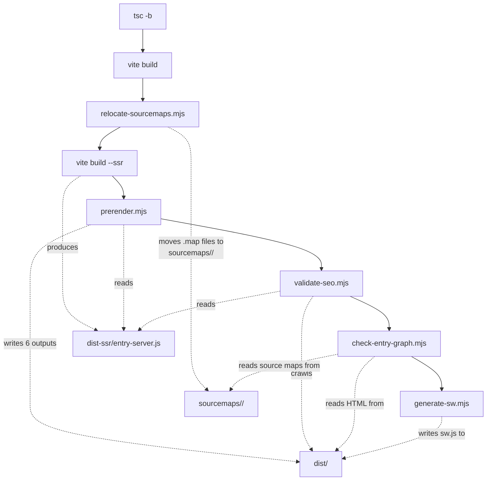
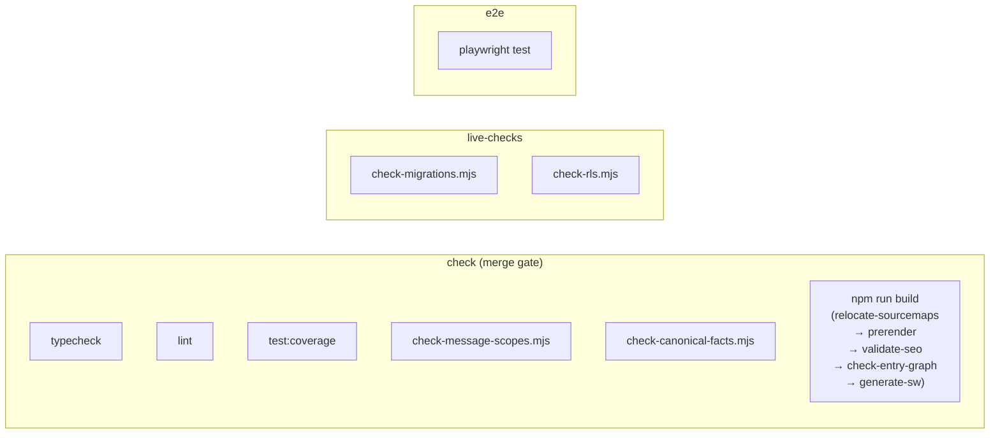
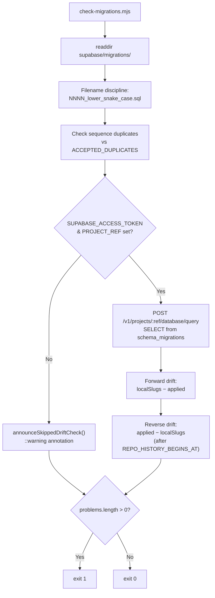
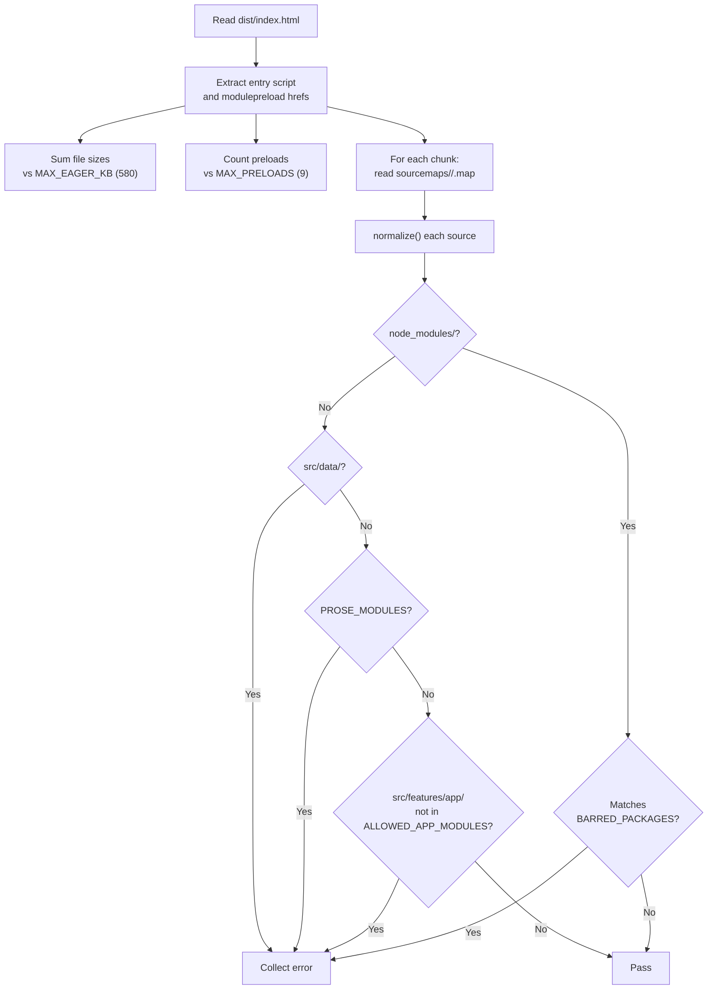
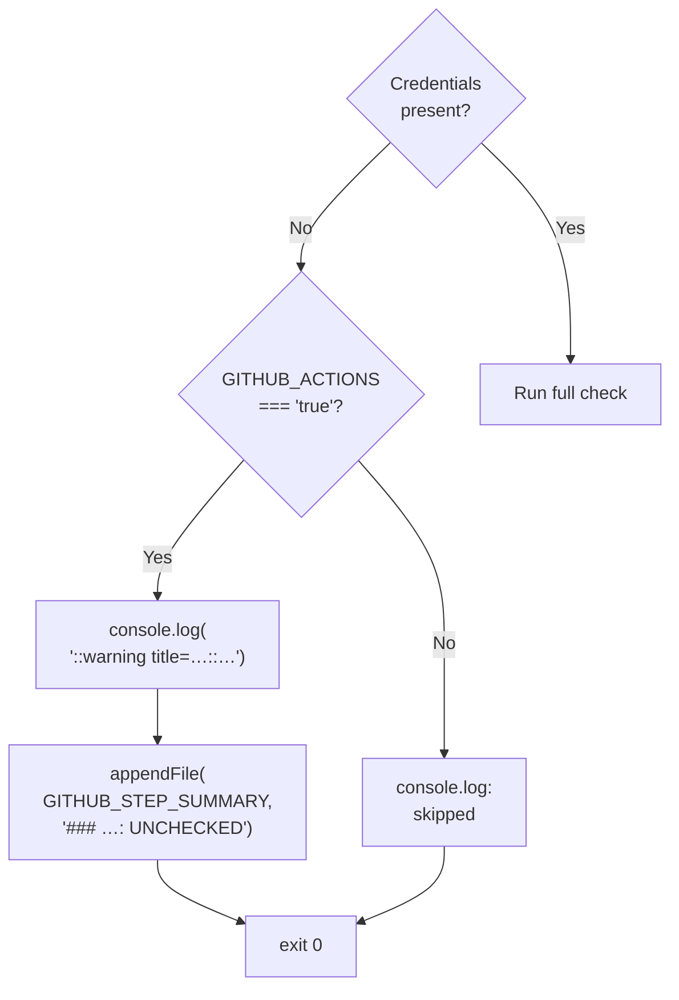
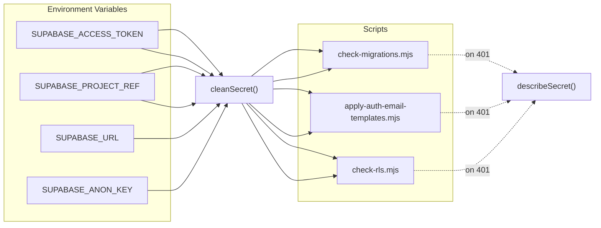

# Build Scripts & Integrity Guards

<details>
<summary>Relevant source files</summary>

The following files were used as context for generating this wiki page:

- [docs/AUTH_EMAIL_TEMPLATES.md](docs/AUTH_EMAIL_TEMPLATES.md)
- [docs/SEO_GEO_IMPLEMENTATION.md](docs/SEO_GEO_IMPLEMENTATION.md)
- [docs/SEO_ROUTE_MATRIX.md](docs/SEO_ROUTE_MATRIX.md)
- [package.json](package.json)
- [scripts/apply-auth-email-templates.mjs](scripts/apply-auth-email-templates.mjs)
- [scripts/check-entry-graph.mjs](scripts/check-entry-graph.mjs)
- [scripts/check-migrations.mjs](scripts/check-migrations.mjs)
- [scripts/check-rls.mjs](scripts/check-rls.mjs)
- [scripts/lib/secrets.mjs](scripts/lib/secrets.mjs)
- [scripts/lib/secrets.test.mjs](scripts/lib/secrets.test.mjs)
- [scripts/prerender.mjs](scripts/prerender.mjs)
- [scripts/validate-seo.mjs](scripts/validate-seo.mjs)
- [src/features/marketing/articles/articleModel.ts](src/features/marketing/articles/articleModel.ts)
- [src/features/marketing/articles/articles.test.ts](src/features/marketing/articles/articles.test.ts)
- [src/features/marketing/articles/blogArticles.ts](src/features/marketing/articles/blogArticles.ts)
- [src/features/marketing/articles/blogContent.ts](src/features/marketing/articles/blogContent.ts)
- [src/features/marketing/articles/content.ts](src/features/marketing/articles/content.ts)
- [src/features/marketing/articles/guideArticles.ts](src/features/marketing/articles/guideArticles.ts)
- [src/features/marketing/articles/guideContent.ts](src/features/marketing/articles/guideContent.ts)
- [src/features/marketing/pages/ArticlePage.test.tsx](src/features/marketing/pages/ArticlePage.test.tsx)
- [src/features/marketing/pages/ArticlePage.tsx](src/features/marketing/pages/ArticlePage.tsx)
- [src/features/marketing/pages/BlogIndexPage.test.tsx](src/features/marketing/pages/BlogIndexPage.test.tsx)
- [src/features/marketing/pages/BlogIndexPage.tsx](src/features/marketing/pages/BlogIndexPage.tsx)
- [src/features/marketing/pages/GuidesIndexPage.test.tsx](src/features/marketing/pages/GuidesIndexPage.test.tsx)
- [src/features/marketing/pages/GuidesIndexPage.tsx](src/features/marketing/pages/GuidesIndexPage.tsx)
- [src/features/marketing/pages/MarketingPage.tsx](src/features/marketing/pages/MarketingPage.tsx)
- [src/i18n/messages/blog.ts](src/i18n/messages/blog.ts)
- [src/i18n/messages/guidesIndex.ts](src/i18n/messages/guidesIndex.ts)

</details>

This page documents the 13 scripts under `scripts/`, the shared `lib/secrets.mjs` credential helper, and how they integrate into the CI pipeline and `npm run build` chain. Every script is dependency-free (Node global `fetch` and `fs` only) to avoid rotting behind package upgrades.

## Script Inventory & Execution Context

| Script                           | Trigger                                    | Credentials                                                  | Exits Non-Zero On                                     |
| -------------------------------- | ------------------------------------------ | ------------------------------------------------------------ | ----------------------------------------------------- |
| `check-migrations.mjs`           | `npm run check`, CI `live-checks`          | `SUPABASE_ACCESS_TOKEN`, `SUPABASE_PROJECT_REF` (drift half) | Bad filename, forward/reverse drift                   |
| `check-rls.mjs`                  | `npm run check:rls`, CI `live-checks`      | `SUPABASE_URL`, `SUPABASE_ANON_KEY`                          | Sensitive table readable by anon role                 |
| `check-canonical-facts.mjs`      | `npm run check:facts`, CI `check`          | None                                                         | Brand palette hex drift between CSS and docs          |
| `check-message-scopes.mjs`       | `npm run check:message-scopes`, CI `check` | None                                                         | `t('key')` literal crossing surface boundary          |
| `check-entry-graph.mjs`          | `npm run build` (post-build)               | None                                                         | Budget exceeded, barred package/source in eager graph |
| `prerender.mjs`                  | `npm run build` (post-SSR)                 | None                                                         | Missing `<Seo>`, undersized body                      |
| `validate-seo.mjs`               | `npm run build` (post-prerender)           | None                                                         | Any SEO invariant violation                           |
| `generate-sw.mjs`                | `npm run build` (last step)                | None                                                         | No assets in `dist/`                                  |
| `relocate-sourcemaps.mjs`        | `npm run build` (after `vite build`)       | None                                                         | I/O error                                             |
| `apply-auth-email-templates.mjs` | Manual `npm run auth:email-templates`      | `SUPABASE_ACCESS_TOKEN`, `SUPABASE_PROJECT_REF`              | Template not applied                                  |
| `generate-doclib.mjs`            | One-shot (historical, not runnable)        | None                                                         | N/A                                                   |

Sources: [package.json:6-26](), [.github/workflows/ci.yml:1-130]()

## Build Pipeline Ordering

The `npm run build` command chains multiple stages in a fixed order defined in `package.json` line 8:

```
tsc -b && vite build && relocate-sourcemaps.mjs && build:ssr && prerender.mjs && validate-seo.mjs && check-entry-graph.mjs && generate-sw.mjs
```

**Build pipeline flow:**



Sources: [package.json:8-9]()

## CI Job ↔ Script Mapping

The CI workflow (`.github/workflows/ci.yml`) runs three isolated jobs. Each script runs in exactly one job:



The `check` job is the required status check for merge. The `live-checks` job is isolated so a credential failure cannot block the gate — the pattern motivated by the incident where a bad `SUPABASE_ACCESS_TOKEN` reddened a required check for two days.

Sources: [.github/workflows/ci.yml:22-98]()

## `lib/secrets.mjs` — Credential Handling

Every CI credential passes through `cleanSecret()` before use. The function strips three common paste errors that produce opaque 401s: trailing newlines, wrapping quotes, and a copied `Bearer ` prefix.

`cleanSecret(raw)` strips outer whitespace, one layer of quotes (`"…"` or `'…'`), and a `Bearer ` prefix, returning `undefined` for empty or missing values. [scripts/lib/secrets.mjs:31-39]()

`describeSecret(raw)` produces a log-safe description of a credential's _shape_ (length after cleaning, presence of whitespace/quotes/Bearer prefix) without revealing the value. This is used in error messages throughout the scripts. [scripts/lib/secrets.mjs:47-58]()

`ACCESS_TOKEN_HELP` is a shared remediation string for rejected Supabase personal access tokens, used by both `check-migrations.mjs` and `apply-auth-email-templates.mjs`. [scripts/lib/secrets.mjs:64-68]()

The test file `secrets.test.mjs` verifies all paste-error recovery cases and confirms `describeSecret` never leaks the secret value. [scripts/lib/secrets.test.mjs:10-73]()

Sources: [scripts/lib/secrets.mjs:1-69](), [scripts/lib/secrets.test.mjs:1-73]()

## `check-migrations.mjs` — Migration Integrity & Drift Detection

This script has two halves:

### Half 1: Local Filename Discipline (always runs, no credentials)

Reads all `.sql` files under `supabase/migrations/` and enforces the `NNNN_lower_snake_case.sql` naming convention via the regex `FILENAME_RE = /^(\d{4})_([a-z0-9_]+)\.sql$/`. It catches:

- Malformed filenames [scripts/check-migrations.mjs:112-115]()
- Duplicate sequence numbers (unless listed in `ACCEPTED_DUPLICATES`) [scripts/check-migrations.mjs:125-132]()
- Duplicate slugs [scripts/check-migrations.mjs:119-122]()

### Half 2: Forward & Reverse Drift (requires credentials)

When `SUPABASE_ACCESS_TOKEN` and `SUPABASE_PROJECT_REF` are present, the script queries `supabase_migrations.schema_migrations` via the Supabase Management API and performs bidirectional comparison:

**Forward drift** — repo files not applied to the live project. Each local slug is checked against the applied set; slugs listed in `ACCEPTED_UNAPPLIED` (3 entries with documented reasons) are noted but not failed. [scripts/check-migrations.mjs:235-239]()

**Reverse drift** — applied migrations with no repo file. Starting from `REPO_HISTORY_BEGINS_AT = 'doclib_schema'` (everything before is pre-repo scaffolding), applied slugs missing from the repo are reported. `ACCEPTED_UNTRACKED` (2 entries) handles known intentional differences. [scripts/check-migrations.mjs:252-267]()

### Loud Skipping

When credentials are absent, `announceSkippedDriftCheck()` emits a GitHub Actions `::warning` annotation and writes to `GITHUB_STEP_SUMMARY` so a green check is never mistaken for a verified one. [scripts/check-migrations.mjs:156-176]()



Sources: [scripts/check-migrations.mjs:1-291]()

## `check-rls.mjs` — Runtime RLS Regression Probing

Born from the 2026-08-08 incident where three tables (`beta_signups`, `hr_documents`, `signatures`) had world-open `using (true)` SELECT policies applied out-of-band. This script is the _runtime mirror_ of `check-migrations.mjs` — it tests what the database actually does, not what the repo says it should do.

### Positive Control

Before checking any sensitive table, the script probes `service_status` (the `POSITIVE_CONTROL` table) — a public, always-seeded table. If this read fails, the anon key is wrong and every subsequent "no rows" result is meaningless, so the script exits with an error. [scripts/check-rls.mjs:60-61](), [scripts/check-rls.mjs:163-187]()

### Negative Controls

Each table in `SENSITIVE_TABLES` is probed as the anonymous PostgREST role with `Prefer: count=exact`. The `probe(table)` function returns HTTP status, visible row count (from `Content-Range` header or parsed body), and a truncated body for diagnostics. [scripts/check-rls.mjs:120-157]()

A result of 401/403 (permission denied) or 200 with 0 rows is a pass. A 200 with rows > 0 is a data-exposure failure. [scripts/check-rls.mjs:191-225]()

### Same Loud Skipping Pattern

When `SUPABASE_URL` or `SUPABASE_ANON_KEY` is missing, `announceSkippedCheck()` writes a CI warning annotation and job summary entry. [scripts/check-rls.mjs:68-86]()

Sources: [scripts/check-rls.mjs:1-238]()

## `check-canonical-facts.mjs` — Brand Palette Drift Guard

Enforces agreement between `docs/CANONICAL_FACTS.md` and the actual CSS declarations in `src/styles/`. This script exists because Vitest runs with `css: false`, so a unit test cannot read stylesheet values.

### How It Works

`BRAND_ROWS` defines two rows — "Brand gold" and "Brand navy" — each with an array of CSS declaration sources specifying file, selector, and property name. [scripts/check-canonical-facts.mjs:50-65]()

For each row:

1. The hex values from the markdown table row are extracted via regex [scripts/check-canonical-facts.mjs:122]()
2. The hex values from the CSS declarations are extracted by `declaredHexes()`, which strips comments, then finds the matching selector block and property [scripts/check-canonical-facts.mjs:80-94]()
3. An **exact set comparison** (both directions, order-independent) catches both invented-in-document values and undocumented palette additions [scripts/check-canonical-facts.mjs:155-166]()

This is deliberately not "does this hex appear anywhere in `src/styles/`" — it checks exact declarations so swapping gold and navy values would still fail.

Sources: [scripts/check-canonical-facts.mjs:1-183]()

## `check-message-scopes.mjs` — i18n Surface Boundary Guard

Guards the boundary between workspace and marketing i18n message scopes at the call-site level. The type system enforces disjointness at the module level (`src/i18n/messages/workspace.ts` vs `marketing.ts` vs `shared.ts`), but a literal `t('some_key')` call in a component bypasses this.

### Scope Derivation

Rather than hand-listing allowed keys, the script derives them empirically:

1. Reads `workspace.ts` and `marketing.ts` to find their imports via `importedModuleNames()` [scripts/check-message-scopes.mjs:33-35]()
2. Reads each imported module file and extracts top-level keys via `topLevelKeys()` (2-space indentation pattern) [scripts/check-message-scopes.mjs:44-46]()
3. Builds `workspaceAllowed` = workspace-only keys + shared keys, and `marketingAllowed` = marketing-only keys + shared keys [scripts/check-message-scopes.mjs:66-67]()

### Surface Scanning

Two surface definitions map directories to their allowed key sets:

| Surface   | Directories scanned                                                      | Allowed keys       |
| --------- | ------------------------------------------------------------------------ | ------------------ |
| workspace | `src/features/app`, `src/components/advisor`, `src/lib/exportProtection` | workspace + shared |
| marketing | `src/features/marketing`                                                 | marketing + shared |

[scripts/check-message-scopes.mjs:76-87]()

The scanner matches `t('literal_key')` calls via the regex `T_CALL = /\bt\(\s*['"]([A-Za-z0-9_]+)['"]\s*\)/g` and reports any key not in the surface's allowed set. Computed calls (`t(someVariable)`) are invisible by construction — those are guarded separately by typed data structures. [scripts/check-message-scopes.mjs:108-123]()

Sources: [scripts/check-message-scopes.mjs:1-141]()

## `check-entry-graph.mjs` — Eager Bundle Budget Enforcement

A post-build guard that reads the built `dist/index.html` to identify the entry script and all `<link rel="modulepreload">` chunks, then enforces size ceilings and membership rules on this "eager graph" — everything a first-time marketing visitor downloads.

### Budget Ceilings

| Ceiling        | Current Value | Purpose                       |
| -------------- | ------------- | ----------------------------- |
| `MAX_PRELOADS` | 9             | Limits parallel request count |
| `MAX_EAGER_KB` | 580           | Raw uncompressed size cap     |

[scripts/check-entry-graph.mjs:48-49]()

These are ratchets: going over requires updating the constant with a justification comment.

### Membership Policing via Source Maps

For each eager chunk, the script reads its source map (relocated by `relocate-sourcemaps.mjs` to `sourcemaps/<rev>/`) and inspects the `sources` array. The `normalize()` function converts relative paths to canonical forms like `src/a/b.ts` or `node_modules/x/y.js`. [scripts/check-entry-graph.mjs:113-119]()

Four categories of violations are detected:

**Barred packages** — `BARRED_PACKAGES` defines three package families that must stay out of the eager graph:

| Pattern                                                                       | What                 | Reason                                            |
| ----------------------------------------------------------------------------- | -------------------- | ------------------------------------------------- |
| `react-markdown`, `remark`, `micromark`, `mdast-util`, `hast-util`, `unified` | Markdown parser tree | Only the lazy Advisor uses ChatMarkdown           |
| `@supabase/*`                                                                 | Supabase client      | Only app surface and /pricing use it, both lazily |
| `recharts`, `victory-vendor`, `d3-*`                                          | Charting tree        | Only chart blocks in Advisor replies              |

[scripts/check-entry-graph.mjs:87-103]()

**Fixture data** — Any source under `src/data/` appearing in an eager chunk is collected and reported as a group. [scripts/check-entry-graph.mjs:180-209]()

**Long-form prose modules** — `PROSE_MODULES` lists `blogContent.ts`, `guideContent.ts`, and `helpContent.ts` which must be reached only through lazy routes. [scripts/check-entry-graph.mjs:57-61]()

**Workspace modules** — Any module under `src/features/app/` not in `ALLOWED_APP_MODULES` (4 entries: `navLabels.ts`, `ModeGate.tsx`, `ProductionEmptyState.tsx`, `workspaceModeContext.ts`) triggers a failure. [scripts/check-entry-graph.mjs:72-77](), [scripts/check-entry-graph.mjs:193-198]()



Sources: [scripts/check-entry-graph.mjs:1-229]()

## `prerender.mjs` — Static HTML & SEO Artifact Generation

Runs after both the client and SSR builds. Imports `renderPage`, `buildPrerenderManifest`, `serializeHead`, `SITE_ORIGIN`, `ORG`, and `ORG_DESCRIPTION` from `dist-ssr/entry-server.js`. [scripts/prerender.mjs:30-31]()

### Six Outputs

**1. Public pages** — Iterates the manifest from `buildPrerenderManifest()`, calls `renderPage(entry.path)` for each, and composes the full HTML document via `composeDocument()` which replaces the template's `<html lang>`, `<title>`, meta description, and `<div id="root">` contents. Fails if any page produces no `<Seo>` metadata or a body under 500 bytes. [scripts/prerender.mjs:77-97]()

**2. App shell** (`dist/app.html`) — An empty, noindex shell for `/app/*` rewrites. [scripts/prerender.mjs:103-110]()

**3. 404 page** (`dist/404.html`) — Rendered via the `/__not-found__` route, noindex. [scripts/prerender.mjs:116-122]()

**4. `sitemap.xml`** — Built from indexable manifest entries with `<loc>`, optional `<lastmod>` (from real content dates, not build timestamps), and `xhtml:link` alternates for `en-CA`, `fr-CA`, and `x-default`. Element order follows sitemaps.org 0.9 schema. [scripts/prerender.mjs:128-153]()

**5. `robots.txt`** — Generated with per-bot groups. Private paths (`/app`, `/app/`, `/app.html`, `/404.html`) are disallowed for all bots. Search bots (`OAI-SearchBot`, `Claude-SearchBot`, `PerplexityBot`) and training bots (`GPTBot`, `ClaudeBot`, `CCBot`, `Amazonbot`, `Google-Extended`) each get their own group repeating the exclusions. [scripts/prerender.mjs:171-194]()

**6. `llms.txt`** — A structured text file for LLM consumption, listing product pages, resources, legal documents, and contact information with markdown links pointing at the canonical origin. [scripts/prerender.mjs:200-257]()

Optional `GOOGLE_SITE_VERIFICATION` and `BING_SITE_VERIFICATION` environment variables inject verification meta tags into all pages via `verificationTags()`. [scripts/prerender.mjs:37-44]()

Sources: [scripts/prerender.mjs:1-270]()

## `validate-seo.mjs` — Post-Build SEO Validation

Crawls the built `dist/` output (the actual HTML files, not React state) and fails the build on any violation. Re-imports `buildPrerenderManifest` from the SSR bundle so it compares against the live registry, not a hard-coded page count. [scripts/validate-seo.mjs:31-34]()

### Per-Page Checks

For each prerendered page:

| Check            | Failure condition                                                                   |
| ---------------- | ----------------------------------------------------------------------------------- |
| `<title>`        | Missing, empty, placeholder (`/undefined\|NaN\|TODO\|Lorem ipsum/`), or duplicate   |
| Meta description | Missing, too short (< 40 chars), or placeholder                                     |
| Robots meta      | Missing                                                                             |
| `<html lang>`    | Does not match expected `en-CA` or `fr-CA` based on route prefix                    |
| Canonical        | Not self-referencing, or shared with another route                                  |
| Hreflang         | Missing `en-CA`, `fr-CA`, or `x-default`; not self-referencing; `x-default ≠ en-CA` |
| Open Graph       | Missing `og:title`, `og:description`, `og:url`, `og:image`, `og:locale`             |
| `og:image`       | Image file does not exist in `dist/`                                                |
| JSON-LD          | Does not parse, contains placeholder values, URLs off canonical origin              |
| `<h1>`           | Not exactly one                                                                     |
| `<main>`         | Missing landmark                                                                    |
| Visible text     | Less than 500 characters after stripping tags/scripts                               |

[scripts/validate-seo.mjs:83-189]()

### Cross-Page Checks

**Hreflang reciprocity** — For each page's `en-CA` and `fr-CA` alternates, verifies the target page reciprocates. Also checks that EN and FR pages never canonicalize to each other. [scripts/validate-seo.mjs:194-216]()

### Site-Wide Checks

**Exact coverage** — `dist/` must contain exactly the routes in the registry, and the registry must contain all routes found in `dist/`. [scripts/validate-seo.mjs:59-66]()

**Sitemap validation** — No unescaped ampersands, no duplicates, all URLs on canonical origin, no private URLs (`/app`), no query/fragment parameters, every URL has a prerendered file, every file is marked indexable. Also checks that `<lastmod>` precedes `xhtml:link` (schema ordering). [scripts/validate-seo.mjs:220-264]()

**robots.txt** — Sitemap reference present, all training and search bot groups exist with `/app` exclusions. [scripts/validate-seo.mjs:268-292]()

**llms.txt** — No off-origin URLs, no private URLs, all linked pages exist. [scripts/validate-seo.mjs:296-306]()

**App shell & 404** — `app.html` has noindex and no canonical; `404.html` has noindex. [scripts/validate-seo.mjs:310-314]()

**Internal links** — Every `href="/…"` in body content resolves to a known route or existing asset. [scripts/validate-seo.mjs:318-336]()

Sources: [scripts/validate-seo.mjs:1-348]()

## `generate-sw.mjs` — Service Worker Generation

Generates `dist/sw.js` with a deterministic precache manifest. The cache version is a SHA-256 hash of the sorted precache URL list (no build timestamps), so identical output produces an identical service worker. [scripts/generate-sw.mjs:72]()

### Precache Set

Three URL groups are collected:

- All files under `dist/assets/` [scripts/generate-sw.mjs:49]()
- All files under `dist/brand/` [scripts/generate-sw.mjs:50]()
- Shell files: `/`, `/app.html`, `/404.html`, `/site.webmanifest` (if they exist) [scripts/generate-sw.mjs:55-58]()

Source maps are explicitly excluded. [scripts/generate-sw.mjs:63-64]()

### Caching Strategies

The generated service worker uses four named caches (`dutiva-precache-`, `dutiva-runtime-`, `dutiva-pages-`, `dutiva-fonts-`) and three strategies:

| Strategy               | Used for                                                   | Behavior                                                                                                                |
| ---------------------- | ---------------------------------------------------------- | ----------------------------------------------------------------------------------------------------------------------- |
| `cacheFirst`           | Hashed assets under `/assets/`, `/brand/`                  | Serve from cache; on miss, fetch and stash                                                                              |
| `networkFirstPage`     | Navigation requests                                        | Fetch first (online users/crawlers get fresh HTML); fall back to cached page, then shell (`/` or `/app.html`), then 503 |
| `staleWhileRevalidate` | Google Fonts (`fonts.googleapis.com`, `fonts.gstatic.com`) | Serve cached immediately, refresh in background                                                                         |

[scripts/generate-sw.mjs:121-224]()

The `shellFor(pathname)` function routes offline navigation fallbacks: `/app/*` falls back to `/app.html`, everything else to `/`. [scripts/generate-sw.mjs:159-161]()

Sources: [scripts/generate-sw.mjs:1-228]()

## `relocate-sourcemaps.mjs` — Source Map Security

Moves all `.map` files from `dist/` to `sourcemaps/<rev>/` (where `<rev>` is the first 12 chars of `VERCEL_GIT_COMMIT_SHA` or `'local'`). This runs between `vite build` and `build:ssr` in the build pipeline. [scripts/relocate-sourcemaps.mjs:30-31]()

The build uses `build.sourcemap: 'hidden'` (no `sourceMappingURL` comments in the JS), so source maps are emitted for symbolication but never auto-fetched. Relocating them prevents exposure even if someone guesses the URL. [scripts/relocate-sourcemaps.mjs:7-11]()

The local `sourcemaps/` directory is git-ignored and is not a durable artifact — the deploy pipeline must archive it to private storage keyed by SHA before the workspace is torn down. [scripts/relocate-sourcemaps.mjs:14-19]()

Sources: [scripts/relocate-sourcemaps.mjs:1-66]()

## `apply-auth-email-templates.mjs` — Auth Email Configuration

Applies sign-in email templates to the live Supabase project via the Management API. This is the server-config counterpart of the 2026-08-08 sign-in fix: `AuthConfirm.tsx` spends tokens only on a click, and the 6-digit code path needs `{{ .Token }}` in the email templates, which live in project config (not Postgres, not migrations, not `config.toml`).

### Template Content

Two templates are applied:

- **Magic link** (`mailer_templates_magic_link_content`): shows the 6-digit code prominently plus a click-to-sign-in link using `{{ .RedirectTo }}?token_hash={{ .TokenHash }}&type=magiclink` [scripts/apply-auth-email-templates.mjs:47-55]()
- **Confirmation** (`mailer_templates_confirmation_content`): same pattern with `type=signup` [scripts/apply-auth-email-templates.mjs:57-65]()

### Verification Loop

The script reads current config (GET), applies the patch (PATCH of 4 fields only), then re-reads (GET) and verifies both templates contain `{{ .Token }}`. A silently-ignored field name would fail this verification rather than reading as success. [scripts/apply-auth-email-templates.mjs:150-169]()

Supports `--dry-run` to print current templates without writing. [scripts/apply-auth-email-templates.mjs:138-141]()

Sources: [scripts/apply-auth-email-templates.mjs:1-175](), [docs/AUTH_EMAIL_TEMPLATES.md:1-122]()

## `generate-doclib.mjs` — Historical One-Shot Import

A one-shot import script that read the HR Documents Library handoff's `dutiva-data.js` and emitted fixture modules. The source paths point at a developer machine that no longer exists, so it is **not runnable** — kept only for provenance. [scripts/generate-doclib.mjs:1-13]()

Sources: [scripts/generate-doclib.mjs:1-13]()

## Cross-Cutting Patterns

### Loud Skipping

All credentialed scripts follow the same pattern: when credentials are absent, they exit 0 (so forks and unconfigured checkouts pass) but emit a GitHub Actions `::warning` annotation and a `GITHUB_STEP_SUMMARY` entry. This prevents a green check from being mistaken for a verified one.



This pattern is implemented identically in:

- `check-migrations.mjs` → `announceSkippedDriftCheck()` [scripts/check-migrations.mjs:156-176]()
- `check-rls.mjs` → `announceSkippedCheck()` [scripts/check-rls.mjs:68-86]()

Sources: [scripts/check-migrations.mjs:156-176](), [scripts/check-rls.mjs:68-86]()

### Dependency-Free Design

Every script uses only Node built-ins (`fs/promises`, `path`, `url`, `crypto`) and the global `fetch` API. No npm packages are imported. This is stated explicitly in the header comments of `check-migrations.mjs`, `check-rls.mjs`, and `apply-auth-email-templates.mjs` as a deliberate choice so that scripts "cannot rot behind a package upgrade."

Sources: [scripts/check-migrations.mjs:36-37](), [scripts/check-rls.mjs:35-36](), [scripts/apply-auth-email-templates.mjs:28-29]()

### Credential Flow Through Scripts



Sources: [scripts/lib/secrets.mjs:31-39](), [scripts/check-migrations.mjs:181-182](), [scripts/check-rls.mjs:92-93](), [scripts/apply-auth-email-templates.mjs:81-82]()

### The "Configured or Inert" Parallel

The scripts mirror the application-level "configured or inert" pattern: when credentials are missing, they skip gracefully rather than failing. The difference is that scripts go further with "loud skipping" — they actively surface the skip in CI so it cannot be mistaken for a pass.

Sources: [scripts/check-migrations.mjs:28-33](), [scripts/check-rls.mjs:29-31]()

---
