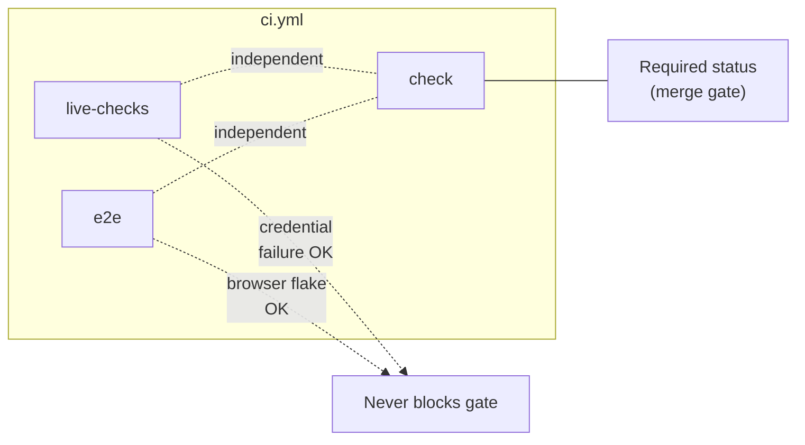
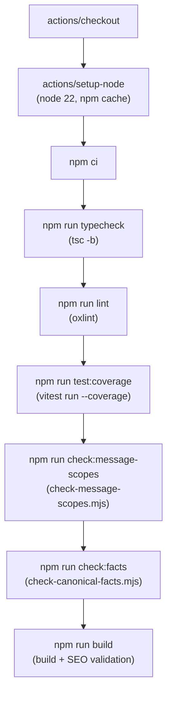
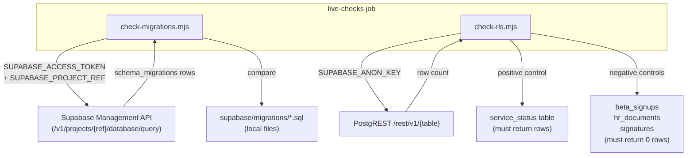
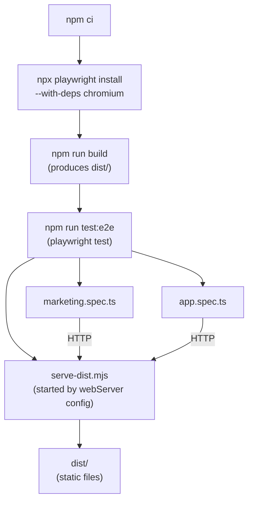
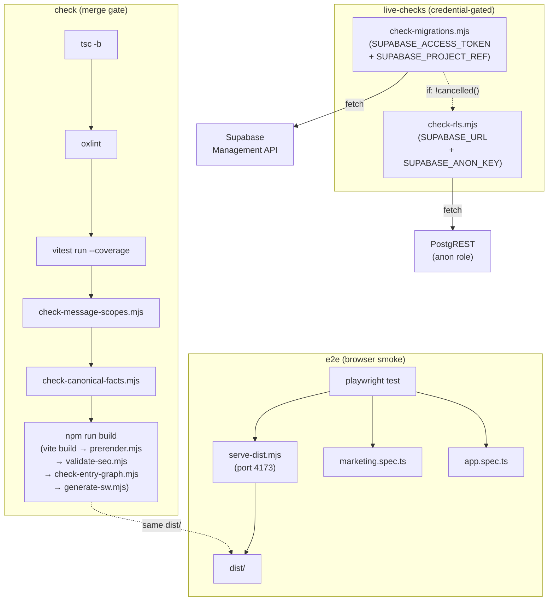
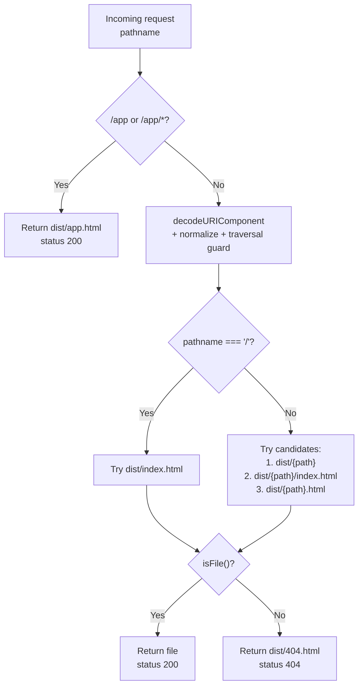

# CI Pipeline & Testing

<details>
<summary>Relevant source files</summary>

The following files were used as context for generating this wiki page:

- [.github/workflows/ci.yml](.github/workflows/ci.yml)
- [.gitignore](.gitignore)
- [docs/SUPPORT_ANALYTICS.md](docs/SUPPORT_ANALYTICS.md)
- [e2e/app.spec.ts](e2e/app.spec.ts)
- [e2e/marketing.spec.ts](e2e/marketing.spec.ts)
- [e2e/serve-dist.mjs](e2e/serve-dist.mjs)
- [index.html](index.html)
- [playwright.config.ts](playwright.config.ts)
- [src/features/app/toasts/toasts.test.tsx](src/features/app/toasts/toasts.test.tsx)
- [src/features/app/views/home/HomeBriefHero.tsx](src/features/app/views/home/HomeBriefHero.tsx)
- [src/features/marketing/analytics/ga4.test.ts](src/features/marketing/analytics/ga4.test.ts)
- [src/features/marketing/analytics/ga4.ts](src/features/marketing/analytics/ga4.ts)
- [src/features/support/analytics/supportAnalytics.test.ts](src/features/support/analytics/supportAnalytics.test.ts)
- [src/features/support/analytics/supportAnalytics.ts](src/features/support/analytics/supportAnalytics.ts)
- [src/i18n/i18n.test.tsx](src/i18n/i18n.test.tsx)
- [src/lib/theme.test.tsx](src/lib/theme.test.tsx)
- [src/lib/theme.tsx](src/lib/theme.tsx)
- [src/test/setup.ts](src/test/setup.ts)
- [supabase/migrations/0052_purge_support_analytics_rate_limit.sql](supabase/migrations/0052_purge_support_analytics_rate_limit.sql)

</details>

The GitHub Actions CI workflow (`.github/workflows/ci.yml`) defines three isolated jobs — `check`, `live-checks`, and `e2e` — each targeting a distinct failure class. The separation ensures that credential problems or browser flakes never block the merge gate. Test infrastructure uses Vitest (jsdom) for unit/integration tests and Playwright (Chromium) for end-to-end smoke tests, with a custom static server that mirrors the production Vercel routing contract.

## Workflow Triggers & Environment

The CI workflow fires on pull requests, pushes to `main`, and manual `workflow_dispatch` events [.github/workflows/ci.yml:4-11](). Manual dispatch is explicitly justified: the live-project checks can go red without any code change (e.g. someone applying a migration directly to the database), so re-running should not require inventing a commit [.github/workflows/ci.yml:7-11]().

Three public (non-secret) environment variables are set at workflow level [.github/workflows/ci.yml:16-19]():

| Variable                 | Value                                      | Purpose                              |
| ------------------------ | ------------------------------------------ | ------------------------------------ |
| `SUPABASE_URL`           | `https://khtwpxnvziiyplaflwru.supabase.co` | Project endpoint for live checks     |
| `SUPABASE_ANON_KEY`      | `sb_publishable_…`                         | Publishable anon key for RLS probing |
| `VITE_GA_MEASUREMENT_ID` | `G-V85ZQ75EWL`                             | GA4 measurement ID (public in HTML)  |

Sources: [.github/workflows/ci.yml:1-19]()

## Job Architecture

**CI workflow job dependency diagram**



All three jobs run independently on `ubuntu-latest` with Node 22. There are no `needs` dependencies between them — each is an isolated failure domain. Only `check` is the required status for merging [.github/workflows/ci.yml:22-27]().

Sources: [.github/workflows/ci.yml:21-130]()

## Job 1: `check` (Merge Gate)

The `check` job is the deterministic, credential-free gate. It runs seven steps in sequence; any failure blocks the PR.

**`check` job step pipeline**



| Step               | npm script                     | Tool                                                                    | What it catches                                    |
| ------------------ | ------------------------------ | ----------------------------------------------------------------------- | -------------------------------------------------- |
| Typecheck          | `npm run typecheck`            | `tsc -b`                                                                | Type errors across the project                     |
| Lint               | `npm run lint`                 | `oxlint`                                                                | Linting violations                                 |
| Test with coverage | `npm run test:coverage`        | `vitest run --coverage`                                                 | Unit/integration failures, coverage regression     |
| Message scopes     | `npm run check:message-scopes` | `check-message-scopes.mjs`                                              | i18n key crossing surface boundary                 |
| Canonical facts    | `npm run check:facts`          | `check-canonical-facts.mjs`                                             | Brand palette drift vs CSS                         |
| Build + SEO        | `npm run build`                | vite build → prerender → validate-seo → check-entry-graph → generate-sw | Build, metadata, sitemap, entry-graph budget drift |

The build script is a multi-step chain defined in `package.json` [package.json:8]():

```
tsc -b && vite build && relocate-sourcemaps.mjs && build:ssr && prerender.mjs
       && validate-seo.mjs && check-entry-graph.mjs && generate-sw.mjs
```

The comment at [.github/workflows/ci.yml:22-27]() explains the rationale for `check` being its own job: a failure in the credentialed `live-checks` must never abort build/SEO/test verification — the failure mode that caused two days of unverified builds to merge green when the `SUPABASE_ACCESS_TOKEN` secret expired (docs/TODO.md OA19).

Sources: [.github/workflows/ci.yml:28-64](), [package.json:6-18]()

## Job 2: `live-checks` (Live Supabase Guards)

The `live-checks` job hits the real Supabase project and contains two steps that report independently via `if: ${{ !cancelled() }}` — so an RLS check still runs even when migration drift fails [.github/workflows/ci.yml:69-70]().

**`live-checks` data flow diagram**



### Migration Drift (`check-migrations.mjs`)

Two halves run in the same script [scripts/check-migrations.mjs:18-36]():

1. **LOCAL (always runs)** — Filename discipline. Validates every file under `supabase/migrations/` matches the pattern `NNNN_lower_snake_case.sql`, catches duplicated sequence numbers (except entries in `ACCEPTED_DUPLICATES`), and detects slug collisions [scripts/check-migrations.mjs:99-137]().

2. **DRIFT (credential-gated)** — Fetches `supabase_migrations.schema_migrations` from the live project via the Management API [scripts/check-migrations.mjs:198-228](). Compares in both directions:
   - **Forward**: repo files not applied to the project → silently inert features [scripts/check-migrations.mjs:234-239]()
   - **Reverse**: applied migrations with no repo file → schema that vanishes on rebuild [scripts/check-migrations.mjs:251-267]()

Credentials are cleaned via `cleanSecret()` from `scripts/lib/secrets.mjs` [scripts/check-migrations.mjs:181-182](), which strips trailing whitespace, wrapping quotes, and redundant `Bearer ` prefixes [scripts/lib/secrets.mjs:31-38]().

### RLS Regression Guard (`check-rls.mjs`)

Probes the live database as the anonymous PostgREST role [scripts/check-rls.mjs:120-157](). Two-part strategy:

1. **Positive control**: reads `service_status` (a table the anon role is meant to read). If it returns no rows or a non-200 status, the key is broken and every subsequent "no rows" would be a false all-clear, so the script exits with an error [scripts/check-rls.mjs:161-187]().

2. **Negative controls**: reads each table in `SENSITIVE_TABLES` (`beta_signups`, `hr_documents`, `signatures`) [scripts/check-rls.mjs:50-51](). Any row returned means a world-open RLS policy is live [scripts/check-rls.mjs:217-223]().

Sources: [.github/workflows/ci.yml:71-98](), [scripts/check-migrations.mjs:1-291](), [scripts/check-rls.mjs:1-238](), [scripts/lib/secrets.mjs:1-68]()

## Loud Skipping Pattern

Both live-check scripts implement a "loud skipping" pattern when credentials are missing. They exit 0 (do not fail the build), but on GitHub Actions they:

1. Emit a `::warning` annotation visible on the run and on the PR [scripts/check-migrations.mjs:159](), [scripts/check-rls.mjs:71]()
2. Append a `### … UNCHECKED` entry to `GITHUB_STEP_SUMMARY` [scripts/check-migrations.mjs:164-176](), [scripts/check-rls.mjs:75-86]()

This ensures that a green check is never mistaken for a verified one — the philosophy is stated directly: "a skipped drift check must not read as a passed one" [scripts/check-migrations.mjs:142-154]().

The `describeSecret()` helper provides safe diagnostics when a credential is rejected, reporting length and character-class properties without exposing the value [scripts/lib/secrets.mjs:47-58]().

Sources: [scripts/check-migrations.mjs:140-176](), [scripts/check-rls.mjs:62-106](), [scripts/lib/secrets.mjs:47-58]()

## Job 3: `e2e` (Playwright Browser Smoke Tests)

The e2e job builds the production bundle, installs Chromium, then runs Playwright against the built `dist/` [.github/workflows/ci.yml:107-130]().



Sources: [.github/workflows/ci.yml:107-130]()

### Playwright Configuration (`playwright.config.ts`)

The configuration defines a single Chromium project on port `4173` [playwright.config.ts:19-20](). Key settings:

| Setting               | CI Value                   | Local Value    |
| --------------------- | -------------------------- | -------------- |
| `retries`             | 1                          | 0              |
| `workers`             | 1                          | unlimited      |
| `reporter`            | `list` + `html` (unopened) | `list` only    |
| `reuseExistingServer` | false                      | true           |
| `forbidOnly`          | true                       | false          |
| `trace`               | on-first-retry             | on-first-retry |

The `webServer` block starts `e2e/serve-dist.mjs` before tests run, waiting up to 30 seconds for the server to be ready [playwright.config.ts:39-44]().

Chromium resolution adapts to the host: if `/opt/pw-browsers/chromium` exists (as in the Claude execution environment), it is used as `executablePath`; otherwise Playwright uses its own installed browser (installed by `npx playwright install --with-deps chromium` in CI) [playwright.config.ts:16-17]().

Sources: [playwright.config.ts:1-45]()

### Static Server (`e2e/serve-dist.mjs`)

A zero-dependency Node HTTP server that mirrors the Vercel routing contract from `vercel.json` [e2e/serve-dist.mjs:1-15]():

**Routing contract comparison**

| Route Pattern            | `vercel.json`           | `serve-dist.mjs`                                                             |
| ------------------------ | ----------------------- | ---------------------------------------------------------------------------- |
| `/app` and `/app/*`      | Rewrites to `/app.html` | Returns `dist/app.html` with 200 [e2e/serve-dist.mjs:56-57]()                |
| Clean URLs (`/about`)    | `trailingSlash: false`  | Tries `dist/about/index.html` then `about.html` [e2e/serve-dist.mjs:74-79]() |
| Real files (`/assets/*`) | Served directly         | Served if `isFile()` returns true [e2e/serve-dist.mjs:79]()                  |
| Unknown paths            | 404                     | Returns `dist/404.html` with 404 status [e2e/serve-dist.mjs:81]()            |

The server includes path traversal protection — decoded paths are normalized and confirmed to be inside `DIST` before serving [e2e/serve-dist.mjs:62-72]().

MIME types are mapped from file extension for 17 content types [e2e/serve-dist.mjs:25-43]().

Sources: [e2e/serve-dist.mjs:1-99](), [vercel.json:1-14]()

### Marketing Surface Tests (`e2e/marketing.spec.ts`)

Four test cases exercise the prerendered marketing pages:

| Test                          | What it proves                                                                                                                                                                    |
| ----------------------------- | --------------------------------------------------------------------------------------------------------------------------------------------------------------------------------- |
| Home page load + consent gate | Prerendered content visible, consent banner proves hydration, `Accept` records `dutiva.analytics.consent` in localStorage, persists across reload [e2e/marketing.spec.ts:11-45]() |
| French homepage               | `/fr` serves `fr-CA` title, consent banner reads `Accepter` from URL-scoped language provider [e2e/marketing.spec.ts:47-53]()                                                     |
| Prerendered subpage           | `/about` routes to the prerendered About page [e2e/marketing.spec.ts:55-59]()                                                                                                     |
| 404 status                    | Unknown URL returns HTTP 404 with the "Page not found" page [e2e/marketing.spec.ts:61-65]()                                                                                       |

A separate test group disables JavaScript and confirms the homepage is fully prerendered (content without hydration) — the H1 and footer are present with no client runtime [e2e/marketing.spec.ts:68-78]().

Page errors are collected via `page.on('pageerror')` and asserted to be empty at the end of the home-page test [e2e/marketing.spec.ts:14-15](), [e2e/marketing.spec.ts:44]().

Sources: [e2e/marketing.spec.ts:1-78]()

### App Surface Tests (`e2e/app.spec.ts`)

Two test cases exercise the SPA shell rewrite:

| Test                             | What it proves                                                                                        |
| -------------------------------- | ----------------------------------------------------------------------------------------------------- |
| `/app/welcome` → SPA shell       | 200 status (not 404), `#root` is not empty, and marketing content is absent [e2e/app.spec.ts:12-24]() |
| Deep `/app/this/does/not/matter` | Arbitrary deep paths rewrite to the shell with 200 and `#root` attached [e2e/app.spec.ts:26-31]()     |

Tests deliberately stop at the sign-in gate — the authenticated workspace needs a backend and is out of scope for a hermetic build [e2e/app.spec.ts:6-9]().

Sources: [e2e/app.spec.ts:1-32]()

## Vitest Unit/Integration Test Infrastructure

### Configuration

Vitest is configured in `vite.config.ts` under the `test` key [vite.config.ts:255-284]():

| Setting       | Value                                                 | Rationale                                                                                         |
| ------------- | ----------------------------------------------------- | ------------------------------------------------------------------------------------------------- |
| `environment` | `jsdom`                                               | Browser-like DOM for React component tests                                                        |
| `setupFiles`  | `./src/test/setup.ts`                                 | Global test setup                                                                                 |
| `exclude`     | default + `e2e/**`                                    | Prevents Vitest from claiming Playwright spec files [vite.config.ts:259-260]()                    |
| `css`         | `false`                                               | CSS modules stubbed (canonical facts palette check uses a separate script) [vite.config.ts:261]() |
| `testTimeout` | 20000ms                                               | First test per worker pays fixture-module transform cost [vite.config.ts:263-264]()               |
| `env`         | `VITE_SUPABASE_URL: ''`, `VITE_SUPABASE_ANON_KEY: ''` | Forces doclib onto bundled fixtures, independent of local `.env` [vite.config.ts:270]()           |

### Coverage Thresholds

Coverage uses the `v8` provider with thresholds set a few points below the measured baseline to prevent flakes while catching real regressions [vite.config.ts:274-283]():

| Metric     | Threshold | Measured Baseline |
| ---------- | --------- | ----------------- |
| Statements | 80%       | 83.7%             |
| Branches   | 65%       | 69.9%             |
| Functions  | 75%       | 80.5%             |
| Lines      | 80%       | 85.1%             |

Sources: [vite.config.ts:255-284]()

### Test Setup (`src/test/setup.ts`)

The global setup file does three things:

1. Imports `@testing-library/jest-dom/vitest` for DOM matchers [src/test/setup.ts:1]()
2. Installs a `MemoryStorage` class as `globalThis.localStorage` to replace Node ≥25's broken built-in localStorage that shadows jsdom's implementation [src/test/setup.ts:9-35]()
3. Registers an `afterEach` hook that calls `cleanup()` (React Testing Library) and `localStorage.clear()` [src/test/setup.ts:37-40]()

Sources: [src/test/setup.ts:1-41]()

### Test File Inventory

The project contains 150+ test files across the codebase. A representative sample by area:

| Area             | Example Files                                                                                       | Count |
| ---------------- | --------------------------------------------------------------------------------------------------- | ----- |
| Advisor & Safety | `chatApi.test.ts`, `crisisSignals.test.ts`, `safetyBackstop.test.ts`, `statutoryCrossCheck.test.ts` | ~12   |
| Auth             | `AuthProvider.test.tsx`, `AuthConfirm.test.tsx`, `RequireAdminSession.test.tsx`                     | 5     |
| Documents        | `engine.test.ts`, `DoclibProvider.test.tsx`, `GenerateScreen.test.tsx`                              | ~8    |
| Workspace Views  | `EmployeesView.test.tsx`, `CasesView.test.tsx`, `AnalyticsView.test.tsx`                            | ~20   |
| Marketing Pages  | `PricingPage.test.tsx`, `LegalHubPage.test.tsx`, `ArticlePage.test.tsx`                             | ~15   |
| Support          | `SupportRequestForm.test.tsx`, `helpSearch.test.ts`, `triage.test.ts`                               | ~15   |
| Infrastructure   | `reporter.test.ts`, `scrubRoute.test.ts`, `fingerprint.test.ts`                                     | ~12   |
| i18n             | `i18n.test.tsx`, `scopes.test.ts`                                                                   | 2     |
| Edge Functions   | `aiUsage.test.ts`, `billing-event.test.ts`, `contentSanity.test.ts`                                 | ~12   |
| Canonical/Data   | `canonicalFacts.test.ts`, `data.test.ts`                                                            | 2     |

Sources: search results for `.test.ts` files across the repository

## CI Guard Scripts in the `check` Job

### Message Scopes (`check-message-scopes.mjs`)

Guards the surface boundary established by `src/i18n/messages/{workspace,marketing,shared}.ts`. It derives which message keys each surface may use (from the modules each entry file imports) and scans for any literal `t('key')` call reaching outside its file's surface [scripts/check-message-scopes.mjs:1-23]().

Two surfaces are scanned [scripts/check-message-scopes.mjs:76-87]():

- **workspace**: `src/features/app`, `src/components/advisor`, `src/lib/exportProtection`
- **marketing**: `src/features/marketing`

### Canonical Facts (`check-canonical-facts.mjs`)

Checks the brand palette rows of `docs/CANONICAL_FACTS.md` against actual CSS token values in `src/styles/`. This exists as a separate script because Vitest runs with `css: false` and cannot read stylesheet values [scripts/check-canonical-facts.mjs:1-26]().

The companion test `src/canonicalFacts.test.ts` handles the TypeScript-backed rows (template count, plan prices, jurisdictions, beta flag, etc.) [src/canonicalFacts.test.ts:1-33](). Together they provide bidirectional enforcement of the canonical facts document.

Sources: [.github/workflows/ci.yml:47-57](), [scripts/check-message-scopes.mjs:1-87](), [scripts/check-canonical-facts.mjs:1-65](), [src/canonicalFacts.test.ts:1-33]()

## End-to-End Architecture Overview

**Full CI pipeline: jobs, tools, and artifacts**



Sources: [.github/workflows/ci.yml:1-130](), [package.json:6-26](), [playwright.config.ts:1-45](), [e2e/serve-dist.mjs:1-99]()

## `serve-dist.mjs` Routing Logic

The resolve function implements a resolution strategy that mirrors Vercel's routing:



Sources: [e2e/serve-dist.mjs:54-82]()

## Key Design Decisions

| Decision                                   | Rationale                                                                                                              | Reference                                                         |
| ------------------------------------------ | ---------------------------------------------------------------------------------------------------------------------- | ----------------------------------------------------------------- |
| `check` is isolated from `live-checks`     | Credential failure (expired token) must never abort build/test verification — the OA19 incident                        | [.github/workflows/ci.yml:22-27]()                                |
| `e2e` is isolated from `check`             | Browser download/flake should never charge against the merge gate                                                      | [.github/workflows/ci.yml:104-106]()                              |
| `live-checks` steps use `if: !cancelled()` | Each live check reports independently; migration drift failure doesn't skip RLS                                        | [.github/workflows/ci.yml:97]()                                   |
| `workflow_dispatch` trigger                | Live-project checks can go red without a code change (out-of-band DB changes)                                          | [.github/workflows/ci.yml:7-11]()                                 |
| Vitest `env` blanks Supabase vars          | Forces doclib onto bundled fixtures, prevents test ordering from varying by `.env`                                     | [vite.config.ts:269-270]()                                        |
| Coverage thresholds are below baseline     | Normal fluctuation doesn't flake CI; real regression still fails                                                       | [vite.config.ts:273-283]()                                        |
| Pinned action SHAs                         | `actions/checkout@34e114…` and `actions/setup-node@49933…` pinned by commit hash, not tag                              | [.github/workflows/ci.yml:31-32]()                                |
| Dependency-free scripts                    | `check-migrations.mjs` and `check-rls.mjs` use Node's global `fetch` only, so they cannot rot behind a package upgrade | [scripts/check-migrations.mjs:37](), [scripts/check-rls.mjs:36]() |

Sources: [.github/workflows/ci.yml:1-130](), [vite.config.ts:255-284](), [scripts/check-migrations.mjs:36-37](), [scripts/check-rls.mjs:34-36]()

## Artifacts & Outputs

| Artifact             | Location               | Committed?        | Purpose                                           |
| -------------------- | ---------------------- | ----------------- | ------------------------------------------------- |
| `dist/`              | Build output           | No (`.gitignore`) | Production bundle, served by e2e tests            |
| `coverage/`          | Vitest coverage        | No (`.gitignore`) | V8 coverage reports                               |
| `test-results/`      | Playwright results     | No (`.gitignore`) | Test run artifacts                                |
| `playwright-report/` | Playwright HTML report | No (`.gitignore`) | HTML report (CI: `open: 'never'`)                 |
| `sourcemaps/`        | Relocated source maps  | No (`.gitignore`) | Moved out of `dist/` by `relocate-sourcemaps.mjs` |

Sources: [.gitignore:12-43](), [playwright.config.ts:28]()

---
