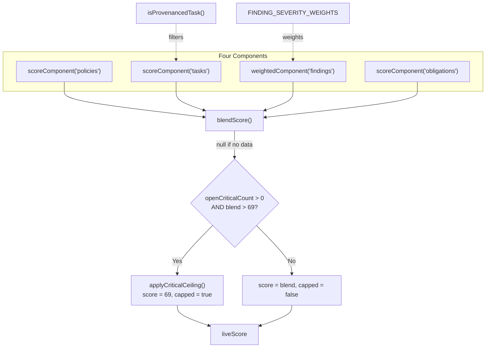
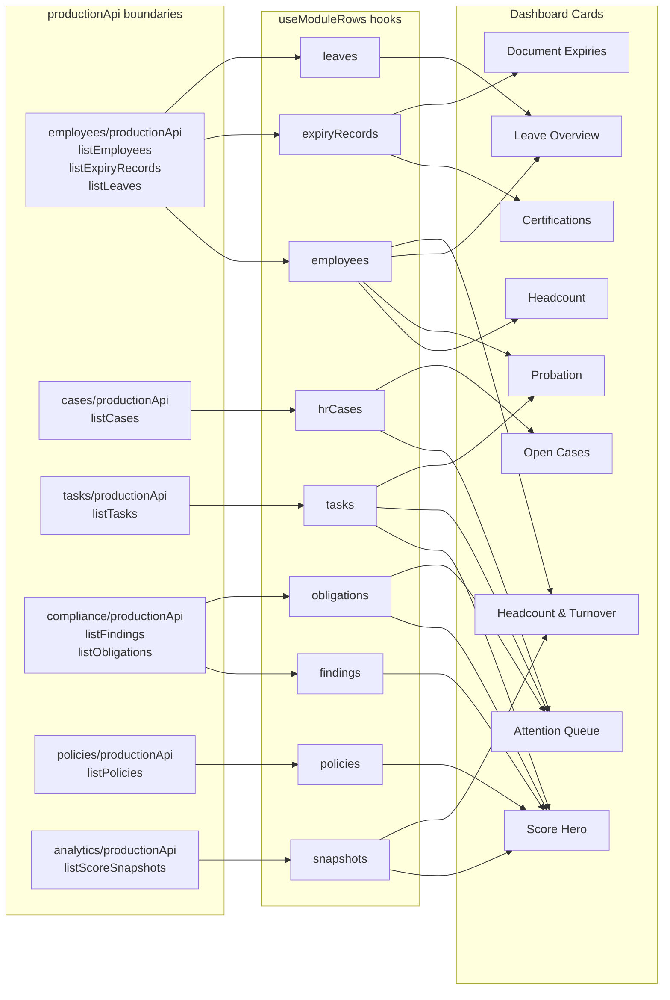
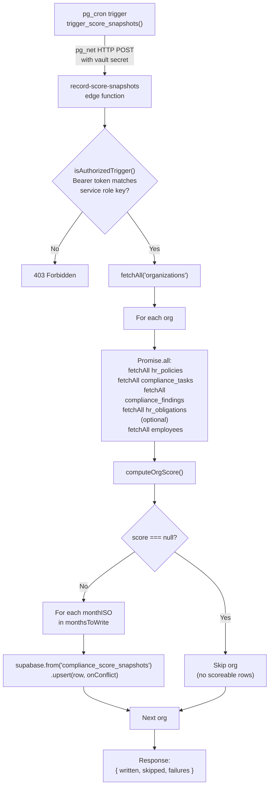
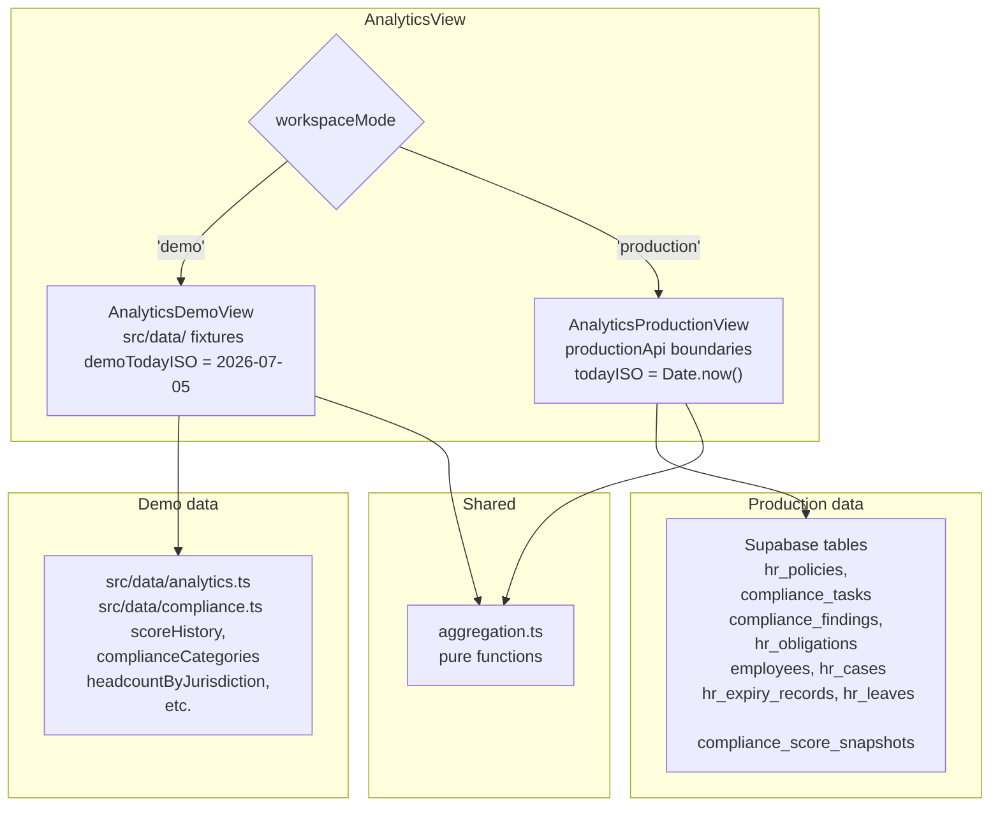
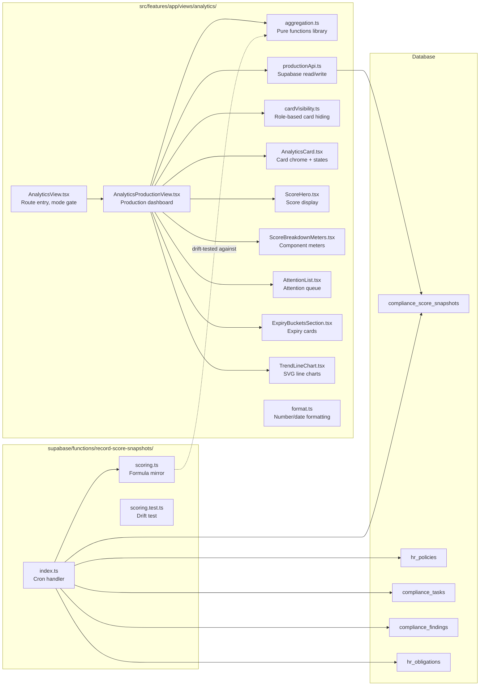

# Compliance Scoring & Analytics Dashboard

<details>
<summary>Relevant source files</summary>

The following files were used as context for generating this wiki page:

- [docs/LEGAL_REVIEW_INVENTORY.md](docs/LEGAL_REVIEW_INVENTORY.md)
- [docs/README.md](docs/README.md)
- [docs/SCORING_LOGIC.md](docs/SCORING_LOGIC.md)
- [src/data/analytics.ts](src/data/analytics.ts)
- [src/data/index.ts](src/data/index.ts)
- [src/data/types.ts](src/data/types.ts)
- [src/features/app/billing/PlanGate.test.tsx](src/features/app/billing/PlanGate.test.tsx)
- [src/features/app/docstudio/docstudio.test.tsx](src/features/app/docstudio/docstudio.test.tsx)
- [src/features/app/views/analytics/AckMeter.tsx](src/features/app/views/analytics/AckMeter.tsx)
- [src/features/app/views/analytics/AnalyticsCard.tsx](src/features/app/views/analytics/AnalyticsCard.tsx)
- [src/features/app/views/analytics/AnalyticsProductionView.tsx](src/features/app/views/analytics/AnalyticsProductionView.tsx)
- [src/features/app/views/analytics/AnalyticsView.test.tsx](src/features/app/views/analytics/AnalyticsView.test.tsx)
- [src/features/app/views/analytics/AnalyticsView.tsx](src/features/app/views/analytics/AnalyticsView.tsx)
- [src/features/app/views/analytics/ScoreBreakdownMeters.tsx](src/features/app/views/analytics/ScoreBreakdownMeters.tsx)
- [src/features/app/views/analytics/ScoreHero.tsx](src/features/app/views/analytics/ScoreHero.tsx)
- [src/features/app/views/analytics/aggregation.test.ts](src/features/app/views/analytics/aggregation.test.ts)
- [src/features/app/views/analytics/aggregation.ts](src/features/app/views/analytics/aggregation.ts)
- [src/features/app/views/analytics/cardVisibility.test.ts](src/features/app/views/analytics/cardVisibility.test.ts)
- [src/features/app/views/analytics/cardVisibility.ts](src/features/app/views/analytics/cardVisibility.ts)
- [src/features/app/views/analytics/productionApi.ts](src/features/app/views/analytics/productionApi.ts)
- [src/features/app/views/compliance/ComplianceProductionView.tsx](src/features/app/views/compliance/ComplianceProductionView.tsx)
- [src/features/app/views/compliance/ComplianceView.test.tsx](src/features/app/views/compliance/ComplianceView.test.tsx)
- [src/features/app/views/compliance/ComplianceView.tsx](src/features/app/views/compliance/ComplianceView.tsx)
- [src/features/app/views/compliance/productionApi.test.ts](src/features/app/views/compliance/productionApi.test.ts)
- [src/features/app/views/compliance/productionApi.ts](src/features/app/views/compliance/productionApi.ts)
- [src/i18n/messages/analytics.ts](src/i18n/messages/analytics.ts)
- [src/i18n/messages/compliance.ts](src/i18n/messages/compliance.ts)
- [supabase/functions/record-score-snapshots/index.ts](supabase/functions/record-score-snapshots/index.ts)
- [supabase/functions/record-score-snapshots/scoring.test.ts](supabase/functions/record-score-snapshots/scoring.test.ts)
- [supabase/functions/record-score-snapshots/scoring.ts](supabase/functions/record-score-snapshots/scoring.ts)

</details>

This page documents the compliance score formula (v3), the `aggregation.ts` pure-functions library, the `AnalyticsProductionView` dashboard, the `record-score-snapshots` edge function, and the demo/production data paths. The compliance score is the central metric Dutiva surfaces to HR teams — a 0–100 blend of four compliance components, capped when a critical finding is open.

## Compliance Score Formula v3

The score formula is versioned via the `SCORE_FORMULA_VERSION` constant (currently **3**) defined in both the client-side `aggregation.ts` and the server-side `scoring.ts` mirror. Every persisted snapshot records the version that produced it so trend charts crossing a formula change can be labeled.

[src/features/app/views/analytics/aggregation.ts:284]()

### Formula Version History

| Version | Migration | Changes                                                                                   |
| ------- | --------- | ----------------------------------------------------------------------------------------- |
| v1      | 0062      | Unweighted done/total ratios for three components (policies, tasks, findings), no ceiling |
| v2      | 0068      | Severity-weighted findings, cancelled tasks excluded, open-critical ceiling of 69         |
| v3      | 0069      | Obligations as fourth component, tasks scoped to provenanced rows only                    |

Sources: [src/features/app/views/analytics/aggregation.ts:271-284](), [supabase/migrations/0068_score_formula_v2.sql:1-11](), [supabase/migrations/0069_score_formula_v3_obligations.sql:1-17]()

### The Four Components

The score is composed of four independently computed components. Each yields a rounded 0–100 percentage, or `null` when no rows exist for that component.

| Component       | Table                 | "Done" condition                       | "Total" scope                         | Weighting         |
| --------------- | --------------------- | -------------------------------------- | ------------------------------------- | ----------------- |
| **Policies**    | `hr_policies`         | `status = 'up_to_date'`                | All policies                          | Raw ratio         |
| **Tasks**       | `compliance_tasks`    | `status = 'completed'`                 | Provenanced, non-cancelled tasks only | Raw ratio         |
| **Findings**    | `compliance_findings` | `status = 'resolved'` or `'dismissed'` | All findings                          | Severity-weighted |
| **Obligations** | `hr_obligations`      | `status = 'ok'`                        | All obligations                       | Raw ratio         |

Sources: [src/features/app/views/analytics/AnalyticsProductionView.tsx:181-208](), [supabase/functions/record-score-snapshots/scoring.ts:111-141]()

### Provenanced Task Scoping

The function `isProvenancedTask` determines whether a task is included in the score's denominator. A task is provenanced when its `category` is anything other than `'general'` **or** it carries an app-written `metadata.kind` linkage. This prevents hand-added to-do items (which default to `category = 'general'` with no `kind`) from affecting the compliance posture. These tasks still appear in the Tasks view, nav badges, and the attention queue — this rule scopes only the score.

```
isProvenancedTask(category, linkedKind) →
   category !== 'general' || linkedKind !== null
```

[src/features/app/views/analytics/aggregation.ts:294-296]()

Cancelled tasks (`status = 'cancelled'`) are excluded from both numerator and denominator.

[src/features/app/views/analytics/AnalyticsProductionView.tsx:186-187]()

Sources: [src/features/app/views/analytics/aggregation.ts:286-296](), [supabase/functions/record-score-snapshots/scoring.ts:34-36]()

### Severity-Weighted Findings

The findings component uses `weightedComponent` instead of `scoreComponent`. The severity weights are frozen per formula version:

| Severity   | Weight |
| ---------- | ------ |
| `info`     | 1      |
| `low`      | 2      |
| `medium`   | 3      |
| `high`     | 5      |
| `critical` | 8      |

The `pct` is computed as `weightedDone / weightedTotal`, so a critical exposure moves the score more than an informational note. The meter text displayed to the user still shows raw counts (e.g. "1 of 2") via `done`/`total`.

[src/features/app/views/analytics/aggregation.ts:298-357]()

A finding is "closed" when its status is `'resolved'` or `'dismissed'`.

[supabase/functions/record-score-snapshots/scoring.ts:107-109]()

Sources: [src/features/app/views/analytics/aggregation.ts:303-309](), [src/features/app/views/analytics/aggregation.ts:343-357](), [src/features/app/views/compliance/productionApi.ts:64-65]()

### Blending and Critical Ceiling

`blendScore` takes the **unweighted mean** of only the components that have data (`pct !== null`), rounded to the nearest integer. If no component has rows, it returns `null` — the dashboard shows an empty state rather than a number.

[src/features/app/views/analytics/aggregation.ts:363-367]()

**The critical ceiling** (`CRITICAL_SCORE_CEILING = 69`): while any open finding has `severity = 'critical'`, the blended score is capped at 69. This prevents a strong average from hiding a critical exposure. The cap never _raises_ a score already at or below 69 — in that case `capped` is `false` and no explanatory note is shown.

[src/features/app/views/analytics/aggregation.ts:316-384]()

**Score pipeline diagram**



Sources: [src/features/app/views/analytics/aggregation.ts:363-384](), [src/features/app/views/analytics/AnalyticsProductionView.tsx:210-215]()

### Worked Example

From the drift test in `scoring.test.ts`:

- **Policies**: 3 of 4 `up_to_date` → **75**
- **Tasks**: 8 completed of 10 provenanced non-cancelled (1 cancelled and 1 `'general'` both excluded) → **80**
- **Findings**: medium resolved (weight 3) + high dismissed (weight 5) + info open (weight 1) → 8 of 9 weight closed → **89**
- **Obligations**: 2 of 3 `ok` → **67**
- **Blend**: (75 + 80 + 89 + 67) / 4 = 77.75 → **78**

No open critical finding, so no ceiling applied.

[supabase/functions/record-score-snapshots/scoring.test.ts:116-141]()

Sources: [supabase/functions/record-score-snapshots/scoring.test.ts:116-141](), [docs/SCORING_LOGIC.md:111-125]()

## `aggregation.ts` — Pure Functions Library

All numeric computation for the Analytics dashboard lives in `aggregation.ts`. This module is pure and deterministic: callers inject "today" as a YYYY-MM-DD string — the demo passes `demoTodayISO`, production passes the real date — so every path is unit-testable and the demo stays stable.

[src/features/app/views/analytics/aggregation.ts:1-9]()

### Function Inventory

| Function                                                | Purpose                               | Returns                                  |
| ------------------------------------------------------- | ------------------------------------- | ---------------------------------------- |
| `daysBetweenISO(from, to)`                              | Whole-day count between two ISO dates | `number` (negative when `to` is earlier) |
| `monthStartISO(todayISO)`                               | First-of-month (YYYY-MM-01)           | `string`                                 |
| `addDaysISO(iso, days)`                                 | Date shift by whole days              | `string`                                 |
| `formatMonthISO(monthISO, locale, style?)`              | Localized month name                  | `string`                                 |
| `rankAttention(items, todayISO, dueSoonDays?)`          | Sort + classify compliance items      | `RankedAttention<T>[]`                   |
| `windowAxis(values, opts?)`                             | Data-windowed axis for charts         | `AxisWindow`                             |
| `windowScoreAxis(values, pad?)`                         | 0–100 clamped variant                 | `AxisWindow`                             |
| `scoreDelta(history)`                                   | Current vs oldest point in window     | `ScoreDelta \| null`                     |
| `caseAging(openCases, todayISO)`                        | Open-case age stats                   | `CaseAging<T> \| null`                   |
| `expiryBuckets(records, todayISO)`                      | Bucket records into expired/30/60/90  | `ExpiryBuckets<T>`                       |
| `flattenBuckets(buckets)`                               | Flat soonest-first list from buckets  | `T[]`                                    |
| `ackProgress(signed, total)`                            | Policy acknowledgment meter           | `AckProgress`                            |
| `turnoverRatePct(termISOs, windowEndISO, avgHeadcount)` | Rolling 12-month turnover %           | `number \| null`                         |
| `meanInWindow(points, start, end)`                      | Average of month-series in window     | `number \| null`                         |
| `isProvenancedTask(category, linkedKind)`               | v3 task scoping filter                | `boolean`                                |
| `scoreComponent(key, done, total)`                      | Raw-ratio component                   | `ScoreComponent`                         |
| `weightedComponent(key, items)`                         | Severity-weighted component           | `ScoreComponent`                         |
| `blendScore(components)`                                | Unweighted mean of present components | `number \| null`                         |
| `applyCriticalCeiling(score, openCriticalCount)`        | Cap at 69 with open critical          | `CeilingResult`                          |

Sources: [src/features/app/views/analytics/aggregation.ts:11-384]()

### Attention Queue

`rankAttention` sorts dated items ascending by `dueISO` (overdue first, most overdue at top, then soonest-due) and classifies each into one of three statuses:

| Status     | Condition                         |
| ---------- | --------------------------------- |
| `overdue`  | `daysUntilDue < 0`                |
| `due_soon` | `0 ≤ daysUntilDue ≤ 14` (default) |
| `upcoming` | `daysUntilDue > 14`               |

Ties break on `id` for a stable order. Due-today is classified as `due_soon`, not overdue.

[src/features/app/views/analytics/aggregation.ts:60-73]()

Sources: [src/features/app/views/analytics/aggregation.ts:46-73](), [src/features/app/views/analytics/aggregation.test.ts:59-97]()

### Expiry Buckets

`expiryBuckets` distributes date-bearing records (certifications, documents) into four temporal buckets, each sorted soonest-first:

| Bucket     | Range            |
| ---------- | ---------------- |
| `expired`  | `days < 0`       |
| `within30` | `0 ≤ days ≤ 30`  |
| `within60` | `31 ≤ days ≤ 60` |
| `within90` | `61 ≤ days ≤ 90` |

Records more than 90 days out are excluded. `flattenBuckets` returns a single soonest-first list across all four.

[src/features/app/views/analytics/aggregation.ts:184-210]()

Sources: [src/features/app/views/analytics/aggregation.ts:172-210](), [src/features/app/views/analytics/aggregation.test.ts:150-203]()

## `AnalyticsProductionView` — Dashboard Cards

`AnalyticsProductionView` renders the production-mode analytics dashboard. It fetches data from nine module `productionApi` boundaries independently, computes the score live, and lays out the dashboard as a responsive card grid.

[src/features/app/views/analytics/AnalyticsProductionView.tsx:156-837]()

### Data Loading Architecture

Each module's data is loaded independently via the `useModuleRows` hook, which carries its own loading/error/ready state and retry. The `CardData` component gates rendering: if any dependency is errored, it shows `CardError` with a retry button; if any is loading, it shows `CardSkeleton`; otherwise it renders children. This means a failing module degrades **one card**, not the whole page.

[src/features/app/views/analytics/AnalyticsProductionView.tsx:99-154]()

**Data flow from modules to cards**



Sources: [src/features/app/views/analytics/AnalyticsProductionView.tsx:164-172](), [src/features/app/views/analytics/AnalyticsProductionView.tsx:506-832]()

### Dashboard Card Inventory

| Card                      | Key              | Dependencies                                      | Primary aggregation                             |
| ------------------------- | ---------------- | ------------------------------------------------- | ----------------------------------------------- |
| Compliance Score          | `score`          | policies, tasks, findings, obligations, snapshots | `blendScore` + `applyCriticalCeiling`           |
| Needs Attention           | `attention`      | tasks, hrCases, obligations                       | `rankAttention`, capped at 5                    |
| Headcount by Jurisdiction | `headcount`      | employees                                         | Province grouping                               |
| Open Cases                | `cases`          | hrCases                                           | `caseAging`                                     |
| Policy Acknowledgments    | `acks`           | (none — empty state, no data source yet)          | —                                               |
| Certifications & Training | `certifications` | expiryRecords                                     | `expiryBuckets` (kind = `'certification'`)      |
| Probation Periods         | `probation`      | employees, tasks                                  | Filter within 30 days, `hasProbationReviewTask` |
| Document Expiries         | `documents`      | expiryRecords                                     | `expiryBuckets` (kind = `'document'`)           |
| Leave Overview            | `leave`          | employees, leaves                                 | Sort by return date, imminent ≤ 14 days         |
| Headcount & Turnover      | `trend`          | employees, snapshots                              | `turnoverRatePct`, `TrendLineChart`             |

Sources: [src/features/app/views/analytics/AnalyticsProductionView.tsx:510-833](), [src/features/app/views/analytics/cardVisibility.ts:17-28]()

### Card Visibility

Per-card visibility is controlled by `analyticsCardVisible` in `cardVisibility.ts`. Each card has a minimum role floor (`CARD_MIN_ROLE`); currently all cards are set to `'viewer'`, so every active member sees everything. Org admins always bypass the check. Changing a card's floor is a one-word edit.

[src/features/app/views/analytics/cardVisibility.ts:29-58]()

Sources: [src/features/app/views/analytics/cardVisibility.ts:1-58](), [src/features/app/views/analytics/cardVisibility.test.ts:1-37]()

### Score Hero Card

The `ScoreHero` component renders the large score figure (e.g. `82/100`) and a `DeltaChip` showing the signed change vs the oldest point in the 6-month window (e.g. "+8 vs February"). The `ScoreBreakdownMeters` component renders one labeled progress meter per component, with the lowest component flagged with a "Lowest" warning chip.

[src/features/app/views/analytics/ScoreHero.tsx:12-41]()
[src/features/app/views/analytics/ScoreBreakdownMeters.tsx:24-63]()

When the blend is capped, the card prints a red note: "Capped at 69 while a critical finding is open — resolve or dismiss it to lift the ceiling."

[src/features/app/views/analytics/AnalyticsProductionView.tsx:525-530]()

When past months in the trend were computed under a different formula version, a footnote appears: "Earlier months were computed under a previous score formula."

[src/features/app/views/analytics/AnalyticsProductionView.tsx:553-556]()

Sources: [src/features/app/views/analytics/ScoreHero.tsx:1-41](), [src/features/app/views/analytics/ScoreBreakdownMeters.tsx:1-63](), [src/i18n/messages/analytics.ts:50-57]()

### Write-on-Read Snapshot

When the live score is computed, `AnalyticsProductionView` fires a one-shot `recordScoreSnapshot` call to persist the current month's score and headcount via the `productionApi`. This is fire-and-forget — a failure is caught and dropped because history is an enhancement, never a reason to degrade the dashboard.

[src/features/app/views/analytics/AnalyticsProductionView.tsx:228-246]()

The snapshot is written using `recordScoreSnapshot` in `productionApi.ts`, which upserts into `compliance_score_snapshots` with `onConflict: 'organization_id,month'`. It includes a fallback path for pre-migration-0068 schemas that omits the `formula_version` column.

[src/features/app/views/analytics/productionApi.ts:82-127]()

Sources: [src/features/app/views/analytics/AnalyticsProductionView.tsx:228-246](), [src/features/app/views/analytics/productionApi.ts:82-127]()

## Snapshot Persistence — `compliance_score_snapshots` Table

The `compliance_score_snapshots` table stores one row per organization per month. The schema was built across four migrations:

| Migration | Content                                                                                                                                                                                                                       |
| --------- | ----------------------------------------------------------------------------------------------------------------------------------------------------------------------------------------------------------------------------- |
| 0062      | Table creation: `id`, `organization_id`, `month` (with `date_trunc` CHECK), `score` (0–100), `components` (jsonb), `created_at`, `updated_at`. Unique on `(organization_id, month)`. RLS: org members read, org admins write. |
| 0063      | Added `headcount` column (nullable integer, ≥ 0).                                                                                                                                                                             |
| 0068      | Added `formula_version` column (integer, default 1). Created `trigger_score_snapshots()` function, `score_snapshot_status()` diagnostic, daily cron at 05:30 UTC.                                                             |
| 0069      | Created `hr_obligations` table, updated formula comment to v3, added month-close cron at 00:05 UTC on the 1st.                                                                                                                |
| 0070      | Hardened month-close to three retries (`5,25,45 0 1 * *`), enhanced `score_snapshot_status()` with close coverage tracking.                                                                                                   |

Sources: [supabase/migrations/0062_add_compliance_score_snapshots.sql:1-51](), [supabase/migrations/0063_add_headcount_to_score_snapshots.sql:1-16](), [supabase/migrations/0068_score_formula_v2.sql:1-139](), [supabase/migrations/0069_score_formula_v3_obligations.sql:1-112](), [supabase/migrations/0070_score_snapshot_close_retries.sql:1-79]()

## `record-score-snapshots` Edge Function

The `record-score-snapshots` edge function is a scheduled Deno function that upserts every organization's current-month snapshot row. It exists because the write-on-read path in `AnalyticsProductionView` depends on an admin actually opening Analytics — a month without such a visit would leave a gap.

[supabase/functions/record-score-snapshots/index.ts:7-43]()

### Two Schedules

| Schedule                             | Cron Expression   | Behavior                                                                                                                         |
| ------------------------------------ | ----------------- | -------------------------------------------------------------------------------------------------------------------------------- |
| `record-score-snapshots-daily`       | `30 5 * * *`      | Upserts current month for all orgs                                                                                               |
| `record-score-snapshots-month-close` | `5,25,45 0 1 * *` | Three idempotent attempts during the first UTC hour of the 1st; also upserts the _previous_ month to freeze it near the boundary |

The month-close logic: if the UTC date is the 1st and the UTC hour is 0, the edge function writes _both_ the previous month and the current month. Outside that hour, the previous month is never touched — a manual fire cannot rewrite a frozen month.

[supabase/functions/record-score-snapshots/index.ts:109-118]()

Three retries (00:05, 00:25, 00:45) exist because `pg_cron` does not backfill missed runs and `pg_net.http_post` is fire-and-forget. One transient failure must not silently lose a month's close.

[supabase/migrations/0070_score_snapshot_close_retries.sql:1-14]()

### Processing Pipeline



Sources: [supabase/functions/record-score-snapshots/index.ts:93-195]()

### Paginated Reads

The `fetchAll` helper in the edge function reads in pages of 1000, because PostgREST caps un-ranged selects at `max_rows` (1000 on hosted Supabase) with **no error** — a silent truncation that would score an org on an incomplete slice of its data.

[supabase/functions/record-score-snapshots/index.ts:72-91]()

The `optionalTable` flag allows `hr_obligations` reads to degrade gracefully to an empty array if the table doesn't exist yet (pre-migration-0069), rather than failing every org.

[supabase/functions/record-score-snapshots/index.ts:150-151]()

### Operational Monitoring

`score_snapshot_status()` is a `SECURITY DEFINER` function callable only by `service_role`. It reports:

| Column                        | Purpose                                                                                         |
| ----------------------------- | ----------------------------------------------------------------------------------------------- |
| `secret_configured`           | Whether the vault secret `score_snapshot_service_key` is set                                    |
| `daily_job_scheduled`         | Whether the daily cron job is active                                                            |
| `close_job_scheduled`         | Whether the month-close cron job is active                                                      |
| `organizations_total`         | Total org count                                                                                 |
| `orgs_with_current_month`     | Orgs with a current-month snapshot row                                                          |
| `orgs_with_closed_prev_month` | Orgs whose previous-month row was actually written by a close run (updated_at ≥ month boundary) |
| `last_write_at`               | Most recent write timestamp                                                                     |

[supabase/migrations/0070_score_snapshot_close_retries.sql:44-79]()

Sources: [supabase/functions/record-score-snapshots/index.ts:46-91](), [supabase/migrations/0070_score_snapshot_close_retries.sql:44-79]()

## Demo vs Production Data Paths

`AnalyticsView` is the top-level component at route `/app/analytics`. It checks `workspaceMode` and renders either `AnalyticsDemoView` (demo fixtures) or `AnalyticsProductionView` (live Supabase data).

[src/features/app/views/analytics/AnalyticsView.tsx:69-73]()

### Demo Mode

The demo renders the Northgate Logistics diorama. Key fixtures:

| Fixture                   | File                     | Value                                           |
| ------------------------- | ------------------------ | ----------------------------------------------- |
| `complianceScore`         | `src/data/compliance.ts` | 82 (constant)                                   |
| `scoreHistory`            | `src/data/analytics.ts`  | 74 → 76 → 79 → 78 → 81 → 82                     |
| `demoTodayISO`            | `src/data/analytics.ts`  | `2026-07-05` (derived from calendar fixture)    |
| `headcountByJurisdiction` | `src/data/analytics.ts`  | ON 34, BC 21, QC 12, AB 9, Federal 6 (total 82) |
| `jurisdictionScores`      | `src/data/analytics.ts`  | ON 83, BC 86, QC 71, AB 88, Federal 75          |
| `complianceCategories`    | `src/data/compliance.ts` | Five categories from 61–96                      |

The demo's last `scoreHistory` point imports `complianceScore` so the overall score on Analytics, Home, and Advisor can never disagree.

[src/data/analytics.ts:35-42]()

Demo mode uses the same `aggregation.ts` functions (e.g. `rankAttention`, `expiryBuckets`, `caseAging`, `scoreDelta`) with the fixed `demoTodayISO`, making all date-relative numbers stable and testable.

[src/features/app/views/analytics/AnalyticsView.tsx:75-213]()

### Production Mode

Production mode fetches live data from each module's `productionApi` boundary. The score is computed in real-time from four `scoreComponent`/`weightedComponent` calls, blended, and ceiling-checked. History is built by merging past snapshot rows with the live current-month score, windowed to the last 6 months (`HISTORY_WINDOW_MONTHS = 6`).

[src/features/app/views/analytics/AnalyticsProductionView.tsx:87-88]()
[src/features/app/views/analytics/AnalyticsProductionView.tsx:248-252]()

**Key production-only features:**

- Formula version note on trend charts crossing formula boundaries ([src/features/app/views/analytics/AnalyticsProductionView.tsx:256-265]())
- Phase 2 cards that say "not tracked in this workspace yet" instead of hiding ([src/features/app/views/analytics/AnalyticsProductionView.tsx:664-668]())
- Bare fallback rows for employees whose roster status is `on_leave` but have no leave record yet ([src/features/app/views/analytics/AnalyticsProductionView.tsx:437-474]())



Sources: [src/features/app/views/analytics/AnalyticsView.tsx:69-73](), [src/data/analytics.ts:22-42](), [src/features/app/views/analytics/AnalyticsProductionView.tsx:156-246]()

## Score Drift Test — Client ↔ Server Copies

The scoring logic exists in two copies that cannot share an import (the client runs in a browser via Vite; the edge function runs in Deno):

| Copy   | File                                                   | Runtime              |
| ------ | ------------------------------------------------------ | -------------------- |
| Client | `src/features/app/views/analytics/aggregation.ts`      | Browser (Vite/React) |
| Server | `supabase/functions/record-score-snapshots/scoring.ts` | Deno (edge function) |

The drift test in `scoring.test.ts` imports **both** copies and asserts bitwise equality across a matrix of scenarios:

1. **Constants pinned**: `SCORE_FORMULA_VERSION`, `CRITICAL_SCORE_CEILING`, `FINDING_SEVERITY_WEIGHTS` must be equal.
2. **`isProvenancedTask` pinned**: tested across five `(category, kind)` pairs.
3. **Functions pinned**: `scoreComponent`, `weightedComponent`, `blendScore`, and `applyCriticalCeiling` must return identical outputs for identical inputs across multiple scenarios.
4. **`computeOrgScore` integration**: tests the full pipeline — provenanced task scoping, severity weighting, ceiling behavior, and null handling.

[supabase/functions/record-score-snapshots/scoring.test.ts:1-200]()

This is the same discipline as the crisis-phrase mirror (`crisisSignalsDrift.test.ts`): a formula change that lands on one side only fails in CI before it can ship a snapshot the Analytics view would disagree with.

[supabase/functions/record-score-snapshots/scoring.ts:1-19]()

Sources: [supabase/functions/record-score-snapshots/scoring.test.ts:1-106](), [supabase/functions/record-score-snapshots/scoring.ts:1-19]()

## `productionApi.ts` — Analytics Persistence Boundary

The analytics `productionApi.ts` exposes two functions:

| Function                                                                      | Behavior                                                                                                                                                                            |
| ----------------------------------------------------------------------------- | ----------------------------------------------------------------------------------------------------------------------------------------------------------------------------------- |
| `listScoreSnapshots(organizationId)`                                          | Reads `compliance_score_snapshots` ordered by month. Falls back to a legacy query (without `formula_version`) if migration 0068 hasn't been applied yet. Returns `ScoreSnapshot[]`. |
| `recordScoreSnapshot(organizationId, monthISO, score, components, headcount)` | Upserts the current month's row. Includes a legacy fallback if `formula_version` column doesn't exist. Fire-and-forget from the view — callers catch and drop errors.               |

Both functions use Zod validation on the response rows. `listScoreSnapshots` handles PostgreSQL error `42703` (unknown column) to support the pre-0068 schema, and `recordScoreSnapshot` handles `PGRST204` for the same reason.

[src/features/app/views/analytics/productionApi.ts:1-127]()

The `SCORE_FORMULA_VERSION` is imported from `aggregation.ts` and stamped on every upserted row, so snapshots are version-labeled at write time.

[src/features/app/views/analytics/productionApi.ts:3]()

Sources: [src/features/app/views/analytics/productionApi.ts:1-127]()

## Test Coverage

### Unit Tests (`aggregation.test.ts`)

Covers all pure functions with edge-case scenarios:

| Test suite                 | Key assertions                                                                    |
| -------------------------- | --------------------------------------------------------------------------------- |
| `daysBetweenISO`           | Cross-month, cross-year, negative, February                                       |
| `rankAttention`            | Sort order, status bucketing, due-today = `due_soon`, tie-breaking                |
| `windowScoreAxis`          | Narrow/wide ranges, clamping, flat data, empty data                               |
| `expiryBuckets`            | Exact boundary bucketing (0/30/60/90 days), sort order, demo fixture verification |
| `scoreDelta`               | Sorting, declines, minimum 2 points required                                      |
| `caseAging`                | Average/oldest computation, sort order, future clamp                              |
| `ackProgress`              | Complete/empty campaigns, clamping                                                |
| `turnoverRatePct`          | Boundary precision, rounding, null denominator                                    |
| `meanInWindow`             | In-window averaging, empty window                                                 |
| `score components + blend` | Per-component pct, null for empty, blend excluding null                           |
| `weightedComponent`        | Severity weighting vs raw counts, null for empty                                  |
| `applyCriticalCeiling`     | Capping, no-cap, never-raises-below-69, null passthrough                          |

[src/features/app/views/analytics/aggregation.test.ts:1-415]()

### Integration Tests (`AnalyticsView.test.tsx`)

Tests the full demo view rendering:

- Score hero with delta (+8 vs February) and trend data
- Category breakdown with lowest flag
- Attention queue ordering (overdue first → soonest)
- Jurisdiction flagging (QC at −11 flagged, Federal at −7 not)
- Certification buckets (1/2/2/2)
- Probation review task detection
- Leave overview with protected-leave marking

[src/features/app/views/analytics/AnalyticsView.test.tsx:7-136]()

Also tests production mode rendering, score computation, component meters, and critical ceiling messaging.

[src/features/app/views/analytics/AnalyticsView.test.tsx:157-502]()

### Drift Test (`scoring.test.ts`)

Ensures the edge function's scoring copy produces identical results to the client's `aggregation.ts`. Covers constants, functions, and full `computeOrgScore` integration including unknown severities (defaulting to weight 1).

[supabase/functions/record-score-snapshots/scoring.test.ts:1-200]()

Sources: [src/features/app/views/analytics/aggregation.test.ts:1-415](), [src/features/app/views/analytics/AnalyticsView.test.tsx:1-502](), [supabase/functions/record-score-snapshots/scoring.test.ts:1-200]()

## Component Architecture Summary

**File listing and roles**



Sources: [src/features/app/views/analytics/AnalyticsView.tsx:1-4](), [src/features/app/views/analytics/AnalyticsProductionView.tsx:1-68](), [supabase/functions/record-score-snapshots/index.ts:4](), [supabase/functions/record-score-snapshots/scoring.test.ts:1-12]()

---
