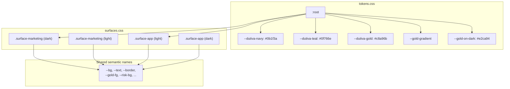
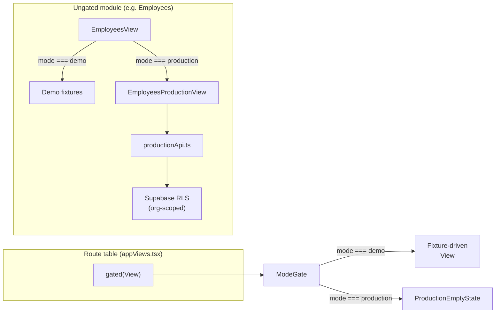
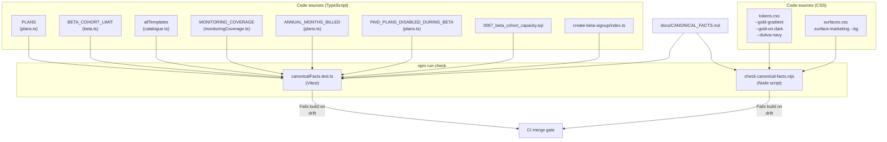
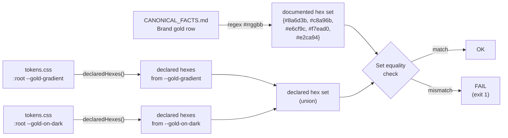
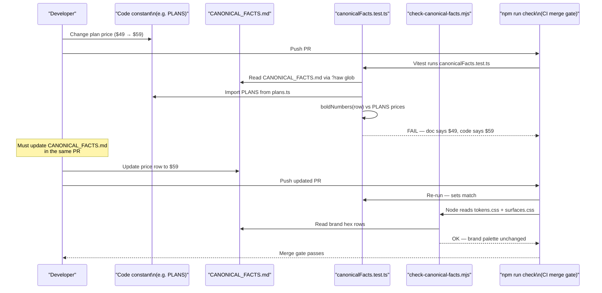

# Conventions & Canonical Facts

<details>
<summary>Relevant source files</summary>

The following files were used as context for generating this wiki page:

- [CONVENTIONS.md](CONVENTIONS.md)
- [docs/CANONICAL_FACTS.md](docs/CANONICAL_FACTS.md)
- [src/canonicalFacts.test.ts](src/canonicalFacts.test.ts)
- [src/features/app/guidance/GuidanceSourcesPanel.test.tsx](src/features/app/guidance/GuidanceSourcesPanel.test.tsx)
- [src/features/app/guidance/GuidanceSourcesPanel.tsx](src/features/app/guidance/GuidanceSourcesPanel.tsx)
- [src/features/app/guidance/monitoringCoverage.test.ts](src/features/app/guidance/monitoringCoverage.test.ts)
- [src/features/app/guidance/monitoringCoverage.ts](src/features/app/guidance/monitoringCoverage.ts)
- [src/features/app/views/employees/EmployeesProductionView.tsx](src/features/app/views/employees/EmployeesProductionView.tsx)
- [src/features/app/workspaceMode/ProductionEmptyState.tsx](src/features/app/workspaceMode/ProductionEmptyState.tsx)
- [src/features/app/workspaceMode/WorkspaceModeProvider.tsx](src/features/app/workspaceMode/WorkspaceModeProvider.tsx)
- [src/features/app/workspaceMode/api.ts](src/features/app/workspaceMode/api.ts)
- [src/features/app/workspaceMode/workspaceModeContext.ts](src/features/app/workspaceMode/workspaceModeContext.ts)
- [src/i18n/messages/guidance.ts](src/i18n/messages/guidance.ts)

</details>

This page covers the two governance documents that sit at the repository root and in `docs/`: `CONVENTIONS.md` (engineering standards) and `docs/CANONICAL_FACTS.md` (load-bearing business facts). It then details the bidirectional CI drift guards—`src/canonicalFacts.test.ts` and `scripts/check-canonical-facts.mjs`—that enforce agreement between documentation and code.

## CONVENTIONS.md — Engineering Standards

`CONVENTIONS.md` is the developer-facing style guide. It prescribes the technology stack, directory layout, surface scopes, CSS custom-property discipline, i18n patterns, routing conventions, workspace-mode rollout strategy, and quality bar. Every section below traces directly to the file.

### Stack & Scripts

The declared stack is React 19, TypeScript (strict), Vite, Tailwind CSS v4, react-router v7, lucide-react, Vitest + Testing Library, oxlint, and Prettier. The canonical `npm` commands are `dev`, `build`, `typecheck`, `lint`, `test`, `format`, and `check` (the merge gate).

[CONVENTIONS.md:8-13]()

### Directory Layout

The source tree under `src/` is organized by concern:

| Path                        | Role                                                                       |
| --------------------------- | -------------------------------------------------------------------------- |
| `src/app/`                  | App root, providers, router, route tables                                  |
| `src/components/`           | Cross-feature shared UI (Disclaimer, chip classes)                         |
| `src/data/`                 | Entity types + realistic sample fixtures                                   |
| `src/features/marketing/`   | Landing page (dutiva.ca) + its i18n module                                 |
| `src/features/app/shell/`   | EntryStage, AppShell (sidebar, topbar, mobile drawer)                      |
| `src/features/app/views/`   | One folder per workspace view                                              |
| `src/features/app/advisor/` | Chat core (bubbles, tone cards, streaming)                                 |
| `src/i18n/`                 | Language provider + message catalogue                                      |
| `src/lib/`                  | Prefs, theme, generic hooks/utils                                          |
| `src/styles/`               | `tokens.css`, `surfaces.css`, `patterns.css`, `animations.css`, `base.css` |

[CONVENTIONS.md:15-38]()

### Two-Surface Architecture & CSS Custom Properties

The codebase operates two distinct token scopes defined in `src/styles/surfaces.css`:

| Scope class          | Purpose                                 | Default theme |
| -------------------- | --------------------------------------- | ------------- |
| `.surface-marketing` | Design-system ramp for the landing page | Dark-first    |
| `.surface-app`       | App v2 ramp for the workspace           | Light-first   |

Both scopes define the same semantic variable names (`--bg`, `--text`, `--border`, etc.) so a single Tailwind utility like `bg-bg` or `text-text-2` resolves differently per surface. The active theme is set via `data-theme="dark" | "light"` on `<html>`, stamped before first paint by `index.html` and kept in sync by `ThemeProvider` (persist key `dutiva-theme`).

[CONVENTIONS.md:94-113]()
[src/styles/surfaces.css:1-250]()

The hard rule: **never hardcode a colour that exists as a token.** Use mapped Tailwind utilities (`bg-surface`, `text-gold-fg`, `border-risk-border`) or `var(--token)` for rare inline styles. Prototype-exact pixel values without a token use arbitrary values (`rounded-[12px]`, `text-[14.5px]`).

[CONVENTIONS.md:107-110]()

Brand-identity tokens in `src/styles/tokens.css` are theme-independent foundations:

| Token                  | Value                                   | Purpose                                  |
| ---------------------- | --------------------------------------- | ---------------------------------------- |
| `--dutiva-navy`        | `#0b1f3a`                               | Brand navy ground                        |
| `--dutiva-teal`        | `#0f766e`                               | Interactive accent (people + technology) |
| `--dutiva-teal-bright` | `#45c4b5`                               | Accent step for dark surfaces            |
| `--dutiva-gold`        | `#c8a96b`                               | Champagne gold — executive moments only  |
| `--gold-gradient`      | `#8a6d3b → #c8a96b → #e6cf9c → #f7ead0` | 4-stop champagne gradient                |
| `--gold-on-dark`       | `#e2ca94`                               | Readable gold for dark surfaces          |

[src/styles/tokens.css:10-27]()

Signature marketing classes (`.premium-card`, `.gold-button`, `.badge`, `.dutiva-pill`, `.gradient-text`, `.dutiva-surface`) live in `src/styles/patterns.css`.

[CONVENTIONS.md:111-113]()
[src/styles/patterns.css:1-19]()

**Surface token scope diagram**



Sources: [src/styles/tokens.css:10-27](), [src/styles/surfaces.css:14-250](), [CONVENTIONS.md:94-113]()

### i18n Patterns

Every user-facing string ships EN + FR. The conventions prescribe three mechanisms:

| Mechanism                             | Type                 | Usage                                                                                                                                    |
| ------------------------------------- | -------------------- | ---------------------------------------------------------------------------------------------------------------------------------------- |
| `defineMessages({ key: { en, fr } })` | `Record<string, Bi>` | Per-feature message modules under `src/i18n/messages/<feature>.ts`, keys prefixed by feature (`home_`, `advisor_`, `landing_`, `shell_`) |
| `bi('English', 'Français')`           | `Bi`                 | Entity/sample data with bilingual fields                                                                                                 |
| `useI18n()` hook                      | `{ t, L, x, lang }`  | Component consumption: `t('key')` for catalogue, `x(biValue)` for data, `L('en','fr')` for one-offs                                      |

[CONVENTIONS.md:115-134]()
[src/i18n/core.ts:1-39]()

The `Bi` type (`{ en: string; fr: string }`) and `defineMessages` identity function are defined in `src/i18n/core.ts`. `pick(value, lang)` selects the appropriate language string, while `LText` (`string | Bi`) handles both already-localized and bilingual values via `pickL`.

[src/i18n/core.ts:1-39]()

Language routing differs by surface:

| Surface            | Provider             | Source of truth            | Persist key   |
| ------------------ | -------------------- | -------------------------- | ------------- |
| Marketing (public) | `ForcedLangProvider` | URL (`/fr/…` → French)     | —             |
| App (workspace)    | `LangProvider`       | In-place preference toggle | `dutiva-lang` |

Both set `<html lang>` to `en-CA` or `fr-CA`.

[CONVENTIONS.md:130-134]()

### Routing Conventions

Public marketing routes are bilingual, generated from the SEO route registry `src/seo/routes.ts`. English at the unprefixed path, French under `/fr` with localized slugs. Public pages are prerendered at build time by `scripts/prerender.mjs`; `/app…` routes stay client-rendered and `noindex`.

[CONVENTIONS.md:40-47]()
[src/seo/routes.ts:1-27]()

Canonical legacy redirects are defined explicitly:

| Legacy path      | Redirect target             |
| ---------------- | --------------------------- |
| `/app/reports`   | `/app/analytics`            |
| `/app/templates` | `/app/documents/hr-library` |
| `/app/tasks`     | `/app/planning/tasks`       |
| `/app/calendar`  | `/app/planning/calendar`    |
| `/app/memory`    | `/app/settings/memory`      |

Navigation between entities uses route paths, never view-state flags.

[CONVENTIONS.md:87-92]()

### Phased Rollout Strategy (Workspace Mode)

`useWorkspaceMode()` resolves to `'demo'` or `'production'`. Production only activates for a signed-in, confirmed admin who has stored that preference. The rollout follows a phased approach documented across 14+ phases:

| Phase | Module                     | Pattern                                                         |
| ----- | -------------------------- | --------------------------------------------------------------- |
| 1     | Toggle + Shell identity    | Settings admin toggle, `Sidebar.tsx` identity                   |
| 2     | Route-level gating         | `ModeGate` / `gated()` wrapper in `appViews.tsx`                |
| 3     | Employees (reference impl) | Per-tenant table, `productionApi.ts`, `EmployeesProductionView` |
| 4     | Cases                      | `hr_cases`, migration 0007                                      |
| 5     | Tasks                      | Zero-migration, reused `compliance_tasks`                       |
| 6     | Compliance                 | Zero-migration, `compliance_findings`                           |
| 7     | Policies                   | `hr_policies`, migration 0008                                   |
| 8     | Reports/Analytics          | Aggregation-only, no table                                      |
| 9     | Home                       | Welcome state + real command centre                             |
| 10    | Calendar                   | Real case/task due dates                                        |
| 11    | Case detail                | `hr_case_notes`, migration 0009                                 |
| 12    | Employee profiles          | `hr_employee_notes`, migration 0010                             |
| 13    | Sidebar badges             | `useProductionNavBadges` + `countOpen*` queries                 |
| 14    | Org membership role        | `memberRole` + `isOrgAdmin`                                     |

[CONVENTIONS.md:144-237]()

The `gated()` function in `src/app/appViews.tsx` wraps a fixture-driven view in `ModeGate`: demo renders it unchanged, production renders the shared `ProductionEmptyState` titled by module.

[src/app/appViews.tsx:23-25]()

**Phased rollout flow**



Sources: [src/app/appViews.tsx:9-25](), [CONVENTIONS.md:170-186](), [src/features/app/workspaceMode/ProductionEmptyState.tsx:1-47]()

### Entry Graph Budget

`npm run build` runs `scripts/check-entry-graph.mjs`, which enforces that the eager entry chunk for marketing pages does not include workspace code (`src/features/app/**`), demo fixtures (`src/data/**`), or heavy dependency trees (react-markdown, Supabase, recharts). This prevents a single non-lazy import from dragging workspace code onto the marketing critical path.

[CONVENTIONS.md:300-314]()

---

## CANONICAL_FACTS.md — Governance Model

`docs/CANONICAL_FACTS.md` is the **source of record** for Dutiva's load-bearing facts. It was created after a July 2026 audit found seven business facts recorded differently across Drive documents with no authoritative version.

[docs/CANONICAL_FACTS.md:1-9]()

### The Precedence Rule

The file states a strict hierarchy:

1. Where any Dutiva document disagrees with `CANONICAL_FACTS.md`, this file wins.
2. Where this file disagrees with the code, **the code wins** and the file gets corrected.
3. When you change a value, update the file in the same PR.

[docs/CANONICAL_FACTS.md:11-13]()

### Verified Facts Table

The "Verified against the product" table contains 12 facts, each with its code source of truth:

| Fact                  | Value                                   | Code Source                                          |
| --------------------- | --------------------------------------- | ---------------------------------------------------- |
| Templates shipped     | **50** (T01…T50)                        | `src/features/app/documents/catalogue.ts`            |
| Jurisdictions         | **3** — ON, QC, FED                     | `MONITORING_COVERAGE` in `monitoringCoverage.ts`     |
| Pricing               | Free / $24 / $49 / $99 CAD/mo           | `PLANS` in `src/config/plans.ts`                     |
| Annual billing        | 10 of 12 months                         | `ANNUAL_MONTHS_BILLED` in `plans.ts`                 |
| Beta state            | Shown but not sold                      | `PAID_PLANS_DISABLED_DURING_BETA` in `plans.ts`      |
| Beta capacity         | **15**                                  | `BETA_COHORT_LIMIT` in `src/config/beta.ts`          |
| Rings live            | All four complete                       | `docs/FOUR_RING_FRAMEWORK.md`                        |
| Law-change monitoring | FED, ON, QC confirmed                   | `monitoringCoverage.ts`                              |
| Contact address       | support@dutiva.ca                       | Retired addresses enforced                           |
| Languages             | EN + FR                                 | `src/i18n/`                                          |
| Brand gold            | `#8a6d3b → #c8a96b → #e6cf9c → #f7ead0` | `tokens.css` `--gold-gradient`                       |
| Brand navy            | `#0b1f3a` ground, `#060f1e` deep        | `tokens.css` `--dutiva-navy`, `surfaces.css`         |
| Brand teal            | `#0f766e`; on dark `#45c4b5`            | `tokens.css` `--dutiva-teal`, `--dutiva-teal-bright` |

[docs/CANONICAL_FACTS.md:39-54]()

### Enforcement Coverage

The facts are split into three enforcement tiers:

| Tier                       | Facts                                                                                                                  | Enforced by                         |
| -------------------------- | ---------------------------------------------------------------------------------------------------------------------- | ----------------------------------- |
| Vitest (TypeScript values) | Templates, Jurisdictions, Pricing, Annual billing, Beta state, Beta capacity, Law-change monitoring, Retired addresses | `src/canonicalFacts.test.ts`        |
| Node script (CSS values)   | Brand gold, Brand navy                                                                                                 | `scripts/check-canonical-facts.mjs` |
| Manual (not CI-backed)     | Rings live, Languages                                                                                                  | Human confirmation                  |

[docs/CANONICAL_FACTS.md:15-34]()

### Claims to Stop Making

The document records six categories of claims that must be retired or reworded because the codebase contradicts them, including privacy representations ("sensitive data never stored"), PIPEDA compliance assertions, outdated template counts, and law-monitoring overclaims.

[docs/CANONICAL_FACTS.md:128-277]()

---

## Bidirectional CI Drift Guards

The enforcement is split across two files along a principled technical boundary: Vitest runs with `css: false` (vite.config.ts stubs all CSS imports), so TypeScript-backed facts go in the test file and CSS-backed facts go in a Node script.

**Drift guard architecture diagram**



Sources: [src/canonicalFacts.test.ts:1-33](), [scripts/check-canonical-facts.mjs:1-26](), [docs/CANONICAL_FACTS.md:15-34]()

### canonicalFacts.test.ts — TypeScript Value Checks

This Vitest file reads `CANONICAL_FACTS.md` as raw text via `import.meta.glob` with `?raw` and parses the markdown table to extract documented values, then compares them bidirectionally against code constants.

[src/canonicalFacts.test.ts:35-52]()

#### Key Helper Functions

- **`raw(glob, suffix)`** — extracts a file's content from a Vite `?raw` glob result. Used to read both `CANONICAL_FACTS.md` and SQL migration files without importing Node's `fs`.
  [src/canonicalFacts.test.ts:39-43]()

- **`cells(line)`** — parses a markdown table row into trimmed cell values, handling Prettier-padded columns.
  [src/canonicalFacts.test.ts:55-62]()

- **`row(label)`** — finds the table row whose first cell matches `label`, tolerating padding.
  [src/canonicalFacts.test.ts:71-75]()

- **`boldNumbers(text)`** — extracts all integers inside `**bold**` spans (the document bolds its key figures).
  [src/canonicalFacts.test.ts:78-80]()

#### Test Cases

| Test                                                              | What it checks                                                                                                                                | Bidirectional?        |
| ----------------------------------------------------------------- | --------------------------------------------------------------------------------------------------------------------------------------------- | --------------------- |
| `states the shipped template count and range`                     | Bold number matches `allTemplates.length`; T01…T50 range spans real TIDs                                                                      | Yes — count + range   |
| `has no duplicate template ids`                                   | TID and ID uniqueness across catalogue sources                                                                                                | —                     |
| `states the supported jurisdiction count and exactly those codes` | Bold count matches `MONITORING_COVERAGE.length`; backticked codes match as a set                                                              | Yes — exact set       |
| `states every paid plan price, and no price that is not a plan`   | Bold dollar figures equal `PLANS` monthly prices as a set                                                                                     | Yes — exact set       |
| `states the annual billing ratio`                                 | Row contains `"10 of 12"` matching `ANNUAL_MONTHS_BILLED`                                                                                     | One-way               |
| `describes the beta paid-plan state`                              | `PAID_PLANS_DISABLED_DURING_BETA === true` and row contains "not sold"                                                                        | One-way               |
| `states the beta cohort capacity, in every copy`                  | Bold number matches `BETA_COHORT_LIMIT`; migration 0067 SQL contains `limit 15`; signup edge function contains `const BETA_COHORT_LIMIT = 15` | Three-way cross-check |
| `states the law-monitoring claim`                                 | Row contains `COVERAGE_AUDITED_ON` date; branch on `noSupportedJurisdictionCovered()` checks wording against actual coverage status           | Adaptive              |

[src/canonicalFacts.test.ts:82-213]()

The beta capacity test is notable for its **three-way cross-check**: the number 15 lives in three places that cannot import each other (TypeScript `BETA_COHORT_LIMIT`, SQL migration `0067`, Deno edge function `create-beta-signup`), and the test reads all three as raw text:

[src/canonicalFacts.test.ts:149-177]()
[src/config/beta.ts:1-19]()
[supabase/migrations/0067_beta_cohort_capacity.sql:40-64]()

#### Retired Contact Address Enforcement

A separate `describe` block scans all `src/**/*.{ts,tsx,css,html}` files for retired email prefixes (`info@dutiva`, `hello@dutiva`, `DutivaCanada@dutiva`), failing the build if any reappear. The test file itself is excluded from the scan.

[src/canonicalFacts.test.ts:221-246]()

### check-canonical-facts.mjs — CSS Value Checks

This dependency-free Node script reads `docs/CANONICAL_FACTS.md` and all stylesheets under `src/styles/`, then verifies that the hex values documented for each brand row exactly match the hex values declared in the named CSS custom properties.

[scripts/check-canonical-facts.mjs:1-26]()

#### Brand Row Definitions

The script defines which CSS declarations back each documented brand row:

```
Brand gold:
  tokens.css → :root → --gold-gradient
  tokens.css → :root → --gold-on-dark

Brand navy:
  tokens.css → :root → --dutiva-navy
  surfaces.css → .surface-marketing → --bg
```

[scripts/check-canonical-facts.mjs:50-65]()

#### Verification Pipeline

1. Read `CANONICAL_FACTS.md` and all `.css` files from `src/styles/`
   [scripts/check-canonical-facts.mjs:67-77]()

2. For each brand row, find the matching markdown table row by parsing cells (same Prettier-padding-tolerant approach as the test file)
   [scripts/check-canonical-facts.mjs:103-110]()

3. Extract all hex values from the document row
   [scripts/check-canonical-facts.mjs:122-123]()

4. `declaredHexes(css, selector, prop)` — strips CSS comments, finds the matching selector block, locates the property declaration, and extracts all `#rrggbb` values
   [scripts/check-canonical-facts.mjs:80-94]()

5. **Exact bidirectional set comparison**: the document's hex set must equal the stylesheet's hex set — catches both a hex the document invented and a gradient stop the palette gained but the document never recorded
   [scripts/check-canonical-facts.mjs:155-166]()

6. Exit with code 1 on any problem, printing a remediation message that restates the precedence rule
   [scripts/check-canonical-facts.mjs:168-182]()

**Hex comparison pipeline diagram**



Sources: [scripts/check-canonical-facts.mjs:50-65](), [scripts/check-canonical-facts.mjs:80-94](), [scripts/check-canonical-facts.mjs:155-166]()

### Monitoring Coverage — A Maintained Claim

The `MONITORING_COVERAGE` array in `src/features/app/guidance/monitoringCoverage.ts` is **deliberately not derived from runtime data** such as `law_page_hashes`. The module documents why: deriving coverage from the monitor's own health data would recreate the failure it exists to prevent — a blocked page answering HTTP 200 recorded as healthy for months.

[src/features/app/guidance/monitoringCoverage.ts:1-29]()

The coverage entries are:

| Jurisdiction | Status   | Since                            |
| ------------ | -------- | -------------------------------- |
| ON           | `active` | 2026-08-10 (e-Laws API)          |
| QC           | `active` | 2026-08-10 (Données Québec CKAN) |
| FED          | `active` | 2026-08-06 (Justice Canada XML)  |

[src/features/app/guidance/monitoringCoverage.ts:51-79]()

`COVERAGE_AUDITED_ON` (`'2026-08-10'`) is the date of the audit these statuses describe. The `noSupportedJurisdictionCovered()` function returns `true` when no jurisdiction has `status === 'active'`, driving both the test assertions and the UI warning panel in `GuidanceSourcesPanel`.

[src/features/app/guidance/monitoringCoverage.ts:32-33]()
[src/features/app/guidance/monitoringCoverage.ts:122-127]()

The monitoring coverage module is itself guarded by `src/features/app/guidance/monitoringCoverage.test.ts`, which checks that exactly the three supported jurisdictions appear, each listed once, with bilingual labels, and that the audit date is a valid `YYYY-MM-DD` string.

[src/features/app/guidance/monitoringCoverage.test.ts:17-61]()

---

## End-to-End Enforcement Flow

The following diagram traces how a change to a load-bearing fact propagates through CI:



Sources: [src/canonicalFacts.test.ts:82-131](), [scripts/check-canonical-facts.mjs:114-166](), [docs/CANONICAL_FACTS.md:11-17]()

## Summary of CI Integration Points

| Check                        | Runner | NPM command                                     | What it guards                                                                                                           |
| ---------------------------- | ------ | ----------------------------------------------- | ------------------------------------------------------------------------------------------------------------------------ |
| `canonicalFacts.test.ts`     | Vitest | `npm test` (part of `npm run check`)            | Template count, jurisdictions, pricing, billing ratio, beta state/capacity (3-way), law monitoring claim, retired emails |
| `check-canonical-facts.mjs`  | Node   | `npm run check:facts` (part of `npm run check`) | Brand gold hex palette, Brand navy hex palette                                                                           |
| `monitoringCoverage.test.ts` | Vitest | `npm test`                                      | Coverage array covers exactly ON/QC/FED, presentation tones, `noSupportedJurisdictionCovered` logic                      |

Sources: [src/canonicalFacts.test.ts:1-246](), [scripts/check-canonical-facts.mjs:1-182](), [src/features/app/guidance/monitoringCoverage.test.ts:1-100](), [docs/CANONICAL_FACTS.md:15-34]()

---
