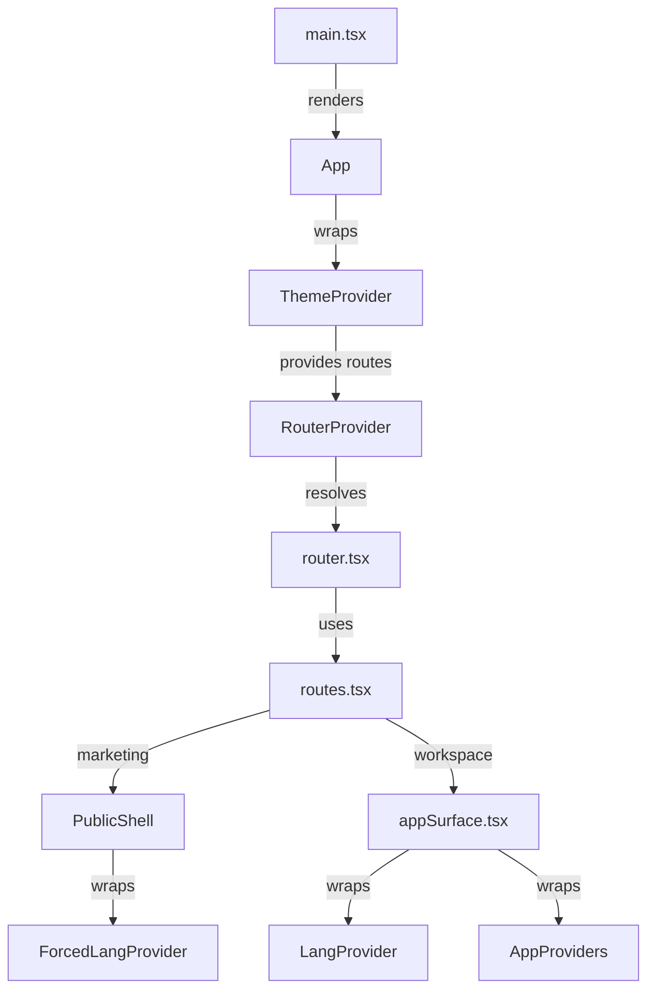
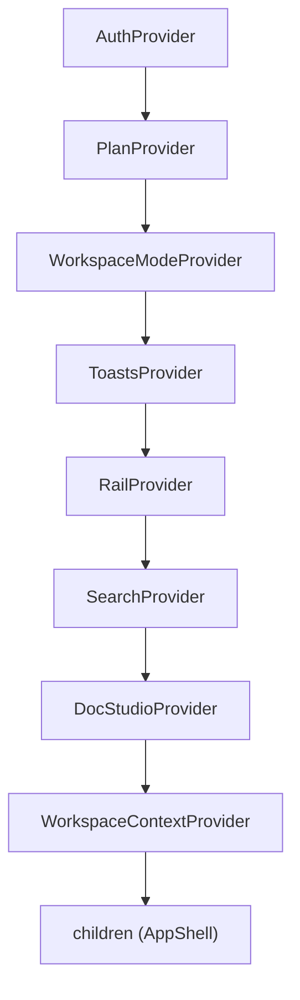
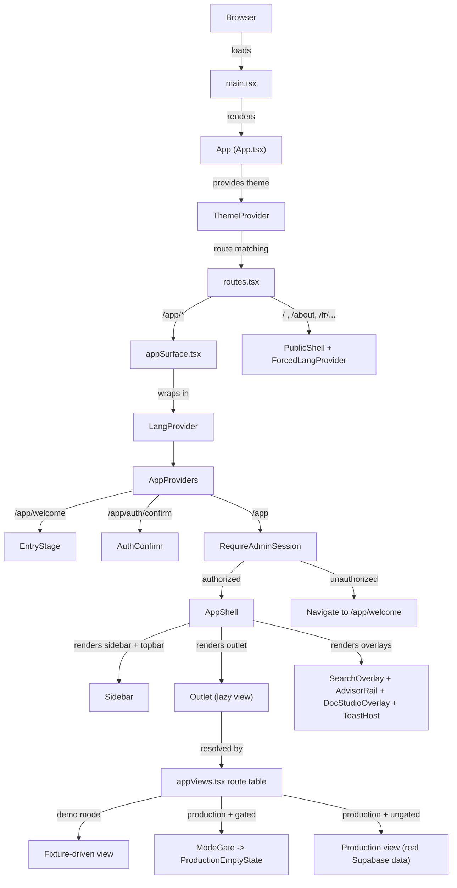

# Core Application Architecture

Relevant source files

The following files were used as context for generating this wiki page:

- [CONVENTIONS.md](CONVENTIONS.md)
- [src/app/appViews.tsx](src/app/appViews.tsx)
- [src/app/router.tsx](src/app/router.tsx)
- [src/features/app/AppProviders.tsx](src/features/app/AppProviders.tsx)
- [src/features/app/billing/PlanGate.tsx](src/features/app/billing/PlanGate.tsx)
- [src/features/app/docstudio/DocStudioOverlay.tsx](src/features/app/docstudio/DocStudioOverlay.tsx)
- [src/features/app/documents/DoclibProvider.test.tsx](src/features/app/documents/DoclibProvider.test.tsx)
- [src/features/app/documents/DoclibProvider.tsx](src/features/app/documents/DoclibProvider.tsx)
- [src/features/app/documents/components/SignatureModal.tsx](src/features/app/documents/components/SignatureModal.tsx)
- [src/features/app/documents/components/SignaturePad.tsx](src/features/app/documents/components/SignaturePad.tsx)
- [src/features/app/documents/doclibContext.ts](src/features/app/documents/doclibContext.ts)
- [src/features/app/documents/screens/DocumentDetailScreen.tsx](src/features/app/documents/screens/DocumentDetailScreen.tsx)
- [src/features/app/documents/screens/SigningScreen.tsx](src/features/app/documents/screens/SigningScreen.tsx)
- [src/features/app/views/employees/EmployeesProductionView.tsx](src/features/app/views/employees/EmployeesProductionView.tsx)
- [src/features/app/views/templates/TemplatesView.test.tsx](src/features/app/views/templates/TemplatesView.test.tsx)
- [src/features/app/views/templates/TemplatesView.tsx](src/features/app/views/templates/TemplatesView.tsx)
- [src/features/app/workspaceMode/ProductionEmptyState.tsx](src/features/app/workspaceMode/ProductionEmptyState.tsx)
- [src/features/app/workspaceMode/WorkspaceModeProvider.tsx](src/features/app/workspaceMode/WorkspaceModeProvider.tsx)
- [src/features/app/workspaceMode/api.ts](src/features/app/workspaceMode/api.ts)
- [src/features/app/workspaceMode/workspaceModeContext.ts](src/features/app/workspaceMode/workspaceModeContext.ts)
- [src/features/marketing/sections/Product.tsx](src/features/marketing/sections/Product.tsx)

Dutiva is a single-page React 19 application that serves two distinct surfaces from one route tree: a **public marketing site** (bilingual, prerendered to static HTML) and a **private workspace** (client-rendered, invite-only, `noindex`). This page describes the high-level structure that ties these surfaces together: the application entry point, the React provider hierarchy, the routing system, the authentication gate, and the workspace mode system. Each sub-topic has a dedicated child page for in-depth coverage.

## Application Entry Point

The application boots in `src/main.tsx`, which renders the `App` root component inside `React.StrictMode` [src/main.tsx:18-23](). Prerendered marketing pages hydrate (`hydrateRoot`), while the app shell client-renders (`createRoot`) [src/main.tsx:36-39]().

`App` (defined in `src/app/App.tsx`) wraps the entire tree in a `ThemeProvider` (light/dark with `prefers-color-scheme`) and hands the route table to React Router's `RouterProvider` [src/app/App.tsx:29-39](). Language providers are **not** at the root — they live inside the route tree, scoped differently per surface: `ForcedLangProvider` (URL-driven) on marketing, `LangProvider` (preference-driven) on `/app` [src/app/App.tsx:27-28]().

**Application boot diagram**

Sources: [src/main.tsx:18-39](), [src/app/App.tsx:29-39](), [src/app/router.tsx:1-9](), [src/app/routes.tsx:1-12]()

## Three-Surface Route Architecture

The route table in `src/app/routes.tsx` defines the full route tree. It splits into:

| Surface     | Path pattern                                  | Language strategy                          | Rendering                                             | Auth                       |
| ----------- | --------------------------------------------- | ------------------------------------------ | ----------------------------------------------------- | -------------------------- |
| Marketing   | `/`, `/about`, `/blog`, `/fr/...`             | URL-scoped (`ForcedLangProvider`)          | Prerendered + hydrated                                | None                       |
| Public demo | `/demo`, `/fr/demo`                           | URL-scoped (`ForcedWorkspaceLangProvider`) | Client-rendered (`app.html` shell); index prerendered | None (read-only fixtures)  |
| Workspace   | `/app/welcome`, `/app/auth/confirm`, `/app/*` | Preference-scoped (`LangProvider`)         | Client-rendered                                       | `RequireAdminSession` gate |

Marketing routes are generated from the SEO route registry (`src/seo/routes.ts`) — the `publicRoutes()` function builds the same route children for both English (unprefixed) and French (`/fr/…` with localized slugs) [src/app/routes.tsx:71-99](). The public demo reuses `AppShell` and `demoViewRoutes` inside `PublicDemoWorkspace` [src/app/routes.tsx:198-217](). Workspace routes are three top-level entries — `/app/welcome` (sign-in gate), `/app/auth/confirm` (magic-link landing), and `/app` (the shell with nested view routes) [src/app/routes.tsx:162-227](). A catch-all `*` route handles 404s [src/app/routes.tsx:228]().

Every workspace view is lazy-loaded via `React.lazy()` in `src/app/appViews.tsx` so marketing visitors never download workspace code [src/app/appViews.tsx:26-69](). The `appSurface.tsx` module lazily loads the `AppShell`, `EntryStage`, `RequireAdminSession`, and `AuthConfirm` components to maintain the same bundle boundary [src/app/appSurface.tsx:13-26]().

For details, see [Routing & Code Splitting](#2.1).

Sources: [src/app/routes.tsx:71-174](), [src/app/appViews.tsx:26-69](), [src/app/appSurface.tsx:13-26]()

## Authentication System

Authentication is a passwordless magic-link flow built on Supabase OTP. The `AuthProvider` tracks the Supabase session and exposes it via `useAuth()` [src/features/app/auth/AuthProvider.tsx:16-134](). It manages a four-state lifecycle (`AuthStatus`): `loading → signed-out → sent-link → signed-in` [src/features/app/auth/authContext.ts:14]().

Once signed in, `AuthProvider` performs an authorization check via the `current_user_is_workspace_member()` RPC to determine if the user is in the beta cohort [src/features/app/auth/AuthProvider.tsx:47](). The `RequireAdminSession` component gates the `/app` route — unauthorized users are redirected to `/app/welcome` [src/features/app/auth/RequireAdminSession.tsx:33-53](). Local dev and Vercel preview deployments skip the gate so the workspace stays accessible without credentials [src/features/app/auth/RequireAdminSession.tsx:37-39]().

For details, see [Authentication System](#2.2).

Sources: [src/features/app/auth/AuthProvider.tsx:16-134](), [src/features/app/auth/authContext.ts:14-66](), [src/features/app/auth/RequireAdminSession.tsx:33-53]()

## Workspace Mode System

The workspace operates in one of two modes — `demo` or `production` — governed by the `WorkspaceModeProvider` [src/features/app/workspaceMode/WorkspaceModeProvider.tsx:52-155](). The `WorkspaceMode` type is a union of `'demo' | 'production'` [src/features/app/workspaceMode/workspaceModeContext.ts:5]().

In **demo mode**, views render fixture data from `src/data/`. In **production mode**, views read and write real Supabase data scoped to an `organizationId`. The mode resolves to `'production'` only when a signed-in admin has explicitly stored that preference [src/features/app/workspaceMode/WorkspaceModeProvider.tsx:138-140](). On first switch to production, the `create_organization()` RPC provisions the organization atomically [src/features/app/workspaceMode/api.ts:106-121]().

The `gated()` wrapper in `appViews.tsx` wraps fixture-driven views in `ModeGate` — in demo mode the view renders normally, in production mode it shows `ProductionEmptyState` [src/app/appViews.tsx:23-25](), [src/features/app/workspaceMode/ModeGate.tsx:20-29](). Views that have gained real persistence (e.g. employees, cases, communications) have their gate removed and handle both modes internally.

For details, see [Workspace Mode & Provider Stack](#2.3).

Sources: [src/features/app/workspaceMode/WorkspaceModeProvider.tsx:52-155](), [src/features/app/workspaceMode/workspaceModeContext.ts:5-56](), [src/features/app/workspaceMode/ModeGate.tsx:20-29](), [src/app/appViews.tsx:23-25]()

## Provider Hierarchy

The `AppProviders` component composes nine providers in a specific nesting order [src/features/app/AppProviders.tsx:25-43]():

The ordering constraints are documented in the file:

- `AuthProvider` is outermost — it tracks the Supabase session needed by everything downstream [src/features/app/AppProviders.tsx:16-18]().
- `PlanProvider` reads the signed-in account's plan from `profiles`, so it sits inside `AuthProvider` but outside `WorkspaceModeProvider` [src/features/app/AppProviders.tsx:22-23]().
- `WorkspaceModeProvider` depends on the auth session to resolve demo/production [src/features/app/AppProviders.tsx:19-20]().
- `DocStudioProvider` must be inside `ToastsProvider` because it fires "draft ready" toasts [src/features/app/AppProviders.tsx:15]().

For details, see [Workspace Mode & Provider Stack](#2.3).

Sources: [src/features/app/AppProviders.tsx:1-43]()

## App Shell & Navigation

The workspace shell is the `AppShell` component in `src/features/app/shell/AppShell.tsx` [src/features/app/shell/AppShell.tsx:84-221](). It implements a responsive three-mode layout:

| Breakpoint          | Sidebar mode            | Description                                         |
| ------------------- | ----------------------- | --------------------------------------------------- |
| ≥1024px (desktop)   | `expanded` or `compact` | User-toggled, persisted in localStorage             |
| 768–1023px (tablet) | `compact`               | Always compact                                      |
| <768px (mobile)     | `drawer`                | Hamburger topbar + slide-in drawer + bottom tab nav |

The shell renders four global overlays as siblings of the main content: `SearchOverlay`, `AdvisorRail`, `DocStudioOverlay`, and `ToastHost` [src/features/app/shell/AppShell.tsx:215-218]().

Navigation is configured by `NAV_GROUPS` in `src/features/app/shell/navConfig.ts` — an array of `NavGroup` objects defining section headings, items with routes, icons, labels, and badge counts [src/features/app/shell/navConfig.ts:58-136](). The sidebar's collapsible section state is persisted per `SectionKey` in localStorage [src/features/app/shell/Sidebar.tsx:29-55]().

For details, see [App Shell & Navigation](#2.4).

Sources: [src/features/app/shell/AppShell.tsx:84-221](), [src/features/app/shell/navConfig.ts:58-136](), [src/features/app/shell/Sidebar.tsx:19-55]()

## How It All Fits Together

The following diagram shows the full request lifecycle from initial page load to a rendered workspace view, mapping to specific code files and components:

Sources: [src/main.tsx:18-39](), [src/app/App.tsx:29-39](), [src/app/routes.tsx:133-175](), [src/app/appSurface.tsx:31-68](), [src/features/app/AppProviders.tsx:25-43](), [src/features/app/auth/RequireAdminSession.tsx:33-53](), [src/features/app/shell/AppShell.tsx:84-221](), [src/app/appViews.tsx:71-166](), [src/features/app/workspaceMode/ModeGate.tsx:20-29]()

## Key Files Quick Reference

| File                                                       | Purpose                                                           |
| ---------------------------------------------------------- | ----------------------------------------------------------------- |
| `src/main.tsx`                                             | Application bootstrap — hydrate or client-render                  |
| `src/app/App.tsx`                                          | Root component — ThemeProvider + RouterProvider                   |
| `src/app/router.tsx`                                       | Creates `createBrowserRouter` from the route table                |
| `src/app/routes.tsx`                                       | Full route tree — public (EN + FR) and workspace                  |
| `src/app/appSurface.tsx`                                   | Lazy-loaded workspace entry — LangProvider + AppProviders + shell |
| `src/app/appViews.tsx`                                     | Workspace view route table with `React.lazy()` + `gated()`        |
| `src/features/app/AppProviders.tsx`                        | Provider composition stack (9 providers)                          |
| `src/features/app/auth/AuthProvider.tsx`                   | Supabase session tracking, magic-link OTP                         |
| `src/features/app/auth/RequireAdminSession.tsx`            | Workspace access gate                                             |
| `src/features/app/workspaceMode/WorkspaceModeProvider.tsx` | Demo/production mode resolution                                   |
| `src/features/app/workspaceMode/ModeGate.tsx`              | Per-route demo/production view gate                               |
| `src/features/app/shell/AppShell.tsx`                      | Workspace shell — sidebar, topbar, overlays                       |
| `src/features/app/shell/navConfig.ts`                      | Navigation model — `NAV_GROUPS`, `isNavActive`                    |

Sources: all files listed above.

---
