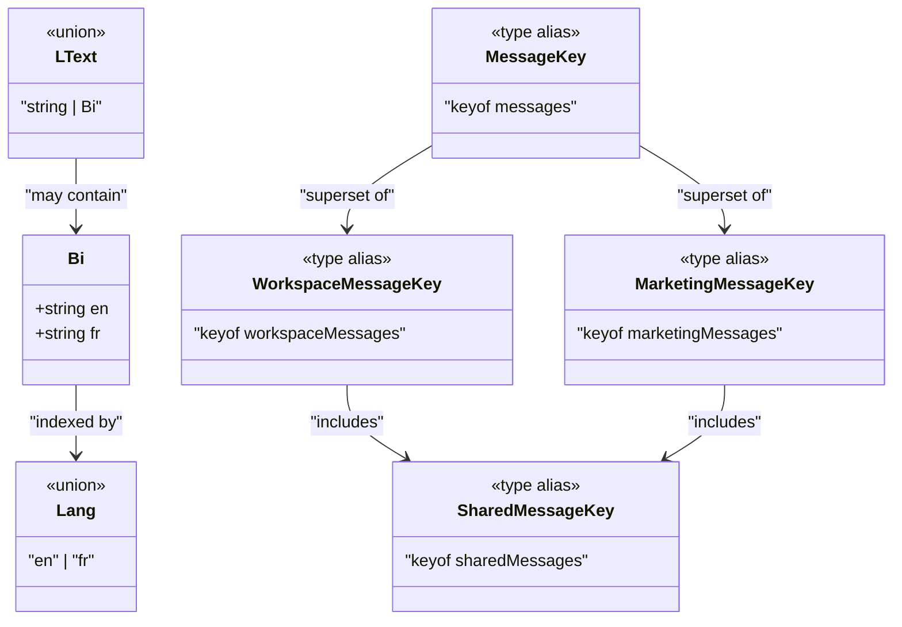
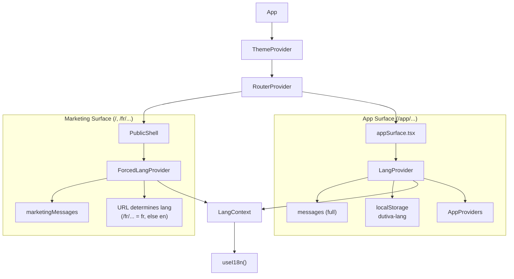
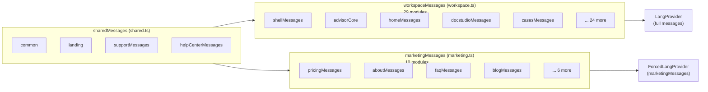
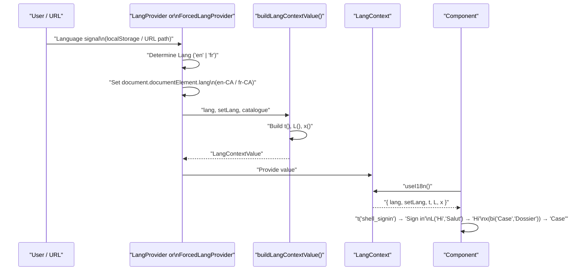

# Core i18n Types & Providers

Relevant source files

The following files were used as context for generating this wiki page:

- [docs/advisor-guidance-corpus-2026-08-04.md](docs/advisor-guidance-corpus-2026-08-04.md)
- [src/features/app/advisor/types.ts](src/features/app/advisor/types.ts)
- [src/features/app/rail/RailProvider.tsx](src/features/app/rail/RailProvider.tsx)
- [src/features/app/rail/railContext.ts](src/features/app/rail/railContext.ts)
- [src/features/app/search/SearchProvider.tsx](src/features/app/search/SearchProvider.tsx)
- [src/features/app/search/searchContext.ts](src/features/app/search/searchContext.ts)
- [src/features/app/toasts/toastsContext.ts](src/features/app/toasts/toastsContext.ts)
- [src/features/app/views/advisor/advisorScenarios.ts](src/features/app/views/advisor/advisorScenarios.ts)
- [src/i18n/ForcedLangProvider.tsx](src/i18n/ForcedLangProvider.tsx)
- [src/i18n/LangProvider.tsx](src/i18n/LangProvider.tsx)
- [src/i18n/core.ts](src/i18n/core.ts)
- [src/i18n/lang.ts](src/i18n/lang.ts)
- [src/i18n/messages/shared.ts](src/i18n/messages/shared.ts)
- [src/i18n/messages/workspace.ts](src/i18n/messages/workspace.ts)
- [supabase/migrations/0042_corpus_amendment_tranche_2026_08_04.sql](supabase/migrations/0042_corpus_amendment_tranche_2026_08_04.sql)

This page documents the bilingual (English / French Canadian) internationalization system: the foundational types (`Bi`, `Lang`, `LText`), the factory and helper functions, the `useI18n()` hook, the two language providers (`LangProvider` and `ForcedLangProvider`), the `buildLangContextValue` factory with graceful degradation, and the HTML `lang` tag strategy.

## Type System Overview

The i18n type system is defined in a single module and provides the primitives every bilingual string in the codebase is built on.

### `Bi` — The Bilingual String

The core type is the `Bi` interface — a record with `en` and `fr` string properties. Every user-facing string ships as a `Bi` value so that both languages are structurally guaranteed at compile time — a key cannot exist in one language only.

[src/i18n/core.ts:4-7]()

The `bi()` factory constructs `Bi` values concisely:

[src/i18n/core.ts:9]()

### `Lang` — The Language Discriminant

`Lang` is the union type `'en' | 'fr'` used throughout the system to select which side of a `Bi` to resolve.

[src/i18n/core.ts:1]()

### `LText` — Localizable Text

`LText` is `string | Bi` — a value that may already be localized (plain string) or may need resolution. State that outlives a single render (rail content, toasts, chat transcripts) stores `Bi` so a live language toggle re-localizes it; `LText` lets both forms coexist.

[src/i18n/core.ts:29-30]()

### Helper Functions

| Function         | Signature                                          | Purpose                                                                                                         |
| ---------------- | -------------------------------------------------- | --------------------------------------------------------------------------------------------------------------- |
| `pick`           | `(value: Bi, lang: Lang) => string`                | Resolves one side of a `Bi`                                                                                     |
| `pickL`          | `(value: LText, lang: Lang) => string`             | Resolves a plain string passthrough or a `Bi`                                                                   |
| `keyOfL`         | `(value: LText) => string`                         | Stable React key: returns the string itself, or `value.en` for a `Bi`                                           |
| `defineMessages` | `<T extends Record<string, Bi>>(messages: T) => T` | Identity function that pins a message module to `Record<key, Bi>` while preserving literal keys for full typing |

[src/i18n/core.ts:20-22]() — `pick`
[src/i18n/core.ts:32-34]() — `pickL`
[src/i18n/core.ts:37-39]() — `keyOfL`
[src/i18n/core.ts:16-18]() — `defineMessages`

### Type Relationship Diagram

Sources: [src/i18n/core.ts:1-39](), [src/i18n/messages/index.ts:86-92](), [src/i18n/messages/workspace.ts:77](), [src/i18n/messages/marketing.ts:35](), [src/i18n/messages/shared.ts:31]()

## `useI18n()` Hook

The `useI18n()` hook is the single consumer-facing API for all i18n resolution. It reads from `LangContext` and returns a `LangContextValue` with five members:

| Member    | Type                                 | Description                                     |
| --------- | ------------------------------------ | ----------------------------------------------- |
| `lang`    | `Lang`                               | Current active language (`'en'` or `'fr'`)      |
| `setLang` | `(lang: Lang) => void`               | Switch language — behavior differs by provider  |
| `t`       | `(key: MessageKey) => string`        | Look up a UI-chrome string by message key       |
| `L`       | `(en: string, fr: string) => string` | Inline bilingual pair — `L('Hello', 'Bonjour')` |
| `x`       | `(value: Bi) => string`              | Resolve a bilingual data field                  |

An optional `alternateHref` property is exposed on public pages for the language toggle to render a crawlable cross-language link.

[src/i18n/context.ts:5-21]() — `LangContextValue` interface
[src/i18n/context.ts:23-29]() — `LangContext` creation and `useI18n()` hook

The hook throws if used outside a provider:

[src/i18n/context.ts:27]()

### Usage Patterns

Components use the three resolution strategies depending on data source:

- **`t('key')`** — for message catalogue entries with compile-time keys (e.g. `t('shell_signin')`)
- **`L('en text', 'fr text')`** — for inline ad-hoc bilingual strings
- **`x(biValue)`** — for `Bi` values from data models (templates, scenarios, fixtures)

The test file demonstrates all three:

[src/i18n/i18n.test.tsx:9-19]()

Sources: [src/i18n/context.ts:1-29](), [src/i18n/i18n.test.tsx:9-19]()

## The Two Language Providers

The system uses two mutually exclusive providers, one per surface. Language providers live **inside** the route tree — the `App` component carries only the `ThemeProvider`.

[src/app/App.tsx:28-40]()

### Provider Architecture Diagram

Sources: [src/app/App.tsx:28-40](), [src/app/routes.tsx:50-63](), [src/app/appSurface.tsx:56-68]()

### `LangProvider` — Preference-Scoped (App Surface)

Used for `/app/...` routes. Language follows the persisted `dutiva-lang` localStorage key. Toggling language updates the preference and re-renders in place — the URL does not change.

[src/i18n/LangProvider.tsx:26-44]()

Key behavior:

1. Reads initial language from `readLang()` which checks `localStorage` via the safe `readPref` wrapper (defaults to `'en'`)
2. On language change, calls `writeLang()` to persist the preference, then `setLang()` to trigger re-render
3. Sets `document.documentElement.lang` to the BCP 47 tag via `useEffect`
4. Passes the **full merged `messages`** catalogue (workspace + marketing + shared) to `buildLangContextValue`

[src/i18n/lang.ts:7-17]() — `LANG_KEY`, `readLang`, `writeLang`
[src/lib/prefs.ts:1-16]() — Safe `readPref`/`writePref` with private-mode tolerance

The `LangProvider` wraps the app surface components in `appSurface.tsx`:

[src/app/appSurface.tsx:56-68]() — `Workspace` component
[src/app/appSurface.tsx:42-51]() — `AppWelcome` component
[src/app/appSurface.tsx:31-38]() — `AppAuthConfirm` component

Sources: [src/i18n/LangProvider.tsx:1-44](), [src/i18n/lang.ts:1-18](), [src/lib/prefs.ts:1-16](), [src/app/appSurface.tsx:1-68]()

### `ForcedLangProvider` — URL-Scoped (Marketing Surface)

Used for all public marketing routes. The URL is the source of truth: `/fr/...` means French, everything else means English. This ensures crawlers and visitors sharing a URL always see the same language.

[src/i18n/ForcedLangProvider.tsx:22-57]()

Key behavior:

1. Receives `lang` as a prop from the route structure (determined by `PublicShell`)
2. "Switching language" means **navigating** to the alternate URL via the SEO route registry (`alternatePathFor`)
3. Still calls `writeLang()` so the app surface follows the visitor's last explicit choice
4. Passes only the **`marketingMessages`** catalogue — workspace modules are excluded from the marketing bundle
5. Provides `alternateHref` for crawlable `<link rel="alternate">` tags

[src/app/routes.tsx:50-63]() — `PublicShell` wraps routes in `ForcedLangProvider`
[src/app/routes.tsx:71-99]() — `publicRoutes()` generates English and French route trees

The route table creates two separate route trees — one for English, one for French:

[src/app/routes.tsx:146-147]()

Sources: [src/i18n/ForcedLangProvider.tsx:1-57](), [src/app/routes.tsx:50-63](), [src/app/routes.tsx:133-175]()

## `buildLangContextValue` Factory

Both providers delegate context assembly to a single shared factory function. This ensures consistent behavior and graceful degradation.

[src/i18n/lang.ts:37-60]()

### Graceful Degradation on Missing Keys

The `t()` function produced by `buildLangContextValue` does **not** throw when a key is missing from the surface's catalogue. Instead, it logs an error and returns the raw key so the page still renders:

[src/i18n/lang.ts:43-49]()

This is a safety net for cross-surface scope violations — if a workspace-only key is accidentally referenced from marketing code, the page shows the key string rather than crashing. The `scripts/check-message-scopes.mjs` CI guard catches these at build time.

[src/i18n/messages/index.ts:77-83]()

### The `L` and `x` Helpers

These are also constructed inside `buildLangContextValue`:

- **`L(en, fr)`** — inline selector, `lang === 'fr' ? fr : en`
- **`x(v)`** — delegates to `pick(v, lang)` for `Bi` data values

[src/i18n/lang.ts:56-58]()

Sources: [src/i18n/lang.ts:37-60](), [src/i18n/messages/index.ts:77-83]()

## HTML `lang` Tags

Both providers set `document.documentElement.lang` to BCP 47 Canadian locale tags via `useEffect`:

| `Lang` value | HTML tag |
| ------------ | -------- |
| `'en'`       | `en-CA`  |
| `'fr'`       | `fr-CA`  |

The mapping is defined as:

[src/i18n/lang.ts:9-10]()

`LangProvider` sets it reactively when lang changes:

[src/i18n/LangProvider.tsx:29-31]()

`ForcedLangProvider` sets it on mount and when the prop-driven lang changes:

[src/i18n/ForcedLangProvider.tsx:32-34]()

The test suite validates this behavior end-to-end:

[src/i18n/i18n.test.tsx:48]()

Sources: [src/i18n/lang.ts:9-10](), [src/i18n/LangProvider.tsx:29-31](), [src/i18n/ForcedLangProvider.tsx:32-34](), [src/i18n/i18n.test.tsx:35-49]()

## Message Catalogue Architecture

The message catalogue is split into three surface groups to optimize bundle size:

Sources: [src/i18n/messages/index.ts:1-92](), [src/i18n/messages/workspace.ts:1-70](), [src/i18n/messages/marketing.ts:1-35](), [src/i18n/messages/shared.ts:1-31]()

### Catalogue Composition

| Group          | File           | Module count                                     | Consumer                               |
| -------------- | -------------- | ------------------------------------------------ | -------------------------------------- |
| Workspace-only | `workspace.ts` | 29                                               | `LangProvider` (via merged `messages`) |
| Marketing-only | `marketing.ts` | 10                                               | `ForcedLangProvider`                   |
| Shared         | `shared.ts`    | 4 (`common`, `landing`, `support`, `helpCenter`) | Both providers                         |
| Full merged    | `index.ts`     | All                                              | Tests, `LangProvider`                  |

The shared group contains `landing` because plan copy in `src/config/plans.ts` references `landing_*` keys, and the workspace's `PlanGate` resolves those through `t()`.

[src/i18n/messages/shared.ts:14-16]()

### `MessageKey` Type Hierarchy

`MessageKey` is the union of all keys across both surfaces:

[src/i18n/messages/index.ts:86-92]()

Surface-scoped types (`WorkspaceMessageKey`, `MarketingMessageKey`, `SharedMessageKey`) are enforced as disjoint at compile time via `@ts-expect-error` assertions:

[src/i18n/messages/scopes.test.ts:40-77]()

Sources: [src/i18n/messages/index.ts:86-92](), [src/i18n/messages/scopes.test.ts:1-78]()

## `defineMessages` Identity Function

Each message module uses `defineMessages` to declare its keys. This is an identity function — it returns exactly what it receives — but it serves two compile-time purposes:

1. **Pins the type to `Record<string, Bi>`** — every key must have both `en` and `fr`, making a single-language key a type error
2. **Preserves literal key types** — the generic `<T extends Record<string, Bi>>` keeps specific key names for downstream type inference

[src/i18n/core.ts:16-18]()

Example usage in `common.ts`:

[src/i18n/messages/common.ts:1-23]()

Sources: [src/i18n/core.ts:12-18](), [src/i18n/messages/common.ts:1-23]()

## Provider Stack Integration

The `LangProvider` sits **outside** the `AppProviders` composition but **inside** the router. This is because `AppProviders` contains `RailProvider` which calls `useNavigate()` and thus needs a router ancestor, while many providers within `AppProviders` consume `useI18n()` and thus need a `LangProvider` ancestor.

```mermaid
flowchart TD
    subgraph AppRoute["/app route tree"]
        LP["LangProvider\n(preference-scoped)"]
        AP["AppProviders"]
        Auth["AuthProvider"]
        Plan["PlanProvider"]
        WM["WorkspaceModeProvider"]
        Toasts["ToastsProvider"]
        Rail["RailProvider"]
        Search["SearchProvider"]
        DocStudio["DocStudioProvider"]
        WC["WorkspaceContextProvider"]
        Shell["AppShell / EntryStage"]
    end

    subgraph MarketingRoute["/ and /fr route trees"]
        FLP["ForcedLangProvider\n(URL-scoped)"]
        Outlet["Outlet → Page components"]
        CB["ConsentBanner"]
    end

    LP --> AP
    AP --> Auth --> Plan --> WM --> Toasts --> Rail --> Search --> DocStudio --> WC --> Shell

    FLP --> Outlet
    FLP --> CB
```

Sources: [src/app/appSurface.tsx:56-68](), [src/features/app/AppProviders.tsx:25-43](), [src/app/routes.tsx:50-63]()

## `LText` in Practice

`LText` (`string | Bi`) is used extensively in the Advisor system and rail for content that must survive re-renders across language toggles:

| Module            | Usage                                                     |
| ----------------- | --------------------------------------------------------- |
| `AdvisorTurnSpec` | `text: LText`, `reasoning?: LText[]`, card labels         |
| `ChatMessage`     | `text: LText`, `userChips?: LText[]`, `errorText?: LText` |
| `RailHead`        | `title: LText`                                            |
| `ToneCardData`    | `title: LText`, `body: LText`, `confidence?: LText`       |

[src/features/app/advisor/types.ts:1]() — imports `LText`
[src/features/app/advisor/types.ts:39-51]() — `AdvisorTurnSpec` uses `LText`
[src/features/app/advisor/types.ts:53-76]() — `ChatMessage` uses `LText`
[src/features/app/rail/RailProvider.tsx:4]() — imports `LText`
[src/features/app/rail/RailProvider.tsx:14-18]() — `RailHead` uses `LText`

Sources: [src/features/app/advisor/types.ts:1-76](), [src/features/app/rail/RailProvider.tsx:4-18]()

## Data Flow Summary

Sources: [src/i18n/lang.ts:37-60](), [src/i18n/context.ts:23-29](), [src/i18n/LangProvider.tsx:26-44](), [src/i18n/ForcedLangProvider.tsx:22-57]()

## Testing

The i18n system has three layers of test coverage:

1. **Unit tests** (`i18n.test.tsx`): Verifies `LangProvider` defaults to English, resolves `t`/`L`/`x`, switches to French live, persists to localStorage, and updates `<html lang>`. Also checks every catalogue entry has non-empty EN and FR. Tests `pickL` for both plain strings and `Bi` pairs.

[src/i18n/i18n.test.tsx:22-77]()

2. **Compile-time scope guards** (`scopes.test.ts`): Uses `@ts-expect-error` assertions to verify that workspace-only keys cannot be assigned to `MarketingMessageKey` and vice versa — catching cross-surface leaks at build time.

[src/i18n/messages/scopes.test.ts:27-78]()

3. **CI runtime guard** (`scripts/check-message-scopes.mjs`): Scans source files for literal `t('key')` calls that reach outside their surface boundary. Wired into `npm run check`.

[src/i18n/messages/index.ts:64-69]()

Sources: [src/i18n/i18n.test.tsx:1-77](), [src/i18n/messages/scopes.test.ts:1-78](), [src/i18n/messages/index.ts:64-69]()

## File Inventory

| File                               | Role                                                                               |
| ---------------------------------- | ---------------------------------------------------------------------------------- |
| `src/i18n/core.ts`                 | `Bi`, `Lang`, `LText`, `bi()`, `pick()`, `pickL()`, `keyOfL()`, `defineMessages()` |
| `src/i18n/context.ts`              | `LangContext`, `LangContextValue` interface, `useI18n()` hook                      |
| `src/i18n/lang.ts`                 | `LANG_KEY`, `HTML_LANG`, `readLang()`, `writeLang()`, `buildLangContextValue()`    |
| `src/i18n/LangProvider.tsx`        | Preference-scoped provider for `/app` routes                                       |
| `src/i18n/ForcedLangProvider.tsx`  | URL-scoped provider for marketing routes                                           |
| `src/i18n/messages/index.ts`       | Merged catalogue, `MessageKey` type                                                |
| `src/i18n/messages/workspace.ts`   | Workspace catalogue (29 modules + shared)                                          |
| `src/i18n/messages/marketing.ts`   | Marketing catalogue (10 modules + shared)                                          |
| `src/i18n/messages/shared.ts`      | Dual-surface modules (common, landing, support, helpCenter)                        |
| `src/i18n/messages/scopes.test.ts` | Compile-time disjointness guards                                                   |
| `src/i18n/i18n.test.tsx`           | Unit tests for providers and catalogue                                             |
| `src/lib/prefs.ts`                 | Safe localStorage wrapper used by `readLang`/`writeLang`                           |

Sources: all files listed above.

---
