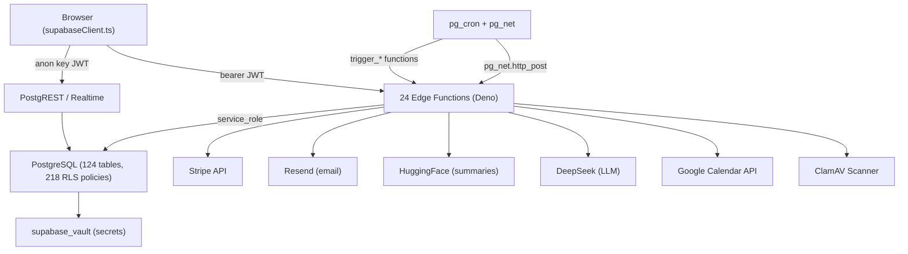
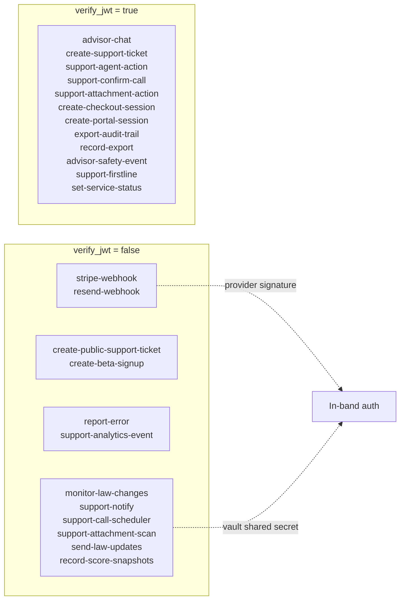
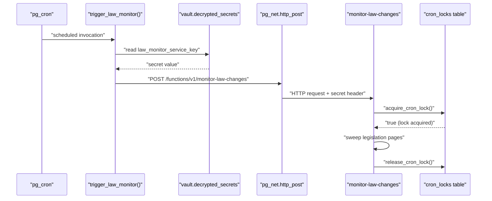
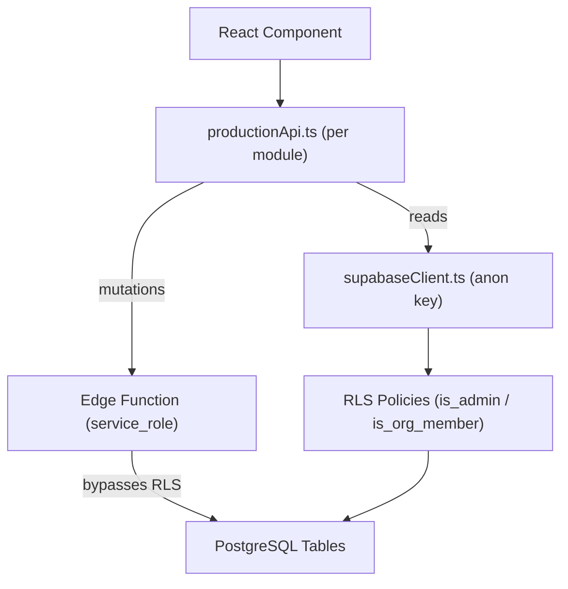

# Database & Backend Architecture

Relevant source files

The following files were used as context for generating this wiki page:

- [.env.example](.env.example)
- [docs/SUPPORT_ARCHITECTURE.md](docs/SUPPORT_ARCHITECTURE.md)
- [docs/SUPPORT_RUNBOOK.md](docs/SUPPORT_RUNBOOK.md)
- [docs/TODO.md](docs/TODO.md)
- [supabase/config.toml](supabase/config.toml)
- [supabase/functions/support-notify/index.ts](supabase/functions/support-notify/index.ts)
- [supabase/migrations/0048_fix_attachment_scan_trigger_auth.sql](supabase/migrations/0048_fix_attachment_scan_trigger_auth.sql)
- [supabase/migrations/0053_rls_grant_gaps_check.sql](supabase/migrations/0053_rls_grant_gaps_check.sql)
- [supabase/migrations/0074_revoke_flag_guidance_public_execute.sql](supabase/migrations/0074_revoke_flag_guidance_public_execute.sql)
- [supabase/schema.sql](supabase/schema.sql)

Dutiva's backend is a **Supabase** project (project id `khtwpxnvziiyplaflwru`) comprising a PostgreSQL database with 124 tables, 218 RLS policies, 136 functions, and 24 Deno edge functions. The browser connects through a nullable `supabase` client that returns `null` when env vars are missing — the "configured or inert" pattern — so the entire workspace gracefully degrades to demo fixtures when unconfigured.

[src/lib/supabaseClient.ts:1-17]()

**Backend architecture at a glance**

Sources: [supabase/config.toml:1-73](), [src/lib/supabaseClient.ts:12-16](), [supabase/migrations/0035_schedule_law_monitor.sql:37-65]()

## Database Schema

The full schema lives in `supabase/schema.sql` — a 124-table PostgreSQL database using a **multi-tenant** design where most workspace tables carry an `organization_id` FK. Tables use CHECK constraints for enum-like columns (status, priority, category), UTC timestamps via `timezone('utc', now())`, and `metadata jsonb` columns for extensibility.

Key PostgreSQL extensions enable the backend's capabilities:

| Extension        | Schema       | Purpose                                       |
| ---------------- | ------------ | --------------------------------------------- |
| `pg_cron`        | `pg_catalog` | Scheduled edge function triggers              |
| `pg_net`         | `public`     | Fire-and-forget HTTP calls from SQL           |
| `supabase_vault` | `vault`      | Encrypted secret storage                      |
| `vector`         | `extensions` | Embedding similarity search (guidance corpus) |
| `pgcrypto`       | `extensions` | Cryptographic functions                       |
| `uuid-ossp`      | `extensions` | UUID generation                               |

Three authorization helpers — `is_admin()`, `is_org_member()`, and `is_org_admin()` — underpin RLS policies across 71, 46, and 13 tables respectively. These are `SECURITY DEFINER` functions granted to the `authenticated` role (migration `0050`) so that signed-in users can read their own data.

For details on the 124-table schema, multi-tenant design, key tables, 75+ migrations, and the 218 RLS policies, see [Database Schema & Migrations](#9.1).

Sources: [supabase/schema.sql:16-83](), [supabase/migrations/0050_grant_rls_predicate_helpers_to_authenticated.sql:1-48](), [supabase/migrations/0053_rls_grant_gaps_check.sql:1-76]()

## Edge Functions & Shared Modules

The 24 edge functions are Deno TypeScript handlers under `supabase/functions/`. They split into two authentication modes controlled by `supabase/config.toml`:

**Edge function authentication map**

Sources: [supabase/config.toml:22-73]()

Functions that bypass JWT verification authenticate callers in-band: webhooks verify provider signatures (e.g. Stripe's HMAC, Resend's Svix signature), and cron-triggered workers check a shared secret from `vault.decrypted_secrets`. This was hardened in migration `0049` after an audit found that the original JWT-based auth was checking claims without verifying signatures.

[supabase/migrations/0049_cron_trigger_shared_secret.sql:1-39]()

A `_shared/` directory provides reusable server modules consumed by multiple edge functions:

| Module                  | Role                                                                                   |
| ----------------------- | -------------------------------------------------------------------------------------- |
| `aiUsage.ts`            | Claim/finalize pattern for AI metering with burst, daily, token, and platform ceilings |
| `exportGuard.ts`        | Export velocity limiting (burst + daily caps)                                          |
| `resendSend.ts`         | Thin Resend email API wrapper                                                          |
| `caslConsent.ts`        | CASL consent record builder with pinned wording                                        |
| `lawUpdateRelevance.ts` | Jurisdiction filtering for law changes (ON/QC/FED)                                     |
| `lawUpdateDigest.ts`    | Digest candidate selection with review gate                                            |
| `adminAccess.ts`        | `@dutiva.ca` paywall bypass                                                            |
| `supportAnalytics.ts`   | Analytics event validation                                                             |
| `googleCalendar.ts`     | Google Calendar service-account JWT flow                                               |
| `scheduledCalls.ts`     | Call scheduling logic                                                                  |

For the full edge function inventory, shared module details, and Vault secrets management, see [Edge Functions & Shared Modules](#9.2).

Sources: [supabase/functions/_shared/aiUsage.ts:1-39](), [supabase/functions/_shared/exportGuard.ts:1-49](), [supabase/functions/_shared/resendSend.ts:1-25](), [supabase/functions/_shared/caslConsent.ts:1-65](), [supabase/functions/_shared/lawUpdateRelevance.ts:1-131](), [supabase/functions/_shared/adminAccess.ts:1-17]()

## Cron-Driven Scheduling

Background jobs use `pg_cron` + `pg_net` to invoke edge functions on a schedule. Each cron job is a `SECURITY DEFINER` trigger function (e.g. `trigger_law_monitor()`, `trigger_attachment_scan()`) that reads credentials from `vault.decrypted_secrets` and fires a `net.http_post`. Overlapping runs are prevented by the `cron_locks` lease table with `acquire_cron_lock()` / `release_cron_lock()`.

| Cron Job                      | Schedule                      | Edge Function             |
| ----------------------------- | ----------------------------- | ------------------------- |
| Law monitor sweep             | `0 7 * * *` (daily)           | `monitor-law-changes`     |
| Support notify drain          | `* * * * *` (every minute)    | `support-notify`          |
| Attachment scan               | `*/10 * * * *` (every 10 min) | `support-attachment-scan` |
| Score snapshots (daily)       | `30 5 * * *`                  | `record-score-snapshots`  |
| Score snapshots (month-close) | `5,25,45 0 1 * *`             | `record-score-snapshots`  |
| Analytics rate-limit purge    | `17 * * * *`                  | SQL function (no edge fn) |

Sources: [supabase/migrations/0034_cron_locks.sql:1-85](), [supabase/migrations/0035_schedule_law_monitor.sql:1-65](), [supabase/migrations/0048_fix_attachment_scan_trigger_auth.sql:38-68]()

## Billing & Stripe Integration

Stripe billing is fully integrated but **disabled during beta** via the `PAID_PLANS_DISABLED_DURING_BETA` flag. The integration includes three edge functions: `create-checkout-session` (starts a Stripe Checkout flow), `create-portal-session` (customer portal access), and `stripe-webhook` (processes subscription lifecycle events with idempotency via the `stripe_webhook_events` table). Internal `@dutiva.ca` accounts bypass the paywall entirely — the `bypassesPaywall()` helper in `adminAccess.ts` short-circuits before any Stripe API call.

[supabase/functions/create-checkout-session/index.ts:1-17](), [supabase/functions/stripe-webhook/index.ts:1-21](), [supabase/functions/_shared/adminAccess.ts:11-16]()

For the complete billing flow, plan tiers, Stripe event processing, and usage counters, see [Billing & Stripe Integration](#9.3).

## External Service Integrations

The backend integrates with five external services, all following the "configured or inert" pattern — each returns a safe no-op or 503 when its credentials are absent:

| Service             | Credential(s)                                                 | Consumer                                                 |
| ------------------- | ------------------------------------------------------------- | -------------------------------------------------------- |
| **DeepSeek** (LLM)  | `HF_TOKEN` via model routes                                   | `advisor-chat`, `support-firstline`                      |
| **Stripe**          | `STRIPE_SECRET_KEY`, `STRIPE_WEBHOOK_SECRET`                  | `create-checkout-session`, `stripe-webhook`              |
| **Resend**          | `RESEND_API_KEY`                                              | `support-notify`, `send-law-updates` via `resendSend.ts` |
| **Google Calendar** | `GOOGLE_CALENDAR_CLIENT_EMAIL`, `GOOGLE_CALENDAR_PRIVATE_KEY` | `support-call-scheduler` via `googleCalendar.ts`         |
| **ClamAV scanner**  | `SUPPORT_ATTACHMENT_SCAN_URL`                                 | `support-attachment-scan`                                |

Sources: [.env.example:29-104](), [supabase/functions/_shared/resendSend.ts:9-25](), [supabase/functions/_shared/googleCalendar.ts:1-15]()

## Client ↔ Backend Data Flow

Workspace modules interact with the database through per-module `productionApi.ts` boundary files (e.g. `src/features/app/views/employees/productionApi.ts`). These files encapsulate all Supabase queries for their module, providing the seam where demo fixtures will eventually be replaced by live data. The browser client uses the publishable anon key; all privileged mutations route through edge functions that use the `service_role` key.

**Client-to-database data path**

Sources: [src/lib/supabaseClient.ts:1-17](), [supabase/migrations/0050_grant_rls_predicate_helpers_to_authenticated.sql:43-45]()

## Migrations & Integrity Guards

The migration history comprises **94 numbered files** under `supabase/migrations/` (`0001_` through `0093_`) plus 6 archived legacy migrations. The CI pipeline includes two database-level integrity checks that run against the live project:

- **`scripts/check-migrations.mjs`** — validates filename discipline and detects forward/reverse drift between the repo and the deployed project.
- **`scripts/check-rls.mjs`** — runtime RLS regression probing with positive and negative controls.
- **`rls_grant_gaps()`** (migration `0053`) — a catalog query that detects any RLS policy calling a function the `authenticated` role cannot execute, preventing the class of silent outage discovered in production.

[supabase/migrations/0053_rls_grant_gaps_check.sql:47-75]()

For the complete migration inventory, naming conventions, and detailed table descriptions, see [Database Schema & Migrations](#9.1).

---
