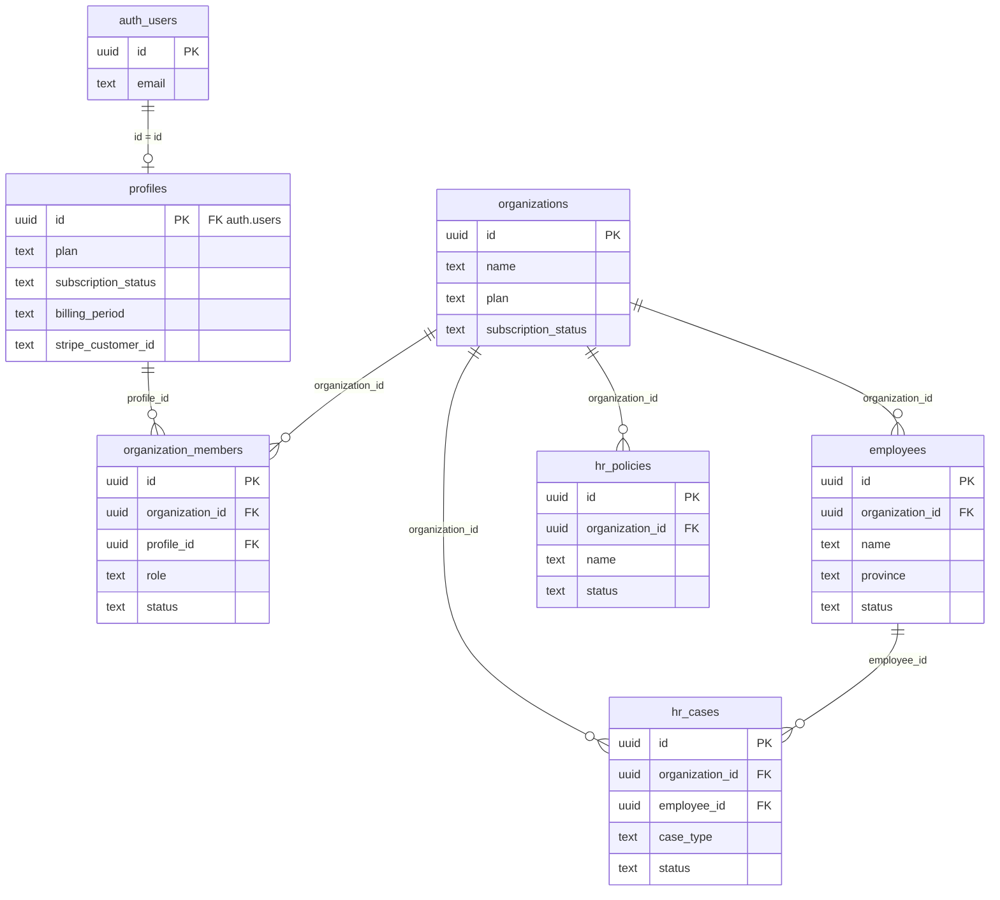
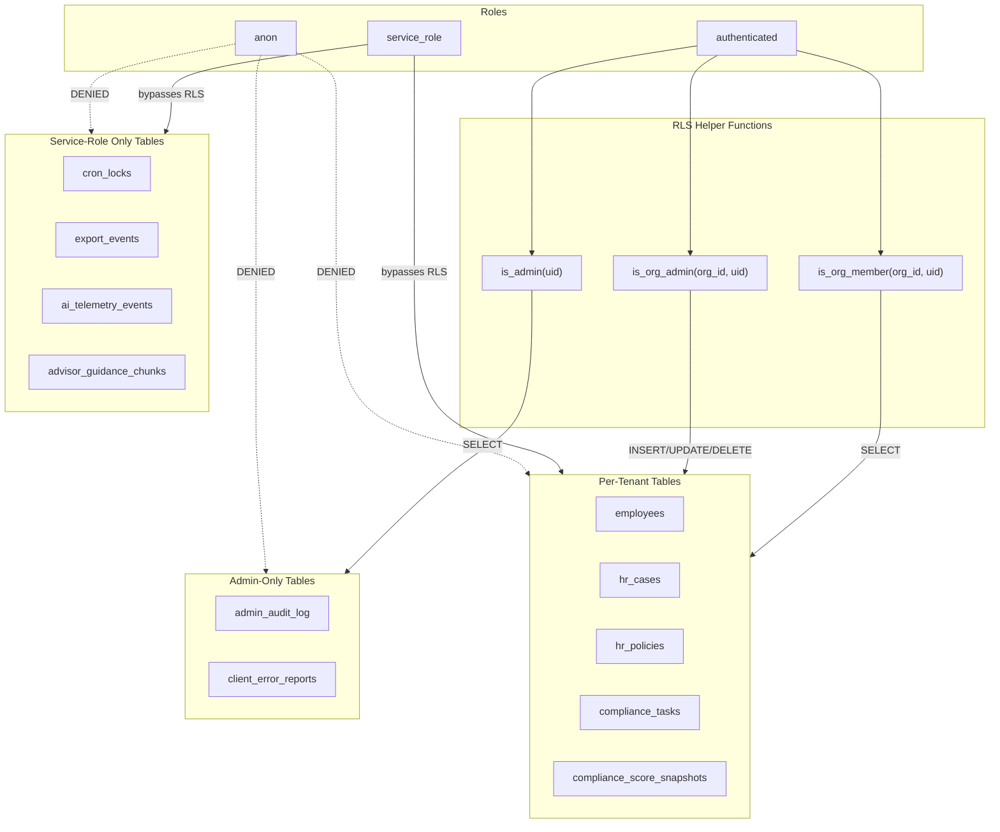
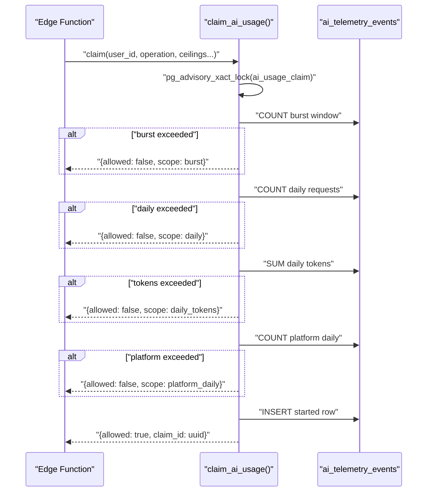
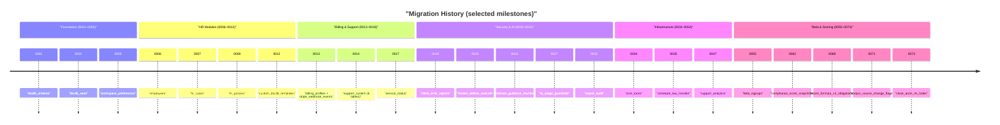
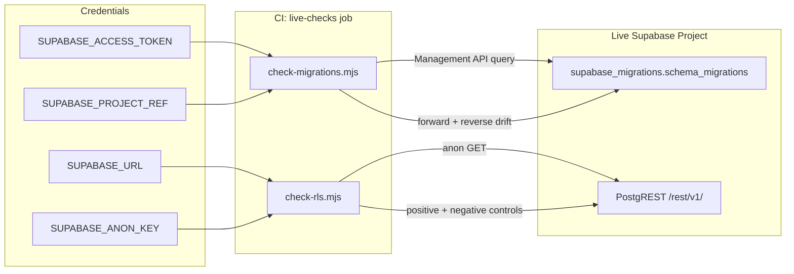
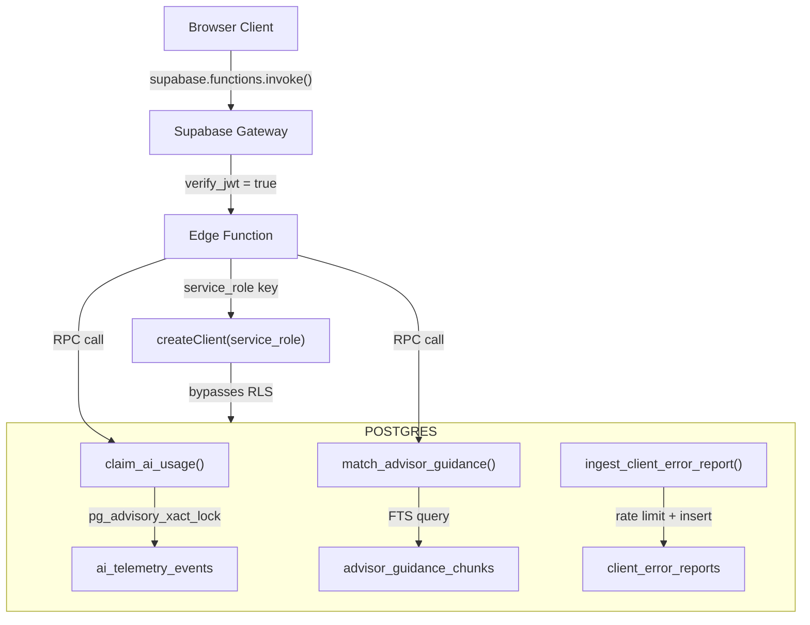

# Database Schema & Migrations

<details>
<summary>Relevant source files</summary>

The following files were used as context for generating this wiki page:

- [docs/DATA_MODEL.md](docs/DATA_MODEL.md)
- [docs/TODO.md](docs/TODO.md)
- [docs/design-handoff-hr-documents-library/README.md](docs/design-handoff-hr-documents-library/README.md)
- [docs/design-handoff-hr-documents-library/design/HR Documents Library.dc.html](docs/design-handoff-hr-documents-library/design/HR Documents Library.dc.html)
- [docs/design-handoff-hr-documents-library/design/assets/dutiva-leaf.png](docs/design-handoff-hr-documents-library/design/assets/dutiva-leaf.png)
- [docs/design-handoff-hr-documents-library/design/assets/icon-app.svg](docs/design-handoff-hr-documents-library/design/assets/icon-app.svg)
- [docs/design-handoff-hr-documents-library/design/dutiva-data.js](docs/design-handoff-hr-documents-library/design/dutiva-data.js)
- [docs/design-handoff-hr-documents-library/screenshots/01-studio.png](docs/design-handoff-hr-documents-library/screenshots/01-studio.png)
- [docs/design-handoff-hr-documents-library/screenshots/02-template-detail.png](docs/design-handoff-hr-documents-library/screenshots/02-template-detail.png)
- [docs/design-handoff-hr-documents-library/screenshots/03-generate-wizard.png](docs/design-handoff-hr-documents-library/screenshots/03-generate-wizard.png)
- [docs/design-handoff-hr-documents-library/screenshots/04-repository.png](docs/design-handoff-hr-documents-library/screenshots/04-repository.png)
- [docs/design-handoff-hr-documents-library/screenshots/05-document-detail.png](docs/design-handoff-hr-documents-library/screenshots/05-document-detail.png)
- [docs/do-residency-confirmation-request.md](docs/do-residency-confirmation-request.md)
- [supabase/config.toml](supabase/config.toml)
- [supabase/legacy-migrations/202604070001_initial_schema.sql](supabase/legacy-migrations/202604070001_initial_schema.sql)
- [supabase/legacy-migrations/202604070002_signatures.sql](supabase/legacy-migrations/202604070002_signatures.sql)
- [supabase/legacy-migrations/202604070003_conversations.sql](supabase/legacy-migrations/202604070003_conversations.sql)
- [supabase/legacy-migrations/202604070004_stripe.sql](supabase/legacy-migrations/202604070004_stripe.sql)
- [supabase/legacy-migrations/202604080001_law_monitoring.sql](supabase/legacy-migrations/202604080001_law_monitoring.sql)
- [supabase/legacy-migrations/202604080002_law_monitoring_v2.sql](supabase/legacy-migrations/202604080002_law_monitoring_v2.sql)
- [supabase/legacy-migrations/README.md](supabase/legacy-migrations/README.md)
- [supabase/migrations/0003_restrict_guidance_law_updates_to_dutiva_domain.sql](supabase/migrations/0003_restrict_guidance_law_updates_to_dutiva_domain.sql)
- [supabase/migrations/0004_revoke_anon_execute_security_definer.sql](supabase/migrations/0004_revoke_anon_execute_security_definer.sql)
- [supabase/migrations/0011_restrict_guidance_law_updates_to_single_admin.sql](supabase/migrations/0011_restrict_guidance_law_updates_to_single_admin.sql)
- [supabase/migrations/0020_harden_definer_execute_revoke_public.sql](supabase/migrations/0020_harden_definer_execute_revoke_public.sql)
- [supabase/migrations/0022_advisor_guidance_chunks.sql](supabase/migrations/0022_advisor_guidance_chunks.sql)
- [supabase/migrations/0023_match_advisor_guidance.sql](supabase/migrations/0023_match_advisor_guidance.sql)
- [supabase/migrations/0050_grant_rls_predicate_helpers_to_authenticated.sql](supabase/migrations/0050_grant_rls_predicate_helpers_to_authenticated.sql)
- [supabase/migrations/0054_enable_pg_cron_pg_net.sql](supabase/migrations/0054_enable_pg_cron_pg_net.sql)
- [supabase/migrations/0055_beta_signups.sql](supabase/migrations/0055_beta_signups.sql)
- [supabase/migrations/0056_beta_signup_notification.sql](supabase/migrations/0056_beta_signup_notification.sql)
- [supabase/migrations/0057_beta_signup_confirmation.sql](supabase/migrations/0057_beta_signup_confirmation.sql)
- [supabase/migrations/0058_match_advisor_guidance_quote_lexemes.sql](supabase/migrations/0058_match_advisor_guidance_quote_lexemes.sql)
- [supabase/migrations/0059_advisor_guidance_chunks_touch_updated_at.sql](supabase/migrations/0059_advisor_guidance_chunks_touch_updated_at.sql)
- [supabase/migrations/0060_revoke_anon_execute_workspace_member_check.sql](supabase/migrations/0060_revoke_anon_execute_workspace_member_check.sql)
- [supabase/migrations/0061_support_analytics_status_fix.sql](supabase/migrations/0061_support_analytics_status_fix.sql)
- [supabase/migrations/0074_revoke_flag_guidance_public_execute.sql](supabase/migrations/0074_revoke_flag_guidance_public_execute.sql)
- [supabase/migrations/0093_all_plan_signup_notifications.sql](supabase/migrations/0093_all_plan_signup_notifications.sql)
- [supabase/schema.sql](supabase/schema.sql)

</details>

The Dutiva platform stores all workspace state in a single Supabase-managed PostgreSQL database. The full schema snapshot lives in `supabase/schema.sql`, while incremental changes are tracked by 119 numbered migration files under `supabase/migrations/` (sequence through `0119`) and 6 archived legacy migrations under `supabase/legacy-migrations/`. This page documents the schema design conventions, table taxonomy, key functions, RLS security model, migration lifecycle, and drift-detection tooling.

## Schema Overview

The schema is a single-schema (`public`) design running on Supabase's managed Postgres. It uses 9 extensions, defines 1 custom composite type (`signature_token_view`), and follows a consistent set of conventions across all tables.

### PostgreSQL Extensions

| Extension            | Schema       | Purpose                                                     |
| -------------------- | ------------ | ----------------------------------------------------------- |
| `pg_cron`            | `pg_catalog` | Scheduled jobs (law monitor, purge tasks)                   |
| `pg_net`             | `public`     | HTTP requests from SQL (cron-triggered edge function calls) |
| `hypopg`             | `extensions` | Hypothetical index analysis                                 |
| `index_advisor`      | `extensions` | Automatic index recommendations                             |
| `pg_stat_statements` | `extensions` | Query performance tracking                                  |
| `pgcrypto`           | `extensions` | Cryptographic functions (`gen_random_uuid()`)               |
| `supabase_vault`     | `vault`      | Encrypted secrets storage                                   |
| `uuid-ossp`          | `extensions` | UUID generation                                             |
| `vector`             | `extensions` | Vector similarity search (future RAG embedding)             |
| `wrappers`           | `extensions` | Foreign data wrappers                                       |

Sources: [supabase/schema.sql:16-83]()

### Design Conventions

Every table in the schema follows a strict set of conventions:

**UUID primary keys** — all tables use `uuid DEFAULT gen_random_uuid()` as the primary key, never serial integers.

**UTC timestamps** — `created_at` and `updated_at` columns use `timestamp with time zone DEFAULT timezone('utc', now())`. The explicit `timezone('utc', ...)` call pins the default to UTC regardless of the database's `timezone` setting.

**CHECK constraints for enums** — status, type, and category columns use `CHECK (col = ANY (ARRAY[...]))` rather than PostgreSQL `ENUM` types. This allows adding values with a migration `ALTER TABLE ... DROP/ADD CONSTRAINT` without a type rebuild.

**`metadata` JSONB extensibility** — most tables carry a `metadata jsonb DEFAULT '{}'::jsonb NOT NULL` column for semi-structured data that doesn't warrant its own column yet.

**`organization_id` FK** — workspace-scoped tables carry a `NOT NULL` foreign key to `organizations(id) ON DELETE CASCADE`, forming the multi-tenant boundary.

**RLS on every table** — `ALTER TABLE ... ENABLE ROW LEVEL SECURITY` appears on every table. Tables with no explicit policies (e.g. `cron_locks`, `export_events`) intentionally deny all non-service-role access.

Sources: [supabase/schema.sql:107-128](), [supabase/schema.sql:197-210](), [supabase/schema.sql:647-670](), [supabase/migrations/0006_add_employees.sql:11-23]()

## Table Taxonomy

The schema tables group into seven functional domains. The diagram below maps the primary domain tables and their foreign key relationships.

### Multi-Tenant Core ER Diagram



Sources: [supabase/schema.sql:478-496](), [supabase/migrations/0013_add_billing_profiles.sql:12-25](), [supabase/migrations/0006_add_employees.sql:11-23](), [supabase/migrations/0007_add_hr_cases.sql:9-22](), [supabase/migrations/0008_add_hr_policies.sql:9-19]()

### Table Domain Reference

The tables are organized into nine domains:

**Identity & Multi-Tenancy**

| Table                   | Migration     | Purpose                                                                      |
| ----------------------- | ------------- | ---------------------------------------------------------------------------- |
| `profiles`              | Legacy + 0013 | User account, billing columns (plan, stripe_customer_id)                     |
| `organizations`         | Pre-repo      | Tenant entity with compliance profile                                        |
| `organization_members`  | Pre-repo      | Join table: profile ↔ organization + role (owner/hr/manager/viewer/external) |
| `user_roles`            | Pre-repo      | Global platform roles (admin)                                                |
| `workspace_preferences` | 0005          | Per-workspace user settings                                                  |

**HR Records**

| Table                      | Migration | Purpose                                                          |
| -------------------------- | --------- | ---------------------------------------------------------------- |
| `employees`                | 0006      | Per-org workforce roster                                         |
| `hr_cases`                 | 0007      | Case files (Termination, Performance, Accommodation, Onboarding) |
| `hr_case_notes`            | 0009      | Notes on cases                                                   |
| `hr_employee_notes`        | 0010      | Notes on employees                                               |
| `hr_policies`              | 0008      | Policy register (up_to_date/needs_review/missing)                |
| `hr_documents`             | Pre-repo  | Document template catalogue                                      |
| `hr_compensation_records`  | 0039      | Compensation records                                             |
| `hr_communications`        | 0040      | Communications records                                           |
| `hr_wellbeing_initiatives` | 0041      | Wellbeing program records                                        |
| `hr_expiry_records`        | 0064      | Certification/document expiry tracking                           |
| `hr_leaves`                | 0065      | Leave records                                                    |

**Hiring**

| Table                 | Migration | Purpose                                     |
| --------------------- | --------- | ------------------------------------------- |
| `hiring_job_postings` | 0118      | Job postings with bilingual content         |
| `hiring_candidates`   | 0118      | Candidate profiles and application data     |
| `hiring_applications` | 0118      | Applications linking candidates to postings |
| `hiring_interviews`   | 0118      | Interview records and feedback              |
| `hiring_evaluations`  | 0118      | Structured candidate evaluations            |
| `hiring_activity_log` | 0118      | Audit trail for hiring actions              |

**Finance** (migration 0119 — committed but not yet applied to the Supabase project)

| Table                         | Migration | Purpose                                                     |
| ----------------------------- | --------- | ----------------------------------------------------------- |
| `finance_entities`            | 0119      | Legal entities (org-scoped)                                 |
| `finance_books`               | 0119      | Accounting books per entity                                 |
| `finance_fiscal_periods`      | 0119      | Fiscal period definitions                                   |
| `finance_parties`             | 0119      | Customers, suppliers, vendors                               |
| `finance_bank_accounts`       | 0119      | Bank account master data                                    |
| `finance_ledger_accounts`     | 0119      | Chart of accounts per book                                  |
| `finance_invoices`            | 0119      | AR invoices with lifecycle status                           |
| `finance_bills`               | 0119      | AP bills with lifecycle status                              |
| `finance_credits`             | 0119      | Credit notes                                                |
| `finance_receipts`            | 0119      | Evidence receipts (Storage bucket `finance-evidence`)       |
| `finance_spend_requests`      | 0119      | Spend approval requests                                     |
| `finance_purchase_orders`     | 0119      | Purchase orders                                             |
| `finance_expenses`            | 0119      | Employee expenses with approval flow                        |
| `finance_subscriptions`       | 0119      | Recurring subscription tracking                             |
| `finance_journals`            | 0119      | Journal entries with balanced check                         |
| `finance_bank_items`          | 0119      | Bank transaction items for matching                         |
| `finance_reconciliations`     | 0119      | Reconciliation records                                      |
| `finance_close_periods`       | 0119      | Period close/lock records                                   |
| `finance_pay_periods`         | 0119      | Pay period definitions (admin-only)                         |
| `finance_pay_runs`            | 0119      | Pay run records (admin-only)                                |
| `finance_payroll_liabilities` | 0119      | Payroll liability settlement tracking (admin-only)          |
| `finance_budgets`             | 0119      | Budgets with versioned lines                                |
| `finance_scenarios`           | 0119      | Planning scenarios (hiring, capital, financing, tax)        |
| `finance_forecasts`           | 0119      | Cash flow and operating forecasts                           |
| `finance_reserve_goals`       | 0119      | Reserve/savings goals                                       |
| `finance_holdings`            | 0119      | Investment holdings with staleness tracking                 |
| `finance_debts`               | 0119      | Debt instruments with status lifecycle                      |
| `finance_tax_obligations`     | 0119      | Tax filing obligations (ON, QC, FED)                        |
| `finance_tax_scenarios`       | 0119      | Tax-planning scenarios with disclaimer                      |
| `finance_approvals`           | 0119      | Approval records for finance workflows                      |
| `finance_audit_events`        | 0119      | Audit trail for finance actions                             |
| `finance_external_actions`    | 0119      | External action tracking (payroll submissions, tax filings) |

**Documents & Signatures**

| Table                        | Migration  | Purpose                                                     |
| ---------------------------- | ---------- | ----------------------------------------------------------- |
| `documents`                  | Legacy     | User-created documents                                      |
| `signatures`                 | Legacy     | E-signature records (token-gated)                           |
| `document_annotations`       | schema.sql | Inline annotations (note/risk/suggestion/question/citation) |
| `document_templates`         | Pre-repo   | Reusable template definitions                               |
| `document_template_versions` | Pre-repo   | Versioned template content                                  |
| `custom_templates`           | 0012       | User-created custom templates                               |
| `export_events`              | 0033       | Export audit trail with content SHA-256                     |

**AI & Advisor**

| Table                     | Migration  | Purpose                                        |
| ------------------------- | ---------- | ---------------------------------------------- |
| `conversations`           | Legacy     | Advisor chat threads (messages as JSONB array) |
| `advisor_guidance_chunks` | 0022       | Grounding corpus for RAG retrieval with FTS    |
| `ai_telemetry_events`     | Pre-repo   | Usage telemetry (model, tokens, latency)       |
| `ai_recommendations`      | schema.sql | AI-generated action recommendations            |
| `ai_action_runs`          | schema.sql | Execution records for accepted recommendations |
| `ai_agents`               | schema.sql | Agent definitions                              |
| `agent_runs`              | schema.sql | Agent execution records                        |
| `multi_agent_plans`       | schema.sql | Multi-agent orchestration plans                |
| `advisor_memories`        | Pre-repo   | Per-user advisor memory storage                |

**Compliance & Law Monitoring**

| Table                        | Migration  | Purpose                                 |
| ---------------------------- | ---------- | --------------------------------------- |
| `compliance_tasks`           | schema.sql | Org-scoped compliance tasks             |
| `compliance_findings`        | schema.sql | Compliance findings (severity-weighted) |
| `compliance_assessments`     | schema.sql | Assessment run records                  |
| `compliance_score_snapshots` | 0062       | Monthly score history per org           |
| `hr_obligations`             | schema.sql | Regulatory obligations register         |
| `law_updates`                | Legacy     | Detected legislation changes            |
| `law_page_hashes`            | Legacy     | Content hash state per monitored URL    |
| `law_change_impacts`         | schema.sql | Impact analysis of law changes          |
| `legal_ingestion_runs`       | schema.sql | Legal document processing records       |

**Support System**

| Table                        | Migration | Purpose                                               |
| ---------------------------- | --------- | ----------------------------------------------------- |
| `support_tickets`            | 0014      | Customer support tickets (DUT-YYYY-NNNNNN references) |
| `support_messages`           | 0014      | Ticket messages (customer/agent/system)               |
| `support_attachments`        | 0014      | Attachment metadata (files in Storage bucket)         |
| `support_ticket_events`      | 0014      | Append-only audit trail                               |
| `support_ticket_assignments` | 0014      | Agent assignment history                              |
| `support_ticket_feedback`    | 0014      | Post-resolution feedback                              |
| `support_notifications`      | 0015      | Outbox for email notifications                        |
| `support_scheduled_calls`    | 0045      | Scheduled call records                                |
| `support_analytics_events`   | 0047      | Help Centre analytics events                          |

**Platform Infrastructure**

| Table                     | Migration  | Purpose                                   |
| ------------------------- | ---------- | ----------------------------------------- |
| `beta_signups`            | 0055       | Beta waitlist with CASL consent           |
| `beta_signup_intake`      | 0055       | Rate-limit log for signups                |
| `cron_locks`              | 0034       | Lease-style locks for edge function crons |
| `job_queue`               | schema.sql | General-purpose async job queue           |
| `client_error_reports`    | 0019       | Privacy-scrubbed crash reports            |
| `client_error_rate_limit` | 0019       | Error report rate-limit hashes            |
| `stripe_webhook_events`   | 0013       | Idempotency table for Stripe webhooks     |
| `usage_counters`          | Pre-repo   | Per-user monthly usage limits             |
| `service_status`          | 0017       | Public service status page data           |
| `admin_audit_log`         | schema.sql | Admin action audit trail                  |
| `activity_events`         | schema.sql | Workspace activity feed                   |
| `notifications`           | schema.sql | In-app notification records               |
| `external_integrations`   | schema.sql | Third-party integration config            |

Sources: [supabase/schema.sql:107-670](), [supabase/migrations/0014_support_system.sql:33-144](), [supabase/migrations/0022_advisor_guidance_chunks.sql:13-58](), [supabase/migrations/0034_cron_locks.sql:16-84](), [supabase/migrations/0055_beta_signups.sql:12-72](), [supabase/migrations/0033_export_audit.sql:27-153](), [supabase/migrations/0062_add_compliance_score_snapshots.sql:10-51]()

## CHECK Constraint Patterns

Status and type columns use CHECK constraints rather than Postgres ENUM types. The constraints follow the naming convention `{table}_{column}_check`. Below is a representative sample:

| Table                   | Column       | Allowed Values                                                                                                      |
| ----------------------- | ------------ | ------------------------------------------------------------------------------------------------------------------- |
| `ai_recommendations`    | `status`     | `pending`, `accepted`, `dismissed`, `executed`, `failed`                                                            |
| `ai_recommendations`    | `priority`   | `low`, `medium`, `high`, `critical`                                                                                 |
| `compliance_tasks`      | `status`     | `open`, `in_progress`, `blocked`, `completed`, `cancelled`                                                          |
| `compliance_findings`   | `severity`   | `info`, `low`, `medium`, `high`, `critical`                                                                         |
| `support_tickets`       | `status`     | `new`, `triaged`, `in_progress`, `waiting_on_customer`, `waiting_on_dutiva`, `scheduled_call`, `resolved`, `closed` |
| `job_queue`             | `status`     | `queued`, `locked`, `running`, `completed`, `failed`, `cancelled`, `dead_letter`                                    |
| `hr_cases`              | `case_type`  | `Termination`, `Performance`, `Accommodation`, `Onboarding`                                                         |
| `employees`             | `status`     | `active`, `on_leave`, `terminated`                                                                                  |
| `hr_policies`           | `status`     | `up_to_date`, `needs_review`, `missing`                                                                             |
| `profiles`              | `plan`       | `free`, `starter`, `growth`, `pro`                                                                                  |
| `law_updates`           | `event_type` | `change`, `redirect`, `broken`, `first_seen`                                                                        |
| `ai_telemetry_events`   | `status`     | `started`, `completed`, `failed`, `cancelled`                                                                       |
| `support_notifications` | `kind`       | Ticket/call/ack kinds plus `beta_signup`, `beta_confirmation`, `account_signup`, `plan_signup` (0093)               |

Sources: [supabase/schema.sql:125-128](), [supabase/schema.sql:545-547](), [supabase/schema.sql:584-587](), [supabase/schema.sql:665-669](), [supabase/schema.sql:740-742](), [supabase/migrations/0014_support_system.sql:44-48](), [supabase/migrations/0027_ai_usage_guardrails.sql:40-64](), [supabase/migrations/0093_all_plan_signup_notifications.sql:8-18]()

## RLS Security Model

Row Level Security is enabled on every table. The access control model is built on three `SECURITY DEFINER` helper functions that are called inside RLS policy `USING` clauses:

| Function        | Signature                | Purpose                                           |
| --------------- | ------------------------ | ------------------------------------------------- |
| `is_admin`      | `(uuid) → boolean`       | Checks `user_roles` for platform admin            |
| `is_org_member` | `(uuid, uuid) → boolean` | Checks active `organization_members` membership   |
| `is_org_admin`  | `(uuid, uuid) → boolean` | Checks owner/admin role in `organization_members` |

These helpers are `STABLE`, `SECURITY DEFINER`, `SET search_path`, and read-only. They were granted `EXECUTE` to `authenticated` by migration 0050, and explicitly revoked from `anon`.

### RLS Access Model Diagram



Sources: [supabase/migrations/0050_grant_rls_predicate_helpers_to_authenticated.sql:43-51](), [supabase/migrations/0006_add_employees.sql:34-49](), [supabase/migrations/0034_cron_locks.sql:26-28]()

### Per-Tenant RLS Pattern

The standard per-tenant table pattern (used by `employees`, `hr_cases`, `hr_policies`, `compliance_tasks`, `compliance_score_snapshots`, and others) defines four policies:

1. **SELECT** — `is_org_member(organization_id, auth.uid())` — any active member can read
2. **INSERT** — `is_org_admin(organization_id, auth.uid())` — org owners/admins can create
3. **UPDATE** — `is_org_admin(organization_id, auth.uid())` — org owners/admins can modify
4. **DELETE** — `is_org_admin(organization_id, auth.uid())` — org owners/admins can remove

This pattern is established in migration 0006 and replicated exactly in 0007, 0008, 0062, and others.

Sources: [supabase/migrations/0006_add_employees.sql:34-49](), [supabase/migrations/0008_add_hr_policies.sql:27-43](), [supabase/migrations/0062_add_compliance_score_snapshots.sql:35-51]()

### Security Hardening History

The schema's security posture was iteratively hardened through several migrations:

| Migration | Fix                                                                                         |
| --------- | ------------------------------------------------------------------------------------------- |
| 0004      | Revoke anon EXECUTE on SECURITY DEFINER functions (insufficient — see 0020)                 |
| 0020      | Revoke PUBLIC grant (the effective lockdown), re-grant authenticated where needed           |
| 0050      | Grant `is_admin`/`is_org_member`/`is_org_admin` to `authenticated` (fixes RLS 42501 errors) |
| 0060      | Revoke anon EXECUTE on `current_user_is_workspace_member`                                   |
| 0073      | Close 3 anonymous-read RLS holes on `beta_signups`, `hr_documents`, `signatures`            |
| 0074      | Revoke public execute on `flag_guidance_chunks_on_law_change`                               |

Sources: [supabase/migrations/0004_revoke_anon_execute_security_definer.sql:1-67](), [supabase/migrations/0020_harden_definer_execute_revoke_public.sql:1-70](), [supabase/migrations/0073_close_anon_rls_holes.sql:1-55]()

## Key Functions

The schema defines ~136 functions. They fall into several categories:

### Authorization Helpers

| Function                             | Access        | Description                                      |
| ------------------------------------ | ------------- | ------------------------------------------------ |
| `is_admin(uuid)`                     | authenticated | Check user_roles for admin flag                  |
| `is_org_member(uuid, uuid)`          | authenticated | Check organization_members for active membership |
| `is_org_admin(uuid, uuid)`           | authenticated | Check organization_members for owner/admin role  |
| `current_user_is_workspace_member()` | authenticated | Check if caller's email is on beta_signups list  |

### Rate-Limiting & Claim Functions



| Function                          | Access       | Description                                                                 |
| --------------------------------- | ------------ | --------------------------------------------------------------------------- |
| `claim_ai_usage(...)`             | service_role | Atomic check-and-reserve for AI usage (burst/daily/token/platform ceilings) |
| `finalize_ai_usage(...)`          | service_role | Update claim row with final token count and status                          |
| `claim_export_slot(...)`          | service_role | Atomic check-and-reserve for document exports                               |
| `ingest_client_error_report(...)` | service_role | Rate-limited error report ingestion                                         |

All claim functions use `pg_advisory_xact_lock` to serialize concurrent requests, preventing race conditions where multiple requests all read a count below the limit.

Sources: [supabase/migrations/0027_ai_usage_guardrails.sql:97-220](), [supabase/migrations/0033_export_audit.sql:68-153](), [supabase/migrations/0019_client_error_reports.sql:105-168]()

### Cron Lock Functions

| Function                                                | Access       | Description                                        |
| ------------------------------------------------------- | ------------ | -------------------------------------------------- |
| `acquire_cron_lock(job_name, instance_id, ttl_seconds)` | service_role | Lease-style lock via UPSERT; steals expired leases |
| `release_cron_lock(job_name, instance_id)`              | service_role | Release only if caller still owns                  |

The cron lock pattern uses a `cron_locks` table rather than `pg_advisory_lock` because advisory locks are session-scoped and don't survive pgbouncer's transaction pooling. The UPSERT atomically acquires or steals an expired lease.

Sources: [supabase/migrations/0034_cron_locks.sql:32-84](), [supabase/schema.sql:170-194]()

### Advisor Guidance Retrieval

`match_advisor_guidance(q text, k integer)` performs bilingual full-text search over the `advisor_guidance_chunks` corpus. It evolved through four migrations:

| Migration | Change                                                      |
| --------- | ----------------------------------------------------------- |
| 0023      | Initial: OR-ed English lexemes, ts_rank ordering            |
| 0024      | Added `review_status` and `topic` to return columns         |
| 0029      | Bilingual: merged English + French FTS ranking              |
| 0058      | Quote lexemes to fix tsquery metacharacter errors from URLs |
| 0071      | Added `source_changed_at` to return columns                 |

The final version returns up to `k` (max 8) active chunks, ranked by the greater of English and French `ts_rank` scores. It is restricted to `service_role` only.

Sources: [supabase/migrations/0023_match_advisor_guidance.sql:14-43](), [supabase/migrations/0071_corpus_source_change_flags.sql:96-151]()

### Admin RPC Functions

Most tables have a corresponding `admin_list_*` function that gates on `is_admin(auth.uid())` and returns all rows with optional status filtering. These are the admin dashboard's data layer:

- `admin_list_beta_signups()`, `admin_list_users()`, `admin_list_organizations()`
- `admin_list_compliance_tasks(status)`, `admin_list_compliance_findings(status)`
- `admin_list_jobs(status)`, `admin_list_agent_runs(status)`
- `admin_list_law_updates()`, `admin_list_audit_log(limit)`
- `admin_reporting_overview()` — aggregate counts for dashboard
- `admin_runtime_overview()` — queue depth, AI latency

Sources: [supabase/schema.sql:462-1028]()

## Triggers

The schema uses triggers for three purposes:

**`updated_at` auto-touch** — `BEFORE UPDATE` triggers call a `set_updated_at()` or `touch_*_updated_at()` function that sets `new.updated_at = timezone('utc', now())`. Applied to `profiles` (legacy), `documents` (legacy), `conversations` (legacy), `support_tickets` (0014), `advisor_guidance_chunks` (0059/0022).

**Auto-generated references** — `support_tickets_set_reference` fires `BEFORE INSERT` on `support_tickets`, generating a `DUT-YYYY-NNNNNN` public reference from a sequence.

**Cross-table flags** — `law_updates_flag_guidance` fires `AFTER INSERT` on `law_updates`. When a `change` event is detected, it stamps `source_changed_at` on all `advisor_guidance_chunks` in the matching jurisdiction, flagging them for re-review.

**Profile billing protection** — `pin_profile_billing_columns` prevents authenticated users from directly modifying billing columns (`plan`, `subscription_status`, `stripe_customer_id`, `stripe_subscription_id`, `billing_period`) on their own profile row; only `service_role` writes can update these.

**Auth user creation** — `on_auth_user_created` fires `AFTER INSERT` on `auth.users`, calling `handle_new_user()` to auto-create a `profiles` row and enqueue an operator `account_signup` row on `support_notifications` (migration 0093). A failure to enqueue is swallowed with a warning so profile creation still succeeds.

Sources: [supabase/legacy-migrations/202604070001_initial_schema.sql:70-86](), [supabase/migrations/0014_support_system.sql:147-165](), [supabase/migrations/0071_corpus_source_change_flags.sql:44-89](), [supabase/migrations/0059_advisor_guidance_chunks_touch_updated_at.sql:17-29](), [supabase/migrations/0093_all_plan_signup_notifications.sql:20-61]()

## Migration System

### Naming Convention

Migrations follow the pattern `NNNN_lower_snake_case.sql` where `NNNN` is a zero-padded four-digit sequence number. The `scripts/check-migrations.mjs` script enforces this with the regex `/^(\d{4})_([a-z0-9_]+)\.sql$/`.

Sources: [scripts/check-migrations.mjs:47]()

### Migration Timeline

The 74 migrations span from the initial doclib schema (0001) through security hardening (0074):



Sources: [supabase/migrations/0001_doclib_schema.sql](), [supabase/migrations/0074_revoke_flag_guidance_public_execute.sql]()

### Known Sequence Duplicates

Sequence number `0024` is used by two migrations (`0024_match_advisor_guidance_review_topic.sql` and `0024_reconcile_billing_schema.sql`). Both are already applied to the live project, so renaming would cause `supabase db push` to re-run them. This is tracked in the `ACCEPTED_DUPLICATES` set in `check-migrations.mjs`.

Sources: [scripts/check-migrations.mjs:56]()

### Legacy Migrations

Six SQL files under `supabase/legacy-migrations/` predate this repository. They were recovered from a separate Supabase CLI project folder and are **not runnable** — the CLI only reads `supabase/migrations/`, so these are historical records only.

| File                                 | Creates                                              |
| ------------------------------------ | ---------------------------------------------------- |
| `202604070001_initial_schema.sql`    | `profiles`, `documents`, `handle_new_user()` trigger |
| `202604070002_signatures.sql`        | `signatures` table with token-based access           |
| `202604070003_conversations.sql`     | `conversations` table (advisor chat)                 |
| `202604070004_stripe.sql`            | Stripe billing integration                           |
| `202604080001_law_monitoring.sql`    | `law_updates`, `law_page_hashes`                     |
| `202604080002_law_monitoring_v2.sql` | Law monitoring enhancements                          |

These fill a gap identified as OA10 in `docs/TODO.md`: three live tables (`documents`, `signatures`, `conversations`) had no `CREATE TABLE` in the repository's migration history.

Sources: [supabase/legacy-migrations/README.md:1-52](), [supabase/legacy-migrations/202604070001_initial_schema.sql:1-144](), [supabase/legacy-migrations/202604080001_law_monitoring.sql:1-50]()

### Recovered Migrations (0055–0061)

Several migrations were applied directly to the live project without committing files, then recovered from `supabase_migrations.schema_migrations`. These are marked `ALREADY APPLIED` in their headers and were surfaced by the reverse drift check.

Sources: [supabase/migrations/0055_beta_signups.sql:1-11](), [supabase/migrations/0057_beta_signup_confirmation.sql:1-9](), [supabase/migrations/0059_advisor_guidance_chunks_touch_updated_at.sql:1-13]()

### Signup notification vocabulary (0093)

Migration `0093_all_plan_signup_notifications` widens `support_notifications_kind_check` with `account_signup` and `plan_signup` (keeping the existing ticket, call, ack, and beta kinds) and replaces `handle_new_user()` so auth signups enqueue an operator alert. Applied on the live project as slug `all_plan_signup_notifications` (version `20260829014442`).

Sources: [supabase/migrations/0093_all_plan_signup_notifications.sql:1-61]()

## Drift Detection & CI Guards

Two scripts enforce schema integrity in CI, running as the `live-checks` job in `.github/workflows/ci.yml`.

### Migration Drift: `check-migrations.mjs`

This script has two halves:

**LOCAL (always runs)** — validates filename discipline: every `.sql` file must match `NNNN_lower_snake_case.sql`, no duplicate sequence numbers (unless in `ACCEPTED_DUPLICATES`), no duplicate slugs.

**DRIFT (credential-gated)** — queries `supabase_migrations.schema_migrations` on the live project via the Supabase Management API. Performs both forward drift (repo file not applied) and reverse drift (applied migration with no repo file). Accepted gaps are tracked in `ACCEPTED_UNAPPLIED` and `ACCEPTED_UNTRACKED` maps.

When credentials are absent, the script exits 0 but emits a GitHub Actions warning annotation and job-summary entry so the skip is never mistaken for a pass.

Sources: [scripts/check-migrations.mjs:1-95](), [scripts/check-migrations.mjs:156-176]()

### RLS Regression: `check-rls.mjs`

Probes the live database as the anonymous PostgREST role using the public anon key. It has:

1. **Positive control** — reads `service_status` (intentionally public) to prove the anon key is valid
2. **Negative controls** — reads `beta_signups`, `hr_documents`, `signatures` and fails if any rows are visible

This catches out-of-band policy changes that would not show up in the migration history. The check was written after a 2026-08-08 audit found three tables with world-open `USING(true)` SELECT policies.

Sources: [scripts/check-rls.mjs:1-95](), [scripts/check-rls.mjs:120-213]()

### CI Integration Diagram



Sources: [scripts/check-migrations.mjs:180-210](), [scripts/check-rls.mjs:92-157]()

## Key Table Deep Dives

### `support_tickets`

The support ticket table is the most constrained in the schema, with CHECK constraints on 9 columns:

```sql
category  CHECK (category in ('account_access', 'billing', 'technical',
          'product_question', 'privacy', 'security', 'accessibility',
          'complaint', 'sales', 'other'))
status    CHECK (status in ('new', 'triaged', 'in_progress',
          'waiting_on_customer', 'waiting_on_dutiva', 'scheduled_call',
          'resolved', 'closed'))
priority  CHECK (priority in ('critical', 'high', 'standard', 'low'))
impact    CHECK (impact in ('blocking', 'major', 'minor', 'none'))
urgency   CHECK (urgency in ('urgent', 'soon', 'whenever'))
language  CHECK (language in ('en', 'fr'))
source    CHECK (source in ('app_form', 'public_form', 'email',
          'ai_escalation'))
```

The `public_reference` column is auto-populated by the `set_support_ticket_reference()` trigger, generating human-readable IDs like `DUT-2026-000005`. Eight indexes cover the most common query patterns (requester, workspace, status, priority, category, assigned agent, open tickets by date).

Sources: [supabase/migrations/0014_support_system.sql:33-80]()

### `advisor_guidance_chunks`

The grounding corpus table uses a `GENERATED ALWAYS AS` stored `tsvector` column for full-text search. After migration 0029, it carries both English (`fts`) and French (`fts_fr`) tsvector columns. The `source_changed_at` flag (added in 0071) is set by the `law_updates_flag_guidance` trigger when a law change is detected, allowing the advisor to warn about potentially stale citations.

Key columns:

- `jurisdiction` — constrained to `'ON'`, `'QC'`, `'FED'`, `'ALL'`
- `review_status` — `'machine_curated'` or `'reviewed'`
- `status` — `'active'` or `'retired'`
- `fts tsvector GENERATED ALWAYS AS (to_tsvector('english', title || ' ' || content)) STORED`

Sources: [supabase/migrations/0022_advisor_guidance_chunks.sql:13-58](), [supabase/migrations/0071_corpus_source_change_flags.sql:34-89]()

### `cron_locks`

A minimalist lease table with `job_name` as primary key. The `acquire_cron_lock` function uses an UPSERT with a `WHERE expires_at < now()` clause — if the existing lock hasn't expired, the UPSERT's `DO UPDATE` skips (the WHERE fails), and the function returns `false`. Expired leases are atomically stolen.

```sql
-- Only steal if expired
ON CONFLICT (job_name) DO UPDATE
  SET instance_id = excluded.instance_id, ...
  WHERE public.cron_locks.expires_at < v_now
```

Access is restricted to `service_role` only — `anon`, `authenticated`, and `PUBLIC` are all revoked.

Sources: [supabase/migrations/0034_cron_locks.sql:16-84]()

### `beta_signups`

Carries CASL (Canada's Anti-Spam Legislation) consent evidence:

- `consent_granted boolean` — `NULL` for pre-consent-era signups; `true` for consented
- `consent_text text` — verbatim wording shown to the user, frozen at signup time
- `consent_at timestamptz` — when consent was given

The `beta_signup_intake` sibling table holds peppered IP hashes for rate limiting, decoupled from the actual signup data. The capacity check function `beta_cohort_remaining()` (migration 0067) enforces the 15-seat beta cohort limit.

Sources: [supabase/schema.sql:478-511](), [supabase/migrations/0055_beta_signups.sql:12-72](), [supabase/migrations/0037_beta_signups_consent_record.sql]()

### `job_queue`

A general-purpose async job queue with pessimistic locking:

- `job_type` constrained to: `ai_action`, `law_scan`, `embedding_generation`, `compliance_assessment`, `document_review`, `notification`, `billing_sync`, `custom`
- `status` lifecycle: `queued` → `locked` → `running` → `completed` | `failed` | `dead_letter`
- `priority` range 1–1000 (lower = higher priority)
- `attempts` / `max_attempts` for retry logic
- `locked_by` / `locked_at` for pessimistic locking
- `run_after` for delayed execution

Sources: [supabase/schema.sql:647-670]()

## Config & Deployment

### `config.toml`

The `supabase/config.toml` file pins `verify_jwt` settings for every edge function. Functions that must be reachable without a JWT (webhooks, public intake, cron workers) are explicitly set to `verify_jwt = false`. This prevents a bare `supabase functions deploy` from accidentally flipping them closed.

| Function Group                                              | `verify_jwt`     | Authentication Method           |
| ----------------------------------------------------------- | ---------------- | ------------------------------- |
| `stripe-webhook`, `resend-webhook`                          | `false`          | Provider signature verification |
| `create-public-support-ticket`, `create-beta-signup`        | `false`          | CAPTCHA / honeypot              |
| `report-error`, `support-analytics-event`                   | `false`          | Fire-and-forget, no auth header |
| `monitor-law-changes`, `support-notify`, `send-law-updates` | `false`          | In-handler shared secret        |
| All other functions                                         | `true` (default) | JWT from Supabase auth          |

Sources: [supabase/config.toml:1-72]()

### Vault Secrets

Secrets are stored in the Supabase Vault (`supabase_vault` extension) rather than environment variables. Key secrets include:

- `law_monitor_service_key` — service key for cron-triggered law monitoring
- `RESEND_API_KEY`, `SUPPORT_EMAIL_FROM`, `SUPPORT_NOTIFY_SECRET` — email delivery
- `CAPTCHA_SECRET_KEY` — Turnstile CAPTCHA verification
- `STRIPE_SECRET_KEY`, `STRIPE_WEBHOOK_SECRET` — billing integration

Sources: [supabase/config.toml:1-72](), [docs/TODO.md:42-66]()

## Schema Evolution Patterns

### Defensive / Idempotent DDL

Migrations use `CREATE TABLE IF NOT EXISTS`, `DROP POLICY IF EXISTS`, and `ALTER TABLE ... ADD COLUMN IF NOT EXISTS` so they can be safely re-run. Some migrations wrap their logic in `DO $$ ... $$` blocks with `to_regclass()` checks for tables that may not exist on all environments.

```sql
-- From 0003: skip if table doesn't exist (live-project-only schema)
if to_regclass('public.guidance_sources') is not null then
  alter policy "..." on public.guidance_sources using (...);
else
  raise notice '... not present - skipping';
end if;
```

Sources: [supabase/migrations/0003_restrict_guidance_law_updates_to_dutiva_domain.sql:20-54]()

### Constraint Evolution

CHECK constraints are modified by dropping the old constraint and adding the new one in the same migration. This pattern appears when new enum values are needed:

```sql
-- From 0027: widen ai_telemetry_events operation vocabulary
ALTER TABLE public.ai_telemetry_events
  DROP CONSTRAINT IF EXISTS ai_telemetry_events_operation_check;
ALTER TABLE public.ai_telemetry_events
  ADD CONSTRAINT ai_telemetry_events_operation_check
  CHECK (operation IN ('chat', 'draft', ..., 'support_firstline', 'safety_backstop'));
```

Sources: [supabase/migrations/0027_ai_usage_guardrails.sql:41-64]()

### Function Signature Evolution

When a function's return type must change (e.g. adding an output column), the function must be dropped and recreated because PostgreSQL cannot add OUT columns in-place:

```sql
-- From 0071: drop old 2-arg match_advisor_guidance and recreate with source_changed_at
DROP FUNCTION IF EXISTS public.match_advisor_guidance(text, integer);
CREATE FUNCTION public.match_advisor_guidance(q text, k integer default 4)
RETURNS TABLE (..., source_changed_at timestamptz) ...
```

Sources: [supabase/migrations/0071_corpus_source_change_flags.sql:94-151]()

## Data Flow: Edge Function → Database

The diagram below traces how an authenticated edge function interacts with the database through the security layers:



Sources: [supabase/config.toml:22-72](), [supabase/migrations/0027_ai_usage_guardrails.sql:97-220](), [supabase/migrations/0023_match_advisor_guidance.sql:14-43]()

---
