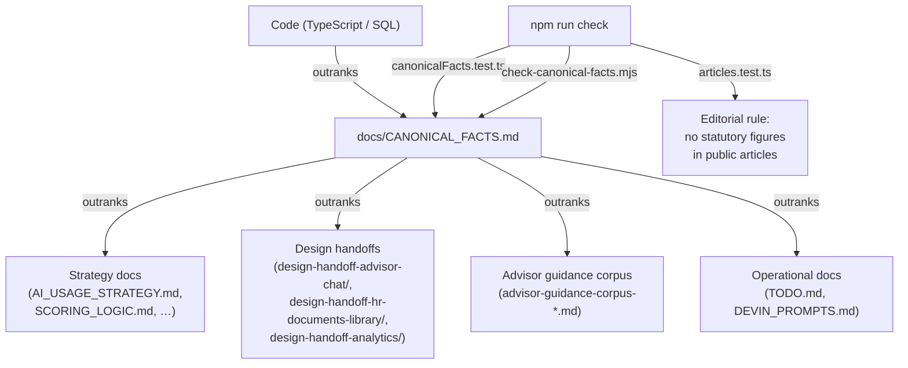
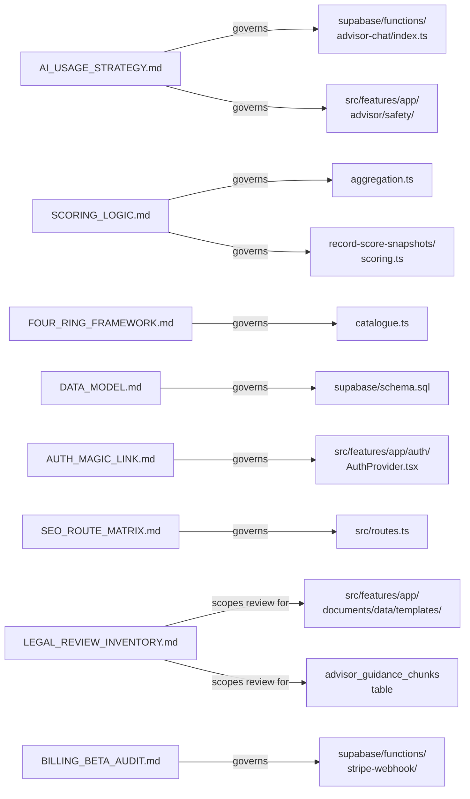
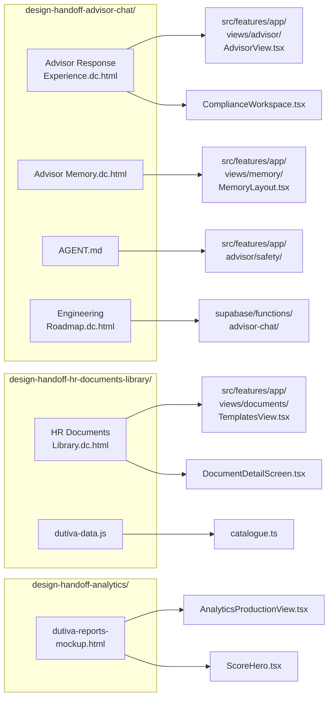

# Design Handoff & Documentation

Relevant source files

The following files were used as context for generating this wiki page:

- [docs/LEGAL_REVIEW_INVENTORY.md](docs/LEGAL_REVIEW_INVENTORY.md)
- [docs/README.md](docs/README.md)
- [docs/SCORING_LOGIC.md](docs/SCORING_LOGIC.md)
- [docs/design-handoff-advisor-chat/AGENT.md](docs/design-handoff-advisor-chat/AGENT.md)
- [docs/design-handoff-advisor-chat/README.md](docs/design-handoff-advisor-chat/README.md)
- [docs/design-handoff-advisor-chat/prototypes/Advisor Memory.dc.html](docs/design-handoff-advisor-chat/prototypes/Advisor Memory.dc.html)
- [docs/design-handoff-advisor-chat/prototypes/Advisor Response Experience.dc.html](docs/design-handoff-advisor-chat/prototypes/Advisor Response Experience.dc.html)
- [docs/design-handoff-advisor-chat/prototypes/Engineering Roadmap.dc.html](docs/design-handoff-advisor-chat/prototypes/Engineering Roadmap.dc.html)
- [docs/design-handoff-advisor-chat/prototypes/support.js](docs/design-handoff-advisor-chat/prototypes/support.js)
- [docs/design-handoff-advisor-chat/screenshots/01-response-home.png](docs/design-handoff-advisor-chat/screenshots/01-response-home.png)
- [docs/design-handoff-advisor-chat/screenshots/02-response-termination.png](docs/design-handoff-advisor-chat/screenshots/02-response-termination.png)
- [docs/design-handoff-advisor-chat/screenshots/03-response-escalation.png](docs/design-handoff-advisor-chat/screenshots/03-response-escalation.png)
- [docs/design-handoff-advisor-chat/screenshots/04-response-support.png](docs/design-handoff-advisor-chat/screenshots/04-response-support.png)
- [docs/design-handoff-advisor-chat/screenshots/05-response-jurisdiction.png](docs/design-handoff-advisor-chat/screenshots/05-response-jurisdiction.png)
- [src/data/analytics.ts](src/data/analytics.ts)
- [src/features/app/views/analytics/AnalyticsProductionView.tsx](src/features/app/views/analytics/AnalyticsProductionView.tsx)
- [src/features/app/views/analytics/AnalyticsView.test.tsx](src/features/app/views/analytics/AnalyticsView.test.tsx)
- [src/features/app/views/analytics/aggregation.test.ts](src/features/app/views/analytics/aggregation.test.ts)
- [src/features/app/views/analytics/aggregation.ts](src/features/app/views/analytics/aggregation.ts)
- [src/features/app/views/analytics/productionApi.ts](src/features/app/views/analytics/productionApi.ts)
- [src/i18n/messages/analytics.ts](src/i18n/messages/analytics.ts)
- [supabase/functions/record-score-snapshots/index.ts](supabase/functions/record-score-snapshots/index.ts)
- [supabase/functions/record-score-snapshots/scoring.test.ts](supabase/functions/record-score-snapshots/scoring.test.ts)
- [supabase/functions/record-score-snapshots/scoring.ts](supabase/functions/record-score-snapshots/scoring.ts)

The Dutiva repository ships a substantial body of documentation and design handoff artifacts under `docs/`, plus root-level governance files (`AGENTS.md`, `CONVENTIONS.md`, `CANONICAL_FACTS.md`). Because Dutiva is a compliance product — where a wrong fact is a product defect — documentation is not supplementary but load-bearing: strategy documents govern what the code is allowed to assert, design handoffs are the source of truth for UI behaviour, and the advisor guidance corpus carries statutory figures the product quotes to users. This page introduces the documentation system and its two major areas; each is covered in depth on its own child page.

## Documentation Architecture

All project documentation follows a strict precedence chain: **code → `CANONICAL_FACTS.md` → everything else**. Where any document disagrees with the code, the code wins and the document is corrected in the same PR. This rule is enforced by CI: `canonicalFacts.test.ts` checks TypeScript-backed facts and `scripts/check-canonical-facts.mjs` checks brand values in CSS.

**Documentation architecture — precedence and enforcement**

Sources: [docs/README.md:1-21](), [AGENTS.md:9-21]()

## Documentation Index (`docs/README.md`)

The `docs/README.md` file is the project-wide documentation index. It organises documents into seven sections — each a table mapping a document to what it settles. Key sections include:

| Section            | Documents                                                                             | Purpose                                         |
| ------------------ | ------------------------------------------------------------------------------------- | ----------------------------------------------- |
| Start here         | `CANONICAL_FACTS.md`                                                                  | Source of record for every load-bearing fact    |
| What is still open | `TODO.md`, `DEVIN_PROMPTS.md`, `LEGAL_REVIEW_INVENTORY.md`                            | Operational backlog and delegable agent prompts |
| What is true       | `FOUR_RING_FRAMEWORK.md`, `AI_USAGE_STRATEGY.md`, `SCORING_LOGIC.md`, corpus tranches | Governs what the product may assert             |
| Privacy & security | `SECURITY_HEADERS.md`, `ERROR_REPORTING.md`, `EXPORT_PROTECTION.md`                   | Security posture docs                           |
| Data & platform    | `DATA_MODEL.md`, `AUTH_MAGIC_LINK.md`, `BILLING_BETA_AUDIT.md`                        | Backend architecture                            |
| Web surface        | `SEO_ROUTE_MATRIX.md`, `SEO_GEO_IMPLEMENTATION.md`, `SEO_AUTHORITY_PLAYBOOK.md`       | Marketing SEO system                            |
| Support            | `SUPPORT_ARCHITECTURE.md`, `SUPPORT_ANALYTICS.md`                                     | Support subsystem                               |

For details, see [Documentation Index & Strategy Docs](#12.1).

Sources: [docs/README.md:1-98]()

## Strategy & Reference Documents

Fifteen strategy documents define the product's technical and compliance posture. Each settles a specific domain so that engineering decisions stay consistent across features:

**Documentation cluster — strategy documents mapped to code modules**

Sources: [docs/README.md:36-98](), [docs/AI_USAGE_STRATEGY.md:1-29](), [docs/SCORING_LOGIC.md:1-17](), [docs/FOUR_RING_FRAMEWORK.md:1-55]()

### Agent & Operational Documents

`AGENTS.md` is the entry point for AI coding agents (Claude Code, Codex, Cursor, Copilot). It summarises `CONVENTIONS.md`, states non-negotiables (bilingual strings, design tokens, colocated tests, the standing legal disclaimer), and carries the design handoff protocol — handoffs live under `docs/design-handoff-<slug>/`.

`TODO.md` is the master operational index, swept across PRs #1–#132. It classifies every open item by status: Owner (needs a credential), Decision (needs a product call), Blocked (external dependency), Build (ready to implement), or Verify (unconfirmed assumption). `DEVIN_PROMPTS.md` derives fourteen self-contained agent prompts from `TODO.md` for autonomous coding sessions.

For details, see [Documentation Index & Strategy Docs](#12.1).

Sources: [AGENTS.md:1-116](), [docs/TODO.md:1-76](), [docs/DEVIN_PROMPTS.md:1-43]()

## Design Handoff Packages

Three design handoff packages capture the high-fidelity prototypes, screenshots, and engineering specs from which major features were implemented. Each package includes HTML prototypes (design references, not production code), annotated screenshots, and behaviour specifications.

| Package              | Path                                        | Feature Built                                                                   | Key Files                                                                               |
| -------------------- | ------------------------------------------- | ------------------------------------------------------------------------------- | --------------------------------------------------------------------------------------- |
| Advisor Chat         | `docs/design-handoff-advisor-chat/`         | `AdvisorView`, `ChatPane`, `ComplianceWorkspace`, `advisor-chat` edge function  | 3 prototypes, `AGENT.md` behaviour contract, 11 screenshots, Engineering Roadmap        |
| HR Documents Library | `docs/design-handoff-hr-documents-library/` | `TemplatesView`, `DocumentDetailScreen`, `GenerateScreen`, e-signature workflow | 1 prototype (`HR Documents Library.dc.html`), `dutiva-data.js` seed spec, 6 screenshots |
| Analytics            | `docs/design-handoff-analytics/`            | `AnalyticsProductionView`, compliance score cards, attention queue              | 1 mobile mockup (`dutiva-reports-mockup.html`), README with reconciliation notes        |

**Design handoff to implementation mapping**

Sources: [docs/design-handoff-advisor-chat/README.md:1-48](), [docs/design-handoff-hr-documents-library/README.md:1-60](), [docs/design-handoff-analytics/README.md:1-35]()

### Handoff Protocol

The design handoff protocol is codified in `AGENTS.md`: prototypes are the source of truth for pixels and copy, but implementations bind to `--surface-app` design-system tokens, not to the prototype's inline hex values. Handoff packages are committed to the repository under `docs/design-handoff-<slug>/`, not left in external uploads. Each package's README carries a "Where this landed" table mapping handoff pieces to implementation files.

Sources: [AGENTS.md:84-96](), [docs/design-handoff-advisor-chat/README.md:20-32]()

## Advisor Guidance Corpus

The advisor guidance corpus is a set of human-reviewable documentation tranches recording the statutory content seeded into the `advisor_guidance_chunks` database table. Currently 42 chunks across Ontario, Québec, and Federal jurisdictions — all at `review_status = 'machine_curated'`, none yet flipped to `reviewed`.

| Tranche                                 | Date      | Topics                                                                                 |
| --------------------------------------- | --------- | -------------------------------------------------------------------------------------- |
| `advisor-guidance-corpus-2026-07-26.md` | Seed      | ON/QC/FED termination notice, severance                                                |
| `advisor-guidance-corpus-2026-07-27.md` | Second    | Leaves, public holidays, hours of work, accommodation                                  |
| `advisor-guidance-corpus-2026-07-29.md` | Third     | Pay & deductions, records retention, layoffs, constructive dismissal, workplace injury |
| `advisor-guidance-corpus-2026-08-04.md` | Amendment | Minimum wage updates, URL corrections, figure verification                             |

Two review packs prepare the corpus for human sign-off:

- **`advisor-corpus-review-pack-ontario.md`** — covers the 14 Ontario chunks, each with load-bearing figures to verify against the source URL, and per-chunk sign-off SQL (`update advisor_guidance_chunks set review_status = 'reviewed'`).
- **`notice-bands-review-pack.md`** — covers the Québec (s. 82 N-1.1) and Federal (s. 230 CLC) notice schedules, determining whether `NOTICE_SCHEDULES` in `src/features/app/advisor/safety/statutoryNotice.ts` should be populated for those jurisdictions.

For details, see [Design Handoffs & Advisor Corpus](#12.2).

Sources: [docs/advisor-guidance-corpus-2026-07-26.md:1-18](), [docs/advisor-corpus-review-pack-ontario.md:1-56](), [docs/notice-bands-review-pack.md:1-29](), [docs/advisor-guidance-corpus-2026-08-04.md:1-27]()

## Legal Review Inventory

`LEGAL_REVIEW_INVENTORY.md` is the RFQ-ready scoping document for legal review. It counts **143 discrete documents/rows/pages** carrying reviewable legal content, triaged into nine buckets. The core requiring a licensed lawyer is 81 items (26 legal pages + 12 high-risk templates + 1 review pack + 42 corpus rows). None currently has counsel sign-off — zero of 50 templates are `approved_for_use`, and all 42 corpus rows remain `machine_curated`.

Sources: [docs/LEGAL_REVIEW_INVENTORY.md:1-52]()

## Child Pages

| Child                                        | Coverage                                                                                                                                                                                                              |
| -------------------------------------------- | --------------------------------------------------------------------------------------------------------------------------------------------------------------------------------------------------------------------- |
| [Documentation Index & Strategy Docs](#12.1) | Full walkthrough of `docs/README.md`, all 15+ strategy documents (`AI_USAGE_STRATEGY.md`, `SCORING_LOGIC.md`, `FOUR_RING_FRAMEWORK.md`, etc.), `AGENTS.md` coding agent instructions, and `TODO.md` operational index |
| [Design Handoffs & Advisor Corpus](#12.2)    | Detailed coverage of the three design handoff packages, the four advisor guidance corpus tranches, the two review packs, and the corpus review workflow with sign-off SQL templates                                   |

---
