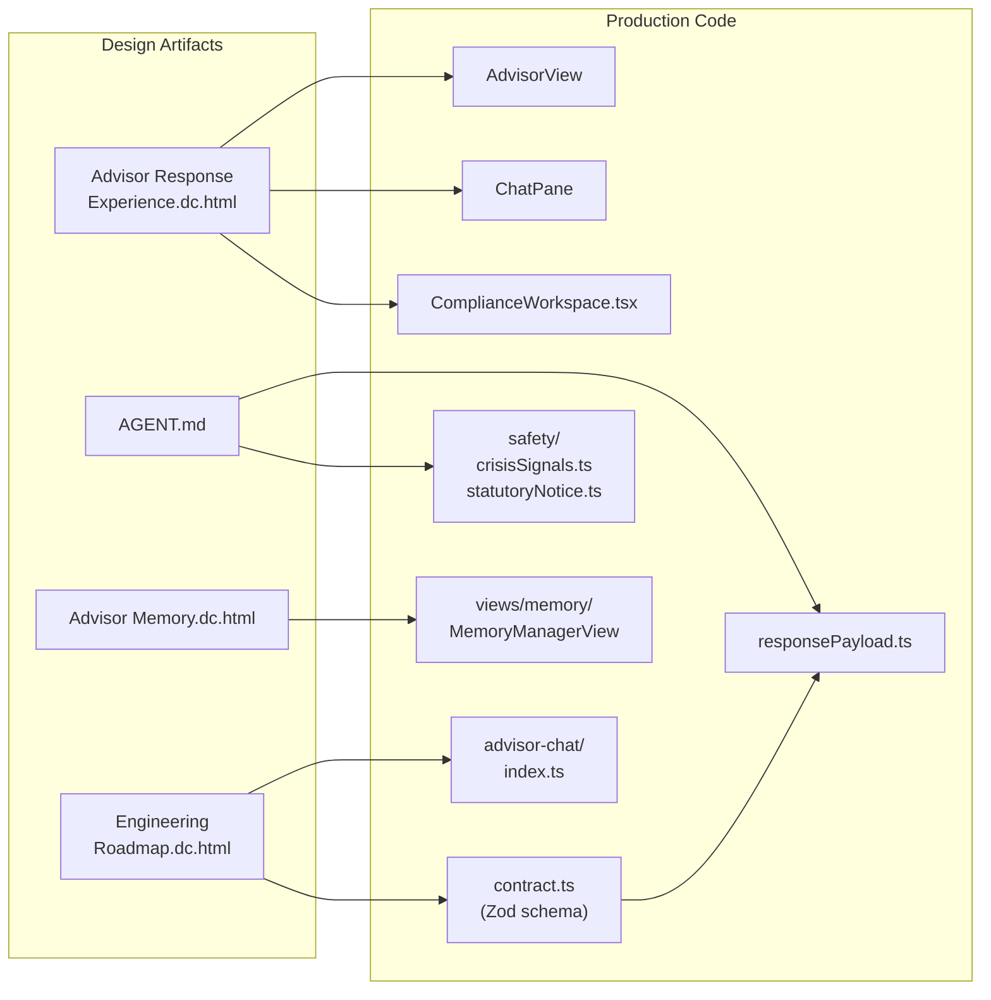
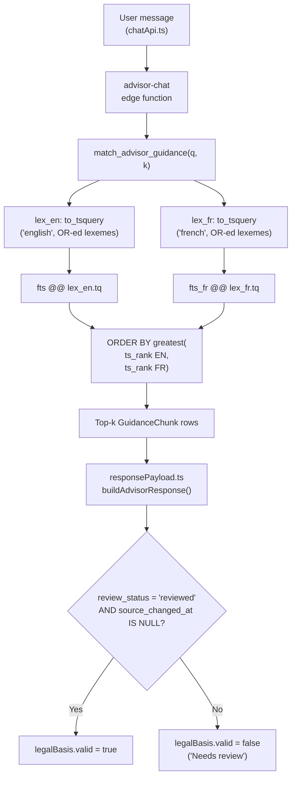
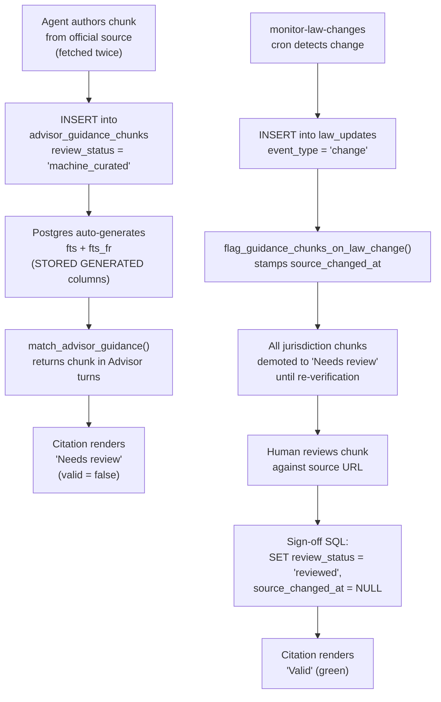
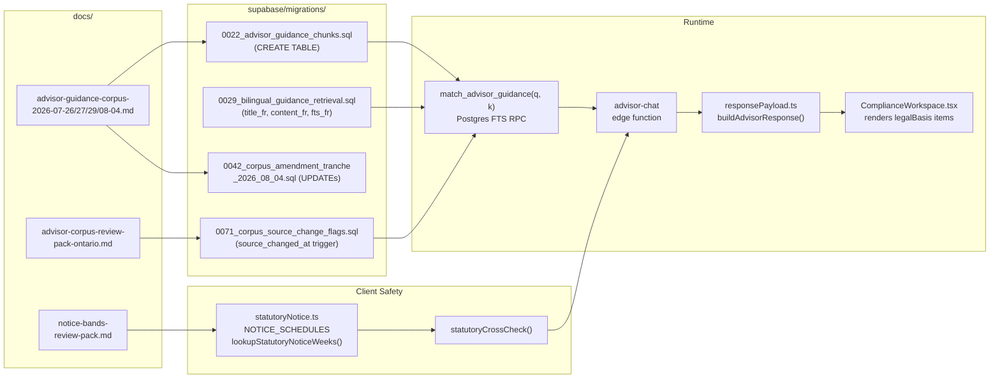

# Design Handoffs & Advisor Corpus

<details>
<summary>Relevant source files</summary>

The following files were used as context for generating this wiki page:

- [docs/DATA_MODEL.md](docs/DATA_MODEL.md)
- [docs/advisor-guidance-corpus-2026-08-04.md](docs/advisor-guidance-corpus-2026-08-04.md)
- [docs/design-handoff-advisor-chat/AGENT.md](docs/design-handoff-advisor-chat/AGENT.md)
- [docs/design-handoff-advisor-chat/README.md](docs/design-handoff-advisor-chat/README.md)
- [docs/design-handoff-advisor-chat/prototypes/Advisor Memory.dc.html](docs/design-handoff-advisor-chat/prototypes/Advisor Memory.dc.html)
- [docs/design-handoff-advisor-chat/prototypes/Advisor Response Experience.dc.html](docs/design-handoff-advisor-chat/prototypes/Advisor Response Experience.dc.html)
- [docs/design-handoff-advisor-chat/prototypes/Engineering Roadmap.dc.html](docs/design-handoff-advisor-chat/prototypes/Engineering Roadmap.dc.html)
- [docs/design-handoff-advisor-chat/prototypes/support.js](docs/design-handoff-advisor-chat/prototypes/support.js)
- [docs/design-handoff-advisor-chat/screenshots/01-response-home.png](docs/design-handoff-advisor-chat/screenshots/01-response-home.png)
- [docs/design-handoff-advisor-chat/screenshots/02-response-termination.png](docs/design-handoff-advisor-chat/screenshots/02-response-termination.png)
- [docs/design-handoff-advisor-chat/screenshots/03-response-escalation.png](docs/design-handoff-advisor-chat/screenshots/03-response-escalation.png)
- [docs/design-handoff-advisor-chat/screenshots/04-response-support.png](docs/design-handoff-advisor-chat/screenshots/04-response-support.png)
- [docs/design-handoff-advisor-chat/screenshots/05-response-jurisdiction.png](docs/design-handoff-advisor-chat/screenshots/05-response-jurisdiction.png)
- [docs/design-handoff-hr-documents-library/README.md](docs/design-handoff-hr-documents-library/README.md)
- [docs/design-handoff-hr-documents-library/design/HR Documents Library.dc.html](docs/design-handoff-hr-documents-library/design/HR Documents Library.dc.html)
- [docs/design-handoff-hr-documents-library/design/assets/dutiva-leaf.png](docs/design-handoff-hr-documents-library/design/assets/dutiva-leaf.png)
- [docs/design-handoff-hr-documents-library/design/assets/icon-app.svg](docs/design-handoff-hr-documents-library/design/assets/icon-app.svg)
- [docs/design-handoff-hr-documents-library/design/dutiva-data.js](docs/design-handoff-hr-documents-library/design/dutiva-data.js)
- [docs/design-handoff-hr-documents-library/screenshots/01-studio.png](docs/design-handoff-hr-documents-library/screenshots/01-studio.png)
- [docs/design-handoff-hr-documents-library/screenshots/02-template-detail.png](docs/design-handoff-hr-documents-library/screenshots/02-template-detail.png)
- [docs/design-handoff-hr-documents-library/screenshots/03-generate-wizard.png](docs/design-handoff-hr-documents-library/screenshots/03-generate-wizard.png)
- [docs/design-handoff-hr-documents-library/screenshots/04-repository.png](docs/design-handoff-hr-documents-library/screenshots/04-repository.png)
- [docs/design-handoff-hr-documents-library/screenshots/05-document-detail.png](docs/design-handoff-hr-documents-library/screenshots/05-document-detail.png)
- [src/i18n/ForcedLangProvider.tsx](src/i18n/ForcedLangProvider.tsx)
- [src/i18n/LangProvider.tsx](src/i18n/LangProvider.tsx)
- [src/i18n/lang.ts](src/i18n/lang.ts)
- [src/i18n/messages/shared.ts](src/i18n/messages/shared.ts)
- [src/i18n/messages/workspace.ts](src/i18n/messages/workspace.ts)
- [supabase/migrations/0042_corpus_amendment_tranche_2026_08_04.sql](supabase/migrations/0042_corpus_amendment_tranche_2026_08_04.sql)

</details>

This page documents the three design handoff packages that bridge prototype-stage design work into the production codebase, and the advisor guidance corpus — the curated set of statutory fact-chunks that ground the AI Advisor's legal citations. It covers the handoff folder structure, how each package maps to implemented code, the corpus data model and retrieval pipeline, the multi-tranche corpus lifecycle, the review-pack workflow, and the sign-off SQL templates that promote chunks from `machine_curated` to `reviewed`.

## Design Handoff Packages — Overview

Three design handoff folders live under `docs/`:

| Handoff folder                         | Feature scope                              | Prototype files                             | Screenshots       | Status                  |
| -------------------------------------- | ------------------------------------------ | ------------------------------------------- | ----------------- | ----------------------- |
| `design-handoff-advisor-chat/`         | Advisor chat, Compliance Workspace, Memory | 3 DC prototypes + `support.js` + `AGENT.md` | 11 annotated PNGs | Built (2026-08-07)      |
| `design-handoff-hr-documents-library/` | Document Studio, Repository, Signing       | 1 DC prototype + `dutiva-data.js` + assets  | 6 annotated PNGs  | Built                   |
| `design-handoff-analytics/`            | Analytics dashboard (Reports rebuild)      | 1 static HTML mockup                        | —                 | Built (Phase 1 PR #170) |

Sources: [docs/design-handoff-advisor-chat/README.md:1-8](), [docs/design-handoff-hr-documents-library/README.md:1-13](), [docs/design-handoff-analytics/README.md:1-35]()

### Handoff Folder Structure

```
docs/
├── design-handoff-advisor-chat/
│   ├── README.md                    # Master handoff doc
│   ├── AGENT.md                     # Normative Advisor communication contract
│   ├── prototypes/
│   │   ├── Advisor Response Experience.dc.html
│   │   ├── Advisor Memory.dc.html
│   │   ├── Engineering Roadmap.dc.html
│   │   └── support.js               # DC runtime (not production code)
│   └── screenshots/
│       ├── 01-response-home.png … 09-memory-manager.png
│       ├── 10-engineering-roadmap.png
│       └── 11-roadmap-principles.png
├── design-handoff-hr-documents-library/
│   ├── README.md
│   ├── design/
│   │   ├── HR Documents Library.dc.html
│   │   ├── dutiva-data.js            # Seed data, 1:1 with Supabase schema
│   │   └── assets/
│   └── screenshots/
│       ├── 01-studio.png … 06-data-model.png
├── design-handoff-analytics/
│   ├── README.md
│   └── dutiva-reports-mockup.html    # 393px mobile mockup
```

Sources: [docs/design-handoff-advisor-chat/README.md:6-7](), [docs/design-handoff-hr-documents-library/README.md:14-26](), [docs/design-handoff-analytics/README.md:1-3]()

## Advisor Chat Handoff

### Prototype-to-Code Map

The advisor chat handoff is the largest package. It contains three HTML prototypes (design references, not production code), a normative behavior spec (`AGENT.md`), and an engineering roadmap. All prototypes use a proprietary DC runtime (`support.js`) for simulation — none of this code ships.

**Handoff-to-implementation mapping from the README:**

| Handoff piece                                  | Production implementation                                                                  |
| ---------------------------------------------- | ------------------------------------------------------------------------------------------ |
| Chat, thread list, home (`/app/advisor`)       | `src/features/app/views/advisor/` — `AdvisorView`, `ChatPane`, `ThreadList`, `AdvisorHome` |
| Compliance Workspace                           | `src/features/app/views/advisor/ComplianceWorkspace.tsx`                                   |
| Chat primitives (bubbles, composer, streaming) | `src/features/app/advisor/` — `ChatBubble`, `ChatComposer`, `StreamedText`, `TypingDots`   |
| Response contract (Roadmap P0)                 | `src/features/app/advisor/contract.ts` (Zod schema)                                        |
| Engine                                         | `supabase/functions/advisor-chat/index.ts`                                                 |
| `AGENT.md` safety rules                        | `src/features/app/advisor/safety/`                                                         |
| Advisor Memory                                 | `src/features/app/views/memory/`                                                           |
| Demo scenarios                                 | `src/features/app/views/advisor/advisorScenarios.ts`                                       |
| Bilingual strings                              | `src/i18n/messages/advisorView.ts`                                                         |

Sources: [docs/design-handoff-advisor-chat/README.md:22-32]()

### AGENT.md — The Normative Behavior Spec

`AGENT.md` is not documentation to skim — it is the normative specification for how the Advisor communicates. Its `MUST` constraints are hard requirements that the system prompt and routing layer enforce. Key sections:

- **§1 Identity** — third-person reference as "Dutiva" or "the Advisor"; never "I am an AI"
- **§2 Response modes** — five modes: HR compliance, high-risk escalation, supportive triage, jurisdiction-unknown, current-info
- **§3 Jurisdiction discipline** — province defaults to `null`; Advisor must never assume Ontario
- **§7 Disclaimer contract** — "not legal advice" visible on every compliance turn
- **§8 Supportive/wellbeing mode** — all structured surfaces gated off; crisis resource 9-8-8 verbatim

Sources: [docs/design-handoff-advisor-chat/AGENT.md:1-9](), [docs/design-handoff-advisor-chat/AGENT.md:42-55](), [docs/design-handoff-advisor-chat/AGENT.md:86-95]()

### Engineering Roadmap

The `Engineering Roadmap.dc.html` prototype is a rendered document describing the phased delivery plan. It defines two services: the consuming app (React 19 + Vite + Tailwind v4) and the engine (originally `dutiva-advisor-engine`, now `supabase/functions/advisor-chat`). Five non-negotiable principles anchor it: obey the gates, jurisdiction never assumed, disclaimer always ships, bilingual EN/FR parity, and crisis intercepts everything.

Sources: [docs/design-handoff-advisor-chat/prototypes/Engineering Roadmap.dc.html:32-65]()

### Design Token Binding

The handoff explicitly states: bind to `.surface-app` design system tokens, never hardcode hex values from prototypes. The mapping is: prototype `#1f3a5f` → `var(--navy)`, `#a23b3b`/`#f8e9e7` → `--risk-*` tier, etc.

Sources: [docs/design-handoff-advisor-chat/README.md:35-43]()

**Advisor Chat Handoff: Design-to-Code Bridge**



Sources: [docs/design-handoff-advisor-chat/README.md:22-32](), [supabase/functions/advisor-chat/responsePayload.ts:1-21]()

## HR Documents Library Handoff

The `design-handoff-hr-documents-library/` package covers the Document Studio (16 templates), generation wizard, repository, document detail (5 tabs), and the data model. The single prototype `HR Documents Library.dc.html` is high-fidelity for visuals but fully simulated for backend behavior.

### Key Design Decisions

- **`dutiva-data.js`** is structured 1:1 against the intended Supabase schema — unlike the HTML prototype, it is genuinely useful as seed data and a spec
- **Roles & permissions matrix**: Owner/HR/Manager/Viewer/External signer with 12 capabilities; the heart of RLS
- **Template content shape**: `questions[]` for the wizard, `preview[]` for conditional clause rendering, `body_content` for full legal formatting, all with `{{token}}` merge fields
- **Six screens**: Document Studio, Template Detail, Generation Wizard (3 steps), Repository, Document Detail, Data Model (dev-only)

Sources: [docs/design-handoff-hr-documents-library/README.md:54-120](), [docs/design-handoff-hr-documents-library/README.md:209-282]()

### Handoff-to-Schema Mapping

The data model from this handoff was implemented as Supabase tables (documented separately in `docs/DATA_MODEL.md`):

| Handoff entity                 | Domain              | Key fields                                                              |
| ------------------------------ | ------------------- | ----------------------------------------------------------------------- |
| `organizations`                | Identity & access   | `id`, `name`, `employee_count`, `size_tier`, `unionized`, `sector`      |
| `document_templates`           | Template library    | `template_key`, `name_en/fr`, `jurisdictions_supported[]`, `risk_level` |
| `document_template_versions`   | Template library    | `version_number`, `body_content`, `schema_json`, `question_flow_json`   |
| `document_generation_sessions` | Generated documents | `answers_json`, `language`, `jurisdiction`                              |
| `documents`                    | Generated documents | `status`, `risk_level`, `review_status`, `signature_status`             |
| `document_audit_events`        | Signatures & audit  | `event_type`, `event_metadata` — append-only                            |

Sources: [docs/design-handoff-hr-documents-library/README.md:209-228](), [docs/DATA_MODEL.md:17-138]()

## Analytics Handoff

The smallest handoff. `dutiva-reports-mockup.html` is a static 393px mobile frame showing Phase 1 cards: compliance score hero, windowed trend, driver meters, needs attention, headcount by jurisdiction, open cases, and policy acknowledgments.

Deliberate divergences from the mockup:

- Colours use app tokens (`--chart-mark`, `--navy`, chip tone classes), not inline hex
- Chips use shared `statusChipClass` vocabulary
- Demo diorama's fixed "today" is July 5, 2026 (from calendar fixtures), so card numbers differ

Sources: [docs/design-handoff-analytics/README.md:1-35]()

## Advisor Guidance Corpus

The corpus is the curated set of statutory fact-chunks stored in `advisor_guidance_chunks` that ground the AI Advisor's legal citations. Each row is one reviewable fact-chunk with its official source URL and retrieval date. The model is instructed to treat these as the **only** authoritative basis for statutory figures — no figure originates from the model's parametric memory.

### Database Table: `advisor_guidance_chunks`

Created in migration `0022`:

| Column                   | Type                   | Purpose                                             |
| ------------------------ | ---------------------- | --------------------------------------------------- |
| `id`                     | `uuid` (PK)            | Row identity                                        |
| `jurisdiction`           | `text`                 | `'ON'`, `'QC'`, `'FED'`, `'ALL'` — CHECK constraint |
| `topic`                  | `text`                 | e.g. `minimum_wage`, `termination_notice`, `leaves` |
| `title` / `title_fr`     | `text`                 | EN/FR chunk title (FR added in 0029)                |
| `content` / `content_fr` | `text`                 | EN/FR chunk body (FR added in 0029)                 |
| `source_url`             | `text`                 | Official government source URL                      |
| `source_name`            | `text`                 | Human-readable source name                          |
| `effective_note`         | `text`                 | In-force dates, verification notes                  |
| `retrieved_at`           | `date`                 | Date the figure was fetched                         |
| `status`                 | `text`                 | `'active'` or `'retired'`                           |
| `review_status`          | `text`                 | `'machine_curated'` or `'reviewed'`                 |
| `fts`                    | `tsvector` (GENERATED) | English FTS index over `title \|\| content`         |
| `fts_fr`                 | `tsvector` (GENERATED) | French FTS index over `title_fr \|\| content_fr`    |
| `source_changed_at`      | `timestamptz`          | Stamped by law monitor trigger (0071)               |
| `source_change_note`     | `text`                 | Name of law that changed                            |

RLS is enabled with no policies — only the service role (used by `advisor-chat`) can read/write.

Sources: [supabase/migrations/0022_advisor_guidance_chunks.sql:1-58](), [supabase/migrations/0029_bilingual_guidance_retrieval.sql:53-69](), [supabase/migrations/0071_corpus_source_change_flags.sql:34-36]()

### Retrieval via `match_advisor_guidance`

The `match_advisor_guidance(q text, k integer)` RPC is the single retrieval entry point. It uses **pure Postgres full-text search** — there are no vector embeddings.

The function's evolution through three migrations:

| Migration | Change                                                                                                                    |
| --------- | ------------------------------------------------------------------------------------------------------------------------- |
| `0023`    | Initial: English-only FTS, OR-ed lexemes, `ts_rank` ordering                                                              |
| `0024`    | Added `topic` and `review_status` to return columns                                                                       |
| `0029`    | Bilingual merged-rank: builds both `english` and `french` tsquery, matches against `fts OR fts_fr`, ranks by `greatest()` |
| `0071`    | Added `source_changed_at` to return columns                                                                               |

Key implementation details:

- Each lexeme is single-quoted with `''` escaping before re-parsing — prevents tsquery syntax errors from URLs/hosts
- Results limited to `greatest(1, least(k, 8))` — between 1 and 8 chunks
- Access revoked from `public`, `anon`, `authenticated` — service-role only

Sources: [supabase/migrations/0023_match_advisor_guidance.sql:1-43](), [supabase/migrations/0029_bilingual_guidance_retrieval.sql:77-127](), [supabase/migrations/0071_corpus_source_change_flags.sql:94-150]()

**Corpus Retrieval Pipeline**



Sources: [supabase/functions/advisor-chat/responsePayload.ts:1-21](), [supabase/functions/advisor-chat/responsePayload.ts:14-16](), [supabase/migrations/0071_corpus_source_change_flags.sql:14-17]()

### Review Status & Validity

The `review_status` field drives citation rendering in the Compliance Workspace:

- `machine_curated` → citation shows "Needs review" (not claiming vetted authority)
- `reviewed` → citation shows "Valid" (green) — **only a human can set this**

Migration `0071` adds the law-monitor coupling: when `law_updates` records a `'change'` event, the trigger `flag_guidance_chunks_on_law_change()` stamps `source_changed_at` on every active chunk in that jurisdiction. The validity formula in `responsePayload.ts` is:

> `valid = (review_status === 'reviewed') AND (source_changed_at IS NULL)`

This means a detected law change **re-demotes** every citation in that jurisdiction to "Needs review" until a human re-verifies.

Sources: [supabase/migrations/0071_corpus_source_change_flags.sql:44-84](), [supabase/functions/advisor-chat/responsePayload.ts:37-39]()

### Statutory Notice Schedule

`NOTICE_SCHEDULES` in `src/features/app/advisor/safety/statutoryNotice.ts` is a parallel grounding mechanism for notice-of-termination figures. It uses typed `NoticeBand[]` arrays rather than free-text corpus chunks.

| Jurisdiction | Status                                                                      | Source                                                       |
| ------------ | --------------------------------------------------------------------------- | ------------------------------------------------------------ |
| Ontario      | Populated — ESA s. 57, bands from 0 months (0 weeks) to 96 months (8 weeks) | [src/features/app/advisor/safety/statutoryNotice.ts:52-62]() |
| Québec       | `bands: null` — pending legal review                                        | [src/features/app/advisor/safety/statutoryNotice.ts:83]()    |
| Federal      | `bands: null` — pending legal review                                        | [src/features/app/advisor/safety/statutoryNotice.ts:95]()    |

The `lookupStatutoryNoticeWeeks(jurisdiction, completedMonths)` function returns `null` when a schedule is unpopulated — triggering the Advisor to hedge rather than state a figure.

Sources: [src/features/app/advisor/safety/statutoryNotice.ts:35-121]()

## Corpus Documentation Tranches

The corpus content is documented in dated snapshot files. Each is a point-in-time record — figures are **never retroactively edited** (with narrow exceptions for citation URLs, which are pointers not figures).

### Tranche Timeline

| File                                        | Date       | Scope                                                                                                  | Jurisdictions | Chunk count |
| ------------------------------------------- | ---------- | ------------------------------------------------------------------------------------------------------ | ------------- | ----------- |
| `advisor-guidance-corpus-2026-07-26.md`     | 2026-07-26 | Initial seed: termination notice, severance, vacation, overtime, minimum wage                          | ON, QC, FED   | ~14         |
| `advisor-guidance-corpus-2026-07-27.md`     | 2026-07-27 | Expansion: leaves, public holidays, hours of work, accommodation basics                                | ON, QC, FED   | ~14         |
| `advisor-guidance-corpus-2026-07-29.md`     | 2026-07-29 | Expansion: pay/deductions, records retention, layoffs/recall, constructive dismissal, workplace injury | ON, QC, FED   | ~14         |
| `advisor-corpus-verification-2026-08-02.md` | 2026-08-02 | **Blocked** verification cycle — no chunks changed; egress proxy refused all official hosts            | —             | 0           |
| `advisor-guidance-corpus-2026-08-04.md`     | 2026-08-04 | Amendment tranche closing WI1/WI2/WI3 from the blocked cycle                                           | ON, QC, FED   | 3 updated   |

Sources: [docs/advisor-guidance-corpus-2026-07-26.md:1-6](), [docs/advisor-guidance-corpus-2026-07-27.md:1-6](), [docs/advisor-guidance-corpus-2026-07-29.md:1-9](), [docs/advisor-corpus-verification-2026-08-02.md:1-11](), [docs/advisor-guidance-corpus-2026-08-04.md:1-18]()

### Corpus Authoring Standard

Every figure must be:

1. **Fetched from a live official government page** (ontario.ca, cnesst.gouv.qc.ca, canada.ca, etc.)
2. **Fetched twice** — once for authoring, once by an independent agent instructed to refute
3. **Bilingual** — French body authored from the live French official page, never machine-translated
4. Rows enter as `review_status = 'machine_curated'`; only a human promotes to `'reviewed'`
5. `fts`/`fts_fr` columns are GENERATED — never hand-written

Sources: [docs/advisor-corpus-verification-2026-08-02.md:100-113](), [docs/advisor-guidance-corpus-2026-08-04.md:13-14]()

### Amendment Tranche (2026-08-04) — Migration 0042

The amendment tranche (`0042_corpus_amendment_tranche_2026_08_04.sql`) closed three work items from the blocked 08-02 cycle:

| Work item                      | Issue                                                                          | Resolution                                                                                   |
| ------------------------------ | ------------------------------------------------------------------------------ | -------------------------------------------------------------------------------------------- |
| **WI3** — ON minimum wage      | Special-category rates only carried period ending 2026-09-30; went stale Oct 1 | Updated with both periods (student $16.90, homeworker $19.70, guides $89.75/$179.50)         |
| **WI1** — FED statutory leaves | Pregnancy Loss Leave (CLC s. 206.51) omitted from chunk                        | Added to `content` and `content_fr`; "Leave for Placement of a Child" confirmed non-existent |
| **WI2** — CNESST URLs          | Competing long/short URL forms                                                 | Canonical SHORT form confirmed via live 301 trace; 2 URLs corrected in 07-26 snapshot        |

The migration uses `UPDATE … WHERE jurisdiction = 'X' AND topic = 'Y'` to amend specific chunks. It explicitly does **not** touch `review_status` — rows remain `machine_curated`.

Sources: [supabase/migrations/0042_corpus_amendment_tranche_2026_08_04.sql:1-39](), [supabase/migrations/0042_corpus_amendment_tranche_2026_08_04.sql:41-65](), [supabase/migrations/0042_corpus_amendment_tranche_2026_08_04.sql:67-82]()

**Corpus Lifecycle & Law-Monitor Coupling**



Sources: [supabase/migrations/0022_advisor_guidance_chunks.sql:1-58](), [supabase/migrations/0071_corpus_source_change_flags.sql:44-89](), [docs/advisor-corpus-review-pack-ontario.md:18-33]()

## Corpus Review Packs

Review packs are structured documents that prepare human reviewers to exercise the `machine_curated` → `reviewed` gate. Two exist:

### Ontario Review Pack (`advisor-corpus-review-pack-ontario.md`)

Covers 14 Ontario chunks — the jurisdiction with the most complete tooling (encoded ESA s. 57 notice schedule, working law-page monitoring via `act-versions` API).

**Review procedure per chunk:**

1. Open the source URL, confirm the page still says what the chunk says
2. Check the chunk's framing doesn't overclaim
3. Run the sign-off SQL for that topic

**Sign-off SQL template:**

```sql
-- Per-chunk sign-off (replace <topic>):
UPDATE public.advisor_guidance_chunks
   SET review_status = 'reviewed',
       source_changed_at = NULL,
       source_change_note = NULL
 WHERE jurisdiction = 'ON'
   AND topic = '<topic>'
   AND status = 'active';
```

**Verification query:**

```sql
SELECT topic, review_status
  FROM public.advisor_guidance_chunks
 WHERE jurisdiction = 'ON'
 ORDER BY topic;
```

**Priority order:** Start with `minimum_wage` (expires by design on Oct 1, 2026), then `termination_notice` / `layoffs_recall` (the termination page backs three chunks and the encoded notice schedule in `statutoryNotice.ts`), then the rest in any order.

**What review unlocks:** A `reviewed` chunk's citation renders **Valid** (green) instead of "Needs review", and the "machine-curated and pending human review" warning stops appearing on turns grounded solely in reviewed chunks.

Sources: [docs/advisor-corpus-review-pack-ontario.md:1-80]()

### Notice Bands Review Pack (`notice-bands-review-pack.md`)

This pack addresses whether to populate `NOTICE_SCHEDULES` for Québec and Federal jurisdictions in `statutoryNotice.ts`. It does **not** change any code — it prepares the decision.

**Québec (LNT s. 82):** The pack quotes s. 82 and s. 82.1 verbatim in both languages and proposes:

```ts
const QUEBEC_BANDS: NoticeBand[] = [
  { minMonths: 3, weeks: 1 }, // 3 months to < 1 year
  { minMonths: 12, weeks: 2 }, // 1 year to < 5 years
  { minMonths: 60, weeks: 4 }, // 5 years to < 10 years
  { minMonths: 120, weeks: 8 }, // 10 years or more
]
```

**Critical finding — §1.6:** Civil Code art. 2091 reasonable notice sits on top of s. 82 and is non-renounceable (art. 2092). A technically correct QC table can still be **misleading** because it is only a floor, not the entitlement.

**Federal (CLC s. 230):** The pack quotes s. 230(1.1) verbatim and proposes:

```ts
const FEDERAL_BANDS: NoticeBand[] = [
  { minMonths: 3, weeks: 2 }, // at least 3 consecutive months
  { minMonths: 36, weeks: 3 }, // at least 3 consecutive years
  { minMonths: 48, weeks: 4 },
  { minMonths: 60, weeks: 5 },
  { minMonths: 72, weeks: 6 },
  { minMonths: 84, weeks: 7 },
  { minMonths: 96, weeks: 8 }, // 8+ years (statutory maximum)
]
```

**Critical finding — §2.3c:** 2018, c. 27, ss. 479–484 are enacted but **not yet in force**. When proclaimed, group termination would **displace** the individual band table rather than add to it — a silent change requiring a monitoring commitment.

**Sign-off block** at the end requires: Reviewer name, qualification, date, and explicit Yes/No per jurisdiction.

Sources: [docs/notice-bands-review-pack.md:1-28](), [docs/notice-bands-review-pack.md:143-178](), [docs/notice-bands-review-pack.md:337-354](), [docs/notice-bands-review-pack.md:525-565]()

## End-to-End Corpus Data Flow

**From Design Handoff Through Retrieval to User-Facing Citation**



Sources: [supabase/migrations/0022_advisor_guidance_chunks.sql:1-58](), [supabase/functions/advisor-chat/responsePayload.ts:1-61](), [src/features/app/advisor/safety/statutoryNotice.ts:1-121](), [docs/advisor-corpus-review-pack-ontario.md:1-80]()

## Migration History for `advisor_guidance_chunks`

| Migration | Purpose                                                                                                                                                                                      |
| --------- | -------------------------------------------------------------------------------------------------------------------------------------------------------------------------------------------- |
| `0022`    | Create table with English FTS, RLS enabled (no policies = service-role only), `updated_at` trigger                                                                                           |
| `0023`    | Create `match_advisor_guidance(q, k)` — OR-ed English lexemes, `ts_rank` ordering                                                                                                            |
| `0024`    | Add `topic` and `review_status` to `match_advisor_guidance` return columns                                                                                                                   |
| `0029`    | Add `title_fr`, `content_fr`, `fts_fr` (French generated tsvector); rewrite `match_advisor_guidance` for bilingual merged-rank retrieval                                                     |
| `0032`    | French corpus backfill for remaining 40 rows                                                                                                                                                 |
| `0042`    | Amendment tranche: update ON minimum_wage, FED leaves, FED minimum_wage rows                                                                                                                 |
| `0058`    | Quote lexemes in `match_advisor_guidance` to prevent tsquery syntax errors from URLs                                                                                                         |
| `0059`    | Recovered `touch_advisor_guidance_updated_at` trigger (applied directly to live, committed retroactively)                                                                                    |
| `0071`    | Add `source_changed_at`/`source_change_note` columns; create `flag_guidance_chunks_on_law_change()` trigger on `law_updates`; rewrite `match_advisor_guidance` to return `source_changed_at` |

Sources: [supabase/migrations/0022_advisor_guidance_chunks.sql:1-58](), [supabase/migrations/0023_match_advisor_guidance.sql:1-43](), [supabase/migrations/0024_match_advisor_guidance_review_topic.sql:1-42](), [supabase/migrations/0029_bilingual_guidance_retrieval.sql:1-143](), [supabase/migrations/0042_corpus_amendment_tranche_2026_08_04.sql:1-39](), [supabase/migrations/0059_advisor_guidance_chunks_touch_updated_at.sql:1-29](), [supabase/migrations/0071_corpus_source_change_flags.sql:1-150]()

## Summary of Key Invariants

| Invariant                                                              | Enforcement                                                             |
| ---------------------------------------------------------------------- | ----------------------------------------------------------------------- |
| Only a human flips `review_status` to `'reviewed'`                     | Convention, documented in every corpus file and migration               |
| `fts`/`fts_fr` are never hand-written                                  | GENERATED ALWAYS AS columns; Postgres recomputes on every INSERT/UPDATE |
| French body authored from live French source, never machine-translated | Authoring standard documented in 0029 and 08-02 verification            |
| Figures fetched twice (author + independent verify)                    | Corpus standard; 08-04 tranche explicitly records both fetch dates      |
| A detected law change demotes all jurisdiction citations               | `flag_guidance_chunks_on_law_change()` trigger (0071)                   |
| Unknown/unpopulated schedule yields `null`, never a guessed figure     | `lookupStatutoryNoticeWeeks()` fail-safe return                         |
| Point-in-time snapshot figures are never retroactively edited          | Convention; exceptions (URL corrections) are documented inline          |

Sources: [supabase/migrations/0022_advisor_guidance_chunks.sql:8-11](), [docs/advisor-corpus-verification-2026-08-02.md:74-79](), [docs/advisor-guidance-corpus-2026-08-04.md:13-14](), [src/features/app/advisor/safety/statutoryNotice.ts:108-121](), [docs/advisor-guidance-corpus-2026-07-26.md:100-103]()

---
