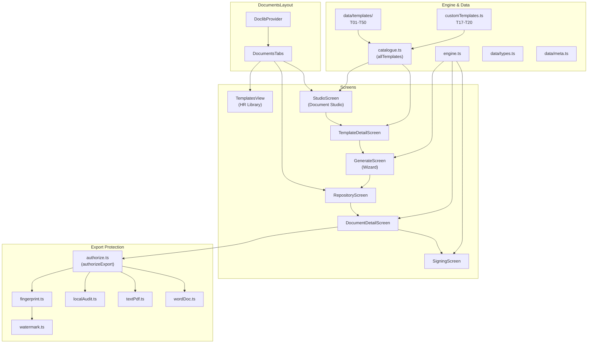
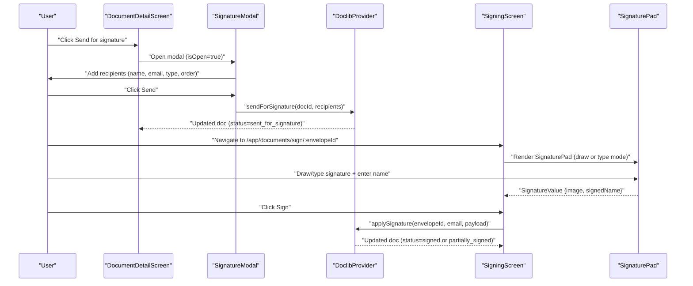
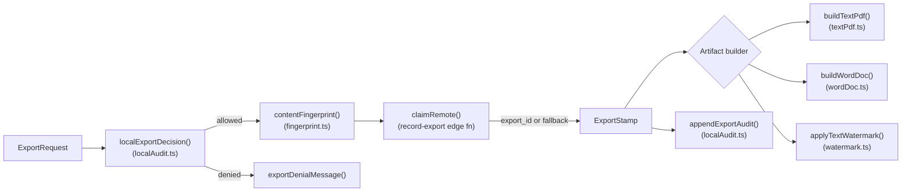
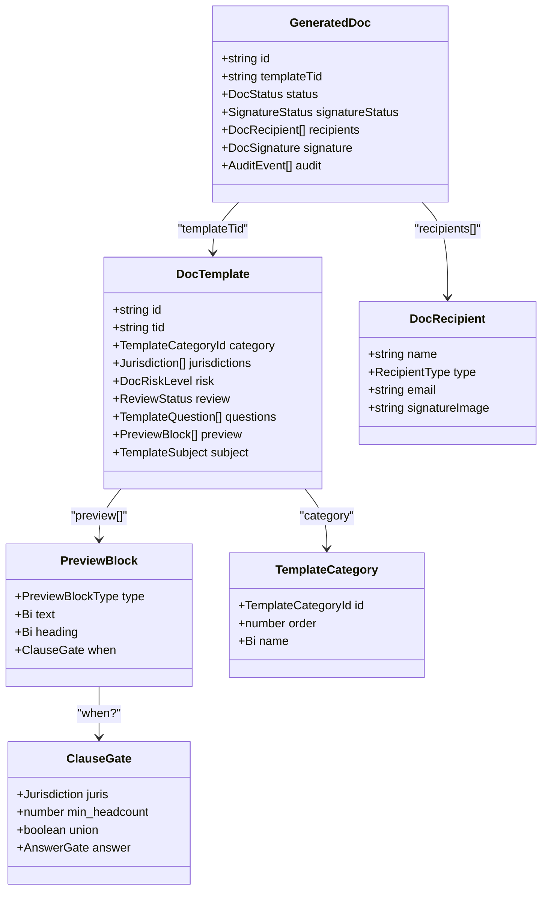

# Document Management System

Relevant source files

The following files were used as context for generating this wiki page:

- [docs/FOUR_RING_FRAMEWORK.md](docs/FOUR_RING_FRAMEWORK.md)
- [src/app/appViews.tsx](src/app/appViews.tsx)
- [src/features/app/documents/DoclibProvider.test.tsx](src/features/app/documents/DoclibProvider.test.tsx)
- [src/features/app/documents/DoclibProvider.tsx](src/features/app/documents/DoclibProvider.tsx)
- [src/features/app/documents/components/SignatureModal.tsx](src/features/app/documents/components/SignatureModal.tsx)
- [src/features/app/documents/components/SignaturePad.tsx](src/features/app/documents/components/SignaturePad.tsx)
- [src/features/app/documents/data/meta.ts](src/features/app/documents/data/meta.ts)
- [src/features/app/documents/data/templates/authoredTemplates.test.ts](src/features/app/documents/data/templates/authoredTemplates.test.ts)
- [src/features/app/documents/data/templates/index.ts](src/features/app/documents/data/templates/index.ts)
- [src/features/app/documents/data/templates/t13-harassment-policy.ts](src/features/app/documents/data/templates/t13-harassment-policy.ts)
- [src/features/app/documents/data/types.ts](src/features/app/documents/data/types.ts)
- [src/features/app/documents/doclibContext.ts](src/features/app/documents/doclibContext.ts)
- [src/features/app/documents/screens/DocumentDetailScreen.tsx](src/features/app/documents/screens/DocumentDetailScreen.tsx)
- [src/features/app/documents/screens/SigningScreen.tsx](src/features/app/documents/screens/SigningScreen.tsx)
- [src/features/marketing/sections/Product.tsx](src/features/marketing/sections/Product.tsx)
- [src/i18n/messages/doclib.ts](src/i18n/messages/doclib.ts)

The Document Management System is Dutiva's subsystem for authoring, generating, signing, and exporting HR documents. It combines a **template catalogue** of 50+ bilingual, jurisdiction-aware templates with a **wizard-driven generation flow**, an **embedded e-signature workflow**, and an **export protection subsystem** that fingerprints and watermarks every artifact leaving the platform. The code lives primarily under `src/features/app/documents/` with export protection in `src/lib/exportProtection/`.

## System Architecture

The document system has three user-facing surfaces — the **HR Library** (read-only template browsing), the **Document Studio** (template detail, applicability engine, org-profile–driven filtering), and the **Document Repository** (generated documents with status tracking, signing, and export) — unified under a shared `DocumentsLayout` that provides the `DoclibProvider` context and a three-tab navigation switcher.

**System architecture — key modules and data flow:**

Sources: [src/features/app/documents/DocumentsLayout.tsx:1-95](), [src/features/app/documents/catalogue.ts:1-25](), [src/lib/exportProtection/index.ts:1-45]()

## Routing & Layout

All document routes are nested under `/app/documents` within a shared `DocumentsLayout`. This layout mounts the `DoclibProvider` (the feature-scoped state provider) and renders three navigation tabs — HR Library, Documents, and Document Studio — followed by a "Viewing as" role selector for the demo permission model.

| Route                                  | Screen                 | Purpose                                                 |
| -------------------------------------- | ---------------------- | ------------------------------------------------------- |
| `/app/documents/hr-library`            | `TemplatesView`        | Public template catalogue (read-only browsing)          |
| `/app/documents/studio`                | `StudioScreen`         | Template library with org-profile applicability engine  |
| `/app/documents/studio/templates/:tid` | `TemplateDetailScreen` | Single template detail + sample preview                 |
| `/app/documents/studio/generate/:tid`  | `GenerateScreen`       | Wizard-driven document generation                       |
| `/app/documents`                       | `RepositoryScreen`     | Generated document register (8-column filterable table) |
| `/app/documents/:docId`                | `DocumentDetailScreen` | Document detail with status chips, 5 tabs, actions      |
| `/app/documents/sign/:envelopeId`      | `SigningScreen`        | E-signature capture for a specific envelope             |

The Document Studio screens are **ungated** — the template catalogue is real product content available in both demo and production modes. Only the fixture repository data is demo-scoped.

Sources: [src/app/appViews.tsx:62-69](), [src/app/appViews.tsx:115-131](), [src/features/app/documents/DocumentsLayout.tsx:57-95]()

## Template Catalogue

The catalogue ships **50 bilingual templates** (T01–T50) organized into **10 categories** that follow the employment lifecycle: hiring, changes, agreements, policies, discipline, accommodation, termination, wellbeing, compensation, and internal communications. Templates come from two provenance sources merged in `catalogue.ts`: the handoff-derived set under `data/templates/` (T01–T16) and in-repo–authored templates (T17–T20 in `customTemplates.ts`, T21–T50 in `data/templates/`). The merged `allTemplates` array is sorted by `tid` for a single display sequence.

Templates span all four rings of the Four Ring Framework: Ring 1 (core HR compliance), Ring 2 (workplace wellness / accommodation), Ring 3 (internal communications, T35–T43), and Ring 4 (compensation, T45–T46).

Each template is typed as `DocTemplate`, carrying bilingual `name`/`desc`, `jurisdictions` (ON/QC/FED), `risk` level, `review` status, `questions` (the wizard inputs), and `preview` blocks (the document body with `{{token}}` merge fields and optional `ClauseGate` conditional rendering).

For details, see [Template Catalogue & Engine](#4.1).

Sources: [src/features/app/documents/catalogue.ts:1-25](), [src/features/app/documents/data/templates/index.ts:1-122](), [src/features/app/documents/data/types.ts:1-210](), [docs/FOUR_RING_FRAMEWORK.md:1-60](), [src/features/app/documents/data/meta.ts:56-210]()

## Template Engine

The template engine in `engine.ts` is a pure-function library handling four concerns:

1. **Conditional clauses** — `resolveBlocks()` filters a template's `preview` blocks through `gatePasses()`, evaluating `ClauseGate` conditions for jurisdiction, headcount, union status, and wizard answers.
2. **Merge fields** — `computedTokens()` provides `org`, `today`, `jurisdiction`, `statute`; `answerLabels()` resolves select-option answers to localized labels; `mergeSegments()` splits block text into filled/unfilled segments for live-preview styling; `splitProseParagraphs()` splits clause/para body text on blank lines (then single newlines when not bullet lists) so `DocPaper` and plain-text export render spaced paragraphs.
3. **Applicability engine** — `applicability()` evaluates a template against an `OrgProfile` (headcount, union, sector) to produce a verdict: required, applies, below threshold, or union-gated.
4. **Role/action gating** — `docActionsFor()` computes which actions (edit, approve, send_for_signature, export, etc.) a given `WorkspaceRole` can perform on a document in its current `DocStatus`.

For details, see [Template Catalogue & Engine](#4.1).

Sources: [src/features/app/documents/engine.ts:1-50](), [src/features/app/documents/engine.ts:51-120](), [src/features/app/documents/engine.ts:157-178]()

### Production repository (mobile)

`RepositoryProductionView` lists persisted documents for the signed-in organization. On `≥768px` it renders the full filterable table; below `md`, the same rows appear as stacked cards via `useMdUp()` so operators can triage without horizontal scroll.

Sources: [src/features/app/documents/screens/RepositoryProductionView.tsx](), [src/lib/useMediaQuery.ts]()

## State Management: DoclibProvider

`DoclibProvider` is the feature-scoped React context provider that wraps all document routes. It loads the demo catalogue via `loadDoclibData()` (bundled fixtures, resolved once per session), manages the "Viewing as" role (persisted to `sessionStorage` under key `dutiva-doclib-role`), and exposes mutable operations for the e-signature flow:

| Context method                               | Purpose                                                                                 |
| -------------------------------------------- | --------------------------------------------------------------------------------------- |
| `sendForSignature(docId, recipients)`        | Creates a signature envelope (`ENV-*` id), sets document status to `sent_for_signature` |
| `applySignature(envelopeId, email, payload)` | Records one recipient's signature, updates aggregate status (partially_signed → signed) |
| `getDocumentForEnvelope(envelopeId)`         | Looks up a document by its envelope id for the signing screen                           |

The context type `DoclibContextValue` is defined in `doclibContext.ts` and consumed via the `useDoclib()` hook. The data layer (`api.ts`) always serves bundled fixtures — the earlier Supabase `doclib_*` views were dropped in migration `0021_drop_doclib_demo_schema.sql`.

For details, see [Document Studio, Signing & Export Protection](#4.2).

Sources: [src/features/app/documents/doclibContext.ts:1-38](), [src/features/app/documents/DoclibProvider.tsx:1-60](), [src/features/app/documents/DoclibProvider.tsx:62-105](), [src/features/app/documents/api.ts:1-52]()

## E-Signature Workflow

The signing flow connects three components in sequence:

`SignaturePad` supports two capture modes — **draw** (freehand canvas, touch-enabled) and **type** (cursive rendering of the signer's name). Both produce a base64 PNG `image` stored in the `DocRecipient.signatureImage` field.

For details, see [Document Studio, Signing & Export Protection](#4.2).

Sources: [src/features/app/documents/components/SignatureModal.tsx:34-76](), [src/features/app/documents/components/SignaturePad.tsx:1-50](), [src/features/app/documents/screens/SigningScreen.tsx:12-98](), [src/features/app/documents/DoclibProvider.tsx:100-155]()

## Export Protection Subsystem

Every document export passes through a multi-layered protection system under `src/lib/exportProtection/`. The `authorizeExport()` orchestrator enforces velocity limits and produces an `ExportStamp` that the artifact builders embed through three redundant fingerprint channels:

| Layer                 | Module                                         | Mechanism                                                                                                     |
| --------------------- | ---------------------------------------------- | ------------------------------------------------------------------------------------------------------------- |
| Invisible fingerprint | `fingerprint.ts`                               | Zero-width characters (ZWNJ/ZWSP) encoding the export UUID between WORD JOINER sentinels; survives copy-paste |
| Visible watermark     | `watermark.ts`                                 | Identity line + confidentiality notice appended to every export                                               |
| Content hash          | `fingerprint.ts`                               | SHA-256 via WebCrypto (FNV-1a fallback), stored in the audit row                                              |
| Local velocity guard  | `localAudit.ts`                                | Sliding-window rate limits: 12/5min burst, 100/day; localStorage ring buffer (`dutiva-export-audit`)          |
| Server guard          | `authorize.ts` → `record-export` edge function | Atomic `claim_export_slot` with server-side ceilings; 429 refusal is final                                    |
| PDF metadata          | `textPdf.ts`                                   | Export id in PDF Info dictionary; dependency-free raw PDF writer (Helvetica + WinAnsi)                        |
| Word metadata         | `wordDoc.ts`                                   | `<meta name="dutiva-export-id">` + HTML comment in Word HTML `.doc` format                                    |

The system is deliberately **fail-open for offline use**: if the server is unreachable, the export proceeds with a locally-minted id and the full watermark — only the server audit row is lost, and this is flagged via `recordedRemotely: false`.

For details, see [Document Studio, Signing & Export Protection](#4.2).

Sources: [src/lib/exportProtection/authorize.ts:1-141](), [src/lib/exportProtection/fingerprint.ts:1-131](), [src/lib/exportProtection/watermark.ts:1-62](), [src/lib/exportProtection/localAudit.ts:1-70](), [src/lib/exportProtection/artifacts/textPdf.ts:1-30](), [src/lib/exportProtection/artifacts/wordDoc.ts:1-65]()

## Domain Type Model

The document system's type model is defined in `data/types.ts`. The key types and their relationships:

Key enumerations:

| Type                 | Values                                                                                                                                              |
| -------------------- | --------------------------------------------------------------------------------------------------------------------------------------------------- |
| `DocStatus`          | `draft`, `in_review`, `needs_revision`, `approved`, `sent_for_signature`, `partially_signed`, `signed`, `exported`, `archived`, `voided`, `deleted` |
| `Jurisdiction`       | `ON`, `QC`, `FED`                                                                                                                                   |
| `DocRiskLevel`       | `low`, `medium`, `high`                                                                                                                             |
| `WorkspaceRole`      | `owner`, `hr`, `manager`, `viewer`, `external`                                                                                                      |
| `TemplateCategoryId` | `hiring`, `changes`, `agreements`, `policies`, `discipline`, `termination`, `accommodation`, `wellbeing`, `compensation`, `communications`          |
| `PreviewBlockType`   | `title`, `meta`, `para`, `clause`, `sig`, `ack`, `note`, `fill`                                                                                     |

Sources: [src/features/app/documents/data/types.ts:1-280](), [src/features/app/documents/data/meta.ts:56-210]()

## Internationalization

The document system's 215+ bilingual message keys live in `doclibMessages` under the `doclib_` prefix, organized by surface: `doclib_studio_*` for Document Studio, `doclib_detail_*` for template detail, `doclib_gen_*` for the generation wizard, `doclib_docd_*` for document detail, `doclib_sign_*` for signing, and `doclib_modal_*` for the signature modal. Export protection has its own message module at `src/i18n/messages/exportProtection.ts`.

Sources: [src/i18n/messages/doclib.ts:1-70](), [src/i18n/messages/exportProtection.ts:1-1]()

## Quality Guards

Authored templates (T21+) are covered by `authoredTemplates.test.ts`, which enforces:

- **Jurisdiction coverage**: every template must support all three jurisdictions (ON, QC, FED) with a note for each
- **Bilingual completeness**: every `Bi` string must have non-empty `en` and `fr`, with no untranslated French
- **Merge field resolution**: every `{{token}}` must map to a wizard question or a computed token
- **Full fill**: once all questions are answered, no unfilled merge fields remain in any jurisdiction
- **Clause numbering**: no duplicate clause numbers within a jurisdiction's resolved blocks
- **Disclaimer consistency**: note blocks use the centralized `DOC_DISCLAIMER_NOTE` from `meta.ts`

Sources: [src/features/app/documents/data/templates/authoredTemplates.test.ts:1-50](), [src/features/app/documents/data/templates/authoredTemplates.test.ts:113-145](), [src/features/app/documents/data/meta.ts:25-48]()

## Child Pages

- **[Template Catalogue & Engine](#4.1)** — Deep dive into the 50+ template data model, the Four Ring Framework organization, `engine.ts` resolution pipeline (`resolveBlocks`, `computedTokens`, `answerLabels`), jurisdiction-conditional clauses, the wizard-driven `GenerateScreen`, `TemplateDetailScreen`, `TemplatesView`, and custom templates.

- **[Document Studio, Signing & Export Protection](#4.2)** — `DoclibProvider`/`DoclibContext` state management, `DocumentDetailScreen` (status chips, role-gated actions, five tabs), the full e-signature workflow (SignatureModal → SigningScreen → SignaturePad → applySignature), the export protection subsystem (`authorizeExport`, fingerprinting, watermarking, local/server velocity guards), and artifact builders (`textPdf.ts`, `wordDoc.ts`).

---
