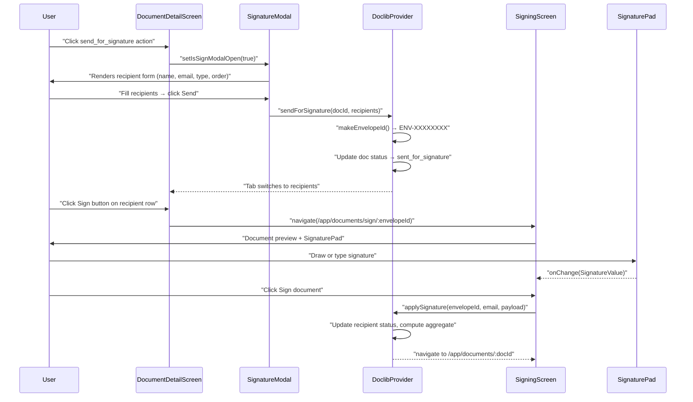
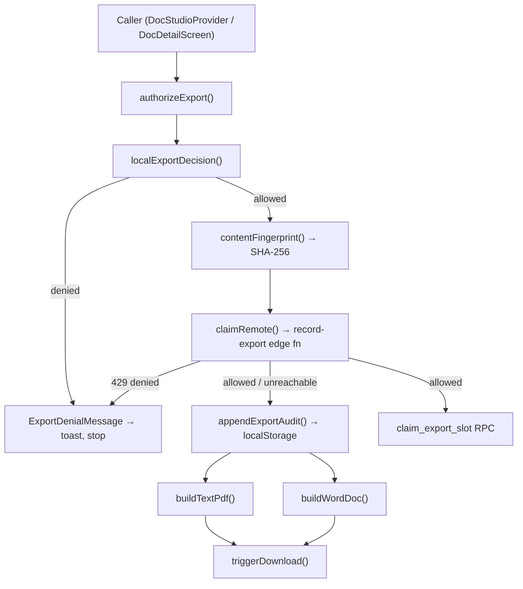
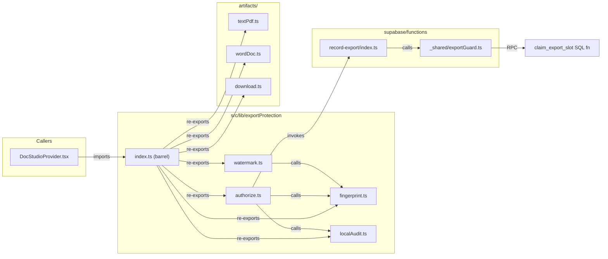

# Document Studio, Signing & Export Protection

<details>
<summary>Relevant source files</summary>

The following files were used as context for generating this wiki page:

- [docs/SECURITY_HEADERS.md](docs/SECURITY_HEADERS.md)
- [package-lock.json](package-lock.json)
- [src/app/App.tsx](src/app/App.tsx)
- [src/app/appViews.tsx](src/app/appViews.tsx)
- [src/data/chats.ts](src/data/chats.ts)
- [src/data/data.test.ts](src/data/data.test.ts)
- [src/data/employees.ts](src/data/employees.ts)
- [src/features/app/billing/PlanGate.test.tsx](src/features/app/billing/PlanGate.test.tsx)
- [src/features/app/docstudio/DocStudioProvider.tsx](src/features/app/docstudio/DocStudioProvider.tsx)
- [src/features/app/docstudio/docstudio.test.tsx](src/features/app/docstudio/docstudio.test.tsx)
- [src/features/app/docstudio/resolveDocTitle.ts](src/features/app/docstudio/resolveDocTitle.ts)
- [src/features/app/documents/DoclibProvider.test.tsx](src/features/app/documents/DoclibProvider.test.tsx)
- [src/features/app/documents/DoclibProvider.tsx](src/features/app/documents/DoclibProvider.tsx)
- [src/features/app/documents/api.test.ts](src/features/app/documents/api.test.ts)
- [src/features/app/documents/api.ts](src/features/app/documents/api.ts)
- [src/features/app/documents/components/SignatureModal.tsx](src/features/app/documents/components/SignatureModal.tsx)
- [src/features/app/documents/components/SignaturePad.tsx](src/features/app/documents/components/SignaturePad.tsx)
- [src/features/app/documents/customTemplates.ts](src/features/app/documents/customTemplates.ts)
- [src/features/app/documents/doclibContext.ts](src/features/app/documents/doclibContext.ts)
- [src/features/app/documents/screens/DocumentDetailScreen.test.tsx](src/features/app/documents/screens/DocumentDetailScreen.test.tsx)
- [src/features/app/documents/screens/DocumentDetailScreen.tsx](src/features/app/documents/screens/DocumentDetailScreen.tsx)
- [src/features/app/documents/screens/SigningScreen.tsx](src/features/app/documents/screens/SigningScreen.tsx)
- [src/features/app/documents/screens/StudioScreen.test.tsx](src/features/app/documents/screens/StudioScreen.test.tsx)
- [src/features/app/rail/useAskAdvisorBriefing.ts](src/features/app/rail/useAskAdvisorBriefing.ts)
- [src/features/app/views/analytics/AnalyticsCard.tsx](src/features/app/views/analytics/AnalyticsCard.tsx)
- [src/features/app/views/analytics/cardVisibility.test.ts](src/features/app/views/analytics/cardVisibility.test.ts)
- [src/features/app/views/analytics/cardVisibility.ts](src/features/app/views/analytics/cardVisibility.ts)
- [src/features/app/views/cases/caseDetailTabs.tsx](src/features/app/views/cases/caseDetailTabs.tsx)
- [src/features/app/views/employees/EmployeeDrawer.test.tsx](src/features/app/views/employees/EmployeeDrawer.test.tsx)
- [src/features/app/views/employees/employeeProfileTabs.tsx](src/features/app/views/employees/employeeProfileTabs.tsx)
- [src/features/marketing/sections/Product.tsx](src/features/marketing/sections/Product.tsx)
- [src/lib/exportProtection/localAudit.test.ts](src/lib/exportProtection/localAudit.test.ts)
- [src/lib/exportProtection/localAudit.ts](src/lib/exportProtection/localAudit.ts)
- [src/lib/supabaseClient.ts](src/lib/supabaseClient.ts)
- [supabase/migrations/0021_drop_doclib_demo_schema.sql](supabase/migrations/0021_drop_doclib_demo_schema.sql)
- [supabase/migrations/0073_close_anon_rls_holes.sql](supabase/migrations/0073_close_anon_rls_holes.sql)
- [vercel.json](vercel.json)

</details>

This page covers three interconnected subsystems of the HR Documents feature: (1) `DoclibProvider` / `DoclibContext` state management for the document repository, (2) the `DocumentDetailScreen` and e-signature workflow, and (3) the export protection pipeline that watermarks, fingerprints, and rate-limits every artifact leaving the platform.

## DoclibProvider & DoclibContext — State Management

The document library's client-side state lives in a dedicated React context, scoped to the `DocumentsLayout` route subtree.

### Context Shape

`DoclibContext` is defined in a standalone module and exposes the `DoclibContextValue` interface:

| Field                    | Type                                                        | Purpose                                                           |
| ------------------------ | ----------------------------------------------------------- | ----------------------------------------------------------------- |
| `data`                   | `DoclibData \| null`                                        | Loaded catalogue; `null` while loading (screens render skeletons) |
| `role`                   | `WorkspaceRole`                                             | Current demo "Viewing as" role                                    |
| `setRole`                | `(role) => void`                                            | Persists to `sessionStorage` under key `dutiva-doclib-role`       |
| `org`                    | `OrgProfile`                                                | Editable org compliance profile driving the applicability engine  |
| `setOrg`                 | `(org) => void`                                             | Updates org profile                                               |
| `sendForSignature`       | `(docId, recipients) => GeneratedDoc \| undefined`          | Creates an envelope and transitions status                        |
| `applySignature`         | `(envelopeId, email, payload) => GeneratedDoc \| undefined` | Records a captured signature                                      |
| `getDocumentForEnvelope` | `(envelopeId) => GeneratedDoc \| undefined`                 | Lookup by signing envelope                                        |

[src/features/app/documents/doclibContext.ts:11-28]()

The `useDoclib()` hook retrieves the context value and throws if used outside the provider.

[src/features/app/documents/doclibContext.ts:32-35]()

### Provider Implementation

`DoclibProvider` loads data via `loadDoclibData()`, which resolves bundled fixtures (the demo schema was dropped in migration `0021`). The loaded data is deep-cloned via `structuredClone` so in-memory mutations (signing, status changes) don't modify the bundled originals.

[src/features/app/documents/DoclibProvider.tsx:55-71]()
[src/features/app/documents/api.ts:42-45]()

The initial role defaults to `'hr'` and is read from `sessionStorage` on mount:

[src/features/app/documents/DoclibProvider.tsx:11-26]()

### DoclibData Shape

`DoclibData` aggregates the full catalogue:

```
templates: DocTemplate[]      — 50+ bilingual templates
categories: TemplateCategory[] — 10 lifecycle categories
documents: GeneratedDoc[]     — sample generated documents
employees: DocEmployee[]      — fixture employees
cases: DocCase[]              — fixture cases
source: 'fixtures'            — always bundled fixtures
```

[src/features/app/documents/api.ts:20-28]()

### Mount Point

`DocumentsLayout` wraps all `/app/documents/*` routes and provides:

1. The `DoclibProvider` context
2. A three-tab navigator (HR Library / Document Library / Document Studio)
3. The "Viewing as" role switcher bar

[src/features/app/documents/DocumentsLayout.tsx:86-102]()

**Document route tree in `appViewRoutes`:**

| Route                                 | Screen                 | Gated? |
| ------------------------------------- | ---------------------- | ------ |
| `/app/documents` (index)              | `RepositoryScreen`     | Yes    |
| `/app/documents/hr-library`           | `TemplatesView`        | Yes    |
| `/app/documents/studio`               | `StudioScreen`         | No     |
| `/app/documents/templates/:tid`       | `TemplateDetailScreen` | No     |
| `/app/documents/generate/:templateId` | `GenerateScreen`       | No     |
| `/app/documents/sign/:envelopeId`     | `SigningScreen`        | Yes    |
| `/app/documents/:docId`               | `DocumentDetailScreen` | Yes    |

[src/app/appViews.tsx:153-165]()

Sources: [src/features/app/documents/doclibContext.ts](), [src/features/app/documents/DoclibProvider.tsx](), [src/features/app/documents/api.ts](), [src/features/app/documents/DocumentsLayout.tsx](), [src/app/appViews.tsx:153-165]()

---

## DocumentDetailScreen

`DocumentDetailScreen` is the main document detail view rendering a header with status chips, role-gated actions, five tabs, and a sticky metadata rail.

### Status Chips

The header renders four status chips plus a jurisdiction pill, each driven by typed info maps:

| Chip             | Source Map            | Type                                         |
| ---------------- | --------------------- | -------------------------------------------- |
| Document status  | `documentStatusInfo`  | `DocStatus` (11 states: `draft` → `deleted`) |
| Review status    | `reviewStatusInfo`    | `ReviewStatus` (4 states)                    |
| Signature status | `signatureStatusInfo` | `SignatureStatus` (9 states)                 |
| Risk level       | `riskLevelInfo`       | `DocRiskLevel` (`low` / `medium` / `high`)   |
| Jurisdiction     | `jurisdictionInfo`    | `Jurisdiction` (`ON` / `QC` / `FED`)         |

[src/features/app/documents/screens/DocumentDetailScreen.tsx:374-378]()
[src/features/app/documents/data/meta.ts:344-561]()

### Role-Gated Actions

The action bar is computed by `docActionsFor(doc, role)` from the engine module. The `capabilityMatrix` maps each `DocCapability` to the `WorkspaceRole[]` that may perform it:

| Capability           | Roles              |
| -------------------- | ------------------ |
| `generate`           | owner, hr, manager |
| `edit`               | owner, hr          |
| `approve_review`     | owner, hr          |
| `send_for_signature` | owner, hr          |
| `export`             | owner, hr, manager |
| `archive`            | owner, hr          |
| `restore`            | owner              |
| `void`               | owner              |

[src/features/app/documents/data/meta.ts:563-577]()

Actions are rendered as buttons. Clicking most actions fires a bilingual toast (demo simulation); `send_for_signature` opens the `SignatureModal`.

[src/features/app/documents/screens/DocumentDetailScreen.tsx:237-263]()

Special banners render for restricted roles: `viewer` sees a read-only banner with a lock icon, `external` sees a permission-denied banner.

[src/features/app/documents/screens/DocumentDetailScreen.tsx:265-287]()

### Five Tabs

| Tab Key      | i18n Key                    | Content                                                                |
| ------------ | --------------------------- | ---------------------------------------------------------------------- |
| `preview`    | `doclib_docd_tabPreview`    | Rendered document via `DocPaper` with resolved blocks and merge values |
| `fields`     | `doclib_docd_tabFields`     | Grid of merge tokens with filled/unfilled chips                        |
| `versions`   | `doclib_docd_tabVersions`   | Version history cards (vN, change summary, creator)                    |
| `recipients` | `doclib_docd_tabRecipients` | Signature envelope info + per-recipient status with sign buttons       |
| `audit`      | `doclib_docd_tabAudit`      | Timeline of 17 audit event types with tone-coded dots                  |

[src/features/app/documents/screens/DocumentDetailScreen.tsx:54-60]()

### Metadata Rail

A sticky sidebar renders key document metadata (reference, template, jurisdiction, language, employee, case, version, created/updated). The design handoff annotated each row with its Supabase column name; those were dropped as internal schema detail.

[src/features/app/documents/screens/DocumentDetailScreen.tsx:395-442]()

Sources: [src/features/app/documents/screens/DocumentDetailScreen.tsx](), [src/features/app/documents/data/meta.ts](), [src/features/app/documents/data/types.ts]()

---

## E-Signature Workflow

The signing flow spans four components and two `DoclibContext` methods. The entire flow operates client-side against in-memory fixture data in the current demo phase.

### Signing Flow Diagram



Sources: [src/features/app/documents/screens/DocumentDetailScreen.tsx:730-743](), [src/features/app/documents/components/SignatureModal.tsx:34-77](), [src/features/app/documents/DoclibProvider.tsx:73-115](), [src/features/app/documents/screens/SigningScreen.tsx:85-98]()

### SignatureModal

Opens as a `<dialog>` overlay when the user clicks "Send for signature". Allows adding/removing recipients with fields for name, email, type (`RecipientType`: employer/employee/manager/hr/external), and signing order. Validates that every recipient has a non-empty name and a valid email before enabling the Send button.

[src/features/app/documents/components/SignatureModal.tsx:34-45]()
[src/features/app/documents/components/SignatureModal.tsx:40-43]()

### sendForSignature (DoclibProvider)

Creates an envelope by:

1. Generating a unique envelope ID via `makeEnvelopeId()` (UUID v4 prefix `ENV-`)
2. Setting `status: 'sent_for_signature'`, `signatureStatus: 'sent'`
3. Creating a `DocSignature` object with `provider: 'dutiva_embedded'`
4. Appending a `sent_for_signature` audit event

[src/features/app/documents/DoclibProvider.tsx:73-115]()

### SigningScreen

Routed at `/app/documents/sign/:envelopeId`. Looks up the document by envelope ID, resolves the template, and renders:

- The document preview (via `DocPaper` with resolved blocks)
- A recipient selector (when multiple pending recipients exist)
- A `SignaturePad` component for capture
- A "Sign document" button

[src/features/app/documents/screens/SigningScreen.tsx:12-98]()

### SignaturePad

A dual-mode signature capture component:

| Mode   | Behavior                                                               |
| ------ | ---------------------------------------------------------------------- |
| `draw` | Canvas-based freehand drawing with mouse/touch events, DPR-aware setup |
| `type` | Renders the signer's name in cursive font on the canvas                |

Outputs a `SignatureValue` with `image` (base64 PNG from `canvas.toDataURL`) and `signedName` (plain text).

[src/features/app/documents/components/SignaturePad.tsx:3-8]()
[src/features/app/documents/components/SignaturePad.tsx:36-218]()

### applySignature (DoclibProvider)

Records a signature for one recipient and computes aggregate status:

- If all recipients signed → `signatureStatus: 'signed'`, `docStatus: 'signed'`
- If some signed → `'partially_signed'`
- Otherwise → `'sent'`

Appends `signature_viewed` and (when all signed) `signature_completed` audit events.

[src/features/app/documents/DoclibProvider.tsx:117-202]()

Sources: [src/features/app/documents/DoclibProvider.tsx](), [src/features/app/documents/components/SignatureModal.tsx](), [src/features/app/documents/screens/SigningScreen.tsx](), [src/features/app/documents/components/SignaturePad.tsx]()

---

## Export Protection Subsystem

Every artifact exported from Dutiva passes through a layered protection pipeline: velocity guard → content fingerprint → watermark → artifact build → download. The system is documented in `docs/EXPORT_PROTECTION.md` and implemented in `src/lib/exportProtection/`.

### Architecture Overview



Sources: [src/lib/exportProtection/index.ts:1-10](), [src/lib/exportProtection/authorize.ts:112-141]()

### authorizeExport — Orchestrator

`authorizeExport(req: ExportRequest)` is the single entry point. Order of authority:

1. **LOCAL velocity guard** — `localExportDecision()` checked first; a refused export never reaches the network.
2. **SERVER claim** (signed-in only) — `claimRemote()` calls the `record-export` edge function which atomically checks server ceilings via `claim_export_slot` RPC and writes the `export_events` row.
3. **Fail-open fallback** — If the server is unreachable (offline PWA, demo mode), the export proceeds under the local decision with a locally-minted ID. The artifact still carries its watermark.

[src/lib/exportProtection/authorize.ts:16-35]()
[src/lib/exportProtection/authorize.ts:112-141]()

Returns an `ExportDecision`:

- `{ allowed: true, stamp: ExportStamp, recordedRemotely, contentSha256 }` — proceed
- `{ allowed: false, scope, retryAfterSeconds }` — show `exportDenialMessage()` toast

[src/lib/exportProtection/authorize.ts:52-54]()

### fingerprint.ts — Invisible Tags & Content SHA-256

This module provides three fingerprinting capabilities:

#### Zero-Width Invisible Tags

The export ID is encoded as 128 zero-width characters between WORD JOINER sentinels (`U+2060 U+2060`). Each bit is encoded as:

- `U+200C` ZWNJ = 0
- `U+200B` ZWSP = 1

ZWJ (`U+200D`) is deliberately avoided — it is meaningful inside emoji sequences.

[src/lib/exportProtection/fingerprint.ts:25-35]()

`encodeInvisibleTag(exportId)` produces the run; `decodeInvisibleTag(text)` recovers the first embedded export ID from any text, allowing attribution of leaked copy-pasted content.

[src/lib/exportProtection/fingerprint.ts:67-107]()

#### Content SHA-256

`contentFingerprint(text)` hashes the exported content via WebCrypto `SHA-256`. Falls back to FNV-1a 64-bit (prefixed `fnv1a:`) in insecure contexts.

[src/lib/exportProtection/fingerprint.ts:115-130]()

#### Three Redundant Channels

The export ID travels through three channels, because any single one can be stripped:

| Channel                  | Survives                                | Implementation             |
| ------------------------ | --------------------------------------- | -------------------------- |
| Visible watermark line   | Print, screenshot, PDF re-save          | `watermark.ts`             |
| Invisible zero-width tag | Copy-paste of content                   | `fingerprint.ts`           |
| Artifact metadata        | File re-save (PDF Info dict, Word meta) | `textPdf.ts`, `wordDoc.ts` |

[src/lib/exportProtection/fingerprint.ts:1-23]()

Sources: [src/lib/exportProtection/fingerprint.ts]()

### watermark.ts — Visible Identity Line

Every exported artifact receives a visible two-line footer:

1. **Identity line** — workspace, actor, timestamp, export ID (via `watermarkNotice()`)
2. **Confidentiality line** — bilingual notice (via `watermarkFooterLines()`)

`applyTextWatermark()` appends the invisible tag after the content's last character (ahead of the visible lines, so trimming the footer doesn't remove the tag), then the separator and footer lines.

[src/lib/exportProtection/watermark.ts:59-62]()
[src/lib/exportProtection/watermark.ts:41-46]()

Sources: [src/lib/exportProtection/watermark.ts]()

### localAudit.ts — Device-Local Velocity Guard

A localStorage ring buffer (`dutiva-export-audit`, max 300 entries) serves two purposes:

1. **Audit trail** — every export appends an `ExportAuditEntry` regardless of mode
2. **Velocity guard** — sliding-window rate check preventing bulk exfiltration

#### Rate Limits (LOCAL_GUARD_POLICY)

| Window                     | Limit       | Purpose                      |
| -------------------------- | ----------- | ---------------------------- |
| Burst: 300 seconds (5 min) | 12 exports  | Catches scripted loops       |
| Daily: 24 hours            | 100 exports | Catches patient exfiltration |

[src/lib/exportProtection/localAudit.ts:63-67]()

`localExportDecision()` counts entries in each window and returns `{ allowed: false, scope, retryAfterSeconds }` when a ceiling is hit. The `retryAfterSeconds` value indicates when the oldest export in the window ages out.

[src/lib/exportProtection/localAudit.ts:133-156]()

**Design choices:**

- If localStorage is unavailable (private mode), the guard allows — velocity enforcement falls to the server guard.
- Clearing site data resets the local window by design; the server guard is the ceiling a cleared localStorage cannot reset.

[src/lib/exportProtection/localAudit.ts:1-23]()

Sources: [src/lib/exportProtection/localAudit.ts]()

### Server-Side: record-export Edge Function & claim_export_slot

The `record-export` Supabase edge function is the server-side authority:

1. **Auth** — Bearer JWT verified, `current_user_is_workspace_member` RPC checked
2. **Input validation** — surface/kind whitelisted against `ALLOWED_SURFACES`/`ALLOWED_KINDS`, SHA-256 regex-validated, title capped at 200 chars
3. **Claim** — `claimExportSlot(admin, policy, input)` calls the `claim_export_slot` RPC which atomically checks ceilings and writes the `export_events` row
4. **Response** — `201` with `{ export_id }` on allow, `429` with `exportLimitBody` on deny, `503` on unavailable (fail-closed)

[supabase/functions/record-export/index.ts:109-145]()

#### Server Policy (exportGuard.ts)

Server ceilings are slightly tighter than client-side:

| Window        | Server Limit | Client Limit |
| ------------- | ------------ | ------------ |
| Burst (5 min) | 10           | 12           |
| Daily         | 80           | 100          |

[supabase/functions/_shared/exportGuard.ts:43-49]()

Ceilings are env-overridable via `EXPORT_BURST_LIMIT`, `EXPORT_DAILY_LIMIT`, `EXPORT_BURST_WINDOW_SECONDS`.

[supabase/functions/_shared/exportGuard.ts:28-34]()

Sources: [supabase/functions/record-export/index.ts](), [supabase/functions/_shared/exportGuard.ts]()

### Artifact Builders

#### textPdf.ts — Raw PDF Writer

A zero-dependency PDF writer that produces letter-format text PDFs with Helvetica/WinAnsi encoding (covers Québec French). No external PDF library is used — the entire file structure (header, objects, xref table, trailer) is assembled by hand.

Key characteristics:

- Letter page: 612×792 points, ~56pt margins
- Body: 10.5pt Helvetica, 15.5pt leading
- Title: 13pt Helvetica-Bold
- Footer: 6.5pt gray watermark on every page
- Export ID embedded in the PDF Info dictionary as `Keywords: dutiva-export-id:{id}`
- `toWinAnsi()` filters out zero-width characters (they have no WinAnsi form)

[src/lib/exportProtection/artifacts/textPdf.ts:1-16]()
[src/lib/exportProtection/artifacts/textPdf.ts:216-258]()

#### wordDoc.ts — Word HTML

Generates a `.doc` file using Word's HTML dialect (compatible with Word, Pages, LibreOffice, Google Docs). The fingerprint travels through four channels in this format:

| Channel                  | Implementation                                                 |
| ------------------------ | -------------------------------------------------------------- |
| Invisible zero-width tag | `<span>` containing the encoded tag inline                     |
| Meta tag                 | `<meta name="dutiva-export-id" content="...">`                 |
| HTML comment             | `<!--dutiva-export-id:...-->`                                  |
| Visible watermark        | `<p class="DutivaWatermark">` + MSO conditional running footer |

[src/lib/exportProtection/artifacts/wordDoc.ts:40-75]()

#### download.ts — Blob Delivery

`exportFilename(title, ext, date)` generates slugified filenames like `dutiva-termination-letter-20260730.pdf`. `triggerDownload(filename, blob)` creates a temporary anchor element and clicks it; returns `false` if `URL.createObjectURL` is unavailable (SSR/jsdom).

[src/lib/exportProtection/artifacts/download.ts:11-38]()

Sources: [src/lib/exportProtection/artifacts/textPdf.ts](), [src/lib/exportProtection/artifacts/wordDoc.ts](), [src/lib/exportProtection/artifacts/download.ts]()

---

## Export Protection — Code Entity Map



Sources: [src/lib/exportProtection/index.ts](), [src/lib/exportProtection/authorize.ts:6-13](), [src/features/app/docstudio/DocStudioProvider.tsx:14-23](), [supabase/functions/record-export/index.ts:3]()

---

## DocStudio Overlay

The Document Studio is a right-hand drawer overlay for AI-assisted document generation, editing, and export. It is independent from the `DoclibProvider` context — it has its own `DocStudioProvider` and `DocStudioContext`.

### Context & State

`DocStudioContext` provides `DocStudioState` and action methods:

| State Field          | Type                                | Purpose                                                  |
| -------------------- | ----------------------------------- | -------------------------------------------------------- |
| `open`               | `boolean`                           | Whether the overlay is visible                           |
| `templateKey`        | `string`                            | Template key (tid or legacy title)                       |
| `title` / `category` | `Bi`                                | Bilingual display strings                                |
| `highRisk`           | `boolean`                           | Whether export/signature actions require the review gate |
| `sections`           | `LText[]`                           | Live section texts (Bi or plain string after user edit)  |
| `generating`         | `boolean`                           | True during the 750ms generation shimmer                 |
| `gate`               | `{ action: DocGateAction } \| null` | Open high-risk confirmation gate                         |
| `gateConfirmed`      | `boolean`                           | Once confirmed, further actions skip the gate            |
| `exportStatus`       | `DocExportKind \| null`             | Last export kind (PDF/Word/link)                         |
| `signatureSent`      | `boolean`                           | Whether e-signature has been sent                        |

[src/features/app/docstudio/docStudioContext.ts:16-45]()

### Opening the Overlay

Two entry points:

| Method                    | Source                   | Shimmer?    | Toast?        |
| ------------------------- | ------------------------ | ----------- | ------------- |
| `openDocStudio(key)`      | Advisor / template cards | Yes (750ms) | "draft ready" |
| `openDocFromLibrary(key)` | Document library         | No          | No            |

Template resolution tries three sources in order: doclib `templateByTid`, `customTemplateByTid`, legacy `documentTemplatesByKey`, then a generic fallback.

[src/features/app/docstudio/DocStudioProvider.tsx:116-139]()
[src/features/app/docstudio/DocStudioProvider.tsx:195-221]()

### High-Risk Gate

For `highRisk` templates, export and signature actions are deferred through a review gate rendered as an `alertdialog`. Three options:

- **Confirm and continue** — `confirmGate()` runs the deferred action
- **Cancel** — `cancelGate()` closes the gate
- **Request legal review** — `requestLegalReview()` closes the gate and shows a toast

Once confirmed, `gateConfirmed` is set to `true` and further actions bypass the gate.

[src/features/app/docstudio/DocStudioProvider.tsx:337-377]()
[src/features/app/docstudio/DocStudioOverlay.tsx:287-332]()

### Export Pipeline Integration

The `doExport(kind)` method in `DocStudioProvider` is the real export pipeline:

1. Resolves actor/workspace labels from `WorkspaceModeContext` (falls back to demo identity)
2. Calls `authorizeExport()` with surface `'docstudio'`
3. On denial → shows `exportDenialMessage()` toast, stops
4. On allow → builds the watermarked artifact:
   - **PDF**: `buildTextPdf()` → `triggerDownload()` with `application/pdf`
   - **Word**: `buildWordDoc()` with `encodeInvisibleTag()` → `triggerDownload()` with `application/msword`
   - **Link**: Copies a reference URL with the export ID to clipboard
5. Updates `exportStatus` and shows a success toast

[src/features/app/docstudio/DocStudioProvider.tsx:262-330]()

### Export buttons are plan-gated via `PlanGate required="growth"`:

[src/features/app/docstudio/DocStudioOverlay.tsx:336-357]()

### Overlay UI

The `DocStudioOverlay` component renders:

- A backdrop button that closes on click
- A `<dialog>` with focus trapping and Escape handling (via `useEscapeToClose`)
- Header with category, title, edit-draft toggle
- AI revision chips (formal / shorten / compassionate) → `applyRevision()`
- Document preview or per-section textarea editors
- Collapsible document details panel with metadata rows
- `Disclaimer` component
- Export buttons (PDF / Word / Copy link) inside `PlanGate`
- E-signature send button / confirmation state

[src/features/app/docstudio/DocStudioOverlay.tsx:21-378]()

Sources: [src/features/app/docstudio/docStudioContext.ts](), [src/features/app/docstudio/DocStudioProvider.tsx](), [src/features/app/docstudio/DocStudioOverlay.tsx]()

---

## Full System Integration Diagram

```mermaid
flowchart TB
    subgraph "DocumentsLayout"
        DoclibProvider["DoclibProvider"]
        DocumentsTabs["DocumentsTabs (3 tabs)"]
        ViewingAsBar["ViewingAsBar (role switcher)"]
    end

    subgraph "Screens"
        StudioScreen["StudioScreen (/studio)"]
        RepositoryScreen["RepositoryScreen (index)"]
        TemplateDetailScreen["TemplateDetailScreen (/templates/:tid)"]
        GenerateScreen["GenerateScreen (/generate/:templateId)"]
        DocumentDetailScreen["DocumentDetailScreen (/:docId)"]
        SigningScreen["SigningScreen (/sign/:envelopeId)"]
    end

    subgraph "Components"
        SignatureModal["SignatureModal"]
        SignaturePad["SignaturePad (draw/type)"]
        DocPaper["DocPaper (document preview)"]
    end

    subgraph "DocStudio Overlay"
        DocStudioProvider["DocStudioProvider"]
        DocStudioOverlay["DocStudioOverlay"]
    end

    subgraph "Export Protection"
        authorizeExport["authorizeExport()"]
        localAudit["localExportDecision()"]
        fingerprint["contentFingerprint()"]
        watermark["applyTextWatermark()"]
        textPdf["buildTextPdf()"]
        wordDoc["buildWordDoc()"]
    end

    subgraph "Server"
        recordExport["record-export edge fn"]
        claimExportSlot["claim_export_slot RPC"]
    end

    DoclibProvider --> RepositoryScreen
    DoclibProvider --> DocumentDetailScreen
    DoclibProvider --> SigningScreen
    DocumentDetailScreen --> SignatureModal
    SignatureModal -->|"onSend"| DoclibProvider
    SigningScreen --> SignaturePad
    SigningScreen -->|"applySignature"| DoclibProvider
    DocStudioOverlay -->|"exportDoc"| authorizeExport
    authorizeExport --> localAudit
    authorizeExport --> fingerprint
    authorizeExport --> recordExport
    recordExport --> claimExportSlot
    authorizeExport -->|"stamp"| textPdf
    authorizeExport -->|"stamp"| wordDoc
    textPdf --> watermark
    wordDoc --> watermark
```



Sources: [src/features/app/documents/DocumentsLayout.tsx](), [src/features/app/docstudio/DocStudioProvider.tsx](), [src/lib/exportProtection/authorize.ts](), [supabase/functions/record-export/index.ts]()

---

## Domain Type Summary

### Key Enumerations

| Type              | Values                                                                                                                                              | Defined in                                          |
| ----------------- | --------------------------------------------------------------------------------------------------------------------------------------------------- | --------------------------------------------------- |
| `DocStatus`       | `draft`, `in_review`, `needs_revision`, `approved`, `sent_for_signature`, `partially_signed`, `signed`, `exported`, `archived`, `voided`, `deleted` | [src/features/app/documents/data/types.ts:14-25]()  |
| `SignatureStatus` | `not_sent`, `sent`, `viewed`, `pending`, `partially_signed`, `signed`, `declined`, `expired`, `voided`                                              | [src/features/app/documents/data/types.ts:30-40]()  |
| `WorkspaceRole`   | `owner`, `hr`, `manager`, `viewer`, `external`                                                                                                      | [src/features/app/documents/data/types.ts:41]()     |
| `DocRiskLevel`    | `low`, `medium`, `high`                                                                                                                             | [src/features/app/documents/data/types.ts:12]()     |
| `ExportSurface`   | `docstudio`, `doclib`, `memory`, `advisor`                                                                                                          | [src/lib/exportProtection/localAudit.ts:25]()       |
| `ExportKind`      | `pdf`, `word`, `link`, `json`, `text`                                                                                                               | [src/lib/exportProtection/localAudit.ts:26]()       |
| `AuditEventType`  | 17 event types from `template_opened` to `comment_added`                                                                                            | [src/features/app/documents/data/types.ts:88-108]() |

### Key Interfaces

| Interface          | Module             | Purpose                                                                                 |
| ------------------ | ------------------ | --------------------------------------------------------------------------------------- |
| `GeneratedDoc`     | `data/types.ts`    | Full document record with status, answers, versions, recipients, signature, audit trail |
| `DocTemplate`      | `data/types.ts`    | Template definition with preview blocks, questions, jurisdiction gates                  |
| `ExportStamp`      | `watermark.ts`     | Export ID, actor, workspace, timestamp — embedded in every artifact                     |
| `ExportAuditEntry` | `localAudit.ts`    | One row of the device-local export audit ring buffer                                    |
| `ExportRequest`    | `authorize.ts`     | Input to the `authorizeExport` orchestrator                                             |
| `SignatureValue`   | `SignaturePad.tsx` | Base64 PNG image + signer name from the pad                                             |

Sources: [src/features/app/documents/data/types.ts](), [src/lib/exportProtection/watermark.ts:14-20](), [src/lib/exportProtection/localAudit.ts:31-46](), [src/lib/exportProtection/authorize.ts:37-48](), [src/features/app/documents/components/SignaturePad.tsx:3-8]()

---

## Testing

The subsystems are covered by dedicated test suites:

| Test File                                                          | Coverage                                                                                                                       |
| ------------------------------------------------------------------ | ------------------------------------------------------------------------------------------------------------------------------ |
| `src/features/app/docstudio/docstudio.test.tsx`                    | Overlay rendering, generation shimmer, high-risk gate, export pipeline producing real watermarked PDFs, invisible tag recovery |
| `src/features/app/documents/screens/StudioScreen.test.tsx`         | Catalogue rendering, search, union toggle, headcount applicability                                                             |
| `src/features/app/documents/screens/DocumentDetailScreen.test.tsx` | Detail view rendering, tab navigation, signing flow                                                                            |
| `src/features/app/documents/DoclibProvider.test.tsx`               | Provider state mutations                                                                                                       |
| `src/lib/exportProtection/authorize.test.ts`                       | Authorization orchestrator with mocked server                                                                                  |
| `src/lib/exportProtection/fingerprint.test.ts`                     | Tag encode/decode roundtrip, SHA-256 fingerprint                                                                               |
| `src/lib/exportProtection/watermark.test.ts`                       | Watermark formatting                                                                                                           |
| `src/lib/exportProtection/localAudit.test.ts`                      | Ring buffer, velocity guard windows                                                                                            |
| `src/lib/exportProtection/artifacts/textPdf.test.ts`               | PDF xref correctness, WinAnsi encoding                                                                                         |
| `src/lib/exportProtection/artifacts/wordDoc.test.ts`               | Word HTML structure, meta tags                                                                                                 |
| `supabase/functions/_shared/exportGuard.test.ts`                   | Server-side policy, RPC decision parsing                                                                                       |

Sources: [src/features/app/docstudio/docstudio.test.tsx](), [src/features/app/documents/screens/StudioScreen.test.tsx](), [src/lib/exportProtection/localAudit.test.ts]()

---
