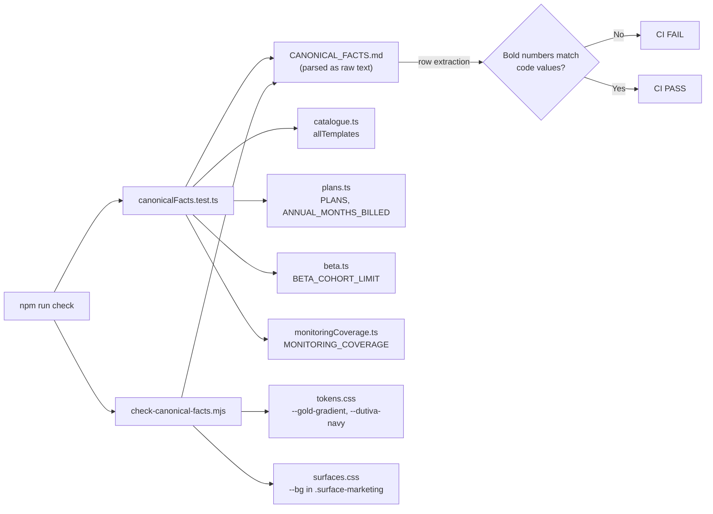
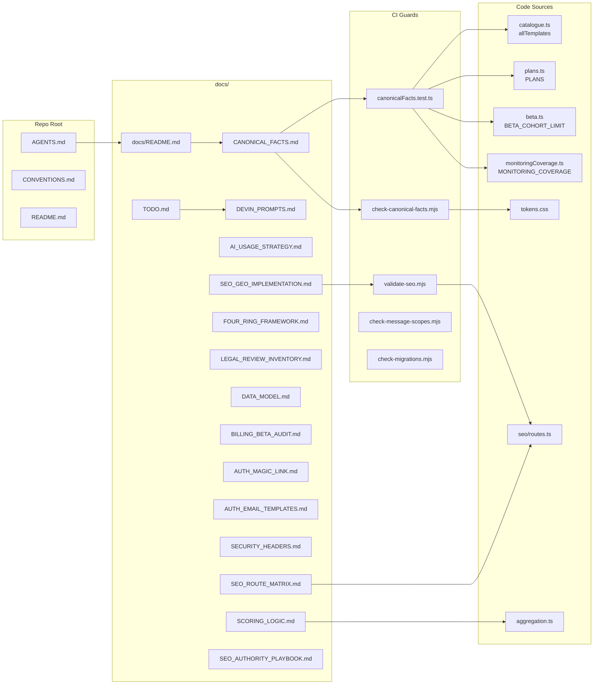

# Documentation Index & Strategy Docs

<details>
<summary>Relevant source files</summary>

The following files were used as context for generating this wiki page:

- [docs/DATA_MODEL.md](docs/DATA_MODEL.md)
- [docs/DEVIN_PROMPTS.md](docs/DEVIN_PROMPTS.md)
- [docs/LEGAL_REVIEW_INVENTORY.md](docs/LEGAL_REVIEW_INVENTORY.md)
- [docs/README.md](docs/README.md)
- [docs/SCORING_LOGIC.md](docs/SCORING_LOGIC.md)
- [docs/SEO_AUTHORITY_PLAYBOOK.md](docs/SEO_AUTHORITY_PLAYBOOK.md)
- [docs/design-handoff-advisor-chat/AGENT.md](docs/design-handoff-advisor-chat/AGENT.md)
- [docs/design-handoff-advisor-chat/README.md](docs/design-handoff-advisor-chat/README.md)
- [docs/design-handoff-advisor-chat/prototypes/Advisor Memory.dc.html](docs/design-handoff-advisor-chat/prototypes/Advisor Memory.dc.html)
- [docs/design-handoff-advisor-chat/prototypes/Advisor Response Experience.dc.html](docs/design-handoff-advisor-chat/prototypes/Advisor Response Experience.dc.html)
- [docs/design-handoff-advisor-chat/prototypes/Engineering Roadmap.dc.html](docs/design-handoff-advisor-chat/prototypes/Engineering Roadmap.dc.html)
- [docs/design-handoff-advisor-chat/prototypes/support.js](docs/design-handoff-advisor-chat/prototypes/support.js)
- [docs/design-handoff-advisor-chat/screenshots/01-response-home.png](docs/design-handoff-advisor-chat/screenshots/01-response-home.png)
- [docs/design-handoff-advisor-chat/screenshots/02-response-termination.png](docs/design-handoff-advisor-chat/screenshots/02-response-termination.png)
- [docs/design-handoff-advisor-chat/screenshots/03-response-escalation.png](docs/design-handoff-advisor-chat/screenshots/03-response-escalation.png)
- [docs/design-handoff-advisor-chat/screenshots/04-response-support.png](docs/design-handoff-advisor-chat/screenshots/04-response-support.png)
- [docs/design-handoff-advisor-chat/screenshots/05-response-jurisdiction.png](docs/design-handoff-advisor-chat/screenshots/05-response-jurisdiction.png)
- [docs/design-handoff-hr-documents-library/README.md](docs/design-handoff-hr-documents-library/README.md)
- [docs/design-handoff-hr-documents-library/design/HR Documents Library.dc.html](docs/design-handoff-hr-documents-library/design/HR Documents Library.dc.html)
- [docs/design-handoff-hr-documents-library/design/assets/dutiva-leaf.png](docs/design-handoff-hr-documents-library/design/assets/dutiva-leaf.png)
- [docs/design-handoff-hr-documents-library/design/assets/icon-app.svg](docs/design-handoff-hr-documents-library/design/assets/icon-app.svg)
- [docs/design-handoff-hr-documents-library/design/dutiva-data.js](docs/design-handoff-hr-documents-library/design/dutiva-data.js)
- [docs/design-handoff-hr-documents-library/screenshots/01-studio.png](docs/design-handoff-hr-documents-library/screenshots/01-studio.png)
- [docs/design-handoff-hr-documents-library/screenshots/02-template-detail.png](docs/design-handoff-hr-documents-library/screenshots/02-template-detail.png)
- [docs/design-handoff-hr-documents-library/screenshots/03-generate-wizard.png](docs/design-handoff-hr-documents-library/screenshots/03-generate-wizard.png)
- [docs/design-handoff-hr-documents-library/screenshots/04-repository.png](docs/design-handoff-hr-documents-library/screenshots/04-repository.png)
- [docs/design-handoff-hr-documents-library/screenshots/05-document-detail.png](docs/design-handoff-hr-documents-library/screenshots/05-document-detail.png)
- [src/data/analytics.ts](src/data/analytics.ts)
- [src/features/app/views/analytics/AnalyticsProductionView.tsx](src/features/app/views/analytics/AnalyticsProductionView.tsx)
- [src/features/app/views/analytics/AnalyticsView.test.tsx](src/features/app/views/analytics/AnalyticsView.test.tsx)
- [src/features/app/views/analytics/aggregation.test.ts](src/features/app/views/analytics/aggregation.test.ts)
- [src/features/app/views/analytics/aggregation.ts](src/features/app/views/analytics/aggregation.ts)
- [src/features/app/views/analytics/productionApi.ts](src/features/app/views/analytics/productionApi.ts)
- [src/features/marketing/pages/JurisdictionToolPage.tsx](src/features/marketing/pages/JurisdictionToolPage.tsx)
- [src/features/marketing/tools/jurisdictionLogic.test.ts](src/features/marketing/tools/jurisdictionLogic.test.ts)
- [src/features/marketing/tools/jurisdictionLogic.ts](src/features/marketing/tools/jurisdictionLogic.ts)
- [src/i18n/messages/analytics.ts](src/i18n/messages/analytics.ts)
- [src/i18n/messages/jurisdictionTool.ts](src/i18n/messages/jurisdictionTool.ts)
- [src/i18n/messages/marketing.ts](src/i18n/messages/marketing.ts)
- [supabase/functions/record-score-snapshots/index.ts](supabase/functions/record-score-snapshots/index.ts)
- [supabase/functions/record-score-snapshots/scoring.test.ts](supabase/functions/record-score-snapshots/scoring.test.ts)
- [supabase/functions/record-score-snapshots/scoring.ts](supabase/functions/record-score-snapshots/scoring.ts)

</details>

This page covers the `docs/` documentation system that governs the Dutiva codebase: the central `docs/README.md` index, 30+ strategy and reference documents, the `AGENTS.md` coding-agent instructions, and `TODO.md` as the master operational index. The documentation layer is not passive — it is enforced by CI drift guards that fail `npm run check` when prose and code disagree.

## Documentation Hierarchy & Precedence

The Dutiva documentation system enforces a strict precedence chain. Every document states this rule, and CI enforces it bidirectionally.

**Precedence chain (highest → lowest):**

```
Code  →  CANONICAL_FACTS.md  →  Strategy docs  →  TODO.md / DEVIN_PROMPTS.md
```

The rule, stated at [docs/CANONICAL_FACTS.md:11-13](): _"Where this file disagrees with the code, the code wins and this file gets corrected."_ Every strategy doc repeats this rule in its own header.

**Documentation hierarchy diagram:**

```mermaid
graph TD
    A["docs/README.md<br>Documentation Index"] --> B["CANONICAL_FACTS.md<br>Source of record"]
    A --> C["Strategy & Architecture Docs"]
    A --> D["Operational Docs"]
    A --> E["Design Handoffs"]

    B --> B1["canonicalFacts.test.ts<br>TypeScript-value drift guard"]
    B --> B2["check-canonical-facts.mjs<br>CSS-value drift guard"]

    C --> C1["AI_USAGE_STRATEGY.md"]
    C --> C2["SCORING_LOGIC.md"]
    C --> C3["FOUR_RING_FRAMEWORK.md"]
    C --> C4["DATA_MODEL.md"]
    C --> C5["SECURITY_HEADERS.md"]
    C --> C6["SEO_GEO_IMPLEMENTATION.md"]
    C --> C7["SEO_ROUTE_MATRIX.md"]
    C --> C8["SEO_AUTHORITY_PLAYBOOK.md"]
    C --> C9["AUTH_MAGIC_LINK.md"]
    C --> C10["AUTH_EMAIL_TEMPLATES.md"]

    D --> D1["TODO.md<br>Master open-item index"]
    D --> D2["DEVIN_PROMPTS.md<br>Agent-delegable prompts"]
    D --> D3["LEGAL_REVIEW_INVENTORY.md<br>Lawyer RFQ inventory"]
    D --> D4["BILLING_BETA_AUDIT.md<br>Stripe audit"]

    E --> E1["design-handoff-advisor-chat/"]
    E --> E2["design-handoff-hr-documents-library/"]
    E --> E3["design-handoff-analytics/"]
```



Sources: [docs/README.md:1-108](), [docs/CANONICAL_FACTS.md:1-15]()

## docs/README.md — The Index

`docs/README.md` is the entry point for anyone navigating the documentation. It organizes all documents into seven sections, each presented as a table mapping document name to what it settles.

| Section                 | Documents                                                                                                                             | Purpose                                 |
| ----------------------- | ------------------------------------------------------------------------------------------------------------------------------------- | --------------------------------------- |
| Start here              | `CANONICAL_FACTS.md`                                                                                                                  | Source of record for load-bearing facts |
| What is still open      | `TODO.md`, `DEVIN_PROMPTS.md`, `LEGAL_REVIEW_INVENTORY.md`                                                                            | Open work and delegation                |
| What is true            | `FOUR_RING_FRAMEWORK.md`, `AI_USAGE_STRATEGY.md`, `SCORING_LOGIC.md`, `LAW_MONITORING.md`, `LAW_CHANGE_NOTIFICATIONS.md`, corpus docs | Product truth assertions                |
| Privacy, security, data | `SECURITY_HEADERS.md`, `ERROR_REPORTING.md`, `EXPORT_PROTECTION.md`, `do-residency-confirmation-request.md`                           | Security and privacy posture            |
| Data and platform       | `DATABASE_SCHEMA.md`, `DATA_MODEL.md`, `AUTH_MAGIC_LINK.md`, `BILLING_BETA_AUDIT.md`, `OFFLINE_PWA.md`                                | Backend and platform config             |
| Web surface             | `SEO_GEO_IMPLEMENTATION.md`, `SEO_ROUTE_MATRIX.md`, `SEO_AUTHORITY_PLAYBOOK.md`, `DEV_ANNOTATIONS.md`                                 | Marketing site SEO and tooling          |
| Support                 | `SUPPORT_ARCHITECTURE.md`, `SUPPORT_RUNBOOK.md`, `SUPPORT_CALL_SCHEDULING.md`, `SUPPORT_ANALYTICS.md`                                 | Support system operations               |

The index also cross-references three repo-root entry points: `README.md`, `AGENTS.md`, and `CONVENTIONS.md`.

Sources: [docs/README.md:1-108]()

## CANONICAL_FACTS.md — The Source of Record

`CANONICAL_FACTS.md` is the single authoritative document for every load-bearing fact about Dutiva. It was created after a July 2026 audit found seven key facts recorded inconsistently across Google Drive documents.

### Verified facts table

| Fact              | Value                                    | Source of truth                                      |
| ----------------- | ---------------------------------------- | ---------------------------------------------------- |
| Templates shipped | **50** (T01–T50)                         | `src/features/app/documents/catalogue.ts`            |
| Jurisdictions     | **3** — ON, QC, FED                      | Jurisdiction codes in code                           |
| Pricing           | Free / $24 / $49 / $99 CAD/mo            | `src/config/plans.ts` → `PLANS`                      |
| Annual billing    | 10 of 12 months (`ANNUAL_MONTHS_BILLED`) | `src/config/plans.ts`                                |
| Beta state        | Paid plans shown but not sold            | `PAID_PLANS_DISABLED_DURING_BETA`                    |
| Beta capacity     | 15 seats                                 | `src/config/beta.ts` `BETA_COHORT_LIMIT`             |
| Rings live        | All four complete                        | `docs/FOUR_RING_FRAMEWORK.md`                        |
| Law monitoring    | FED, ON, QC confirmed working            | `src/features/app/guidance/monitoringCoverage.ts`    |
| Brand gold        | `#8a6d3b → #c8a96b → #e6cf9c → #f7ead0`  | `tokens.css` `--gold-gradient`                       |
| Brand navy        | `#0b1f3a` ground, `#060f1e` deep         | `tokens.css` `--dutiva-navy`                         |
| Brand teal        | `#0f766e`; on dark `#45c4b5`             | `tokens.css` `--dutiva-teal`, `--dutiva-teal-bright` |

Sources: [docs/CANONICAL_FACTS.md:40-55]()

### CI Enforcement — Bidirectional Drift Guards

The drift guard is split in two along a principled boundary:

1. **`src/canonicalFacts.test.ts`** — rows backed by TypeScript values (template count, plan prices, jurisdictions, billing ratio, beta flags, monitoring coverage). These are imported from source modules and compared against the prose of `CANONICAL_FACTS.md`, read via Vite's `?raw` glob. The test parses markdown table rows, extracts bold numbers, and asserts bidirectional agreement. [src/canonicalFacts.test.ts:1-107]()

2. **`scripts/check-canonical-facts.mjs`** — rows backed by CSS text (brand palette). Vitest runs with `css: false`, so it cannot read token values. This script reads `tokens.css` and `surfaces.css` directly, extracts hex declarations by selector and property, and compares them against the markdown table. [scripts/check-canonical-facts.mjs:1-110]()

**Enforcement flow diagram:**



The test at [src/canonicalFacts.test.ts:83-95]() demonstrates the bidirectional approach: it checks that the template count matches `allTemplates.length`, that the TID range matches the first and last real TIDs, and that no duplicate TIDs exist across catalogue sources.

Sources: [src/canonicalFacts.test.ts:1-107](), [scripts/check-canonical-facts.mjs:1-110](), [docs/CANONICAL_FACTS.md:15-35]()

## AGENTS.md — Coding Agent Instructions

`AGENTS.md` is the entry point for AI coding agents (Claude Code, Codex, Cursor, Copilot). It summarizes `CONVENTIONS.md` and establishes seven non-negotiable rules:

| Rule                 | Summary                                                        |
| -------------------- | -------------------------------------------------------------- |
| Bilingual everything | Every string ships as `{ en, fr }` via `Bi` / `defineMessages` |
| Design tokens        | No hardcoded hex; use `var(--token)`                           |
| lucide-react only    | No emoji anywhere                                              |
| Data fixtures        | Views import from `src/data/`, never inline entities           |
| Colocated tests      | `*.test.ts(x)` next to the unit                                |
| Legal disclaimer     | Via shared `Disclaimer` component, never re-typed              |
| Workspace mode       | Default demo; production via `useWorkspaceMode()`              |

The `npm run check` command gate is the enforcement mechanism: `typecheck + lint + test + check:migrations + check:rls + check:facts + check:message-scopes` must pass before every commit.

A key operational warning at [AGENTS.md:103-115](): _"A migration merged is not a migration applied."_ Several features shipped inert because SQL sat in `supabase/migrations/` without being applied to the live project. The same applies to edge functions.

Sources: [AGENTS.md:1-115]()

## TODO.md — The Master Operational Index

`TODO.md` is the running inventory of every open item, swept from PRs #1–#132 and subsequent work. It uses a five-status vocabulary:

| Status       | Meaning                                                        |
| ------------ | -------------------------------------------------------------- |
| **Owner**    | Built and merged; needs a secret, account, or dashboard action |
| **Decision** | Blocked on a product/policy call                               |
| **Blocked**  | Blocked by external dependency                                 |
| **Build**    | Ready to implement                                             |
| **Verify**   | Believed true but unconfirmed                                  |

The file is organized into sections:

1. **Owner actions** (OA1–OA17) — code that is merged but inert until credentials are configured. Many are now marked **Done** with detailed verification records.
2. **Legal / content** (L1–L9) — corpus verification, review packs, statutory figure work.
3. **Edge functions** (EF1–EF10) — deployment and configuration gaps.
4. **Decisions** (D1–D7) — product or policy questions blocking implementation.
5. **Verify** (V1–V3) — items believed true but not confirmed.

The precedence rule at [docs/TODO.md:12-15](): _"This file is an index of open work, not a source of fact. CANONICAL_FACTS.md outranks it, and the code outranks both."_

Sources: [docs/TODO.md:1-50]()

## DEVIN_PROMPTS.md — Agent-Delegable Work

`DEVIN_PROMPTS.md` converts every open `TODO.md` item into ready-to-paste prompts for the Devin coding agent. It contains 14 task prompts organized in two waves:

| Wave   | Prompts            | Characteristic                                      |
| ------ | ------------------ | --------------------------------------------------- |
| Wave 1 | DP-1 through DP-7  | No decision/credential needed; touch disjoint files |
| Wave 2 | DP-8 through DP-14 | Each has a decision block that must be filled first |

Each prompt is paired with a **standing brief** (at [docs/DEVIN_PROMPTS.md:53-113]()) that carries repo non-negotiables: the `CANONICAL_FACTS.md` precedence rule, the statutory-figure prohibition, the bilingual requirement, the quality gate (`npm run check`), and explicit statements of what an agent cannot do (apply migrations, access production secrets, read the live Supabase project).

The coverage table at [docs/DEVIN_PROMPTS.md:27-45]() maps every `TODO.md` ID to its prompt or to "Owner only" when the item requires credentials.

Sources: [docs/DEVIN_PROMPTS.md:1-50]()

## Key Strategy Documents

### AI_USAGE_STRATEGY.md

Establishes the core design principle: _"The LLM proposes, deterministic code disposes."_ Maps every AI touchpoint to its mechanism:

| Touchpoint             | LLM?                                       | Source of truth                                 |
| ---------------------- | ------------------------------------------ | ----------------------------------------------- |
| Advisor chat           | Yes                                        | `supabase/functions/advisor-chat/index.ts`      |
| Memory fact extraction | Yes                                        | Engineering Roadmap §5                          |
| Support first-line     | Yes*                                       | `supabase/functions/support-firstline/index.ts` |
| Document generation    | **No** — `{{merge}}` tokens + `ClauseGate` | `src/features/app/documents/data/types.ts`      |
| Legal-basis citations  | **No** — vetted rows                       | `src/features/app/guidance/api.ts`              |
| Crisis resources       | **No** — verbatim maintained list          | `AGENT.md` §8                                   |
| Triage / priority      | **No** — deterministic arithmetic          | `src/features/support/triage.ts`                |

The "irreducible LLM core" is the conversational Advisor (open-vocabulary HR questions) and memory fact extraction (NL → structured facts). Everything else is deliberately deterministic.

Sources: [docs/AI_USAGE_STRATEGY.md:1-110]()

### SCORING_LOGIC.md

Reference for all scoring systems. The compliance score formula v3 (at [docs/SCORING_LOGIC.md:67-125]()) is the most critical:

1. **Four components**: Policies (raw ratio), Tasks (provenanced non-cancelled only via `isProvenancedTask`), Findings (severity-weighted: info 1, low 2, medium 3, high 5, critical 8 per `FINDING_SEVERITY_WEIGHTS`), Obligations (evidenced ratio)
2. **Blend**: `blendScore` — unweighted mean of components with data; `null` components excluded
3. **Critical ceiling**: `CRITICAL_SCORE_CEILING` = **69** — caps the blend while any critical finding is open via `applyCriticalCeiling`

The pure functions live in `src/features/app/views/analytics/aggregation.ts`, versioned as `SCORE_FORMULA_VERSION = 3`, and tested in `aggregation.test.ts`.

Sources: [docs/SCORING_LOGIC.md:1-135](), [src/features/app/views/analytics/aggregation.ts:212-310]()

### FOUR_RING_FRAMEWORK.md

Records the Four Ring product scope and, tool by tool, what is actually built:

| Ring | Pillar                            | Status                                                               |
| ---- | --------------------------------- | -------------------------------------------------------------------- |
| 1    | HR Compliance Core                | Complete — 46 templates in catalogue                                 |
| 2    | Workplace Wellness                | Complete — accommodation, leave, mental health, psychological safety |
| 3    | Internal Communications           | Complete — 9 templates T35–T43                                       |
| 4    | Compensation & Financial Literacy | Complete — 2 templates + 2 reference guides                          |

A critical warning at [docs/FOUR_RING_FRAMEWORK.md:59-69](): _"Every ring has a module whose name matches it, and none of those modules is the ring."_ The `/app/communications`, `/app/compensation`, and `/app/wellbeing` modules are org-scoped registers, not the rings themselves. The rings are templates, guides, and flows.

Sources: [docs/FOUR_RING_FRAMEWORK.md:1-100]()

### LEGAL_REVIEW_INVENTORY.md

RFQ-ready inventory for quoting legal review. Headlines at [docs/LEGAL_REVIEW_INVENTORY.md:28-38]():

| Bucket                                          | Items                     | Reviewer             |
| ----------------------------------------------- | ------------------------- | -------------------- |
| Public legal pages                              | 26 (× EN + FR = 52 files) | Lawyer               |
| Templates `lawyer_review_recommended`           | 12                        | Employment lawyer    |
| Templates `hr_review_required` / `not_reviewed` | 38                        | HR professional      |
| Notice-bands review pack                        | 1                         | Employment lawyer    |
| Advisor grounding corpus                        | 42 rows                   | Lawyer / paralegal   |
| Public articles                                 | 12 (× 2 locales)          | Editorial legal pass |
| In-app reference guides                         | 8                         | Editorial legal pass |
| In-app flows & checklists                       | 4                         | Editorial legal pass |

**Total: 143 discrete items. None has counsel sign-off today.**

Sources: [docs/LEGAL_REVIEW_INVENTORY.md:1-111]()

### Security & Auth Documents

**`SECURITY_HEADERS.md`** documents the HTTP headers enforced via `vercel.json`:

| Header                      | Value                                             | Purpose                  |
| --------------------------- | ------------------------------------------------- | ------------------------ |
| `X-Frame-Options`           | `DENY`                                            | Anti-clickjacking        |
| `Content-Security-Policy`   | Full resource policy (enforcing since 2026-08-10) | Resource loading control |
| `Strict-Transport-Security` | `max-age=63072000; includeSubDomains`             | SSL-strip prevention     |
| `Permissions-Policy`        | `camera=(), microphone=(), geolocation=()`        | Feature opt-out          |

Sources: [docs/SECURITY_HEADERS.md:1-47]()

**`AUTH_MAGIC_LINK.md`** documents the passwordless sign-in flow and the three required Supabase dashboard settings (Redirect URLs, Site URL, Magic Link template). The flow uses `token_hash` + `verifyOtp` in the browser to defeat email-scanner token consumption. It also documents the `localStorage` session storage decision and XSS mitigation strategy.

Sources: [docs/AUTH_MAGIC_LINK.md:1-155]()

**`AUTH_EMAIL_TEMPLATES.md`** was created after a sign-in breakage on 2026-08-08 when Google Workspace's link scanner ran JavaScript and consumed the one-time token. The fix: `AuthConfirm` now spends the token only on user click, and a 6-digit code (`{{ .Token }}`) is included in every email. An `npm run auth:email-templates` script applies the templates via the Supabase Management API.

Sources: [docs/AUTH_EMAIL_TEMPLATES.md:1-117]()

### SEO Documents

**`SEO_GEO_IMPLEMENTATION.md`** covers the prerendering pipeline (`scripts/prerender.mjs`), the `src/seo/routes.ts` registry (single source of truth for all public pages), bilingual URL model (EN unprefixed, FR under `/fr`), and the build-time validation via `scripts/validate-seo.mjs`.

Sources: [docs/SEO_GEO_IMPLEMENTATION.md:1-90]()

**`SEO_ROUTE_MATRIX.md`** classifies every route. 126 public URLs (63 pages × 2 locales) are `PUBLIC_INDEXABLE`. The matrix is enforced by `scripts/validate-seo.mjs` at build time — the count cannot drift.

Sources: [docs/SEO_ROUTE_MATRIX.md:1-50]()

**`SEO_AUTHORITY_PLAYBOOK.md`** covers off-site SEO work that cannot be done by code: business listings (Google Business Profile, Bing Places, LinkedIn, Crunchbase), Canadian associations (HRPA, CPHR, Ordre des CRHA), software review directories (G2, Capterra), and earned coverage targets (Canadian HR Reporter, HRD Canada). It provides ready-to-paste copy derived from `src/seo/site.ts` `ORG_DESCRIPTION`.

Sources: [docs/SEO_AUTHORITY_PLAYBOOK.md:1-140]()

### Other Strategy Documents

**`DATA_MODEL.md`** — HR Documents Library data model transcribed from the design handoff. Defines entities: `organizations`, `profiles`, `organization_members`, `employees`, `employee_cases`, `document_templates`, `document_template_versions`, `documents`, `document_versions`, `document_recipients`, `document_signatures`, `document_audit_events`.

Sources: [docs/DATA_MODEL.md:1-130]()

**`BILLING_BETA_AUDIT.md`** — Stripe billing and beta-signup audit from 2026-07-27. Found that neither the payment path nor beta signup worked at audit time. Key blockers: checkout edge functions not deployed, `pro` plan not in the DB check constraint, beta signups written to `localStorage` only. Items 1–3 remediated; checkout still needs Stripe secrets set.

Sources: [docs/BILLING_BETA_AUDIT.md:1-110]()

## Document Ecosystem Map

**Relationship between documentation artifacts and code enforcement:**



Sources: [docs/README.md:1-108](), [AGENTS.md:1-10](), [src/canonicalFacts.test.ts:1-30](), [scripts/check-canonical-facts.mjs:1-65]()

## Corpus & Review Pack Documents

The `docs/` folder contains several advisor guidance corpus documents and review packs:

| Document                                | Content                                                              | Status                                |
| --------------------------------------- | -------------------------------------------------------------------- | ------------------------------------- |
| `advisor-guidance-corpus-2026-07-26.md` | Grounding corpus seed — ON/QC/FED termination notice                 | Machine-curated, pending human review |
| `advisor-guidance-corpus-2026-07-27.md` | Leaves, public holidays, hours of work, accommodation                | Machine-curated, pending human review |
| `advisor-guidance-corpus-2026-07-29.md` | Pay & deductions, records retention, layoffs, constructive dismissal | Machine-curated, pending human review |
| `advisor-guidance-corpus-2026-08-04.md` | Additional tranche                                                   | Machine-curated, pending human review |
| `advisor-corpus-review-pack-ontario.md` | 14 Ontario chunks with figures to verify, sign-off SQL               | Prepared for human review             |
| `notice-bands-review-pack.md`           | QC and FED statutory notice bands with full verbatim statute text    | Prepared for lawyer sign-off          |
| `do-residency-confirmation-request.md`  | Draft support ticket for DigitalOcean data-residency confirmation    | Blocks PIPEDA claims in 5 legal pages |

The review pack at `advisor-corpus-review-pack-ontario.md` provides per-chunk sign-off SQL templates that a reviewer executes to move rows from `machine_curated` to `reviewed` status in `advisor_guidance_chunks`.

Sources: [docs/README.md:48-52](), [docs/notice-bands-review-pack.md:1-30](), [docs/do-residency-confirmation-request.md:1-65]()

## Complete File Inventory

The `docs/` folder contains 34 markdown documents plus 3 design handoff subdirectories:

| Category        | Files                                                                                                                                                              |
| --------------- | ------------------------------------------------------------------------------------------------------------------------------------------------------------------ |
| Index           | `README.md`                                                                                                                                                        |
| Governance      | `CANONICAL_FACTS.md`                                                                                                                                               |
| Operations      | `TODO.md`, `DEVIN_PROMPTS.md`                                                                                                                                      |
| Product scope   | `FOUR_RING_FRAMEWORK.md`, `LEGAL_REVIEW_INVENTORY.md`                                                                                                              |
| AI strategy     | `AI_USAGE_STRATEGY.md`                                                                                                                                             |
| Scoring         | `SCORING_LOGIC.md`                                                                                                                                                 |
| Auth            | `AUTH_MAGIC_LINK.md`, `AUTH_EMAIL_TEMPLATES.md`                                                                                                                    |
| Data            | `DATA_MODEL.md`, `DATABASE_SCHEMA.md`                                                                                                                              |
| Billing         | `BILLING_BETA_AUDIT.md`                                                                                                                                            |
| Security        | `SECURITY_HEADERS.md`, `ERROR_REPORTING.md`, `EXPORT_PROTECTION.md`                                                                                                |
| SEO             | `SEO_GEO_IMPLEMENTATION.md`, `SEO_ROUTE_MATRIX.md`, `SEO_AUTHORITY_PLAYBOOK.md`                                                                                    |
| Law monitoring  | `LAW_MONITORING.md`, `LAW_CHANGE_NOTIFICATIONS.md`                                                                                                                 |
| Support         | `SUPPORT_ARCHITECTURE.md`, `SUPPORT_RUNBOOK.md`, `SUPPORT_CALL_SCHEDULING.md`, `SUPPORT_ANALYTICS.md`                                                              |
| Infrastructure  | `OFFLINE_PWA.md`, `DEV_ANNOTATIONS.md`                                                                                                                             |
| Corpus          | `advisor-guidance-corpus-2026-07-26.md`, `advisor-guidance-corpus-2026-07-27.md`, `advisor-guidance-corpus-2026-07-29.md`, `advisor-guidance-corpus-2026-08-04.md` |
| Review packs    | `advisor-corpus-review-pack-ontario.md`, `advisor-corpus-verification-2026-08-02.md`, `notice-bands-review-pack.md`                                                |
| Vendor          | `do-residency-confirmation-request.md`                                                                                                                             |
| Design handoffs | `design-handoff-advisor-chat/`, `design-handoff-hr-documents-library/`, `design-handoff-analytics/`                                                                |

Sources: [docs/README.md:1-108]()

## Adding a Document

The protocol at [docs/README.md:103-108]():

1. Add the file to `docs/`.
2. Add its row to `docs/README.md` — an unlisted document is one nobody finds.
3. If it asserts a fact that also lives in code, state which file wins and add a check to `src/canonicalFacts.test.ts` or `scripts/check-canonical-facts.mjs`.

Sources: [docs/README.md:103-108]()

---
