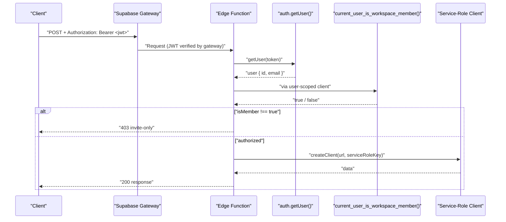
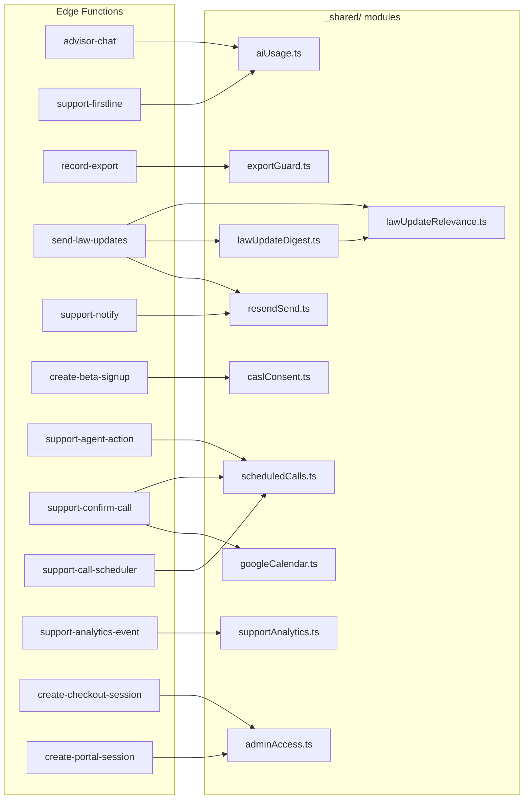
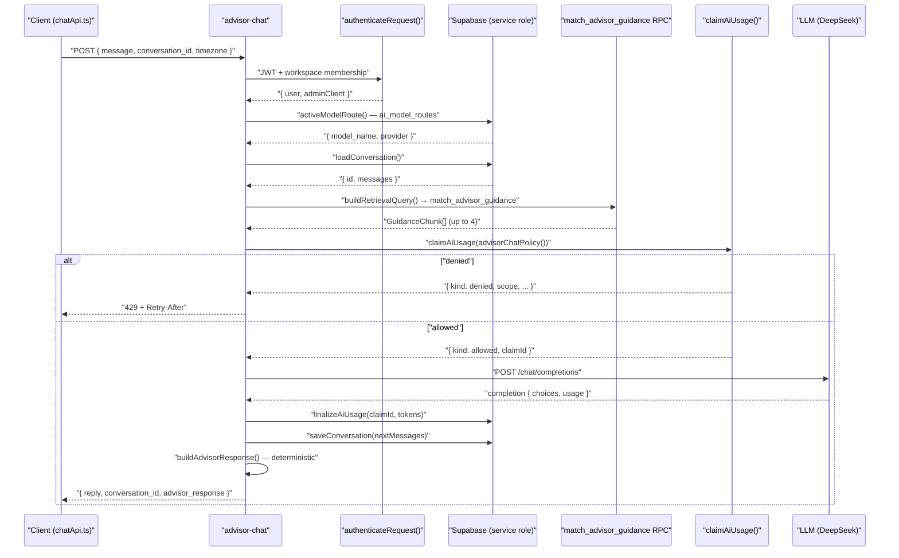

# Edge Functions & Shared Modules

<details>
<summary>Relevant source files</summary>

The following files were used as context for generating this wiki page:

- [docs/TODO.md](docs/TODO.md)
- [docs/advisor-guidance-corpus-2026-07-26.md](docs/advisor-guidance-corpus-2026-07-26.md)
- [supabase/config.toml](supabase/config.toml)
- [supabase/functions/_shared/caslConsent.test.ts](supabase/functions/_shared/caslConsent.test.ts)
- [supabase/functions/_shared/caslConsent.ts](supabase/functions/_shared/caslConsent.ts)
- [supabase/functions/create-checkout-session/index.ts](supabase/functions/create-checkout-session/index.ts)
- [supabase/functions/stripe-webhook/billing-event.test.ts](supabase/functions/stripe-webhook/billing-event.test.ts)
- [supabase/functions/stripe-webhook/billing-event.ts](supabase/functions/stripe-webhook/billing-event.ts)
- [supabase/functions/stripe-webhook/index.ts](supabase/functions/stripe-webhook/index.ts)
- [supabase/functions/support-analytics-event/index.ts](supabase/functions/support-analytics-event/index.ts)
- [supabase/migrations/0037_beta_signups_consent_record.sql](supabase/migrations/0037_beta_signups_consent_record.sql)
- [supabase/migrations/0051_rate_limit_support_analytics.sql](supabase/migrations/0051_rate_limit_support_analytics.sql)
- [supabase/migrations/0074_revoke_flag_guidance_public_execute.sql](supabase/migrations/0074_revoke_flag_guidance_public_execute.sql)
- [supabase/schema.sql](supabase/schema.sql)

</details>

This page covers the 24 Supabase Deno edge functions that comprise Dutiva's server-side logic, the 10 shared modules under `_shared/`, the `config.toml` JWT settings that control gateway authentication, and the Vault secrets management pattern.

## Function Inventory by Authentication Mode

Every edge function runs on Supabase's Deno runtime. The critical configuration choice for each function is `verify_jwt` — whether the Supabase API gateway requires a valid JWT before the request reaches the function. `config.toml` pins this setting per function so that a bulk `supabase functions deploy` cannot silently change it.

[supabase/config.toml:1-72]()

### `verify_jwt = false` — Public & Cron Functions

These functions handle their own authentication in-band (shared secrets, provider signatures, or no auth at all for fire-and-forget sinks).

| Function                       | Purpose                                     | Auth mechanism                     |
| ------------------------------ | ------------------------------------------- | ---------------------------------- |
| `stripe-webhook`               | Stripe subscription lifecycle events        | Stripe HMAC signature verification |
| `resend-webhook`               | Resend delivery/bounce tracking             | Svix HMAC signature verification   |
| `create-public-support-ticket` | Public (signed-out) ticket intake           | CAPTCHA + honeypot + rate limit    |
| `create-beta-signup`           | Beta waiting-list signup                    | CAPTCHA + honeypot + rate limit    |
| `report-error`                 | Client error telemetry sink                 | Rate limit (peppered IP hash)      |
| `support-analytics-event`      | Support funnel analytics sink               | Rate limit (peppered IP hash)      |
| `monitor-law-changes`          | Nightly law-change sweep (14 jurisdictions) | Service key / vault secret         |
| `support-call-scheduler`       | Cron: call reminders + follow-up flags      | Shared secret / service key        |
| `support-attachment-scan`      | Cron: malware scan queue drain              | Shared secret / service key        |
| `support-notify`               | Cron: outbox email sender (Resend)          | Shared secret / service key        |
| `send-law-updates`             | Weekly law-change digest email              | Shared secret / service key        |
| `record-score-snapshots`       | Daily/month-close compliance score job      | Service key exact match            |

Sources: [supabase/config.toml:25-72]()

### `verify_jwt = true` — Authenticated User Functions

These functions rely on the Supabase gateway to enforce a valid JWT, then perform additional authorization checks (workspace membership, admin role, ticket ownership).

| Function                    | Purpose                                    | Additional auth gate                  |
| --------------------------- | ------------------------------------------ | ------------------------------------- |
| `advisor-chat`              | Real AI Advisor replies                    | `current_user_is_workspace_member()`  |
| `advisor-safety-event`      | Safety backstop telemetry                  | `current_user_is_workspace_member()`  |
| `support-firstline`         | AI first-line answer for support form      | Bearer JWT + `auth.getUser()`         |
| `create-support-ticket`     | Authenticated ticket creation              | Bearer JWT + `auth.getUser()`         |
| `support-agent-action`      | Admin ticket actions (reply, status, call) | `is_admin()`                          |
| `support-confirm-call`      | Customer confirms a scheduled call time    | Ticket requester check                |
| `support-attachment-action` | Upload metadata + signed URL download      | Ticket requester / admin / org member |
| `record-export`             | Export audit + velocity guard              | `current_user_is_workspace_member()`  |
| `export-audit-trail`        | Admin read-only export event viewer        | `is_admin()`                          |
| `set-service-status`        | Update service status board                | `is_admin()`                          |
| `create-checkout-session`   | Stripe checkout session creation           | Bearer JWT + paywall bypass check     |
| `create-portal-session`     | Stripe billing portal session              | Bearer JWT + paywall bypass check     |

Sources: [supabase/functions/advisor-chat/index.ts:236-266](), [supabase/functions/advisor-safety-event/index.ts:63-88](), [supabase/functions/support-agent-action/index.ts:60-64](), [supabase/functions/record-export/index.ts:63-85](), [supabase/functions/export-audit-trail/index.ts:62-78](), [supabase/functions/set-service-status/index.ts:38-49](), [supabase/functions/create-checkout-session/index.ts:99-114](), [supabase/functions/support-confirm-call/index.ts:56-63]()

### Edge Function Architecture Diagram

```mermaid
graph TB
    subgraph "Client"
        Browser["Browser / SPA"]
    end

    subgraph "Supabase API Gateway"
        GW["API Gateway"]
    end

    subgraph "verify_jwt = false"
        SW["stripe-webhook"]
        RW["resend-webhook"]
        CPST["create-public-support-ticket"]
        CBS["create-beta-signup"]
        RE["report-error"]
        SAE["support-analytics-event"]
        MLC["monitor-law-changes"]
        SCS["support-call-scheduler"]
        SAS["support-attachment-scan"]
        SN["support-notify"]
        SLU["send-law-updates"]
        RSS["record-score-snapshots"]
    end

    subgraph "verify_jwt = true"
        AC["advisor-chat"]
        ASE["advisor-safety-event"]
        SF["support-firstline"]
        CST["create-support-ticket"]
        SAA["support-agent-action"]
        SCC["support-confirm-call"]
        SATT["support-attachment-action"]
        REXP["record-export"]
        EAT["export-audit-trail"]
        SSS["set-service-status"]
        CCS["create-checkout-session"]
        CPS["create-portal-session"]
    end

    subgraph "External Services"
        Stripe["Stripe API"]
        Resend["Resend API"]
        DeepSeek["LLM Provider (DeepSeek)"]
        HF["HuggingFace"]
        GCal["Google Calendar API"]
        ClamAV["ClamAV Scanner"]
    end

    subgraph "pg_cron Scheduler"
        Cron["trigger_law_monitor()\ntrigger_support_notify_drain()\ntrigger_support_call_scheduler()\ntrigger_support_attachment_scan()\ntrigger_law_update_digest()\ntrigger_score_snapshot()"]
    end

    Browser --> GW
    Stripe --> SW
    Resend --> RW
    Cron --> MLC
    Cron --> SCS
    Cron --> SAS
    Cron --> SN
    Cron --> SLU
    Cron --> RSS

    GW --> AC
    GW --> ASE
    GW --> SF
    GW --> CST
    GW --> SAA
    GW --> SCC
    GW --> SATT
    GW --> REXP
    GW --> EAT
    GW --> SSS
    GW --> CCS
    GW --> CPS

    Browser --> CPST
    Browser --> CBS
    Browser --> RE
    Browser --> SAE

    AC --> DeepSeek
    SF --> DeepSeek
    MLC --> HF
    SN --> Resend
    SLU --> Resend
    SCC --> GCal
    SAS --> ClamAV
    CCS --> Stripe
    CPS --> Stripe
    SW --> Stripe
```



Sources: [supabase/config.toml:25-72](), [supabase/functions/advisor-chat/index.ts:367-393](), [supabase/functions/support-notify/index.ts:1-4](), [supabase/functions/send-law-updates/index.ts:3-4](), [supabase/functions/support-confirm-call/index.ts:4]()

## Authentication Patterns

The functions use three distinct authentication patterns depending on their caller:

### 1. Bearer JWT + Workspace Membership (User-Facing Functions)

Used by `advisor-chat`, `advisor-safety-event`, `record-export`, and `support-firstline`. The pattern:

1. Extract the JWT from the `Authorization` header
2. Create a user-scoped Supabase client with that JWT
3. Call `auth.getUser(token)` to verify the token
4. Call `current_user_is_workspace_member()` RPC via the user client (so `auth.jwt()` inside resolves to the caller's own token)
5. Create a service-role client for the actual data operations



Sources: [supabase/functions/advisor-chat/index.ts:236-266](), [supabase/functions/record-export/index.ts:63-85]()

### 2. Admin Gate (`is_admin` RPC)

Used by `support-agent-action`, `export-audit-trail`, `set-service-status`. After JWT verification, calls `is_admin()` with the user's id via the service-role client.

[supabase/functions/support-agent-action/index.ts:60-64](), [supabase/functions/export-audit-trail/index.ts:76-78]()

### 3. Cron / Secret-Based Authentication

Cron-triggered functions use `verify_jwt = false` and authenticate the caller themselves. Two patterns exist:

- **Shared secret header**: `support-call-scheduler`, `support-notify`, `send-law-updates` check `x-trigger-secret` / `x-notify-secret` against a Vault secret (`SUPPORT_NOTIFY_SECRET`).
- **Service key exact match**: `record-score-snapshots` and `monitor-law-changes` compare the bearer token against `SUPABASE_SERVICE_ROLE_KEY` / `SUPABASE_SECRET_KEY`.

[supabase/functions/support-call-scheduler/index.ts:47-61](), [supabase/functions/record-score-snapshots/index.ts:46-56]()

### 4. Provider Signature Verification (Webhooks)

- **`stripe-webhook`**: Verifies the Stripe HMAC signature via `verifyStripeSignature()`.
- **`resend-webhook`**: Verifies Svix signatures (`verifySvix()`) with timing-safe comparison and timestamp tolerance of 5 minutes.

[supabase/functions/stripe-webhook/index.ts:118-122](), [supabase/functions/resend-webhook/index.ts:54-92]()

## Shared Server Modules (`_shared/`)

The `supabase/functions/_shared/` directory contains 10 modules reused across multiple edge functions. They are deliberately free of `npm:@supabase/supabase-js` imports so they can be unit-tested under Vitest (which cannot resolve `npm:`/`jsr:` specifiers).

### `aiUsage.ts` — AI Usage Metering (Claim/Finalize Pattern)

The core metering module that prevents uncontrolled AI spending during beta.

**Claim/Finalize Pattern**: Every model call is bracketed by two operations:

1. `claimAiUsage()` **before** the call — atomically checks all ceilings and reserves a `status = 'started'` row in `ai_telemetry_events`
2. `finalizeAiUsage()` **after** the call — stamps that row with tokens, latency, and outcome

A claim that is never finalized (e.g. function timeout) stays `started` and continues counting against the caller — the fail-safe direction.

[supabase/functions/_shared/aiUsage.ts:13-24]()

**Four Ceilings** (all env-overridable):

| Ceiling        | Default                      | Scope                    | Purpose                     |
| -------------- | ---------------------------- | ------------------------ | --------------------------- |
| Burst          | 10 chat / 6 support per 300s | Per-user, per-operation  | Stops retry loops / scripts |
| Daily requests | 120                          | Per-user, all operations | Working day budget          |
| Daily tokens   | 250,000                      | Per-user, all operations | Cost cap                    |
| Platform daily | 2,000                        | All users                | Beta-wide stop-loss         |

[supabase/functions/_shared/aiUsage.ts:74-103]()

**Decision types**: `allowed` (with `claimId`), `denied` (with `scope`, `limit`, `used`, `retryAfterSeconds`), or `unavailable` (guardrail could not be evaluated — callers must fail closed).

[supabase/functions/_shared/aiUsage.ts:105-116]()

The `decisionFromRpc()` function parses the SQL RPC's jsonb verdict and treats anything unrecognized as `unavailable` rather than as permission.

[supabase/functions/_shared/aiUsage.ts:148-170]()

Two policy factories produce the operation-specific configurations:

- `advisorChatPolicy()` — burst limit of 10 for `chat` operations
- `supportFirstLinePolicy()` — burst limit of 6 for `support_firstline` operations

[supabase/functions/_shared/aiUsage.ts:87-103]()

Consumers: `advisor-chat` ([supabase/functions/advisor-chat/index.ts:7-11]()), `support-firstline` ([supabase/functions/support-firstline/index.ts:3-8]())

Sources: [supabase/functions/_shared/aiUsage.ts:1-265](), [supabase/functions/_shared/aiUsage.test.ts:1-86]()

### `exportGuard.ts` — Export Velocity Limiting

Same claim/finalize architectural pattern as `aiUsage.ts`, defending against bulk exfiltration of company-generated documents rather than AI cost.

**Ceilings** (slightly tighter than the client-side guard in `localAudit.ts`):

| Ceiling | Default     | Purpose                          |
| ------- | ----------- | -------------------------------- |
| Burst   | 10 per 300s | Stops automated extraction loops |
| Daily   | 80          | A patient exfiltration cap       |

[supabase/functions/_shared/exportGuard.ts:43-49]()

`claimExportSlot()` calls the `claim_export_slot` RPC which atomically checks ceilings and writes the audit row. The returned `exportId` is embedded in the exported artifact (watermark, invisible tag, file metadata) so a leaked copy resolves back to the audit row.

[supabase/functions/_shared/exportGuard.ts:112-138]()

Consumer: `record-export` ([supabase/functions/record-export/index.ts:3]())

Sources: [supabase/functions/_shared/exportGuard.ts:1-153]()

### `lawUpdateRelevance.ts` — Jurisdiction Filtering

Answers one question: "is this `law_updates` row a real, customer-relevant law change?" Applies two filters:

1. **Jurisdiction gate**: Maps monitor jurisdiction names (`"Ontario"`, `"Federal"`) to the product's three supported codes (`ON`, `QC`, `FED`). Unmapped jurisdictions return `null` — fail closed, never "pass through".
2. **Event type gate**: Only `change` events are customer-facing. `first_seen`, `redirect`, and `broken` are operational and must never reach a customer.

[supabase/functions/_shared/lawUpdateRelevance.ts:43-48](), [supabase/functions/_shared/lawUpdateRelevance.ts:75-79]()

`assessLawUpdate()` returns a `RelevanceVerdict` with `relevant`, `jurisdiction`, and `reason` (for logging). `selectRelevantUpdates()` narrows a batch to a given set of jurisdictions.

[supabase/functions/_shared/lawUpdateRelevance.ts:103-130]()

Consumers: `send-law-updates` ([supabase/functions/send-law-updates/index.ts:4]())

Sources: [supabase/functions/_shared/lawUpdateRelevance.ts:1-131]()

### `lawUpdateDigest.ts` — Digest Selection Logic

Builds on `lawUpdateRelevance.ts` to answer "which relevant, reviewed rows has this recipient not already been told about?"

Three additional filters beyond relevance:

- **Review gate**: Only `review_status = 'reviewed'` rows (human-approved)
- **Go-live cutoff**: Only rows detected on or after the go-live date
- **Already-sent exclusion**: Rows recorded in `law_update_notifications` for this recipient are skipped

[supabase/functions/_shared/lawUpdateDigest.ts:57-70]()

`resolveRecipientJurisdictions()` determines which jurisdictions a recipient covers, preferring `organizations.default_jurisdiction` over `profiles.province`.

[supabase/functions/_shared/lawUpdateDigest.ts:32-41]()

Consumer: `send-law-updates` ([supabase/functions/send-law-updates/index.ts:5-6]())

Sources: [supabase/functions/_shared/lawUpdateDigest.ts:1-70]()

### `resendSend.ts` — Resend Email Wrapper

Minimal `fetch`-based wrapper for the Resend email API (`POST https://api.resend.com/emails`). Returns the provider's message id for delivery-tracking correlation.

[supabase/functions/_shared/resendSend.ts:9-25]()

Consumers: `support-notify` ([supabase/functions/support-notify/index.ts:3]()), `send-law-updates` ([supabase/functions/send-law-updates/index.ts:3]())

Sources: [supabase/functions/_shared/resendSend.ts:1-25]()

### `caslConsent.ts` — CASL Consent Records

Stores the verbatim wording the visitor agreed to alongside their beta signup. The wording lives server-side (never in the request), in both English and French, pinned to the i18n source by `caslConsent.test.ts`.

`CASL_CONSENT_TEXT` holds the exact checkbox copy. `buildConsentRecord()` produces the `{ consent_granted, consent_text, consent_at }` fields.

[supabase/functions/_shared/caslConsent.ts:41-64]()

The test verifies the server copy matches `landing.landing_cta_consent_label` from the i18n source, so the two cannot drift silently.

[supabase/functions/_shared/caslConsent.test.ts:12-15]()

Consumer: `create-beta-signup` ([supabase/functions/create-beta-signup/index.ts:3]())

Sources: [supabase/functions/_shared/caslConsent.ts:1-65](), [supabase/functions/_shared/caslConsent.test.ts:1-53]()

### `scheduledCalls.ts` — Call Scheduling Logic

Pure, deterministic logic for the support call-scheduling flow. No I/O — callers pass `now`.

Key exports:

- `parseProposedSlots()` — validates 1-3 future ISO time ranges
- `isValidDurationMinutes()` — 10-120 minute range check
- `parseSlotIndex()` — validates a customer's slot selection
- `rowsNeedingReminder()` — confirmed calls starting within 24h, not yet reminded
- `rowsNeedingFollowup()` — confirmed calls ended 2+ hours ago, not yet flagged

[supabase/functions/_shared/scheduledCalls.ts:10-18](), [supabase/functions/_shared/scheduledCalls.ts:26-86]()

Consumers: `support-agent-action` ([supabase/functions/support-agent-action/index.ts:3]()), `support-confirm-call` ([supabase/functions/support-confirm-call/index.ts:3]()), `support-call-scheduler` ([supabase/functions/support-call-scheduler/index.ts:3-4]())

Sources: [supabase/functions/_shared/scheduledCalls.ts:1-87]()

### `supportAnalytics.ts` — Analytics Event Validation

Pure validation for the `support-analytics-event` sink. `parseEvent()` validates and normalizes incoming event payloads. Five event types: `helpfulness_vote`, `help_search`, `help_article_view`, `ticket_submitted`, `ticket_status_changed`.

Each event type has required fields (e.g. `help_search` requires `search_query`). `search_query` and `anonymous_visitor_id` are truncated rather than rejected.

[supabase/functions/_shared/supportAnalytics.ts:15-28](), [supabase/functions/_shared/supportAnalytics.ts:88-179]()

Consumer: `support-analytics-event` ([supabase/functions/support-analytics-event/index.ts:3]())

Sources: [supabase/functions/_shared/supportAnalytics.ts:1-179]()

### `googleCalendar.ts` — Google Calendar Integration

Service-account JWT-bearer flow (RFC 7523) using Web Crypto — no `google-auth-library` dependency. Generates a signed JWT, exchanges it for an access token at `https://oauth2.googleapis.com/token`, then creates calendar events with auto-generated Google Meet links.

Key exports:

- `parseServiceAccountKey()` — parses and normalizes env vars
- `buildJwtClaims()` — pure function producing the unsigned JWT claims (unit-testable without crypto)
- `createCalendarEvent()` — full flow: token exchange → `events.insert` with `conferenceDataVersion=1` and `sendUpdates=all`

[supabase/functions/_shared/googleCalendar.ts:23-32](), [supabase/functions/_shared/googleCalendar.ts:46-62](), [supabase/functions/_shared/googleCalendar.ts:136-167]()

Consumer: `support-confirm-call` ([supabase/functions/support-confirm-call/index.ts:4]())

Sources: [supabase/functions/_shared/googleCalendar.ts:1-167]()

### `adminAccess.ts` — Paywall Bypass

Determines whether an email address belongs to an internal Dutiva account that bypasses the Stripe paywall. Matches `@dutiva.ca` domain or a specific admin email.

[supabase/functions/_shared/adminAccess.ts:9-16]()

Consumers: `create-checkout-session` ([supabase/functions/create-checkout-session/index.ts:3]()), `create-portal-session` ([supabase/functions/create-portal-session/index.ts:3]())

Sources: [supabase/functions/_shared/adminAccess.ts:1-16]()

### Shared Module Dependency Map



Sources: [supabase/functions/advisor-chat/index.ts:7-11](), [supabase/functions/support-firstline/index.ts:3-8](), [supabase/functions/record-export/index.ts:3](), [supabase/functions/send-law-updates/index.ts:3-6](), [supabase/functions/support-notify/index.ts:3](), [supabase/functions/create-beta-signup/index.ts:3](), [supabase/functions/support-agent-action/index.ts:3](), [supabase/functions/support-confirm-call/index.ts:3-4](), [supabase/functions/support-call-scheduler/index.ts:3-4](), [supabase/functions/support-analytics-event/index.ts:3](), [supabase/functions/create-checkout-session/index.ts:3](), [supabase/functions/create-portal-session/index.ts:3]()

## Key Edge Function Flows

### Advisor Chat Pipeline

The `advisor-chat` function is the most complex edge function, implementing a full RAG (Retrieval-Augmented Generation) pipeline:



Key implementation details:

- The system prompt includes the current timestamp in the user's timezone (validated via `Intl.DateTimeFormat`) so the model has clock awareness.
- Conversation history is capped at 20 messages (10 exchanges) sent upstream to control cost/latency.
- Retrieval includes the previous user turn so follow-up questions carry the relevant lexemes.
- `buildAdvisorResponse()` computes the structured contract deterministically from the message, chunks, and reply — the model is never asked for it.
- If `buildAdvisorResponse()` throws, the user still gets their reply.

[supabase/functions/advisor-chat/index.ts:434-554](), [supabase/functions/advisor-chat/index.ts:43-81](), [supabase/functions/advisor-chat/index.ts:454-460]()

Sources: [supabase/functions/advisor-chat/index.ts:1-555]()

### Beta Signup with CASL Consent

The `create-beta-signup` function demonstrates the full anti-abuse pipeline for public endpoints:

1. **Honeypot check** — pretends success so bots don't learn they were caught (no DB work)
2. **Field validation** — email regex, consent boolean
3. **CAPTCHA verification** — Turnstile/hCaptcha (if `CAPTCHA_SECRET_KEY` is set)
4. **Rate limiting** — per-IP (5/hour) and per-email (3/hour) via salted hash in `beta_signup_intake`
5. **Cohort capacity check** — counts existing signups to determine if the beta cohort is full
6. **Insert + consent recording** — `buildConsentRecord()` from `caslConsent.ts`
7. **Outbox notification** — enqueues operator alert + customer confirmation via `support_notifications`

Repeat addresses are treated as success (unique index catches the duplicate), preventing address-enumeration attacks.

[supabase/functions/create-beta-signup/index.ts:159-329]()

Sources: [supabase/functions/create-beta-signup/index.ts:1-330]()

### Stripe Webhook Event Processing

The `stripe-webhook` function processes subscription lifecycle events with idempotency:

1. **Signature verification** via `verifyStripeSignature()`
2. **Deduplication** — inserts `event.id` into `stripe_webhook_events` (unique constraint catches replays)
3. **Event routing**: `checkout.session.completed`, `customer.subscription.created/updated`, `invoice.payment_failed`, `customer.subscription.deleted`
4. **Profile patching** — writes to `profiles` using `getCheckoutProfilePatch()` or `getSubscriptionProfileUpdate()` from `billing-event.ts`

On write failure, the dedup row is deleted so Stripe's retry delivers a successful write.

[supabase/functions/stripe-webhook/index.ts:107-210]()

`billing-event.ts` normalizes Stripe statuses to the constrained set `profiles.subscription_status` accepts (`active`, `trialing`, `past_due`, `canceled`, `inactive`). Unrecognized statuses map to `inactive` — never to something that reads as entitled.

[supabase/functions/stripe-webhook/billing-event.ts:57-72]()

Sources: [supabase/functions/stripe-webhook/index.ts:1-210](), [supabase/functions/stripe-webhook/billing-event.ts:1-166]()

## Config.toml — JWT Settings

`supabase/config.toml` is the single source of truth for `verify_jwt` settings per function. Without this file, the Supabase CLI defaults `verify_jwt = true` on deploy, which silently breaks all public/cron endpoints.

The file was created after a production incident on 2026-08-06 where:

1. A bulk `functions deploy` silently set `verify_jwt = true` on the `support-analytics-event` function
2. The client (`supportAnalytics.ts`) posts bare bodies with no auth header and swallows all errors
3. Every analytics event returned 401 at the gateway — silently lost

[supabase/config.toml:1-21]()

The three categories documented in the file:

```toml
# Webhooks: authenticated by provider signature, not a JWT
[functions.stripe-webhook]
verify_jwt = false

# Public, unauthenticated by design
[functions.create-public-support-ticket]
verify_jwt = false

# Cron-triggered workers: they authenticate the caller themselves
[functions.monitor-law-changes]
verify_jwt = false
```

[supabase/config.toml:24-72]()

Functions not listed default to `verify_jwt = true` (the CLI default), which is correct for all authenticated user-facing functions.

Sources: [supabase/config.toml:1-72](), [docs/TODO.md:77-86]()

## Vault Secrets Management

Edge functions access secrets through `Deno.env.get()`. Supabase injects two automatic secrets (`SUPABASE_URL`, `SUPABASE_SERVICE_ROLE_KEY`) plus project-configured secrets stored in the Vault (`supabase_vault` extension, enabled in the schema).

[supabase/schema.sql:62]()

### Secret Categories

| Secret                         | Used by                                              | Purpose                            |
| ------------------------------ | ---------------------------------------------------- | ---------------------------------- |
| `SUPABASE_URL`                 | All functions                                        | Auto-injected project URL          |
| `SUPABASE_SERVICE_ROLE_KEY`    | All functions                                        | Auto-injected service role key     |
| `SUPABASE_ANON_KEY`            | JWT-verified functions                               | Used to create user-scoped clients |
| `STRIPE_SECRET_KEY`            | `create-checkout-session`, `create-portal-session`   | Stripe API access                  |
| `STRIPE_WEBHOOK_SECRET`        | `stripe-webhook`                                     | Stripe signature verification      |
| `RESEND_API_KEY`               | `support-notify`, `send-law-updates`                 | Resend email sending               |
| `RESEND_WEBHOOK_SECRET`        | `resend-webhook`                                     | Svix signature verification        |
| `HF_TOKEN`                     | `monitor-law-changes`                                | HuggingFace model for summaries    |
| `CAPTCHA_SECRET_KEY`           | `create-public-support-ticket`, `create-beta-signup` | CAPTCHA verification               |
| `SUPPORT_NOTIFY_SECRET`        | Cron functions                                       | Shared secret for cron auth        |
| `ERROR_REPORT_SALT`            | `report-error`, `support-analytics-event`            | IP hash pepper                     |
| `GOOGLE_CALENDAR_CLIENT_EMAIL` | `support-confirm-call`                               | Google Calendar service account    |
| `GOOGLE_CALENDAR_PRIVATE_KEY`  | `support-confirm-call`                               | Google Calendar service account    |
| `GOOGLE_CALENDAR_ID`           | `support-confirm-call`                               | Target calendar for events         |
| `SUPPORT_ATTACHMENT_SCAN_URL`  | `support-attachment-scan`                            | ClamAV scanner endpoint            |
| `STRIPE_PRICE_*`               | `stripe-webhook`, `create-checkout-session`          | Stripe price IDs (6 vars)          |

### Configured-or-Inert Pattern

Functions that depend on optional external secrets follow the "configured or inert" pattern — they degrade gracefully when a secret is absent rather than failing:

- `support-notify`: Leaves outbox rows `pending` when `RESEND_API_KEY` is unset, so wiring the key later flushes the backlog
- `support-attachment-scan`: Leaves attachments `pending` when `SUPPORT_ATTACHMENT_SCAN_URL` is unset
- `monitor-law-changes`: Runs without `HF_TOKEN` using generic summaries instead of model-generated ones
- `support-confirm-call`: Confirms the call even without Google Calendar credentials, leaving `calendar_event_id` / `meet_link` null

[supabase/functions/support-confirm-call/index.ts:17-25](), [supabase/functions/support-attachment-scan/index.ts:15-21]()

### Fail-Closed Secrets

Some secrets cause the function to refuse all requests when absent:

- `report-error` and `support-analytics-event`: Fail closed without `ERROR_REPORT_SALT` / `SUPPORT_NOTIFY_SECRET` (the IP hash pepper). Without a real secret, the rate limiter's HMAC hash is reproducible and useless.
- `resend-webhook`: Fails closed without `RESEND_WEBHOOK_SECRET` — never accepts unsigned webhooks.

[supabase/functions/report-error/index.ts:192-199](), [supabase/functions/resend-webhook/index.ts:110-112]()

Sources: [supabase/functions/report-error/index.ts:192-199](), [supabase/functions/resend-webhook/index.ts:110-112](), [supabase/functions/support-analytics-event/index.ts:75-84](), [supabase/functions/support-confirm-call/index.ts:17-25]()

## Rate Limiting Patterns

Two classes of rate limiting protect the public (unauthenticated) endpoints:

### 1. RPC-Based Atomic Rate Limiting

Used by `report-error` and `support-analytics-event`. The pattern:

1. Edge function computes `HMAC-SHA256(pepper, clientIp)` — never stores raw IPs
2. Calls an atomic RPC (`ingest_client_error_report` / `ingest_support_analytics_events`) that:
   - Takes a transaction-scoped advisory lock (`pg_advisory_xact_lock(hashtext(ip_hash))`) so concurrent requests cannot race past the limit
   - Sweeps expired limiter rows for all sources (not just the current caller)
   - Checks the window sum against the limit
   - Returns `'ok'` or `'rate_limited'`

`support-analytics-event` counts **events** not requests (a single request can carry up to 50 events), preventing a 50× amplification in write volume.

[supabase/functions/support-analytics-event/index.ts:39-46](), [supabase/migrations/0051_rate_limit_support_analytics.sql:59-119]()

### 2. Table-Based Rate Limiting

Used by `create-public-support-ticket` and `create-beta-signup`. These query `support_public_intake` / `beta_signup_intake` tables that store only salted hashes (never raw IPs or emails):

- IP: 10/hour (support) or 5/hour (beta)
- Email: 3/hour (both)

[supabase/functions/create-beta-signup/index.ts:144-147]()

Sources: [supabase/functions/support-analytics-event/index.ts:39-46](), [supabase/migrations/0051_rate_limit_support_analytics.sql:59-119](), [supabase/functions/create-beta-signup/index.ts:144-147](), [supabase/functions/report-error/index.ts:146-149]()

## Cron Lock Pattern

Long-running cron functions use the `acquire_cron_lock` / `release_cron_lock` RPC pair to prevent overlapping executions. The pattern:

1. Generate a random `instanceId`
2. Call `acquire_cron_lock(job_name, instance_id, ttl_seconds)` — uses `INSERT ... ON CONFLICT DO UPDATE ... WHERE expires_at < now`
3. If another instance holds an unexpired lock, the function skips
4. On completion, call `release_cron_lock(job_name, instance_id)`

The TTL acts as a safety net — if a function crashes without releasing, the lock auto-expires.

[supabase/schema.sql:170-194]()

Used by: `monitor-law-changes`, `support-call-scheduler` ([supabase/functions/support-call-scheduler/index.ts:32-33](), [supabase/functions/support-call-scheduler/index.ts:75-86]())

Sources: [supabase/schema.sql:170-194](), [supabase/functions/support-call-scheduler/index.ts:32-86]()

## Testing Strategy

Shared modules and `billing-event.ts` are unit-tested under Vitest. The key testing pattern: modules accept narrow structural types (e.g. `UsageDbClient`) rather than importing the Supabase client, making them testable without Deno or database access.

| Test file                              | Tests                                                        |
| -------------------------------------- | ------------------------------------------------------------ |
| `_shared/aiUsage.test.ts`              | Verdict parsing, fail-closed behavior, RPC parameter passing |
| `_shared/exportGuard.test.ts`          | Export decision parsing, fail-closed behavior                |
| `_shared/caslConsent.test.ts`          | Consent text matches i18n source, bilingual completeness     |
| `_shared/lawUpdateRelevance.test.ts`   | Jurisdiction mapping, event-type filtering                   |
| `_shared/lawUpdateDigest.test.ts`      | Review gate, cutoff, deduplication                           |
| `_shared/scheduledCalls.test.ts`       | Slot validation, reminder/followup logic                     |
| `_shared/supportAnalytics.test.ts`     | Event validation, per-type required fields                   |
| `_shared/googleCalendar.test.ts`       | JWT claim shape, key parsing                                 |
| `stripe-webhook/billing-event.test.ts` | Plan normalization, status mapping, price resolution         |

Sources: [supabase/functions/_shared/aiUsage.test.ts:1-86](), [supabase/functions/_shared/caslConsent.test.ts:1-53](), [supabase/functions/stripe-webhook/billing-event.test.ts:1-193]()

---
