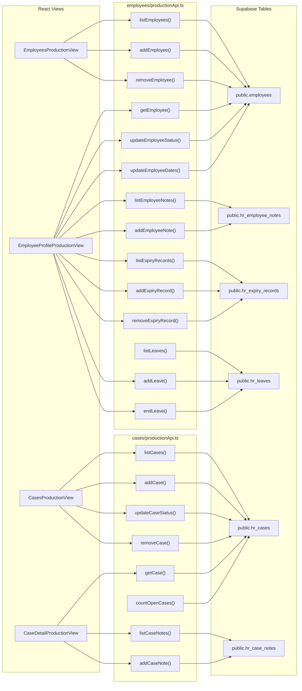
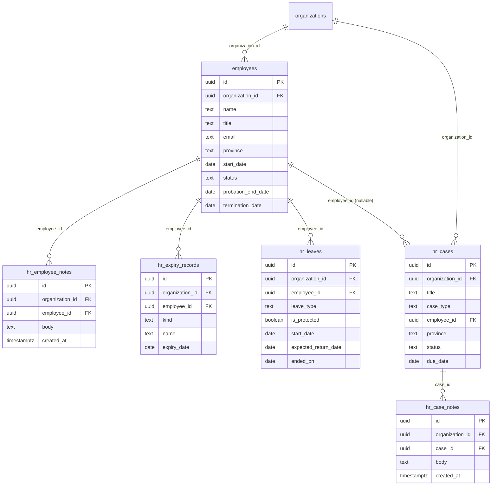
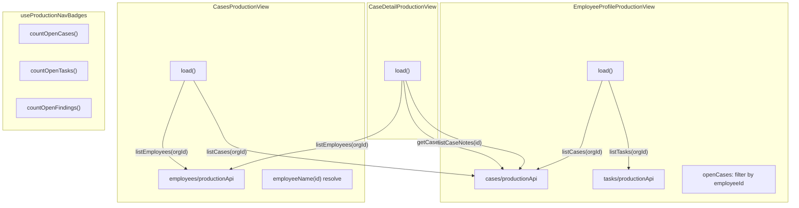

# Employees, Cases & HR Records

<details>
<summary>Relevant source files</summary>

The following files were used as context for generating this wiki page:

- [src/features/app/documents/api.test.ts](src/features/app/documents/api.test.ts)
- [src/features/app/documents/api.ts](src/features/app/documents/api.ts)
- [src/features/app/search/SearchOverlay.tsx](src/features/app/search/SearchOverlay.tsx)
- [src/features/app/views/cases/CaseDetailProductionView.tsx](src/features/app/views/cases/CaseDetailProductionView.tsx)
- [src/features/app/views/cases/CaseDetailView.tsx](src/features/app/views/cases/CaseDetailView.tsx)
- [src/features/app/views/cases/CasesProductionView.tsx](src/features/app/views/cases/CasesProductionView.tsx)
- [src/features/app/views/cases/CasesView.test.tsx](src/features/app/views/cases/CasesView.test.tsx)
- [src/features/app/views/cases/CasesView.tsx](src/features/app/views/cases/CasesView.tsx)
- [src/features/app/views/cases/NewCaseModal.tsx](src/features/app/views/cases/NewCaseModal.tsx)
- [src/features/app/views/cases/caseDetailTabs.tsx](src/features/app/views/cases/caseDetailTabs.tsx)
- [src/features/app/views/cases/caseModel.ts](src/features/app/views/cases/caseModel.ts)
- [src/features/app/views/cases/productionApi.test.ts](src/features/app/views/cases/productionApi.test.ts)
- [src/features/app/views/cases/productionApi.ts](src/features/app/views/cases/productionApi.ts)
- [src/features/app/views/communications/CommunicationsView.tsx](src/features/app/views/communications/CommunicationsView.tsx)
- [src/features/app/views/compensation/CompensationView.tsx](src/features/app/views/compensation/CompensationView.tsx)
- [src/features/app/views/employees/EmployeeDrawer.tsx](src/features/app/views/employees/EmployeeDrawer.tsx)
- [src/features/app/views/employees/EmployeeProfileProductionView.tsx](src/features/app/views/employees/EmployeeProfileProductionView.tsx)
- [src/features/app/views/employees/EmployeeProfileView.tsx](src/features/app/views/employees/EmployeeProfileView.tsx)
- [src/features/app/views/employees/EmployeesView.test.tsx](src/features/app/views/employees/EmployeesView.test.tsx)
- [src/features/app/views/employees/EmployeesView.tsx](src/features/app/views/employees/EmployeesView.tsx)
- [src/features/app/views/employees/OrgChart.tsx](src/features/app/views/employees/OrgChart.tsx)
- [src/features/app/views/employees/employeeProfileTabs.tsx](src/features/app/views/employees/employeeProfileTabs.tsx)
- [src/features/app/views/employees/productionApi.test.ts](src/features/app/views/employees/productionApi.test.ts)
- [src/features/app/views/employees/productionApi.ts](src/features/app/views/employees/productionApi.ts)
- [src/features/app/views/home/HomePriorityQueue.tsx](src/features/app/views/home/HomePriorityQueue.tsx)
- [src/features/app/views/home/HomeWorkflowCatalog.tsx](src/features/app/views/home/HomeWorkflowCatalog.tsx)
- [src/features/app/views/policies/PoliciesProductionView.tsx](src/features/app/views/policies/PoliciesProductionView.tsx)
- [src/features/app/views/tasks/productionApi.test.ts](src/features/app/views/tasks/productionApi.test.ts)
- [src/features/app/views/tasks/productionApi.ts](src/features/app/views/tasks/productionApi.ts)
- [src/features/app/views/wellbeing/WellbeingView.tsx](src/features/app/views/wellbeing/WellbeingView.tsx)
- [src/features/app/views/workflows/WorkflowsView.tsx](src/features/app/views/workflows/WorkflowsView.tsx)
- [src/i18n/messages/cases.ts](src/i18n/messages/cases.ts)
- [src/i18n/messages/employees.ts](src/i18n/messages/employees.ts)
- [supabase/migrations/0009_add_hr_case_notes.sql](supabase/migrations/0009_add_hr_case_notes.sql)
- [supabase/migrations/0021_drop_doclib_demo_schema.sql](supabase/migrations/0021_drop_doclib_demo_schema.sql)

</details>

This page covers the two core HR record-keeping modules — **Employees** and **Cases** — and the data boundary layer that connects them to production persistence. Both modules follow the platform's dual-mode architecture: a fixture-driven **demo mode** renders rich prototype data for Northgate scenarios, while **production mode** reads/writes real Supabase tables behind RLS-scoped APIs.

## Routing & Mode Dispatch

Both modules register route entries in `appViews.tsx` without a `gated()` wrapper — they dispatch on workspace mode internally.

| Route                        | Lazy component        | Comment                     |
| ---------------------------- | --------------------- | --------------------------- |
| `/app/employees`             | `EmployeesView`       | [src/app/appViews.tsx:85]() |
| `/app/employees/:employeeId` | `EmployeeProfileView` | [src/app/appViews.tsx:86]() |
| `/app/cases`                 | `CasesView`           | [src/app/appViews.tsx:81]() |
| `/app/cases/:caseId`         | `CaseDetailView`      | [src/app/appViews.tsx:82]() |

Each top-level component checks `useWorkspaceMode().mode` and renders either the demo or production variant:

```
// EmployeesView — src/features/app/views/employees/EmployeesView.tsx:28-30
if (workspaceMode === 'production') return <EmployeesProductionView />
return <EmployeesDemoView />
```

**Mode dispatch diagram**

```mermaid
flowchart TD
    subgraph EmployeesRoute["/app/employees"]
        EV["EmployeesView"]
        EV -->|"mode === demo"| EDV["EmployeesDemoView"]
        EV -->|"mode === production"| EPV["EmployeesProductionView"]
    end
    subgraph EmployeeProfileRoute["/app/employees/:employeeId"]
        EPrV["EmployeeProfileView"]
        EPrV -->|"mode === demo"| EPrDV["EmployeeProfileDemoView"]
        EPrV -->|"mode === production"| EPrPV["EmployeeProfileProductionView"]
    end
    subgraph CasesRoute["/app/cases"]
        CV["CasesView"]
        CV -->|"mode === demo"| CDV["CasesDemoView"]
        CV -->|"mode === production"| CPV["CasesProductionView"]
    end
    subgraph CaseDetailRoute["/app/cases/:caseId"]
        CDtV["CaseDetailView"]
        CDtV -->|"mode === demo"| CDtDV["CaseDetailDemoView"]
        CDtV -->|"mode === production"| CDtPV["CaseDetailProductionView"]
    end
```



Sources: [src/features/app/views/employees/EmployeesView.tsx:27-31](), [src/features/app/views/employees/EmployeeProfileView.tsx:84-89](), [src/features/app/views/cases/CasesView.tsx:24-28](), [src/features/app/views/cases/CaseDetailView.tsx:65-69](), [src/app/appViews.tsx:81-86]()

---

## Employees Module

### EmployeesView (Demo)

`EmployeesDemoView` renders the Northgate fixture employees from `@/data` as a roster with a People/Org-chart segmented control. [src/features/app/views/employees/EmployeesView.tsx:33-37]()

Key features:

- **Segmented control**: `list` mode shows the table roster; `org` mode renders `OrgChart`. [src/features/app/views/employees/EmployeesView.tsx:37]()
- **Filter**: case-insensitive substring match on name, role, or province (localized). [src/features/app/views/employees/EmployeesView.tsx:43-50]()
- **Roster table** (desktop) and **stacked cards** (phone) — both in the DOM, toggled via CSS. [src/features/app/views/employees/EmployeesView.tsx:114-115]()
- **Ask Advisor** sparkle button per row — calls `useAskAdvisorAboutEmployee()` hook. [src/features/app/views/employees/EmployeesView.tsx:56-59]()
- Row click navigates to `/app/employees/${e.id}`. [src/features/app/views/employees/EmployeesView.tsx:55]()

Sources: [src/features/app/views/employees/EmployeesView.tsx:33-108]()

### EmployeesProductionView

`EmployeesProductionView` renders the real `public.employees` table via `productionApi.ts`. [src/features/app/views/employees/EmployeesProductionView.tsx:48]()

Features:

- **Employee list** with status chips (active / on_leave / terminated). [src/features/app/views/employees/EmployeesProductionView.tsx:22-26]()
- **Add employee form** (admin-gated) with name, title, email, province (13 Canadian provinces/territories), and start date fields. [src/features/app/views/employees/EmployeesProductionView.tsx:142-232]()
- **Remove employee** (admin-gated). [src/features/app/views/employees/EmployeesProductionView.tsx:97-105]()
- **Error/retry** banner for load failures. [src/features/app/views/employees/EmployeesProductionView.tsx:129-139]()
- **`ProductionEmptyState`** when no `organizationId`. [src/features/app/views/employees/EmployeesProductionView.tsx:76-78]()

Sources: [src/features/app/views/employees/EmployeesProductionView.tsx:48-283]()

### OrgChart

`OrgChart` renders in demo mode when the user selects the "Org chart" tab. It builds a reporting-line tree from `orgStructure` and `orgRoot` fixture data. [src/features/app/views/employees/OrgChart.tsx:47]()

- Displays **manager/report stat tiles** (counts). [src/features/app/views/employees/OrgChart.tsx:53-54]()
- Shows an **Advisor reporting-line watch** gold banner when a manager is offboarding. [src/features/app/views/employees/OrgChart.tsx:58-64]()
- Renders the workspace root node and one visual column per `OrgBranchNode` (manager → reports). [src/features/app/views/employees/OrgChart.tsx:97-169]()
- Each node is clickable → navigates to `openProfile(id)`. [src/features/app/views/employees/OrgChart.tsx:51]()

Sources: [src/features/app/views/employees/OrgChart.tsx:1-172]()

### EmployeeDrawer

A 400px right-hand slide-over for quick employee preview. Controlled component: hosts provide `employee` and `onClose`. [src/features/app/views/employees/EmployeeDrawer.tsx:26]()

- Renders identity header (initials, name, role, province, status). [src/features/app/views/employees/EmployeeDrawer.tsx:62-72]()
- Shows the Advisor insight line and a `RiskFlagCard` when a risk flag exists. [src/features/app/views/employees/EmployeeDrawer.tsx:76-99]()
- "Open full case" action navigates to `/app/advisor` with `{ chatId }` state. [src/features/app/views/employees/EmployeeDrawer.tsx:88-93]()
- "Ask Advisor about {name}" CTA at the bottom. [src/features/app/views/employees/EmployeeDrawer.tsx:103-112]()
- Uses `useEscapeToClose` for Escape key dismissal. [src/features/app/views/employees/EmployeeDrawer.tsx:32]()

Sources: [src/features/app/views/employees/EmployeeDrawer.tsx:1-117]()

### EmployeeProfileView

The employee profile hub has eight tabs, three of which are role-restricted (marked `locked`).

| Tab          | Component                 | Locked |
| ------------ | ------------------------- | ------ |
| overview     | `EmployeeOverviewTab`     | No     |
| timeline     | `EmployeeTimelineTab`     | No     |
| documents    | `EmployeeDocumentsTab`    | No     |
| leave        | `EmployeeLeaveTab`        | Yes    |
| compensation | `EmployeeCompensationTab` | Yes    |
| wellbeing    | `EmployeeWellbeingTab`    | Yes    |
| compliance   | `EmployeeComplianceTab`   | No     |
| cases        | `EmployeeCasesTab`        | No     |

Tab definitions at [src/features/app/views/employees/EmployeeProfileView.tsx:50-59](). Tab bodies are pure renderers in `employeeProfileTabs.tsx`. [src/features/app/views/employees/employeeProfileTabs.tsx:1-29]()

**Demo mode** (`EmployeeProfileDemoView`) resolves employee/detail from fixtures, composes a timeline, maps the governing statute per jurisdiction (`STATUTES` map), and pins the employee as the Advisor's workspace context via `setContext(contextFromEmployee(...))`. [src/features/app/views/employees/EmployeeProfileView.tsx:91-113]()

Deep-link support: other modules navigate here with `{ tab: 'compensation' }` in router state. [src/features/app/views/employees/EmployeeProfileView.tsx:73-82]()

Sources: [src/features/app/views/employees/EmployeeProfileView.tsx:40-59](), [src/features/app/views/employees/employeeProfileTabs.tsx:81-153]()

### EmployeeProfileProductionView

The production profile renders a single `public.employees` row with several sub-records loaded in parallel. [src/features/app/views/employees/EmployeeProfileProductionView.tsx:91]()

Parallel load on mount via `Promise.all`:

```
[employee, notes, cases, expiryRecords, leaves, tasks]
```

[src/features/app/views/employees/EmployeeProfileProductionView.tsx:124-132]()

Sections:

- **Facts header** with initials avatar, name, title, province, start date. [src/features/app/views/employees/EmployeeProfileProductionView.tsx:91-95]()
- **Status select** — three-way (active / on_leave / terminated) with `updateEmployeeStatus`. [src/features/app/views/employees/EmployeeProfileProductionView.tsx:157-166]()
- **Lifecycle dates** — probation end date (with linked review task via `addProbationReviewTask`) and termination date via `updateEmployeeDates`. [src/features/app/views/employees/EmployeeProfileProductionView.tsx:168-178]()
- **Expiry records** (certifications & dated documents) — add/remove via `hr_expiry_records`. [src/features/app/views/employees/EmployeeProfileProductionView.tsx:107-110]()
- **Leave records** — add/end leave via `hr_leaves`, status-only (never medical detail). [src/features/app/views/employees/EmployeeProfileProductionView.tsx:113-117]()
- **Open cases** for this employee filtered from `listCases`. [src/features/app/views/employees/EmployeeProfileProductionView.tsx:139]()
- **Notes thread** — `hr_employee_notes` with add-note composer. [src/features/app/views/employees/EmployeeProfileProductionView.tsx:104]()

Sources: [src/features/app/views/employees/EmployeeProfileProductionView.tsx:91-195]()

### useAskAdvisorAboutEmployee

A hook returning a callback `(emp: Employee) => void` that opens the `AdvisorRail` with the employee's insight line and risk-flag card. If a risk flag has a backing `chatId`, the "Open full case" action navigates to `/app/advisor`. [src/features/app/views/employees/useAskAdvisorAboutEmployee.ts:14-55]()

Sources: [src/features/app/views/employees/useAskAdvisorAboutEmployee.ts:14-55]()

---

## Cases Module

### CasesView (Demo)

`CasesDemoView` lists cases from the `caseModel.ts` in-memory store (fixture + session-created). [src/features/app/views/cases/CasesView.tsx:30]()

- Shows open-count header and a **New case** button. [src/features/app/views/cases/CasesView.tsx:52-63]()
- Each case card renders title, type/province/owner/opened meta, status chip, summary, and step-progress bar. [src/features/app/views/cases/CasesView.tsx:67-106]()
- Row click navigates to `/app/cases/:caseId`. [src/features/app/views/cases/CasesView.tsx:39]()
- "New case" opens `NewCaseModal`; on create, prepends, navigates to detail, and toasts. [src/features/app/views/cases/CasesView.tsx:42-47]()

Sources: [src/features/app/views/cases/CasesView.tsx:24-116]()

### CasesProductionView

`CasesProductionView` reads from `public.hr_cases` (migration 0007). Loads both cases and the employee roster for cross-referencing. [src/features/app/views/cases/CasesProductionView.tsx:62]()

- **Create case form** with title, case type (Termination/Performance/Accommodation/Onboarding), employee (linked from real roster), province, and due date. [src/features/app/views/cases/CasesProductionView.tsx:173-278]()
- **Inline status change** via dropdown per row. [src/features/app/views/cases/CasesProductionView.tsx:118-126]()
- **Remove case** button per row. [src/features/app/views/cases/CasesProductionView.tsx:128-136]()
- Employee name resolution from the loaded roster. [src/features/app/views/cases/CasesProductionView.tsx:98-99]()

Sources: [src/features/app/views/cases/CasesProductionView.tsx:62-352]()

### CaseDetailView (Demo)

`CaseDetailDemoView` renders a rich case workspace with five tabs:

| Tab key    | Component         | Content                                                                                                                                           |
| ---------- | ----------------- | ------------------------------------------------------------------------------------------------------------------------------------------------- |
| `overview` | `CaseOverviewTab` | Summary, Advisor recommendation, risk assessment, workflow steps, timeline, people involved, approvals, linked tasks, documents, compliance flags |
| `risk`     | `CaseRiskTab`     | Six-axis risk review (coverage, notice, documentation, consistency, retaliation, cost/timeline)                                                   |
| `legal`    | `CaseLegalTab`    | Legal review record (counsel, scope, retention, outcome)                                                                                          |
| `activity` | `CaseActivityTab` | Composed activity feed                                                                                                                            |
| `notes`    | `CaseNotesTab`    | Private notes composer with ⌘↵ save shortcut                                                                                                      |

Tab bodies are pure renderers in `caseDetailTabs.tsx`. [src/features/app/views/cases/caseDetailTabs.tsx:28]()

The demo view uses case-type–driven risk/recommendation lookup via `caseRiskByType`, `caseRecommendationByType`, and `caseRiskAxesByType` from `@/data`; non-fixture types fall back to pending state. [src/features/app/views/cases/CaseDetailView.tsx:161-166]()

Workspace context is pinned when a case opens (`setContext(contextFromEmployee(emp, caze.typeLabel, 'case'))`). [src/features/app/views/cases/CaseDetailView.tsx:148-150]()

Sources: [src/features/app/views/cases/CaseDetailView.tsx:65-186](), [src/features/app/views/cases/caseDetailTabs.tsx:81-184]()

### CaseDetailProductionView

Renders a single `public.hr_cases` row with facts header, inline status select, and a `hr_case_notes` thread. [src/features/app/views/cases/CaseDetailProductionView.tsx:48]()

Load sequence: `Promise.all([getCase(caseId), listCaseNotes(caseId)])`, followed by employee name resolution. [src/features/app/views/cases/CaseDetailProductionView.tsx:65-66]()

State machine: `loading | ready | missing | failed`. [src/features/app/views/cases/CaseDetailProductionView.tsx:57]()

Sources: [src/features/app/views/cases/CaseDetailProductionView.tsx:48-250]()

### NewCaseModal

The demo-mode intake modal for creating cases. [src/features/app/views/cases/NewCaseModal.tsx:30]()

Fields:

- **Case type** — 12 options from `newCaseTypes` in `caseModel.ts`. [src/features/app/views/cases/caseModel.ts:153-172]()
- **Employee** — from fixture list, or "No specific employee" for workplace-wide cases. [src/features/app/views/cases/NewCaseModal.tsx:124-136]()
- **Jurisdiction** — 5 options (Ontario, Quebec, BC, Alberta, Federal). [src/features/app/views/cases/caseModel.ts:175-181]()
- **Title** (optional) — falls back to `{type} — {employee}`. [src/features/app/views/cases/caseModel.ts:237-241]()

Sensitive case types display a gold lock banner: Termination, Discipline, Harassment/workplace investigation, Complaint, Compensation review. [src/features/app/views/cases/caseModel.ts:184-190]()

Uses `buildCreatedCase()` to produce a `WorkspaceCase` with intake-stage defaults. [src/features/app/views/cases/caseModel.ts:233-264]()

Sources: [src/features/app/views/cases/NewCaseModal.tsx:30-204](), [src/features/app/views/cases/caseModel.ts:153-264]()

### caseModel.ts

The view-model layer for the case workspace. Key exports:

| Export                                                      | Purpose                                                              |
| ----------------------------------------------------------- | -------------------------------------------------------------------- |
| `WorkspaceCase`                                             | Interface consumed by all case views                                 |
| `isFixtureCaseType(type)`                                   | Guards the four fixture types vs. the 12 intake types                |
| `barToneClass(tone)`                                        | Progress-bar CSS class per tone                                      |
| `activityDotClass(tone)`                                    | Activity-feed dot CSS class                                          |
| `riskLevelTone(level)`                                      | Maps `RiskLevel` → `Tone`                                            |
| `timelineDotClass(kind, tone)`                              | Timeline dot CSS based on event kind and tone                        |
| `pendingRisk` / `pendingRecommendation` / `pendingRiskAxes` | Fallback states for non-fixture case types                           |
| `newCaseTypes`                                              | 12 bilingual case type options                                       |
| `newCaseJurisdictions`                                      | 5 bilingual jurisdiction options                                     |
| `sensitiveCaseTypes`                                        | Case types requiring restricted access                               |
| `buildCreatedCase(input)`                                   | Constructs intake-stage `WorkspaceCase`                              |
| `listCases()` / `findCase(id)` / `addCreatedCase(c)`        | In-memory store (session-scoped) merging created cases with fixtures |

Sources: [src/features/app/views/cases/caseModel.ts:1-287]()

---

## Production API Boundary Layer

Each module has a `productionApi.ts` file that forms the data boundary between the UI and Supabase. All follow the same contract:

1. **Zod-validated rows** — every row from Supabase passes through a `z.object(...)` schema before reaching the UI.
2. **Throws on failure** — unlike the workspace-mode API which degrades silently, these APIs throw on error since they only run for signed-in admins.
3. **`supabase` null guard** — every function starts with `if (!supabase) throw new Error('Supabase is not configured')`.
4. **camelCase mapping** — a `toX()` function converts snake_case DB rows to camelCase TypeScript interfaces.

**Production API boundary diagram**



Sources: [src/features/app/views/employees/productionApi.ts:1-405](), [src/features/app/views/cases/productionApi.ts:1-185]()

### Employees productionApi.ts

Located at `src/features/app/views/employees/productionApi.ts`. Reads/writes `public.employees` (migration 0006).

**Core types:**

- `ProductionEmployeeStatus`: `'active' | 'on_leave' | 'terminated'` [src/features/app/views/employees/productionApi.ts:15]()
- `ProductionEmployee`: id, name, title, email, province, startDate, status, probationEndDate, terminationDate [src/features/app/views/employees/productionApi.ts:17-29]()
- `NewEmployee`: name, title, email, province, startDate [src/features/app/views/employees/productionApi.ts:31-37]()

**Functions:**

| Function                                                        | Table               | Operation                                                                                                       |
| --------------------------------------------------------------- | ------------------- | --------------------------------------------------------------------------------------------------------------- |
| `listEmployees(orgId)`                                          | `employees`         | SELECT with `fetchAllPages`, ordered by name [src/features/app/views/employees/productionApi.ts:70-83]()        |
| `addEmployee(orgId, fields)`                                    | `employees`         | INSERT, returns created row [src/features/app/views/employees/productionApi.ts:85-104]()                        |
| `removeEmployee(id)`                                            | `employees`         | DELETE by id [src/features/app/views/employees/productionApi.ts:106-110]()                                      |
| `getEmployee(id)`                                               | `employees`         | SELECT single, returns null if missing [src/features/app/views/employees/productionApi.ts:127-137]()            |
| `updateEmployeeStatus(id, status)`                              | `employees`         | UPDATE status + updated_at [src/features/app/views/employees/productionApi.ts:139-149]()                        |
| `updateEmployeeDates(id, dates)`                                | `employees`         | UPDATE probation_end_date and/or termination_date [src/features/app/views/employees/productionApi.ts:155-165]() |
| `listEmployeeNotes(employeeId)`                                 | `hr_employee_notes` | SELECT ordered by created_at [src/features/app/views/employees/productionApi.ts:357-369]()                      |
| `addEmployeeNote(orgId, empId, body)`                           | `hr_employee_notes` | INSERT [src/features/app/views/employees/productionApi.ts:371-385]()                                            |
| `listExpiryRecords(orgId)` / `listEmployeeExpiryRecords(empId)` | `hr_expiry_records` | SELECT with joined employee name [src/features/app/views/employees/productionApi.ts:206-228]()                  |
| `addExpiryRecord(orgId, empId, fields)`                         | `hr_expiry_records` | INSERT [src/features/app/views/employees/productionApi.ts:230-249]()                                            |
| `removeExpiryRecord(id)`                                        | `hr_expiry_records` | DELETE [src/features/app/views/employees/productionApi.ts:251-255]()                                            |
| `listLeaves(orgId)` / `listEmployeeLeaves(empId)`               | `hr_leaves`         | SELECT with joined employee name [src/features/app/views/employees/productionApi.ts:298-318]()                  |
| `addLeave(orgId, empId, fields)`                                | `hr_leaves`         | INSERT [src/features/app/views/employees/productionApi.ts:320-345]()                                            |
| `endLeave(id, endedOn)`                                         | `hr_leaves`         | UPDATE ended_on [src/features/app/views/employees/productionApi.ts:348-355]()                                   |

The file also exports `EMPLOYMENT_PROVINCES` — 13 bilingual Canadian province/territory options. [src/features/app/views/employees/productionApi.ts:391-405]()

Sources: [src/features/app/views/employees/productionApi.ts:1-405]()

### Cases productionApi.ts

Located at `src/features/app/views/cases/productionApi.ts`. Reads/writes `public.hr_cases` (migration 0007) and `public.hr_case_notes` (migration 0009).

**Core types:**

- `ProductionCaseType`: `'Termination' | 'Performance' | 'Accommodation' | 'Onboarding'` [src/features/app/views/cases/productionApi.ts:12]()
- `ProductionCaseStatus`: `'open' | 'in_review' | 'resolved'` [src/features/app/views/cases/productionApi.ts:13]()
- `ProductionCase`: id, title, caseType, employeeId, province, status, dueDate, createdAt [src/features/app/views/cases/productionApi.ts:28-38]()
- `ProductionCaseNote`: id, body, createdAt [src/features/app/views/cases/productionApi.ts:120-125]()

**Functions:**

| Function                           | Table           | Operation                                                                                        |
| ---------------------------------- | --------------- | ------------------------------------------------------------------------------------------------ |
| `listCases(orgId)`                 | `hr_cases`      | SELECT ordered by created_at desc [src/features/app/views/cases/productionApi.ts:74-83]()        |
| `addCase(orgId, fields)`           | `hr_cases`      | INSERT, returns created row [src/features/app/views/cases/productionApi.ts:85-101]()             |
| `updateCaseStatus(id, status)`     | `hr_cases`      | UPDATE status + updated_at [src/features/app/views/cases/productionApi.ts:103-110]()             |
| `removeCase(id)`                   | `hr_cases`      | DELETE [src/features/app/views/cases/productionApi.ts:112-116]()                                 |
| `getCase(id)`                      | `hr_cases`      | SELECT single, returns null if missing [src/features/app/views/cases/productionApi.ts:133-143]() |
| `listCaseNotes(caseId)`            | `hr_case_notes` | SELECT ordered by created_at [src/features/app/views/cases/productionApi.ts:145-157]()           |
| `addCaseNote(orgId, caseId, body)` | `hr_case_notes` | INSERT [src/features/app/views/cases/productionApi.ts:159-173]()                                 |
| `countOpenCases(orgId)`            | `hr_cases`      | HEAD count excluding resolved [src/features/app/views/cases/productionApi.ts:176-185]()          |

Sources: [src/features/app/views/cases/productionApi.ts:1-185]()

### Nav Badges

`useProductionNavBadges` calls `countOpenCases`, `countOpenTasks`, and `countOpenFindings` on every route change to populate sidebar badge counts. [src/features/app/workspaceMode/useProductionNavBadges.ts:18-55]()

Sources: [src/features/app/workspaceMode/useProductionNavBadges.ts:1-55]()

---

## Database Schema

Six tables underpin the employees and cases modules. All use `organization_id` FK for multi-tenancy, RLS via `is_org_member()` (SELECT) and `is_org_admin()` (INSERT/UPDATE/DELETE), and UUID primary keys.

**Database entity-relationship diagram**



### Migration History

| Migration                               | Table               | Purpose                                                                                                                     |
| --------------------------------------- | ------------------- | --------------------------------------------------------------------------------------------------------------------------- |
| `0006_add_employees.sql`                | `employees`         | Employee roster [supabase/migrations/0006_add_employees.sql:1-49]()                                                         |
| `0007_add_hr_cases.sql`                 | `hr_cases`          | Case files, FK to employees with SET NULL on delete [supabase/migrations/0007_add_hr_cases.sql:1-45]()                      |
| `0009_add_hr_case_notes.sql`            | `hr_case_notes`     | Case notes thread, cascades with case [supabase/migrations/0009_add_hr_case_notes.sql:1-33]()                               |
| `0010_add_hr_employee_notes.sql`        | `hr_employee_notes` | Employee notes thread, cascades with employee [supabase/migrations/0010_add_hr_employee_notes.sql:1-29]()                   |
| `0064_add_hr_expiry_records.sql`        | `hr_expiry_records` | Certifications & dated documents [supabase/migrations/0064_add_hr_expiry_records.sql:1-49]()                                |
| `0065_add_hr_leaves.sql`                | `hr_leaves`         | Leave records (status-only, never medical detail) [supabase/migrations/0065_add_hr_leaves.sql:1-47]()                       |
| `0066_add_employee_lifecycle_dates.sql` | `employees` (ALTER) | Adds `probation_end_date` and `termination_date` columns [supabase/migrations/0066_add_employee_lifecycle_dates.sql:1-18]() |

### RLS Pattern

All tables use the same RLS posture:

```sql
-- SELECT: any active org member
USING (public.is_org_member(organization_id, (select auth.uid())))

-- INSERT/UPDATE/DELETE: org owners/admins only
WITH CHECK (public.is_org_admin(organization_id, (select auth.uid())))
```

`hr_case_notes` denormalizes `organization_id` from the parent case to avoid joins in RLS policies, a pattern documented in migration 0009. [supabase/migrations/0009_add_hr_case_notes.sql:6-8]()

Key design decisions:

- `hr_cases.employee_id` is **SET NULL** on employee deletion — a case file may outlive the employment record. [supabase/migrations/0007_add_hr_cases.sql:15]()
- `hr_case_notes` and `hr_employee_notes` **CASCADE** on parent deletion. [supabase/migrations/0009_add_hr_case_notes.sql:12]()
- `hr_leaves.leave_type` is unconstrained text — leave taxonomies vary by jurisdiction. [supabase/migrations/0065_add_hr_leaves.sql:7-8]()

Sources: [supabase/migrations/0006_add_employees.sql:1-49](), [supabase/migrations/0007_add_hr_cases.sql:1-45](), [supabase/migrations/0009_add_hr_case_notes.sql:1-33](), [supabase/migrations/0010_add_hr_employee_notes.sql:1-29](), [supabase/migrations/0064_add_hr_expiry_records.sql:1-49](), [supabase/migrations/0065_add_hr_leaves.sql:1-47](), [supabase/migrations/0066_add_employee_lifecycle_dates.sql:1-18]()

---

## i18n Message Modules

### employeesMessages

Defined in `src/i18n/messages/employees.ts` with the `employees_*` prefix. [src/i18n/messages/employees.ts:13]()

Coverage spans:

- **Roster** — tab labels, filter placeholder, column headers, status labels, sample count
- **Org chart** — manager/report stat labels, Advisor watch eyebrow
- **Quick drawer** — close, Ask Advisor CTA
- **Profile hub** — all 8 tab labels, record row labels, governing statute labels (ON/QC/BC/AB/FED), leave/compensation/wellbeing/compliance/cases section labels
- **Production** — status labels (active/on_leave/terminated), add/remove/save/cancel labels, empty state, error/retry, form field labels, lifecycle date labels, expiry record labels, leave record labels, probation review task labels, note labels

Sources: [src/i18n/messages/employees.ts:1-167]()

### casesMessages

Defined in `src/i18n/messages/cases.ts` with the `cases_*` prefix. [src/i18n/messages/cases.ts:15]()

Coverage spans:

- **List** — open count, New case button, owner/opened labels, progress bar
- **Detail chrome** — all 5 tab labels, risk assessment, workflow, timeline, people involved
- **Approvals** — target labels, request/requested states
- **Legal review** — counsel, scope, retention, outcome labels
- **Activity log** — requested approval label
- **Notes** — placeholder, add button, toast
- **New case modal** — heading, sub-text, field labels, sensitive-case banner, audit note, create/cancel
- **Pending states** — fallback risk/recommendation labels for non-fixture types
- **Production** — type labels (4 types), status labels (3 statuses), CRUD labels, notes section, error/retry, detail labels

Sources: [src/i18n/messages/cases.ts:1-165]()

---

## Fixture Data Layer

In demo mode, both modules read from `src/data/` fixtures.

### Employee Fixtures

The `Employee` type defines: id, name, initials, role (Bi), dept (Bi), province (Bi), status (Bi), tone, tenure (Bi), insight (Bi), and an optional `EmployeeRiskFlag` with tone/title/body/chatId. [src/data/types.ts:59-73]()

`EmployeeDetail` adds salary, band, market rate, manager, start date, timeline events, document keys, case ids, and leave records. [src/data/types.ts:98-114]()

`OrgBranch` defines reporting branches for the org chart (managerId, dept, reportIds). [src/data/types.ts:117-121]()

### Case Fixtures

`CaseFile` defines: id, title (Bi), type (CaseType union), empId, province, status, tone, owner, due, retention, chatId, summary, and workflow steps. [src/data/types.ts:159-181]()

`CaseRisk` has level/levelLabel/tone/factors. `CaseRiskAxis` covers the six risk review dimensions. `CaseNote` has text/author/time. [src/data/types.ts:183-204]()

Sources: [src/data/types.ts:49-204]()

---

## Cross-Module Interactions

**Employee ↔ Cases integration diagram**



Key cross-references:

- `EmployeeProfileProductionView` imports `listCases` from the cases productionApi to show open cases for the employee. [src/features/app/views/employees/EmployeeProfileProductionView.tsx:12]()
- `EmployeeProfileProductionView` imports `addProbationReviewTask` and `hasProbationReviewTask` from the tasks productionApi to create linked review tasks. [src/features/app/views/employees/EmployeeProfileProductionView.tsx:15-18]()
- `CasesProductionView` imports `listEmployees` from the employees productionApi for the employee picker and name resolution. [src/features/app/views/cases/CasesProductionView.tsx:12-13]()
- `CaseDetailProductionView` imports `listEmployees` for employee name resolution. [src/features/app/views/cases/CaseDetailProductionView.tsx:11]()
- `useProductionNavBadges` calls `countOpenCases` to show the badge on the Cases nav item. [src/features/app/workspaceMode/useProductionNavBadges.ts:3]()

Sources: [src/features/app/views/employees/EmployeeProfileProductionView.tsx:12-18](), [src/features/app/views/cases/CasesProductionView.tsx:12-13](), [src/features/app/views/cases/CaseDetailProductionView.tsx:11](), [src/features/app/workspaceMode/useProductionNavBadges.ts:3-4]()

---

## Testing

### EmployeesView Tests

`EmployeesView.test.tsx` validates both modes:

**Demo mode tests:**

- Roster renders fixture rows with names, roles, status chips, and "Showing 12 of 82" sample count. [src/features/app/views/employees/EmployeesView.test.tsx:20-29]()
- Filter matches by name/role/province and the empty-state clear button works. [src/features/app/views/employees/EmployeesView.test.tsx:31-44]()
- Org chart tab renders stats and the reporting-line watch note. [src/features/app/views/employees/EmployeesView.test.tsx:46-63]()
- Ask Advisor opens the rail with the employee insight and risk card. [src/features/app/views/employees/EmployeesView.test.tsx:73-93]()

**Production mode tests:**

- Render employees from a mocked `supabase.from('employees')` chain. [src/features/app/views/employees/EmployeesView.test.tsx:97-104]()
- Add employee via the inline form. [src/features/app/views/employees/EmployeesView.test.tsx:106-122]()

### productionApi Unit Tests

**employees/productionApi.test.ts**: Validates `listEmployees` returns camel-cased rows scoped to org, `addEmployee` nulls empty optionals, `removeEmployee` deletes by id, `getEmployee` returns null for missing IDs, and `updateEmployeeStatus`/note operations work correctly. [src/features/app/views/employees/productionApi.test.ts:1-153]()

**cases/productionApi.test.ts**: Validates listing, adding, status updates, removal, case notes, and open-case counting. Same per-test mock pattern: `vi.doMock('@/lib/supabaseClient')` + `vi.resetModules()` + dynamic `import('./productionApi')`. [src/features/app/views/cases/productionApi.test.ts:1-45]() (referenced from pre-read file list)

**tasks/productionApi.test.ts**: Validates listing (with `done` derivation), adding, toggling done/open, and counting open tasks. [src/features/app/views/tasks/productionApi.test.ts:1-118]()

Sources: [src/features/app/views/employees/EmployeesView.test.tsx:1-95](), [src/features/app/views/employees/productionApi.test.ts:1-153](), [src/features/app/views/tasks/productionApi.test.ts:1-118]()

---

## Supporting Components

### RiskFlagCard

A reusable card rendering an employee's risk flag with tone-styled border, dot, title, body, and action buttons. Used by both `EmployeeOverviewTab` and `EmployeeDrawer`. [src/features/app/views/employees/RiskFlagCard.tsx:26-59]()

Props: `tone`, `title` (LText), `body` (LText), and optional `actions` array of `RiskFlagAction` (label + onClick + optional primary flag). [src/features/app/views/employees/RiskFlagCard.tsx:13-24]()

### Chip Utilities

Both modules use shared chip class helpers from `@/components/chips`:

- `statusChipClass(tone)` — for status badges (e.g., Active, Offboarding, Open, Resolved)
- `sourceChipClass(tone)` — for source/category chips (e.g., timeline source labels, org chart department)
- `dotToneClass(tone)` — for small status dots

Sources: [src/features/app/views/employees/RiskFlagCard.tsx:1-59](), [src/features/app/views/employees/EmployeesView.tsx:10](), [src/features/app/views/cases/CasesView.tsx:8]()

---

## File Inventory

| Path                                                                 | Purpose                                 |
| -------------------------------------------------------------------- | --------------------------------------- |
| `src/features/app/views/employees/EmployeesView.tsx`                 | Employees list (mode dispatch)          |
| `src/features/app/views/employees/EmployeesProductionView.tsx`       | Production employees roster             |
| `src/features/app/views/employees/EmployeeProfileView.tsx`           | Employee profile (mode dispatch + demo) |
| `src/features/app/views/employees/EmployeeProfileProductionView.tsx` | Production employee profile             |
| `src/features/app/views/employees/employeeProfileTabs.tsx`           | 8 profile tab renderers                 |
| `src/features/app/views/employees/OrgChart.tsx`                      | Org chart mode                          |
| `src/features/app/views/employees/EmployeeDrawer.tsx`                | Quick-peek drawer                       |
| `src/features/app/views/employees/useAskAdvisorAboutEmployee.ts`     | Ask Advisor hook                        |
| `src/features/app/views/employees/RiskFlagCard.tsx`                  | Risk flag card component                |
| `src/features/app/views/employees/productionApi.ts`                  | Employees/notes/expiry/leaves API       |
| `src/features/app/views/employees/productionApi.test.ts`             | API unit tests                          |
| `src/features/app/views/employees/EmployeesView.test.tsx`            | View integration tests                  |
| `src/features/app/views/cases/CasesView.tsx`                         | Cases list (mode dispatch)              |
| `src/features/app/views/cases/CasesProductionView.tsx`               | Production cases list                   |
| `src/features/app/views/cases/CaseDetailView.tsx`                    | Case detail (mode dispatch + demo)      |
| `src/features/app/views/cases/CaseDetailProductionView.tsx`          | Production case detail                  |
| `src/features/app/views/cases/caseDetailTabs.tsx`                    | 5 case-detail tab renderers             |
| `src/features/app/views/cases/caseModel.ts`                          | Case view model + new-case builder      |
| `src/features/app/views/cases/NewCaseModal.tsx`                      | New case intake modal                   |
| `src/features/app/views/cases/productionApi.ts`                      | Cases/notes API                         |
| `src/i18n/messages/employees.ts`                                     | Employees i18n messages                 |
| `src/i18n/messages/cases.ts`                                         | Cases i18n messages                     |
| `supabase/migrations/0006_add_employees.sql`                         | employees table                         |
| `supabase/migrations/0007_add_hr_cases.sql`                          | hr_cases table                          |
| `supabase/migrations/0009_add_hr_case_notes.sql`                     | hr_case_notes table                     |
| `supabase/migrations/0010_add_hr_employee_notes.sql`                 | hr_employee_notes table                 |
| `supabase/migrations/0064_add_hr_expiry_records.sql`                 | hr_expiry_records table                 |
| `supabase/migrations/0065_add_hr_leaves.sql`                         | hr_leaves table                         |
| `supabase/migrations/0066_add_employee_lifecycle_dates.sql`          | lifecycle date columns                  |

---
