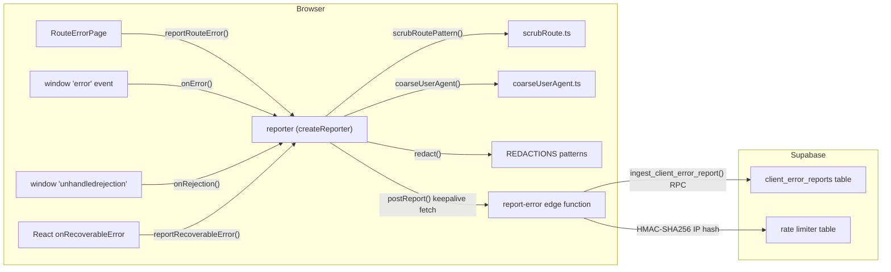
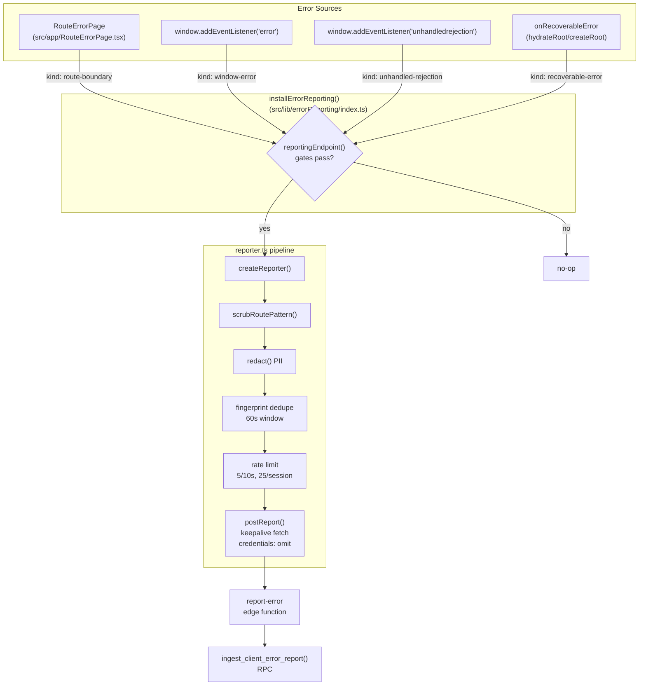
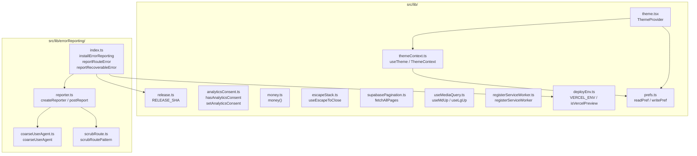

# Error Reporting, Theme & Shared Libraries

<details>
<summary>Relevant source files</summary>

The following files were used as context for generating this wiki page:

- [docs/ERROR_REPORTING.md](docs/ERROR_REPORTING.md)
- [index.html](index.html)
- [scripts/generate-doclib.mjs](scripts/generate-doclib.mjs)
- [src/app/RouteErrorPage.test.tsx](src/app/RouteErrorPage.test.tsx)
- [src/app/RouteErrorPage.tsx](src/app/RouteErrorPage.tsx)
- [src/features/app/toasts/toasts.test.tsx](src/features/app/toasts/toasts.test.tsx)
- [src/features/app/views/advisor/advisorHomeData.ts](src/features/app/views/advisor/advisorHomeData.ts)
- [src/features/app/views/home/HomeBriefHero.tsx](src/features/app/views/home/HomeBriefHero.tsx)
- [src/features/app/views/settings/SettingsView.tsx](src/features/app/views/settings/SettingsView.tsx)
- [src/features/app/views/settings/settingsData.ts](src/features/app/views/settings/settingsData.ts)
- [src/features/app/views/settings/settingsPrimitives.tsx](src/features/app/views/settings/settingsPrimitives.tsx)
- [src/i18n/i18n.test.tsx](src/i18n/i18n.test.tsx)
- [src/lib/errorReporting/index.test.ts](src/lib/errorReporting/index.test.ts)
- [src/lib/errorReporting/index.ts](src/lib/errorReporting/index.ts)
- [src/lib/errorReporting/reporter.test.ts](src/lib/errorReporting/reporter.test.ts)
- [src/lib/errorReporting/reporter.ts](src/lib/errorReporting/reporter.ts)
- [src/lib/registerServiceWorker.test.ts](src/lib/registerServiceWorker.test.ts)
- [src/lib/registerServiceWorker.ts](src/lib/registerServiceWorker.ts)
- [src/lib/theme.test.tsx](src/lib/theme.test.tsx)
- [src/lib/theme.tsx](src/lib/theme.tsx)
- [src/lib/themeContext.ts](src/lib/themeContext.ts)
- [src/main.tsx](src/main.tsx)
- [src/test/setup.ts](src/test/setup.ts)
- [supabase/functions/report-error/index.ts](supabase/functions/report-error/index.ts)
- [supabase/migrations/0028_add_recoverable_error_kind.sql](supabase/migrations/0028_add_recoverable_error_kind.sql)

</details>

This page covers the cross-cutting client infrastructure: the privacy-first error reporting pipeline, the light/dark theme system, and the shared utility libraries that multiple features depend on.

## Error Reporting Pipeline

The error reporting subsystem captures client-side crashes — render errors, unhandled exceptions, and promise rejections — and sends privacy-scrubbed payloads to a Supabase edge function. It is designed as **privacy-first** to align with PIPEDA and Quebec Law 25 posture: no DOM snapshots, no breadcrumbs, no auth tokens, no persistent user identifiers, and no full user-agent strings are ever sent.

### Architecture Overview

**Error reporting data flow**



Sources: [src/lib/errorReporting/index.ts:1-114](), [src/lib/errorReporting/reporter.ts:1-221](), [supabase/functions/report-error/index.ts:1-249](), [src/app/RouteErrorPage.tsx:45-51](), [src/main.tsx:6-12]()

### Installation & Gating (`index.ts`)

`installErrorReporting()` is called once from `src/main.tsx` before the app renders, so early crashes are captured. It is **inert** unless all three gates pass:

| Gate                | Check                                        | Effect when absent                            |
| ------------------- | -------------------------------------------- | --------------------------------------------- |
| Browser environment | `typeof window !== 'undefined'`              | Prevents firing during SSR/prerender          |
| Vercel deploy env   | `VERCEL_ENV === 'production' \|\| 'preview'` | No-op in dev, tests, or `development` deploys |
| Supabase URL        | `VITE_SUPABASE_URL` is set                   | Cannot derive endpoint without it             |

The `VERCEL_ENV` value is baked in at build time via `vite.config.ts` `define` as `__VERCEL_ENV__` and read through `src/lib/deployEnv.ts`. Similarly, the commit SHA is baked as `__RELEASE_SHA__` and read via `src/lib/release.ts` to tag reports for source-map correlation.

[src/lib/errorReporting/index.ts:30-43]() — `reportingEndpoint()` derives the URL and appends `?forceFunctionRegion=ca-central-1` to pin Edge Function execution to Canada.

[src/lib/errorReporting/index.ts:71-79]() — `installErrorReporting()` creates the reporter singleton and registers `window.addEventListener('error', ...)` and `window.addEventListener('unhandledrejection', ...)`.

[src/lib/errorReporting/index.ts:86-88]() — `reportRouteError()` is called from `RouteErrorPage`'s `useEffect` for render errors React catches.

[src/lib/errorReporting/index.ts:102-109]() — `reportRecoverableError()` is wired as `onRecoverableError` on `hydrateRoot`/`createRoot` in `main.tsx`, capturing hydration mismatches with `componentStack`.

Sources: [src/lib/errorReporting/index.ts:16-43](), [src/lib/deployEnv.ts:1-25](), [src/lib/release.ts:1-16](), [src/main.tsx:12-32]()

### Reporter Core (`reporter.ts`)

`createReporter()` returns a `Reporter` with a single `report(input)` method. Each call goes through five stages:

1. **Route scrubbing** — `scrubRoutePattern(pathname)` converts the resolved URL to a pattern
2. **PII redaction** — `redact()` strips emails, UUIDs, and long hex strings from `message` and `stack`
3. **Fingerprint deduplication** — `kind|route|message|firstFrame` is used as a fingerprint; repeats within 60 seconds are suppressed
4. **Rate limiting** — max 5 reports per 10-second window, max 25 per session lifetime
5. **Transport** — `postReport()` sends via keepalive `fetch` with `credentials: 'omit'`

[src/lib/errorReporting/reporter.ts:70-79]() — constants for the limits:

| Constant           | Value      | Purpose                            |
| ------------------ | ---------- | ---------------------------------- |
| `MAX_MESSAGE`      | 1000 chars | Truncation cap on message          |
| `MAX_STACK`        | 4000 chars | Truncation cap on stack            |
| `DEDUPE_WINDOW_MS` | 60,000 ms  | Per-fingerprint suppression window |
| `RATE_WINDOW_MS`   | 10,000 ms  | Rolling rate window                |
| `MAX_PER_WINDOW`   | 5          | Max reports per rate window        |
| `MAX_TOTAL`        | 25         | Hard session cap                   |

The redaction patterns are defined at [src/lib/errorReporting/reporter.ts:94-98]():

```
email:  /[\w.+-]+@[\w-]+\.[\w.-]+/g           → '[email]'
UUID:   /\b[0-9a-f]{8}-...-[0-9a-f]{12}\b/gi  → '[id]'
hex≥16: /\b[0-9a-f]{16,}\b/gi                  → '[id]'
```

The wire payload type `ReportPayload` includes exactly eight fields: `env`, `release`, `route`, `locale`, `kind`, `message`, `stack`, `ua` — nothing else.

[src/lib/errorReporting/reporter.ts:150-168]() — `postReport()` uses `fetch` with `keepalive: true` and `credentials: 'omit'`. `navigator.sendBeacon` is deliberately avoided because it cannot omit credentials. The `Content-Type: text/plain;charset=UTF-8` is CORS-safelisted, avoiding a preflight.

Sources: [src/lib/errorReporting/reporter.ts:19-51](), [src/lib/errorReporting/reporter.ts:81-104](), [src/lib/errorReporting/reporter.ts:124-137](), [src/lib/errorReporting/reporter.ts:170-220]()

### Route Scrubbing (`scrubRoute.ts`)

`scrubRoutePattern()` implements **deny-by-default** route pattern matching. A hardcoded registry of ~70 known route patterns mirrors the app's routes. The algorithm:

1. Strip query string and hash
2. Split into segments
3. Match against all patterns (`:name` segments match any single value)
4. Prefer the match with the most static segments (most specific)
5. If no match: return `/app/:unknown` for app paths, `/unknown` otherwise

This is **position-aware**: `/app/employees/studio` correctly maps to `/app/employees/:id` (not the documents `studio` route), because the `employees` route has no static `studio` child.

[src/lib/errorReporting/scrubRoute.ts:27-102]() — the `ROUTE_PATTERNS` registry covers all public marketing routes (English and French), and all `/app` workspace routes.

[src/lib/errorReporting/scrubRoute.ts:120-155]() — `scrubRoutePattern()` is pure and total — it never throws, degrading to `/unknown` on any error.

Sources: [src/lib/errorReporting/scrubRoute.ts:1-155](), [src/lib/errorReporting/scrubRoute.test.ts:1-83]()

### User-Agent Reduction (`coarseUserAgent.ts`)

`coarseUserAgent()` reduces the full `navigator.userAgent` string to `Family/Major OS` (e.g. `Chrome/120 macOS`).

[src/lib/errorReporting/coarseUserAgent.ts:11-19]() — browser detection tries Edge, Opera, Samsung, Firefox (including `FxiOS`), Chrome (including `CriOS`), then Safari, in priority order. [src/lib/errorReporting/coarseUserAgent.ts:29-39]() — OS detection handles Windows, iOS (including iPadOS desktop mode), macOS, Android, ChromeOS, and Linux. Output is capped at 100 characters.

Sources: [src/lib/errorReporting/coarseUserAgent.ts:1-46]()

### Edge Function (`report-error`)

The `report-error` edge function is deployed with `verify_jwt=false` (unauthenticated). It re-validates every field server-side:

- **Route allow-list** — `KNOWN_ROUTES` set mirrors client-side patterns; anything not in the set is coerced to `/unknown` ([supabase/functions/report-error/index.ts:49-71]())
- **UA format check** — `COARSE_UA_RE` regex rejects anything that isn't already a coarse label ([supabase/functions/report-error/index.ts:79-80]())
- **Body size cap** — `readCappedText()` streams the body with a 64 KiB hard byte cap, cancelling the stream if exceeded ([supabase/functions/report-error/index.ts:111-144]())
- **IP rate limiting** — HMAC-SHA256 hashes the client IP with a secret pepper (`ERROR_REPORT_SALT`), stored in a short-retention limiter table; the RPC enforces 60 reports per 60-second window per IP ([supabase/functions/report-error/index.ts:148-149](), [supabase/functions/report-error/index.ts:162-175]())
- **Atomic ingest** — `ingest_client_error_report()` RPC handles check-and-insert in one transaction ([supabase/functions/report-error/index.ts:225-237]())

The function returns 204 for both accepted and dropped reports (the client ignores it), and 500 only on server misconfiguration.

Sources: [supabase/functions/report-error/index.ts:1-249]()

### Report Sources Integration

**Error report source integration map**



Sources: [src/main.tsx:6-32](), [src/app/RouteErrorPage.tsx:45-51](), [src/lib/errorReporting/index.ts:50-88]()

## Theme System

### ThemeProvider

The theme system supports `light` and `dark` modes, driven by a `data-theme` attribute on `<html>` that CSS custom properties key off.

[src/lib/themeContext.ts:4]() — `Theme` is typed as `'light' | 'dark'`. The context interface exposes `theme`, `setTheme`, and `toggleTheme`.

[src/lib/theme.tsx:40-67]() — `ThemeProvider` initializes with `useState<Theme>('dark')` for hydration safety (prerendered pages use `dark` as default). On mount, an effect reads the stored preference via `readTheme()` and applies it. This is visually a no-op because the inline script in `index.html` already set the same value before first paint.

[src/lib/theme.tsx:7-12]() — `readTheme()` checks `localStorage` via `readPref(THEME_KEY, '')` (the `THEME_KEY` is `'dutiva-theme'`). Falls back to `window.matchMedia('(prefers-color-scheme: dark)')` when no preference is stored.

[src/lib/theme.tsx:23-28]() — `applyThemeToDocument()` stamps `data-theme` on `<html>` and updates all `<meta name="theme-color">` tags with the resolved tint color (`#060f1e` for dark, `#f6f2e9` for light). This keeps iOS Safari's chrome area in sync.

[src/lib/themeContext.ts:30-38]() — `useTheme()` includes a **provider-less fallback**: in production, if rendered outside `ThemeProvider`, it reads the theme from `document.documentElement.dataset.theme` and can still flip it. In development it throws immediately (`ThemeProvider` required).

Sources: [src/lib/theme.tsx:1-67](), [src/lib/themeContext.ts:1-49](), [src/lib/theme.test.tsx:1-147]()

### No-Flash Inline Script

[index.html:69-107]() — An inline `<script>` runs before first paint to prevent a flash of wrong theme/language:

1. Reads `dutiva-theme` from `localStorage` (tolerating private mode)
2. Falls back to `prefers-color-scheme: dark` media query
3. Stamps `document.documentElement.dataset.theme`
4. Updates both `<meta name="theme-color">` tags to match
5. Sets `<html lang>` based on URL path (`/fr/...` → `fr-CA`, `/app` → stored `dutiva-lang`, else `en-CA`)

### Meta Theme-Color Tags

[index.html:45-46]() — Two `<meta name="theme-color">` tags are declared, media-scoped to light and dark OS preferences:

| Media                           | Color     | Purpose                        |
| ------------------------------- | --------- | ------------------------------ |
| `(prefers-color-scheme: light)` | `#f6f2e9` | Light mode Safari toolbar tint |
| `(prefers-color-scheme: dark)`  | `#060f1e` | Dark mode Safari toolbar tint  |

Both tags are re-pointed by the inline script and by `applyThemeToDocument()` on toggle, so the browser chrome follows the persisted theme even when it disagrees with the OS preference.

Sources: [index.html:40-107]()

## Shared Libraries

### `prefs.ts` — Safe localStorage

[src/lib/prefs.ts:1-16]() — Two functions, `readPref(key, fallback)` and `writePref(key, value)`, wrap `localStorage` access in try/catch. This handles private browsing mode, SSR (no `localStorage`), and quota errors without throwing. Used by `ThemeProvider`, `analyticsConsent`, and other persistence points.

Sources: [src/lib/prefs.ts:1-16]()

### `analyticsConsent.ts` — Quebec Law 25 Opt-In

[src/lib/analyticsConsent.ts:1-77]() — The single source of truth for optional analytics consent. Three functions:

| Function                                 | Returns   | Default                  |
| ---------------------------------------- | --------- | ------------------------ |
| `hasAnalyticsConsent(storage?)`          | `boolean` | `false` (off by default) |
| `setAnalyticsConsent(granted, storage?)` | `void`    | —                        |
| `hasConsentResponse(storage?)`           | `boolean` | `false` (not yet asked)  |

Consent state is stored under `dutiva.analytics.consent` in `localStorage`. Two consumers gate on it: Google Analytics 4 tag loading and first-party support analytics (`trackEvent()`). The off-by-default posture satisfies Quebec Law 25 (s. 8.1) — analytics stays inert until the visitor explicitly opts in via the `ConsentBanner`.

Sources: [src/lib/analyticsConsent.ts:27-77](), [src/lib/analyticsConsent.test.ts:1-43]()

### `money.ts` — Bilingual CAD Formatting

[src/lib/money.ts:1-13]() — `money(amount)` returns a `Bi` (bilingual) object:

- English: `$118,000` (comma-grouped, leading `$`)
- French: `118 000 $` (space-grouped, trailing `$`)

Rendered with `x(money(n))` through the i18n system.

Sources: [src/lib/money.ts:1-13]()

### `escapeStack.ts` — Overlay Escape Key Coordination

[src/lib/escapeStack.ts:1-46]() — Coordinates the Escape key across stacked overlays (search, Advisor rail, Document Studio, modals, drawers). A module-level `stack` array holds `EscapeHandler` callbacks. A single `window` keydown listener dispatches Escape to the **most recently pushed** handler only.

`useEscapeToClose(active, handler)` is the React hook: when `active` becomes true, the handler is pushed onto the stack; on cleanup it is removed. The window listener is installed/removed based on whether the stack is empty.

Sources: [src/lib/escapeStack.ts:1-46]()

### `supabasePagination.ts` — `fetchAllPages`

[src/lib/supabasePagination.ts:1-38]() — Addresses the silent truncation bug where Supabase's PostgREST caps un-ranged selects at `max_rows` (1000). `fetchAllPages(page)` iterates page by page (page size 1000) until a short page is returned. The `page` callback must apply a deterministic total order tie-broken on a unique column to prevent row duplication across boundaries.

Sources: [src/lib/supabasePagination.ts:12-38]()

### `useMediaQuery.ts`

[src/lib/useMediaQuery.ts:1-40]() — React hooks that subscribe to `window.matchMedia` for layout gating where CSS breakpoints alone are insufficient (Vitest would otherwise render both `hidden` and `md:flex` variants). Exports:

| Hook                   | Query                        | Typical use                              |
| ---------------------- | ---------------------------- | ---------------------------------------- |
| `useMediaQuery(query)` | Arbitrary media query string | Custom breakpoints                       |
| `useMdUp()`            | `(min-width: 768px)`         | Desktop table vs mobile card layouts     |
| `useLgUp()`            | `(min-width: 1024px)`        | Inline Advisor compliance panel vs sheet |

Used by Advisor thread list, Memory nav, compliance workspace, chat recall rail, Settings roles matrix, production document repository, export audit, and support admin queue.

Sources: [src/lib/useMediaQuery.ts:1-40](), [src/features/app/views/advisor/ThreadList.tsx](), [src/features/app/views/settings/SettingsView.tsx]()

### `registerServiceWorker.ts`

[src/lib/registerServiceWorker.ts:14-25]() — `registerServiceWorker()` registers `dist/sw.js` (generated by `scripts/generate-sw.mjs`) in production browser builds only. Registration is deferred to the `load` event and uses `updateViaCache: 'none'` for prompt updates. Failures are swallowed.

[src/lib/registerServiceWorker.ts:51-63]() — `reloadOnWorkerTakeover()` listens for `controllerchange` and reloads the page when a replacement worker takes control, with three guards:

1. No reload on first control (initial install)
2. No reload on `/app*` paths (preserves unsaved workspace state)
3. One reload per page load (prevents loops)

Sources: [src/lib/registerServiceWorker.ts:1-63](), [src/lib/registerServiceWorker.test.ts:1-91]()

### `deployEnv.ts`

[src/lib/deployEnv.ts:1-25]() — Exports `VERCEL_ENV` (baked at build time from `__VERCEL_ENV__`) and `isVercelPreview()`. On Vercel this is `'production' | 'preview' | 'development'`; locally it collapses to `''`. Used by error reporting gating and the preview auth bypass.

Sources: [src/lib/deployEnv.ts:1-25]()

### Shared Libraries Summary

**Shared library dependency map**



Sources: [src/lib/prefs.ts:1-16](), [src/lib/theme.tsx:1-67](), [src/lib/themeContext.ts:1-49](), [src/lib/analyticsConsent.ts:1-77](), [src/lib/money.ts:1-13](), [src/lib/escapeStack.ts:1-46](), [src/lib/supabasePagination.ts:1-38](), [src/lib/useMediaQuery.ts:1-40](), [src/lib/registerServiceWorker.ts:1-63](), [src/lib/deployEnv.ts:1-25](), [src/lib/release.ts:1-16](), [src/lib/errorReporting/index.ts:1-114]()

## DevAnnotations Developer Overlay

`DevAnnotations` is an in-app developer overlay that runs **only** in dev and preview builds (gated in `App.tsx`). It allows developers to click any element, pin a comment to it, and copy a Markdown brief for AI-assisted development.

### Architecture

The overlay is composed of three modules:

| Module                            | Role                                                                            |
| --------------------------------- | ------------------------------------------------------------------------------- |
| `src/devtools/DevAnnotations.tsx` | React UI: panel, highlight, annotation list                                     |
| `src/devtools/annotations.ts`     | Data model (`Annotation`), localStorage persistence, `buildBrief()`             |
| `src/devtools/domInspect.ts`      | DOM → source mapping: `getSourceInfo()`, `describeElement()`, `buildSelector()` |

### Source Location Stamping

[vite.config.ts:23-55]() — The `devSourceLocation()` Vite plugin runs in `pre` enforce on `.tsx`/`.jsx` files. It parses with Babel, finds lowercase JSX opening elements (host elements like `<div>`, `<button>`), and appends `data-loc="src/path/File.tsx:line"`. This only runs in dev and preview — production JSX is never touched.

[src/devtools/domInspect.ts:20-29]() — `getSourceInfo(el)` reads the nearest `data-loc` attribute up the DOM tree to resolve `file`, `line`, and `component` for any clicked element.

### Annotation Workflow

1. **Toggle** — `⌘/Ctrl+Shift+D` opens/closes the panel ([src/devtools/DevAnnotations.tsx:138-155]())
2. **Annotate mode** — Click "Annotate" to enter mode; hover highlights elements with a blue overlay; click pins a note ([src/devtools/DevAnnotations.tsx:158-186]())
3. **Pin** — Each annotation captures route, source file:line, element description, CSS selector, and timestamp ([src/devtools/DevAnnotations.tsx:118-134]())
4. **Persistence** — Notes are saved to `localStorage` under `dutiva-dev-annotations` ([src/devtools/annotations.ts:26-47]())
5. **Copy brief** — `buildBrief(notes)` generates a Markdown summary grouped by route, formatted for pasting into an AI chat ([src/devtools/annotations.ts:81-104]())
6. **Locate** — Re-finds a pinned element via its CSS selector and scrolls to it ([src/devtools/DevAnnotations.tsx:209-228]())

The overlay portals to `document.body` with its own hardcoded styles (not dependent on the app's theme tokens), using `pointer-events: none` on the container so it never interferes with the page.

Sources: [src/devtools/DevAnnotations.tsx:1-385](), [src/devtools/annotations.ts:1-104](), [src/devtools/domInspect.ts:1-80](), [vite.config.ts:23-55]()

---
