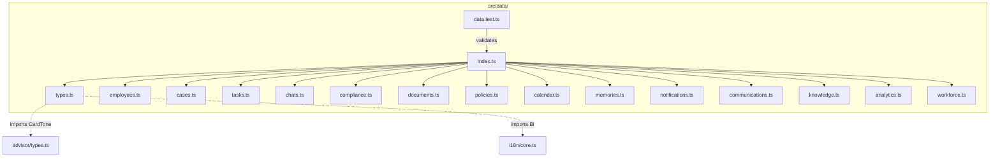
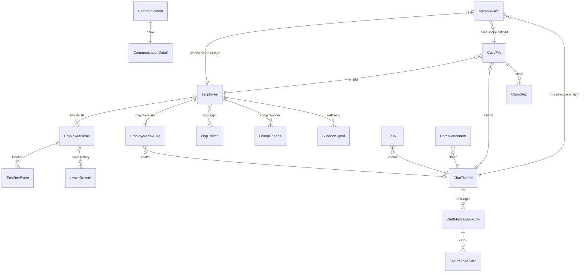
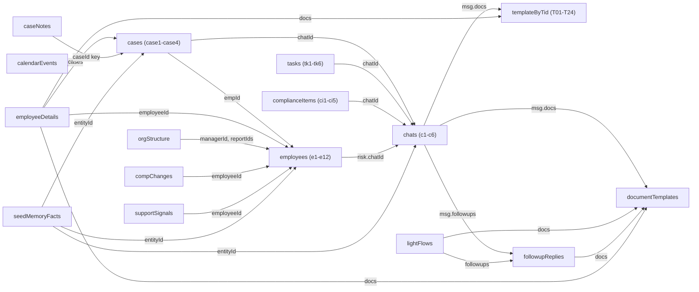
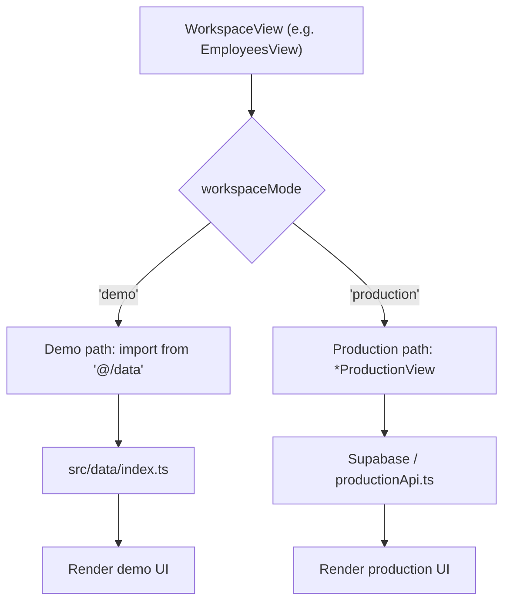
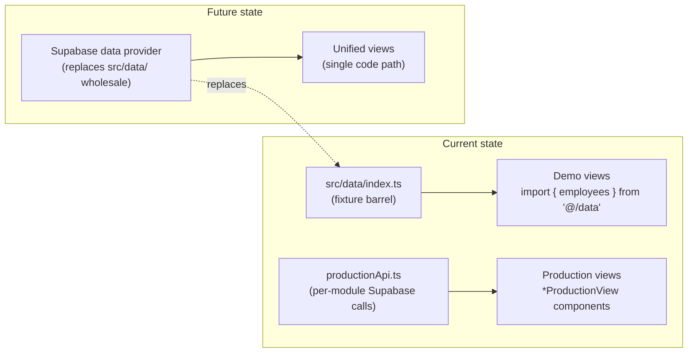

# Fixture Data System

<details>
<summary>Relevant source files</summary>

The following files were used as context for generating this wiki page:

- [src/data/chats.ts](src/data/chats.ts)
- [src/data/data.test.ts](src/data/data.test.ts)
- [src/data/employees.ts](src/data/employees.ts)
- [src/data/index.ts](src/data/index.ts)
- [src/data/types.ts](src/data/types.ts)
- [src/features/app/docstudio/DocStudioProvider.tsx](src/features/app/docstudio/DocStudioProvider.tsx)
- [src/features/app/docstudio/resolveDocTitle.ts](src/features/app/docstudio/resolveDocTitle.ts)
- [src/features/app/documents/customTemplates.ts](src/features/app/documents/customTemplates.ts)
- [src/features/app/documents/screens/StudioScreen.test.tsx](src/features/app/documents/screens/StudioScreen.test.tsx)
- [src/features/app/rail/useAskAdvisorBriefing.ts](src/features/app/rail/useAskAdvisorBriefing.ts)
- [src/features/app/views/analytics/AckMeter.tsx](src/features/app/views/analytics/AckMeter.tsx)
- [src/features/app/views/analytics/AnalyticsView.tsx](src/features/app/views/analytics/AnalyticsView.tsx)
- [src/features/app/views/analytics/ScoreBreakdownMeters.tsx](src/features/app/views/analytics/ScoreBreakdownMeters.tsx)
- [src/features/app/views/analytics/ScoreHero.tsx](src/features/app/views/analytics/ScoreHero.tsx)

</details>

The `src/data/` directory provides a typed, bilingual fixture data layer that powers the entire demo workspace. All 17 files export statically-defined sample entities — employees, cases, tasks, compliance items, chat threads, documents, calendar events, memory facts, and more — that every workspace view imports centrally. No view ever inlines entity data; the barrel `src/data/index.ts` re-exports everything so that a future Supabase provider can replace this module wholesale.

[src/data/index.ts:1-22]()

## Architecture Overview

**Fixture data module architecture**



Sources: [src/data/index.ts:1-22](), [src/data/types.ts:1-2]()

## File Inventory

The fixture layer consists of 17 files (16 data modules + 1 test file):

| File                | Primary Exports                                                                                                                                                     | Record Count                                             |
| ------------------- | ------------------------------------------------------------------------------------------------------------------------------------------------------------------- | -------------------------------------------------------- |
| `types.ts`          | `Tone`, `FixtureAction`, `FixtureToneCard`, `Employee`, `CaseFile`, `Task`, `ComplianceItem`, `ChatThread`, `MemoryFact`, `CalendarEvent`, `DocumentTemplate`, etc. | — (types only)                                           |
| `employees.ts`      | `employees`, `employeeDetails`, `orgStructure`, `compChanges`, `supportSignals`                                                                                     | 12 employees, 12 detail records, 3 org branches          |
| `cases.ts`          | `cases`, `caseRiskByType`, `caseRecommendationByType`, `caseRiskAxesByType`, `caseNotes`                                                                            | 4 cases                                                  |
| `tasks.ts`          | `tasks`, `taskPriorityLabels`, `taskPriorityTones`                                                                                                                  | 6 tasks                                                  |
| `chats.ts`          | `chats`, `lightFlows`, `followupReplies`                                                                                                                            | 6 chat threads, 6 light flows, multiple followup replies |
| `compliance.ts`     | `complianceItems`, `complianceScore`, `complianceCategories`, `obligations`, `regulatoryWatchlist`                                                                  | 5 items, 5 categories, 8 obligations, 3 watchlist items  |
| `documents.ts`      | `documentTemplates`, `documentTemplatesByKey`, `docMetaDefaults`                                                                                                    | 10 legacy templates                                      |
| `policies.ts`       | `policies`                                                                                                                                                          | 6 policies                                               |
| `calendar.ts`       | `calendarMonth`, `calendarEvents`                                                                                                                                   | 1 month, 9 events                                        |
| `memories.ts`       | `memoryPeople`, `memoryCases`, `memoryThreads`, `seedMemoryFacts`                                                                                                   | 3 people, 2 cases, 1 thread, 17 facts                    |
| `notifications.ts`  | `notifications`                                                                                                                                                     | 4 notifications                                          |
| `communications.ts` | `communications`, `communicationDetails`                                                                                                                            | 6 communications                                         |
| `knowledge.ts`      | `knowledgeItems`                                                                                                                                                    | 8 articles                                               |
| `analytics.ts`      | `demoTodayISO`, `scoreHistory`, `headcountByJurisdiction`, `headcountTotal`, `policyAcknowledgment`, `jurisdictionScores`, `headcountHistory`, `turnover`           | Aggregate data                                           |
| `workforce.ts`      | `certifications`, `employeeDocuments`, `probationEnds`, `leaveOverview`                                                                                             | 7 certs, 3 docs, 3 probation, 4 leave                    |
| `data.test.ts`      | (test suite)                                                                                                                                                        | —                                                        |

Sources: [src/data/index.ts:7-21](), [src/data/employees.ts:19-19](), [src/data/cases.ts:19-19](), [src/data/tasks.ts:7-7](), [src/data/chats.ts:14-14](), [src/data/compliance.ts:18-18](), [src/data/documents.ts:41-41](), [src/data/policies.ts:6-6](), [src/data/calendar.ts:16-16](), [src/data/memories.ts:34-34](), [src/data/notifications.ts:6-6](), [src/data/communications.ts:10-10](), [src/data/knowledge.ts:10-10](), [src/data/analytics.ts:35-35](), [src/data/workforce.ts:19-19]()

## Domain Model (`types.ts`)

The type system in `types.ts` defines all entity interfaces that the fixture files implement. Every display-facing string field uses the `Bi` type (`{ en: string; fr: string }`) from `@/i18n/core`, while language-neutral fields (names, dates, numbers) stay as `string` or `number`.

[src/data/types.ts:1-11]()

### Tone System

The `Tone` type extends the Advisor's `CardTone` (defined at [src/features/app/advisor/types.ts:13]()) with `'success'`:

```
CardTone = 'risk' | 'warning' | 'suggestion' | 'info' | 'success'
Tone    = CardTone | 'success'
```

[src/data/types.ts:13-14]()

Every entity that needs a visual severity indicator uses this unified ramp — `Employee.tone`, `CaseFile.tone`, `ComplianceItem.tone`, `Policy.tone`, `Communication.tone`, etc. — so UI chip components can map tone to colour consistently.

### FixtureAction Discriminated Union

Fixtures never carry `onClick` handlers. Instead, actions are declarative descriptors that views translate into navigation or document-studio openings at render time:

[src/data/types.ts:23-29]()

| `kind`              | `target` resolves to                |
| ------------------- | ----------------------------------- |
| `'open-case'`       | `/app/cases/:caseId`                |
| `'open-employee'`   | `/app/employees/:employeeId`        |
| `'open-chat'`       | Chat thread id                      |
| `'open-compliance'` | `/app/compliance` (optional target) |
| `'open-view'`       | Arbitrary app route                 |
| `'draft-doc'`       | Template key → DocStudio overlay    |

This separation ensures fixtures remain serializable and free of React dependencies.

Sources: [src/data/types.ts:16-47]()

### FixtureToneCard

The `FixtureToneCard` interface mirrors the Advisor's `ToneCardData` shape but is purely declarative — no `onClick`, optional `confidence` line, and `FixtureAction` descriptors instead of callback actions:

[src/data/types.ts:40-47]()

Sources: [src/data/types.ts:35-47]()

### Entity Type Summary

**Entity relationship diagram — types.ts domain model**



Sources: [src/data/types.ts:59-73](), [src/data/types.ts:159-181](), [src/data/types.ts:210-222](), [src/data/types.ts:239-255](), [src/data/types.ts:433-443](), [src/data/types.ts:556-575]()

### Key Entity Interfaces

| Interface          | Key Fields                                                                         | ID Pattern                                       |
| ------------------ | ---------------------------------------------------------------------------------- | ------------------------------------------------ |
| `Employee`         | `id`, `name`, `role: Bi`, `dept: Bi`, `province: Bi`, `status: Bi`, `tone`, `risk` | `e1`–`e12`                                       |
| `CaseFile`         | `id`, `title: Bi`, `type: CaseType`, `empId`, `chatId`, `steps`, `openedISO`       | `case1`–`case4`                                  |
| `Task`             | `id`, `title: Bi`, `due: Bi`, `priority`, `chatId`, `owner`, `jur: Bi`             | `tk1`–`tk6`                                      |
| `ChatThread`       | `id`, `title: Bi`, `folder: Bi`, `bucket`, `flowKey`, `messages[]`                 | `c1`–`c6`                                        |
| `ComplianceItem`   | `id`, `severity`, `title: Bi`, `chatId`, `citations[]`, `dueISO?`                  | `ci1`–`ci5`                                      |
| `DocumentTemplate` | `key`, `title: Bi`, `category: Bi`, `sections: Bi[]`, `highRisk`, `meta?`          | title-string keys                                |
| `CalendarEvent`    | `id`, `day`, `dateLabel: Bi`, `label: Bi`, `tone`                                  | `cal-*`                                          |
| `MemoryFact`       | `id`, `scope`, `entityId`, `category`, `statement: Bi`, `confidence`, `visibility` | `p1`–`p9`, `c1`–`c4`, `t1`–`t2`, `a1`–`a2`, `d1` |
| `Obligation`       | `id`, `area: Bi`, `statute: Bi`, `title: Bi`, `jur`, `dueISO`, `status`            | `ob1`–`ob8`                                      |
| `Policy`           | `id`, `title: Bi`, `status: Bi`, `tone`, `updated: Bi`                             | `p1`–`p6`                                        |
| `Communication`    | `id`, `title: Bi`, `audience: Bi`, `status: Bi`, `tone`                            | `cm1`–`cm6`                                      |
| `KnowledgeItem`    | `id`, `title: Bi`, `tag: Bi`                                                       | `k1`–`k8`                                        |

Sources: [src/data/types.ts:59-73](), [src/data/types.ts:159-181](), [src/data/types.ts:210-222](), [src/data/types.ts:239-255](), [src/data/types.ts:226-232](), [src/data/types.ts:265-285](), [src/data/types.ts:378-408](), [src/data/types.ts:492-502](), [src/data/types.ts:514-532](), [src/data/types.ts:556-575]()

## Cross-Entity Reference Graph

Entities reference each other via stable string IDs. The central hub is `ChatThread`, which most entities point to. This forms a connected graph where an employee links to cases, which link to chats, which link to tasks, compliance items, and documents.

**Cross-reference graph across fixture entities**



Sources: [src/data/data.test.ts:37-48](), [src/data/data.test.ts:56-60](), [src/data/data.test.ts:64-85](), [src/data/data.test.ts:87-98](), [src/data/data.test.ts:132-147]()

## The Diorama: Northgate Logistics Inc.

All fixtures model a fictional company called **Northgate Logistics Inc.**, an 82-person multi-province Canadian employer. The demo "today" is fixed at **July 5, 2026**, derived from the calendar fixture so the two can never disagree:

[src/data/analytics.ts:24-27]()

The diorama includes:

- **12 individually modelled employees** spanning Ontario, BC, Quebec, Alberta, and Federal jurisdictions
- **4 active cases**: a high-risk termination (Jordan Mensah), a PIP (Devon Clarke), a medical accommodation (Amara Okafor), and a resolved onboarding (Marc-Étienne Roy)
- **6 Advisor chat threads** covering termination, hiring, policy, performance, accommodation, and onboarding scenarios
- **82 headcount** across 5 jurisdictions (34 ON, 21 BC, 12 QC, 9 AB, 6 Federal)

[src/data/analytics.ts:50-58](), [src/data/employees.ts:19-19](), [src/data/cases.ts:19-19]()

## Bilingual Data Pattern

Every human-readable field is typed as `Bi` and constructed via the `bi()` factory. This provides English and Canadian French in every fixture record:

```typescript
// From employees.ts
role: bi('Senior Operations Manager', 'Directeur principal des opérations'),
dept: bi('Operations', 'Opérations'),
province: bi('Ontario', 'Ontario'),
```

Language-neutral fields (names like `'Jordan Mensah'`, dates like `'Jul 5, 2026'`, IDs like `'e1'`) remain plain `string`.

Sources: [src/data/employees.ts:24-26](), [src/data/types.ts:7-10]()

## View Consumption Pattern

Views import fixture data from `@/data` and never inline entity data. Each view checks `workspaceMode` and branches:

- **Demo mode**: renders the Northgate fixtures below
- **Production mode**: renders a `*ProductionView` component that reads live Supabase data

For example, `EmployeesView` imports the `employees` array and renders it directly in demo mode:

[src/features/app/views/employees/EmployeesView.tsx:7-8]()
[src/features/app/views/employees/EmployeesView.tsx:27-31]()

Similarly, `AnalyticsView` imports a large set of fixture collections — `cases`, `complianceCategories`, `complianceItems`, `obligations`, `headcountByJurisdiction`, `scoreHistory`, `demoTodayISO`, etc. — and computes dashboard metrics against them:

[src/features/app/views/analytics/AnalyticsView.tsx:5-21]()

**Demo vs. production data flow**



Sources: [src/features/app/views/employees/EmployeesView.tsx:27-31](), [src/features/app/views/analytics/AnalyticsView.tsx:69-73](), [src/features/app/views/home/HomeView.tsx:29-46]()

## Document Template Resolution

Document references use a dual resolution system. Chat messages, employee files, and followup replies reference documents by either:

1. **Legacy title-string keys** (e.g. `'Termination Letter'`) — resolved via `documentTemplatesByKey`
2. **Doclib TIDs** (e.g. `'T03'`, `'T17'`) — resolved via `templateByTid` and `customTemplateByTid`

The `resolveDocTitle` function implements the lookup chain: doclib first, legacy fallback, then raw key:

[src/features/app/docstudio/resolveDocTitle.ts:15-19]()

The `DocStudioProvider` uses the same resolution order to open the document overlay:

[src/features/app/docstudio/DocStudioProvider.tsx:116-139]()

Sources: [src/features/app/docstudio/resolveDocTitle.ts:1-19](), [src/features/app/docstudio/DocStudioProvider.tsx:110-139]()

## Derived Data Exports

Some fixture files export computed values derived from other fixtures:

| Export                       | Derivation                                                   | File           |
| ---------------------------- | ------------------------------------------------------------ | -------------- |
| `documentTemplatesByKey`     | `Object.fromEntries(documentTemplates.map(t => [t.key, t]))` | `documents.ts` |
| `headcountTotal`             | `headcountByJurisdiction.reduce(...)`                        | `analytics.ts` |
| `demoTodayISO`               | Derived from `calendarMonth.year`, `monthIndex`, `todayDay`  | `analytics.ts` |
| `policyAcknowledgment.total` | Uses `headcountTotal`                                        | `analytics.ts` |
| `scoreHistory[5].score`      | Uses `complianceScore` (82)                                  | `analytics.ts` |

This ensures derived values always stay in sync with their sources.

Sources: [src/data/documents.ts:389-391](), [src/data/analytics.ts:24-27](), [src/data/analytics.ts:58-58](), [src/data/analytics.ts:41-42]()

## Advisor Chat Fixtures

The `chats.ts` file is the largest fixture module, containing three export groups:

1. **`chats: ChatThread[]`** — 6 seed conversations with full multi-turn message history, including structured user chips, advisor reasoning traces, tone cards with citations, document references, and followup chip labels.

2. **`lightFlows: Record<ChatFlowKey, LightFlow>`** — Single-turn canned advisor replies for 6 topics (termination, hiring, policy, performance, accommodation, onboarding). Used by the demo advisor's quick-flow entry points.

3. **`followupReplies: Record<string, FollowupReply>`** — Canned replies keyed by their English chip label. Some have `isEscalation: true` which triggers a task and toast in the UI.

[src/data/chats.ts:1-10](), [src/data/types.ts:445-464]()

The `useAskAdvisorBriefing` hook demonstrates how fixtures power navigation — it looks up a case route from a chat ID by scanning the `cases` fixture array:

[src/features/app/rail/useAskAdvisorBriefing.ts:19-22]()

Sources: [src/data/chats.ts:1-10](), [src/features/app/rail/useAskAdvisorBriefing.ts:6-6](), [src/features/app/rail/useAskAdvisorBriefing.ts:19-22]()

## Memory Fact Model

The memory system uses three scopes — `'person'`, `'case'`, `'thread'` — and two confidence levels — `'confirmed'` (authoritative source) and `'inferred'` (Advisor-derived, never treated as fact until a human confirms):

[src/data/types.ts:544-546]()

Each `MemoryFact` carries provenance (`source.type`: `'hris'`, `'document'`, `'chat'`, `'manual'`, `'inference'`, `'case'`) and a visibility scope (`'hr'`, `'case'`, `'restricted'`). The `sensitive` flag marks compensation and health data for access control.

Memory facts reference existing entities by ID — `entityId` maps to employee IDs (`e1`), case IDs (`case1`), or chat IDs (`c1`) depending on scope.

Sources: [src/data/types.ts:537-575](), [src/data/memories.ts:177-465]()

## Referential Integrity Tests (`data.test.ts`)

The `data.test.ts` file enforces three categories of invariants via Vitest:

### 1. Unique IDs

Verifies that every collection has globally unique IDs within its domain — employees, cases, chats, document keys, and individual chat messages:

[src/data/data.test.ts:24-33]()

### 2. Cross-Reference Resolution

Nine test cases verify that every foreign-key reference resolves to an existing entity:

| Test                               | Assertion                                                                                                                                  |
| ---------------------------------- | ------------------------------------------------------------------------------------------------------------------------------------------ |
| Tasks → chats                      | Every `task.chatId` exists in `chats`                                                                                                      |
| Cases → employees + chats          | Every `case.empId` and `case.chatId` resolve                                                                                               |
| Compliance → chats                 | Every `complianceItem.chatId` resolves                                                                                                     |
| Employee risks → chats             | Every `employee.risk.chatId` resolves (when non-null)                                                                                      |
| Employee details                   | Every employee has a detail record; detail `.docs` resolve to `docKeys`, `.cases` to `caseIds`, timeline `docKey`/`caseId` entries resolve |
| Chat message docs + followups      | Message `.docs` resolve to doc keys; `.followups` resolve to `followupReplies` keys                                                        |
| Light flows                        | Same doc/followup resolution as chat messages                                                                                              |
| Followup replies                   | Keyed by EN label; `.docs` resolve                                                                                                         |
| Org graph + comp changes + signals | All employee ID references resolve                                                                                                         |
| Communications                     | Unique IDs; each has a matching detail record                                                                                              |
| Case notes                         | Every key resolves to an existing case                                                                                                     |

[src/data/data.test.ts:36-157]()

### 3. Bilingual Completeness

A recursive walker visits every object reachable from the `data` barrel export. Any value matching the `{ en: string; fr: string }` shape has both fields checked for non-empty content. A sanity gate ensures the walker visited >500 objects to confirm coverage:

[src/data/data.test.ts:159-189]()

**Test suite structure**

```mermaid
graph TD
    TEST["data.test.ts"]

    subgraph "fixture ids"
        UID["Unique IDs per collection"]
    end

    subgraph "cross-references resolve"
        XREF1["tasks → chats"]
        XREF2["cases → employees, chats"]
        XREF3["compliance → chats"]
        XREF4["employee risks → chats"]
        XREF5["employeeDetails → docs, cases"]
        XREF6["chat messages → docs, followups"]
        XREF7["lightFlows → docs, followups"]
        XREF8["followupReplies → docs"]
        XREF9["orgStructure, compChanges, signals → employees"]
        XREF10["communications → details"]
        XREF11["caseNotes → cases"]
    end

    subgraph "bilingual completeness"
        BILING["Recursive Bi walker: en+fr non-empty"]
    end

    TEST --> UID
    TEST --> XREF1
    TEST --> XREF2
    TEST --> XREF3
    TEST --> XREF4
    TEST --> XREF5
    TEST --> XREF6
    TEST --> XREF7
    TEST --> XREF8
    TEST --> XREF9
    TEST --> XREF10
    TEST --> XREF11
    TEST --> BILING
```



Sources: [src/data/data.test.ts:1-189]()

## Design Intent: Supabase Replacement Path

The fixture data system is explicitly designed for wholesale replacement. The barrel export comment states the intent directly:

> "Views import from here (never inline entity data) so a future Supabase provider can replace this module wholesale."

[src/data/index.ts:1-5]()

The current production-mode pattern already demonstrates this: each workspace module has a `productionApi.ts` boundary file (e.g. `employees/productionApi.ts`) that reads from Supabase instead of fixtures. The view checks `workspaceMode` and dispatches accordingly:



The two key conventions that enable this:

1. **Views never inline entity data** — all data comes through the `@/data` import path
2. **Fixtures are declarative** — no `onClick` handlers, no React dependencies, no side effects; `FixtureAction` descriptors are interpreted by the view layer

Sources: [src/data/index.ts:1-5](), [src/features/app/views/employees/EmployeesView.tsx:27-31](), [src/data/types.ts:18-22]()

---
