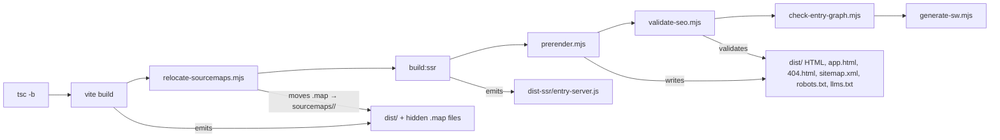
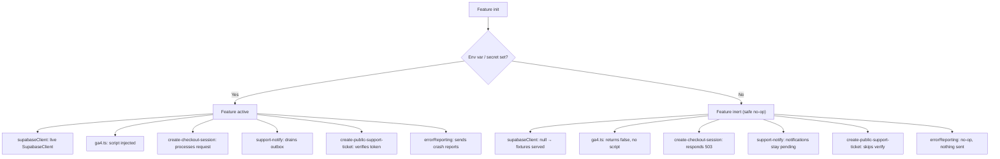
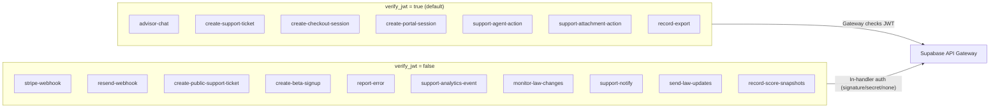
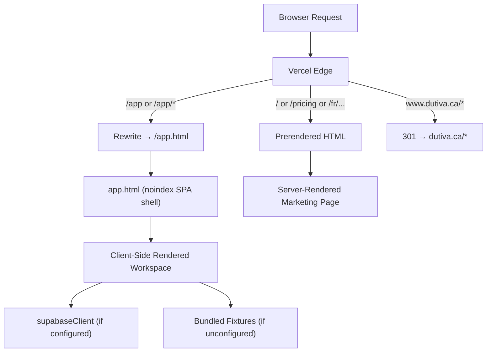
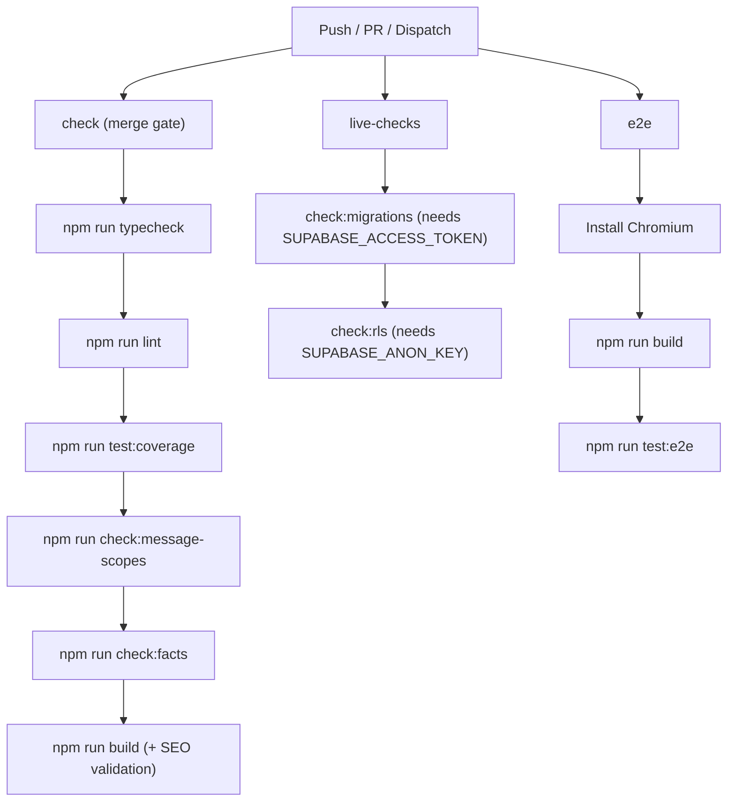

# Getting Started & Environment Setup

<details>
<summary>Relevant source files</summary>

The following files were used as context for generating this wiki page:

- [.env.example](.env.example)
- [docs/AUTH_EMAIL_TEMPLATES.md](docs/AUTH_EMAIL_TEMPLATES.md)
- [docs/SECURITY_HEADERS.md](docs/SECURITY_HEADERS.md)
- [docs/SUPPORT_ARCHITECTURE.md](docs/SUPPORT_ARCHITECTURE.md)
- [docs/SUPPORT_RUNBOOK.md](docs/SUPPORT_RUNBOOK.md)
- [package-lock.json](package-lock.json)
- [package.json](package.json)
- [scripts/apply-auth-email-templates.mjs](scripts/apply-auth-email-templates.mjs)
- [scripts/check-message-scopes.mjs](scripts/check-message-scopes.mjs)
- [scripts/check-migrations.mjs](scripts/check-migrations.mjs)
- [scripts/check-rls.mjs](scripts/check-rls.mjs)
- [scripts/lib/secrets.mjs](scripts/lib/secrets.mjs)
- [scripts/lib/secrets.test.mjs](scripts/lib/secrets.test.mjs)
- [src/app/App.tsx](src/app/App.tsx)
- [src/config/beta.ts](src/config/beta.ts)
- [src/features/app/auth/RequireAdminSession.test.tsx](src/features/app/auth/RequireAdminSession.test.tsx)
- [src/features/app/auth/RequireAdminSession.tsx](src/features/app/auth/RequireAdminSession.tsx)
- [src/i18n/messages/index.ts](src/i18n/messages/index.ts)
- [src/lib/billing/adminAccess.ts](src/lib/billing/adminAccess.ts)
- [src/lib/deployEnv.ts](src/lib/deployEnv.ts)
- [src/lib/exportProtection/localAudit.test.ts](src/lib/exportProtection/localAudit.test.ts)
- [src/lib/exportProtection/localAudit.ts](src/lib/exportProtection/localAudit.ts)
- [src/lib/supabaseClient.ts](src/lib/supabaseClient.ts)
- [supabase/functions/support-notify/index.ts](supabase/functions/support-notify/index.ts)
- [supabase/migrations/0048_fix_attachment_scan_trigger_auth.sql](supabase/migrations/0048_fix_attachment_scan_trigger_auth.sql)
- [supabase/migrations/0053_rls_grant_gaps_check.sql](supabase/migrations/0053_rls_grant_gaps_check.sql)
- [supabase/migrations/0073_close_anon_rls_holes.sql](supabase/migrations/0073_close_anon_rls_holes.sql)
- [vercel.json](vercel.json)
- [vite.config.ts](vite.config.ts)

</details>

This page covers everything a new developer needs to clone, configure, build, and deploy the Dutiva platform. It explains the npm scripts, Vite configuration, Vercel deployment rules, Supabase project setup, and — critically — the **configured-or-inert** design pattern that lets every feature degrade gracefully when its backing secret is absent.

## Cloning & Installing

```bash
git clone https://github.com/Dutiva-Canada/Dutiva-Website-Final-Design.git
cd Dutiva-Website-Final-Design
npm ci          # deterministic install from package-lock.json
```

The project is declared `"private": true` with `"type": "module"` (ESM throughout). Node 22 is used in CI.

Sources: [package.json:1-4](), [.github/workflows/ci.yml:33-35]()

## Tech Stack at a Glance

| Layer          | Package                             | Version          | Role                                      |
| -------------- | ----------------------------------- | ---------------- | ----------------------------------------- |
| UI framework   | `react` / `react-dom`               | ^19.2.7          | React 19 with JSX transform               |
| Routing        | `react-router-dom`                  | ^7.18.1          | Two-surface route tree                    |
| Backend client | `@supabase/supabase-js`             | ^2.110.2         | Auth, PostgREST, edge functions           |
| Bundler        | `vite`                              | ^8.1.1           | Dev server + production build             |
| CSS            | `tailwindcss` + `@tailwindcss/vite` | ^4.3.2           | Utility-first styling                     |
| Charts         | `recharts`                          | ^3.10.1          | Advisor chat chart blocks                 |
| Markdown       | `react-markdown` + `remark-gfm`     | ^10.1.0 / ^4.0.1 | Advisor response rendering                |
| Validation     | `zod`                               | ^4.4.3           | Schema validation (AdvisorResponse, etc.) |
| Icons          | `lucide-react`                      | ^0.542.0         | Icon library                              |
| Type checker   | `typescript`                        | ~6.0.2           | Strict mode, project references           |
| Test runner    | `vitest`                            | ^4.1.10          | Unit + integration (jsdom)                |
| E2E            | `@playwright/test`                  | ^1.62.1          | Browser smoke tests                       |
| Linter         | `oxlint`                            | ^1.71.0          | Fast linting                              |
| Formatter      | `prettier`                          | ^3.9.4           | Code formatting                           |

Sources: [package.json:27-58]()

## TypeScript Configuration

The project uses **TypeScript project references** with two sub-configs:

| Config               | Scope            | Module                        | Target |
| -------------------- | ---------------- | ----------------------------- | ------ |
| `tsconfig.app.json`  | `src/`           | `esnext` (bundler resolution) | ES2022 |
| `tsconfig.node.json` | `vite.config.ts` | `NodeNext`                    | ES2022 |

Both enforce strict mode with `noUncheckedIndexedAccess`, `noUnusedLocals`, and `noUnusedParameters`. The `@/*` path alias maps to `./src/*`.

Sources: [tsconfig.json:1-11](), [tsconfig.app.json:1-35](), [tsconfig.node.json:1-25]()

## npm Scripts

### Script Reference Table

| Script                 | Command                                                                                                                | Purpose                                      |
| ---------------------- | ---------------------------------------------------------------------------------------------------------------------- | -------------------------------------------- |
| `dev`                  | `vite`                                                                                                                 | Local dev server with HMR                    |
| `build`                | `tsc -b && vite build && relocate-sourcemaps → build:ssr → prerender → validate-seo → check-entry-graph → generate-sw` | Full production build pipeline               |
| `build:ssr`            | `vite build --ssr src/entry-server.tsx --outDir dist-ssr`                                                              | SSR bundle for prerendering                  |
| `preview`              | `vite preview`                                                                                                         | Serve built `dist/` locally                  |
| `lint`                 | `oxlint`                                                                                                               | Fast lint                                    |
| `typecheck`            | `tsc -b`                                                                                                               | Type-check both sub-projects                 |
| `format`               | `prettier --write .`                                                                                                   | Auto-format                                  |
| `format:check`         | `prettier --check .`                                                                                                   | CI format check                              |
| `test`                 | `vitest run`                                                                                                           | Run unit/integration tests once              |
| `test:watch`           | `vitest`                                                                                                               | Tests in watch mode                          |
| `test:coverage`        | `vitest run --coverage`                                                                                                | Tests with v8 coverage (thresholds enforced) |
| `test:e2e`             | `playwright test`                                                                                                      | Browser smoke tests                          |
| `check:migrations`     | `node scripts/check-migrations.mjs`                                                                                    | Filename discipline + drift detection        |
| `check:rls`            | `node scripts/check-rls.mjs`                                                                                           | RLS regression guard (anon role probing)     |
| `check:facts`          | `node scripts/check-canonical-facts.mjs`                                                                               | Brand palette drift check                    |
| `check:message-scopes` | `node scripts/check-message-scopes.mjs`                                                                                | i18n surface boundary guard                  |
| `check`                | typecheck → lint → test → check:migrations → check:rls → check:facts → check:message-scopes                            | Local pre-commit gate                        |
| `db:snapshot`          | `supabase db dump -f supabase/schema.sql`                                                                              | Dump live schema to repo                     |
| `auth:email-templates` | `node scripts/apply-auth-email-templates.mjs`                                                                          | Push auth email templates                    |

Sources: [package.json:6-26]()

### Build Pipeline Diagram



Sources: [package.json:8-9](), [scripts/relocate-sourcemaps.mjs:1-10](), [scripts/prerender.mjs:1-18]()

The build chain is sequential by design. Each step depends on the prior output:

1. `tsc -b` type-checks both projects (app + node configs) [package.json:8]()
2. `vite build` produces `dist/` with hidden source maps [vite.config.ts:161]()
3. `relocate-sourcemaps.mjs` moves `.map` files out of `dist/` into `sourcemaps/<rev>/` so they are never publicly served [scripts/relocate-sourcemaps.mjs:8-9]()
4. `build:ssr` compiles `src/entry-server.tsx` into `dist-ssr/` for Node-side prerendering [package.json:9](), [src/entry-server.tsx:37-55]()
5. `prerender.mjs` renders every public page (EN + FR), writes `app.html`, `404.html`, `sitemap.xml`, `robots.txt`, and `llms.txt` [scripts/prerender.mjs:1-17]()
6. `validate-seo.mjs` crawls the built `dist/` output and fails on any metadata violation [scripts/validate-seo.mjs:1-13]()
7. `check-entry-graph.mjs` enforces the eager bundle budget
8. `generate-sw.mjs` generates the service worker

## Environment Variables

The `.env.example` file documents every variable. Copy it to `.env` for local development:

```bash
cp .env.example .env
# Edit .env with your Supabase project credentials
```

### Variable Categories

| Variable                   | Prefix     | Required | Configured-or-Inert Behavior                                 |
| -------------------------- | ---------- | -------- | ------------------------------------------------------------ |
| `VITE_SUPABASE_URL`        | `VITE_`    | No       | `supabaseClient` returns `null`; app serves bundled fixtures |
| `VITE_SUPABASE_ANON_KEY`   | `VITE_`    | No       | Same as above                                                |
| `VITE_GA_MEASUREMENT_ID`   | `VITE_`    | No       | GA4 loader is inert, no script loaded                        |
| `VITE_SITE_ORIGIN`         | `VITE_`    | No       | Defaults to `https://dutiva.ca`                              |
| `GOOGLE_SITE_VERIFICATION` | —          | No       | No verification meta tag injected                            |
| `BING_SITE_VERIFICATION`   | —          | No       | No verification meta tag injected                            |
| `VITE_CAPTCHA_SITE_KEY`    | `VITE_`    | No       | CAPTCHA skipped on public intake                             |
| `STRIPE_SECRET_KEY`        | — (server) | No       | Checkout/portal return 503 "not configured"                  |
| `RESEND_API_KEY`           | — (server) | No       | Support notifications stay `pending`, nothing sent           |
| `CAPTCHA_SECRET_KEY`       | — (server) | No       | Verification skipped entirely                                |
| `AI_DAILY_REQUEST_LIMIT`   | — (server) | No       | Defaults in `_shared/aiUsage.ts` apply                       |
| `ERROR_REPORT_SALT`        | — (server) | No       | `report-error` function fails closed                         |

**Key convention:** Variables prefixed `VITE_` are bundled into the client at build time. Server-side secrets (Stripe, Resend, CAPTCHA server keys) must **never** be prefixed with `VITE_`.

Sources: [.env.example:1-127]()

### Build-Time Defines

Two non-`VITE_` environment variables are injected into the client bundle via `vite.config.ts` `define`:

| Define            | Source                  | Fallback | Usage                                               |
| ----------------- | ----------------------- | -------- | --------------------------------------------------- |
| `__VERCEL_ENV__`  | `VERCEL_ENV`            | `''`     | Auth gate bypass on preview; DevAnnotations overlay |
| `__RELEASE_SHA__` | `VERCEL_GIT_COMMIT_SHA` | `''`     | Error report release tagging                        |

These are consumed through `src/lib/deployEnv.ts` and `src/lib/release.ts` respectively.

Sources: [vite.config.ts:140-154](), [src/lib/deployEnv.ts:1-25]()

## The Configured-or-Inert Design Pattern

The most important architectural pattern to understand is **configured-or-inert**: every feature that depends on an external service activates only when its credentials are set, and degrades to a safe no-op otherwise. This means the app runs fully without **any** environment variables set — it serves bundled fixture data, skips auth gates, and never throws.

### `supabaseClient` — The Core Example

The central implementation is in `src/lib/supabaseClient.ts`:

```typescript
// src/lib/supabaseClient.ts
const SUPA_URL: string | undefined = import.meta.env.VITE_SUPABASE_URL
const SUPA_KEY: string | undefined = import.meta.env.VITE_SUPABASE_ANON_KEY

export const supabase: SupabaseClient | null =
  SUPA_URL && SUPA_KEY ? createClient(SUPA_URL, SUPA_KEY) : null
```

When both `VITE_SUPABASE_URL` and `VITE_SUPABASE_ANON_KEY` are set, `supabase` is a live `SupabaseClient`. Otherwise it is `null`, and every consumer checks for this.

Sources: [src/lib/supabaseClient.ts:1-16]()

### How Consumers Handle `null`

The pattern propagates throughout the codebase:

**`RequireAdminSession`** — the workspace auth gate returns `children` unmodified when `supabase` is `null`, so the workspace is accessible without credentials in local dev:

```typescript
// src/features/app/auth/RequireAdminSession.tsx
if (!supabase) return children // line 37
if (isVercelPreview()) return children // line 39
```

[src/features/app/auth/RequireAdminSession.tsx:37-39]()

**`ga4.ts`** — the GA4 loader checks `VITE_GA_MEASUREMENT_ID` and returns `false` (no script injected) when unconfigured:

```typescript
// src/features/marketing/analytics/ga4.ts
export function isGa4Configured(): boolean {
  const id = import.meta.env.VITE_GA_MEASUREMENT_ID
  return typeof id === 'string' && id.length > 0
}
```

[src/features/marketing/analytics/ga4.ts:22-25]()

**Error reporting** — `installErrorReporting()` is inert unless `VERCEL_ENV` is `'production'` or `'preview'` AND `VITE_SUPABASE_URL` is set:

[src/lib/errorReporting/index.ts:30-33]()

### Configured-or-Inert Decision Diagram



Sources: [src/lib/supabaseClient.ts:15-16](), [src/features/marketing/analytics/ga4.ts:22-25](), [.env.example:30-34](), [.env.example:67-69](), [.env.example:84-89](), [src/lib/errorReporting/index.ts:30-33]()

### Server-Side Inert Behavior

The pattern extends to every Supabase edge function that depends on an external secret:

| Edge Function                  | Missing Secret                | Behavior                                          |
| ------------------------------ | ----------------------------- | ------------------------------------------------- |
| `create-checkout-session`      | `STRIPE_SECRET_KEY`           | Responds 503 "not configured"                     |
| `stripe-webhook`               | `STRIPE_WEBHOOK_SECRET`       | Responds 503                                      |
| `support-notify`               | `RESEND_API_KEY`              | Safe no-op; notifications stay `pending`          |
| `support-attachment-scan`      | `SUPPORT_ATTACHMENT_SCAN_URL` | Safe no-op; rows stay `pending`                   |
| `resend-webhook`               | `RESEND_WEBHOOK_SECRET`       | Fails closed (503), never accepts unsigned events |
| `create-public-support-ticket` | `CAPTCHA_SECRET_KEY`          | Skips verification entirely                       |
| `report-error`                 | `ERROR_REPORT_SALT`           | Fails closed                                      |

Sources: [.env.example:30-34](), [.env.example:67-78](), [.env.example:84-103](), [.env.example:115-127]()

## Vite Configuration

`vite.config.ts` configures the bundler, plugins, chunk splitting, and the test runner.

### Plugins

Three plugins are registered, with `devSourceLocation` conditional on context:

| Plugin                | Condition                                  | Purpose                                                        |
| --------------------- | ------------------------------------------ | -------------------------------------------------------------- |
| `devSourceLocation()` | `dev` server or `VERCEL_ENV === 'preview'` | Stamps `data-loc` attributes on JSX for DevAnnotations overlay |
| `react()`             | Always                                     | `@vitejs/plugin-react` (oxc-based)                             |
| `tailwindcss()`       | Always                                     | `@tailwindcss/vite` integration                                |

The `stampSource` gate at [vite.config.ts:130-131]() ensures production builds never include `data-loc` attributes:

```typescript
const stampSource =
  !process.env.VITEST && (command === 'serve' || process.env.VERCEL_ENV === 'preview')
```

Sources: [vite.config.ts:23-55](), [vite.config.ts:126-134]()

### Code Splitting Strategy

The `rolldownOptions.output.codeSplitting.groups` array defines three named chunk groups:

| Group                | Purpose                                                        | Key Detail                                                                          |
| -------------------- | -------------------------------------------------------------- | ----------------------------------------------------------------------------------- |
| `messages-marketing` | i18n messages for the marketing surface                        | Includes `marketing.ts`, `shared.ts`, and specific feature modules                  |
| `messages-workspace` | i18n messages for the workspace surface                        | Excludes `shell.ts` and `workspaceMode.ts`; `includeDependenciesRecursively: false` |
| `vendor`             | Third-party deps (react, react-router-dom, lucide-react, etc.) | Excludes `@supabase`, `recharts`/d3 tree, and `react-markdown` tree                 |

The markdown renderer's dependency closure (~99 packages) is computed at config load by `dependencyClosure()` [vite.config.ts:70-92]() and converted to a regex by `packageAlternation()` [vite.config.ts:95-100](). This keeps the markdown parser out of the eager entry graph so marketing visitors never download it.

Sources: [vite.config.ts:162-253]()

### Vitest Configuration

The test environment is `jsdom` with setup file `src/test/setup.ts`. Key settings:

- Supabase env vars are forced empty (`VITE_SUPABASE_URL: ''`) so tests always use bundled fixtures [vite.config.ts:270]()
- Coverage thresholds: statements 80%, branches 65%, functions 75%, lines 80% [vite.config.ts:275-282]()
- E2E specs (`e2e/**`) are excluded from Vitest (they run under Playwright) [vite.config.ts:260]()
- Timeouts are 20s to accommodate fixture module transform costs [vite.config.ts:264-265]()

Sources: [vite.config.ts:255-284]()

## Supabase Project Setup

### `supabase/config.toml`

The `config.toml` file pins the project to `khtwpxnvziiyplaflwru` and declares `verify_jwt` settings for every edge function that must be reachable without a JWT:

```toml
project_id = "khtwpxnvziiyplaflwru"

[functions.stripe-webhook]
verify_jwt = false

[functions.create-beta-signup]
verify_jwt = false

[functions.report-error]
verify_jwt = false
# ... (12 functions total with verify_jwt = false)
```

Functions not listed here default to `verify_jwt = true` (authenticated user actions). The file exists because deploying without it caused a silent revert of four months of law-monitoring work — the CLI picked up a stale config from a different directory.

Sources: [supabase/config.toml:1-72]()

### Edge Function Authentication Modes



Sources: [supabase/config.toml:24-72]()

### CI Credentials for Live Checks

Two CI jobs probe the live Supabase project. Both use the **loud skipping** pattern: when credentials are absent, the step passes but emits a GitHub Actions warning annotation and job summary entry so a green check is never mistaken for a verified one.

| Check              | Credentials Needed                              | What It Verifies                                                                                       |
| ------------------ | ----------------------------------------------- | ------------------------------------------------------------------------------------------------------ |
| `check:migrations` | `SUPABASE_ACCESS_TOKEN`, `SUPABASE_PROJECT_REF` | Every local migration file is applied on the live project (and vice versa)                             |
| `check:rls`        | `SUPABASE_URL`, `SUPABASE_ANON_KEY` (public)    | Sensitive tables (`beta_signups`, `hr_documents`, `signatures`) return zero rows to the anonymous role |

The RLS check includes a **positive control**: it first confirms the anon key can read `service_status` (a table meant to be public). If that fails, the key is wrong and all negative results are meaningless — the check errors out rather than reporting a false all-clear.

Sources: [scripts/check-rls.mjs:50-60](), [scripts/check-rls.mjs:161-177](), [scripts/check-migrations.mjs:27-36](), [.github/workflows/ci.yml:65-99]()

### Credential Cleaning

The `scripts/lib/secrets.mjs` module provides `cleanSecret()` which strips trailing newlines, wrapping quotes, and `Bearer ` prefixes from pasted credentials — the three most common paste errors that produce opaque 401s in CI. `describeSecret()` prints a safe diagnostic (character count + shape notes, never the value itself).

Sources: [scripts/lib/secrets.mjs:31-58]()

## Vercel Deployment Configuration

### `vercel.json` Structure

The `vercel.json` file defines redirects, rewrites, and security headers:

**Redirects:**

- `www.dutiva.ca` → `dutiva.ca` (permanent 301) [vercel.json:3-9]()

**Rewrites:**

- `/app` and `/app/:path*` → `/app.html` (the SPA shell for the workspace) [vercel.json:11-14]()

**Security Headers** (applied to all routes `/:path*`):

| Header                      | Value                                                          | Purpose                               |
| --------------------------- | -------------------------------------------------------------- | ------------------------------------- |
| `Content-Security-Policy`   | Full resource policy                                           | XSS, clickjacking, resource injection |
| `X-Frame-Options`           | `DENY`                                                         | Clickjacking prevention               |
| `X-Content-Type-Options`    | `nosniff`                                                      | MIME sniffing prevention              |
| `Referrer-Policy`           | `strict-origin-when-cross-origin`                              | Path/query leakage prevention         |
| `Strict-Transport-Security` | `max-age=63072000; includeSubDomains`                          | SSL-strip prevention                  |
| `Permissions-Policy`        | `camera=(), microphone=(), geolocation=(), browsing-topics=()` | Opt out of unused APIs                |

Sources: [vercel.json:15-35](), [docs/SECURITY_HEADERS.md:9-18]()

**Caching & Indexing Rules:**

| Route Pattern                      | Header          | Value                                 |
| ---------------------------------- | --------------- | ------------------------------------- |
| `/app`, `/app/:path*`, `/app.html` | `X-Robots-Tag`  | `noindex, nofollow`                   |
| `*.vercel.app` (any preview)       | `X-Robots-Tag`  | `noindex, nofollow`                   |
| `/assets/:path*`                   | `Cache-Control` | `public, max-age=31536000, immutable` |
| `/sw.js`                           | `Cache-Control` | `public, max-age=0, must-revalidate`  |

Sources: [vercel.json:37-61]()

### Two-Surface Architecture in Deployment



Sources: [vercel.json:3-14](), [scripts/prerender.mjs:99-110]()

## CI Pipeline Overview

The GitHub Actions workflow (`.github/workflows/ci.yml`) runs three independent jobs:



| Job           | Required for Merge | Needs Credentials          | Deterministic               |
| ------------- | ------------------ | -------------------------- | --------------------------- |
| `check`       | Yes                | No                         | Yes                         |
| `live-checks` | No                 | Yes (loud-skip if missing) | No (probes live DB)         |
| `e2e`         | No                 | No                         | Yes (but browser-dependent) |

The `check` job is the required status check. `live-checks` is isolated so credential problems never block the merge gate — the failure mode that let unverified builds merge when the access token expired.

Sources: [.github/workflows/ci.yml:1-130]()

## Application Entry Points

### Production Entry

The `App` component in `src/app/App.tsx` is the root:

```typescript
export function App() {
  return (
    <ThemeProvider>
      <RouterProvider router={router} />
      {DevAnnotations && (
        <Suspense fallback={null}>
          <DevAnnotations />
        </Suspense>
      )}
    </ThemeProvider>
  )
}
```

`DevAnnotations` is conditionally loaded via `React.lazy()` only in dev or preview builds. The condition uses inline `import.meta.env.DEV` and `__VERCEL_ENV__` checks so production builds eliminate the branch entirely via dead code elimination.

Sources: [src/app/App.tsx:1-40]()

### SSR / Prerender Entry

`src/entry-server.tsx` provides `renderPage()` and `buildPrerenderManifest()` for the build-time prerendering pipeline. It uses `react-dom/static`'s `prerender()` with the same route table as the browser, collecting `<head>` metadata via `HeadSinkContext`.

Sources: [src/entry-server.tsx:1-131]()

## Quick-Start Checklist

| Step                | Command / Action       | Notes                                      |
| ------------------- | ---------------------- | ------------------------------------------ |
| 1. Clone            | `git clone … && cd …`  |                                            |
| 2. Install          | `npm ci`               | Node 22 recommended                        |
| 3. Copy env         | `cp .env.example .env` | All vars optional — app works without any  |
| 4. Dev server       | `npm run dev`          | Runs at `localhost:5173`                   |
| 5. Run tests        | `npm test`             | Vitest with jsdom                          |
| 6. Full check       | `npm run check`        | typecheck + lint + test + integrity checks |
| 7. Production build | `npm run build`        | Outputs `dist/` and `dist-ssr/`            |
| 8. Preview build    | `npm run preview`      | Serves `dist/` locally                     |

To connect to a real Supabase project, set `VITE_SUPABASE_URL` and `VITE_SUPABASE_ANON_KEY` in `.env`. Without them, the app serves identical bundled fixture data and auth features degrade to their signed-out state — this is by design, not an error.

Sources: [.env.example:1-7](), [src/lib/supabaseClient.ts:4-16](), [package.json:6-10]()

---
