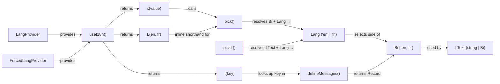
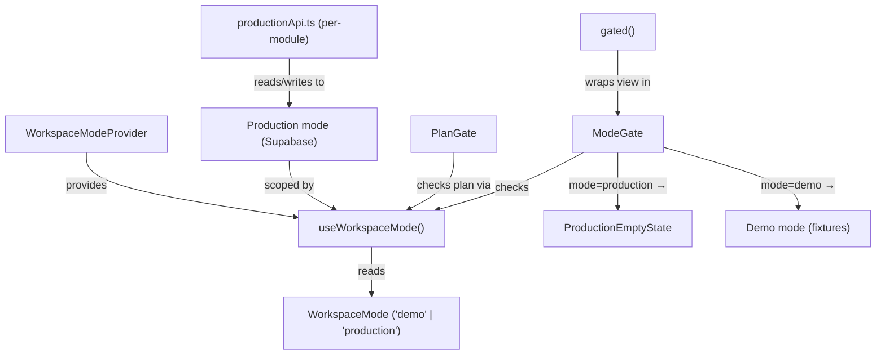
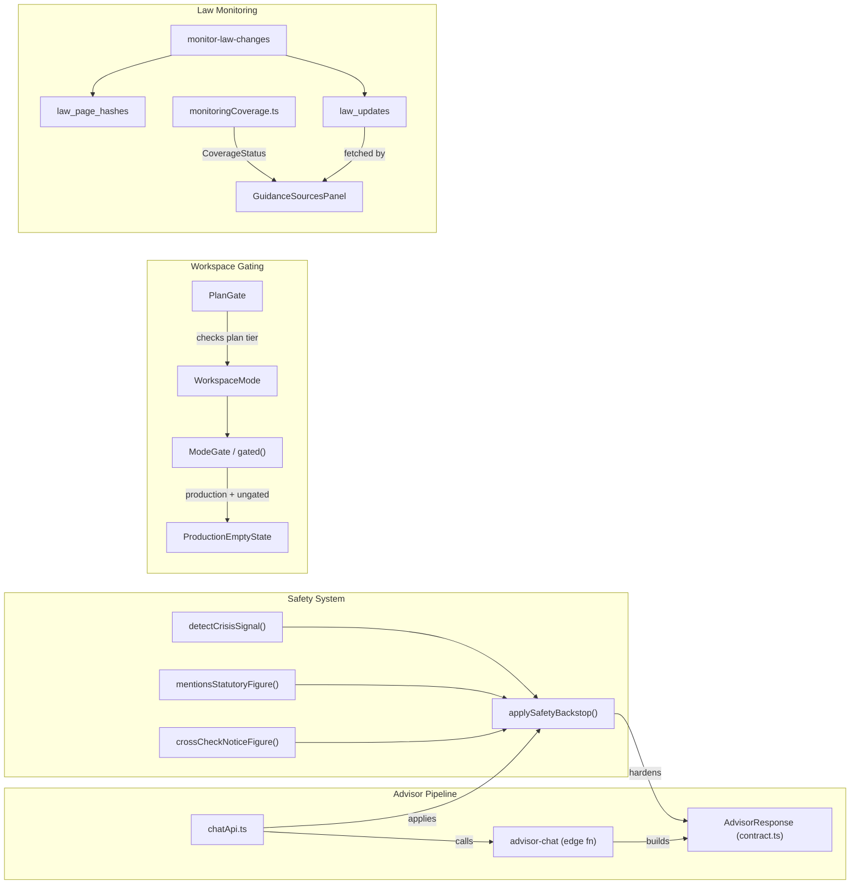

# Glossary

<details>
<summary>Relevant source files</summary>

The following files were used as context for generating this wiki page:

- [CONVENTIONS.md](CONVENTIONS.md)
- [docs/AI_USAGE_STRATEGY.md](docs/AI_USAGE_STRATEGY.md)
- [docs/CANONICAL_FACTS.md](docs/CANONICAL_FACTS.md)
- [docs/LAW_MONITORING.md](docs/LAW_MONITORING.md)
- [docs/TODO.md](docs/TODO.md)
- [docs/advisor-corpus-review-pack-ontario.md](docs/advisor-corpus-review-pack-ontario.md)
- [src/canonicalFacts.test.ts](src/canonicalFacts.test.ts)
- [src/features/app/advisor/chatApi.test.ts](src/features/app/advisor/chatApi.test.ts)
- [src/features/app/advisor/chatApi.ts](src/features/app/advisor/chatApi.ts)
- [src/features/app/advisor/safety/safetyBackstop.ts](src/features/app/advisor/safety/safetyBackstop.ts)
- [src/features/app/advisor/safety/statutoryFigures.test.ts](src/features/app/advisor/safety/statutoryFigures.test.ts)
- [src/features/app/advisor/safety/statutoryFigures.ts](src/features/app/advisor/safety/statutoryFigures.ts)
- [src/features/app/advisor/usageLimit.test.ts](src/features/app/advisor/usageLimit.test.ts)
- [src/features/app/advisor/usageLimit.ts](src/features/app/advisor/usageLimit.ts)
- [src/features/app/guidance/GuidanceSourcesPanel.test.tsx](src/features/app/guidance/GuidanceSourcesPanel.test.tsx)
- [src/features/app/guidance/GuidanceSourcesPanel.tsx](src/features/app/guidance/GuidanceSourcesPanel.tsx)
- [src/features/app/guidance/monitoringCoverage.test.ts](src/features/app/guidance/monitoringCoverage.test.ts)
- [src/features/app/guidance/monitoringCoverage.ts](src/features/app/guidance/monitoringCoverage.ts)
- [src/features/app/shell/Sidebar.test.tsx](src/features/app/shell/Sidebar.test.tsx)
- [src/features/app/shell/Sidebar.tsx](src/features/app/shell/Sidebar.tsx)
- [src/features/app/shell/SidebarCollapseButton.tsx](src/features/app/shell/SidebarCollapseButton.tsx)
- [src/features/app/shell/SidebarCreateMenu.tsx](src/features/app/shell/SidebarCreateMenu.tsx)
- [src/features/app/shell/SidebarFooter.tsx](src/features/app/shell/SidebarFooter.tsx)
- [src/features/app/shell/SidebarHeader.tsx](src/features/app/shell/SidebarHeader.tsx)
- [src/features/app/shell/SidebarNavItem.tsx](src/features/app/shell/SidebarNavItem.tsx)
- [src/features/app/shell/SidebarSearch.tsx](src/features/app/shell/SidebarSearch.tsx)
- [src/features/app/shell/SidebarSection.tsx](src/features/app/shell/SidebarSection.tsx)
- [src/features/app/shell/SidebarTooltip.tsx](src/features/app/shell/SidebarTooltip.tsx)
- [src/features/app/views/advisor/AdvisorView.test.tsx](src/features/app/views/advisor/AdvisorView.test.tsx)
- [src/features/app/views/advisor/AdvisorView.tsx](src/features/app/views/advisor/AdvisorView.tsx)
- [src/features/app/views/advisor/ChatPane.tsx](src/features/app/views/advisor/ChatPane.tsx)
- [src/features/app/views/cases/CaseDetailView.test.tsx](src/features/app/views/cases/CaseDetailView.test.tsx)
- [src/features/app/views/employees/EmployeesProductionView.tsx](src/features/app/views/employees/EmployeesProductionView.tsx)
- [src/features/app/views/home/homeData.ts](src/features/app/views/home/homeData.ts)
- [src/features/app/workspaceMode/ProductionEmptyState.tsx](src/features/app/workspaceMode/ProductionEmptyState.tsx)
- [src/features/app/workspaceMode/WorkspaceModeProvider.tsx](src/features/app/workspaceMode/WorkspaceModeProvider.tsx)
- [src/features/app/workspaceMode/api.ts](src/features/app/workspaceMode/api.ts)
- [src/features/app/workspaceMode/workspaceModeContext.ts](src/features/app/workspaceMode/workspaceModeContext.ts)
- [src/i18n/messages/advisorView.ts](src/i18n/messages/advisorView.ts)
- [src/i18n/messages/guidance.ts](src/i18n/messages/guidance.ts)
- [src/styles/base.css](src/styles/base.css)
- [supabase/config.toml](supabase/config.toml)
- [supabase/functions/advisor-chat/index.ts](supabase/functions/advisor-chat/index.ts)
- [supabase/functions/advisor-chat/responsePayload.test.ts](supabase/functions/advisor-chat/responsePayload.test.ts)
- [supabase/functions/monitor-law-changes/index.ts](supabase/functions/monitor-law-changes/index.ts)
- [supabase/functions/support-call-scheduler/index.ts](supabase/functions/support-call-scheduler/index.ts)
- [supabase/migrations/0049_cron_trigger_shared_secret.sql](supabase/migrations/0049_cron_trigger_shared_secret.sql)
- [supabase/migrations/0074_revoke_flag_guidance_public_execute.sql](supabase/migrations/0074_revoke_flag_guidance_public_execute.sql)
- [supabase/schema.sql](supabase/schema.sql)

</details>

This page is a comprehensive glossary of codebase-specific terms, jargon, abbreviations, and domain concepts used throughout the Dutiva platform. Each entry includes code pointers (file paths, class/function names) so readers can jump directly to the implementation.

---

## Term Relationship Map: i18n & Workspace Mode



Sources: [src/i18n/core.ts:1-39](), [src/i18n/context.ts:1-29]()

---

## Term Relationship Map: Workspace Mode & Gating



Sources: [src/features/app/workspaceMode/workspaceModeContext.ts:1-56](), [src/features/app/workspaceMode/ModeGate.tsx:1-29](), [src/app/appViews.tsx:9-25](), [src/features/app/billing/PlanGate.tsx:1-62]()

---

## A

### Advisor

The AI-powered HR compliance chat assistant — the platform's central feature at route `/app/advisor`. In **demo mode** it runs scripted light flows and scenarios; in **production mode** it calls the `advisor-chat` edge function to reach an upstream LLM (DeepSeek). The main view component is `AdvisorView`.

Sources: [src/features/app/views/advisor/AdvisorView.tsx:66-81](), [supabase/functions/advisor-chat/index.ts:13-28]()

### AdvisorResponse

The machine-readable structured payload the Advisor engine returns for every turn. Defined as a Zod schema in `contract.ts`. Contains `route` (gating flags like `workspaceAllowed`, `legalBasisAllowed`), `jurisdiction` (status + value), `risk` (compliance + safety levels), `legalBasis`, `retrieval`, `webSources`, `professionalReview`, `warnings`, and an `isCrisis` flag. The Compliance Workspace sidebar only renders sections whose corresponding `route.*Allowed` gate is `true`.

| Field                 | Type                                                                  | Purpose                                       |
| --------------------- | --------------------------------------------------------------------- | --------------------------------------------- |
| `route.responseMode`  | `'hr' \| 'escalation' \| 'supportive'`                                | Drives the mode chip                          |
| `jurisdiction.status` | `'known' \| 'assumed' \| 'unknown' \| 'conflict' \| 'not_applicable'` | Jurisdiction confidence                       |
| `risk.compliance`     | `'low' \| 'medium' \| 'high' \| 'critical'`                           | Compliance risk meter                         |
| `risk.safety`         | `'none' \| 'watch' \| 'urgent' \| 'critical'`                         | Safety risk meter                             |
| `isCrisis`            | `boolean`                                                             | Gates all structured surfaces off when `true` |

Sources: [src/features/app/advisor/contract.ts:1-119]()

### `ANNUAL_MONTHS_BILLED`

Constant set to `10` — annual billing charges for 10 of 12 months (two months free). Used to compute `annualPerMonth()` and `annualTotal()` display prices.

Sources: [src/config/plans.ts:95]()

### `applySafetyBackstop()`

Pure function in `safetyBackstop.ts` that hardens an `AdvisorResponse` after the engine and before the Compliance Workspace reads it. Implements three monotonic rules: crisis intercept (§5.1), jurisdiction/statutory-figure gate (§5.2), and notice-figure cross-check (§5.2b). Rules can only **tighten** gates, never loosen them. Returns a `SafetyBackstopResult` with the hardened response and a list of fired `SafetyAction` values.

Sources: [src/features/app/advisor/safety/safetyBackstop.ts:93-155]()

### `acquire_cron_lock()` / `release_cron_lock()`

PostgreSQL functions implementing an advisory-lock pattern for cron jobs. `acquire_cron_lock` inserts or updates a row in `cron_locks` with a TTL; it only succeeds (returns `true`) if the lock is expired or held by the same instance. Used by the law monitor nightly sweep to prevent concurrent runs.

Sources: [supabase/schema.sql:170-194]()

---

## B

### `BETA_COHORT_LIMIT`

Constant set to `15` in `src/config/beta.ts`. The maximum number of individuals/organizations auto-admitted to the beta workspace. Enforced server-side by `current_user_is_workspace_member()` (migration `0067`). Signup stays open past capacity as a waiting list. CI (`canonicalFacts.test.ts`) fails if any copy drifts from this value.

Sources: [src/config/beta.ts:1-19]()

### `Bi`

The bilingual string type `{ en: string; fr: string }`. Every user-facing string ships both EN and FR. Created via the `bi(en, fr)` factory function. The structural type ensures a key cannot exist in one language only.

```typescript
export interface Bi {
  en: string
  fr: string
}
export const bi = (en: string, fr: string): Bi => ({ en, fr })
```

Sources: [src/i18n/core.ts:4-9]()

---

## C

### CASL

**Canada's Anti-Spam Legislation** (S.C. 2010, c. 23). Requires express consent before sending commercial electronic messages. The beta signup flow records CASL consent via a checkbox (`BetaSignup` component) and the server-side `caslConsent.ts` shared module stores the consent record. Relevant edge functions: `create-beta-signup`.

Sources: [supabase/functions/_shared/caslConsent.ts]()

### `CoverageStatus`

Type in `monitoringCoverage.ts` describing whether law-change monitoring actually detects amendments for a jurisdiction:

| Status          | Meaning                                               |
| --------------- | ----------------------------------------------------- |
| `'active'`      | Verified to fetch real legislation and detect changes |
| `'unavailable'` | Reachable but unusable — cannot detect an amendment   |
| `'unverified'`  | Not confirmed either way since the last audit         |

This is a **maintained claim** — deliberately not derived from `law_page_hashes` to prevent silent drift. The audit date is stored in `COVERAGE_AUDITED_ON`.

Sources: [src/features/app/guidance/monitoringCoverage.ts:34-40]()

### Compliance Score

A 0–100 composite metric (v3 formula) computed from four weighted components: tasks, documents, findings, and obligations. Calculated by pure functions in `aggregation.ts`. The **critical ceiling** (see below) caps the score at 69 when any critical-severity finding is open. Snapshotted daily by the `record-score-snapshots` edge function.

Sources: [src/features/app/views/analytics/aggregation.ts:1-9]()

### Configured or inert

A design pattern where features activate only when the required environment variable or Vault secret is set, and gracefully degrade otherwise. The canonical example is `supabaseClient.ts`: when `VITE_SUPABASE_URL` and `VITE_SUPABASE_ANON_KEY` are absent, `supabase` is `null` and auth-gated features show their signed-out state instead of crashing.

```typescript
export const supabase: SupabaseClient | null =
  SUPA_URL && SUPA_KEY ? createClient(SUPA_URL, SUPA_KEY) : null
```

Sources: [src/lib/supabaseClient.ts:1-16]()

### Crisis intercept

The first-priority safety rule (§5.1 in `AI_USAGE_STRATEGY.md`). `detectCrisisSignal()` runs a maintained bilingual phrase list against the user's message **before** any model call. If matched, the 9-8-8 Suicide Crisis Helpline resource is shown, the `isCrisis` flag is raised on the `AdvisorResponse`, and every structured surface is gated off. The detection is **fail-safe-on**: the maintained list can only raise the crisis flag, never clear it — a model that fails to flag a crisis cannot suppress the intercept.

Sources: [src/features/app/advisor/safety/crisisSignals.ts:1-78](), [src/features/app/advisor/safety/safetyBackstop.ts:98-105]()

### Critical ceiling

A hard cap in the compliance score formula: when any compliance finding has `severity: 'critical'` and is open, the score is capped at **69** regardless of what the weighted components compute. This prevents a workspace with a critical open finding from ever showing a "good" score.

Sources: [src/features/app/views/analytics/aggregation.ts:75-110]()

---

## D

### `defineMessages()`

Identity function in `core.ts` that pins a message module to `Record<string, Bi>` while preserving literal key types. This enables fully typed `t()` lookups and ensures EN/FR parity is structural — a key cannot exist in one language only.

```typescript
export function defineMessages<T extends Record<string, Bi>>(messages: T): T {
  return messages
}
```

Sources: [src/i18n/core.ts:16-18]()

### Demo mode

The default `WorkspaceMode` — the workspace runs on fixture data from `src/data/` (Northgate Logistics Inc. sample company). Every workspace module renders its full UI with realistic bilingual sample data. No Supabase connection required. The `ModeGate` component renders fixture views in this mode. Toggled via `setMode` on `WorkspaceModeContextValue`.

Sources: [src/features/app/workspaceMode/workspaceModeContext.ts:5](), [src/features/app/workspaceMode/ModeGate.tsx:20-29]()

### Doclib

Short for **Document Library** — the HR document management system. Managed by `DoclibProvider` / `DoclibContext` for state. Contains the template catalogue (50 bilingual templates, T01–T50), the Document Studio for generation, e-signature workflow, and the document repository. Route: `/app/documents`.

Sources: [src/features/app/documents/]()

---

## E

### ESA / CNESST / CLC

Abbreviations for the three employment standards statutes Dutiva supports:

| Abbreviation                 | Full name                      | Jurisdiction  |
| ---------------------------- | ------------------------------ | ------------- |
| **ESA**                      | Employment Standards Act, 2000 | Ontario (ON)  |
| **CNESST** (administers LNT) | Loi sur les normes du travail  | Quebec (QC)   |
| **CLC**                      | Canada Labour Code, Part III   | Federal (FED) |

Sources: [docs/CANONICAL_FACTS.md:44]()

### Envelope

In the e-signature workflow, an **envelope** is the container created when a document is sent for signing. Created via `sendForSignature` → edge function. Tracks signers, their roles, statuses, and expiry. The `SigningScreen` reads the envelope via a token URL. Database table: `signature_tokens` (typed as `signature_token_view`).

Sources: [supabase/schema.sql:90-97]()

---

## F

### `FlowRunner` / `FlowStep`

The guided-workflow engine. `FlowRunner` is the React component (route `/app/workflows/:slug`) that drives a user through a `Flow` — a graph of `FlowStep` nodes. `FlowStep` is a discriminated union of four kinds:

| Kind      | Purpose                                                        |
| --------- | -------------------------------------------------------------- |
| `choice`  | Branching question — the selected option decides the next step |
| `task`    | Instructional step with points; one exit                       |
| `outcome` | Terminal step reached by branching                             |
| `result`  | Terminal step reached by scoring, with `FlowBand` thresholds   |

The pure engine functions (`startRun`, `advance`, `back`, `scoreRun`, `bandFor`) live in `flowEngine.ts`. Flow data files live under `src/data/`.

Sources: [src/features/app/flows/flowModel.ts:1-192](), [src/app/appViews.tsx:29]()

### Four Ring Framework

The organizational model for Dutiva's HR compliance content. Templates, flows, and policies are categorized into four concentric rings of increasing complexity:

| Ring   | Scope                                          |
| ------ | ---------------------------------------------- |
| Ring 1 | Core HR (employment agreements, onboarding)    |
| Ring 2 | Compliance & risk (accommodation, termination) |
| Ring 3 | Programs (wellbeing, communications)           |
| Ring 4 | Compensation & benefits                        |

Documented in `docs/FOUR_RING_FRAMEWORK.md`. Each `Flow` carries a `ring` field.

Sources: [src/features/app/flows/flowModel.ts:158-159](), [docs/CANONICAL_FACTS.md:49]()

---

## G

### `GuidanceSourcesPanel`

React component in `src/features/app/guidance/GuidanceSourcesPanel.tsx` that displays law-change monitoring coverage and recent law updates. Shows the three supported jurisdictions (ON/QC/FED) with their `CoverageStatus` chips. Behind auth, it fetches and displays recent `law_updates` rows filtered to `event_type = 'change'`. Includes a staleness guard (`updatesAreStale`) that warns when the newest update is older than 7 days.

Sources: [src/features/app/guidance/GuidanceSourcesPanel.test.tsx:1-96](), [src/features/app/guidance/monitoringCoverage.ts:94-104]()

### `gated()`

Helper function in `appViews.tsx` that wraps a fixture-driven view in `ModeGate`. In demo mode, the view renders normally; in production mode, it renders `ProductionEmptyState`. Views are ungated when they gain real persistence (e.g., communications, compensation, wellbeing).

```typescript
function gated(view: ReactNode) {
  return <ModeGate>{view}</ModeGate>
}
```

Sources: [src/app/appViews.tsx:23-25]()

---

## H–I

### `is_admin()` / `is_org_member()`

PostgreSQL functions that implement authorization checks in RLS policies and `SECURITY DEFINER` RPCs. `is_admin(user_id)` returns `true` for platform administrators (e.g. `@dutiva.ca` accounts). `is_org_member(org_id, user_id)` returns `true` when the user has an active row in `organization_members` for the given organization. Both are called extensively in RPC guards like `accept_ai_recommendation`.

Sources: [supabase/schema.sql:145-148]()

### `isCurrentUserAdmin()`

Client-side function in `supportAdminApi.ts` that checks whether the signed-in user is a platform admin. Called in `SidebarFooter` to conditionally render the "Support dashboard" menu item.

Sources: [src/features/app/shell/SidebarFooter.tsx:26-31]()

---

## J

### Job queue

The `job_queue` database table — a general-purpose task queue for background processing. Used by edge functions to enqueue work that should be processed asynchronously (e.g. notification delivery, analytics rollups).

Sources: [supabase/schema.sql]()

---

## K–L

### `Lang`

Type alias `'en' | 'fr'` — the two supported UI languages. English routes are unprefixed; French routes live under `/fr/` with localized slugs.

Sources: [src/i18n/core.ts:1]()

### `LText`

Union type `string | Bi` — "localizable text". State that outlives a single render (rail content, toasts, chat transcripts) stores `Bi` so a live language toggle re-localizes it. `pickL(value, lang)` resolves either form to a plain string.

Sources: [src/i18n/core.ts:30-31]()

### Law Monitor

The `monitor-law-changes` edge function — a nightly cron that sweeps 19 legislation pages across 14 Canadian jurisdictions. Four source strategies: HTML hash, Ontario e-Laws API, Québec CKAN datasets, Justice Canada XML. Records events (`first_seen`, `change`, `redirect`, `broken`) to `law_updates`. Scheduled via `pg_cron` at 07:00 UTC. Uses `acquire_cron_lock` to prevent concurrent runs.

Sources: [docs/LAW_MONITORING.md:1-10](), [supabase/schema.sql:170-194]()

### Light flows

Scripted, fixture-based demo conversation flows in the Advisor. When a user sends a message in demo mode, `routeFlowKeyFromText` matches it to a flow key (e.g. `'termination'`). The Advisor then runs the corresponding scripted interaction — quick forms, jurisdiction prompts, assessment results — without calling any AI backend. Data lives in `advisorFlows.ts`.

Sources: [src/features/app/views/advisor/AdvisorView.tsx:29-30](), [src/features/app/views/advisor/advisorFlows.ts]()

---

## M

### `ModeGate`

React component that conditionally renders its children based on `WorkspaceMode`. In `'production'` mode, renders `ProductionEmptyState` with the module's label; in `'demo'` mode, passes children through unchanged. Used by `gated()` in the route table.

Sources: [src/features/app/workspaceMode/ModeGate.tsx:20-29]()

---

## N–O

### `OrgMemberRole`

The five-level role vocabulary for organization membership: `'viewer' | 'member' | 'manager' | 'admin' | 'owner'`. Mirrors the `organization_members.role` column. The `roleAtLeast()` and `isAdminRole()` predicates compare roles by rank. RLS's `is_org_admin` accepts `admin` and `owner` as writers.

```typescript
export const ORG_MEMBER_ROLES = ['viewer', 'member', 'manager', 'admin', 'owner'] as const
```

Sources: [src/features/app/workspaceMode/roles.ts:1-33]()

---

## P

### PIPEDA

**Personal Information Protection and Electronic Documents Act** — Canada's federal privacy law. Dutiva's attachment scanner is deployed in DigitalOcean Toronto for PIPEDA data residency. The privacy policy and legal hub pages reference PIPEDA compliance throughout.

Sources: [docs/CANONICAL_FACTS.md:56-57]()

### `PlanGate`

React component in `billing/PlanGate.tsx` that gates workspace views by subscription tier. Renders children if the user's plan meets or exceeds the `required` `PlanId`; otherwise renders an `UpgradeNudge`. Demo mode bypasses the gate entirely. While `PAID_PLANS_DISABLED_DURING_BETA` is `true`, every beta user resolves to `'free'`, so gates show the nudge in production mode but don't block until checkout goes live.

Sources: [src/features/app/billing/PlanGate.tsx:25-39]()

### `PAID_PLANS_DISABLED_DURING_BETA`

Boolean constant set to `true` — paid plans are shown on `/pricing` but disabled with a "coming soon" state. Flip to `false` when paid signup opens. Checked by `isPurchasable()`.

Sources: [src/config/plans.ts:79]()

### Production mode

The `WorkspaceMode` for real data. When a signed-in admin switches to production, `WorkspaceModeProvider` auto-provisions an organization via `create_organization()` RPC. Every read/write is scoped to the real `organizationId`. Modules that haven't gained persistence yet show `ProductionEmptyState` via `ModeGate`.

Sources: [src/features/app/workspaceMode/workspaceModeContext.ts:5-48]()

### `productionApi.ts`

Per-module data boundary files (one per workspace module) that encapsulate all Supabase read/write calls for production mode. Examples: `employees/productionApi.ts`, `cases/productionApi.ts`, `policies/productionApi.ts`. Each exports functions like `listEmployees()`, `addEmployee()` that scope queries to the current `organizationId`.

Sources: [src/features/app/views/employees/productionApi.ts](), [src/features/app/views/cases/productionApi.ts](), [src/features/app/views/policies/productionApi.ts]()

### Provenanced task

In the compliance score formula, a task is **provenanced** when it is tied to a specific compliance obligation or finding (has a `related_finding_id` or `related_obligation_id`). Only provenanced tasks contribute to the score's task component — ad-hoc tasks without a compliance lineage are excluded to prevent score gaming.

Sources: [src/features/app/views/analytics/aggregation.ts]()

---

## Q

### Quebec Law 25

Québec's **Loi modernisant des dispositions législatives en matière de protection des renseignements personnels** (Law 25, s. 8.1). Requires analytics tracking to be **off by default** until the visitor opts in. Implemented in `analyticsConsent.ts`: `hasAnalyticsConsent()` returns `false` when no consent has been recorded, and both GA4 and first-party support analytics check it before collecting any data.

Sources: [src/lib/analyticsConsent.ts:1-77]()

---

## R

### RLS

**Row-Level Security** — PostgreSQL's built-in access control enforced on every table. The Dutiva schema carries **218 RLS policies** and **136 functions** (many `SECURITY DEFINER`). Key authorization functions used in policies: `is_admin()`, `is_org_member()`, `is_org_admin()`, `current_user_is_workspace_member()`. The CI pipeline includes `check-rls.mjs` which probes live Supabase with positive/negative controls.

Sources: [supabase/schema.sql](), [docs/CANONICAL_FACTS.md:1-55]()

---

## S

### Safety backstop

See `applySafetyBackstop()`. The collective name for the deterministic safety rules that harden every Advisor turn. Three rules, all **monotonic** (can only tighten, never loosen): crisis intercept, jurisdiction/statutory-figure gate, and notice-figure cross-check.

Sources: [src/features/app/advisor/safety/safetyBackstop.ts:9-19]()

### Scenario

One of six pre-built demo Advisor conversation scripts (`s1`–`s6`) in `advisorScenarios.ts`. Each scenario demonstrates a different `AdvisorResponse` response mode (HR, escalation, supportive) with a complete transcript, jurisdiction context, and Compliance Workspace payload. Used in the thread list when the Advisor is in demo mode.

Sources: [src/features/app/views/advisor/advisorScenarios.ts](), [src/features/app/views/advisor/AdvisorView.tsx:107-116]()

### `SidebarMode`

Type `'expanded' | 'compact' | 'drawer'` controlling the sidebar's visual state. `expanded` shows full labels; `compact` collapses to icon-only (64px wide); `drawer` is viewport-fixed for mobile with slide-in/out animation.

Sources: [src/features/app/shell/Sidebar.tsx:19]()

### Supported jurisdictions (ON / QC / FED)

The three Canadian jurisdictions Dutiva provides compliance coverage for:

| Code  | Jurisdiction | Primary statute                      |
| ----- | ------------ | ------------------------------------ |
| `ON`  | Ontario      | Employment Standards Act, 2000 (ESA) |
| `QC`  | Quebec       | Loi sur les normes du travail (LNT)  |
| `FED` | Federal      | Canada Labour Code, Part III (CLC)   |

The law monitor sweeps 14 jurisdictions but the product only claims coverage for these three. `MONITORING_COVERAGE` in `monitoringCoverage.ts` records the status of each.

Sources: [docs/CANONICAL_FACTS.md:44](), [src/features/app/guidance/monitoringCoverage.ts:51-79]()

---

## T–U

### `t()` / `x()` / `L()`

The three i18n resolution functions returned by `useI18n()`:

| Function    | Signature                            | Purpose                                           |
| ----------- | ------------------------------------ | ------------------------------------------------- |
| `t(key)`    | `(key: MessageKey) => string`        | Look up a UI-chrome string by message key         |
| `x(value)`  | `(value: Bi) => string`              | Resolve a bilingual data field `{ en, fr }`       |
| `L(en, fr)` | `(en: string, fr: string) => string` | Inline bilingual pair (mirrors prototype's `L()`) |

All three resolve to the current `lang` from context.

Sources: [src/i18n/context.ts:8-13]()

### Usage counters

The `usage_counters` database table tracking per-user monthly resource consumption. Used by the AI usage metering system: `claimAiUsage()` checks burst/daily/token/platform ceilings before an LLM call; `finalizeAiUsage()` stamps the claim with actual token counts after the call resolves. Exceeding a ceiling raises `AdvisorUsageLimitError`.

Sources: [supabase/functions/_shared/aiUsage.ts](), [supabase/functions/advisor-chat/index.ts:8-11]()

---

## V

### Vault secrets

Supabase Vault (`supabase_vault` extension) stores sensitive credentials that edge functions and cron jobs read at runtime. Secrets are created via `vault.create_secret()` in the SQL editor and never committed to the repository. Key secrets include `law_monitor_service_key`, `RESEND_API_KEY`, `SUPPORT_EMAIL_FROM`, `CAPTCHA_SECRET_KEY`, and Stripe keys. The "configured or inert" pattern means a missing secret produces a no-op, not an error.

Sources: [supabase/schema.sql:62](), [docs/LAW_MONITORING.md:87-101](), [docs/TODO.md:37-40]()

---

## W

### `WorkspaceMode`

Type `'demo' | 'production'` — the two operating modes of the workspace. Provided by `WorkspaceModeProvider` and consumed via `useWorkspaceMode()`. Demo mode runs on fixture data; production mode connects to Supabase with real data scoped to an `organizationId`.

Sources: [src/features/app/workspaceMode/workspaceModeContext.ts:5]()

### `WorkspaceModeProvider`

React context provider that resolves and exposes the current `WorkspaceMode`, admin status, identity, organization ID, member role, and the `setMode` toggle. On first switch to production, auto-provisions an organization via `create_organization()` RPC.

Sources: [src/features/app/workspaceMode/WorkspaceModeProvider.tsx]()

---

## Complete Term Quick-Reference



Sources: [src/features/app/advisor/safety/safetyBackstop.ts:1-155](), [src/features/app/advisor/contract.ts:1-119](), [supabase/functions/advisor-chat/index.ts:1-28](), [src/features/app/workspaceMode/ModeGate.tsx:1-29](), [src/features/app/billing/PlanGate.tsx:1-62](), [src/features/app/guidance/monitoringCoverage.ts:1-127](), [docs/LAW_MONITORING.md:1-10]()

---

## Alphabetical Index

| Term                              | Definition location | Key file(s)                                |
| --------------------------------- | ------------------- | ------------------------------------------ |
| Advisor                           | [§A](#a)            | `AdvisorView.tsx`, `advisor-chat/index.ts` |
| AdvisorResponse                   | [§A](#a)            | `contract.ts`                              |
| `ANNUAL_MONTHS_BILLED`            | [§A](#a)            | `plans.ts:95`                              |
| `applySafetyBackstop()`           | [§A](#a)            | `safety/safetyBackstop.ts`                 |
| `acquire_cron_lock()`             | [§A](#a)            | `schema.sql`                               |
| `BETA_COHORT_LIMIT`               | [§B](#b)            | `beta.ts:19`                               |
| `Bi`                              | [§B](#b)            | `core.ts:4-7`                              |
| CASL                              | [§C](#c)            | `_shared/caslConsent.ts`                   |
| `CoverageStatus`                  | [§C](#c)            | `monitoringCoverage.ts:34-40`              |
| Compliance Score                  | [§C](#c)            | `aggregation.ts`                           |
| Configured or inert               | [§C](#c)            | `supabaseClient.ts`                        |
| Crisis intercept                  | [§C](#c)            | `crisisSignals.ts`, `safetyBackstop.ts`    |
| Critical ceiling                  | [§C](#c)            | `aggregation.ts`                           |
| `defineMessages()`                | [§D](#d)            | `core.ts:16-18`                            |
| Demo mode                         | [§D](#d)            | `workspaceModeContext.ts`                  |
| Doclib                            | [§D](#d)            | `documents/`                               |
| ESA / CNESST / CLC                | [§E](#e)            | `CANONICAL_FACTS.md`                       |
| Envelope                          | [§E](#e)            | `schema.sql:90-97`                         |
| `FlowRunner` / `FlowStep`         | [§F](#f)            | `flowModel.ts`, `appViews.tsx`             |
| Four Ring Framework               | [§F](#f)            | `FOUR_RING_FRAMEWORK.md`                   |
| `GuidanceSourcesPanel`            | [§G](#g)            | `GuidanceSourcesPanel.tsx`                 |
| `gated()`                         | [§G](#g)            | `appViews.tsx:23-25`                       |
| `is_admin()` / `is_org_member()`  | [§H–I](#hi)         | `schema.sql`                               |
| Job queue                         | [§J](#j)            | `schema.sql`                               |
| `Lang`                            | [§K–L](#kl)         | `core.ts:1`                                |
| `LText`                           | [§K–L](#kl)         | `core.ts:30-31`                            |
| Law Monitor                       | [§K–L](#kl)         | `monitor-law-changes/index.ts`             |
| Light flows                       | [§K–L](#kl)         | `advisorFlows.ts`                          |
| `ModeGate`                        | [§M](#m)            | `ModeGate.tsx`                             |
| `OrgMemberRole`                   | [§N–O](#no)         | `roles.ts`                                 |
| PIPEDA                            | [§P](#p)            | Legal docs                                 |
| `PlanGate`                        | [§P](#p)            | `PlanGate.tsx`                             |
| `PAID_PLANS_DISABLED_DURING_BETA` | [§P](#p)            | `plans.ts:79`                              |
| Production mode                   | [§P](#p)            | `workspaceModeContext.ts`                  |
| `productionApi.ts`                | [§P](#p)            | Per-module files                           |
| Provenanced task                  | [§P](#p)            | `aggregation.ts`                           |
| Quebec Law 25                     | [§Q](#q)            | `analyticsConsent.ts`                      |
| RLS                               | [§R](#r)            | `schema.sql`                               |
| Safety backstop                   | [§S](#s)            | `safetyBackstop.ts`                        |
| Scenario                          | [§S](#s)            | `advisorScenarios.ts`                      |
| `SidebarMode`                     | [§S](#s)            | `Sidebar.tsx:19`                           |
| Supported jurisdictions           | [§S](#s)            | `monitoringCoverage.ts`                    |
| `t()` / `x()` / `L()`             | [§T–U](#tu)         | `context.ts:8-13`                          |
| Usage counters                    | [§T–U](#tu)         | `_shared/aiUsage.ts`                       |
| Vault secrets                     | [§V](#v)            | `schema.sql:62`                            |
| `WorkspaceMode`                   | [§W](#w)            | `workspaceModeContext.ts:5`                |
| `WorkspaceModeProvider`           | [§W](#w)            | `WorkspaceModeProvider.tsx`                |
