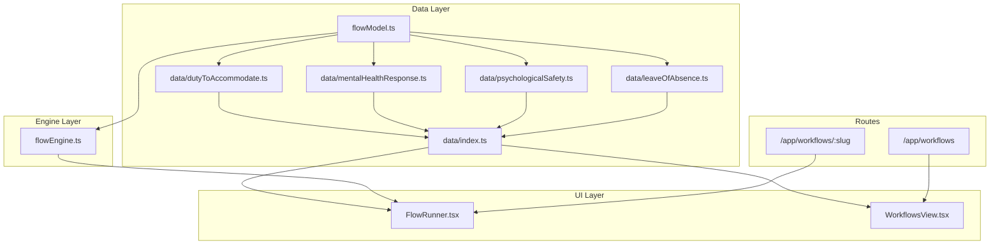
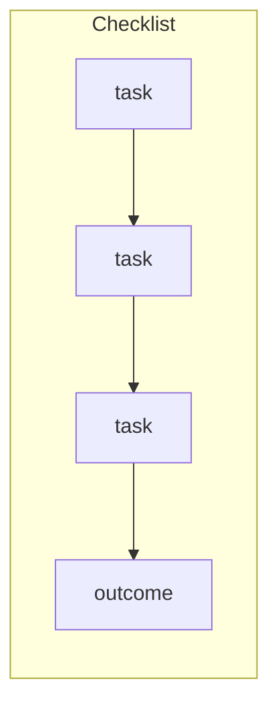
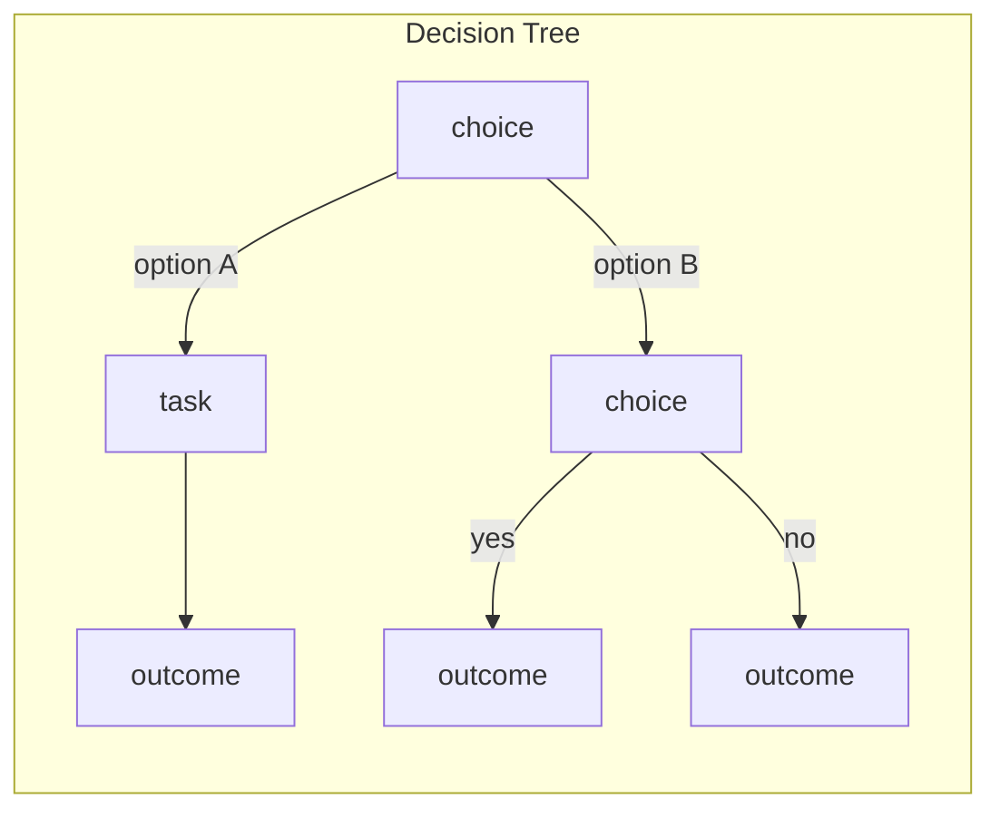
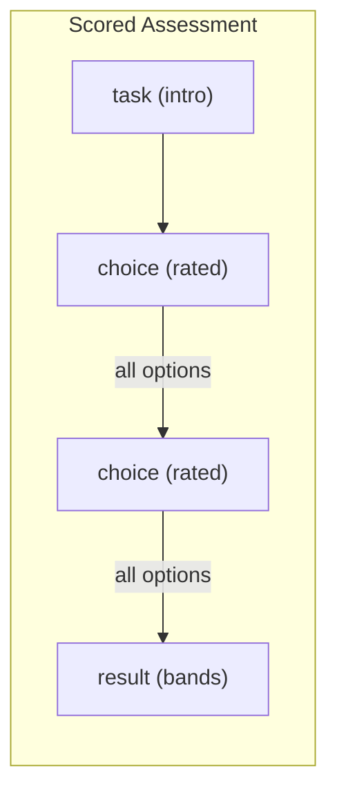
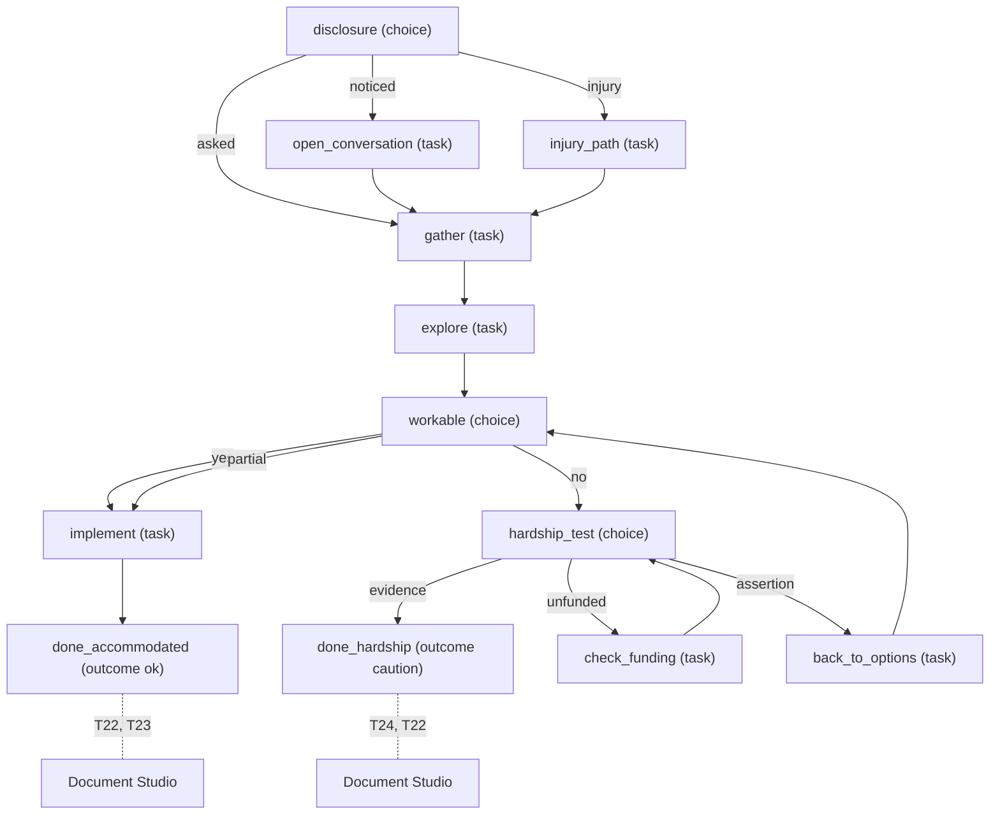
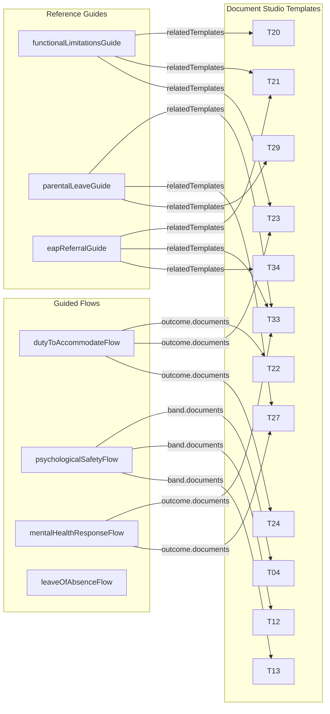

# Guided Workflows & Reference Guides

<details>
<summary>Relevant source files</summary>

The following files were used as context for generating this wiki page:

- [src/features/app/flows/FlowRunner.test.tsx](src/features/app/flows/FlowRunner.test.tsx)
- [src/features/app/flows/FlowRunner.tsx](src/features/app/flows/FlowRunner.tsx)
- [src/features/app/flows/data/index.ts](src/features/app/flows/data/index.ts)
- [src/features/app/flows/data/mentalHealthResponse.ts](src/features/app/flows/data/mentalHealthResponse.ts)
- [src/features/app/flows/data/psychologicalSafety.ts](src/features/app/flows/data/psychologicalSafety.ts)
- [src/features/app/flows/flowEngine.test.ts](src/features/app/flows/flowEngine.test.ts)
- [src/features/app/flows/flowEngine.ts](src/features/app/flows/flowEngine.ts)
- [src/features/app/flows/flowModel.ts](src/features/app/flows/flowModel.ts)
- [src/features/app/reference/GuideView.test.tsx](src/features/app/reference/GuideView.test.tsx)
- [src/features/app/reference/data/eapReferral.ts](src/features/app/reference/data/eapReferral.ts)
- [src/features/app/reference/data/index.ts](src/features/app/reference/data/index.ts)
- [src/features/app/reference/data/parentalLeave.ts](src/features/app/reference/data/parentalLeave.ts)
- [src/features/app/views/knowledge/KnowledgeView.test.tsx](src/features/app/views/knowledge/KnowledgeView.test.tsx)
- [src/features/app/views/knowledge/KnowledgeView.tsx](src/features/app/views/knowledge/KnowledgeView.tsx)
- [src/features/app/views/workflows/WorkflowsView.test.tsx](src/features/app/views/workflows/WorkflowsView.test.tsx)
- [src/features/app/views/workflows/workflowsData.ts](src/features/app/views/workflows/workflowsData.ts)
- [src/i18n/messages/flows.ts](src/i18n/messages/flows.ts)

</details>

This page documents the **FlowRunner** engine for interactive guided workflows and the **Reference Guides** system for in-product HR reference content. Both subsystems deliver Ring 2 interactive tools that complement the Document Studio — flows decide which documents to produce, and guides provide the background reading for a user who is mid-task.

## Architecture Overview

The guided workflows subsystem consists of three layers:

1. **Data model** (`flowModel.ts`) — type definitions for flows, steps, options, bands
2. **Pure engine** (`flowEngine.ts`) — stateless functions that advance, reverse, score, and inspect runs
3. **UI component** (`FlowRunner.tsx`) — React component that holds a `FlowRun` in state and delegates all transitions to the engine

The reference guides subsystem mirrors this pattern:

1. **Data model** (`guideModel.ts`) — type definitions for guide sections, blocks, contrast pairs
2. **Data files** under `reference/data/` — 8 bilingual guide definitions
3. **UI component** (`GuideView.tsx`) — renders a guide with jurisdiction notes and related-resource links

**Architecture diagram — Flow system**



Sources: [src/features/app/flows/flowModel.ts:1-193](), [src/features/app/flows/flowEngine.ts:1-259](), [src/features/app/flows/FlowRunner.tsx:1-48](), [src/features/app/flows/data/index.ts:1-19](), [src/app/appViews.tsx:77-78]()

## Flow Data Model (`flowModel.ts`)

The `Flow` interface represents a graph of bilingual steps routed at `/app/workflows/<slug>`.

### `Flow` Interface

| Field           | Type               | Purpose                      |
| --------------- | ------------------ | ---------------------------- |
| `slug`          | `string`           | Stable URL segment           |
| `title`         | `Bi`               | Bilingual display name       |
| `summary`       | `Bi`               | One-line description         |
| `ring`          | `1 \| 2 \| 3 \| 4` | Four Ring Framework position |
| `jurisdictions` | `Jurisdiction[]`   | Covered jurisdictions        |
| `estMinutes`    | `number`           | Estimated run duration       |
| `start`         | `FlowStepId`       | Entry step id                |
| `steps`         | `FlowStep[]`       | All steps in the graph       |

[src/features/app/flows/flowModel.ts:153-166]()

### `FlowStep` Union

`FlowStep` is a discriminated union of four kinds:

| Kind      | Interface         | Purpose                                  | Key Fields                                        |
| --------- | ----------------- | ---------------------------------------- | ------------------------------------------------- |
| `choice`  | `FlowChoiceStep`  | Branching question; user picks an option | `options: FlowOption[]`, optional `domain: Bi`    |
| `task`    | `FlowTaskStep`    | Instructional step with one exit         | `points: Bi[]`, `to: FlowStepId \| null`          |
| `outcome` | `FlowOutcomeStep` | Terminal step from branching             | `tone`, `documents?: string[]`, `noDocument?: Bi` |
| `result`  | `FlowResultStep`  | Terminal step from scoring               | `bands: FlowBand[]`                               |

[src/features/app/flows/flowModel.ts:71-151]()

All steps share a `FlowStepBase` with `id`, `title`, `body`, and optional `caution` (all `Bi`). The `caution` field is for warnings about common mistakes at that stage — there is deliberately no per-jurisdiction gate on steps because the runner never asks for a jurisdiction.

[src/features/app/flows/flowModel.ts:48-65]()

### `FlowOption` and `FlowBand`

`FlowOption` defines an outgoing edge from a `choice` step:

| Field     | Type                 | Purpose                               |
| --------- | -------------------- | ------------------------------------- |
| `id`      | `string`             | Stable identifier                     |
| `label`   | `Bi`                 | Display text                          |
| `detail?` | `Bi`                 | Optional sub-label                    |
| `to`      | `FlowStepId \| null` | Target step (null ends run)           |
| `value?`  | `number`             | Score contribution on rated questions |

[src/features/app/flows/flowModel.ts:34-46]()

`FlowBand` defines a score bracket on a `result` step:

| Field            | Type                          | Purpose                             |
| ---------------- | ----------------------------- | ----------------------------------- |
| `id`             | `string`                      | Stable identifier                   |
| `minPercent`     | `number`                      | Lower bound (inclusive, percentage) |
| `tone`           | `'ok' \| 'caution' \| 'risk'` | Visual treatment                    |
| `title` / `body` | `Bi`                          | Bilingual reading                   |
| `documents?`     | `string[]`                    | Document Studio TIDs to hand off to |

[src/features/app/flows/flowModel.ts:124-136]()

### Type Guard Functions

Three type guards discriminate step kinds:

- `isOutcome(step)` — returns `true` for `kind === 'outcome'` [src/features/app/flows/flowModel.ts:168]()
- `isResult(step)` — returns `true` for `kind === 'result'` [src/features/app/flows/flowModel.ts:170]()
- `isTerminal(step)` — returns `true` for outcome or result [src/features/app/flows/flowModel.ts:173-174]()
- `isScored(step)` — returns `true` only when every option carries a `value` **and** all options lead to the same destination [src/features/app/flows/flowModel.ts:187-192]()

The `isScored` guard enforces two invariants: a step where only some options are valued is neither scored nor a clean branch, and a step whose valued options diverge is scoring and branching at once (making percentages across runs incomparable). Both shapes are rejected by tests.

Sources: [src/features/app/flows/flowModel.ts:1-193]()

## Three Flow Shapes

The model comment in `flowModel.ts` identifies four shapes that fall out of the same structure (the engine is one, not three/four):







| Shape             | Step Kinds Used                     | Terminal Step       | Example                    |
| ----------------- | ----------------------------------- | ------------------- | -------------------------- |
| Checklist         | chain of `task` steps               | `outcome`           | Leave-of-absence branches  |
| Decision tree     | `choice` + `task` mix               | `outcome`           | `dutyToAccommodateFlow`    |
| Guided worksheet  | mix of both                         | `outcome`           | `mentalHealthResponseFlow` |
| Scored assessment | `task` intro + rated `choice` steps | `result` with bands | `psychologicalSafetyFlow`  |

A rated `choice` step is just a `choice` whose options all carry a `value` and lead to the same place — no separate step kind.

[src/features/app/flows/flowModel.ts:15-29]()

Sources: [src/features/app/flows/flowModel.ts:15-29](), [src/features/app/flows/data/dutyToAccommodate.ts:23-369](), [src/features/app/flows/data/psychologicalSafety.ts:62-290](), [src/features/app/flows/data/mentalHealthResponse.ts:30-40](), [src/features/app/flows/data/leaveOfAbsence.ts:23-34]()

## Flow Engine (`flowEngine.ts`)

The engine is a library of pure functions. Nothing mutates; every function takes a `Flow` and/or `FlowRun` and returns a new value.

### Core Types

```typescript
interface FlowAnswer {
  step: FlowStepId
  option?: string // absent on task steps
}

interface FlowRun {
  path: FlowAnswer[] // every step entered, oldest first
}
```

[src/features/app/flows/flowEngine.ts:15-24]()

The run keeps the whole path rather than just a cursor. This is what makes `back` honest — stepping back off a branch must forget the answers that branch produced, and a cursor cannot tell you which those were.

### Function Reference

| Function           | Signature                                             | Purpose                                                             |
| ------------------ | ----------------------------------------------------- | ------------------------------------------------------------------- |
| `startRun`         | `(flow: Flow) → FlowRun`                              | Creates a run at `flow.start`                                       |
| `stepById`         | `(flow, id) → FlowStep`                               | Looks up a step; throws if missing                                  |
| `currentStep`      | `(flow, run) → FlowStep`                              | Returns the step at the end of `run.path`                           |
| `isComplete`       | `(flow, run) → boolean`                               | True when current step `isTerminal`                                 |
| `nextStepId`       | `(step, optionId?) → FlowStepId \| null \| undefined` | Where a step leads; `null` = ends run, `undefined` = unknown option |
| `advance`          | `(flow, run, optionId?) → FlowRun`                    | Moves forward; returns unchanged run on bad input                   |
| `back`             | `(run) → FlowRun`                                     | Pops one step and clears the answer at the new tail                 |
| `progress`         | `(flow, run) → number`                                | Fraction 0–1 against `longestPath`, clamped                         |
| `longestPath`      | `(flow) → number`                                     | Longest simple route from start (cycle-safe via visited set)        |
| `outgoing`         | `(step) → (FlowStepId \| null)[]`                     | All outgoing edge targets                                           |
| `unreachableSteps` | `(flow) → FlowStepId[]`                               | Steps not reachable from `flow.start` (BFS)                         |
| `flowRecord`       | `(flow, run) → FlowRecord`                            | Path taken with chosen labels; `outcome` is null until terminal     |
| `scoreRun`         | `(flow, run) → FlowScore`                             | Scores only the rated questions actually answered                   |
| `bandFor`          | `(step, percent) → FlowBand \| null`                  | Highest band whose `minPercent` the score reaches                   |

Sources: [src/features/app/flows/flowEngine.ts:26-258]()

### Key Behaviors

**`advance`** records the chosen option on the current step, then appends the next step. If the current step is terminal, or the option ID is unknown, the run is returned unchanged — a double-click or stale option cannot corrupt the path.

[src/features/app/flows/flowEngine.ts:60-72]()

**`back`** drops the last path entry and clears the `option` on the new tail entry. This forces a clean choice on re-display: a retained answer would render the branch as already taken.

[src/features/app/flows/flowEngine.ts:80-87]()

**`longestPath`** uses DFS with a visited set and deduplicates outgoing edges. Deduplication is load-bearing: a rated question has four options all leading to the same step, so without dedup the traversal is 4^13 for a 13-question assessment.

[src/features/app/flows/flowEngine.ts:111-131]()

**`scoreRun`** sums `value` on answered `isScored` steps and computes the percentage against what was available on those questions. This means a run that branches past some rated questions is not penalized for questions it could never have reached.

[src/features/app/flows/flowEngine.ts:207-245]()

**`bandFor`** sorts bands descending by `minPercent` and returns the first the score reaches. Returns null only if no band covers `minPercent: 0`, which is an authoring error caught by tests.

[src/features/app/flows/flowEngine.ts:253-258]()

**Flow engine state machine**

```mermaid
stateDiagram-v2
    [*] --> "startRun()"
    "startRun()" --> "on choice step": "currentStep()"
    "startRun()" --> "on task step": "currentStep()"
    "on choice step" --> "on choice step": "advance(flow, run, optionId)"
    "on choice step" --> "on task step": "advance(flow, run, optionId)"
    "on choice step" --> "on outcome": "advance(flow, run, optionId)"
    "on choice step" --> "on result": "advance(flow, run, optionId)"
    "on task step" --> "on task step": "advance(flow, run)"
    "on task step" --> "on choice step": "advance(flow, run)"
    "on task step" --> "on outcome": "advance(flow, run)"
    "on task step" --> "on result": "advance(flow, run)"
    "on choice step" --> "previous step": "back(run)"
    "on task step" --> "previous step": "back(run)"
    "on outcome" --> [*]: "isComplete = true"
    "on result" --> [*]: "isComplete = true, scoreRun/bandFor"
```

Sources: [src/features/app/flows/flowEngine.ts:1-259]()

## Flow Data Files

Four flows are shipped, all registered in `data/index.ts` and keyed by slug via `flowBySlug`:

[src/features/app/flows/data/index.ts:1-19]()

### Shipped Flows

| Slug                         | Title                                 | Ring | Shape                                 | Est. Minutes | Steps                          | Terminal Steps     |
| ---------------------------- | ------------------------------------- | ---- | ------------------------------------- | ------------ | ------------------------------ | ------------------ |
| `duty-to-accommodate`        | Duty to accommodate                   | 2    | Decision tree (guided worksheet)      | 12           | 11                             | 2 outcomes         |
| `psychological-safety-check` | Psychological safety self-check       | 2    | Scored assessment                     | 10           | 15 (intro + 13 rated + result) | 1 result (3 bands) |
| `leave-of-absence`           | Leave of absence                      | 2    | Decision tree with checklist branches | 8            | Branching by leave type        | Multiple outcomes  |
| `mental-health-response`     | Responding to a mental health concern | 2    | Decision tree (triage)                | 6            | Triages to correct process     | Multiple outcomes  |

Sources: [src/features/app/flows/data/dutyToAccommodate.ts:23-28](), [src/features/app/flows/data/psychologicalSafety.ts:62-67](), [src/features/app/flows/data/leaveOfAbsence.ts:23-28](), [src/features/app/flows/data/mentalHealthResponse.ts:30-35]()

### Duty to Accommodate Flow Graph

This is the flagship decision tree. The branching is the content — it enforces that an employer who jumps from disclosure to a decision has breached the procedural duty.



Key design choices: undue hardship is reachable only through canvassing options and documenting why each fails. The `check_funding` → `hardship_test` loop is a legitimate cycle — `longestPath` handles it with a visited set. Every outcome hands off to Document Studio templates via TID references.

[src/features/app/flows/data/dutyToAccommodate.ts:23-369]()

### Psychological Safety Scored Assessment

Thirteen rated questions, one per CSA Z1003-13 psychosocial factor, using a shared 4-point `SCALE` (0–3: "Not in place" → "In place and written down"). A helper function `rate()` constructs each `FlowChoiceStep` with a `domain`, ensuring all options lead to the same next step and all carry a `value`.

[src/features/app/flows/data/psychologicalSafety.ts:28-60]()

The `result` step has three bands:

| Band ID       | Min % | Tone      | Documents     |
| ------------- | ----- | --------- | ------------- |
| `established` | 70    | `ok`      | T04, T13      |
| `partial`     | 40    | `caution` | T13, T12, T04 |
| `early`       | 0     | `risk`    | T13, T12      |

[src/features/app/flows/data/psychologicalSafety.ts:250-287]()

Sources: [src/features/app/flows/data/psychologicalSafety.ts:1-290]()

## FlowRunner Component

`FlowRunner` is the React component at route `/app/workflows/:slug`. It resolves the flow from the URL slug via `flowBySlug`, then renders `FlowBody` keyed on the slug so switching flows resets the run.

[src/features/app/flows/FlowRunner.tsx:42-49]()

### State Management

All state is a single `FlowRun` held in `useState`. Every transition goes through `advance`/`back` — the component never mutates the run directly.

```typescript
const [run, setRun] = useState<FlowRun>(() => startRun(flow))
```

[src/features/app/flows/FlowRunner.tsx:71]()

Nothing is persisted. A run is a thinking tool; what belongs on the file is the document the outcome hands off to.

### Rendering by Step Kind

| Step Kind | Rendering                                                       | User Action                                            |
| --------- | --------------------------------------------------------------- | ------------------------------------------------------ |
| `choice`  | Option buttons with `ChevronRight` icon                         | Click option → `setRun(advance(flow, run, option.id))` |
| `task`    | Bullet list of `points` + "Continue" button                     | Click Continue → `setRun(advance(flow, run))`          |
| `outcome` | Band/result card + document handoff links                       | — (terminal)                                           |
| `result`  | `ScoredResult` with score %, band verdict, per-factor breakdown | — (terminal)                                           |

[src/features/app/flows/FlowRunner.tsx:110-186]()

### Document Handoff

`OutcomeActions` reads document TIDs from the outcome step or from the band a scored run landed in. For each TID, it resolves the template via `templateFor` (checking `templateByTid` then `customTemplateByTid`) and renders a link to `/app/documents/templates/<tid>`.

[src/features/app/flows/FlowRunner.tsx:305-365]()

When an outcome deliberately produces no document, it must set `noDocument: Bi` instead of `documents`. The component renders this explanation where the handoff list would be. The tests enforce that exactly one of `documents` and `noDocument` is set on every outcome.

[src/features/app/flows/FlowRunner.tsx:316-327]()

### Path Record

`PathTaken` calls `flowRecord(flow, run)` and renders an ordered list of every step and the option chosen, so the reasoning can be copied onto the file.

[src/features/app/flows/FlowRunner.tsx:368-387]()

Sources: [src/features/app/flows/FlowRunner.tsx:1-388](), [src/features/app/flows/flowEngine.ts:171-180]()

## WorkflowsView Catalogue

`WorkflowsView` at route `/app/workflows` is the entry point. It renders in both workspace modes without a `ModeGate` — guided flows are real content, while prototype fixture content (in-flight rows, termination map, Advisor catalogue) is demo-only.

[src/features/app/views/workflows/WorkflowsView.tsx:107-120](), [src/app/appViews.tsx:74-78]()

### Guided Processes Section

The `GuidedProcesses` internal component iterates `flows` from `data/index.ts` and renders a grid of `<Link>` cards, each pointing to `/app/workflows/<slug>` with title, summary, and estimated time.

[src/features/app/views/workflows/WorkflowsView.tsx:70-105]()

### Demo Fixture Content

When `mode === 'demo'`, the view also renders:

1. **In-flight rows** — `inFlightWorkflows` from `workflowsData.ts`: 3 fixture workflows (Termination, Accommodation, Hiring) with progress bars, risk chips, and "Continue" buttons that navigate to case files or Advisor threads.

[src/features/app/views/workflows/workflowsData.ts:64-119]()

2. **Termination map** — 9-stage `terminationStages` array with per-stage state (`done`/`current`/`partial`/`waiting`/`upcoming`/`always`). Collapsible via `mapOpen` state (initially `true`).

[src/features/app/views/workflows/workflowsData.ts:252-334]()

3. **Start-a-workflow catalogue** — `workflowCatalog` grid of 8 tiles (Hiring, Termination, Accommodation, etc.). Tiles with a `flowSlug` navigate to the guided flow; others open the Advisor with a pre-filled prompt.

[src/features/app/views/workflows/workflowsData.ts:159-238]()

The `CATALOG_FLOW_SLUGS` map currently links only `accommodation` → `duty-to-accommodate`.

[src/features/app/views/workflows/workflowsData.ts:143-145]()

Sources: [src/features/app/views/workflows/WorkflowsView.tsx:1-338](), [src/features/app/views/workflows/workflowsData.ts:1-334]()

## Reference Guides System

### Guide Data Model (`guideModel.ts`)

`ReferenceGuide` is the content type for in-product reference documents. Unlike the public editorial articles (`articleModel`), these are behind the app, carry per-jurisdiction notes, and link to templates and flows.

| Field                       | Type                                | Purpose                                |
| --------------------------- | ----------------------------------- | -------------------------------------- |
| `slug`                      | `string`                            | URL segment at `/app/knowledge/<slug>` |
| `title` / `summary` / `tag` | `Bi`                                | Bilingual display text                 |
| `ring`                      | `1–4`                               | Four Ring Framework position           |
| `jurisdictions`             | `Jurisdiction[]`                    | Covered jurisdictions                  |
| `readingMinutes`            | `number`                            | Estimated reading time                 |
| `sections`                  | `GuideSection[]`                    | Content sections                       |
| `jurisdictionNotes`         | `Partial<Record<Jurisdiction, Bi>>` | Per-jurisdiction notes                 |
| `relatedTemplates?`         | `string[]`                          | Document Studio TIDs                   |
| `relatedFlows?`             | `string[]`                          | Flow slugs                             |

[src/features/app/reference/guideModel.ts:41-59]()

### Block Types

Content blocks are a union `GuideBlock`:

| Type       | Fields                       | Purpose                                  |
| ---------- | ---------------------------- | ---------------------------------------- |
| `p`        | `text: Bi`                   | Paragraph                                |
| `li`       | `text: Bi`                   | List item                                |
| `contrast` | `instead: Bi`, `notThis: Bi` | Do/don't pair — the main teaching device |

Factory functions `p()`, `li()`, and `contrast()` simplify block construction.

[src/features/app/reference/guideModel.ts:30-67]()

`groupGuideBlocks` collapses consecutive `li` blocks into a single `list` group for rendering as a single `<ul>`. Contrast blocks break list runs.

[src/features/app/reference/guideModel.ts:79-93]()

### Shipped Reference Guides

Eight guides are registered in `reference/data/index.ts` and keyed by slug via `guideBySlug`:

[src/features/app/reference/data/index.ts:1-27]()

| Slug                               | Title                                    | Ring | Related Templates | Related Flows            |
| ---------------------------------- | ---------------------------------------- | ---- | ----------------- | ------------------------ |
| `functional-limitations`           | Functional limitations, not diagnosis    | 2    | T20, T21, T23     | `duty-to-accommodate`    |
| `parental-leave`                   | Parental leave, from the employer's side | 2    | T33, T27, T29     | `leave-of-absence`       |
| `manager-conversations`            | Manager conversations guide              | 2    | —                 | —                        |
| `eap-referral`                     | Referring someone to your EAP            | 2    | T21, T33, T34     | `mental-health-response` |
| `return-after-mental-health-leave` | Return after mental health leave         | 2    | —                 | —                        |
| `bystander-intervention`           | Bystander intervention                   | 2    | —                 | —                        |
| `pay-statement`                    | Pay statement guide                      | 2    | —                 | —                        |
| `retirement-savings`               | Retirement savings guide                 | 2    | —                 | —                        |

Sources: [src/features/app/reference/data/index.ts:16-25](), [src/features/app/reference/data/functionalLimitations.ts:16-31](), [src/features/app/reference/data/eapReferral.ts:24-39](), [src/features/app/reference/data/parentalLeave.ts:26-41]()

### GuideView Component

`GuideView` at route `/app/knowledge/:slug` resolves the guide from `guideBySlug` and renders:

1. Tag, title, summary, reading time
2. Content sections with grouped blocks (paragraphs, lists, contrast pairs)
3. Per-jurisdiction notes — rendered as cards filtered by `jurisdictionInfo`
4. **Related section** — links to related flows at `/app/workflows/<slug>` and related templates at `/app/documents/templates/<tid>`

[src/features/app/reference/GuideView.tsx:25-67]()

The `Related` component resolves templates via `templateFor` and flows via `flowBySlug`, filtering out any that don't exist. This keeps the handoff links safe.

[src/features/app/reference/GuideView.tsx:196-258]()

### KnowledgeView Integration

`KnowledgeView` at `/app/knowledge` shows both reference guides and fixture knowledge articles in a single filterable list. Reference guides appear above fixture articles and each links to `/app/knowledge/<slug>`. Filtering runs against `title`, `summary`, and `tag` in the current language.

[src/features/app/views/knowledge/KnowledgeView.tsx:27-46]()

Sources: [src/features/app/reference/GuideView.tsx:1-258](), [src/features/app/views/knowledge/KnowledgeView.tsx:1-114]()

## Document Studio Handoff via TID References

The central design principle: **a flow decides, a template documents**. A completed run summarizes the path taken and hands off to the Document Studio template that makes it official. The two systems are kept separate.

**Handoff diagram — from flow/guide to Document Studio**



TID resolution in both `FlowRunner` and `GuideView` uses the same dual-lookup: `templateByTid` (main catalogue) falling back to `customTemplateByTid` (custom/ported templates).

[src/features/app/flows/FlowRunner.tsx:40](), [src/features/app/reference/GuideView.tsx:23]()

The `noDocument` escape valve on `FlowOutcomeStep` handles the single case where producing a document would be the wrong instruction — e.g., when the outcome says "record nothing about their health." The author must write a bilingual explanation; tests fail an outcome with neither `documents` nor `noDocument`.

[src/features/app/flows/flowModel.ts:103-121]()

Sources: [src/features/app/flows/FlowRunner.tsx:40](), [src/features/app/flows/FlowRunner.tsx:305-365](), [src/features/app/reference/GuideView.tsx:23](), [src/features/app/flows/flowModel.ts:97-121]()

## Routing

Both subsystems are registered as ungated routes in `appViews.tsx`:

| Route                  | Component       | Gated?                                     |
| ---------------------- | --------------- | ------------------------------------------ |
| `/app/workflows`       | `WorkflowsView` | No — handles both modes internally         |
| `/app/workflows/:slug` | `FlowRunner`    | No — real content                          |
| `/app/knowledge`       | `KnowledgeView` | No — real content + `GuidanceSourcesPanel` |
| `/app/knowledge/:slug` | `GuideView`     | No — real content                          |

Both `WorkflowsView` and `FlowRunner` are lazy-loaded:

```typescript
const WorkflowsView = lazy(() => import('@/features/app/views/workflows/WorkflowsView')...)
const FlowRunner    = lazy(() => import('@/features/app/flows/FlowRunner')...)
```

[src/app/appViews.tsx:28-29]()

Sources: [src/app/appViews.tsx:71-99]()

## Test Coverage

### Engine Tests (`flowEngine.test.ts`)

Two kinds of tests, deliberately separated:

1. **Fixture tests** — run against a small in-memory `fixture` flow to test engine rules without depending on shipped content.
2. **Graph invariant tests** — `describe.each(flows...)` runs against every shipped flow and asserts structural safety:

| Invariant                            | Test                                                                            |
| ------------------------------------ | ------------------------------------------------------------------------------- |
| No unreachable steps                 | `unreachableSteps(flow)` is empty                                               |
| All exits point to existing steps    | `stepById` doesn't throw for any outgoing edge                                  |
| Every route ends at a terminal       | No non-terminal `to: null`                                                      |
| At least one terminal step           | `flow.steps.some(isTerminal)`                                                   |
| Start step exists                    | `stepById(flow, flow.start)` succeeds                                           |
| Bilingual completeness               | Every `Bi` string has non-empty EN and FR, FR ≠ EN for multi-word strings       |
| No markdown in copy                  | Blocks render as text; `**` would show literally                                |
| Document handoff on every ending     | Outcome has `documents` XOR `noDocument`; bands all have `documents`            |
| Rated questions have uniform targets | All options with `value` lead to same step                                      |
| Rated questions are all-or-nothing   | No mix of valued and unvalued options                                           |
| Every rated question has a domain    | `step.domain` defined when `isScored`                                           |
| Bands cover all scores               | At least one band at `minPercent: 0`; `bandFor` non-null at 0,1,39,40,69,70,100 |

[src/features/app/flows/flowEngine.test.ts:403-564]()

### Component Tests (`FlowRunner.test.tsx`)

Tests drive through the shipped `duty-to-accommodate` and `mental-health-response` flows:

- Opens on first step
- Advances when option chosen
- Back returns to clean choice (no retained answer)
- Back button hidden on first step
- Completed run shows document handoff links with correct `href`
- `noDocument` ending shows explanation instead of blank
- Path taken visible on completion
- Restart returns to first step
- Unknown slug shows "does not exist"

Scored assessment tests drive `psychological-safety-check`:

- All-high answer produces 100%
- All-low produces 0%
- Per-factor breakdown shows 13 factors
- Bands display correct verdict text

[src/features/app/flows/FlowRunner.test.tsx:1-129](), [src/features/app/flows/FlowRunner.test.tsx:131-200]()

### Guide Tests (`GuideView.test.tsx`)

`describe.each(referenceGuides...)` validates every shipped guide:

- Every `relatedTemplates` TID and `relatedFlows` slug resolves to something that exists
- Every claimed jurisdiction has a note
- Every `Bi` string has non-empty EN and FR, no markdown

[src/features/app/reference/GuideView.test.tsx:83-133]()

Sources: [src/features/app/flows/flowEngine.test.ts:1-564](), [src/features/app/flows/FlowRunner.test.tsx:1-200](), [src/features/app/reference/GuideView.test.tsx:1-133]()

## i18n Approach

Flow content (steps, options, outcomes) lives with the flow in `data/` files using `bi()` for every string. The runner chrome (button labels like "Continue", "Back", "Start over") is in a separate message module `flowsMessages`.

[src/i18n/messages/flows.ts:1-51]()

Reference guide content similarly lives in `reference/data/` files. The reference chrome is in `referenceMessages`.

This split ensures content authors work alongside the flow/guide data and never need to touch the shared message catalogue.

Sources: [src/i18n/messages/flows.ts:1-51]()

## Cross-References Between Flows and Guides

Guides reference flows and vice versa. The relationship is explicit via `relatedFlows` on guides and via TID references in flow outcomes:

| Guide                        | Related Flows            |
| ---------------------------- | ------------------------ |
| `functionalLimitationsGuide` | `duty-to-accommodate`    |
| `parentalLeaveGuide`         | `leave-of-absence`       |
| `eapReferralGuide`           | `mental-health-response` |

These create bidirectional navigation: `GuideView` renders links to `/app/workflows/<slug>`, and the `dutyToAccommodateFlow` refers to templates that `functionalLimitationsGuide` also relates to (T20, T21, T23), creating a coherent content web.

Sources: [src/features/app/reference/data/functionalLimitations.ts:30-31](), [src/features/app/reference/data/parentalLeave.ts:40-41](), [src/features/app/reference/data/eapReferral.ts:38-39]()

## Adding a New Flow or Guide

### Adding a Flow

1. Create a new file in `src/features/app/flows/data/` exporting a `Flow` constant
2. Import and add it to the `flows` array in `data/index.ts` — this automatically gives it a route at `/app/workflows/<slug>` and a card on the Workflows view
3. The graph invariant tests in `flowEngine.test.ts` run against all shipped flows automatically (`describe.each(flows...)`)

[src/features/app/flows/data/index.ts:7-17]()

### Adding a Guide

1. Create a new file in `src/features/app/reference/data/` exporting a `ReferenceGuide` constant
2. Import and add it to the `referenceGuides` array in `reference/data/index.ts` — this gives it a route at `/app/knowledge/<slug>` and a card on the Knowledge view
3. The `describe.each(referenceGuides...)` tests run automatically

[src/features/app/reference/data/index.ts:11-27]()

Both registries use the comment "see docs/FOUR_RING_FRAMEWORK.md before authoring" to gate authorship on reading the framework document first.

Sources: [src/features/app/flows/data/index.ts:7-17](), [src/features/app/reference/data/index.ts:11-27]()

---
