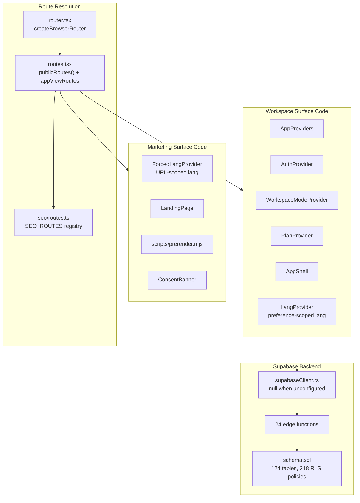
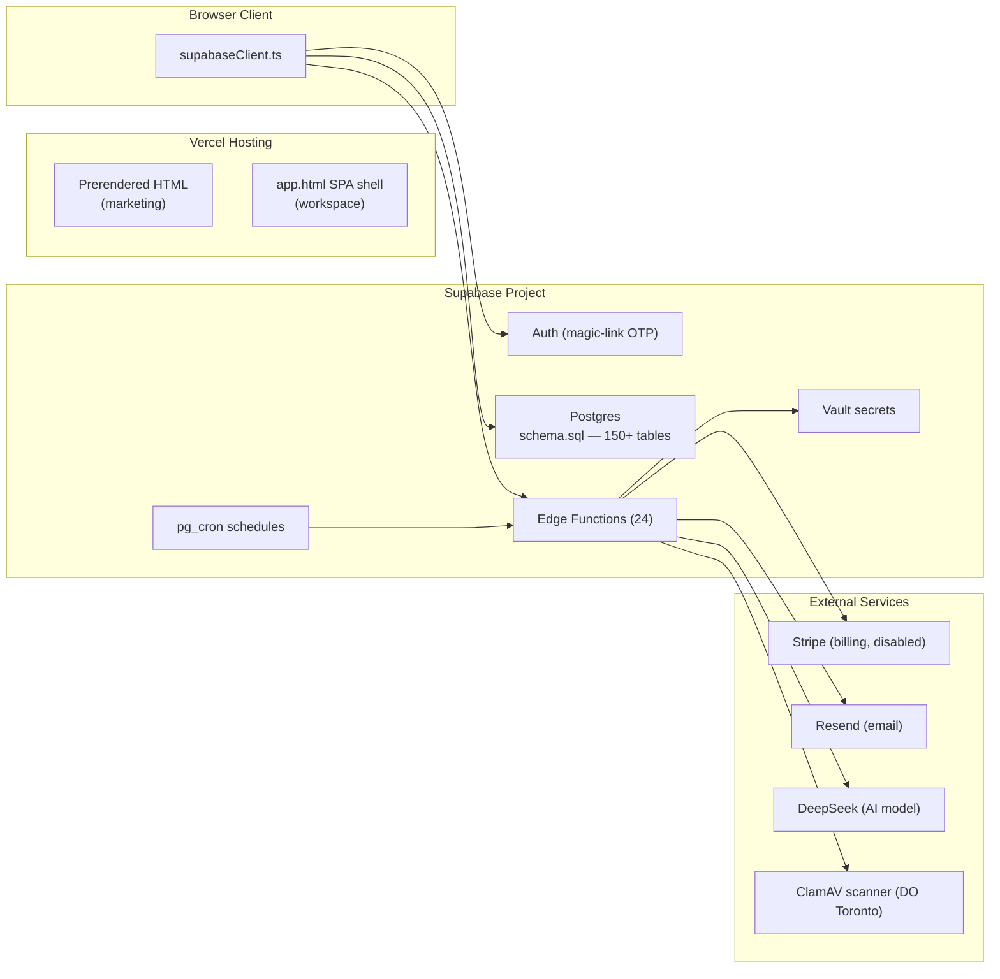

# Dutiva Platform Overview

<details>
<summary>Relevant source files</summary>

The following files were used as context for generating this wiki page:

- [AGENTS.md](AGENTS.md)
- [CONVENTIONS.md](CONVENTIONS.md)
- [README.md](README.md)
- [docs/CANONICAL_FACTS.md](docs/CANONICAL_FACTS.md)
- [docs/TODO.md](docs/TODO.md)
- [scripts/check-canonical-facts.mjs](scripts/check-canonical-facts.mjs)
- [src/canonicalFacts.test.ts](src/canonicalFacts.test.ts)
- [src/features/app/guidance/GuidanceSourcesPanel.test.tsx](src/features/app/guidance/GuidanceSourcesPanel.test.tsx)
- [src/features/app/guidance/GuidanceSourcesPanel.tsx](src/features/app/guidance/GuidanceSourcesPanel.tsx)
- [src/features/app/guidance/monitoringCoverage.test.ts](src/features/app/guidance/monitoringCoverage.test.ts)
- [src/features/app/guidance/monitoringCoverage.ts](src/features/app/guidance/monitoringCoverage.ts)
- [src/features/app/views/employees/EmployeesProductionView.tsx](src/features/app/views/employees/EmployeesProductionView.tsx)
- [src/features/app/workspaceMode/ProductionEmptyState.tsx](src/features/app/workspaceMode/ProductionEmptyState.tsx)
- [src/features/app/workspaceMode/WorkspaceModeProvider.tsx](src/features/app/workspaceMode/WorkspaceModeProvider.tsx)
- [src/features/app/workspaceMode/api.ts](src/features/app/workspaceMode/api.ts)
- [src/features/app/workspaceMode/workspaceModeContext.ts](src/features/app/workspaceMode/workspaceModeContext.ts)
- [src/features/marketing/articles/editorialFigures.test.ts](src/features/marketing/articles/editorialFigures.test.ts)
- [src/features/marketing/articles/editorialFigures.ts](src/features/marketing/articles/editorialFigures.ts)
- [src/i18n/messages/guidance.ts](src/i18n/messages/guidance.ts)
- [supabase/config.toml](supabase/config.toml)
- [supabase/migrations/0074_revoke_flag_guidance_public_execute.sql](supabase/migrations/0074_revoke_flag_guidance_public_execute.sql)
- [supabase/schema.sql](supabase/schema.sql)

</details>

Dutiva is a bilingual (English / French Canadian) HR compliance SaaS product built by **Dutiva Canada Inc.**, a federally incorporated Canadian company based in Ottawa. The platform helps Canadian employers manage HR compliance — documents, deadlines, and workplace decisions — with practical, AI-assisted guidance covering Ontario (ESA 2000), Québec (LNT), and federally regulated workplaces (Canada Labour Code Part III).

The codebase implements three surfaces — a public marketing site at `dutiva.ca`, a **public read-only demo** at `/demo` (and `/fr/demo`), and the signed-in product workspace at `/app/*` — in a single React 19 monolith deployed on Vercel, with Supabase as the backend.

Sources: [README.md:1-7](), [docs/CANONICAL_FACTS.md:1-55]()

---

## Tech Stack

| Layer        | Technology                            | Version                        | Notes                                         |
| ------------ | ------------------------------------- | ------------------------------ | --------------------------------------------- |
| UI framework | React                                 | 19                             | Strict TypeScript, `tsc -b`                   |
| Build tool   | Vite                                  | 8                              | SSR build for prerendering                    |
| CSS          | Tailwind CSS                          | v4                             | `@tailwindcss/vite` plugin                    |
| Routing      | react-router-dom                      | v7                             | `createBrowserRouter` in `src/app/router.tsx` |
| Backend      | Supabase                              | `@supabase/supabase-js` ^2.110 | Auth, Postgres, Edge Functions, Vault         |
| Hosting      | Vercel                                | —                              | Static + SPA rewrites via `vercel.json`       |
| Icons        | lucide-react                          | —                              | Only icon library allowed                     |
| Charts       | recharts                              | —                              | Analytics dashboard                           |
| AI model     | DeepSeek                              | —                              | Via `advisor-chat` edge function              |
| Validation   | Zod                                   | v4                             | AdvisorResponse contract, forms               |
| Linting      | oxlint                                | —                              | Fast Rust-based linter                        |
| Testing      | Vitest + Testing Library + Playwright | —                              | Unit/integration + e2e                        |
| TypeScript   | ~6.0                                  | Strict mode                    | `tsc -b` via `npm run typecheck`              |

The `package.json` defines the build pipeline as a multi-step chain: `tsc -b` → `vite build` → sourcemap relocation → SSR build → prerender → SEO validation → entry-graph budget check → service worker generation.

Sources: [package.json:1-50](), [CONVENTIONS.md:8-13](), [vite.config.ts:1-30]()

---

## Three-Surface Architecture

The application is split into three surfaces that share a codebase but differ in routing, rendering, i18n strategy, and access control.

**Three-surface route architecture**

```mermaid
graph LR
    subgraph MarketingSurface["Marketing Surface (dutiva.ca)"]
        EN_ROUTES["PublicShell lang=en"]
        FR_ROUTES["PublicShell lang=fr"]
        EN_ROUTES --- LP["LandingPage /"]
        EN_ROUTES --- MORE_EN["... changelog, pricing, legal, guides"]
        FR_ROUTES --- LP_FR["LandingPage /fr"]
        FR_ROUTES --- MORE_FR["... localized slugs"]
    end

    subgraph DemoSurface["Public Demo (/demo, /fr/demo)"]
        DEMO_ROOT["PublicDemoWorkspace"]
        DEMO_ROOT --- DEMO_HOME["HomeView /demo/home"]
        DEMO_ROOT --- DEMO_ADV["AdvisorView /demo/advisor"]
        DEMO_ROOT --- DEMO_DOCS["DocumentsLayout /demo/documents/*"]
        DEMO_ROOT --- DEMO_TOUR["DemoTourRail + PublicDemoBanner"]
    end

    subgraph WorkspaceSurface["Workspace Surface (/app/*)"]
        APP_ENTRY["AppWelcome /app/welcome"]
        WORKSPACE["Workspace → AppShell"]
        WORKSPACE --- HOME["HomeView /app/home"]
        WORKSPACE --- MORE_APP["... 18+ view routes"]
    end

    MarketingSurface -. "code-split boundary" .-> DemoSurface
    DemoSurface -. "code-split boundary" .-> WorkspaceSurface
```



Sources: [src/app/routes.tsx:198-227](), [src/app/appSurface.tsx:77-91](), [src/app/appViews.tsx:1-30]()

### Marketing surface

Public pages are bilingual via URL prefix — English at unprefixed paths (`/about`), French under `/fr` with localized slugs (`/fr/a-propos`). Language is forced by `ForcedLangProvider` wrapping each locale tree. All 14 static routes plus legal docs, help articles, and editorial articles are registered in the SEO route registry at `src/seo/routes.ts`. Pages are prerendered to static HTML at build time by `scripts/prerender.mjs` and indexed by search engines.

Sources: [src/seo/routes.ts:1-50](), [src/app/routes.tsx:80-111](), [CONVENTIONS.md:42-61]()

### Public demo surface

The read-only demo at `/demo` (English) and `/fr/demo` (French) reuses the same `AppShell` and Northgate Logistics fixtures as demo mode, without sign-in. `PublicDemoProvider` sets `isPublicDemo` and `readOnly`; `WorkspaceModeProvider` forces demo mode on this surface. Language is URL-scoped via `ForcedWorkspaceLangProvider`, which loads the **workspace** message catalogue (not marketing-only keys) so doclib and Advisor strings resolve.

The shell adds `PublicDemoBanner` (sample data, read-only) and `DemoTourRail` (**seven** guided stops: Home, Advisor, Document Studio, Workflows, Cases, Analytics, Communications). On phone widths the tour compacts to the active stop + **Next →** link + expandable **All stops** tray ([#279](https://github.com/Dutiva-Canada/Dutiva_Web/pull/279), [#280](https://github.com/Dutiva-Canada/Dutiva_Web/pull/280)). Public demo nav includes Communications, Compensation, Wellbeing, and Analytics via `PUBLIC_DEMO_NAV_KEYS`. Landing-page `#workspace` mini-simulations and module chips link into `/demo/*`. Subpaths rewrite to `app.html` on Vercel; `/demo` and `/fr/demo` index pages are prerendered for SEO (`demoWorkspace` route).

Sources: [src/app/appSurface.tsx:77-91](), [src/i18n/ForcedWorkspaceLangProvider.tsx:1-52](), [src/features/app/demo/DemoTourRail.tsx:1-73](), [vercel.json](), [src/seo/routes.ts:285-288]()

### Workspace surface

The workspace lives under `/app/*`, is client-rendered, and carries `X-Robots-Tag: noindex, nofollow` headers via `vercel.json`. Routes are defined in `src/app/appViews.tsx` as lazy-loaded `RouteObject` children of the `AppShell` layout. Every view is wrapped in `AppProviders`, which composes eight React context providers in a strict nesting order:

```
AuthProvider → PlanProvider → WorkspaceModeProvider → ToastsProvider
  → RailProvider → SearchProvider → DocStudioProvider → WorkspaceContextProvider
```

The workspace includes multi-screen module layouts for **Communications Platform** (`/app/comms`, 8 screens) and **Finance** (`/app/finance`, 10 screens), each with their own data context providers, bilingual message catalogues, and integration-led persistence layers.

Sources: [src/features/app/AppProviders.tsx:1-43](), [vercel.json:1-60](), [src/app/appViews.tsx:1-50]()

### Configured-or-inert pattern

The Supabase client (`src/lib/supabaseClient.ts`) returns `null` when `VITE_SUPABASE_URL` and `VITE_SUPABASE_ANON_KEY` are not set. Auth-gated features degrade to their signed-out state rather than throwing. This "configured or inert" pattern runs throughout the codebase — Stripe billing, error reporting, analytics, and CAPTCHA all activate only when their respective secrets are present. For details, see [Getting Started & Environment Setup](#1.1).

Sources: [src/lib/supabaseClient.ts:1-16](), [.env.example:1-20]()

---

## Three-Surface Code Entity Map

**Code entities mapped to surface architecture**



Sources: [src/app/router.tsx:1-8](), [src/app/routes.tsx:1-30](), [src/seo/routes.ts:1-60](), [src/features/app/AppProviders.tsx:25-42](), [src/lib/supabaseClient.ts:1-16]()

---

## Workspace Mode: Demo vs Production

The workspace defaults to a **demo** experience powered by typed bilingual fixture data (`src/data/`) portraying a fictional company called Northgate Logistics Inc. A signed-in admin can switch to **production** mode via `useWorkspaceMode()`, which provisions a real organization via the `create_organization()` RPC and scopes all reads and writes to that `organization_id`.

`WorkspaceModeProvider` resolves the mode by checking admin status (`checkIsAdmin()`), reading the stored preference (`fetchStoredMode()`), and loading the admin's profile and organization membership. The `ModeGate` component and the `gated()` wrapper in `appViews.tsx` control which views show fixture data vs. production data.

Modules are ungated individually as they gain real persistence — employees, cases, communications, compensation, wellbeing, hiring, comms platform, and finance have already been ungated and dispatch on mode internally. Still-gated modules render a `ProductionEmptyState` in production mode.

Sources: [src/features/app/workspaceMode/WorkspaceModeProvider.tsx:1-60](), [src/features/app/workspaceMode/workspaceModeContext.ts:1-55](), [src/app/appViews.tsx:14-25]()

---

## The Four Ring Framework

Dutiva's product scope is organized as four concentric rings. Each ring extends the previous one, and **all four rings are complete** as of the current codebase.

| Ring | Pillar                            | Question It Answers                         | Code Artifacts                                                                        |
| ---- | --------------------------------- | ------------------------------------------- | ------------------------------------------------------------------------------------- |
| 1    | HR Compliance Core                | What do I legally have to do?               | `catalogue.ts` templates T01–T20, Advisor, compliance register, cases, employees      |
| 2    | Workplace Wellness                | How do I support my employees properly?     | Accommodation templates (T21–T24), mental health/psych safety flows, leave management |
| 3    | Internal Communications           | How do I communicate this to my team?       | Templates T35–T43 (layoff, policy rollout, crisis comms)                              |
| 4    | Compensation & Financial Literacy | Am I paying fairly, and explaining it well? | Templates T45–T46, reference guides (pay-statement, retirement-savings)               |

The rings are a **sequencing and packaging** device, not pricing tiers — no plan in `PLANS` is scoped by ring. The template catalogue (`src/features/app/documents/catalogue.ts`) combines templates from `data/templates/` and `customTemplates.ts` into a single sorted list of **50 templates** (T01–T50).

Note: workspace modules like `/app/communications`, `/app/compensation`, and `/app/wellbeing` share names with rings but are **not** the rings themselves. The rings are the templates, guides, and flows.

Sources: [docs/FOUR_RING_FRAMEWORK.md:1-70](), [src/features/app/documents/catalogue.ts:1-20](), [docs/CANONICAL_FACTS.md:43-49]()

---

## Operational State: Beta

The platform is in **beta**. Key operational facts, enforced by CI:

| Fact           | Value                                                                   | Source of Truth                                                    |
| -------------- | ----------------------------------------------------------------------- | ------------------------------------------------------------------ |
| Beta capacity  | **15** individuals/organizations                                        | `BETA_COHORT_LIMIT` in `src/config/beta.ts`                        |
| Paid plans     | **Open** — support membership; free cohort of **15** remains waitlisted | `PAID_PLANS_DISABLED_DURING_BETA = false` in `src/config/plans.ts` |
| Plan tiers     | Free · Starter $24 · Growth $49 · Pro $99 CAD/mo                        | `PLANS` array in `src/config/plans.ts`                             |
| Annual billing | 10 of 12 months charged                                                 | `ANNUAL_MONTHS_BILLED = 10`                                        |
| Jurisdictions  | 3 — ON, QC, FED                                                         | `MONITORING_COVERAGE` in `monitoringCoverage.ts`                   |
| Templates      | 50 (T01–T50)                                                            | `allTemplates` in `catalogue.ts`                                   |
| Languages      | EN + FR, both surfaces                                                  | `src/i18n/` — EN unprefixed, FR under `/fr`                        |
| Law monitoring | All 3 jurisdictions confirmed active (audit 2026-08-10)                 | `COVERAGE_AUDITED_ON` in `monitoringCoverage.ts`                   |

The beta cohort limit is enforced server-side in the `current_user_is_workspace_member()` RPC (migration `0067_beta_cohort_capacity.sql`) and the `create-beta-signup` edge function. The signup form continues accepting interest as a waiting list after the cohort fills. `src/canonicalFacts.test.ts` fails the build if any copy of the limit drifts.

Sources: [src/config/beta.ts:1-19](), [src/config/plans.ts:72-80](), [src/canonicalFacts.test.ts:82-190](), [docs/CANONICAL_FACTS.md:40-55](), [src/features/app/guidance/monitoringCoverage.ts:32-79]()

---

## Canonical Facts & Convention Enforcement

The codebase enforces agreement between documentation and code through two mechanisms:

- **`docs/CANONICAL_FACTS.md`** — the source of record for every load-bearing fact (template counts, pricing, jurisdiction coverage, legal details). Bidirectional drift guards in `src/canonicalFacts.test.ts` and `scripts/check-canonical-facts.mjs` ensure these facts stay aligned with the code they describe.
- **`CONVENTIONS.md`** — the engineering standards: directory layout, routing conventions, surface scopes, CSS token rules, i18n bilingual requirements, and workspace mode patterns.

Both are exercised by `npm run check`, the merge gate. For details, see [Conventions & Canonical Facts](#1.2).

Sources: [docs/CANONICAL_FACTS.md:1-35](), [src/canonicalFacts.test.ts:1-33](), [CONVENTIONS.md:1-38]()

---

## Backend at a Glance

The Supabase backend comprises a 150+ table Postgres schema with 218+ RLS policies and 24 edge functions. Edge functions are split by authentication mode — some use JWT verification, while webhooks, cron workers, and public intake forms authenticate in-band. The `supabase/config.toml` pins `verify_jwt` per function to prevent accidental lockouts during deployment.

**Backend topology**



Sources: [supabase/config.toml:1-72](), [supabase/schema.sql:1-100]()

---

## Key npm Scripts

| Command                    | Purpose                                                                                               |
| -------------------------- | ----------------------------------------------------------------------------------------------------- |
| `npm run dev`              | Vite dev server                                                                                       |
| `npm run build`            | Full production build chain (typecheck → build → SSR → prerender → SEO validation → entry-graph → SW) |
| `npm run check`            | Merge gate: typecheck + lint + test + migration check + RLS check + canonical facts + message scopes  |
| `npm run typecheck`        | `tsc -b` (strict)                                                                                     |
| `npm run lint`             | oxlint                                                                                                |
| `npm run test`             | Vitest (jsdom + Testing Library)                                                                      |
| `npm run test:e2e`         | Playwright browser tests                                                                              |
| `npm run check:facts`      | Brand palette drift guard (`scripts/check-canonical-facts.mjs`)                                       |
| `npm run check:migrations` | Migration filename discipline + forward/reverse drift detection                                       |
| `npm run check:rls`        | Runtime RLS regression probing                                                                        |

For details on setting up the development environment, see [Getting Started & Environment Setup](#1.1).

Sources: [package.json:8-26](), [README.md:29-40]()

---

## Mobile responsiveness (marketing + workspace)

Both public surfaces and the signed-in workspace were polished for phones and small tablets in **Aug 2026** (PRs [#276](https://github.com/Dutiva-Canada/Dutiva_Web/pull/276) marketing, [#277](https://github.com/Dutiva-Canada/Dutiva_Web/pull/277) app). Document preview and marketing overlay fixes landed in [#270](https://github.com/Dutiva-Canada/Dutiva_Web/pull/270)–[#274](https://github.com/Dutiva-Canada/Dutiva_Web/pull/274). Synced to `main` at `ab8a5b1`.

| Area                                | Behaviour on `<768px`                                                                                                                                                                         |
| ----------------------------------- | --------------------------------------------------------------------------------------------------------------------------------------------------------------------------------------------- |
| **Marketing** (`dutiva.ca`)         | Overflow-safe `marketing-auto-grid` utilities, tighter section gutters, 44px tap targets on header/demo sections, cookie banner full-width actions, template samples open in a portaled modal |
| **App shell**                       | Existing drawer + bottom tab bar (`AppShell` / `MobileNav`); `AppPage` default padding `14px` → `32px` at `sm`                                                                                |
| **Advisor**                         | `ThreadListMobileAccess` — bar + full-screen conversation sheet; compliance workspace inline panel only at `≥1024px` (`lg`), otherwise header pill opens sheet                                |
| **Memory** (`/app/settings/memory`) | `MemoryMobileNavAccess` — bar + full nav sheet; chat recall exposes “What I know” as a sheet below `lg`                                                                                       |
| **Admin tables**                    | Settings roles matrix, production document repository, export audit, and support admin tickets render stacked cards instead of horizontal scroll                                              |
| **Shared hook**                     | `useMediaQuery` / `useMdUp` / `useLgUp` in `src/lib/useMediaQuery.ts` gates layouts where Tailwind breakpoints alone are insufficient (tests + real viewports)                                |

Sources: [src/features/marketing/landing.css](), [src/features/app/views/advisor/ThreadList.tsx](), [src/features/app/views/memory/MemoryLayout.tsx](), [src/features/app/shell/AppPage.tsx](), [src/lib/useMediaQuery.ts]()

---

## Child Pages

| Page                                        | What It Covers                                                                                                                                                                                                     |
| ------------------------------------------- | ------------------------------------------------------------------------------------------------------------------------------------------------------------------------------------------------------------------ |
| [Getting Started & Environment Setup](#1.1) | Cloning, `npm` scripts, `.env.example` variables, Supabase project setup, Vercel deployment, the configured-or-inert pattern where `supabaseClient` returns `null` when unconfigured                               |
| [Conventions & Canonical Facts](#1.2)       | `CONVENTIONS.md` engineering standards (surface scopes, CSS tokens, i18n, routing), `CANONICAL_FACTS.md` governance, the bidirectional CI drift guards in `canonicalFacts.test.ts` and `check-canonical-facts.mjs` |

---
