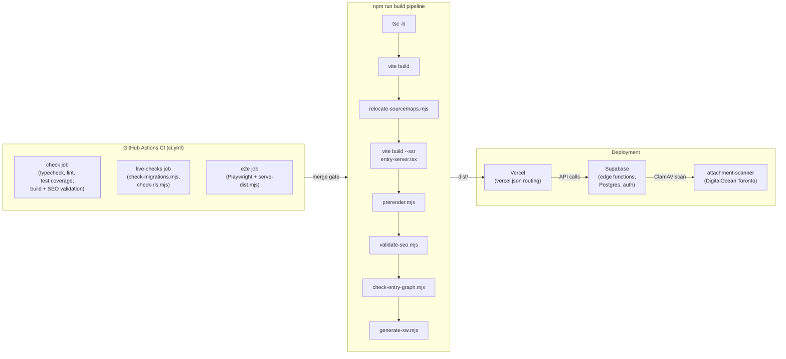
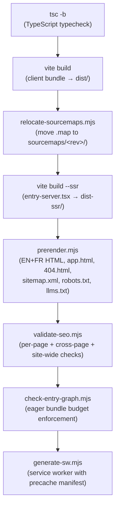
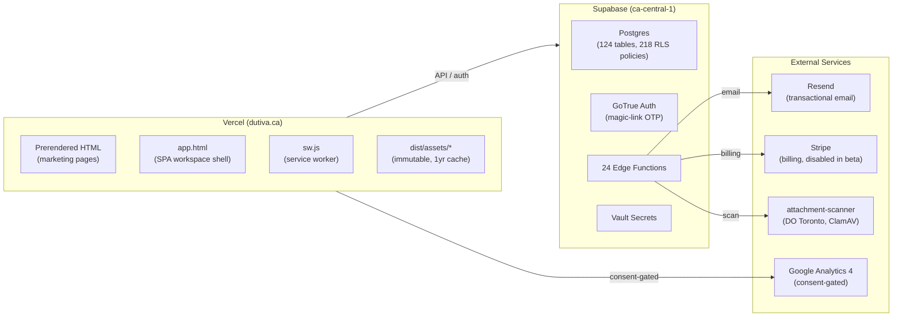

# Infrastructure & CI/CD

Relevant source files

The following files were used as context for generating this wiki page:

- [.github/workflows/ci.yml](.github/workflows/ci.yml)
- [docs/AUTH_EMAIL_TEMPLATES.md](docs/AUTH_EMAIL_TEMPLATES.md)
- [docs/SUPPORT_ANALYTICS.md](docs/SUPPORT_ANALYTICS.md)
- [package.json](package.json)
- [scripts/apply-auth-email-templates.mjs](scripts/apply-auth-email-templates.mjs)
- [scripts/check-migrations.mjs](scripts/check-migrations.mjs)
- [scripts/check-rls.mjs](scripts/check-rls.mjs)
- [scripts/lib/secrets.mjs](scripts/lib/secrets.mjs)
- [scripts/lib/secrets.test.mjs](scripts/lib/secrets.test.mjs)
- [src/features/marketing/analytics/ga4.test.ts](src/features/marketing/analytics/ga4.test.ts)
- [src/features/marketing/analytics/ga4.ts](src/features/marketing/analytics/ga4.ts)
- [src/features/support/analytics/supportAnalytics.test.ts](src/features/support/analytics/supportAnalytics.test.ts)
- [src/features/support/analytics/supportAnalytics.ts](src/features/support/analytics/supportAnalytics.ts)
- [supabase/migrations/0052_purge_support_analytics_rate_limit.sql](supabase/migrations/0052_purge_support_analytics_rate_limit.sql)

Dutiva's infrastructure spans a **Vite + React 19** client build, a **Supabase** backend (edge functions, Postgres, auth), **Vercel** static/SPA hosting, and a suite of custom build scripts that enforce correctness invariants at every stage. The CI pipeline runs on **GitHub Actions** with three isolated jobs that separate deterministic checks from credentialed live-project probes and browser-driven e2e tests.

This page provides a high-level map of how code moves from source to production and how operational integrity is maintained. Each subsystem is covered in depth by a child page linked below.

## Architecture Overview

**Build & Deploy Pipeline**

Sources: [.github/workflows/ci.yml:1-130](), [package.json:8-9](), [vercel.json:1-62]()

## CI Pipeline & Testing

The CI workflow in `.github/workflows/ci.yml` triggers on pull requests, pushes to `main`, and manual `workflow_dispatch` events. It defines three independent jobs:

| Job           | Purpose                                                                                                                                                    | Credentials needed                              | Failure impact                                   |
| ------------- | ---------------------------------------------------------------------------------------------------------------------------------------------------------- | ----------------------------------------------- | ------------------------------------------------ |
| `check`       | Merge gate: typecheck, lint, `test:coverage`, message scopes, canonical facts, full `build` (includes SEO validation + entry-graph budget + SW generation) | None                                            | Blocks merge                                     |
| `live-checks` | Migration drift (`check-migrations.mjs`) and RLS regression (`check-rls.mjs`) against the live Supabase project                                            | `SUPABASE_ACCESS_TOKEN`, `SUPABASE_PROJECT_REF` | Reports independently; never blocks `check`      |
| `e2e`         | Playwright browser smoke tests against the built `dist/` served by `serve-dist.mjs`                                                                        | None                                            | Independent; browser flakes never block the gate |

The `check` job was deliberately isolated as the required status check after an incident (documented in `docs/TODO.md` OA19) where a broken `SUPABASE_ACCESS_TOKEN` caused two days of unverified builds to merge green. The `live-checks` job uses a "loud skipping" pattern — when credentials are absent, it exits 0 but writes a `::warning` annotation and a `GITHUB_STEP_SUMMARY` entry so a green result is never mistaken for a verified one.

Tests use **Vitest** (jsdom environment, V8 coverage with 80/65/75/80 thresholds) for unit/integration tests and **Playwright** (Chromium-only) for e2e. The e2e suite uses a custom `serve-dist.mjs` static server that mirrors the Vercel routing contract (`/app/*` → `app.html`, clean URLs, `404.html`).

For details, see [CI Pipeline & Testing](#11.1).

Sources: [.github/workflows/ci.yml:21-130](), [vite.config.ts:255-283](), [playwright.config.ts:1-45](), [e2e/serve-dist.mjs:1-99]()

## Build Pipeline

The `npm run build` script chains seven steps in sequence, each feeding the next:

The build produces hidden source maps (`build.sourcemap: 'hidden'` in `vite.config.ts`), meaning `.map` files exist but carry no `sourceMappingURL` comment. `relocate-sourcemaps.mjs` moves them out of `dist/` before deployment so they are never publicly served. Prerendering uses `entry-server.tsx`, which calls `react-dom/static`'s `prerender` over the same route table the browser uses, producing crawlable HTML with full SEO metadata for every public page.

Beyond the build chain, the `scripts/` directory contains **13 scripts** plus a `lib/secrets.mjs` utility for credential handling. These scripts serve as integrity guards that enforce invariants spanning code, documentation, database state, and bundle output.

For details, see [Build Scripts & Integrity Guards](#11.2).

Sources: [package.json:8-9](), [scripts/relocate-sourcemaps.mjs:1-65](), [scripts/prerender.mjs:1-97](), [src/entry-server.tsx:1-131](), [vite.config.ts:156-161](), [scripts/lib/secrets.mjs:1-69]()

## Build Scripts & Integrity Guards

The scripts under `scripts/` fall into two categories: **build-chain steps** (run as part of `npm run build`) and **standalone checks** (run independently in CI or via `npm run check`).

| Script                           | Category        | What it guards                                                         |
| -------------------------------- | --------------- | ---------------------------------------------------------------------- |
| `relocate-sourcemaps.mjs`        | Build chain     | Source maps never deployed publicly                                    |
| `prerender.mjs`                  | Build chain     | Every public page has crawlable HTML + sitemap + robots.txt + llms.txt |
| `validate-seo.mjs`               | Build chain     | Per-page metadata, hreflang reciprocity, sitemap consistency           |
| `check-entry-graph.mjs`          | Build chain     | Eager bundle budget (≤580 KB, ≤9 preloads)                             |
| `generate-sw.mjs`                | Build chain     | Service worker with deterministic precache manifest                    |
| `check-migrations.mjs`           | Standalone (CI) | Filename discipline + drift against live Supabase                      |
| `check-rls.mjs`                  | Standalone (CI) | RLS regression — anonymous reads of sensitive tables                   |
| `check-canonical-facts.mjs`      | Standalone (CI) | Brand palette drift between docs and CSS                               |
| `check-message-scopes.mjs`       | Standalone (CI) | i18n surface boundary (workspace/marketing/shared)                     |
| `apply-auth-email-templates.mjs` | Manual          | Pushes sign-in email templates to Supabase project config              |

For details, see [Build Scripts & Integrity Guards](#11.2).

Sources: [package.json:6-26](), [scripts/check-migrations.mjs:1-46](), [scripts/check-rls.mjs:1-50](), [scripts/check-entry-graph.mjs:1-48](), [scripts/validate-seo.mjs:1-13]()

## Deployment & Hosting

**Deployment Architecture**

The Vercel deployment is configured via `vercel.json`:

- **Rewrites**: `/app` and `/app/*` → `app.html` (SPA shell for the workspace) [vercel.json:11-14]()
- **Redirects**: `www.dutiva.ca` → `dutiva.ca` (permanent) [vercel.json:4-9]()
- **Security headers**: CSP, `X-Frame-Options: DENY`, HSTS (2-year), `Permissions-Policy`, `nosniff`, strict referrer [vercel.json:16-36]()
- **Robots**: `X-Robots-Tag: noindex, nofollow` on `/app/*`, `app.html`, and all `*.vercel.app` domains [vercel.json:38-53]()
- **Caching**: Hashed assets get `immutable` 1-year cache; `sw.js` gets `must-revalidate` [vercel.json:54-61]()

The Vite build configuration (`vite.config.ts`) manages code-splitting into four chunk groups: `messages-marketing`, `messages-workspace`, `vendor` (excluding `@supabase`, `recharts`/d3, and the `react-markdown` tree), and default chunking for everything else. The `dependencyClosure` function automatically computes the 99-package `react-markdown` tree to keep it out of the vendor chunk.

Sources: [vercel.json:1-62](), [vite.config.ts:70-254]()

## Error Reporting, Theme & Shared Libraries

The client error reporting pipeline (`src/lib/errorReporting/`) provides PII-scrubbed crash reporting pinned to the `ca-central-1` Supabase region. Reports flow from `createReporter` (with rate limiting, fingerprint deduplication, and keepalive transport) through the `report-error` edge function. The `scrubRoute` module uses deny-by-default route pattern matching, and `coarseUserAgent` reduces user-agent strings to coarse categories.

The theme system (`ThemeProvider` in `src/lib/theme.tsx`) supports light/dark modes with `prefers-color-scheme` detection and an index.html inline script that prevents flash-of-wrong-theme during prerender hydration.

Shared utility libraries include `prefs.ts` (safe localStorage), `analyticsConsent.ts` (Quebec Law 25 opt-in gating for both GA4 and first-party analytics), `money.ts` (bilingual CAD formatting), `escapeStack.ts`, `deployEnv.ts`, and `registerServiceWorker.ts`.

For details, see [Error Reporting, Theme & Shared Libraries](#11.3).

Sources: [src/lib/errorReporting/reporter.ts:1-68](), [src/lib/errorReporting/index.ts:1-42](), [src/lib/theme.tsx:1-67](), [src/features/marketing/analytics/ga4.ts:19-55]()

## Fixture Data System

The `src/data/` directory contains **17 fixture files** providing typed, bilingual sample data for the prototype's demo mode. The type definitions in `src/data/types.ts` model the full domain (`Employee`, `CaseFile`, `Task`, `ComplianceItem`, `ChatThread`, `DocumentTemplate`, `MemoryFact`, `CalendarEvent`, etc.). Fixture data files (`employees.ts`, `cases.ts`, `documents.ts`, `tasks.ts`, etc.) export arrays of these types.

Referential integrity is enforced by `src/data/data.test.ts`, which validates unique IDs per collection, cross-reference resolution (tasks → chats, cases → employees + chats, compliance items → chats), and bilingual completeness. The design intent is that views never inline entity data — a future Supabase provider replaces fixtures wholesale without changing view code.

For details, see [Fixture Data System](#11.4).

Sources: [src/data/data.test.ts:1-60](), [src/data/types.ts](), [src/data/index.ts]()

## External Services

| Service                             | Role                                                                 | Region / Residency            | Configuration                                           |
| ----------------------------------- | -------------------------------------------------------------------- | ----------------------------- | ------------------------------------------------------- |
| **Supabase**                        | Database, auth, edge functions, vault secrets                        | `ca-central-1`                | `VITE_SUPABASE_URL`, `VITE_SUPABASE_ANON_KEY`           |
| **Vercel**                          | Static hosting, CDN, SPA routing                                     | Edge (global CDN)             | `vercel.json`, `VERCEL_ENV` baked at build time         |
| **Resend**                          | Transactional email (support notifications, law update digests)      | —                             | Vault secret via edge functions                         |
| **Stripe**                          | Billing (disabled during beta via `PAID_PLANS_DISABLED_DURING_BETA`) | —                             | `create-checkout-session`, `stripe-webhook`             |
| **Google Analytics 4**              | Marketing page analytics                                             | —                             | `VITE_GA_MEASUREMENT_ID`, consent-gated via `loadGa4()` |
| **Cloudflare Turnstile / hCaptcha** | CAPTCHA on public forms                                              | —                             | CSP allowlisted in `vercel.json`                        |
| **ClamAV attachment-scanner**       | Malware scanning for support ticket attachments                      | DigitalOcean Toronto (PIPEDA) | `services/attachment-scanner/`, `do-app.yaml`           |
| **HuggingFace**                     | Change summarization for law monitor                                 | —                             | Edge function `monitor-law-changes`                     |
| **DeepSeek**                        | LLM for advisor chat                                                 | —                             | Edge function `advisor-chat`                            |

All analytics (both GA4 and the first-party Supabase support analytics sink) are gated behind explicit visitor consent via `hasAnalyticsConsent()`, honoring Quebec Law 25 § 8.1 off-by-default requirements.

Sources: [.github/workflows/ci.yml:16-19](), [vercel.json:20-21](), [src/features/marketing/analytics/ga4.ts:22-55](), [services/attachment-scanner/do-app.yaml](), [vite.config.ts:141-154]()

## Configured-or-Inert Pattern

A cross-cutting design principle governs every external integration: **features activate only when their credentials are present**, and are silently inert otherwise. This pattern appears throughout the infrastructure:

- **Error reporting**: inert unless `VERCEL_ENV` is `production`/`preview` and `VITE_SUPABASE_URL` is set [src/lib/errorReporting/index.ts:30-34]()
- **GA4**: inert without `VITE_GA_MEASUREMENT_ID` + consent [src/features/marketing/analytics/ga4.ts:22-34]()
- **CI live-checks**: skip cleanly with a loud warning when `SUPABASE_ACCESS_TOKEN` is absent [scripts/check-migrations.mjs:156-173](), [scripts/check-rls.mjs:68-86]()
- **Build-time verification tags**: injected only when `GOOGLE_SITE_VERIFICATION` / `BING_SITE_VERIFICATION` env vars are set [scripts/prerender.mjs:37-44]()

This ensures the codebase works on fresh clones, forks, and local development without any external service configuration, while activating the full operational surface in production.

Sources: [src/lib/errorReporting/index.ts:7-14](), [scripts/check-rls.mjs:92-107](), [scripts/check-migrations.mjs:139-173]()

---
