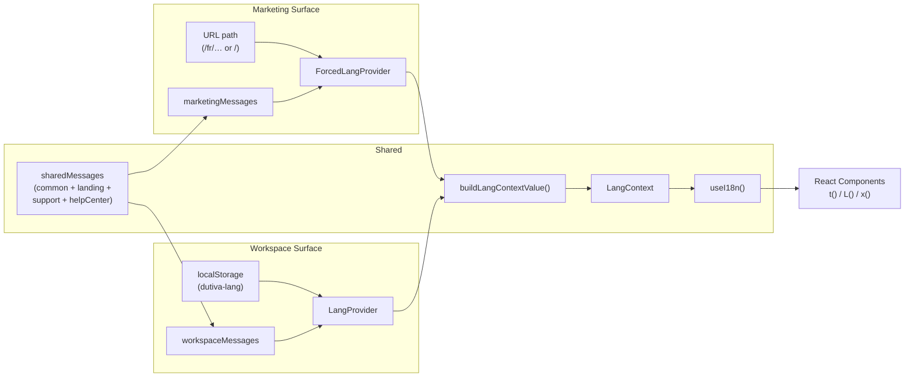

# Internationalization (i18n)

<details>
<summary>Relevant source files</summary>

The following files were used as context for generating this wiki page:

- [CONVENTIONS.md](CONVENTIONS.md)
- [docs/advisor-guidance-corpus-2026-08-04.md](docs/advisor-guidance-corpus-2026-08-04.md)
- [src/features/app/views/employees/EmployeesProductionView.tsx](src/features/app/views/employees/EmployeesProductionView.tsx)
- [src/features/app/workspaceMode/ProductionEmptyState.tsx](src/features/app/workspaceMode/ProductionEmptyState.tsx)
- [src/features/app/workspaceMode/WorkspaceModeProvider.tsx](src/features/app/workspaceMode/WorkspaceModeProvider.tsx)
- [src/features/app/workspaceMode/api.ts](src/features/app/workspaceMode/api.ts)
- [src/features/app/workspaceMode/workspaceModeContext.ts](src/features/app/workspaceMode/workspaceModeContext.ts)
- [src/i18n/ForcedLangProvider.tsx](src/i18n/ForcedLangProvider.tsx)
- [src/i18n/LangProvider.tsx](src/i18n/LangProvider.tsx)
- [src/i18n/lang.ts](src/i18n/lang.ts)
- [src/i18n/messages/shared.ts](src/i18n/messages/shared.ts)
- [src/i18n/messages/workspace.ts](src/i18n/messages/workspace.ts)
- [supabase/migrations/0042_corpus_amendment_tranche_2026_08_04.sql](supabase/migrations/0042_corpus_amendment_tranche_2026_08_04.sql)

</details>

Dutiva is a bilingual Canadian HR platform — every user-facing string ships in both English and French Canadian. The i18n system is a lightweight, compile-time-safe layer built on a single `Bi` type (`{ en, fr }`), two React context providers that differ by surface, and a 47-file message catalogue split into three scope groups. There is no third-party i18n library; the entire system lives under `src/i18n/`.

## Architecture at a Glance

**i18n system structure**

```mermaid
graph TD
    subgraph Types["Core Types (core.ts)"]
        Bi["Bi { en, fr }"]
        Lang["Lang = 'en' | 'fr'"]
        LText["LText = string | Bi"]
        defineMessages["defineMessages()"]
    end

    subgraph Providers["Providers"]
        LangProvider["LangProvider\n(workspace /app…)"]
        ForcedLangProvider["ForcedLangProvider\n(marketing /fr…)"]
        ForcedWorkspaceLangProvider["ForcedWorkspaceLangProvider\n(public demo /demo…)"]
    end

    subgraph Context["context.ts"]
        useI18n["useI18n()\n{ lang, setLang, t, L, x }"]
    end

    subgraph Catalogue["Message Catalogue"]
        workspace["workspace.ts\n(29 modules)"]
        marketing["marketing.ts\n(10 modules)"]
        shared["shared.ts\n(4 modules)"]
    end

    subgraph Guards["Scope Enforcement"]
        scopesTest["scopes.test.ts\n(compile-time)"]
        checkScopes["check-message-scopes.mjs\n(CI runtime)"]
    end

    Bi --> defineMessages
    defineMessages --> Catalogue
    workspace --> LangProvider
    marketing --> ForcedLangProvider
    workspace --> ForcedWorkspaceLangProvider
    shared --> workspace
    shared --> marketing
    LangProvider --> useI18n
    ForcedLangProvider --> useI18n
    ForcedWorkspaceLangProvider --> useI18n
    Catalogue --> Guards
end
```

Sources: [src/i18n/core.ts:1-39](), [src/i18n/context.ts:1-29](), [src/i18n/LangProvider.tsx:1-44](), [src/i18n/ForcedLangProvider.tsx:1-57](), [src/i18n/messages/index.ts:1-93]()

## Core Type System

All bilingual strings are represented by the `Bi` interface — an object with `en` and `fr` fields — defined in `src/i18n/core.ts`. The `bi()` factory creates instances, `pick()` resolves one by language, and `LText` is the union `string | Bi` for state that may or may not be localized. The `defineMessages()` identity function pins each message module to `Record<string, Bi>` while preserving literal key types for full compile-time safety.

[src/i18n/core.ts:1-39]()

The context hook `useI18n()` returns five members: `lang` (current language), `setLang` (toggle), `t()` (key-based catalogue lookup), `L()` (inline bilingual pair), and `x()` (resolve a `Bi` data field). Every component that renders user-facing text consumes this hook.

[src/i18n/context.ts:5-21]()

For details, see [Core i18n Types & Providers](#8.1).

## Three-Provider Architecture

The system uses three providers for three surfaces with different language-selection semantics:

| Provider                      | Surface                           | Language Source                | Persistence                       | Message Catalogue                           |
| ----------------------------- | --------------------------------- | ------------------------------ | --------------------------------- | ------------------------------------------- |
| `LangProvider`                | Workspace (`/app…`)               | `dutiva-lang` localStorage key | User preference, toggles in-place | `workspaceMessages` (29 + 4 shared modules) |
| `ForcedLangProvider`          | Marketing (public pages)          | URL path (`/fr/…` prefix)      | URL is source of truth            | `marketingMessages` (10 + 4 shared modules) |
| `ForcedWorkspaceLangProvider` | Public demo (`/demo`, `/fr/demo`) | URL path (`/fr/demo` → French) | URL is source of truth            | `workspaceMessages` (same as `/app`)        |

`LangProvider` reads the persisted preference via `readLang()` and allows the user to switch language at will. Both forced providers derive language from the URL so shared links render consistently for visitors and crawlers. The public demo uses the **workspace** catalogue — not marketing — so doclib, Advisor, and shell keys resolve on `/demo`.

[src/i18n/LangProvider.tsx:26-44](), [src/i18n/ForcedLangProvider.tsx:22-57](), [src/i18n/ForcedWorkspaceLangProvider.tsx:1-52](), [src/i18n/lang.ts:9-10]()

Both providers delegate context assembly to `buildLangContextValue()`, which accepts the message catalogue as a parameter. This factory includes graceful degradation: if a key is missing from the current surface's catalogue (a scope violation), it logs an error and returns the raw key rather than crashing the page.

[src/i18n/lang.ts:37-60]()

For details, see [Core i18n Types & Providers](#8.1).

## Provider-to-Surface Mapping

**How providers attach to surfaces**



Sources: [src/i18n/LangProvider.tsx:38-39](), [src/i18n/ForcedLangProvider.tsx:51-52](), [src/i18n/lang.ts:37-60](), [src/i18n/messages/workspace.ts:39-70](), [src/i18n/messages/marketing.ts:20-32](), [src/i18n/messages/shared.ts:24-29]()

## Message Catalogue Organization

The 47 message module files are organized into three groups based on empirical consumer analysis — which source files under which directories actually import each module:

| Group     | Entry file     | Module count | Purpose                                            |
| --------- | -------------- | ------------ | -------------------------------------------------- |
| Workspace | `workspace.ts` | 29           | Modules read only from `src/features/app/**`       |
| Marketing | `marketing.ts` | 10           | Modules read only from `src/features/marketing/**` |
| Shared    | `shared.ts`    | 4            | Modules genuinely read from both surfaces          |

Each message module follows a consistent pattern: export a `const` created by `defineMessages()`, with every key prefixed by the feature name (e.g., `shell_*`, `home_*`, `advisor_*`, `landing_*`). This prefix convention avoids key collisions when modules are merged into surface-level catalogues.

[src/i18n/messages/workspace.ts:1-77](), [src/i18n/messages/marketing.ts:1-35](), [src/i18n/messages/shared.ts:1-31]()

The merged catalogue is exported from `src/i18n/messages/index.ts` as `messages` with the union type `MessageKey`. Surface-scoped types (`WorkspaceMessageKey`, `MarketingMessageKey`, `SharedMessageKey`) are exported for call sites that carry keys through data structures.

[src/i18n/messages/index.ts:86-92]()

For details, see [Message Catalogue Organization & Scope Enforcement](#8.2).

## Scope Enforcement

The surface boundary is enforced at two levels:

1. **Compile-time**: `scopes.test.ts` uses `@ts-expect-error` assertions to verify that workspace-only keys are not assignable to `MarketingMessageKey` and vice versa. If a module is accidentally added to two groups, the types collapse and the build fails.

2. **CI runtime**: `scripts/check-message-scopes.mjs` scans every `.ts`/`.tsx` file under each surface's directory for literal `t('key')` calls and checks that the key belongs to that surface's allowed set. Violations fail the `npm run check` gate.

[src/i18n/messages/scopes.test.ts:1-78](), [scripts/check-message-scopes.mjs:1-141]()

For details, see [Message Catalogue Organization & Scope Enforcement](#8.2).

## Bundle Optimization

The three-group split has a direct impact on bundle size. Because `ForcedLangProvider` imports `marketingMessages` directly (not the full merged catalogue), marketing pages only pull the 10 marketing + 4 shared message modules into their JavaScript bundle. The 29 workspace-only modules are code-split behind the `/app` lazy route boundary. Vite's `codeSplitting.groups` configuration mirrors this boundary with `messages-marketing` and `messages-workspace` chunk groups.

[src/i18n/ForcedLangProvider.tsx:9](), [src/i18n/messages/index.ts:46-60]()

## Typical Component Usage

Components access i18n through three resolution patterns, all exposed by `useI18n()`:

| Method | Signature                            | Use Case                           | Example                   |
| ------ | ------------------------------------ | ---------------------------------- | ------------------------- |
| `t()`  | `(key: MessageKey) => string`        | Catalogue key lookup               | `t('shell_nav_platform')` |
| `x()`  | `(value: Bi) => string`              | Resolve a `Bi` data field directly | `x(M.employees_prod_add)` |
| `L()`  | `(en: string, fr: string) => string` | Inline bilingual pair              | `L('Hello', 'Bonjour')`   |

Most workspace components import their feature's message module as `M` and resolve strings via `x(M.key)` — this provides immediate typecheck without requiring the key to be registered in the catalogue first. The `t('key')` pattern is used when the key is stored in a data structure or computed at runtime.

[src/features/app/views/employees/EmployeesProductionView.tsx:6-8](), [src/features/app/views/employees/EmployeesProductionView.tsx:49](), [src/features/app/workspaceMode/ProductionEmptyState.tsx:4-5](), [src/features/app/workspaceMode/ProductionEmptyState.tsx:14]()

## Testing

The i18n test suite (`src/i18n/i18n.test.tsx`) validates three concerns: that `LangProvider` defaults to English and resolves all three resolution methods (`t`, `L`, `x`), that switching to French persists to `localStorage` and updates the `<html lang>` attribute to `fr-CA`, and that every key in the merged catalogue has non-empty `en` and `fr` values.

[src/i18n/i18n.test.tsx:1-77]()

## Child Pages

| Page                                                       | Topic                                                                                                                                                                                   |
| ---------------------------------------------------------- | --------------------------------------------------------------------------------------------------------------------------------------------------------------------------------------- |
| [Core i18n Types & Providers](#8.1)                        | The `Bi` / `Lang` / `LText` types, `pick`/`pickL`/`keyOfL` helpers, `defineMessages`, `useI18n()` hook, `LangProvider`, `ForcedLangProvider`, `buildLangContextValue()`, HTML lang tags |
| [Message Catalogue Organization & Scope Enforcement](#8.2) | Three-surface message split, 47+ module files, `defineMessages` pattern, feature-prefixed keys, compile-time disjointness tests, CI scope guard, bundle optimization                    |

---
