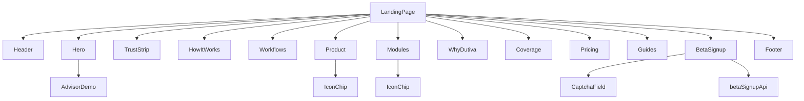
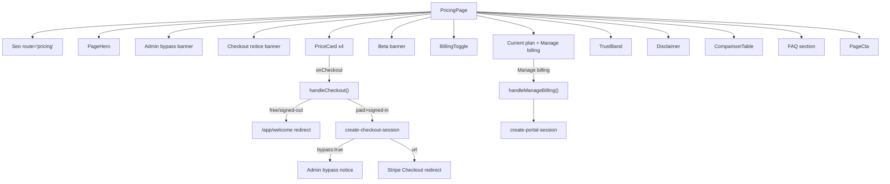
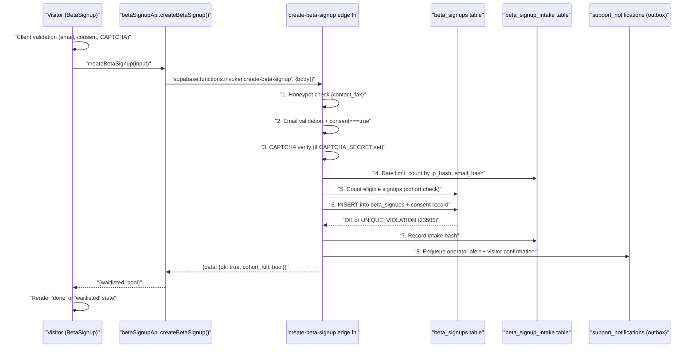
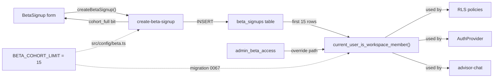

# Landing Page, Pricing & Beta Signup

Relevant source files

The following files were used as context for generating this wiki page:

- [SECURITY.md](SECURITY.md)
- [docs/AUTH_MAGIC_LINK.md](docs/AUTH_MAGIC_LINK.md)
- [docs/BILLING_BETA_AUDIT.md](docs/BILLING_BETA_AUDIT.md)
- [docs/notice-bands-review-pack.md](docs/notice-bands-review-pack.md)
- [public/.well-known/security.txt](public/.well-known/security.txt)
- [src/config/planComparison.ts](src/config/planComparison.ts)
- [src/config/plans.ts](src/config/plans.ts)
- [src/data/calendar.ts](src/data/calendar.ts)
- [src/features/app/advisor/safety/statutoryNotice.ts](src/features/app/advisor/safety/statutoryNotice.ts)
- [src/features/app/documents/screens/RepositoryScreen.tsx](src/features/app/documents/screens/RepositoryScreen.tsx)
- [src/features/marketing/SectionIntro.tsx](src/features/marketing/SectionIntro.tsx)
- [src/features/marketing/betaSignupApi.test.ts](src/features/marketing/betaSignupApi.test.ts)
- [src/features/marketing/betaSignupApi.ts](src/features/marketing/betaSignupApi.ts)
- [src/features/marketing/pages/AboutPage.tsx](src/features/marketing/pages/AboutPage.tsx)
- [src/features/marketing/pages/FaqPage.tsx](src/features/marketing/pages/FaqPage.tsx)
- [src/features/marketing/pages/KnownLimitationsPage.tsx](src/features/marketing/pages/KnownLimitationsPage.tsx)
- [src/features/marketing/pages/PricingCheckout.test.tsx](src/features/marketing/pages/PricingCheckout.test.tsx)
- [src/features/marketing/pages/PricingPage.test.tsx](src/features/marketing/pages/PricingPage.test.tsx)
- [src/features/marketing/pages/PricingPage.tsx](src/features/marketing/pages/PricingPage.tsx)
- [src/features/marketing/pages/TemplateUsagePage.tsx](src/features/marketing/pages/TemplateUsagePage.tsx)
- [src/features/marketing/sections/AdvisorDemo.tsx](src/features/marketing/sections/AdvisorDemo.tsx)
- [src/features/marketing/sections/BetaSignup.test.tsx](src/features/marketing/sections/BetaSignup.test.tsx)
- [src/features/marketing/sections/BetaSignup.tsx](src/features/marketing/sections/BetaSignup.tsx)
- [src/features/marketing/sections/Coverage.tsx](src/features/marketing/sections/Coverage.tsx)
- [src/features/marketing/sections/Guides.tsx](src/features/marketing/sections/Guides.tsx)
- [src/features/marketing/sections/Hero.tsx](src/features/marketing/sections/Hero.tsx)
- [src/features/marketing/sections/HowItWorks.tsx](src/features/marketing/sections/HowItWorks.tsx)
- [src/features/marketing/sections/IconChip.tsx](src/features/marketing/sections/IconChip.tsx)
- [src/features/marketing/sections/Pricing.tsx](src/features/marketing/sections/Pricing.tsx)
- [src/i18n/messages/faq.ts](src/i18n/messages/faq.ts)
- [src/i18n/messages/landing.ts](src/i18n/messages/landing.ts)
- [src/i18n/messages/pricing.ts](src/i18n/messages/pricing.ts)
- [supabase/functions/_shared/caslConsent.test.ts](supabase/functions/_shared/caslConsent.test.ts)
- [supabase/functions/_shared/caslConsent.ts](supabase/functions/_shared/caslConsent.ts)
- [supabase/functions/create-beta-signup/index.ts](supabase/functions/create-beta-signup/index.ts)
- [supabase/migrations/0037_beta_signups_consent_record.sql](supabase/migrations/0037_beta_signups_consent_record.sql)

This page covers the public marketing funnel: the `LandingPage` component and its sections, the standalone `PricingPage` with Stripe checkout integration, the `FaqPage`, the plan configuration system (`plans.ts`, `planComparison.ts`), and the full beta signup flow from the client-side `BetaSignup` form through the `create-beta-signup` edge function.

## Landing Page Architecture

`LandingPage` is the root marketing page served at `/` (and `/fr` for French). It composes 12 section components in a fixed order inside a `surface-marketing` wrapper.

[src/features/marketing/LandingPage.tsx:25-47]()

### Section Composition Order

| Order | Component    | Anchor       | Description                                                                 |
| ----- | ------------ | ------------ | --------------------------------------------------------------------------- |
| 1     | `Header`     | —            | Sticky nav bar with section anchors, lang/theme toggles, sign-in/start CTAs |
| 2     | `Hero`       | `#top`       | Headline + `AdvisorDemo` product frame                                      |
| 3     | `TrustStrip` | —            | Ottawa · PIPEDA · Law 25 · Bilingual pills                                  |
| 4     | `HowItWorks` | `#how`       | Three-step cards (Ask → Get guidance → Generate)                            |
| 5     | `Workflows`  | `#workflows` | 8 workflow tiles + example workflow card                                    |
| 6     | `Product`    | `#product`   | Document Studio features + template category chips                          |
| 7     | `Modules`    | —            | 7 workspace module `IconChip` components                                    |
| 8     | `WhyDutiva`  | —            | Differentiator cards                                                        |
| 9     | `Coverage`   | `#coverage`  | Jurisdiction cards (ON, QC, Federal, Remote)                                |
| 10    | `Pricing`    | `#pricing`   | Plan tier teaser cards (links to `#start`)                                  |
| 11    | `Guides`     | `#guides`    | Guide article teasers from `GUIDE_ARTICLES`                                 |
| 12    | `BetaSignup` | `#start`     | Waiting-list form                                                           |

**Landing page section composition diagram:**

Sources: [src/features/marketing/LandingPage.tsx:1-47](), [src/features/marketing/sections/Hero.tsx:1-94](), [src/features/marketing/sections/BetaSignup.tsx:1-283]()

### i18n: The `useLanding` Hook

All landing sections resolve copy through `useLanding()`, which wraps `useI18n()` and adds a narrowly-typed `lt()` helper. `lt(key)` resolves keys from the `landing` message module directly via `pick(landing[key], lang)`, with compile-time key validation against `LandingMessageKey`.

[src/features/marketing/useLanding.ts:27-32]()

The `landing` message module is classified as **shared** (not marketing-only) in the i18n scope system because plan name/description keys like `landing_free_desc` are referenced by `src/config/plans.ts` (typed as `SharedMessageKey`), and workspace components like `PlanGate` resolve them via `t()`.

[src/features/marketing/useLanding.ts:12-25]()

Sources: [src/features/marketing/useLanding.ts:1-32](), [src/i18n/messages/landing.ts:1-10]()

### Hero & AdvisorDemo

The `Hero` section renders the "director" headline variant (`landing_h_dir_a` / `landing_h_dir_b`) and two CTAs: "Start free — no card" (links to `/app/welcome`) and "See how it works" (anchor to `#how`). A stat strip shows template count (50), legal contexts (3), and bilingual workflows (EN/FR).

[src/features/marketing/sections/Hero.tsx:19-82]()

The right column renders `AdvisorDemo` — a purely presentational, static recreation of the Advisor chat interface showing a sample Ontario termination question, a "Medium risk" badge, an answer bubble with statutory source citation, and two document-generation chips (Termination Letter, Offboarding Checklist).

[src/features/marketing/sections/AdvisorDemo.tsx:10-72]()

Sources: [src/features/marketing/sections/Hero.tsx:1-94](), [src/features/marketing/sections/AdvisorDemo.tsx:1-95]()

### Coverage Section

The `Coverage` section renders four jurisdiction cards defined in the `REGIONS` array: Ontario (ESA 2000), Quebec (Act respecting labour standards), Federal (Canada Labour Code Part III), and Federal Remote Work. Each card lists 4–5 specific coverage items. A footer note mentions Alberta and BC as coming soon.

[src/features/marketing/sections/Coverage.tsx:12-39]()

Sources: [src/features/marketing/sections/Coverage.tsx:1-72]()

### Product Section (Template Catalogue Chips)

The `Product` section shows five feature cards (Document Studio, Jurisdiction-aware, AI Advisor, Risk flagging, E-signatures) and a template category chip bar with four `IconChip` components (Hiring, Policies, Discipline, Termination) plus a "Browse all templates" link.

[src/features/marketing/sections/Product.tsx:52-68]()

Sources: [src/features/marketing/sections/Product.tsx:1-71]()

### Modules Section

Seven workspace modules are displayed as `IconChip` components: Compliance, Employees, Knowledge, Compensation, Communications, Wellbeing, and Analytics. The `roadmap` flag mechanism exists but currently no module carries it.

[src/features/marketing/sections/Modules.tsx:28-36]()

Sources: [src/features/marketing/sections/Modules.tsx:1-72]()

## Plans Configuration

### Plan Definitions (`plans.ts`)

The canonical plan catalogue is defined in `src/config/plans.ts` as the `PLANS` array of four `PlanDefinition` objects:

| Plan         | `id`      | Monthly (CAD) | `popular` | `stripePriceEnvVar`            |
| ------------ | --------- | ------------- | --------- | ------------------------------ |
| Free / Beta  | `free`    | $0            | —         | `null`                         |
| Starter      | `starter` | $24           | —         | `STRIPE_PRICE_STARTER_MONTHLY` |
| Growth       | `growth`  | $49           | ✓         | `STRIPE_PRICE_GROWTH_MONTHLY`  |
| Professional | `pro`     | $99           | —         | `STRIPE_PRICE_PRO_MONTHLY`     |

[src/config/plans.ts:28-66]()

Each `PlanDefinition` carries i18n keys for name, description, features, and CTA text, all pointing at `landing_*` keys from the shared message module so the landing page teaser and the standalone pricing page can never drift apart.

[src/config/plans.ts:5-20]()

### Key Utility Functions

| Function                           | Purpose                                                                          | Source                          |
| ---------------------------------- | -------------------------------------------------------------------------------- | ------------------------------- |
| `getPlanById(id)`                  | Lookup plan by string id                                                         | [src/config/plans.ts:68-70]()   |
| `isPurchasable(plan)`              | Returns `false` for paid plans while `PAID_PLANS_DISABLED_DURING_BETA` is `true` | [src/config/plans.ts:82-84]()   |
| `annualPerMonth(price)`            | Computes effective monthly price on annual billing (`price × 10 / 12`, rounded)  | [src/config/plans.ts:98-99]()   |
| `annualTotal(price)`               | Total annual charge (derived from `annualPerMonth × 12` for reconciliation)      | [src/config/plans.ts:107-109]() |
| `normalizePlanId(value)`           | Normalizes unknown/missing plan ids to `'free'`                                  | [src/config/plans.ts:113-118]() |
| `hasPlanAccess(current, required)` | Hierarchical plan gate check                                                     | [src/config/plans.ts:121-123]() |

### `PAID_PLANS_DISABLED_DURING_BETA`

This constant is set to `true` and acts as the global beta gate for billing:

[src/config/plans.ts:79]()

When `true`:

- Paid plan cards on both the landing teaser and `/pricing` show "Coming soon" badges and disabled CTAs
- The billing toggle (monthly/annual) is hidden on `/pricing`
- `isPurchasable()` returns `false` for any plan with `monthlyPrice > 0`

### Annual Billing Convention

Annual billing charges for 10 of 12 months (`ANNUAL_MONTHS_BILLED = 10`), giving "2 months free". The toggle and price calculations are wired in the client, but the actual annual Stripe Price objects are not yet created.

[src/config/plans.ts:95]()

Sources: [src/config/plans.ts:1-124]()

### Plan Comparison Table (`planComparison.ts`)

`PLAN_COMPARISON` is a `ComparisonGroup[]` array used by `PricingPage`'s `ComparisonTable`. Each group has a heading key and rows; each row maps plan ids to `ComparisonCell` values: `true` (check mark), `false` (dash), or a `MarketingMessageKey` qualifier string like `'pricing_v_limited'` or `'pricing_v_core'`.

Four groups are defined: AI Advisor (4 rows), Documents (4 rows), Workspace (2 rows), and Billing (1 row).

[src/config/planComparison.ts:28-108]()

Sources: [src/config/planComparison.ts:1-108]()

## Pricing Page (`PricingPage`)

### Route & Provider Composition

`PricingPage` is served at `/pricing` (and `/fr/pricing`). It receives `AuthProvider` and `PlanProvider` so it can detect sign-in status and current plan, but does **not** use the full `AppProviders` bundle.

[src/features/marketing/pages/PricingPage.test.tsx:18-33]()

### Page Structure

Sources: [src/features/marketing/pages/PricingPage.tsx:312-607]()

### Checkout Flow

`handleCheckout(plan)` implements the checkout logic:

1. **Free plan or signed-out**: Redirects to `/app/welcome` (the sign-in gate)
2. **Annual period selected**: Shows an "annual billing coming soon" notice (guard for missing Stripe annual prices)
3. **Supabase unconfigured**: Shows "payments not configured" notice
4. **Normal checkout**: Invokes `create-checkout-session` edge function with `{ plan: plan.id, billingPeriod }`. The response either contains a `url` (Stripe Checkout redirect), a `bypass: true` (admin account — no checkout needed), or an error.

[src/features/marketing/pages/PricingPage.tsx:357-408]()

### Checkout Return Handling

The page reads `?checkout=success` or `?checkout=cancelled` search params (set by Stripe's `success_url`/`cancel_url`) and shows the appropriate notice. For success with a `?plan=` param, a rich card with the plan name badge and a "Go to your workspace" link is rendered. Params are stripped after display.

[src/features/marketing/pages/PricingPage.tsx:337-355]()

### Billing Portal

`handleManageBilling()` invokes `create-portal-session` and redirects to the returned Stripe Customer Portal URL. Visible only when the user has a `stripeCustomerId`.

[src/features/marketing/pages/PricingPage.tsx:410-433]()

### Current Beta State

Both checkout edge functions (`create-checkout-session`, `create-portal-session`) need Stripe secrets deployed to the Supabase project. Per the billing audit, these were not deployed at audit time. The `PAID_PLANS_DISABLED_DURING_BETA` flag makes all paid CTAs inert regardless.

[docs/BILLING_BETA_AUDIT.md:1-12]()

Sources: [src/features/marketing/pages/PricingPage.tsx:1-607](), [docs/BILLING_BETA_AUDIT.md:1-102]()

### Pricing Teaser on Landing Page

The landing page's `Pricing` section mirrors the four tiers from `plans.ts` but as a simplified teaser with its own local `PLANS` array. All plan card CTAs link to `#start` (the beta signup form) rather than initiating checkout. The beta gate is replicated locally via `isPurchasable()`.

[src/features/marketing/sections/Pricing.tsx:25-27]()

A "Compare plans" link at the bottom navigates to the standalone `/pricing` page.

[src/features/marketing/sections/Pricing.tsx:149-155]()

Sources: [src/features/marketing/sections/Pricing.tsx:1-159]()

## Beta Signup Flow

The beta signup is the primary conversion path during the beta phase. The flow spans three layers: the `BetaSignup` React component, the `betaSignupApi` client module, and the `create-beta-signup` edge function.

### End-to-End Flow Diagram

Sources: [src/features/marketing/sections/BetaSignup.tsx:68-108](), [src/features/marketing/betaSignupApi.ts:76-101](), [supabase/functions/create-beta-signup/index.ts:159-329]()

### `BetaSignup` Component

The form (anchored at `#start`) collects four fields and two anti-abuse inputs:

| Field    | Type                           | Required    | Notes                                                   |
| -------- | ------------------------------ | ----------- | ------------------------------------------------------- |
| Email    | `<input type="email">`         | Yes         | Client-validated by `isValidEmail()`                    |
| Company  | `<input type="text">`          | No          | Optional organization name                              |
| Province | `<select>`                     | No          | Options: ON, QC, Federal, Other                         |
| Consent  | `<input type="checkbox">`      | Yes         | CASL express consent                                    |
| Honeypot | Hidden `<input>` (`#beta-fax`) | —           | Off-screen, `tabIndex={-1}`, `aria-hidden`              |
| CAPTCHA  | `CaptchaField`                 | Conditional | Rendered only when `isCaptchaConfigured()` returns true |

[src/features/marketing/sections/BetaSignup.tsx:144-277]()

The component tracks four status states: `'idle'`, `'sending'`, `'done'`, and `'waitlisted'`. On success, the form is replaced with a confirmation card; the `waitlisted` variant honestly tells the visitor they're on a waiting list rather than promising workspace access.

[src/features/marketing/sections/BetaSignup.tsx:27]()

Error codes from the API are mapped to localized messages:

- `rate_limited` → `landing_cta_rate_limited`
- `captcha` → `landing_cta_captcha_failed`
- anything else → `landing_cta_fail`

[src/features/marketing/sections/BetaSignup.tsx:62-66]()

Sources: [src/features/marketing/sections/BetaSignup.tsx:1-283]()

### `betaSignupApi` Client Module

`createBetaSignup(input)` shapes the payload for the edge function and handles the double-envelope response from `supabase.functions.invoke()`:

[src/features/marketing/betaSignupApi.ts:76-101]()

Key payload mappings:

- `honeypot` → `contact_fax` (the server's trap field name)
- `captchaToken` → `captcha_token`
- `source` is hardcoded to `'landing'`
- Empty `company`/`province` are sent as `undefined` (omitted)

[src/features/marketing/betaSignupApi.ts:79-93]()

HTTP status codes are mapped to typed `BetaSignupErrorCode` values:

| Status  | Code           |
| ------- | -------------- |
| 429     | `rate_limited` |
| 400/422 | `validation`   |
| 403     | `captcha`      |
| other   | `error`        |

[src/features/marketing/betaSignupApi.ts:58-65]()

The `waitlisted` result is derived from `data.data.cohort_full === true`, defaulting to `false` when the field is absent (backward compatibility with older function versions).

[src/features/marketing/betaSignupApi.ts:100]()

Sources: [src/features/marketing/betaSignupApi.ts:1-101](), [src/features/marketing/betaSignupApi.test.ts:1-132]()

### `create-beta-signup` Edge Function

This is a **public** (unauthenticated, `verify_jwt: false`) Supabase edge function. It uses the service role key for all database writes since there is no anon INSERT policy on `beta_signups`.

[supabase/functions/create-beta-signup/index.ts:5-33]()

#### Anti-Abuse Pipeline

The function processes requests through a strict ordered pipeline:

1. **Honeypot check** — If `contact_fax` is non-empty, return fake success immediately (no DB work). [supabase/functions/create-beta-signup/index.ts:177-179]()

2. **Email validation** — Regex check + 254 char cap. Returns 422 on failure. [supabase/functions/create-beta-signup/index.ts:181-184]()

3. **Consent enforcement** — `consent` must be exactly `true`. Returns 422 otherwise. [supabase/functions/create-beta-signup/index.ts:188-190]()

4. **CAPTCHA verification** — When `CAPTCHA_SECRET_KEY` is set, verifies the token against Turnstile or hCaptcha. Returns 403 on failure. Inert when unconfigured. [supabase/functions/create-beta-signup/index.ts:198-211]()

5. **Rate limiting** — Queries `beta_signup_intake` table for SHA-256 hashed IP and email within windows. Limits: 5 per IP per 60 min, 3 per email per 60 min. Returns 429 on breach. [supabase/functions/create-beta-signup/index.ts:242-263]()

6. **Cohort capacity check** — Counts eligible signups (`status NOT IN ('declined','bounced')`) BEFORE the insert. If count ≥ `BETA_COHORT_LIMIT` (15), sets `cohort_full = true`. [supabase/functions/create-beta-signup/index.ts:269]()

7. **Insert** — Writes to `beta_signups` with CASL consent record from `buildConsentRecord()`. [supabase/functions/create-beta-signup/index.ts:271-281]()

8. **Duplicate handling** — Postgres unique-violation (`23505`) on `lower(email)` is treated as success to prevent list-membership oracle attacks. [supabase/functions/create-beta-signup/index.ts:285-288]()

9. **Intake recording** — Writes IP/email hashes to `beta_signup_intake` after acceptance. [supabase/functions/create-beta-signup/index.ts:292]()

10. **Notifications** — For new signups only, enqueues two rows in `support_notifications`: an operator alert (`kind: 'beta_signup'`) and a visitor confirmation email (`kind: 'beta_confirmation'`). `support-notify` renders both kinds (templates from PRs #281/#282). [supabase/functions/create-beta-signup/index.ts:303-326]()

Sources: [supabase/functions/create-beta-signup/index.ts:1-329]()

### CASL Consent Record

The `buildConsentRecord()` function in `_shared/caslConsent.ts` constructs a three-field record that is spread into the `beta_signups` insert:

| Field             | Value                                | Purpose             |
| ----------------- | ------------------------------------ | ------------------- |
| `consent_granted` | `true`                               | The person agreed   |
| `consent_text`    | Verbatim checkbox wording (EN or FR) | What they agreed to |
| `consent_at`      | ISO timestamp                        | When they agreed    |

[supabase/functions/_shared/caslConsent.ts:58-64]()

The consent text is stored server-side (from `CASL_CONSENT_TEXT`), never from the request, so a caller cannot fabricate evidence. The text is pinned to the i18n source by `caslConsent.test.ts`.

[supabase/functions/_shared/caslConsent.ts:25-27]()

The database columns were added by migration `0037_beta_signups_consent_record.sql`. Existing rows are deliberately left `NULL` rather than backfilled — they consented (the function always enforced it) but there is no contemporaneous record.

[supabase/migrations/0037_beta_signups_consent_record.sql:32-35]()

Sources: [supabase/functions/_shared/caslConsent.ts:1-64](), [supabase/migrations/0037_beta_signups_consent_record.sql:1-47]()

### Beta Cohort Capacity

The `BETA_COHORT_LIMIT` is 15, defined as the source of truth in `src/config/beta.ts`:

[src/config/beta.ts:19]()

This value is duplicated in three places (TypeScript, Deno edge function, SQL migration) because SQL and Deno cannot import the TypeScript module. `canonicalFacts.test.ts` enforces that all copies stay in sync.

**Server-side enforcement** lives in `current_user_is_workspace_member()` (migration `0067`), which only admits the first 15 eligible `beta_signups` rows (ordered by `created_at ASC, id ASC`, excluding `declined`/`bounced`):

[supabase/migrations/0067_beta_cohort_capacity.sql:40-64]()

Sources: [src/config/beta.ts:1-19](), [supabase/migrations/0067_beta_cohort_capacity.sql:1-69](), [supabase/functions/create-beta-signup/index.ts:149-155]()

## FAQ Page

`FaqPage` renders at `/faq` with four accordion groups using native `
` elements (no JS required for expand/collapse):

| Group                 | Title Key     | Questions                                                                        |
| --------------------- | ------------- | -------------------------------------------------------------------------------- |
| General               | `faq_g_title` | Is Dutiva a law firm? · Who is it for? · Is it bilingual? · Does it run payroll? |
| Compliance & Coverage | `faq_c_title` | Jurisdictions covered · Legal advice · AI accuracy                               |
| Data & Security       | `faq_d_title` | Data processing location · Training data · Deletion                              |
| Pricing & Billing     | `faq_p_title` | Cost · Free trial · Cancellation                                                 |

[src/features/marketing/pages/FaqPage.tsx:7-41]()

FAQ entries are also passed to `<Seo route="faq" faq={faqEntries} />` for `FAQPage` JSON-LD structured data, built from the same `GROUPS` array so markup and schema can never diverge.

[src/features/marketing/pages/FaqPage.tsx:48-53]()

Sources: [src/features/marketing/pages/FaqPage.tsx:1-83](), [src/i18n/messages/faq.ts:1-46]()

## Pricing i18n Messages

Pricing-specific copy lives in `src/i18n/messages/pricing.ts` (`pricingMessages`). Plan names/descriptions/features reuse `landing_*` keys from `landing.ts`. The pricing module carries only page-specific chrome: hero framing, admin-bypass banner, checkout status messages, billing toggle labels, trust band items, comparison table qualifiers, and FAQ items.

[src/i18n/messages/pricing.ts:1-9]()

Sources: [src/i18n/messages/pricing.ts:1-60](), [src/i18n/messages/landing.ts:1-10]()

## Test Coverage

| Test File               | Coverage                                                                                                                                     |
| ----------------------- | -------------------------------------------------------------------------------------------------------------------------------------------- |
| `plans.test.ts`         | Four tiers, ascending price, popular flag, `getPlanById`, `normalizePlanId`, `hasPlanAccess`                                                 |
| `PricingPage.test.ts`   | Hero rendering, all four tiers, beta-disabled CTAs, comparison table, French locale, checkout return params                                  |
| `betaSignupApi.test.ts` | Payload shape, optional field omission, honeypot forwarding, CAPTCHA token forwarding, cohort waitlisted bit, HTTP status→error code mapping |
| `BetaSignup.test.tsx`   | (exists as referenced sibling test)                                                                                                          |
| `caslConsent.test.ts`   | Consent text pinning to i18n source                                                                                                          |

Sources: [src/config/plans.test.ts:1-30](), [src/features/marketing/pages/PricingPage.test.ts:1-143](), [src/features/marketing/betaSignupApi.test.ts:1-132]()

---
