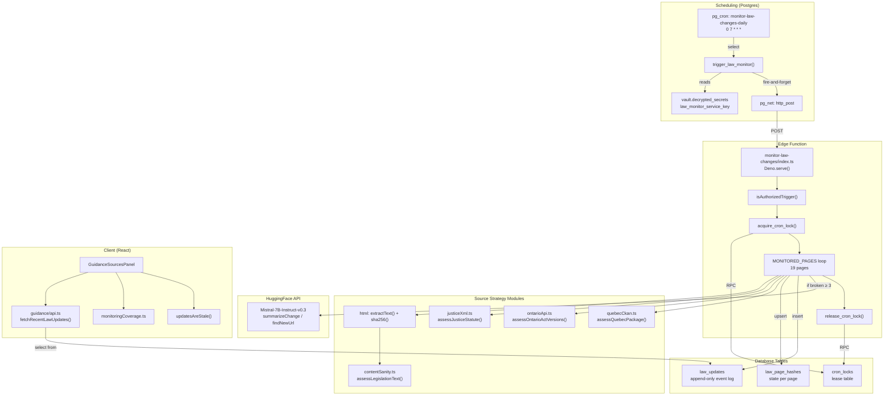
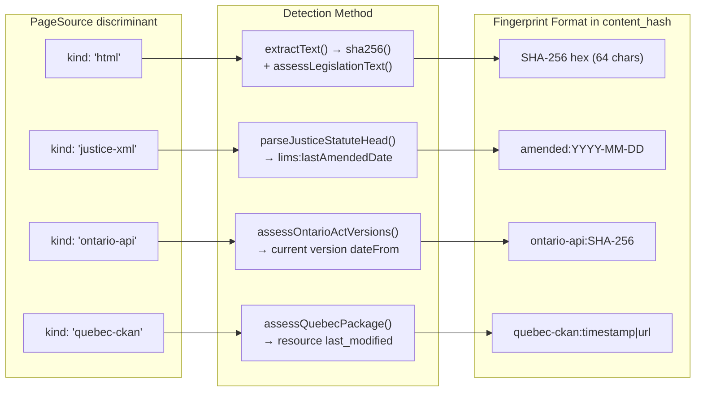
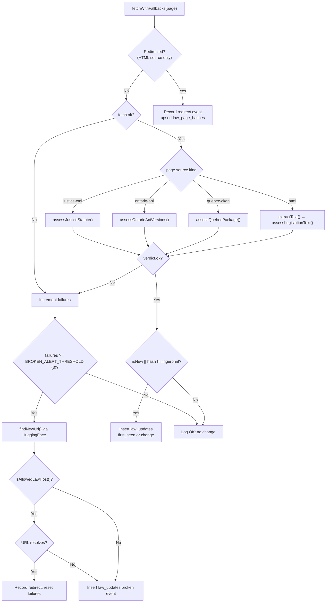
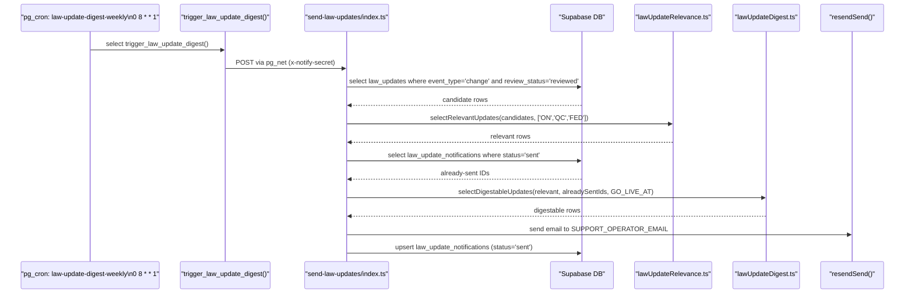

# Law Change Monitor

<details>
<summary>Relevant source files</summary>

The following files were used as context for generating this wiki page:

- [docs/AI_USAGE_STRATEGY.md](docs/AI_USAGE_STRATEGY.md)
- [docs/CANONICAL_FACTS.md](docs/CANONICAL_FACTS.md)
- [docs/LAW_CHANGE_NOTIFICATIONS.md](docs/LAW_CHANGE_NOTIFICATIONS.md)
- [docs/LAW_MONITORING.md](docs/LAW_MONITORING.md)
- [docs/advisor-corpus-review-pack-ontario.md](docs/advisor-corpus-review-pack-ontario.md)
- [src/canonicalFacts.test.ts](src/canonicalFacts.test.ts)
- [src/features/app/advisor/safety/safetyBackstop.ts](src/features/app/advisor/safety/safetyBackstop.ts)
- [src/features/app/advisor/safety/statutoryFigures.test.ts](src/features/app/advisor/safety/statutoryFigures.test.ts)
- [src/features/app/advisor/safety/statutoryFigures.ts](src/features/app/advisor/safety/statutoryFigures.ts)
- [src/features/app/guidance/GuidanceSourcesPanel.test.tsx](src/features/app/guidance/GuidanceSourcesPanel.test.tsx)
- [src/features/app/guidance/GuidanceSourcesPanel.tsx](src/features/app/guidance/GuidanceSourcesPanel.tsx)
- [src/features/app/guidance/api.test.ts](src/features/app/guidance/api.test.ts)
- [src/features/app/guidance/api.ts](src/features/app/guidance/api.ts)
- [src/features/app/guidance/monitoringCoverage.test.ts](src/features/app/guidance/monitoringCoverage.test.ts)
- [src/features/app/guidance/monitoringCoverage.ts](src/features/app/guidance/monitoringCoverage.ts)
- [src/i18n/messages/guidance.ts](src/i18n/messages/guidance.ts)
- [supabase/functions/_shared/lawUpdateDigest.test.ts](supabase/functions/_shared/lawUpdateDigest.test.ts)
- [supabase/functions/_shared/lawUpdateDigest.ts](supabase/functions/_shared/lawUpdateDigest.ts)
- [supabase/functions/_shared/lawUpdateRelevance.test.ts](supabase/functions/_shared/lawUpdateRelevance.test.ts)
- [supabase/functions/_shared/lawUpdateRelevance.ts](supabase/functions/_shared/lawUpdateRelevance.ts)
- [supabase/functions/_shared/resendSend.ts](supabase/functions/_shared/resendSend.ts)
- [supabase/functions/monitor-law-changes/contentSanity.test.ts](supabase/functions/monitor-law-changes/contentSanity.test.ts)
- [supabase/functions/monitor-law-changes/contentSanity.ts](supabase/functions/monitor-law-changes/contentSanity.ts)
- [supabase/functions/monitor-law-changes/index.ts](supabase/functions/monitor-law-changes/index.ts)
- [supabase/functions/monitor-law-changes/justiceXml.test.ts](supabase/functions/monitor-law-changes/justiceXml.test.ts)
- [supabase/functions/monitor-law-changes/justiceXml.ts](supabase/functions/monitor-law-changes/justiceXml.ts)
- [supabase/functions/monitor-law-changes/ontarioApi.test.ts](supabase/functions/monitor-law-changes/ontarioApi.test.ts)
- [supabase/functions/monitor-law-changes/ontarioApi.ts](supabase/functions/monitor-law-changes/ontarioApi.ts)
- [supabase/functions/send-law-updates/index.ts](supabase/functions/send-law-updates/index.ts)
- [supabase/functions/support-call-scheduler/index.ts](supabase/functions/support-call-scheduler/index.ts)
- [supabase/migrations/0034_cron_locks.sql](supabase/migrations/0034_cron_locks.sql)
- [supabase/migrations/0035_schedule_law_monitor.sql](supabase/migrations/0035_schedule_law_monitor.sql)
- [supabase/migrations/0036_retire_federal_html_sources.sql](supabase/migrations/0036_retire_federal_html_sources.sql)
- [supabase/migrations/0046_law_update_digest.sql](supabase/migrations/0046_law_update_digest.sql)
- [supabase/migrations/0049_cron_trigger_shared_secret.sql](supabase/migrations/0049_cron_trigger_shared_secret.sql)

</details>

The Law Change Monitor is a nightly cron-driven edge function (`monitor-law-changes`) that sweeps 19 Canadian employment legislation pages across all 14 jurisdictions, detects amendments through four distinct source strategies, and logs structured events to the `law_updates` table. The customer-facing surface is the `GuidanceSourcesPanel` in the Knowledge view, which filters the log to show only real changes in supported jurisdictions.

## System Architecture Overview

**Architecture: monitor-law-changes system**



Sources: [supabase/functions/monitor-law-changes/index.ts:1-40](), [supabase/migrations/0035_schedule_law_monitor.sql:37-67](), [src/features/app/guidance/GuidanceSourcesPanel.tsx:49-73]()

## Monitored Pages Configuration

The `MONITORED_PAGES` array defines all 19 legislation pages across 14 Canadian jurisdictions. Each entry is a `PageConfig` with jurisdiction, law name, primary URL, fallback URLs, and an optional `source` discriminant.

| Jurisdiction                               | Law                                      | Source Strategy     | URL Pattern                                                        |
| ------------------------------------------ | ---------------------------------------- | ------------------- | ------------------------------------------------------------------ |
| Federal                                    | Canada Labour Code                       | `justice-xml` (L-2) | `justicecanada/laws-lois-xml` GitHub raw                           |
| Federal                                    | Canadian Human Rights Act                | `justice-xml` (H-6) | `justicecanada/laws-lois-xml` GitHub raw                           |
| Ontario                                    | Employment Standards Act, 2000           | `ontario-api`       | `ontario.ca/laws/api/v2/legislation/en/act-versions/statute/00e41` |
| Ontario                                    | Ontario Human Rights Code                | `ontario-api`       | `ontario.ca/laws/api/v2/legislation/en/act-versions/statute/90h19` |
| Ontario                                    | Workplace Safety and Insurance Act, 1997 | `ontario-api`       | `ontario.ca/laws/api/v2/legislation/en/act-versions/statute/97w16` |
| Quebec                                     | Act respecting labour standards (LNT)    | `quebec-ckan`       | `donneesquebec.ca` CKAN `package_show`                             |
| Quebec                                     | Charter of Human Rights and Freedoms     | `quebec-ckan`       | `donneesquebec.ca` CKAN `package_show`                             |
| BC, AB, MB, SK, NS, NB, PE, NL, NT, NU, YK | Employment/Labour Standards Acts         | `html` (default)    | Various government sites                                           |

Monitoring is deliberately wider than the product's three supported jurisdictions (ON, QC, FED). The panel filters; the monitor watches everything.

Sources: [supabase/functions/monitor-law-changes/index.ts:45-211](), [docs/LAW_MONITORING.md:29-34]()

## Four Source Strategies

The `PageSource` type union defines four strategies for detecting legislative changes. Each is chosen per-page via the `source` field on `PageConfig`.



Sources: [supabase/functions/monitor-law-changes/index.ts:230-234](), [supabase/functions/monitor-law-changes/justiceXml.ts:136-138](), [supabase/functions/monitor-law-changes/ontarioApi.ts:155-157](), [supabase/functions/monitor-law-changes/quebecCkan.ts:125-127]()

### Strategy 1: HTML Hash (default)

The original strategy. HTML is fetched, stripped of `<script>` / `<style>` / all tags / entities, and SHA-256 hashed. Used for the 12 jurisdictions with no machine-readable API (BC, AB, MB, SK, NS, NB, PE, NL, NT, NU, YK).

The `extractText()` function performs tag stripping and entity decoding before hashing. The `assessLegislationText()` content sanity check gates this path — responses that pass HTTP 200 but contain block pages or JS-app shells are rejected.

Sources: [supabase/functions/monitor-law-changes/index.ts:254-265](), [supabase/functions/monitor-law-changes/index.ts:950-998]()

### Strategy 2: Justice Canada XML (`justice-xml`)

Federal Acts are published as XML at `github.com/justicecanada/laws-lois-xml`. The `parseJusticeStatuteHead()` function extracts `lims:lastAmendedDate` from the root `<Statute>` tag using regex (deliberately avoiding a full XML parser for an edge function). Only the first 16 KB are fetched via a `Range` header (`XML_HEAD_BYTES = 16384`), since the `<Identification>` block sits at the top.

Identity is verified: `<ConsolidatedNumber>` is checked against the expected value (e.g. `L-2`). The `assessJusticeStatute()` function returns a verdict type: `ok: true` with `JusticeStatuteFacts`, or `ok: false` with reasons `unparsable` or `wrong-act`.

The fingerprint stored in `content_hash` is `amended:YYYY-MM-DD` — prefixed so the column is self-describing.

Sources: [supabase/functions/monitor-law-changes/justiceXml.ts:47-138](), [supabase/functions/monitor-law-changes/index.ts:698-785]()

### Strategy 3: Ontario e-Laws API (`ontario-api`)

Ontario's statute HTML pages are JavaScript app shells (~422 characters of boilerplate after tag stripping), making HTML hashing structurally non-functional. The `ontario-api` strategy reads the e-Laws act-versions API instead, which returns byte-stable JSON.

The `assessOntarioActVersions()` function navigates a three-level Elasticsearch envelope: `aggregations.all.versions.hits.hits.hits[]._source`. Each version carries `state` (`current` | `historical`) and `dateFrom`. The function validates:

- JSON is parseable
- Versions array is non-empty (zero versions = outage, not "no change")
- A `state=current` version exists
- The `act.en` name matches `expectedActEn` (identity check)

The fingerprint is `ontario-api:` + SHA-256 of the JSON-serialized normalized version list, capturing any change across the entire version history.

Sources: [supabase/functions/monitor-law-changes/ontarioApi.ts:75-157](), [supabase/functions/monitor-law-changes/index.ts:787-867]()

### Strategy 4: Québec CKAN Datasets (`quebec-ckan`)

LégisQuébec's WAF randomly rejects requests, and pages embed a request-date-derived `historique=YYYYMMDD` that changes on every fetch. Données Québec's CKAN API publishes the same corpus as a byte-stable, bot-filter-free dataset.

The `assessQuebecPackage()` function checks `success === true`, finds the named resource (e.g. `"Lois"`), and reads its `last_modified` timestamp. Both the LNT and Charter share one dataset resource, so detection is dataset-level — a change is reported against both law names.

The fingerprint format is `quebec-ckan:${lastModified}|${url}`.

Sources: [supabase/functions/monitor-law-changes/quebecCkan.ts:65-127](), [supabase/functions/monitor-law-changes/index.ts:115-147]()

## Content Sanity Checks

The `assessLegislationText()` function (`contentSanity.ts`) guards against three failure modes that HTTP 200 alone cannot detect:

| Check                         | Threshold              | Detects                                                                                 |
| ----------------------------- | ---------------------- | --------------------------------------------------------------------------------------- |
| `BLOCK_PAGE_SIGNATURES` match | Any match in 8 phrases | WAF rejections served as 200 (Nova Scotia F5), Cloudflare challenges, CloudFront blocks |
| `MIN_STATUTE_TEXT_LENGTH`     | < 2000 chars           | JS app shells (Ontario ~422 chars), empty responses                                     |

Signature matching runs before the length check so a block page is reported as `block-page` (different remedy) rather than `too-short`.

The `BLOCK_PAGE_SIGNATURES` array contains multi-word phrases (≥3 words) to avoid false positives on statute text that uses words like "denied" or "rejected":

```
'the requested url was rejected'
'your support id is'
'the request could not be satisfied'
'just a moment'
'checking your browser before accessing'
'enable javascript and cookies to continue'
'verify you are human'
'access to this page has been denied'
'please complete the security check'
```

Sources: [supabase/functions/monitor-law-changes/contentSanity.ts:42-107](), [supabase/functions/monitor-law-changes/contentSanity.test.ts:20-111]()

## State Tables & Event Types

### `law_page_hashes` — Per-Page State

One row per monitored URL. Columns:

| Column                     | Purpose                                                                    |
| -------------------------- | -------------------------------------------------------------------------- |
| `url`                      | Primary key — the URL from `PageConfig`                                    |
| `jurisdiction`, `law_name` | Identifiers                                                                |
| `content_hash`             | SHA-256 hex, `amended:YYYY-MM-DD`, `ontario-api:...`, or `quebec-ckan:...` |
| `redirect_url`             | New canonical URL when a redirect was followed                             |
| `is_broken`                | Currently unreachable or failing sanity check                              |
| `consecutive_failures`     | Counter, resets on success                                                 |
| `last_checked`             | Timestamp of most recent sweep                                             |
| `last_broken_at`           | Timestamp of most recent failure                                           |

### `law_updates` — Append-Only Event Log

The product-facing log. Each row represents a detected event:

| Column           | Purpose                                                   |
| ---------------- | --------------------------------------------------------- |
| `id`             | UUID primary key                                          |
| `jurisdiction`   | Display name (e.g. `'Ontario'`, `'Federal'`)              |
| `law_name`       | Human-readable Act name                                   |
| `url`            | Legislation URL (may be the new URL on redirect)          |
| `content_hash`   | Fingerprint at time of detection                          |
| `change_summary` | Model-generated or canned English summary                 |
| `raw_diff`       | First 2000 chars of text, or structured diff info         |
| `detected_at`    | ISO timestamp                                             |
| `is_new`         | Boolean — first time seeing this page                     |
| `event_type`     | `first_seen` / `change` / `redirect` / `broken`           |
| `review_status`  | `machine_curated` (default) or `reviewed` (human-flipped) |

### Event Types

| Event        | Meaning                                         | Customer-facing?           |
| ------------ | ----------------------------------------------- | -------------------------- |
| `first_seen` | Baseline captured on first monitoring           | No — operational           |
| `change`     | Content/amendment date differs from last sweep  | **Yes**                    |
| `redirect`   | Page moved permanently; monitoring auto-follows | No — plumbing              |
| `broken`     | Unreachable for ≥ 3 consecutive sweeps          | No — Dutiva infrastructure |

Only `change` events are shown to customers, enforced by `CUSTOMER_FACING_EVENT_TYPE` in `monitoringCoverage.ts` and `CUSTOMER_FACING_EVENT_TYPES` in `lawUpdateRelevance.ts`.

Sources: [docs/LAW_MONITORING.md:18-24](), [supabase/functions/monitor-law-changes/index.ts:569-596](), [src/features/app/guidance/monitoringCoverage.ts:98-104](), [supabase/functions/_shared/lawUpdateRelevance.ts:65-79](), [supabase/migrations/0046_law_update_digest.sql:34-39]()

## Per-Page Sweep Logic

The main handler iterates over all `MONITORED_PAGES` and handles each page through a cascade of cases:

**Sweep flow per page**



Sources: [supabase/functions/monitor-law-changes/index.ts:551-1039]()

## SSRF-Guarded URL Resolution

When a page is broken for ≥ 3 consecutive sweeps, the function calls `findNewUrl()` which uses HuggingFace's Mistral-7B-Instruct to suggest a replacement URL. The suggestion passes through two guards before acceptance:

1. **Host allowlist** — `isAllowedLawHost()` checks that the URL is HTTPS and on one of 21 government domain suffixes in `ALLOWED_LAW_HOST_SUFFIXES` (e.g. `justice.gc.ca`, `ontario.ca`, `bclaws.gov.bc.ca`)
2. **Resolution check** — the suggested URL is fetched with `fetchWithTimeout()` to confirm it actually responds

If either check fails, the suggestion is discarded.

Sources: [supabase/functions/monitor-law-changes/index.ts:462-497](), [supabase/functions/monitor-law-changes/index.ts:615-669]()

## Change Summarization via HuggingFace

Two HuggingFace API calls are used, both against `mistralai/Mistral-7B-Instruct-v0.3`:

| Function            | Purpose                                                    | Max Tokens | Temperature | Fallback                                                                      |
| ------------------- | ---------------------------------------------------------- | ---------- | ----------- | ----------------------------------------------------------------------------- |
| `summarizeChange()` | Plain-English summary of a detected change for HR audience | 220        | 0.2         | Generic message: "Change detected on {lawName}. Review the legislation page." |
| `findNewUrl()`      | Suggest replacement URL for broken page                    | 80         | 0.1         | `null` — no recovery attempted                                                |

Both degrade gracefully when `HF_TOKEN` is absent — the monitor still runs and records events, just with generic summaries.

Sources: [supabase/functions/monitor-law-changes/index.ts:334-424]()

## Cron Lock Pattern

The monitor uses a database-backed lease pattern to prevent overlapping runs. The `cron_locks` table stores one row per job with an expiration time.

### `acquire_cron_lock(p_job_name, p_instance_id, p_ttl_seconds)`

Uses `INSERT ... ON CONFLICT DO UPDATE WHERE expires_at < now()` — an atomic upsert that only steals the lock if the previous holder's TTL has expired. Returns `true` only if the caller's `instance_id` owns the lock after the operation.

### `release_cron_lock(p_job_name, p_instance_id)`

Deletes the lock row only if the caller still owns it. Returns `false` if someone else took it (the run exceeded the TTL).

The monitor uses `CRON_LOCK_JOB = 'monitor-law-changes'` with `CRON_LOCK_TTL_SECONDS = 1800` (30 minutes). Both RPCs are `SECURITY DEFINER` with grants restricted to `service_role`.

```sql
-- From 0034_cron_locks.sql
create table if not exists public.cron_locks (
  job_name    text        primary key,
  instance_id text        not null,
  acquired_at timestamptz not null default timezone('utc'::text, now()),
  expires_at  timestamptz not null
);
```

Sources: [supabase/migrations/0034_cron_locks.sql:16-84](), [supabase/functions/monitor-law-changes/index.ts:426-535](), [supabase/functions/monitor-law-changes/index.ts:1043-1051]()

## Scheduling & Authentication

### pg_cron Schedule

The `monitor-law-changes-daily` job runs at `0 7 * * *` (07:00 UTC). The `trigger_law_monitor()` PL/pgSQL function is `SECURITY DEFINER` to read Vault secrets, and execute is restricted to `service_role`.

The function reads `law_monitor_service_key` from Vault, then fires `pg_net.http_post()` to the edge function with a 300-second timeout. If the secret is not set, the function logs a warning and returns — a no-op, not an error.

Migration 0049 amended the trigger to send both `Authorization: Bearer` and `x-trigger-secret` headers during a deployment transition window.

Sources: [supabase/migrations/0035_schedule_law_monitor.sql:37-115](), [supabase/migrations/0049_cron_trigger_shared_secret.sql:42-75]()

### Authentication Gate

`isAuthorizedTrigger()` checks two credential paths:

1. `x-trigger-secret` header matching `SUPPORT_NOTIFY_SECRET` env var
2. `Authorization: Bearer` token matching either `SUPABASE_SERVICE_ROLE_KEY` or `SUPABASE_SECRET_KEY` (exact match only)

The function runs with `verify_jwt: false`, so this check is the only authentication gate.

Sources: [supabase/functions/monitor-law-changes/index.ts:442-455]()

### Operational Visibility

The `law_monitor_status()` function provides a one-query health check:

| Column              | Healthy value |
| ------------------- | ------------- |
| `secret_configured` | `true`        |
| `job_scheduled`     | `true`        |
| `hours_since_check` | `< 48`        |
| `broken_pages`      | Ideally `0`   |

Sources: [supabase/migrations/0035_schedule_law_monitor.sql:74-99]()

## Monitoring Coverage Model

### `monitoringCoverage.ts`

The client-side coverage model is a **maintained claim**, deliberately not derived from `law_page_hashes`. Deriving it would re-create the failure it exists to prevent — the health column read healthy for months while sources were structurally non-functional.

The `MONITORING_COVERAGE` array covers exactly the three supported jurisdictions with bilingual labels and per-jurisdiction detail text:

| Jurisdiction | Code  | Status (as of audit 2026-08-10)        |
| ------------ | ----- | -------------------------------------- |
| Ontario      | `ON`  | `active` — e-Laws act-versions API     |
| Quebec       | `QC`  | `active` — Données Québec CKAN dataset |
| Federal      | `FED` | `active` — Justice Canada XML          |

The `CoverageStatus` type is `'active' | 'unavailable' | 'unverified'`, with a `coverageTone()` function mapping to chip colors (`success`, `risk`, `warning`).

The `noSupportedJurisdictionCovered()` function returns `true` when no jurisdiction has `status === 'active'` — unverified is **not** counted as coverage.

Sources: [src/features/app/guidance/monitoringCoverage.ts:32-127](), [src/features/app/guidance/monitoringCoverage.test.ts:17-100]()

### `GuidanceSourcesPanel`

The panel is the customer-facing surface. Key behaviors:

- **Coverage section shown to everyone** (signed in or not) — a compliance product must not require sign-in to learn what it does and does not monitor
- **Guidance sources and law updates require authentication** — fetched via `fetchGuidanceSources()` and `fetchRecentLawUpdates()` after sign-in
- **Staleness warning** via `updatesAreStale()` when the newest entry is > 7 days old

Sources: [src/features/app/guidance/GuidanceSourcesPanel.tsx:49-130](), [src/features/app/guidance/GuidanceSourcesPanel.test.tsx:17-96]()

### `updatesAreStale()`

A freshness guard introduced after the monitor stopped for 52 days without any in-product indication. Compares the `detectedAt` of the newest update to `STALE_AFTER_DAYS = 7`. Returns `false` (safe) when no entries carry a date, or when dates are unparseable.

Sources: [src/features/app/guidance/updatesAreStale.ts:1-20]()

### Client API: `fetchRecentLawUpdates()`

Reads from `law_updates` with two filters:

1. `.eq('event_type', CUSTOMER_FACING_EVENT_TYPE)` — only `'change'`
2. `.in('jurisdiction', MONITOR_JURISDICTION_NAMES)` — only `['Ontario', 'Quebec', 'Federal']`

Row shapes are Zod-validated via `lawUpdateRowSchema` and mapped from snake_case to camelCase.

Sources: [src/features/app/guidance/api.ts:75-103]()

## Law Update Relevance Filtering

The `lawUpdateRelevance.ts` shared module answers "is this row customer-relevant?" for all consumers (panel, digest, badges). Two rules, both fail-closed:

1. **Only `change` events** — `isLawChangeEvent()` checks against `CUSTOMER_FACING_EVENT_TYPES = ['change']`
2. **Only supported jurisdictions** — `toSupportedJurisdiction()` maps monitor display names to codes via `MONITOR_NAME_TO_CODE` (`'ontario' → 'ON'`, `'quebec'/'québec' → 'QC'`, `'federal' → 'FED'`); all other names return `null`

The `selectRelevantUpdates()` function narrows a batch to updates matching a recipient's jurisdiction set. An empty jurisdiction set yields nothing — "unknown" is not "send everything".

The `RelevanceVerdict` type carries a `reason` field: `'relevant' | 'unsupported-jurisdiction' | 'not-a-law-change'`.

Sources: [supabase/functions/_shared/lawUpdateRelevance.ts:43-130](), [supabase/functions/_shared/lawUpdateRelevance.test.ts:32-194]()

## Law Change Notification Digests (`send-law-updates`)

### Architecture

**Digest notification pipeline**



Sources: [supabase/functions/send-law-updates/index.ts:1-165](), [supabase/migrations/0046_law_update_digest.sql:90-169]()

### Review Gate

Only rows with `review_status = 'reviewed'` are digestable. The `review_status` column defaults to `'machine_curated'` — the monitor's model-generated summary. A human flips it to `'reviewed'` via direct SQL (no admin UI yet):

```sql
update public.law_updates set review_status = 'reviewed' where id = '<uuid>';
```

Sources: [supabase/migrations/0046_law_update_digest.sql:18-39]()

### Digest Filtering (`selectDigestableUpdates`)

The `selectDigestableUpdates()` pure function in `lawUpdateDigest.ts` applies three gates:

1. `reviewStatus === 'reviewed'`
2. Not in `alreadySentIds` (deduplicated via `law_update_notifications` unique constraint on `(law_update_id, recipient)`)
3. `detected_at >= GO_LIVE_AT` (fixed at `2026-08-06T00:00:00Z` to prevent backfill dumps)

Sources: [supabase/functions/_shared/lawUpdateDigest.ts:57-70]()

### Recipient Jurisdiction Resolution

`resolveRecipientJurisdictions()` resolves which jurisdictions a recipient should hear about: `organizations.default_jurisdiction` wins over `profiles.province`. Not wired to real customers yet — the internal pilot sends all supported jurisdictions to `SUPPORT_OPERATOR_EMAIL`.

Sources: [supabase/functions/_shared/lawUpdateDigest.ts:32-41]()

### `law_update_notifications` Outbox

One row per `(law_update_id, recipient)` with a unique constraint that structurally prevents double-sending. Status lifecycle: `pending → sent | failed`.

```sql
create table if not exists public.law_update_notifications (
  id uuid primary key default gen_random_uuid(),
  law_update_id uuid not null references public.law_updates (id) on delete cascade,
  recipient text not null,
  status text not null default 'pending',
  unique (law_update_id, recipient)
);
```

Sources: [supabase/migrations/0046_law_update_digest.sql:47-57]()

### CASL Compliance Design

The notification architecture is shaped by CASL (Canada's Anti-Spam Legislation). Two paths are documented in `docs/LAW_CHANGE_NOTIFICATIONS.md`:

- **Path A (current)** — purely factual service messages, outside the CEM definition. No consent burden, but the template must never contain promotional content.
- **Path B (future)** — commercial messages requiring consent. Requires provable consent records, unsubscribe mechanism.

The current internal-only pilot avoids the CASL question entirely since the recipient is an operational alias.

Sources: [docs/LAW_CHANGE_NOTIFICATIONS.md:49-108]()

## Canonical Facts Enforcement

The monitoring coverage is a canonical fact enforced by `src/canonicalFacts.test.ts`. The test:

- Asserts the documented jurisdiction count matches `MONITORING_COVERAGE.length`
- Bidirectionally compares the backtick-quoted codes in `CANONICAL_FACTS.md` against the `MONITORING_COVERAGE` array
- Checks that `noSupportedJurisdictionCovered()` returns `false` (at least one jurisdiction is active)

A drift between `CANONICAL_FACTS.md` and the code fails `npm run check`.

Sources: [src/canonicalFacts.test.ts:109-123](), [src/canonicalFacts.test.ts:168-181]()

## File Inventory

| File                                                      | Role                                                                         |
| --------------------------------------------------------- | ---------------------------------------------------------------------------- |
| `supabase/functions/monitor-law-changes/index.ts`         | Main edge function — fetch loop, event recording, HF calls                   |
| `supabase/functions/monitor-law-changes/contentSanity.ts` | Block-page and length checks for HTML sources                                |
| `supabase/functions/monitor-law-changes/justiceXml.ts`    | Federal XML parser and identity check                                        |
| `supabase/functions/monitor-law-changes/ontarioApi.ts`    | Ontario e-Laws API parser and identity check                                 |
| `supabase/functions/monitor-law-changes/quebecCkan.ts`    | Québec CKAN dataset parser                                                   |
| `supabase/functions/send-law-updates/index.ts`            | Weekly digest edge function                                                  |
| `supabase/functions/_shared/lawUpdateRelevance.ts`        | Jurisdiction + event type relevance filter                                   |
| `supabase/functions/_shared/lawUpdateDigest.ts`           | Digest candidate selection (review gate, dedup, cutoff)                      |
| `supabase/functions/_shared/resendSend.ts`                | Shared Resend email wrapper                                                  |
| `supabase/migrations/0034_cron_locks.sql`                 | `cron_locks` table, `acquire_cron_lock`, `release_cron_lock`                 |
| `supabase/migrations/0035_schedule_law_monitor.sql`       | `trigger_law_monitor()`, `law_monitor_status()`, pg_cron schedule            |
| `supabase/migrations/0046_law_update_digest.sql`          | `review_status` column, `law_update_notifications`, digest schedule          |
| `supabase/migrations/0049_cron_trigger_shared_secret.sql` | Credential migration to shared-secret header                                 |
| `src/features/app/guidance/api.ts`                        | Client-side Supabase reads (`fetchRecentLawUpdates`, `fetchGuidanceSources`) |
| `src/features/app/guidance/monitoringCoverage.ts`         | Coverage claims, jurisdiction mapping, coverage status types                 |
| `src/features/app/guidance/updatesAreStale.ts`            | 7-day freshness check                                                        |
| `src/features/app/guidance/GuidanceSourcesPanel.tsx`      | React panel component                                                        |
| `src/i18n/messages/guidance.ts`                           | Bilingual panel messages                                                     |
| `docs/LAW_MONITORING.md`                                  | Operational documentation                                                    |
| `docs/LAW_CHANGE_NOTIFICATIONS.md`                        | Notification design decisions and CASL analysis                              |

Sources: All files listed above.

---
