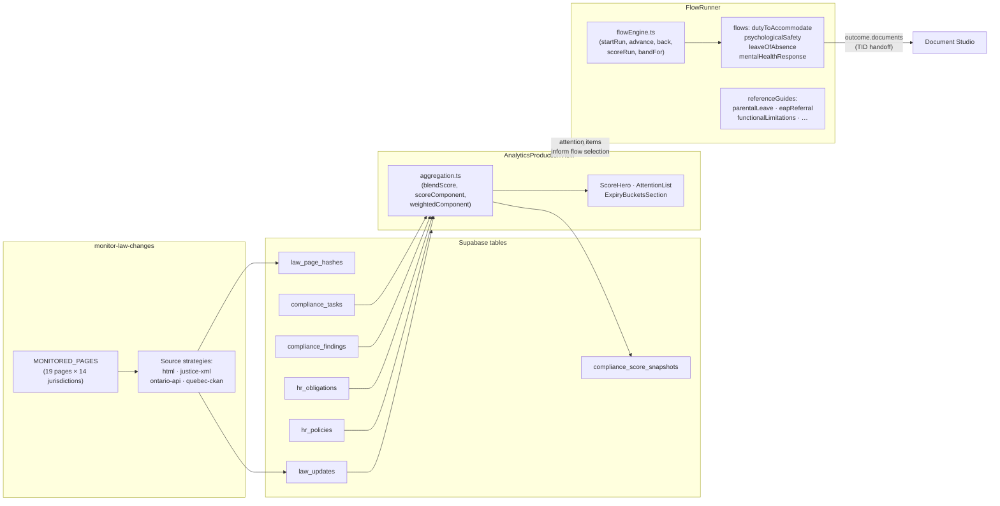
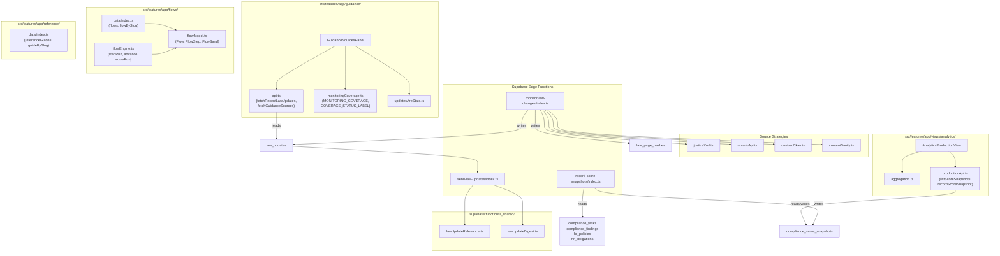

# Law Monitoring & Compliance

Relevant source files

The following files were used as context for generating this wiki page:

- [docs/AI_USAGE_STRATEGY.md](docs/AI_USAGE_STRATEGY.md)
- [docs/LAW_MONITORING.md](docs/LAW_MONITORING.md)
- [docs/LEGAL_REVIEW_INVENTORY.md](docs/LEGAL_REVIEW_INVENTORY.md)
- [docs/README.md](docs/README.md)
- [docs/SCORING_LOGIC.md](docs/SCORING_LOGIC.md)
- [docs/advisor-corpus-review-pack-ontario.md](docs/advisor-corpus-review-pack-ontario.md)
- [src/data/analytics.ts](src/data/analytics.ts)
- [src/features/app/advisor/safety/safetyBackstop.ts](src/features/app/advisor/safety/safetyBackstop.ts)
- [src/features/app/advisor/safety/statutoryFigures.test.ts](src/features/app/advisor/safety/statutoryFigures.test.ts)
- [src/features/app/advisor/safety/statutoryFigures.ts](src/features/app/advisor/safety/statutoryFigures.ts)
- [src/features/app/views/analytics/AnalyticsProductionView.tsx](src/features/app/views/analytics/AnalyticsProductionView.tsx)
- [src/features/app/views/analytics/AnalyticsView.test.tsx](src/features/app/views/analytics/AnalyticsView.test.tsx)
- [src/features/app/views/analytics/aggregation.test.ts](src/features/app/views/analytics/aggregation.test.ts)
- [src/features/app/views/analytics/aggregation.ts](src/features/app/views/analytics/aggregation.ts)
- [src/features/app/views/analytics/productionApi.ts](src/features/app/views/analytics/productionApi.ts)
- [src/i18n/messages/analytics.ts](src/i18n/messages/analytics.ts)
- [supabase/functions/monitor-law-changes/index.ts](supabase/functions/monitor-law-changes/index.ts)
- [supabase/functions/record-score-snapshots/index.ts](supabase/functions/record-score-snapshots/index.ts)
- [supabase/functions/record-score-snapshots/scoring.test.ts](supabase/functions/record-score-snapshots/scoring.test.ts)
- [supabase/functions/record-score-snapshots/scoring.ts](supabase/functions/record-score-snapshots/scoring.ts)
- [supabase/functions/support-call-scheduler/index.ts](supabase/functions/support-call-scheduler/index.ts)
- [supabase/migrations/0049_cron_trigger_shared_secret.sql](supabase/migrations/0049_cron_trigger_shared_secret.sql)

Dutiva is a compliance product — its value depends on knowing when Canadian employment law changes, measuring an organization's compliance posture against that law, and guiding HR practitioners through the correct response. This page introduces the three systems that deliver that capability and links to child pages for implementation details.

The three systems form a pipeline: the **Law Change Monitor** watches legislation sources and records amendments, the **Compliance Scoring & Analytics Dashboard** measures an organization's posture and surfaces what needs attention, and the **Guided Workflows & Reference Guides** provide step-by-step processes for acting on what the dashboard reveals.

**Architecture overview — Law Monitoring & Compliance pipeline**

Sources: [supabase/functions/monitor-law-changes/index.ts:1-40](), [src/features/app/views/analytics/aggregation.ts:1-9](), [src/features/app/views/analytics/AnalyticsProductionView.tsx:156-172](), [src/features/app/flows/flowEngine.ts:1-15](), [src/features/app/flows/data/index.ts:1-17]()

---

## Law Change Monitor

The `monitor-law-changes` edge function sweeps 19 legislation pages across all 14 Canadian jurisdictions on a nightly cron and records what it finds in two tables: `law_page_hashes` (current state per page) and `law_updates` (append-only event log). Four source strategies are used depending on what each government publishes: plain HTML hashing, the Ontario e-Laws API (`ontarioApi.ts`), Québec's CKAN dataset (`quebecCkan.ts`), and Justice Canada XML (`justiceXml.ts`).

The monitor deliberately watches more jurisdictions than the product supports (ON, QC, FED). The customer-facing `GuidanceSourcesPanel` filters what users see — showing only supported jurisdictions — and the `monitoringCoverage.ts` module explicitly declares each jurisdiction's detection status as `active`, `unavailable`, or `unverified`. Staleness is detected by `updatesAreStale()`, which flags when no update has arrived for 7+ days.

A weekly digest (`send-law-updates`) emails internal operators about reviewed changes, gated by a human `review_status` flip — no unsupervised model summary reaches an inbox.

For details, see [Law Change Monitor](#5.1).

Sources: [supabase/functions/monitor-law-changes/index.ts:8-40](), [src/features/app/guidance/monitoringCoverage.ts:1-40](), [src/features/app/guidance/updatesAreStale.ts:1-18](), [supabase/functions/send-law-updates/index.ts:1-30](), [docs/LAW_MONITORING.md:1-30]()

---

## Compliance Scoring & Analytics Dashboard

The compliance score (formula v3, `SCORE_FORMULA_VERSION = 3`) quantifies an organization's HR compliance posture as a 0–100 number from four components: policies current, provenanced tasks complete, severity-weighted findings resolved, and obligations evidenced. The pure functions in `aggregation.ts` — `scoreComponent`, `weightedComponent`, `blendScore`, `applyCriticalCeiling` — compute every number deterministically from injected inputs (no `Date.now()`). A critical open finding caps the score at `CRITICAL_SCORE_CEILING` (69) regardless of how strong the other components are.

The `AnalyticsProductionView` dashboard renders this score alongside attention-queue items, case aging, expiry buckets, headcount-by-jurisdiction, and leave/turnover cards. Monthly history is persisted to `compliance_score_snapshots` both by the view itself (write-on-read) and by the `record-score-snapshots` edge function (daily + month-close cron). A drift test in `scoring.test.ts` ensures the server-side copy of the formula stays identical to the client-side copy.

For details, see [Compliance Scoring & Analytics Dashboard](#5.2).

Sources: [src/features/app/views/analytics/aggregation.ts:212-290](), [src/features/app/views/analytics/AnalyticsProductionView.tsx:72-85](), [supabase/functions/record-score-snapshots/scoring.ts:1-30](), [supabase/functions/record-score-snapshots/scoring.test.ts:1-40](), [docs/SCORING_LOGIC.md:67-125]()

---

## Guided Workflows & Reference Guides

When the dashboard surfaces an issue — a failed accommodation, an approaching leave deadline, a low psychological-safety score — the guided workflows provide the step-by-step process. The `FlowRunner` engine is built on two files: `flowModel.ts` defines the content model (`Flow`, `FlowStep` union of `choice`/`task`/`outcome`/`result`, `FlowBand`), and `flowEngine.ts` provides pure navigation functions (`startRun`, `advance`, `back`, `scoreRun`, `bandFor`). Three shapes emerge from the same structure: checklists, decision trees, and scored assessments.

Four flow data files ship today — `dutyToAccommodate`, `psychologicalSafety`, `leaveOfAbsence`, and `mentalHealthResponse` — alongside eight reference guides under `reference/data/` (e.g. `parentalLeave`, `eapReferral`, `functionalLimitations`). Completed flow runs hand off to the Document Studio via template IDs (`outcome.documents`), bridging the "decide" step to the "document" step.

The `WorkflowsView` serves as the catalogue, rendering both guided flows (real interactive content) and prototype fixture workflows.

For details, see [Guided Workflows & Reference Guides](#5.3).

Sources: [src/features/app/flows/flowModel.ts:1-30](), [src/features/app/flows/flowEngine.ts:1-15](), [src/features/app/flows/data/index.ts:1-17](), [src/features/app/reference/data/index.ts:1-20](), [src/features/app/views/workflows/WorkflowsView.tsx:1-40]()

---

## How the Sub-Systems Connect

**Code entity map — key modules and their relationships**

Sources: [supabase/functions/monitor-law-changes/index.ts:1-7](), [supabase/functions/send-law-updates/index.ts:1-6](), [supabase/functions/record-score-snapshots/index.ts:1-5](), [src/features/app/guidance/GuidanceSourcesPanel.tsx:1-15](), [src/features/app/guidance/api.ts:1-15](), [src/features/app/views/analytics/AnalyticsProductionView.tsx:1-70](), [src/features/app/flows/flowEngine.ts:1-10]()

The following table summarizes the key data tables and edge functions across the three sub-systems:

| Sub-system         | Edge Function(s)                          | Key Tables                                                                                               | Client Module                                            |
| ------------------ | ----------------------------------------- | -------------------------------------------------------------------------------------------------------- | -------------------------------------------------------- |
| Law Monitor        | `monitor-law-changes`, `send-law-updates` | `law_page_hashes`, `law_updates`, `cron_locks`                                                           | `src/features/app/guidance/`                             |
| Compliance Scoring | `record-score-snapshots`                  | `compliance_score_snapshots`, `compliance_tasks`, `compliance_findings`, `hr_obligations`, `hr_policies` | `src/features/app/views/analytics/`                      |
| Guided Workflows   | — (client-only)                           | —                                                                                                        | `src/features/app/flows/`, `src/features/app/reference/` |

Sources: [supabase/migrations/0034_cron_locks.sql:1-10](), [supabase/functions/record-score-snapshots/index.ts:1-10](), [src/features/app/views/analytics/productionApi.ts:1-14](), [src/features/app/flows/data/index.ts:1-17](), [src/features/app/reference/data/index.ts:1-20]()

---

## Key Design Principles

1. **Deterministic scoring.** The compliance score is computed by pure functions with no `Date.now()` calls — callers inject "today" so demo stays stable and every path is unit-testable. The LLM is never involved in score computation. See [docs/AI_USAGE_STRATEGY.md:1-15]() and [docs/SCORING_LOGIC.md:1-15]().

2. **Monitored ≠ covered.** The law monitor sweeps 14 jurisdictions but the product supports only three (ON, QC, FED). The `monitoringCoverage.ts` module is a _maintained claim_ — manually audited and dated — rather than being derived from `law_page_hashes`, because deriving it would re-create the silent failure it exists to prevent. See [src/features/app/guidance/monitoringCoverage.ts:1-35]().

3. **Drift-tested copies.** The scoring formula exists in two copies — `aggregation.ts` (client) and `scoring.ts` (edge function) — because the two runtimes cannot share a module. A drift test (`scoring.test.ts`) imports both and asserts identical outputs across scenarios. See [supabase/functions/record-score-snapshots/scoring.test.ts:1-40]().

4. **Flows decide, templates document.** A completed flow run records the path taken and hands off to the Document Studio template that makes it official (`outcome.documents`). The two are kept separate: the flow is how you decide, the template is what you send. See [src/features/app/flows/flowModel.ts:1-30]().

Sources: [docs/AI_USAGE_STRATEGY.md:1-10](), [docs/SCORING_LOGIC.md:67-75](), [src/features/app/guidance/monitoringCoverage.ts:1-35](), [supabase/functions/record-score-snapshots/scoring.test.ts:30-45](), [src/features/app/flows/flowModel.ts:20-30]()

---
