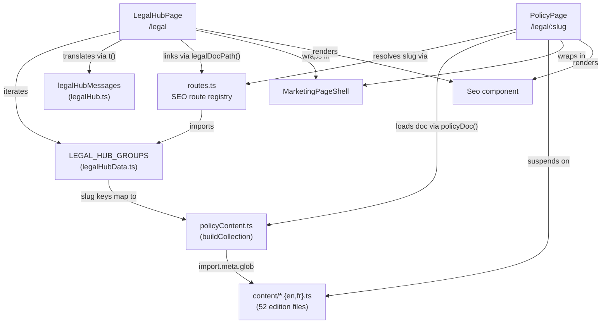
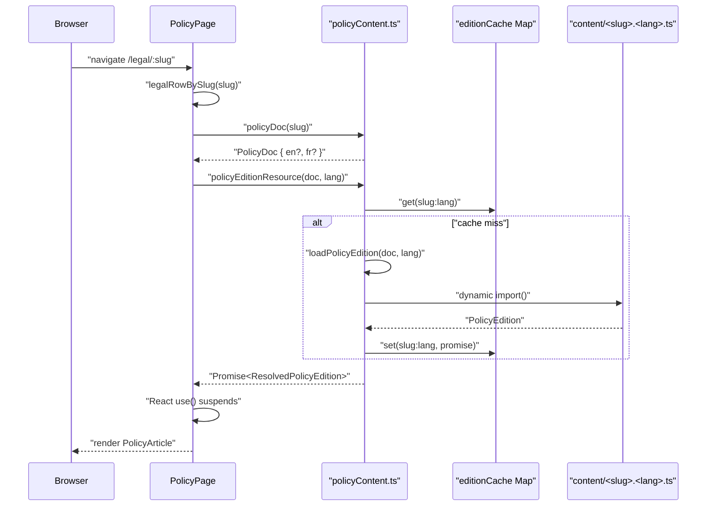
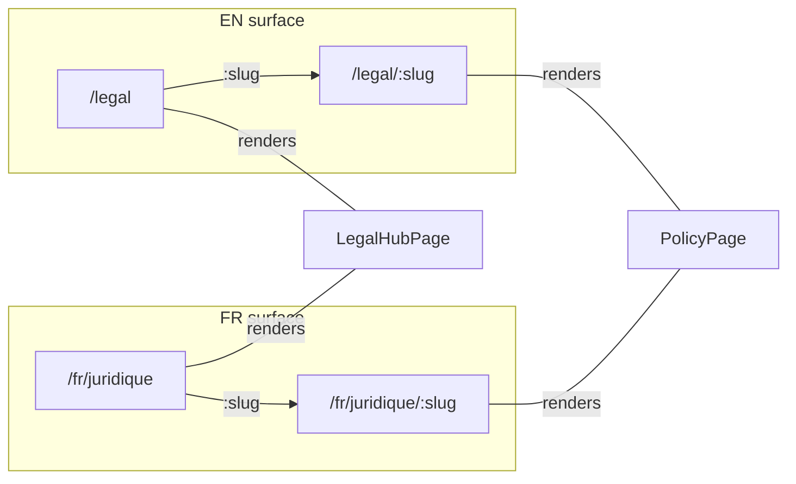
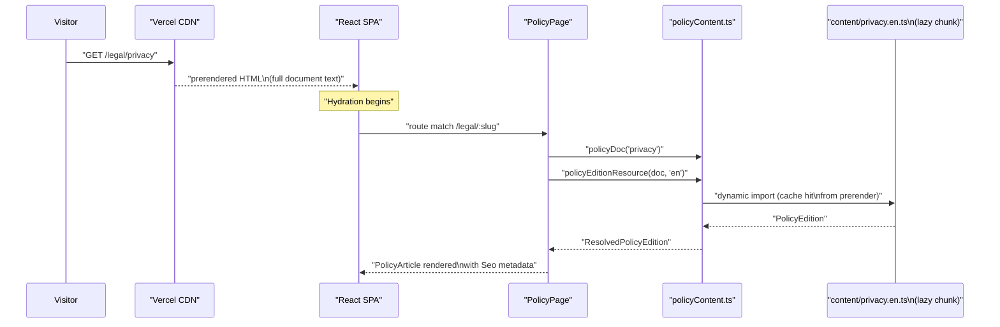

# Legal & Trust Pages

<details>
<summary>Relevant source files</summary>

The following files were used as context for generating this wiki page:

- [docs/advisor-guidance-corpus-2026-07-27.md](docs/advisor-guidance-corpus-2026-07-27.md)
- [src/config/support.ts](src/config/support.ts)
- [src/features/marketing/legal/content/accessibility.en.ts](src/features/marketing/legal/content/accessibility.en.ts)
- [src/features/marketing/legal/content/accessibility.fr.ts](src/features/marketing/legal/content/accessibility.fr.ts)
- [src/features/marketing/legal/content/ai-risk-disclosure.en.ts](src/features/marketing/legal/content/ai-risk-disclosure.en.ts)
- [src/features/marketing/legal/content/ai-technology.en.ts](src/features/marketing/legal/content/ai-technology.en.ts)
- [src/features/marketing/legal/content/ai-technology.fr.ts](src/features/marketing/legal/content/ai-technology.fr.ts)
- [src/features/marketing/legal/content/cookies.en.ts](src/features/marketing/legal/content/cookies.en.ts)
- [src/features/marketing/legal/content/cookies.fr.ts](src/features/marketing/legal/content/cookies.fr.ts)
- [src/features/marketing/legal/content/cross-border-transfer.en.ts](src/features/marketing/legal/content/cross-border-transfer.en.ts)
- [src/features/marketing/legal/content/cross-border-transfer.fr.ts](src/features/marketing/legal/content/cross-border-transfer.fr.ts)
- [src/features/marketing/legal/content/data-processing-agreement.en.ts](src/features/marketing/legal/content/data-processing-agreement.en.ts)
- [src/features/marketing/legal/content/data-processing-agreement.fr.ts](src/features/marketing/legal/content/data-processing-agreement.fr.ts)
- [src/features/marketing/legal/content/disclaimer.en.ts](src/features/marketing/legal/content/disclaimer.en.ts)
- [src/features/marketing/legal/content/disclaimer.fr.ts](src/features/marketing/legal/content/disclaimer.fr.ts)
- [src/features/marketing/legal/content/human-review-escalation.en.ts](src/features/marketing/legal/content/human-review-escalation.en.ts)
- [src/features/marketing/legal/content/incident-response-policy.en.ts](src/features/marketing/legal/content/incident-response-policy.en.ts)
- [src/features/marketing/legal/content/privacy.en.ts](src/features/marketing/legal/content/privacy.en.ts)
- [src/features/marketing/legal/content/privacy.fr.ts](src/features/marketing/legal/content/privacy.fr.ts)
- [src/features/marketing/legal/content/refund-policy.en.ts](src/features/marketing/legal/content/refund-policy.en.ts)
- [src/features/marketing/legal/content/refund-policy.fr.ts](src/features/marketing/legal/content/refund-policy.fr.ts)
- [src/features/marketing/legal/content/subprocessors.en.ts](src/features/marketing/legal/content/subprocessors.en.ts)
- [src/features/marketing/legal/content/subprocessors.fr.ts](src/features/marketing/legal/content/subprocessors.fr.ts)
- [src/features/marketing/legal/content/subscription-agreement.en.ts](src/features/marketing/legal/content/subscription-agreement.en.ts)
- [src/features/marketing/legal/content/subscription-agreement.fr.ts](src/features/marketing/legal/content/subscription-agreement.fr.ts)
- [src/features/marketing/legal/content/support-policy.en.ts](src/features/marketing/legal/content/support-policy.en.ts)
- [src/features/marketing/legal/content/support-policy.fr.ts](src/features/marketing/legal/content/support-policy.fr.ts)
- [src/features/marketing/legal/content/terms.en.ts](src/features/marketing/legal/content/terms.en.ts)
- [src/features/marketing/legal/content/terms.fr.ts](src/features/marketing/legal/content/terms.fr.ts)
- [src/features/marketing/legal/legalHubData.ts](src/features/marketing/legal/legalHubData.ts)
- [src/features/marketing/legal/policyContent.test.ts](src/features/marketing/legal/policyContent.test.ts)
- [src/features/marketing/legal/policyContent.ts](src/features/marketing/legal/policyContent.ts)
- [src/features/marketing/pages/LegalHubPage.tsx](src/features/marketing/pages/LegalHubPage.tsx)
- [src/features/marketing/pages/PolicyPage.test.tsx](src/features/marketing/pages/PolicyPage.test.tsx)
- [src/features/marketing/pages/PolicyPage.tsx](src/features/marketing/pages/PolicyPage.tsx)
- [src/features/support/triage.test.ts](src/features/support/triage.test.ts)
- [src/features/support/triage.ts](src/features/support/triage.ts)
- [src/i18n/messages/legalHub.ts](src/i18n/messages/legalHub.ts)
- [supabase/migrations/0014_support_system.sql](supabase/migrations/0014_support_system.sql)

</details>

The Legal Hub is a system of 26 bilingual policy documents published on the Dutiva marketing surface. It covers privacy (PIPEDA-conscious), cookies, AI technology disclosure, terms of service, subscription agreement, refund policy, data processing agreement, subprocessors, cross-border transfer, human-review escalation, AI risk disclosure, support policy, incident response, accessibility, disclaimer, and more. This page documents the data model, lazy-loading content pipeline, page rendering, SEO integration, and the companion `SECURITY.md` / `security.txt` vulnerability reporting policy.

## System Architecture Overview

**Architecture: Legal Hub component relationships**



Sources: [src/features/marketing/pages/LegalHubPage.tsx:1-55](), [src/features/marketing/pages/PolicyPage.tsx:1-57](), [src/features/marketing/legal/policyContent.ts:48-65](), [src/seo/routes.ts:239-265]()

## The 26 Policy Documents

All 26 documents are registered in `LEGAL_HUB_GROUPS`, organized into six sections. Each row carries an English `slug`, a localized French `frSlug`, and i18n message keys for title/description.

[src/features/marketing/legal/legalHubData.ts:27-214]()

| #   | Section (`titleKey`)                  | Slug                        | EN Title                               |
| --- | ------------------------------------- | --------------------------- | -------------------------------------- |
| 1   | `legalHub_s1` (Core legal)            | `terms`                     | Terms of Service                       |
| 2   | `legalHub_s1`                         | `privacy`                   | Privacy Policy                         |
| 3   | `legalHub_s1`                         | `disclaimer`                | Legal Disclaimer                       |
| 4   | `legalHub_s1`                         | `cookies`                   | Cookie Policy                          |
| 5   | `legalHub_s1`                         | `accessibility`             | Accessibility Statement                |
| 6   | `legalHub_s2` (Canadian compliance)   | `pipeda-compliance`         | PIPEDA Compliance Statement            |
| 7   | `legalHub_s2`                         | `quebec-law-25`             | Quebec Law 25 Compliance Documentation |
| 8   | `legalHub_s2`                         | `casl-compliance`           | CASL Compliance Policy                 |
| 9   | `legalHub_s2`                         | `cross-border-transfer`     | Cross-Border Data Transfer Disclosure  |
| 10  | `legalHub_s3` (AI governance)         | `ai-technology`             | AI & Technology Policy                 |
| 11  | `legalHub_s3`                         | `ai-usage-disclosure`       | AI Usage Disclosure                    |
| 12  | `legalHub_s3`                         | `ai-risk-disclosure`        | AI Risk Disclosure Framework           |
| 13  | `legalHub_s3`                         | `human-review-escalation`   | Human Review Escalation Policy         |
| 14  | `legalHub_s4` (Data & security)       | `data-processing-agreement` | Data Processing Agreement              |
| 15  | `legalHub_s4`                         | `data-retention`            | Data Retention and Deletion Policy     |
| 16  | `legalHub_s4`                         | `data-deletion`             | User Data Deletion Procedures          |
| 17  | `legalHub_s4`                         | `incident-response-policy`  | Incident and Breach Response Policy    |
| 18  | `legalHub_s4`                         | `security`                  | Security Overview                      |
| 19  | `legalHub_s4`                         | `subprocessors`             | Subprocessor List                      |
| 20  | `legalHub_s5` (Billing & support)     | `subscription-agreement`    | SaaS Subscription Agreement            |
| 21  | `legalHub_s5`                         | `refund-policy`             | Refund and Cancellation Policy         |
| 22  | `legalHub_s5`                         | `support-policy`            | Customer Support Policy                |
| 23  | `legalHub_s6` (Intellectual property) | `acceptable-use`            | Acceptable Use Policy                  |
| 24  | `legalHub_s6`                         | `copyright`                 | Copyright Policy                       |
| 25  | `legalHub_s6`                         | `trademark-policy`          | Trademark Usage Policy                 |
| 26  | `legalHub_s6`                         | `dmca-takedown`             | Content Takedown Procedure             |

Sources: [src/features/marketing/legal/legalHubData.ts:27-214](), [src/i18n/messages/legalHub.ts:19-24]()

## Data Model

### `LegalHubRow` and `LegalHubGroup`

The `LegalHubRow` interface defines each document's identity: its English `slug` (used in `/legal/<slug>`), the French `frSlug` (used in `/fr/juridique/<frSlug>`), and i18n message keys for title and description.

```
LegalHubRow {
  slug: string          // EN URL path segment
  frSlug: string        // FR URL path segment (localized)
  titleKey: LegalHubKey // key into legalHubMessages
  descKey: LegalHubKey  // key into legalHubMessages
}
```

`LegalHubGroup` bundles rows under a section heading key (`titleKey`), e.g. `legalHub_s1` for "Core legal".

[src/features/marketing/legal/legalHubData.ts:5-21]()

### Policy Content Types

The content pipeline is defined in `policyContent.ts` with these core types:

| Type                    | Purpose                                                                                                                      |
| ----------------------- | ---------------------------------------------------------------------------------------------------------------------------- |
| `PolicyBlock`           | A single content block: `{ type: 'p' \| 'li', text: string }`                                                                |
| `PolicySection`         | `{ title: string, blocks: PolicyBlock[] }` — one numbered section                                                            |
| `PolicyEdition`         | One language edition: `title`, optional `lastUpdated`, `effectiveDate`, `callout[]`, and `sections[]`                        |
| `PolicyDoc`             | `{ slug: string, en?: EditionLoader, fr?: EditionLoader }` — lazy loaders for both editions                                  |
| `ResolvedPolicyEdition` | `{ edition: PolicyEdition, lang: Lang }` — the loaded edition with its actual language                                       |
| `PolicyBlockGroup`      | Rendering helper: consecutive `li` blocks grouped into `{ kind: 'list', items[] }`, `p` blocks stay as `{ kind: 'p', text }` |

[src/features/marketing/legal/policyContent.ts:21-46](), [src/features/marketing/legal/policyContent.ts:114-128]()

## Content Loading Pipeline

**Content loading: from slug to rendered edition**



Sources: [src/features/marketing/legal/policyContent.ts:48-108](), [src/features/marketing/pages/PolicyPage.tsx:32-57]()

### `buildCollection()` — Glob-based Document Discovery

At module load time, `buildCollection()` uses Vite's `import.meta.glob` to discover all `./content/*.ts` files. It parses each filename with the regex `/([a-z0-9-]+)\.(en|fr)\.ts$/` to extract slug and language, then builds a `Map<string, PolicyDoc>` where each entry holds lazy `EditionLoader` functions.

[src/features/marketing/legal/policyContent.ts:48-63]()

This approach means no manual registration of content files is needed — dropping a new `<slug>.en.ts` and `<slug>.fr.ts` pair into the `content/` directory is sufficient (assuming a matching `LEGAL_HUB_GROUPS` row exists).

### Lazy Loading Strategy

Each edition is loaded lazily via dynamic import rather than bundled eagerly. The 26 documents × 2 languages are prose-heavy and only ever needed one at a time, so eager-bundling would inflate the chunk by hundreds of kB.

The `policyEditionResource()` function maintains a stable per-`(slug, lang)` promise cache (`editionCache` Map) so that React's `use()` hook can suspend without re-triggering imports on re-renders. This cache is also used by the prerenderer, which waits for suspended trees to resolve and emits full document text in static HTML.

[src/features/marketing/legal/policyContent.ts:89-108]()

### Language Fallback

`loadPolicyEdition()` prefers the requested language but falls back to the other edition when one side is missing. If neither exists, it returns `undefined`. Currently all 26 documents ship both EN and FR editions (enforced by test), but the fallback mechanism supports French-first documents during development — the `PolicyPage` renders a notice banner with `lang="fr"` on the `<article>` element when an edition language differs from the active UI language.

[src/features/marketing/legal/policyContent.ts:78-87](), [src/features/marketing/pages/PolicyPage.tsx:137-142]()

## Content File Structure

Each content file (52 total: 26 slugs × 2 languages) lives under `src/features/marketing/legal/content/` and exports a default `PolicyEdition` object:

```
src/features/marketing/legal/content/
├── terms.en.ts          # Terms of Service (EN)
├── terms.fr.ts          # Conditions d'utilisation (FR)
├── privacy.en.ts        # Privacy Policy (EN)
├── privacy.fr.ts        # Politique de confidentialité (FR)
├── cookies.en.ts / .fr.ts
├── disclaimer.en.ts / .fr.ts
├── ai-technology.en.ts / .fr.ts
├── ai-risk-disclosure.en.ts / .fr.ts
├── human-review-escalation.en.ts / .fr.ts
├── subprocessors.en.ts / .fr.ts
├── incident-response-policy.en.ts / .fr.ts
├── ... (26 pairs total)
```

EN and FR editions are **not structurally parallel** — most pairs differ in section count, block count, or callout wording because the French editions were drafted as independent documents rather than sentence-by-sentence translations.

[src/features/marketing/legal/policyContent.ts:6-18]()

Example edition structure (from `privacy.en.ts`):

```typescript
export default {
  title: 'Privacy Policy',
  lastUpdated: 'July 15, 2026',
  effectiveDate: 'June 2, 2026',
  callout: [ /* introductory paragraphs */ ],
  sections: [
    { title: '1. Who We Are', blocks: [{ type: 'p', text: '...' }] },
    { title: '2. Information We Collect', blocks: [{ type: 'p', text: '...' }, { type: 'li', text: '...' }, ...] },
    // ...
  ],
} satisfies PolicyEdition
```

Sources: [src/features/marketing/legal/content/privacy.en.ts:1-10](), [src/features/marketing/legal/content/privacy.fr.ts:1-10]()

## Page Components

### `LegalHubPage` — The Index

`LegalHubPage` renders at `/legal` (EN) and `/fr/juridique` (FR). It iterates over `LEGAL_HUB_GROUPS`, rendering each group as a `PageSection` with a grid of `Link` cards. Each card shows the bilingual title and description via `t(row.titleKey)` / `t(row.descKey)`, and links to `legalDocPath(row, lang)`.

The page renders `<Seo route="legal" pageType="CollectionPage" />` for metadata and wraps in `MarketingPageShell` (shared `Header` + `Footer` chrome).

[src/features/marketing/pages/LegalHubPage.tsx:1-55]()

### `PolicyPage` — Individual Document Renderer

`PolicyPage` renders at `/legal/:slug` (EN) and `/fr/juridique/:slug` (FR). The component:

1. **Resolves the slug** to a `LegalHubRow` via `legalRowBySlug()` or `legalRowByFrSlug()`, with cross-locale fallback so a FR slug still resolves under EN and vice versa.
2. **Loads the document** via `policyDoc(row.slug)` to get a `PolicyDoc`.
3. **Redirects unknown slugs** to the hub page via `<Navigate>`.
4. **Suspends** on `policyEditionResource(doc, lang)` using React `use()`, wrapped in `<Suspense>`.
5. **Renders `PolicyArticle`** — the inner component that resolves the edition and renders the full document.

[src/features/marketing/pages/PolicyPage.tsx:32-57]()

The `PolicyArticle` component:

- Emits `<Seo>` with dynamic `title`, `description`, `path`, `datePublished`, `dateModified`, and a breadcrumb trail (Dutiva → Legal & compliance → document title).
- Renders metadata (`lastUpdated`, `effectiveDate`) as `<time>` elements with ISO dates via `parseDisplayDate()`.
- Shows a language-fallback notice if `editionLang !== lang`.
- Renders callout blocks in a `premium-card` styled div.
- Renders each `PolicySection` as an `<h2>` + blocks, using `groupPolicyBlocks()` to merge consecutive `li` blocks into semantic `<ul>` lists.
- Appends a disclaimer footer (styled for the marketing surface, distinct from the workspace `Disclaimer.tsx`).

[src/features/marketing/pages/PolicyPage.tsx:59-192]()

### `groupPolicyBlocks()` — Block Grouping Utility

This pure function transforms a flat array of `PolicyBlock[]` into `PolicyBlockGroup[]` by coalescing consecutive `type: 'li'` blocks into `{ kind: 'list', items: string[] }` groups while keeping `type: 'p'` blocks as standalone `{ kind: 'p', text: string }` groups.

[src/features/marketing/legal/policyContent.ts:116-128]()

## Routing & SEO Integration

**Routing: Legal pages in the public surface URL tree**



The routes are registered in `src/app/routes.tsx` via the `publicRoutes()` function. `LegalHubPage` is lazy-loaded at the `legal` SEO route path, and `PolicyPage` at `${p('legal')}/:slug`.

[src/app/routes.tsx:25-26](), [src/app/routes.tsx:90-92]()

### SEO Route Registry

The `legal` route is registered in `SEO_ROUTES` with:

- EN path: `/legal`, FR path: `/fr/juridique`
- Title: `Legal & compliance documentation | Dutiva`
- Description covering PIPEDA, Quebec Law 25, CASL, AI governance

[src/seo/routes.ts:162-174]()

Individual documents are included in `allPublicPages()` as dynamic pages keyed `legalDoc:<slug>`, each with bilingual paths, titles (from `legalDocTitle()`), and descriptions (from `legalDocDescription()` which appends "official Dutiva Canada Inc. policy document."). All 26 documents are `indexable: true` and appear in the sitemap and `llms.txt`.

[src/seo/routes.ts:327-339]()

### URL Helpers

| Function                         | Purpose                                                         |
| -------------------------------- | --------------------------------------------------------------- |
| `legalRowBySlug(slug)`           | Find a `LegalHubRow` by its EN slug                             |
| `legalRowByFrSlug(frSlug)`       | Find a `LegalHubRow` by its FR slug                             |
| `legalDocPath(row, lang)`        | Canonical pathname: `/legal/<slug>` or `/fr/juridique/<frSlug>` |
| `legalDocTitle(row, lang)`       | Localized title from `marketingMessages[row.titleKey]`          |
| `legalDocDescription(row, lang)` | Localized description with appended attribution                 |

Sources: [src/seo/routes.ts:240-265]()

## i18n Messages

The `legalHubMessages` message module (registered in `src/i18n/messages/index.ts`) provides all bilingual strings for the legal hub and policy page chrome. Keys are `legalHub_`-prefixed per CONVENTIONS.md.

| Key pattern                                                          | Count     | Purpose                            |
| -------------------------------------------------------------------- | --------- | ---------------------------------- |
| `legalHub_s1` – `legalHub_s6`                                        | 6         | Section group headings             |
| `legalHub_row<N>_title` / `_desc`                                    | 52 (26×2) | Document title + short description |
| `legalHub_eyebrow`, `_h1`, `_intro`                                  | 3         | Hub page hero copy                 |
| `legalHub_back`, `_viewAll`, `_lastUpdated`, `_effective`, `_frOnly` | 5         | PolicyPage chrome strings          |

[src/i18n/messages/legalHub.ts:1-208]()

## Test Coverage

### `policyContent.test.ts`

Three test groups validate the content collection:

1. **26 unique documents on the hub** — asserts `LEGAL_HUB_GROUPS` flattens to exactly 26 unique slugs.
2. **Both language editions for every hub document** — iterates every slug and asserts both `doc.en` and `doc.fr` are defined.
3. **Every edition has a title and at least one section** — loads all 52 editions asynchronously and validates structure.

Additional tests cover `loadPolicyEdition()` language fallback behavior and `groupPolicyBlocks()` coalescing logic.

[src/features/marketing/legal/policyContent.test.ts:1-88]()

### `PolicyPage.test.tsx`

Five test cases exercise the renderer:

| Test                  | Assertion                                                                                  |
| --------------------- | ------------------------------------------------------------------------------------------ |
| EN rendering          | Terms of Service h1, "Last updated: June 1, 2026", section headings, back-link to `/legal` |
| FR language toggle    | Click language toggle → h1 becomes "Conditions d'utilisation", back-link → `/fr/juridique` |
| FR-only fallback      | EN-first document has no fallback notice                                                   |
| Cross-locale slug     | FR slug under EN UI still resolves the document                                            |
| Unknown slug redirect | No `<main>` rendered; redirect to hub                                                      |

[src/features/marketing/pages/PolicyPage.test.tsx:1-82]()

## Document Content Categories

### Canadian Privacy Compliance

The privacy-related documents are designed with PIPEDA awareness:

- **Privacy Policy** (`privacy`) — Covers collection, use, disclosure, retention under PIPEDA and provincial laws. Identifies Dutiva as responsible party for account data, customers as responsible for employee data entered into the platform.
- **PIPEDA Compliance Statement** (`pipeda-compliance`) — Maps Dutiva's controls to PIPEDA's 10 fair information principles.
- **Quebec Law 25** (`quebec-law-25`) — Quebec-specific privacy obligations.
- **CASL Compliance** (`casl-compliance`) — Anti-spam law and commercial electronic messages.
- **Cross-Border Transfer** (`cross-border-transfer`) — Disclosure of data processing outside Canada (Supabase US, Vercel US, DigitalOcean Toronto, Stripe US).

Sources: [src/features/marketing/legal/content/privacy.en.ts:1-10](), [src/features/marketing/legal/content/pipeda-compliance.en.ts:1-11]()

### AI Governance Documents

Four documents form the AI transparency framework:

- **AI & Technology Policy** (`ai-technology`) — Current Advisor model flow (DigitalOcean Gradient AI, Mistral model), what data is sent to providers, retrieval controls, output safety measures.
- **AI Usage Disclosure** (`ai-usage-disclosure`) — Where and how AI is used across Dutiva.
- **AI Risk Disclosure Framework** (`ai-risk-disclosure`) — Accuracy limitations, hallucination risk, bias/fairness, outdated information, scenarios requiring human review.
- **Human Review Escalation Policy** (`human-review-escalation`) — Automatic escalation triggers (safety concerns, flagged content), user-initiated escalation mechanisms, review standards, response timelines.

Sources: [src/features/marketing/legal/content/ai-technology.en.ts:1-10](), [src/features/marketing/legal/content/ai-risk-disclosure.en.ts:1-9](), [src/features/marketing/legal/content/human-review-escalation.en.ts:1-9]()

### Data & Security Documents

- **Data Processing Agreement** (`data-processing-agreement`) — Terms for processing customer/employee data.
- **Data Retention / Deletion** (`data-retention`, `data-deletion`) — Retention periods and deletion procedures.
- **Incident and Breach Response** (`incident-response-policy`) — 8-phase response process (Detect → Triage → Contain → Investigate → Assess → Notify → Recover → Improve), PIPEDA breach reporting, Quebec confidentiality incident requirements.
- **Subprocessor List** (`subprocessors`) — Current third-party processors: Supabase, Vercel, DigitalOcean Gradient AI, Stripe, Resend, Cloudflare, hCaptcha, Google Analytics.

Sources: [src/features/marketing/legal/content/incident-response-policy.en.ts:1-10](), [src/features/marketing/legal/content/subprocessors.en.ts:1-72]()

## SECURITY.md & security.txt

### `SECURITY.md` — Vulnerability Reporting Policy

The repo-root `SECURITY.md` defines the coordinated vulnerability disclosure policy:

| Field              | Value                                             |
| ------------------ | ------------------------------------------------- |
| Contact            | `security@dutiva.ca`                              |
| Acknowledgment SLA | 3 business days                                   |
| Languages accepted | English, French                                   |
| Scope              | dutiva.ca and subdomains, this repository         |
| Out of scope       | Third-party services, compromised device findings |

The safe harbour section permits good-faith security research with constraints: access only your own data, no DoS, no exfiltration, reasonable remediation time before disclosure.

[SECURITY.md:1-62]()

### `public/.well-known/security.txt` — RFC 9116

A machine-readable `security.txt` is served at `/.well-known/security.txt`:

```
Contact: mailto:security@dutiva.ca
Expires: 2027-08-08T00:00:00.000Z
Preferred-Languages: en, fr
Canonical: https://dutiva.ca/.well-known/security.txt
Policy: https://github.com/Dutiva-Canada/Dutiva-Website-Final-Design/blob/main/SECURITY.md
```

The `Expires` field must be updated annually before it lapses.

[public/.well-known/security.txt:1-9]()

## Full Request Lifecycle

**End-to-end flow: visitor viewing a policy document**



Because policy pages are prerendered by `scripts/prerender.mjs`, the first paint delivers full document text in static HTML. The React hydration then re-attaches interactivity (language toggle, navigation) without a visible flash.

Sources: [src/features/marketing/legal/policyContent.ts:92-96](), [src/features/marketing/pages/PolicyPage.tsx:52-54]()

## Bundle Impact

The legal content system is designed to minimize bundle impact:

1. **LegalHubPage** is lazy-loaded via `React.lazy()` in the route table — marketing visitors who don't visit `/legal` never download it.
2. **PolicyPage** is separately lazy-loaded — visiting the hub index doesn't load the document renderer.
3. **Each of the 52 content editions** is a separate dynamic-import chunk — visiting `/legal/privacy` downloads only `privacy.en.ts`, not all 26 documents.
4. The `editionCache` prevents redundant imports when the user toggles language or React re-renders.

[src/app/routes.tsx:25-26](), [src/features/marketing/legal/policyContent.ts:48](), [src/features/marketing/legal/policyContent.ts:89-108]()

---
