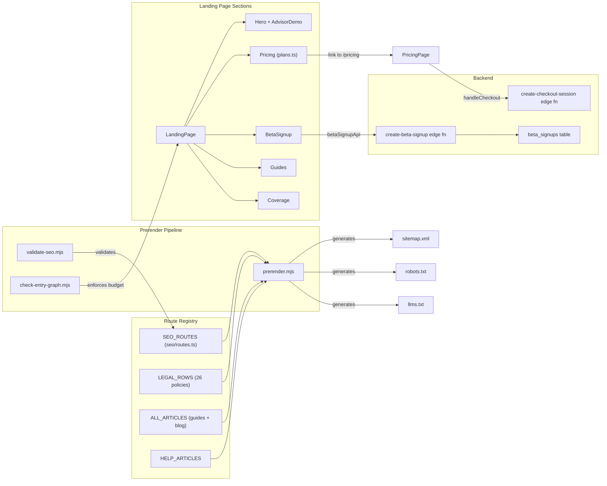

# Marketing Surface

Relevant source files

The following files were used as context for generating this wiki page:

- [SECURITY.md](SECURITY.md)
- [docs/AUTH_MAGIC_LINK.md](docs/AUTH_MAGIC_LINK.md)
- [docs/BILLING_BETA_AUDIT.md](docs/BILLING_BETA_AUDIT.md)
- [public/.well-known/security.txt](public/.well-known/security.txt)
- [src/data/calendar.ts](src/data/calendar.ts)
- [src/features/marketing/SectionIntro.tsx](src/features/marketing/SectionIntro.tsx)
- [src/features/marketing/betaSignupApi.test.ts](src/features/marketing/betaSignupApi.test.ts)
- [src/features/marketing/betaSignupApi.ts](src/features/marketing/betaSignupApi.ts)
- [src/features/marketing/sections/AdvisorDemo.tsx](src/features/marketing/sections/AdvisorDemo.tsx)
- [src/features/marketing/sections/BetaSignup.test.tsx](src/features/marketing/sections/BetaSignup.test.tsx)
- [src/features/marketing/sections/BetaSignup.tsx](src/features/marketing/sections/BetaSignup.tsx)
- [src/features/marketing/sections/Coverage.tsx](src/features/marketing/sections/Coverage.tsx)
- [src/features/marketing/sections/Guides.tsx](src/features/marketing/sections/Guides.tsx)
- [src/features/marketing/sections/Hero.tsx](src/features/marketing/sections/Hero.tsx)
- [src/features/marketing/sections/HowItWorks.tsx](src/features/marketing/sections/HowItWorks.tsx)
- [src/features/marketing/sections/LandingDemoPath.tsx](src/features/marketing/sections/LandingDemoPath.tsx)
- [src/features/marketing/sections/WorkspaceModuleDemos.tsx](src/features/marketing/sections/WorkspaceModuleDemos.tsx)
- [src/i18n/messages/faq.ts](src/i18n/messages/faq.ts)
- [src/i18n/messages/landing.ts](src/i18n/messages/landing.ts)
- [supabase/functions/create-beta-signup/index.ts](supabase/functions/create-beta-signup/index.ts)

The **marketing surface** is the public-facing half of Dutiva's architecture — every page a visitor sees before signing in or opening the demo. It is fully bilingual (EN/FR), prerendered for SEO, and code-split so that workspace modules never leak into the marketing critical path. The surface spans the landing page, pricing, beta signup, changelog, an editorial content layer (blog + guides), 26 legal/trust policy documents, a help centre, competitor comparison pages, and supporting pages such as FAQ, About, Contact, and Status.

Visitors can also open the **public demo** at `/demo` (see [Home — Public demo surface](#public-demo-surface)) without creating an account.

All marketing pages share a common layout shell (`MarketingPageShell`) wrapping the shared `Header` and `Footer` inside a `ForcedLangProvider` that derives the active language from the URL rather than user preference.

Sources: [src/features/marketing/pages/MarketingPage.tsx:16-31](), [src/app/routes.tsx:50-63]()

## Surface Architecture

The marketing surface is isolated from the workspace at every layer:

| Concern               | Marketing surface                                             | Workspace surface                                               |
| --------------------- | ------------------------------------------------------------- | --------------------------------------------------------------- |
| Language strategy     | URL-scoped (`ForcedLangProvider`) — `/fr/…` for French        | Preference-scoped (`LangProvider`) — `dutiva-lang` localStorage |
| Rendering             | Prerendered static HTML via `scripts/prerender.mjs`           | Client-rendered SPA shell (`app.html`, noindex)                 |
| Route source of truth | `SEO_ROUTES` in `src/seo/routes.ts`                           | `appViewRoutes` in `src/app/appViews.tsx`                       |
| Bundle isolation      | `check-entry-graph.mjs` enforces eager budget ceilings        | Behind `React.lazy()` boundaries                                |
| Code splitting        | Each page is `lazy()` — visitors download only what they view | Same pattern per workspace view                                 |

The route table in `src/app/routes.tsx` builds one `publicRoutes(lang)` subtree per locale, each wrapped in `PublicShell`, plus the `/app/*` workspace subtree.

Sources: [src/app/routes.tsx:66-101](), [src/app/routes.tsx:133-175](), [scripts/check-entry-graph.mjs:1-25]()

**Marketing surface route and content hierarchy**

```mermaid
graph TD
    PublicShell["PublicShell (ForcedLangProvider)"]
    PublicShell --> LandingPage["LandingPage (/)"]
    PublicShell --> PricingShell["PricingShell (/pricing)"]
    PublicShell --> FaqPage["FaqPage (/faq)"]
    PublicShell --> AboutPage["AboutPage (/about)"]
    PublicShell --> TemplatesPage["TemplatesPage (/templates)"]
    PublicShell --> GuidesIndexPage["GuidesIndexPage (/guides)"]
    PublicShell --> GuideArticlePage["GuideArticlePage (/guides/:slug)"]
    PublicShell --> BlogIndexPage["BlogIndexPage (/blog)"]
    PublicShell --> BlogArticlePage["BlogArticlePage (/blog/:slug)"]
    PublicShell --> LegalHubPage["LegalHubPage (/legal)"]
    PublicShell --> PolicyPage["PolicyPage (/legal/:slug)"]
    PublicShell --> HelpCenterPage["HelpCenterPage (/help)"]
    PublicShell --> HelpArticlePage["HelpArticlePage (/help/:slug)"]
    PublicShell --> ContactPage["ContactPage (/contact)"]
    PublicShell --> StatusPage["StatusPage (/status)"]
    PublicShell --> JurisdictionToolPage["JurisdictionToolPage (/tools/jurisdiction-check)"]
    PublicShell --> ConsentBanner["ConsentBanner (site-wide)"]
```

Sources: [src/app/routes.tsx:71-99]()

## Landing Page, Pricing & Beta Signup

The `LandingPage` component composes sections in a fixed sequence: `Hero` → `TrustStrip` → `HowItWorks` → `HomeFaq` → `Workflows` → `WhyDutiva` → `Product` → **`WorkspaceModuleDemos`** (`#workspace`) → `TestimonialWall` → `Coverage` → `Pricing` → `Guides` → `BetaSignup` → `Footer`.

The unified **`#workspace`** section ([#279](https://github.com/Dutiva-Canada/Dutiva_Web/pull/279), [#280](https://github.com/Dutiva-Canada/Dutiva_Web/pull/280)) combines:

- Three static preview cards (Analytics, Cases, Communications) with Northgate fixture slices from `workspaceDemoFixtures.ts` — marketing-owned, no `@/data` import
- The Communications preview now highlights the `/app/comms` workspace: initiatives, content calendar, relationships, objectives, and CSV/Excel bulk import for contacts, organizations, and content
- A horizontal **guided tour** pill row (`LandingDemoPath`) mirroring `DEMO_TOUR_STOPS` on `/demo`; the Communications stop links to `/demo/comms`
- **Module chips** linking into `/demo/{module}` — Analytics and Communications highlighted in gold
- Canonical CTA copy: **"Open in demo"** / **"Ouvrir dans la démo"** (`landing_open_in_demo`) site-wide

The hero embeds a static `AdvisorDemo` mock; `DocumentStudioDemo` and workspace previews route into the public demo workspace. Copy comes from the `landing` i18n message module via `useLanding()`.

Sources: [src/features/marketing/LandingPage.tsx:25-47](), [src/features/marketing/useLanding.ts:27-32]()

The **pricing tiers** (Free/$0, Starter/$24, Growth/$49, Pro/$99 — all CAD/month) are defined in `src/config/plans.ts`. Paid plans are **open** (`PAID_PLANS_DISABLED_DURING_BETA = false`); paying skips the beta waitlist and includes founder-led support. A free cohort of **15** seats remains waitlisted via `create-beta-signup`. The standalone `/pricing` page adds a full comparison table and billing-period toggle.

Sources: [src/config/plans.ts:28-66](), [src/config/plans.ts:79-84](), [src/features/marketing/sections/Pricing.tsx:25-27]()

The **beta signup** flow begins at the `BetaSignup` component's `#start` anchor. The form collects email, company, province, CASL express consent, a honeypot field, and an optional CAPTCHA token. Submissions pass through `createBetaSignup()` in `betaSignupApi.ts`, which invokes the `create-beta-signup` Supabase edge function. The server enforces per-IP/email rate limits, CAPTCHA verification, and a cohort capacity check (`BETA_COHORT_LIMIT = 15`). The response indicates whether the signup was admitted to the first cohort or waitlisted.

Sources: [src/features/marketing/sections/BetaSignup.tsx:45-108](), [src/features/marketing/betaSignupApi.ts:76-101](), [supabase/functions/create-beta-signup/index.ts:149-155](), [src/config/beta.ts:19]()

For details, see [Landing Page, Pricing & Beta Signup](#7.1).

## Mobile layout (Aug 2026)

Marketing pages use shared responsive utilities in `src/features/marketing/landing.css`:

- **`marketing-auto-grid`** — `auto-fit` grids with `minmax(min(Npx, 100%), 1fr)` so cards never force horizontal overflow on 320px viewports
- **Section gutters** — `px-4 sm:px-6` (or equivalent) on hero, header, demos, and page shells
- **Cookie banner** — opaque marketing surface tokens (`surface-marketing` / `bg-bg-elevated` via `surfaces.css` overlay aliases, [#274](https://github.com/Dutiva-Canada/Dutiva_Web/pull/274)); full-width accept/decline on narrow screens; `body.consent-banner-open` bottom padding
- **`/templates` samples** — click-to-reveal cards open a portaled, centered modal (not inline expansion); safe-area insets on the dialog; modal backdrop and panel use the same opaque marketing tokens ([#272](https://github.com/Dutiva-Canada/Dutiva_Web/pull/272)–[#273](https://github.com/Dutiva-Canada/Dutiva_Web/pull/273), [#274](https://github.com/Dutiva-Canada/Dutiva_Web/pull/274))
- **Advisor / Document Studio demos** — truncated chips, stacked footers, hidden non-essential badges on the smallest breakpoints
- **`#workspace` preview grid** — 1 column on phone, 2 on tablet (`md`), 3 on desktop (`xl`); attention rows stack vertically on narrow viewports; 44px tap targets on demo links ([#279](https://github.com/Dutiva-Canada/Dutiva_Web/pull/279))
- **Beta signup** — late-page "Open in demo" link for scrollers who skip the hero ([#280](https://github.com/Dutiva-Canada/Dutiva_Web/pull/280))

Sources: [src/features/marketing/landing.css](), [src/features/marketing/demos/TemplateSamplePanel.tsx](), [src/features/marketing/analytics/ConsentBanner.tsx](), [src/features/marketing/sections/Hero.tsx]()

## SEO, Prerendering & Content Marketing

Every public URL is registered in the `SEO_ROUTES` array in `src/seo/routes.ts` — 14 static page entries plus dynamic generators for 26 legal documents, help articles, and editorial articles. The `Seo` component renders page-specific `<head>` metadata including title, description, canonical, hreflang alternates (en-CA/fr-CA), Open Graph tags, and a JSON-LD `@graph` (containing `Organization`, `WebSite`, `WebPage`, `BreadcrumbList`, and optionally `FAQPage` and `WebApplication` nodes).

Sources: [src/seo/routes.ts:29-227](), [src/seo/Seo.tsx:62-112](), [src/seo/jsonld.ts:22-87]()

The **prerendering pipeline** (`scripts/prerender.mjs`) runs after the Vite build and generates six outputs: prerendered HTML for all public pages, an `app.html` shell for the workspace, a `404.html` page, `sitemap.xml`, `robots.txt`, and `llms.txt` — all derived from the same route registry. The `check-entry-graph.mjs` CI script enforces bundle budgets, preventing workspace code and heavy prose modules from leaking into the marketing eager graph.

Sources: [scripts/prerender.mjs:1-18](), [scripts/check-entry-graph.mjs:1-25](), [scripts/check-entry-graph.mjs:47-49]()

**Content marketing** consists of two article collections defined by the `Article` model in `articleModel.ts`: guides (`GUIDE_ARTICLES`, focused on documents employers produce) and blog posts (`BLOG_ARTICLES`, focused on obligations that apply). The landing page's `Guides` section teases the guide articles, and both collections are served through `ArticlePage` at `/guides/:slug` and `/blog/:slug` respectively.

Sources: [src/features/marketing/articles/articleModel.ts:57-88](), [src/features/marketing/articles/index.ts:12](), [src/features/marketing/sections/Guides.tsx:9-57]()

For details, see [SEO, Prerendering & Content Marketing](#7.2).

## Legal & Trust Pages

The legal hub at `/legal` (`LegalHubPage`) indexes **26 bilingual policy documents** organized into six groups by the `LEGAL_HUB_GROUPS` array in `legalHubData.ts`. Groups cover foundation (terms, privacy, cookies, accessibility), Canadian compliance frameworks (PIPEDA, Quebec Law 25, CASL, cross-border transfer), AI governance, data handling (DPA, retention, deletion, incident response, security, subprocessors), billing (subscription agreement, refund, support policy), and intellectual property (acceptable use, copyright, trademark, DMCA).

Each document is rendered by `PolicyPage`, which resolves the slug to a `LegalHubRow`, lazily imports the appropriate language edition via `policyEditionResource()`, and renders the content with full SEO metadata including `datePublished` / `dateModified`, hreflang alternates, and breadcrumb JSON-LD.

The `SECURITY.md` vulnerability reporting policy and `public/.well-known/security.txt` (RFC 9116) provide a machine-readable security contact for the site.

Sources: [src/features/marketing/legal/legalHubData.ts:27-214](), [src/features/marketing/pages/PolicyPage.tsx:32-57](), [SECURITY.md:1-62]()

For details, see [Legal & Trust Pages](#7.3).

## How the Subsystems Connect

The following diagram shows how the marketing surface's key modules relate to each other and to backend systems:

Sources: [src/features/marketing/LandingPage.tsx:25-47](), [src/seo/routes.ts:319-326](), [scripts/prerender.mjs:77-97](), [src/features/marketing/betaSignupApi.ts:79-93]()

## Key File Inventory

The following table maps each marketing subsystem to its primary source files:

| Subsystem         | Key files                                                                                                                                                                                                                                                               |
| ----------------- | ----------------------------------------------------------------------------------------------------------------------------------------------------------------------------------------------------------------------------------------------------------------------- |
| Landing page      | `src/features/marketing/LandingPage.tsx`, `sections/Hero.tsx`, `sections/AdvisorDemo.tsx`, `sections/HowItWorks.tsx`, `sections/Product.tsx`, `sections/Modules.tsx`, `sections/Coverage.tsx`, `sections/Pricing.tsx`, `sections/Guides.tsx`, `sections/BetaSignup.tsx` |
| Shared chrome     | `sections/Header.tsx`, `sections/Footer.tsx`, `pages/MarketingPage.tsx`, `Brand.tsx`, `useLanding.ts`, `landing.css`                                                                                                                                                    |
| Plans & pricing   | `src/config/plans.ts`, `src/config/planComparison.ts`, `pages/PricingPage.tsx`, `pages/PricingShell.tsx`                                                                                                                                                                |
| Beta signup       | `betaSignupApi.ts`, `supabase/functions/create-beta-signup/index.ts`, `src/config/beta.ts`                                                                                                                                                                              |
| SEO system        | `src/seo/routes.ts`, `src/seo/Seo.tsx`, `src/seo/head.ts`, `src/seo/jsonld.ts`                                                                                                                                                                                          |
| Prerendering      | `scripts/prerender.mjs`, `scripts/validate-seo.mjs`, `scripts/check-entry-graph.mjs`                                                                                                                                                                                    |
| Content marketing | `articles/articleModel.ts`, `articles/blogArticles.ts`, `articles/guideArticles.ts`, `articles/blogContent.ts`, `articles/guideContent.ts`, `pages/ArticlePage.tsx`                                                                                                     |
| Legal hub         | `legal/legalHubData.ts`, `legal/policyContent.ts`, `legal/content/*.ts` (52 edition files), `pages/LegalHubPage.tsx`, `pages/PolicyPage.tsx`                                                                                                                            |
| i18n messages     | `src/i18n/messages/landing.ts`, `src/i18n/messages/faq.ts`, `src/i18n/messages/marketing.ts`                                                                                                                                                                            |
| Other pages       | `pages/FaqPage.tsx`, `pages/AboutPage.tsx`, `pages/ContactPage.tsx`, `pages/StatusPage.tsx`, `pages/HelpCenterPage.tsx`, `pages/TemplatesPage.tsx`, `pages/GuidesIndexPage.tsx`, `pages/KnownLimitationsPage.tsx`, `pages/JurisdictionToolPage.tsx`                     |

Sources: [src/features/marketing/LandingPage.tsx:1-17](), [src/config/plans.ts:1-3](), [src/seo/routes.ts:1-9](), [src/features/marketing/legal/legalHubData.ts:27-214](), [src/features/marketing/articles/index.ts:1-8]()

## Beta-Period Operational State

As of August 2026:

- **Paid plans are open** — checkout is live for admitted accounts; the free beta cohort of **15** remains waitlisted.
- **Public demo** — `/demo` and `/fr/demo` offer a read-only Northgate preview with a guided tour; no sign-in required.
- **Changelog** — `/changelog` lists dated product updates (`src/features/marketing/changelog/changelogEntries.ts`).

Sources: [src/config/plans.ts:72-84](), [src/config/beta.ts:1-19](), [src/app/appSurface.tsx:77-91](), [docs/CANONICAL_FACTS.md:47-48]()

---
