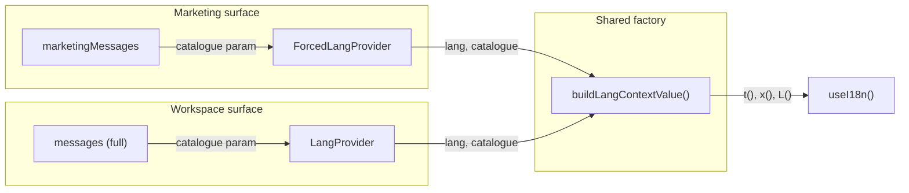
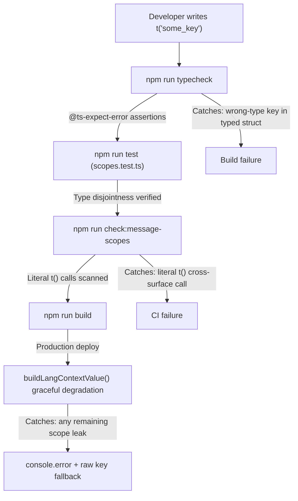
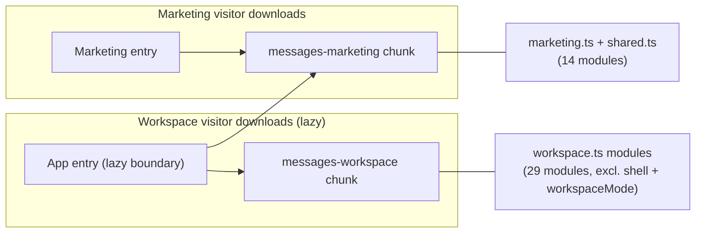

# Message Catalogue Organization & Scope Enforcement

<details>
<summary>Relevant source files</summary>

The following files were used as context for generating this wiki page:

- [docs/advisor-guidance-corpus-2026-07-27.md](docs/advisor-guidance-corpus-2026-07-27.md)
- [scripts/check-message-scopes.mjs](scripts/check-message-scopes.mjs)
- [src/config/beta.ts](src/config/beta.ts)
- [src/features/app/auth/RequireAdminSession.test.tsx](src/features/app/auth/RequireAdminSession.test.tsx)
- [src/features/app/auth/RequireAdminSession.tsx](src/features/app/auth/RequireAdminSession.tsx)
- [src/features/marketing/legal/content/refund-policy.en.ts](src/features/marketing/legal/content/refund-policy.en.ts)
- [src/features/marketing/legal/content/refund-policy.fr.ts](src/features/marketing/legal/content/refund-policy.fr.ts)
- [src/features/marketing/legal/content/subscription-agreement.en.ts](src/features/marketing/legal/content/subscription-agreement.en.ts)
- [src/features/marketing/legal/content/subscription-agreement.fr.ts](src/features/marketing/legal/content/subscription-agreement.fr.ts)
- [src/features/marketing/legal/content/terms.en.ts](src/features/marketing/legal/content/terms.en.ts)
- [src/features/marketing/legal/content/terms.fr.ts](src/features/marketing/legal/content/terms.fr.ts)
- [src/features/support/FirstLineSuggestions.test.tsx](src/features/support/FirstLineSuggestions.test.tsx)
- [src/features/support/FirstLineSuggestions.tsx](src/features/support/FirstLineSuggestions.tsx)
- [src/features/support/SupportRequestForm.tsx](src/features/support/SupportRequestForm.tsx)
- [src/features/support/firstLineApi.test.ts](src/features/support/firstLineApi.test.ts)
- [src/i18n/messages/index.ts](src/i18n/messages/index.ts)
- [src/i18n/messages/legalHub.ts](src/i18n/messages/legalHub.ts)
- [src/i18n/messages/support.ts](src/i18n/messages/support.ts)
- [src/lib/billing/adminAccess.ts](src/lib/billing/adminAccess.ts)
- [src/lib/deployEnv.ts](src/lib/deployEnv.ts)
- [supabase/functions/support-firstline/index.ts](supabase/functions/support-firstline/index.ts)
- [vite.config.ts](vite.config.ts)

</details>

The Dutiva i18n message catalogue is split across **43 feature-specific module files**, grouped into three surface-scoped aggregations — **workspace** (29 modules), **marketing** (10 modules), and **shared** (4 dual-surface modules). This split is enforced at three layers: TypeScript's type system, a compile-time disjointness test, and a runtime CI guard script. The result is that marketing visitors never download workspace-only message strings.

## The `defineMessages` Pattern

Every message module uses the `defineMessages` identity function defined in `src/i18n/core.ts`. It accepts a `Record<string, Bi>` and returns it unchanged — its purpose is purely type-level: it pins each module to the `{ en: string; fr: string }` shape while preserving literal key types, so `t()` calls are fully typed and EN/FR parity is structural (a key cannot exist in one language only).

[src/i18n/core.ts:16-18]()

```typescript
export function defineMessages<T extends Record<string, Bi>>(messages: T): T {
  return messages
}
```

Every module file follows the same structure:

1. Import `defineMessages` from `../core`
2. Export a named constant (e.g. `shellMessages`, `homeMessages`, `casesMessages`)
3. Each key is feature-prefixed (`shell_*`, `home_*`, `cases_*`, `advisor_*`, `landing_*`, etc.)
4. Each value is a `Bi` object: `{ en: '...', fr: '...' }`

For example, `shell.ts` uses the `shell_` prefix ([src/i18n/messages/shell.ts:12-14]()), `home.ts` uses `home_` ([src/i18n/messages/home.ts:12-14]()), and `advisorCore.ts` uses `advisor_` ([src/i18n/messages/advisorCore.ts:17-19]()). This prefix convention is mandated by `CONVENTIONS.md` and prevents key collisions when modules are merged.

Sources: [src/i18n/core.ts:16-18](), [src/i18n/messages/shell.ts:1-14](), [src/i18n/messages/home.ts:1-14](), [src/i18n/messages/advisorCore.ts:1-19]()

## Three-Surface Message Split

The catalogue is organized into three aggregation modules under `src/i18n/messages/`. Placement is derived empirically: each module is classified by which source files under `src/features/app/**` and `src/features/marketing/**` actually reference its keys.

[src/i18n/messages/index.ts:33-43]()

**Three-surface message split architecture**

```mermaid
graph TD
    subgraph "shared.ts"
        common["common.ts"]
        landing["landing.ts"]
        supportMod["support.ts"]
        helpCenter["helpCenter.ts"]
    end

    subgraph "workspace.ts (29 modules)"
        shell["shell.ts"]
        advisorCore["advisorCore.ts"]
        advisorView["advisorView.ts"]
        advisorWS["advisorWorkspace.ts"]
        home["home.ts"]
        cases["cases.ts"]
        employees["employees.ts"]
        doclib["doclib.ts"]
        docstudio["docstudio.ts"]
        templates["templates.ts"]
        otherWS["... 19 more"]
    end

    subgraph "marketing.ts (10 modules)"
        pricing["pricing.ts"]
        about["about.ts"]
        faq["faq.ts"]
        legalHub["legalHub.ts"]
        blog["blog.ts"]
        otherMK["... 5 more"]
    end

    WA["workspaceMessages"] --> shell
    WA --> advisorCore
    WA --> advisorView
    WA --> advisorWS
    WA --> home
    WA --> cases
    WA --> employees
    WA --> doclib
    WA --> docstudio
    WA --> templates
    WA --> otherWS
    WA --> common
    WA --> landing
    WA --> supportMod
    WA --> helpCenter

    MA["marketingMessages"] --> pricing
    MA --> about
    MA --> faq
    MA --> legalHub
    MA --> blog
    MA --> otherMK
    MA --> common
    MA --> landing
    MA --> supportMod
    MA --> helpCenter
```



Sources: [src/i18n/messages/workspace.ts:1-78](), [src/i18n/messages/marketing.ts:1-36](), [src/i18n/messages/shared.ts:1-32](), [src/i18n/messages/index.ts:18-43]()

### Workspace Group (29 modules)

`workspace.ts` imports and re-exports 29 workspace-only modules plus the shared set. These modules are read exclusively from `src/features/app/**` (plus `src/components/advisor/` and `src/lib/exportProtection/`).

[src/i18n/messages/workspace.ts:1-30]()

| Module file           | Exported constant          | Key prefix     | Domain                            |
| --------------------- | -------------------------- | -------------- | --------------------------------- |
| `shell.ts`            | `shellMessages`            | `shell_*`      | App shell chrome, sidebar, topbar |
| `advisorCore.ts`      | `advisorCore`              | `advisor_*`    | Chat primitives, rail overlay     |
| `advisorView.ts`      | `advisorViewMessages`      | `advisor_*`    | Advisor view chrome               |
| `advisorWorkspace.ts` | `advisorWorkspaceMessages` | `advisor_*`    | Compliance workspace sidebar      |
| `home.ts`             | `homeMessages`             | `home_*`       | Command Centre / Home view        |
| `search.ts`           | `searchMessages`           | `search_*`     | ⌘K search overlay                 |
| `docstudio.ts`        | `docstudioMessages`        | `docstudio_*`  | Document Studio                   |
| `doclib.ts`           | `doclibMessages`           | `doclib_*`     | HR Document Library               |
| `templates.ts`        | `templatesMessages`        | `templates_*`  | Template catalogue                |
| `cases.ts`            | `casesMessages`            | `cases_*`      | Case Files                        |
| `employees.ts`        | `employeesMessages`        | `employees_*`  | Employees roster/profiles         |
| `compliance.ts`       | `complianceMessages`       | `compliance_*` | Compliance dashboard              |
| `policies.ts`         | `policiesMessages`         | `policies_*`   | Policies view                     |
| `tasks.ts`            | `tasksMessages`            | `tasks_*`      | Task management                   |
| `calendar.ts`         | `calendarMessages`         | `calendar_*`   | Calendar view                     |
| `analytics.ts`        | `analyticsMessages`        | `analytics_*`  | Analytics dashboard               |
| `workflows.ts`        | `workflowsMessages`        | `workflows_*`  | Workflow catalogue                |
| `flows.ts`            | `flowsMessages`            | `flows_*`      | FlowRunner engine UI              |
| `knowledge.ts`        | `knowledgeMessages`        | `knowledge_*`  | Knowledge view                    |
| `reference.ts`        | `referenceMessages`        | `reference_*`  | Reference guides                  |
| `guidance.ts`         | `guidanceMessages`         | `guidance_*`   | Guidance sources                  |
| `settings.ts`         | `settingsMessages`         | `settings_*`   | Settings view                     |
| `communications.ts`   | `communicationsMessages`   | `comms_*`      | Communications                    |
| `compensation.ts`     | `compensationMessages`     | `comp_*`       | Compensation                      |
| `wellbeing.ts`        | `wellbeingMessages`        | `wellbeing_*`  | Wellbeing                         |
| `memory.ts`           | `memoryMessages`           | `memory_*`     | Memory system                     |
| `auth.ts`             | `authMessages`             | `auth_*`       | Auth UI (magic-link)              |
| `workspaceMode.ts`    | `workspaceModeMessages`    | `wsmode_*`     | Demo/production mode              |
| `exportProtection.ts` | `exportProtectionMessages` | `exportprot_*` | Export watermarks                 |

Sources: [src/i18n/messages/workspace.ts:39-70]()

### Marketing Group (10 modules)

`marketing.ts` imports 10 marketing-only modules plus the shared set. These are read exclusively from `src/features/marketing/**` and `src/seo/routes.ts`.

[src/i18n/messages/marketing.ts:1-36]()

| Module file           | Exported constant          | Key prefix     |
| --------------------- | -------------------------- | -------------- |
| `pricing.ts`          | `pricingMessages`          | `pricing_*`    |
| `templatesPreview.ts` | `templatesPreviewMessages` | `tplPreview_*` |
| `guidesIndex.ts`      | `guidesIndexMessages`      | `guidesIdx_*`  |
| `about.ts`            | `aboutMessages`            | `about_*`      |
| `faq.ts`              | `faqMessages`              | `faq_*`        |
| `blog.ts`             | `blogMessages`             | `blog_*`       |
| `templateUsage.ts`    | `tmplGuideMessages`        | `tmplGuide_*`  |
| `knownLimitations.ts` | `limitsMessages`           | `limits_*`     |
| `legalHub.ts`         | `legalHubMessages`         | `legalHub_*`   |
| `jurisdictionTool.ts` | `jurisdictionToolMessages` | `jur_tool_*`   |

Sources: [src/i18n/messages/marketing.ts:1-32]()

### Shared Group (4 dual-surface modules)

`shared.ts` contains the 4 modules genuinely read from both surfaces. Each has a concrete reason for being shared:

[src/i18n/messages/shared.ts:1-32]()

| Module file     | Why shared                                                                                                              |
| --------------- | ----------------------------------------------------------------------------------------------------------------------- |
| `common.ts`     | Brand name, legal disclaimer, theme/lang toggle — used by marketing legal pages, workspace, and `Disclaimer.tsx`        |
| `landing.ts`    | Plan copy (`landing_free_desc`, etc.) referenced by `src/config/plans.ts`, resolved by workspace's `PlanGate` via `t()` |
| `support.ts`    | Dual-surface support feature: public `/contact` form + in-app request form                                              |
| `helpCenter.ts` | Help Centre is a marketing surface whose widgets live under `src/features/support/`                                     |

The `landing.ts` module is the most surprising shared member — it exists in the shared group because plan description keys like `landing_free_desc` are stored in `plans.ts` and resolved via `t()` inside the workspace's `PlanGate.tsx`. Moving `landing` out of shared would crash a workspace component, not a marketing page.

[src/i18n/messages/shared.ts:14-17]()

Sources: [src/i18n/messages/shared.ts:1-32](), [src/i18n/messages/common.ts:1-23]()

## The Merged Index

`src/i18n/messages/index.ts` merges workspace and marketing messages back together for consumers that need the full catalogue (tests, `LangProvider`). It also exports the three scoped key types:

[src/i18n/messages/index.ts:86-93]()

```typescript
export const messages = {
  ...workspaceMessages,
  ...marketingMessages,
} as const

export type MessageKey = keyof typeof messages
```

The three scoped key types — `WorkspaceMessageKey`, `MarketingMessageKey`, `SharedMessageKey` — are exported from this index but defined in their respective aggregation files.

[src/i18n/messages/index.ts:4-6](), [src/i18n/messages/workspace.ts:77](), [src/i18n/messages/marketing.ts:35](), [src/i18n/messages/shared.ts:31]()

Sources: [src/i18n/messages/index.ts:1-93]()

## Provider-Level Surface Binding

The surface split is consumed by two different providers, each receiving only the messages its surface needs:

**Provider to catalogue data flow**



- **`ForcedLangProvider`** (marketing surface) imports `marketingMessages` from `./messages/marketing` — never the full index. This is the import that keeps workspace modules out of the marketing bundle.
  [src/i18n/ForcedLangProvider.tsx:9](), [src/i18n/ForcedLangProvider.tsx:51-52]()

- **`LangProvider`** (workspace surface) imports the full merged `messages` from `./messages`. The workspace is always behind a lazy route boundary, so including the full catalogue has no effect on the marketing eager graph.
  [src/i18n/LangProvider.tsx:7](), [src/i18n/LangProvider.tsx:39]()

Both call `buildLangContextValue()` in `src/i18n/lang.ts`, which constructs the `t()` function. If `t()` is called with a key not present in the given catalogue (a scope violation), it **degrades gracefully** — logs an error and returns the raw key rather than crashing the page:

[src/i18n/lang.ts:43-50]()

```typescript
const t = (key: MessageKey): string => {
  const entry = catalogue[key]
  if (!entry) {
    console.error(`[i18n] "${key}" is not in this surface's message catalogue.`)
    return key
  }
  return pick(entry, lang)
}
```

Sources: [src/i18n/ForcedLangProvider.tsx:1-57](), [src/i18n/LangProvider.tsx:1-44](), [src/i18n/lang.ts:37-60]()

## Scope Enforcement Layer 1: Compile-Time Type Disjointness

`src/i18n/messages/scopes.test.ts` is a Vitest test that runs during `npm run typecheck` + `npm run test`. It uses TypeScript `@ts-expect-error` directives to assert that the three scoped key types are disjoint where they claim to be. **The real test is at compile time**: each `@ts-expect-error` line fails the build if the error it expects stops happening — meaning a key that should not cross a surface boundary has become assignable.

[src/i18n/messages/scopes.test.ts:1-78]()

The test verifies six constraints with three sample keys:

| Assertion                                  | Expected result          |
| ------------------------------------------ | ------------------------ |
| Workspace-only key → `MarketingMessageKey` | ❌ Type error (expected) |
| Workspace-only key → `SharedMessageKey`    | ❌ Type error (expected) |
| Marketing-only key → `WorkspaceMessageKey` | ❌ Type error (expected) |
| Marketing-only key → `SharedMessageKey`    | ❌ Type error (expected) |
| Shared key → `WorkspaceMessageKey`         | ✅ Assignable            |
| Shared key → `MarketingMessageKey`         | ✅ Assignable            |

The runtime portion of the test pins the sample keys to real catalogue entries (`messages` must `.toHaveProperty(key)`) so the type assertions cannot silently rot into testing typos.

[src/i18n/messages/scopes.test.ts:30-38](), [src/i18n/messages/scopes.test.ts:40-77]()

Sources: [src/i18n/messages/scopes.test.ts:1-78]()

## Scope Enforcement Layer 2: Runtime CI Guard (`check-message-scopes.mjs`)

`scripts/check-message-scopes.mjs` is a Node.js script wired into `npm run check` (and therefore CI) via the `check:message-scopes` npm script.

[package.json:23-24]()

It catches what the type system cannot: a literal `t('some_key')` call in a component that reaches outside its surface's allowed key set. The script works in four steps:

1. **Derive allowed keys per surface** — reads `workspace.ts` and `marketing.ts`, follows their imports to each module file, and extracts all top-level keys using a regex (`/^ {2}([A-Za-z0-9_]+):/gm`). Shared keys are added to both allowed sets.
   [scripts/check-message-scopes.mjs:53-67]()

2. **Define surface directories** — workspace = `src/features/app`, `src/components/advisor`, `src/lib/exportProtection`; marketing = `src/features/marketing`.
   [scripts/check-message-scopes.mjs:76-87]()

3. **Scan for literal `t()` calls** — matches the regex `/\bt\(\s*['"]([A-Za-z0-9_]+)['"]\s*\)/g` against every `.ts` / `.tsx` file in each surface's directories (excluding test files).
   [scripts/check-message-scopes.mjs:108-123]()

4. **Report violations** — any key in a `t('...')` call not in that surface's allowed set is a violation. The script exits with code 1 and prints each offending file/key/surface.
   [scripts/check-message-scopes.mjs:125-141]()

Computed calls like `t(someVariable)` are invisible to this script by design — those are guarded separately at the data structure level (e.g. `plans.ts`, `legalHubData.ts`, which are typed with a surface-scoped key type).

[scripts/check-message-scopes.mjs:13-16]()

**Scope enforcement pipeline**



Sources: [scripts/check-message-scopes.mjs:1-141](), [package.json:23-24]()

## Bundle Optimization via Vite Code Splitting

The surface split has a concrete bundle-size payoff configured in `vite.config.ts`. Two `codeSplitting.groups` mirror the message module boundary:

[vite.config.ts:171-218]()

| Group name           | Regex `test`                                                                                                                                                                                       | Contents                       |
| -------------------- | -------------------------------------------------------------------------------------------------------------------------------------------------------------------------------------------------- | ------------------------------ |
| `messages-marketing` | Matches `marketing`, `shared`, `common`, `landing`, `pricing`, `templatesPreview`, `guidesIndex`, `about`, `faq`, `blog`, `templateUsage`, `knownLimitations`, `legalHub`, `support`, `helpCenter` | All marketing + shared modules |
| `messages-workspace` | Matches everything in `src/i18n/messages/` except `shell.ts` and `workspaceMode.ts`; `includeDependenciesRecursively: false`                                                                       | All workspace modules          |

[vite.config.ts:211-218]()

The `messages-workspace` group sets `includeDependenciesRecursively: false` to solve a specific problem: `shell.ts` and `workspaceMode.ts` are imported directly by eager files (`navLabels.ts`, `ProductionEmptyState.tsx`) that live in `ALLOWED_APP_MODULES`. Without this flag, rolldown would pull those two modules into the workspace chunk as dependencies regardless of the `test` regex excluding them.

[vite.config.ts:183-209]()

The measured result was a **131.4 kB reduction** in the marketing eager graph (671.3 kB → 539.9 kB).

[src/i18n/messages/index.ts:48-49]()

**Bundle chunk architecture**



Sources: [vite.config.ts:170-253](), [src/i18n/messages/index.ts:46-60]()

## Complete Message Module Inventory

The `src/i18n/messages/` directory contains 48 files total: 43 feature modules, 3 surface aggregation files, 1 merged index, and 1 scope test.

### Feature Modules (43 files)

| #   | File                  | Surface    | Key prefix                                    | Exported constant          |
| --- | --------------------- | ---------- | --------------------------------------------- | -------------------------- |
| 1   | `about.ts`            | marketing  | `about_*`                                     | `aboutMessages`            |
| 2   | `advisorCore.ts`      | workspace  | `advisor_*`                                   | `advisorCore`              |
| 3   | `advisorView.ts`      | workspace  | `advisor_*`                                   | `advisorViewMessages`      |
| 4   | `advisorWorkspace.ts` | workspace  | `advisor_*`                                   | `advisorWorkspaceMessages` |
| 5   | `analytics.ts`        | workspace  | `analytics_*`                                 | `analyticsMessages`        |
| 6   | `auth.ts`             | workspace  | `auth_*`                                      | `authMessages`             |
| 7   | `blog.ts`             | marketing  | `blog_*`                                      | `blogMessages`             |
| 8   | `calendar.ts`         | workspace  | `calendar_*`                                  | `calendarMessages`         |
| 9   | `cases.ts`            | workspace  | `cases_*`                                     | `casesMessages`            |
| 10  | `common.ts`           | **shared** | `brand_*`, `disclaimer*`, `theme_*`, `lang_*` | `common`                   |
| 11  | `communications.ts`   | workspace  | `comms_*`                                     | `communicationsMessages`   |
| 12  | `compensation.ts`     | workspace  | `comp_*`                                      | `compensationMessages`     |
| 13  | `compliance.ts`       | workspace  | `compliance_*`                                | `complianceMessages`       |
| 14  | `doclib.ts`           | workspace  | `doclib_*`                                    | `doclibMessages`           |
| 15  | `docstudio.ts`        | workspace  | `docstudio_*`                                 | `docstudioMessages`        |
| 16  | `employees.ts`        | workspace  | `employees_*`                                 | `employeesMessages`        |
| 17  | `exportProtection.ts` | workspace  | `exportprot_*`                                | `exportProtectionMessages` |
| 18  | `faq.ts`              | marketing  | `faq_*`                                       | `faqMessages`              |
| 19  | `flows.ts`            | workspace  | `flows_*`                                     | `flowsMessages`            |
| 20  | `guidance.ts`         | workspace  | `guidance_*`                                  | `guidanceMessages`         |
| 21  | `guidesIndex.ts`      | marketing  | `guidesIdx_*`                                 | `guidesIndexMessages`      |
| 22  | `helpCenter.ts`       | **shared** | `help_*`                                      | `helpCenterMessages`       |
| 23  | `home.ts`             | workspace  | `home_*`                                      | `homeMessages`             |
| 24  | `jurisdictionTool.ts` | marketing  | `jur_tool_*`                                  | `jurisdictionToolMessages` |
| 25  | `knowledge.ts`        | workspace  | `knowledge_*`                                 | `knowledgeMessages`        |
| 26  | `knownLimitations.ts` | marketing  | `limits_*`                                    | `limitsMessages`           |
| 27  | `landing.ts`          | **shared** | `landing_*`                                   | `landing`                  |
| 28  | `legalHub.ts`         | marketing  | `legalHub_*`                                  | `legalHubMessages`         |
| 29  | `memory.ts`           | workspace  | `memory_*`                                    | `memoryMessages`           |
| 30  | `policies.ts`         | workspace  | `policies_*`                                  | `policiesMessages`         |
| 31  | `pricing.ts`          | marketing  | `pricing_*`                                   | `pricingMessages`          |
| 32  | `reference.ts`        | workspace  | `reference_*`                                 | `referenceMessages`        |
| 33  | `search.ts`           | workspace  | `search_*`                                    | `searchMessages`           |
| 34  | `settings.ts`         | workspace  | `settings_*`                                  | `settingsMessages`         |
| 35  | `shell.ts`            | workspace  | `shell_*`                                     | `shellMessages`            |
| 36  | `support.ts`          | **shared** | `support_*`                                   | `supportMessages`          |
| 37  | `tasks.ts`            | workspace  | `tasks_*`                                     | `tasksMessages`            |
| 38  | `templateUsage.ts`    | marketing  | `tmplGuide_*`                                 | `tmplGuideMessages`        |
| 39  | `templates.ts`        | workspace  | `templates_*`                                 | `templatesMessages`        |
| 40  | `templatesPreview.ts` | marketing  | `tplPreview_*`                                | `templatesPreviewMessages` |
| 41  | `wellbeing.ts`        | workspace  | `wellbeing_*`                                 | `wellbeingMessages`        |
| 42  | `workflows.ts`        | workspace  | `workflows_*`                                 | `workflowsMessages`        |
| 43  | `workspaceMode.ts`    | workspace  | `wsmode_*`                                    | `workspaceModeMessages`    |

### Infrastructure Files (5 files)

| File             | Role                                                                                             |
| ---------------- | ------------------------------------------------------------------------------------------------ |
| `workspace.ts`   | Aggregates 29 workspace modules + shared into `workspaceMessages`; exports `WorkspaceMessageKey` |
| `marketing.ts`   | Aggregates 10 marketing modules + shared into `marketingMessages`; exports `MarketingMessageKey` |
| `shared.ts`      | Aggregates 4 dual-surface modules into `sharedMessages`; exports `SharedMessageKey`              |
| `index.ts`       | Merges `workspaceMessages` + `marketingMessages` into `messages`; exports `MessageKey` union     |
| `scopes.test.ts` | Compile-time disjointness assertions for the three scoped key types                              |

Sources: [src/i18n/messages/workspace.ts:1-78](), [src/i18n/messages/marketing.ts:1-36](), [src/i18n/messages/shared.ts:1-32](), [src/i18n/messages/index.ts:1-93](), [src/i18n/messages/scopes.test.ts:1-78]()

## Resolution Patterns in Components

Components access messages through two patterns, both via the `useI18n()` hook exported from `src/i18n/context.ts`:

[src/i18n/context.ts:8-13]()

### Pattern 1: `t('key')` — catalogue lookup by string key

Used for chrome strings resolved through the provider's catalogue. The key is typed `MessageKey` (the full union). Surface enforcement relies on the CI guard script to catch literal calls crossing a boundary.

```typescript
const { t } = useI18n()
return <h1>{t('home_greeting')}</h1>
```

### Pattern 2: `x(biValue)` — direct `Bi` resolution

Used when the component already has a typed `Bi` object (e.g. imported directly from a message module). Bypasses the catalogue entirely — picks `en` or `fr` from the object. This is how components like `SupportRequestForm` consume messages:

[src/features/support/SupportRequestForm.tsx:4]()

```typescript
import { supportMessages as M } from '@/i18n/messages/support'
// ...
const { x } = useI18n()
return <p>{x(M.support_sensitive_warning)}</p>
```

The `x()` pattern provides compile-time safety at the import site — the module's `Bi` type is already constrained — without depending on the runtime catalogue.

Sources: [src/i18n/context.ts:1-29](), [src/features/support/SupportRequestForm.tsx:1-5](), [src/features/support/FirstLineSuggestions.tsx:4]()

## CI Integration

The scope enforcement fits into the CI pipeline as the final check in the `npm run check` command:

[package.json:24]()

```
npm run check =
  typecheck → lint → test → check:migrations → check:rls → check:facts → check:message-scopes
```

The `check:message-scopes` step runs last because it depends on the source files being syntactically valid (earlier steps catch parse errors). On success it prints a summary:

```
check-message-scopes: OK — {N} workspace-only, {M} marketing-only, {K} shared keys;
no literal t() call crosses a surface boundary.
```

[scripts/check-message-scopes.mjs:137-141]()

On failure it lists every violation with file path, key, and surface label, then exits non-zero to fail CI.

[scripts/check-message-scopes.mjs:125-134]()

Sources: [package.json:23-24](), [scripts/check-message-scopes.mjs:125-141]()

---
