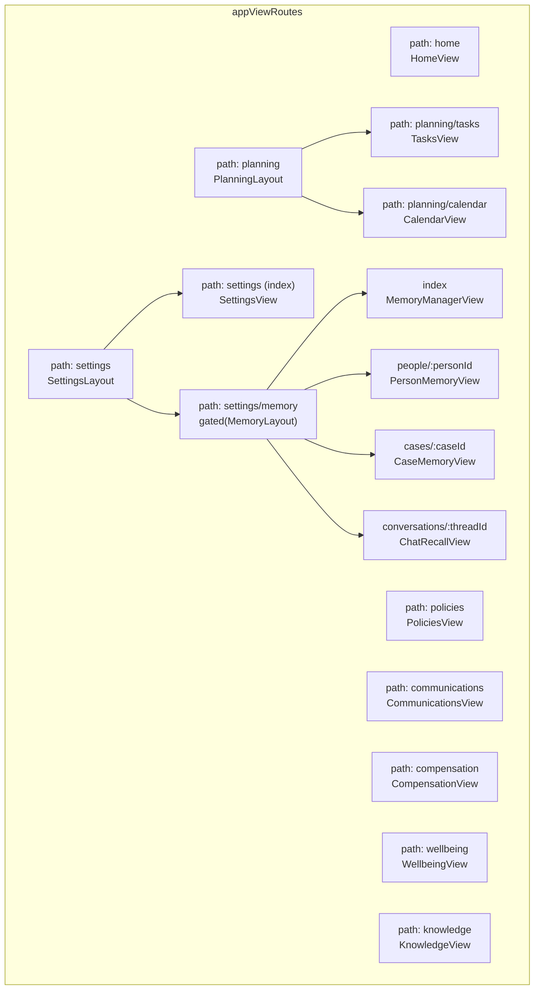
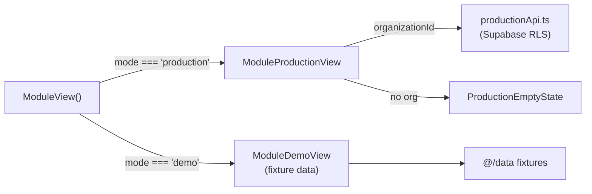
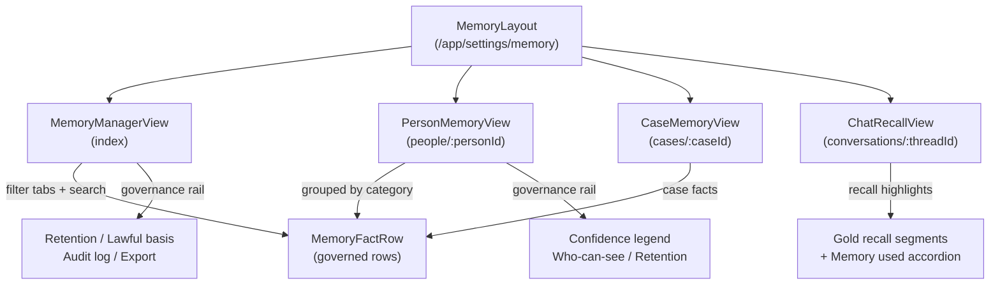
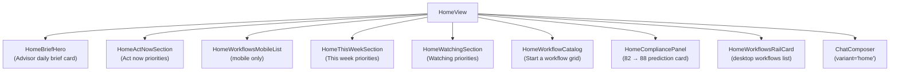
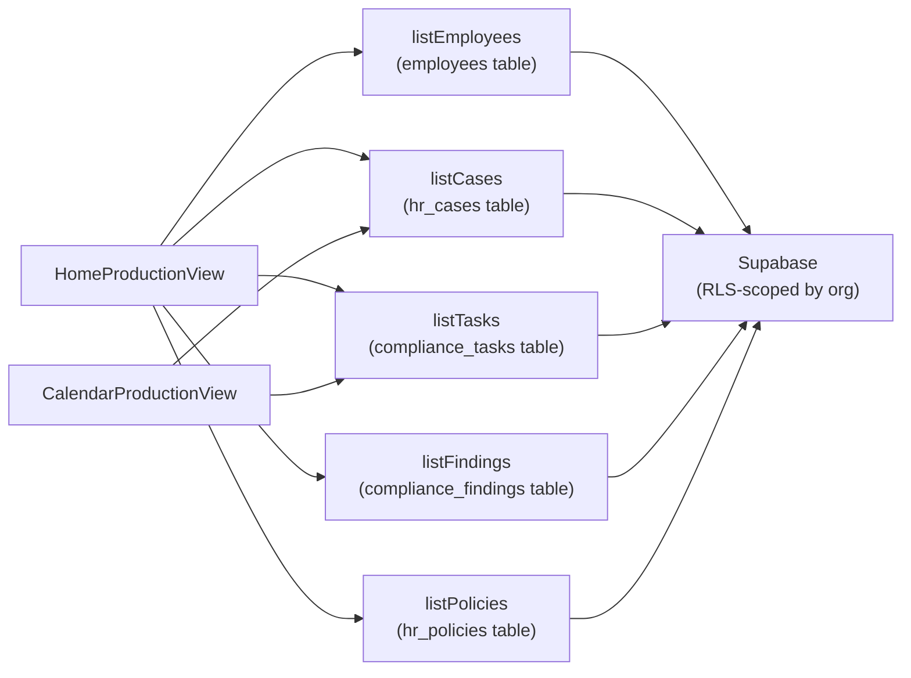

# Planning, Settings & Other Modules

<details>
<summary>Relevant source files</summary>

The following files were used as context for generating this wiki page:

- [scripts/generate-doclib.mjs](scripts/generate-doclib.mjs)
- [src/features/app/shell/navLabels.test.ts](src/features/app/shell/navLabels.test.ts)
- [src/features/app/shell/navLabels.ts](src/features/app/shell/navLabels.ts)
- [src/features/app/views/advisor/advisorHomeData.ts](src/features/app/views/advisor/advisorHomeData.ts)
- [src/features/app/views/calendar/CalendarProductionView.tsx](src/features/app/views/calendar/CalendarProductionView.tsx)
- [src/features/app/views/calendar/CalendarView.test.tsx](src/features/app/views/calendar/CalendarView.test.tsx)
- [src/features/app/views/calendar/CalendarView.tsx](src/features/app/views/calendar/CalendarView.tsx)
- [src/features/app/views/home/HomeCompliancePanel.tsx](src/features/app/views/home/HomeCompliancePanel.tsx)
- [src/features/app/views/home/HomeProductionView.tsx](src/features/app/views/home/HomeProductionView.tsx)
- [src/features/app/views/home/HomeView.test.tsx](src/features/app/views/home/HomeView.test.tsx)
- [src/features/app/views/home/HomeView.tsx](src/features/app/views/home/HomeView.tsx)
- [src/features/app/views/home/HomeWorkflowsCard.tsx](src/features/app/views/home/HomeWorkflowsCard.tsx)
- [src/features/app/views/memory/CaseMemoryView.tsx](src/features/app/views/memory/CaseMemoryView.tsx)
- [src/features/app/views/memory/ChatRecallView.tsx](src/features/app/views/memory/ChatRecallView.tsx)
- [src/features/app/views/memory/MemoryLayout.tsx](src/features/app/views/memory/MemoryLayout.tsx)
- [src/features/app/views/memory/MemoryViews.test.tsx](src/features/app/views/memory/MemoryViews.test.tsx)
- [src/features/app/views/memory/PersonMemoryView.tsx](src/features/app/views/memory/PersonMemoryView.tsx)
- [src/features/app/views/policies/PoliciesView.test.tsx](src/features/app/views/policies/PoliciesView.test.tsx)
- [src/features/app/views/policies/PoliciesView.tsx](src/features/app/views/policies/PoliciesView.tsx)
- [src/features/app/views/policies/productionApi.test.ts](src/features/app/views/policies/productionApi.test.ts)
- [src/features/app/views/policies/productionApi.ts](src/features/app/views/policies/productionApi.ts)
- [src/features/app/views/settings/SettingsView.test.tsx](src/features/app/views/settings/SettingsView.test.tsx)
- [src/features/app/views/settings/SettingsView.tsx](src/features/app/views/settings/SettingsView.tsx)
- [src/features/app/views/settings/settingsData.ts](src/features/app/views/settings/settingsData.ts)
- [src/features/app/views/settings/settingsPrimitives.tsx](src/features/app/views/settings/settingsPrimitives.tsx)
- [src/features/app/views/tasks/TasksView.test.tsx](src/features/app/views/tasks/TasksView.test.tsx)
- [src/features/app/views/tasks/TasksView.tsx](src/features/app/views/tasks/TasksView.tsx)
- [src/features/app/workspaceMode/ModeGate.tsx](src/features/app/workspaceMode/ModeGate.tsx)
- [src/features/app/workspaceMode/WorkspaceModeProvider.test.tsx](src/features/app/workspaceMode/WorkspaceModeProvider.test.tsx)
- [src/features/app/workspaceMode/api.test.ts](src/features/app/workspaceMode/api.test.ts)
- [src/i18n/messages/calendar.ts](src/i18n/messages/calendar.ts)
- [src/i18n/messages/home.ts](src/i18n/messages/home.ts)
- [src/i18n/messages/policies.ts](src/i18n/messages/policies.ts)
- [src/i18n/messages/settings.ts](src/i18n/messages/settings.ts)
- [src/i18n/messages/tasks.ts](src/i18n/messages/tasks.ts)
- [supabase/migrations/0008_add_hr_policies.sql](supabase/migrations/0008_add_hr_policies.sql)

</details>

This page covers all remaining workspace modules not detailed in earlier sections: the Planning layout (Tasks + Calendar), Policies, Settings, Memory, Home (Command Centre), Communications, Compensation, Wellbeing, Knowledge, and the global Search overlay. Every module follows the same dual-mode pattern: fixture-driven demo views for the Northgate Logistics prototype, and production views backed by per-module `productionApi.ts` boundaries.

## Module Architecture Overview

**Module routing and mode dispatch diagram**



Sources: [src/app/appViews.tsx:71-166]()

**Mode dispatch pattern — every module checks `useWorkspaceMode()` and branches:**



Sources: [src/features/app/views/tasks/TasksView.tsx:33-37](), [src/features/app/views/policies/PoliciesView.tsx:34-37](), [src/features/app/views/home/HomeView.tsx:40-45]()

## Planning: Tasks & Calendar

### PlanningLayout

`PlanningLayout` is a nested route layout at `/app/planning` that renders a tab strip (Tasks | Calendar) and an `<Outlet />` for child views. Legacy routes `/app/tasks` and `/app/calendar` redirect here.

[src/features/app/views/planning/PlanningLayout.tsx:1-51]()

The tab strip uses `<Link>` components with `aria-current="page"` on the active tab. Path detection uses `pathname.startsWith('/app/planning/calendar')` to determine the active tab.

[src/features/app/views/planning/PlanningLayout.tsx:14-15]()

Sources: [src/features/app/views/planning/PlanningLayout.tsx:1-51](), [src/app/appViews.tsx:119-133]()

### TasksView (Demo)

`TasksDemoView` renders an Advisor-generated checklist from the `@/data` fixtures. Each row has:

- A done-toggle button that flips local state via `useState<Record<string, boolean>>`
- A clickable body that navigates to `/app/advisor` with `{ chatId }` router state
- Status chips (Open / Blocked / Done) and priority chips (high / medium / low)

The open count is derived live: `tasks.filter((task) => !isDone(task)).length`.

[src/features/app/views/tasks/TasksView.tsx:39-146]()

### TasksProductionView

`TasksProductionView` operates on the `compliance_tasks` table via `productionApi`. It supports:

- **List**: `listTasks(organizationId)` with Zod-validated rows
- **Add**: inline form → `addTask()` → insert row with optimistic update
- **Toggle done**: `setTaskDone(id, done)` updates `status` between `'open'` and `'completed'`
- **Remove**: `removeTask(id)` with optimistic list filtering

[src/features/app/views/tasks/TasksProductionView.tsx:46-290]()

Sources: [src/features/app/views/tasks/TasksView.tsx:1-147](), [src/features/app/views/tasks/TasksProductionView.tsx:1-291]()

### CalendarView (Demo)

`CalendarDemoView` renders a static July 2026 month grid from `calendarMonth` and `calendarEvents` fixtures. The grid is desktop/tablet only (`hidden md:block`); phones see only the Upcoming list. Clicking an event chip calls `openRail()` with the event detail — opening the Advisor rail slide-over.

Grid construction computes `firstDow`, `daysInMonth`, and builds a `DayCell[][]` weeks array at module scope.

[src/features/app/views/calendar/CalendarView.tsx:22-36]()

### CalendarProductionView

`CalendarProductionView` rebuilds the month grid over real due dates from open cases and tasks. It loads through `listCases()` and `listTasks()` — the same `productionApi` boundaries used by other modules. Features:

- Month navigation via `moveMonth(delta)` with `MonthCursor` state
- Deadlines mapped by day for grid chips; a sorted list below
- Chips link to `/app/cases` or `/app/tasks`

[src/features/app/views/calendar/CalendarProductionView.tsx:65-271]()

Sources: [src/features/app/views/calendar/CalendarView.tsx:1-187](), [src/features/app/views/calendar/CalendarProductionView.tsx:1-272]()

## Policies View

### PoliciesView (Demo)

`PoliciesDemoView` renders the policy register with status rows (Up to date / Needs review / Missing). Each row has a "Review with Advisor" button that opens the Advisor rail. The rail's primary action invokes `openDocStudio()` to draft the policy in Document Studio.

[src/features/app/views/policies/PoliciesView.tsx:40-103]()

### PoliciesProductionView

Backed by `hr_policies` table (migration 0008). The `productionApi.ts` exports:

| Function                                   | Description                                            |
| ------------------------------------------ | ------------------------------------------------------ |
| `listPolicies(orgId)`                      | Fetches all policies, Zod-validated, ordered by name   |
| `addPolicy(orgId, fields)`                 | Inserts a new policy with name/status/lastReviewed     |
| `setPolicyStatus(id, status, reviewedOn?)` | Status transition; `up_to_date` stamps `last_reviewed` |
| `removePolicy(id)`                         | Deletes a policy row                                   |

The `ProductionPolicyStatus` type constrains to `'up_to_date' | 'needs_review' | 'missing'`.

[src/features/app/views/policies/productionApi.ts:13-19]()

The production view renders an add form, status-change `<select>` dropdowns per row, and a remove button — all with optimistic state updates and toast feedback.

[src/features/app/views/policies/PoliciesProductionView.tsx:53-127]()

Sources: [src/features/app/views/policies/PoliciesView.tsx:1-104](), [src/features/app/views/policies/productionApi.ts:1-108](), [src/features/app/views/policies/PoliciesProductionView.tsx:1-53]()

## Settings View

### SettingsLayout

`SettingsLayout` at `/app/settings` provides a tab strip with two tabs: General and Memory. Tab strip gutters tighten on phones (`px-[16px]` → `32px` at `md`), matching `PlanningLayout`.

[src/features/app/views/settings/SettingsLayout.tsx:1-53]()

### SettingsView

`SettingsView` is the largest static view in the workspace, ported from the prototype's `buildSettingsView()`. It drives real providers for theme (`useTheme`) and language (`useI18n().setLang`), and workspace mode toggle (`useWorkspaceMode().setMode`).

**Sections rendered:**

| Section               | Description                                                          |
| --------------------- | -------------------------------------------------------------------- |
| Appearance + Language | Segmented controls driving `ThemeProvider` / `LangProvider`          |
| Data & Privacy        | Law 25 (Quebec) notice banner                                        |
| Workspace             | Mode toggle (demo ↔ production), admin-only                          |
| Notifications         | Toggle rows: email digest, risk alerts, auto-escalate, weekly digest |
| AI preferences        | Toggle rows: AI context, AI citations                                |
| Integrations          | E-sign (connected), Payroll (connected), Calendar (error → retry)    |
| Provinces             | Region chips (production: real profile province; demo: fixture list) |
| Team                  | Member list with role labels and initials                            |
| Roles & Permissions   | Matrix table on `≥768px`; stacked permission cards on phones         |
| Retention             | Data retention periods by category                                   |
| Security              | 2FA, SSO, timeout, residency settings                                |
| Audit log             | Recent events with kind/tone chips                                   |
| Export trail          | Device-local export audit from `readExportAudit()`                   |

[src/features/app/views/settings/SettingsView.tsx:43-93]()

### settingsData.ts

All content tables live in `settingsData.ts` as typed arrays:

- `initialPrefs` — default toggle states keyed by `PrefKey`
- `notificationToggles`, `aiToggles` — `ToggleSpec[]` with `key`, `label`, `sub`
- `provinces` — bilingual province chips
- `team` — member list with name, role, initials
- `roleRows` — permissions matrix rows
- `retentionRows`, `securityRows` — data governance tables
- `auditEvents` — audit log entries with `ChipTone`
- `segClass(on)` — segmented control button styling function

[src/features/app/views/settings/settingsData.ts:1-166]()

### settingsPrimitives.tsx

Shared building blocks: `Section` (eyebrow label), `Card` (bordered container), `StatusChip` (tone-colored badge), `ToggleSwitch` (38×22 toggle from prototype lines 3533–3538), and `ToggleRow` (label + sub-text + switch).

[src/features/app/views/settings/settingsPrimitives.tsx:1-104]()

Sources: [src/features/app/views/settings/SettingsLayout.tsx:1-53](), [src/features/app/views/settings/SettingsView.tsx:1-93](), [src/features/app/views/settings/settingsData.ts:1-166](), [src/features/app/views/settings/settingsPrimitives.tsx:1-104]()

## Memory System

The Advisor Memory system provides human-governed memory for the AI Advisor. It is nested under Settings at `/app/settings/memory` and wrapped in `gated()` (demo-only until production persistence exists).

[src/app/appViews.tsx:142-150]()

### MemoryLayout

On desktop/tablet (`≥768px`), `MemoryLayout` renders a 252px side navigation rail with four groups: Memory (manager), People, Cases, and Conversations. Items are derived from fixture data or production APIs (`listEmployees`, `listCases`, thread-scoped facts). Each nav entry has an icon, label, optional sub-text, and badge (e.g., review count for inferred facts, `!` for risk cases). A "Memory is on" governance note sits at the bottom.

Below `768px`, the rail is replaced by **`MemoryMobileNavAccess`**: a bar showing the current section label and a full-screen sheet with the same nav groups. Tapping an item navigates and closes the sheet.

[src/features/app/views/memory/MemoryLayout.tsx:28-290]()

### memoryStore.ts

Session-scoped external store using `useSyncExternalStore`. Seeds from `seedMemoryFacts` fixtures and supports three first-class actions via `memoryActions`:

| Action                   | Behavior                                               |
| ------------------------ | ------------------------------------------------------ |
| `confirm(id)`            | Promotes `inferred` → `confirmed`, stamps today's date |
| `correct(id, statement)` | Inline statement edit, original preserved in audit     |
| `forget(id)`             | Removes the fact, logged in audit trail                |

Every action appends to the session `audit` log as a `MemoryAuditEntry`. The store is intentionally not persisted — it lives for the browser session.

[src/features/app/views/memory/memoryStore.ts:1-94]()

### Memory Sub-views



**MemoryManagerView**: Central dashboard with inferred-review banner, filter tabs (all/people/cases/threads/review) with live counts, memory search, governed rows with scope tags, and a governance rail including retention policies, lawful basis, audit log, and JSON export through the export-protection pipeline (`authorizeExport`).

[src/features/app/views/memory/MemoryManagerView.tsx:49-335]()

**PersonMemoryView**: Profile header with status chips, "What Advisor remembers" intro, facts grouped by `PERSON_CATEGORY_ORDER`, and a governance rail (confidence legend, who-can-see, retention, lawful basis).

[src/features/app/views/memory/PersonMemoryView.tsx:29-233]()

**CaseMemoryView**: "Picking up where you left off" resume banner, running case-memory summary with what-changed items, held case facts, and a session timeline with dashed gap markers. A "What I know" rail shows person and case facts plus next steps.

[src/features/app/views/memory/CaseMemoryView.tsx:31-305]()

**ChatRecallView**: Recall transcript with system/user/advisor turns. Advisor turns contain `RecallSegment` arrays where segments with `memId` render as gold recall highlights (underlined, with title showing provenance). A "Memory used in this answer" accordion shows per-fact detail with Correct actions. A "What I know" rail splits facts by person and conversation — inline aside at `≥1024px`, sheet below `lg`.

[src/features/app/views/memory/ChatRecallView.tsx:112-380]()

### MemoryFactRow

The universal governed memory row component. Renders: confidence dot, statement (or inline Correct editor), provenance line (source · learned/confirmed · visibility), and three action buttons (Confirm for inferred facts, Correct, Forget). Manager variant prepends a scope tag line.

[src/features/app/views/memory/MemoryFactRow.tsx:25-166]()

Sources: [src/features/app/views/memory/MemoryLayout.tsx:1-167](), [src/features/app/views/memory/memoryStore.ts:1-94](), [src/features/app/views/memory/MemoryManagerView.tsx:1-335](), [src/features/app/views/memory/PersonMemoryView.tsx:1-233](), [src/features/app/views/memory/CaseMemoryView.tsx:1-305](), [src/features/app/views/memory/ChatRecallView.tsx:1-332](), [src/features/app/views/memory/MemoryFactRow.tsx:1-166]()

## Home View (Command Centre)

### HomeView

The Home view at `/app/home` is the workspace's command centre. In demo mode, it renders the Northgate Logistics fixtures; in production mode, it delegates to `HomeProductionView` wrapped in `PlanGate required="growth"`.

[src/features/app/views/home/HomeView.tsx:29-93]()

### Demo Mode Component Tree



### homeData.ts

Provides typed view-model data:

- `HomeAction` — discriminated union: `route | chat | doc | comp-rail | wellbeing-rail | flow`
- `homePriorities` — 6 items (pr1–pr6) in severity order (High → Low), each with `title`, `meta`, `why`, `actionLabel`, `action`, optional `ask` prompt and `due` pill
- `actNowPriorities`, `thisWeekPriorities`, `watchingPriorities` — filtered subsets
- `homeMetricChips` — 5 metric chip definitions (Compliance 82/100, Open cases, Overdue tasks, Docs awaiting review, Support signals) with values derived from `@/data` fixtures
- `askBriefPrompt` — the "Ask about this brief" flow prompt

[src/features/app/views/home/homeData.ts:1-273]()

### useHomeActions

Resolves declarative `HomeAction` objects into real navigation/rail/studio calls:

| Action kind      | Resolution                                                 |
| ---------------- | ---------------------------------------------------------- |
| `route`          | `navigate(action.to)`                                      |
| `chat`           | `navigate('/app/advisor', { state: { chatId } })`          |
| `doc`            | `openDocStudio(action.templateKey)`                        |
| `flow`           | `navigate('/app/advisor', { state: { prompt, flowKey } })` |
| `comp-rail`      | `openPayRail(employeeId)`                                  |
| `wellbeing-rail` | `openWellbeingRail(employeeId)`                            |

[src/features/app/views/home/useHomeActions.ts:1-53]()

### HomeCompliancePanel

Renders the compliance prediction card: current score (82) → predicted (88, +6 in 90 days), top three category bars with tone-colored fills, and a "Top lever · Remote Work Policy refresh +4" footer with a "Draft refresh" CTA that triggers `{ kind: 'doc', templateKey: 'T10' }`.

[src/features/app/views/home/HomeCompliancePanel.tsx:25-92]()

### HomeProductionView

The production command centre loads live data through five module `productionApi` boundaries in parallel:

```typescript
const [employees, cases, tasks, findings, policies] = await Promise.all([
  listEmployees(organizationId),
  listCases(organizationId),
  listTasks(organizationId),
  listFindings(organizationId),
  listPolicies(organizationId),
])
```

[src/features/app/views/home/HomeProductionView.tsx:60-66]()

It renders:

1. **Stat tiles** linking to their modules (Employees, Open cases, Open tasks, Open findings)
2. **Due soon list** — merged cases/tasks sorted by due date, top 5, with overdue flagging
3. **Policy attention row** — golden banner when `policiesNeedingAttention > 0`
4. **ChatComposer** for free-text Advisor queries
5. **`HomeProductionEmptyState`** — welcome state when `totalRecords === 0`

[src/features/app/views/home/HomeProductionView.tsx:49-264]()

Sources: [src/features/app/views/home/HomeView.tsx:1-93](), [src/features/app/views/home/homeData.ts:1-273](), [src/features/app/views/home/useHomeActions.ts:1-53](), [src/features/app/views/home/HomeBriefHero.tsx:1-90](), [src/features/app/views/home/HomePriorityQueue.tsx:1-150](), [src/features/app/views/home/HomeWorkflowCatalog.tsx:1-43](), [src/features/app/views/home/HomeWorkflowsCard.tsx:1-156](), [src/features/app/views/home/HomeCompliancePanel.tsx:1-92](), [src/features/app/views/home/HomeProductionView.tsx:1-264]()

## Communications, Compensation & Wellbeing

These three modules were ungated from the `ModeGate` pattern (migrations 0039–0041) and now dispatch on mode themselves. Their production views are deliberately narrower than demo — features that require AI analysis not yet built are omitted.

### CommunicationsView

**Demo**: Announcement pipeline with Advisor review dimensions (Tone / Legal / Clarity / Policy), linked entities, and a sensitive-send review gate via the Advisor rail. Sensitive communications open a confirmation dialog before marking as sent.

[src/features/app/views/communications/CommunicationsView.tsx:40-218]()

**Production**: `CommunicationsProductionView` backed by `hr_communications` table. Demo review dimensions do not cross over.

### CompensationView

**Demo**: Restricted-module banner, payroll stat tiles ($total payroll, below-midpoint count), changes & approvals pipeline with Advisor review rail, internal pay-band equity card, and per-employee compensation table (desktop) / row cards (mobile). Row clicks navigate to employee profile compensation tab.

[src/features/app/views/compensation/CompensationView.tsx:56-300]()

**Production**: `CompensationProductionView` backed by `hr_compensation_records`. Market salary benchmarks are intentionally excluded.

### WellbeingView

**Demo**: Support signals with non-diagnostic framing. Signal cards show source, confidence, sensitivity tone, recommended supportive actions, and "Draft check-in" / "Open profile" buttons. Personal signals open the wellbeing rail; team-level signals navigate to Communications.

[src/features/app/views/wellbeing/WellbeingView.tsx:28-146]()

**Production**: `WellbeingProductionView` backed by `hr_wellbeing_initiatives`. Per-person wellbeing signals do not cross over — they are inferred health information that Ring 2 is built not to record.

Sources: [src/features/app/views/communications/CommunicationsView.tsx:1-219](), [src/features/app/views/compensation/CompensationView.tsx:1-300](), [src/features/app/views/wellbeing/WellbeingView.tsx:1-147](), [src/app/appViews.tsx:111-118]()

## Knowledge View

`KnowledgeView` at `/app/knowledge` renders the HR library article list with a search filter. It combines two content sources:

1. **Reference guides** (from `referenceGuides` in `@/features/app/reference/data`) — real authored content with bodies, linked to individual guide pages at `/app/knowledge/:slug`
2. **Knowledge items** (from `@/data` fixtures) — fixture titles that open the Advisor rail for a summary

The view also renders `GuidanceSourcesPanel` — a real backend component showing the Advisor's guidance corpus sources.

[src/features/app/views/knowledge/KnowledgeView.tsx:27-114]()

Knowledge is ungated — it contains generic HR-law reference content and the real guidance panel, not fixture data.

Sources: [src/features/app/views/knowledge/KnowledgeView.tsx:1-115](), [src/app/appViews.tsx:97-99]()

## Search Overlay

### SearchProvider

`SearchProvider` manages the open/closed state of the search overlay. It listens for `⌘K` / `Ctrl+K` globally and exposes `{ open, openSearch, closeSearch }` through `SearchContext`.

[src/features/app/search/SearchProvider.tsx:1-26]()

### SearchOverlay

`SearchOverlay` renders nothing while closed. On open, `SearchDialog` mounts fresh (resetting query/tab/active row). Features:

- **Input** with auto-focus and ESC-to-close (via `useEscapeToClose`)
- **Tabbed filters**: All, People, Cases, Chats, Documents, Knowledge
- **Keyboard navigation**: Arrow keys move the active row, Enter opens, `⌘K` resets
- **Pinned conversations** shown when query is empty (from `pinnedChatEntries`)
- **Result navigation** resolves `SearchNav` to router routes:

| Nav kind   | Destination                                         |
| ---------- | --------------------------------------------------- |
| `employee` | `/app/employees/{id}`                               |
| `case`     | `/app/cases/{id}`                                   |
| `chat`     | `/app/advisor` with `{ chatId }` state              |
| `document` | `/app/documents/hr-library` with `{ docKey }` state |
| `view`     | `/app/{view}`                                       |

- **Production mode**: search returns empty results (corpus is fixture-based)
- **Restricted badge**: gold lock icon on sensitive cases and high-risk documents

[src/features/app/search/SearchOverlay.tsx:23-260]()

### searchCorpus.ts

Builds the search corpus from all fixture domains. Entity types indexed:

| Kind         | Source            | Count basis                                      |
| ------------ | ----------------- | ------------------------------------------------ |
| `person`     | `employees`       | All employees                                    |
| `case`       | `cases`           | All cases (sensitive types get restricted badge) |
| `chat`       | `chats`           | All chat threads                                 |
| `document`   | `allTemplates`    | All document templates                           |
| `comms`      | `communications`  | All communications                               |
| `task`       | `tasks`           | All tasks                                        |
| `compliance` | `complianceItems` | All compliance findings                          |
| `policy`     | `policies`        | All policies                                     |
| `knowledge`  | `knowledgeItems`  | All knowledge articles                           |

Filtering uses `filterSearchEntries(tab, query, lang)` — case-insensitive substring match against the `match` field in the current language.

[src/features/app/search/searchCorpus.ts:1-210]()

Sources: [src/features/app/search/SearchProvider.tsx:1-26](), [src/features/app/search/searchContext.ts:1-17](), [src/features/app/search/SearchOverlay.tsx:1-261](), [src/features/app/search/searchCorpus.ts:1-210]()

## Cross-Module Data Flow

**Production data flow — Home aggregates from all module APIs:**



Sources: [src/features/app/views/home/HomeProductionView.tsx:56-78](), [src/features/app/views/calendar/CalendarProductionView.tsx:77-109]()

## Module Gating Summary

The route table in `appViews.tsx` controls which modules are gated (demo-only in production until backed by real data) vs ungated (dispatch on mode themselves):

| Module         | Gating    | Notes                                                         |
| -------------- | --------- | ------------------------------------------------------------- |
| Home           | Ungated   | Own production variant (`HomeProductionView`)                 |
| Tasks          | Ungated   | Dispatches via `useWorkspaceMode()` → `TasksProductionView`   |
| Calendar       | Ungated   | Dispatches → `CalendarProductionView`                         |
| Policies       | Ungated   | Dispatches → `PoliciesProductionView`                         |
| Settings       | Ungated   | Hosts mode toggle; real `ThemeProvider`/`LangProvider`        |
| Memory         | `gated()` | Demo-only (session-scoped `memoryStore`)                      |
| Communications | Ungated   | Dispatches → `CommunicationsProductionView` (migration 0040)  |
| Compensation   | Ungated   | Dispatches → `CompensationProductionView` (migration 0039)    |
| Wellbeing      | Ungated   | Dispatches → `WellbeingProductionView` (migration 0041)       |
| Knowledge      | Ungated   | Generic HR-law reference + real `GuidanceSourcesPanel`        |
| Search         | N/A       | Overlay; corpus is fixture-based, returns empty in production |

Sources: [src/app/appViews.tsx:14-21](), [src/app/appViews.tsx:71-166]()

---
