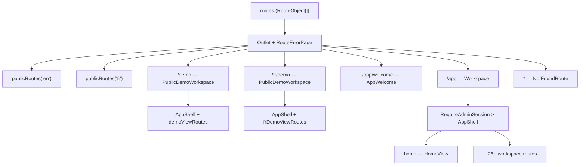
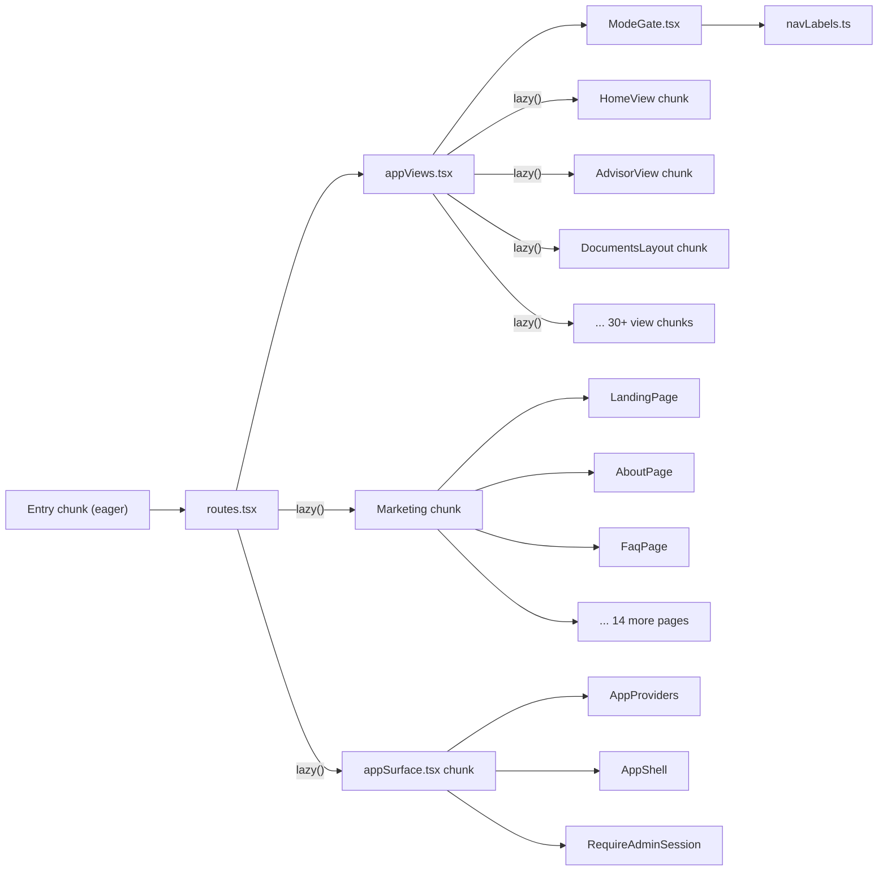
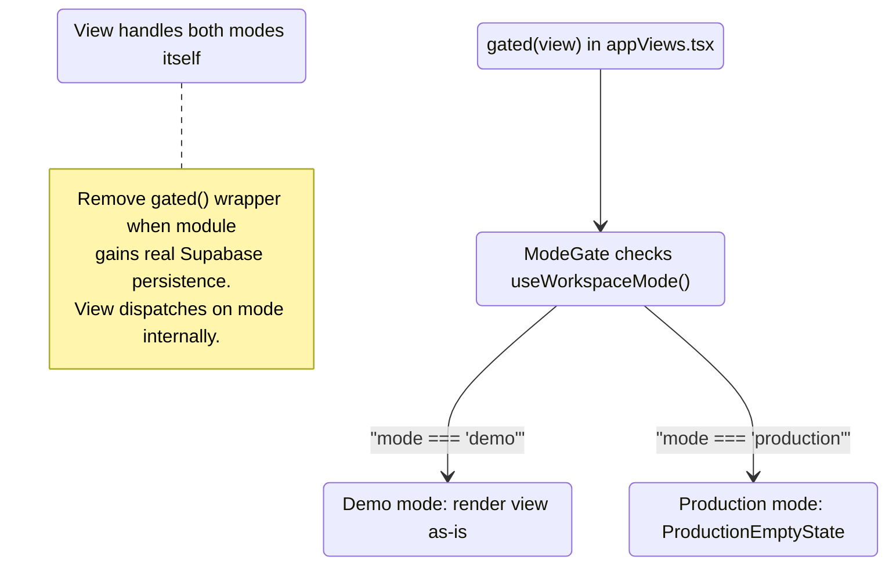
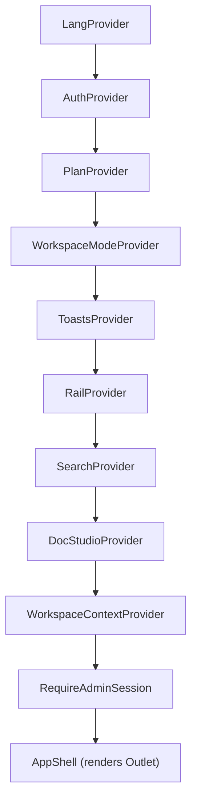
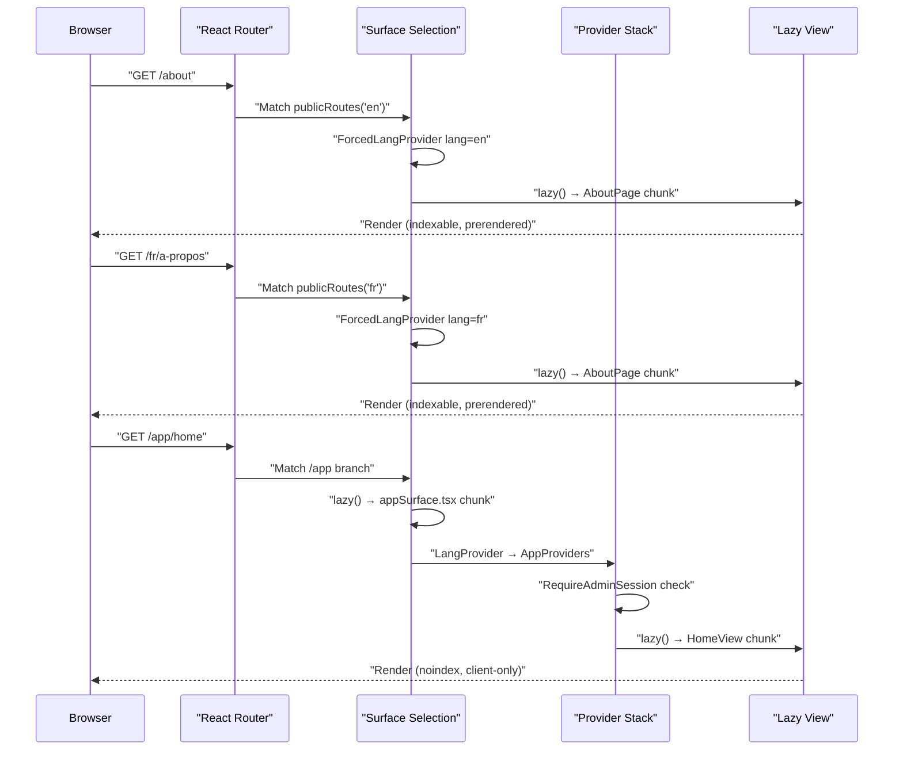

# Routing & Code Splitting

<details>
<summary>Relevant source files</summary>

The following files were used as context for generating this wiki page:

- [src/app/appViews.tsx](src/app/appViews.tsx)
- [src/app/routes.tsx](src/app/routes.tsx)
- [src/features/app/documents/DoclibProvider.test.tsx](src/features/app/documents/DoclibProvider.test.tsx)
- [src/features/app/documents/DoclibProvider.tsx](src/features/app/documents/DoclibProvider.tsx)
- [src/features/app/documents/components/SignatureModal.tsx](src/features/app/documents/components/SignatureModal.tsx)
- [src/features/app/documents/components/SignaturePad.tsx](src/features/app/documents/components/SignaturePad.tsx)
- [src/features/app/documents/doclibContext.ts](src/features/app/documents/doclibContext.ts)
- [src/features/app/documents/screens/DocumentDetailScreen.tsx](src/features/app/documents/screens/DocumentDetailScreen.tsx)
- [src/features/app/documents/screens/SigningScreen.tsx](src/features/app/documents/screens/SigningScreen.tsx)
- [src/features/app/shell/EntryStage.tsx](src/features/app/shell/EntryStage.tsx)
- [src/features/marketing/pages/NotFoundPage.test.tsx](src/features/marketing/pages/NotFoundPage.test.tsx)
- [src/features/marketing/pages/NotFoundPage.tsx](src/features/marketing/pages/NotFoundPage.tsx)
- [src/features/marketing/sections/Footer.tsx](src/features/marketing/sections/Footer.tsx)
- [src/features/marketing/sections/Product.tsx](src/features/marketing/sections/Product.tsx)
- [src/seo/routes.ts](src/seo/routes.ts)
- [src/seo/seo.test.ts](src/seo/seo.test.ts)

</details>

The Dutiva application uses a **three-surface route architecture** that separates the public marketing website, the public read-only demo, and the authenticated app workspace. Each surface has its own language strategy, rendering model, SEO posture, and code-splitting boundary. The route system is built on React Router v6 with `RouteObject[]` arrays, and every view is lazily loaded via `React.lazy()`.

## Three-Surface Architecture Overview

**High-level route map:**



Sources: [src/app/routes.tsx:133-175](), [src/app/routes.tsx:50-63](), [src/app/routes.tsx:71-99]()

The three surfaces differ fundamentally:

| Aspect            | Marketing                              | Public demo                                              | App workspace                      |
| ----------------- | -------------------------------------- | -------------------------------------------------------- | ---------------------------------- |
| URL prefix        | `/` (EN), `/fr/…` (FR)                 | `/demo`, `/fr/demo`                                      | `/app/…`                           |
| Language strategy | URL-scoped (`ForcedLangProvider`)      | URL-scoped (`ForcedWorkspaceLangProvider`)               | Preference-scoped (`LangProvider`) |
| SEO               | Indexable, prerendered, canonical URLs | Demo index prerendered; subpaths `noindex` via app shell | `noindex`, client-rendered         |
| Auth              | None                                   | None (read-only)                                         | `RequireAdminSession` gate         |
| i18n catalogue    | Marketing messages only                | Full workspace catalogue                                 | Full workspace catalogue           |
| Code chunk        | Marketing lazy chunk                   | App lazy chunk (`appSurface.tsx`)                        | App lazy chunk (`appSurface.tsx`)  |

Sources: [src/app/routes.tsx:13-15](), [src/app/appSurface.tsx:6-12](), [src/i18n/ForcedLangProvider.tsx:22-57]()

## The Route Table: `src/app/routes.tsx`

The root route array is defined in `routes.tsx`. A pathless root wraps all routes in a single error boundary via `RouteErrorPage`:

```
routes = [{ element: <Outlet />, errorElement: <RouteErrorPage />, children: routeTree() }]
```

[src/app/routes.tsx:133-142]()

`routeTree()` returns these top-level branches:

1. **`publicRoutes('en')`** — English marketing pages
2. **`publicRoutes('fr')`** — French marketing pages with localized slugs
3. **`/app/welcome`**, **`/app/auth/confirm`** — Auth entry points (outside the gated shell)
4. **`/sign/:token`**, **`/fr/sign/:token`** — External signing (no login)
5. **`/demo`**, **`/fr/demo`** — Public read-only demo workspace
6. **`/app`** — Authenticated workspace shell with nested view routes
7. **`*`** — Catch-all 404

[src/app/routes.tsx:144-175]()

### Public Route Generation

The `publicRoutes(lang)` function builds a `RouteObject` for a given locale. Pathnames are derived from the `SEO_ROUTES` registry via `seoRoute(id).path[lang]`, making the registry the **single source of truth** for all public URLs:

```
const p = (id: SeoRouteId) => seoRoute(id).path[lang]
```

[src/app/routes.tsx:71-72]()

Each locale tree is wrapped in a `PublicShell` that provides `ForcedLangProvider` and a lazy `ConsentBanner`:

[src/app/routes.tsx:50-63]()

The 14 static `SeoRouteId` values are: `home`, `about`, `faq`, `blog`, `pricing`, `templates`, `guides`, `templateUsage`, `knownLimitations`, `legal`, `help`, `contact`, `status`, `jurisdictionTool`.

[src/seo/routes.ts:29-43]()

Dynamic sub-routes use `:slug` params for blog articles (`/blog/:slug`), guide articles (`/guides/:slug`), legal policies (`/legal/:slug`), and help articles (`/help/:slug`).

[src/app/routes.tsx:81-94]()

### App Surface Entry Points

The `/app` branch is split into three lazy entry points, all loaded from `appSurface.tsx`:

| Route               | Export           | Purpose                                               |
| ------------------- | ---------------- | ----------------------------------------------------- |
| `/app/welcome`      | `AppWelcome`     | Sign-in gate (EntryStage)                             |
| `/app/auth/confirm` | `AppAuthConfirm` | Magic-link token verification                         |
| `/app`              | `Workspace`      | Main workspace shell (gated by `RequireAdminSession`) |

[src/app/routes.tsx:148-172](), [src/app/appSurface.tsx:31-68]()

The `Workspace` export wraps `AppShell` inside `RequireAdminSession`, which bounces unauthorized visitors to `/app/welcome`. Without Supabase configured (local dev), it's a no-op. On Vercel preview deployments, the gate is also skipped.

[src/features/app/auth/RequireAdminSession.tsx:33-53]()

## Code Splitting Strategy

**Diagram: lazy boundary architecture mapping code entities to chunk boundaries:**



Sources: [src/app/routes.tsx:16-44](), [src/app/appViews.tsx:26-69]()

### React.lazy() Pattern

Every view uses a consistent named-export `React.lazy()` pattern. Because the codebase uses named exports (not default exports), each `lazy()` call re-maps the import:

```typescript
const HomeView = lazy(() =>
  import('@/features/app/views/home/HomeView').then((m) => ({ default: m.HomeView })),
)
```

[src/app/appViews.tsx:26]()

This pattern is applied to all 50+ lazy components across both `routes.tsx` (marketing pages) and `appViews.tsx` (workspace views). `Suspense` boundaries use `fallback={null}` — each surface paints its own background via CSS surface classes, so there is nothing to flash.

[src/app/routes.tsx:14-15]()

### Entry Graph Budget Enforcement

The `check-entry-graph.mjs` CI script enforces that the eager entry graph (what marketing visitors download before anything is interactive) stays within strict budgets:

| Budget         | Ceiling | Purpose                        |
| -------------- | ------- | ------------------------------ |
| `MAX_PRELOADS` | 9       | Maximum modulepreload links    |
| `MAX_EAGER_KB` | 580     | Maximum raw kB of eager chunks |

[scripts/check-entry-graph.mjs:48-49]()

The script reads source maps from the built output and checks membership against several barred lists:

- **`BARRED_PACKAGES`**: `react-markdown` tree, `@supabase`, `recharts`/`d3-*` — none may appear in the eager graph
- **`ALLOWED_APP_MODULES`**: Only 4 workspace modules are permitted in the eager graph: `navLabels.ts`, `ModeGate.tsx`, `ProductionEmptyState.tsx`, `workspaceModeContext.ts`
- **`src/data/`**: Demo fixture data must never leak into marketing chunks
- **`PROSE_MODULES`**: Article body content (blog, guide, help) must stay lazy

[scripts/check-entry-graph.mjs:57-103]()

This guard exists because `appViews.tsx`'s route objects are built at module scope — whatever they reference directly is eager by construction. A previous incident pulled 113kB of demo fixtures into the eager graph when `ModeGate` imported `navConfig` (which value-imports `@/data`). The fix was to extract `navLabels.ts` as a pure module with no fixture dependencies.

[src/features/app/shell/navLabels.ts:9-17](), [scripts/check-entry-graph.mjs:10-13]()

### Vite Chunk Splitting Configuration

The `vite.config.ts` configures `codeSplitting.groups` to control chunk boundaries:

| Group Name           | Contents                                                             | Purpose                                  |
| -------------------- | -------------------------------------------------------------------- | ---------------------------------------- |
| `messages-marketing` | Marketing + shared i18n modules                                      | Eager — needed by every public page      |
| `messages-workspace` | All other i18n modules (29 feature modules)                          | Lazy — only `/app` surface needs them    |
| `vendor`             | Third-party deps excluding `@supabase`, markdown tree, recharts tree | Shared vendor chunk with long cache life |

The `messages-workspace` group uses `includeDependenciesRecursively: false` to prevent `shell.ts` and `workspaceMode.ts` from being dragged into the workspace message chunk (they belong in the eager graph as dependencies of `ModeGate`).

[vite.config.ts:171-252]()

## Workspace Route Table: `appViewRoutes`

The `appViewRoutes` array in `appViews.tsx` defines all child routes rendered inside the `AppShell` outlet. The `/app` index redirects to `/app/home`:

[src/app/routes.tsx:171]()

### Complete Workspace Route Table

| Path                             | Component              | Gated? | Notes                                                    |
| -------------------------------- | ---------------------- | ------ | -------------------------------------------------------- |
| `home`                           | `HomeView`             | No     | Own production variant                                   |
| `advisor`                        | `AdvisorView`          | No     | Own production variant                                   |
| `workflows`                      | `WorkflowsView`        | No     | Handles both modes itself                                |
| `workflows/:slug`                | `FlowRunner`           | No     |                                                          |
| `cases`                          | `CasesView`            | No     | Real persistence in production                           |
| `cases/:caseId`                  | `CaseDetailView`       | No     |                                                          |
| `employees`                      | `EmployeesView`        | No     | Real persistence in production                           |
| `employees/:employeeId`          | `EmployeeProfileView`  | No     |                                                          |
| `compliance`                     | `ComplianceView`       | No     | Real persistence in production                           |
| `policies`                       | `PoliciesView`         | No     | Real persistence in production                           |
| `analytics`                      | `AnalyticsView`        | No     | Live aggregation in production                           |
| `knowledge`                      | `KnowledgeView`        | No     | Real content (legal reference)                           |
| `knowledge/:slug`                | `GuideView`            | No     | Reference guides                                         |
| `communications`                 | `CommunicationsView`   | No     | Handles both modes (migration 0040)                      |
| `compensation`                   | `CompensationView`     | No     | Handles both modes (migration 0039)                      |
| `wellbeing`                      | `WellbeingView`        | No     | Handles both modes (migration 0041)                      |
| `comms`                          | `CommsView`            | No     | Multi-screen layout (8 screens, localStorage)            |
| `finance`                        | `FinanceView`          | No     | Multi-screen layout (10 screens, migration 0119 pending) |
| `hiring`                         | `HiringView`           | No     | Evidence-based recruitment (migration 0118)              |
| `hiring/candidates/:candidateId` | `CandidateDetailView`  | No     |                                                          |
| `hiring/postings/:postingId`     | `JobPostingDetailView` | No     |                                                          |
| `support`                        | `SupportView`          | No     | Real feature                                             |
| `support/requests`               | `SupportRequestsList`  | No     |                                                          |
| `support/requests/:ticketId`     | `SupportTicketDetail`  | No     |                                                          |
| `support/admin`                  | `SupportAdminView`     | No     | Admin-gated in view                                      |
| `support/admin/exports`          | `ExportAuditView`      | No     | Admin-gated in view                                      |
| `support/admin/:ticketId`        | `SupportAdminTicket`   | No     |                                                          |
| `planning`                       | `PlanningLayout`       | No     | Nested layout (see below)                                |
| `settings`                       | `SettingsLayout`       | No     | Nested layout (see below)                                |
| `documents`                      | `DocumentsLayout`      | No     | Nested layout (see below)                                |

[src/app/appViews.tsx:71-237]()

## `gated()` Wrapper and `ModeGate`

The `gated()` function wraps a fixture-driven view in `ModeGate`:

```typescript
function gated(view: ReactNode) {
  return <ModeGate>{view}</ModeGate>
}
```

[src/app/appViews.tsx:23-25]()

`ModeGate` reads the current workspace mode from `useWorkspaceMode()`. In **demo** mode, it renders the child view unchanged. In **production** mode, it renders `ProductionEmptyState` — a shared placeholder that shows the module name and links to Settings where the toggle lives.

[src/features/app/workspaceMode/ModeGate.tsx:20-29]()

The module title is resolved via `moduleLabelFor(pathname)`, which maps the first `/app/<segment>` to a `Bi` label from `VIEW_LABELS`:

[src/features/app/shell/navLabels.ts:59-64]()

`ProductionEmptyState` displays an empty-state card explaining "Why is this empty?" and links to `/app/settings`:

[src/features/app/workspaceMode/ProductionEmptyState.tsx:13-47]()

### Gating Lifecycle

**Diagram: how a view transitions from gated to ungated:**



Currently gated views (wrapped in `gated()`) are limited to nested children of `DocumentsLayout` and `SettingsLayout`:

- `RepositoryScreen` (documents index)
- `TemplatesView` (HR library tab)
- `SigningScreen`
- `DocumentDetailScreen`
- `MemoryLayout` (under settings/memory)

[src/app/appViews.tsx:156-164](), [src/app/appViews.tsx:142-149]()

Views that were previously gated but now handle both modes themselves include `CommunicationsView`, `CompensationView`, and `WellbeingView` (ungated via migrations 0039–0041).

[src/app/appViews.tsx:111-118]()

Sources: [src/app/appViews.tsx:9-22](), [src/features/app/workspaceMode/ModeGate.tsx:1-29]()

## Nested Layouts

Five workspace routes use nested layout components that provide a tab strip and render child routes via `<Outlet />`.

### `PlanningLayout`

Wraps `/app/planning` with a Tasks / Calendar tab strip. The index route redirects to `/app/planning/tasks`.

| Sub-route  | Component      |
| ---------- | -------------- |
| `tasks`    | `TasksView`    |
| `calendar` | `CalendarView` |

[src/features/app/views/planning/PlanningLayout.tsx:1-51](), [src/app/appViews.tsx:125-133]()

### `SettingsLayout`

Wraps `/app/settings` with General / Memory tabs. The memory sub-tree is gated (demo-only) and uses its own nested `MemoryLayout`:

| Sub-route                        | Component              |
| -------------------------------- | ---------------------- |
| (index)                          | `SettingsView`         |
| `memory`                         | `MemoryLayout` (gated) |
| `memory/people/:personId`        | `PersonMemoryView`     |
| `memory/cases/:caseId`           | `CaseMemoryView`       |
| `memory/conversations/:threadId` | `ChatRecallView`       |

[src/features/app/views/settings/SettingsLayout.tsx:1-52](), [src/app/appViews.tsx:134-151]()

### `DocumentsLayout`

Wraps `/app/documents` with three tabs: HR Library, Document Library, Document Studio. Also mounts `DoclibProvider` and a "Viewing as" role selector bar.

| Sub-route              | Component              | Gated? |
| ---------------------- | ---------------------- | ------ |
| (index)                | `RepositoryScreen`     | Yes    |
| `hr-library`           | `TemplatesView`        | Yes    |
| `studio`               | `StudioScreen`         | No     |
| `templates/:tid`       | `TemplateDetailScreen` | No     |
| `generate/:templateId` | `GenerateScreen`       | No     |
| `sign/:envelopeId`     | `SigningScreen`        | Yes    |
| `:docId`               | `DocumentDetailScreen` | Yes    |

[src/features/app/documents/DocumentsLayout.tsx:86-102](), [src/app/appViews.tsx:152-165]()

The `DocumentsLayout` wraps all children in `DoclibProvider`, which loads the document catalogue data and exposes signature operations (`sendForSignature`, `applySignature`):

[src/features/app/documents/DocumentsLayout.tsx:88-100]()

### `CommsLayout`

Wraps `/app/comms` with an eight-screen tab strip for the Communications Platform. The index route redirects to `/app/comms/overview`. Each screen is lazy-loaded and consumes `useCommsData()`.

| Sub-route       | Component              |
| --------------- | ---------------------- |
| `overview`      | `CommsOverview`        |
| `initiatives`   | `CommsInitiatives`     |
| `content`       | `CommsContentCalendar` |
| `relationships` | `CommsRelationships`   |
| `engagement`    | `CommsEngagement`      |
| `intelligence`  | `CommsIntelligence`    |
| `results`       | `CommsResults`         |
| `settings`      | `CommsSettings`        |

[src/features/app/views/comms/CommsLayout.tsx:1-60](), [src/app/appViews.tsx:153-167]()

### `FinanceLayout`

Wraps `/app/finance` with a ten-screen tab strip for the Finance workspace. The index route redirects to `/app/finance/overview`. Each screen is lazy-loaded and consumes `useFinanceData()`. Payroll screen is admin-restricted in production mode.

| Sub-route      | Component             |
| -------------- | --------------------- |
| `overview`     | `FinanceOverview`     |
| `transactions` | `FinanceTransactions` |
| `sales`        | `FinanceSales`        |
| `purchases`    | `FinancePurchases`    |
| `payroll`      | `FinancePayroll`      |
| `accounting`   | `FinanceAccounting`   |
| `plans`        | `FinancePlans`        |
| `treasury`     | `FinanceTreasury`     |
| `tax`          | `FinanceTax`          |
| `evidence`     | `FinanceEvidence`     |

[src/features/app/views/finance/FinanceView.tsx](), [src/app/appViews.tsx:168-184]()

## Legacy Path Redirects

Several `Navigate` elements handle renamed or restructured routes:

| Legacy Path      | Redirect Target             | Reason                               |
| ---------------- | --------------------------- | ------------------------------------ |
| `/app/templates` | `/app/documents/hr-library` | Templates moved into DocumentsLayout |
| `/app/reports`   | `/app/analytics`            | Renamed to analytics                 |
| `/app/tasks`     | `/app/planning/tasks`       | Moved under PlanningLayout           |
| `/app/calendar`  | `/app/planning/calendar`    | Moved under PlanningLayout           |
| `/app/memory`    | `/app/settings/memory`      | Moved under SettingsLayout           |

All redirects use `replace` to avoid polluting browser history.

[src/app/appViews.tsx:92-123]()

## SEO Route Registry (`src/seo/routes.ts`)

The `SEO_ROUTES` array is the single source of truth for every public URL. Each entry carries:

- `id` — typed `SeoRouteId` union
- `path` — `Record<Lang, string>` with EN/FR pathnames
- `title` / `description` — bilingual `Bi` values
- `indexable` — controls `noindex` meta and sitemap inclusion

[src/seo/routes.ts:45-53]()

The English locale uses unprefixed paths (`/about`), while French uses `/fr` with localized slugs (`/fr/a-propos`). Cross-locale links are resolved by `alternatePathFor()`, which iterates `allPublicPages()` to find the matching pair.

[src/seo/routes.ts:376-382]()

Beyond the 14 static routes, the registry also generates pages for 26 legal policy documents, help centre articles, and editorial articles (blog + guides) via `allPublicPages()`:

[src/seo/routes.ts:319-369]()

## App Surface Provider Stack

When a visitor enters `/app`, the `Workspace` export in `appSurface.tsx` wraps `AppShell` in a provider hierarchy:



[src/app/appSurface.tsx:56-68](), [src/features/app/AppProviders.tsx:25-43]()

Key ordering constraints:

- `AuthProvider` must be outermost (other providers read session)
- `PlanProvider` reads the signed-in account's plan from `profiles`
- `WorkspaceModeProvider` reads the session to resolve demo/production toggle
- `DocStudioProvider` must be inside `ToastsProvider` (fires toasts)

[src/features/app/AppProviders.tsx:12-24]()

## 404 Handling

The catch-all `*` route renders `NotFoundRoute`, which detects the language from the URL prefix via `langOfPath()` and wraps `NotFoundPage` in `ForcedLangProvider`:

[src/app/routes.tsx:105-114]()

The static host also serves `dist/404.html` (generated by the prerender pipeline) with a 404 status for unknown URLs — the client-side route covers navigations to broken links within the SPA.

[src/app/routes.tsx:102-104]()

## Error Boundary

`RouteErrorPage` is wired as the root `errorElement`. It renders above all providers and is self-contained — no context, no lazy chunks, no client-side navigation. Language is derived from the URL prefix. It reports errors via `reportRouteError()` and offers a "clear offline cache" escape hatch for stale service worker scenarios.

[src/app/RouteErrorPage.tsx:39-52](), [src/app/routes.tsx:139]()

## Summary: Request Flow



Sources: [src/app/routes.tsx:133-175](), [src/app/appSurface.tsx:56-68](), [src/app/appViews.tsx:71-166]()

---
