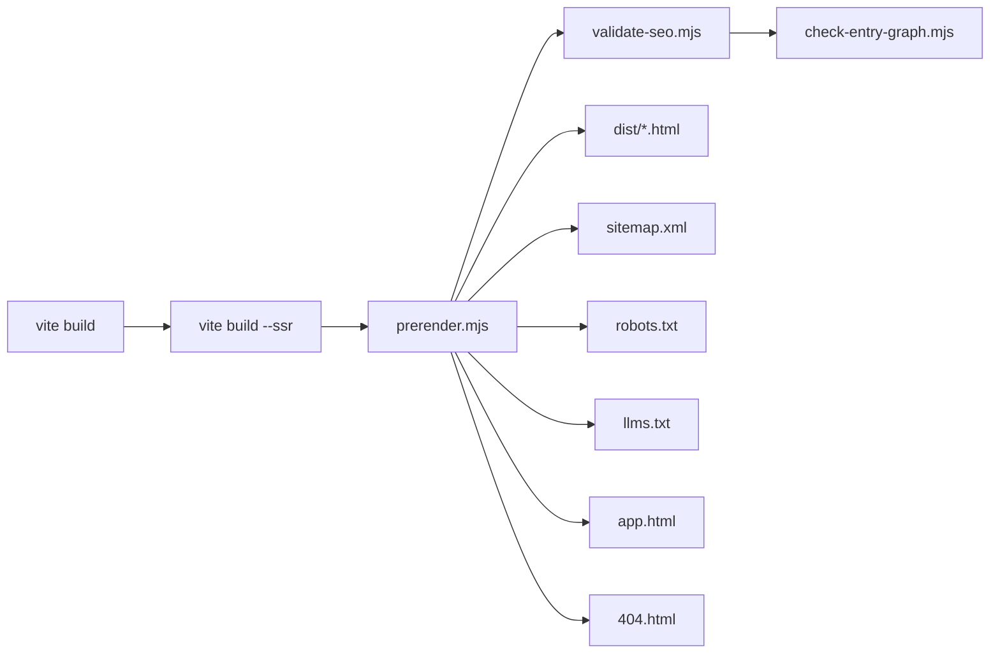
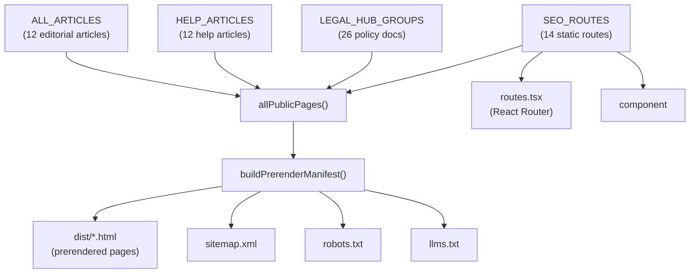
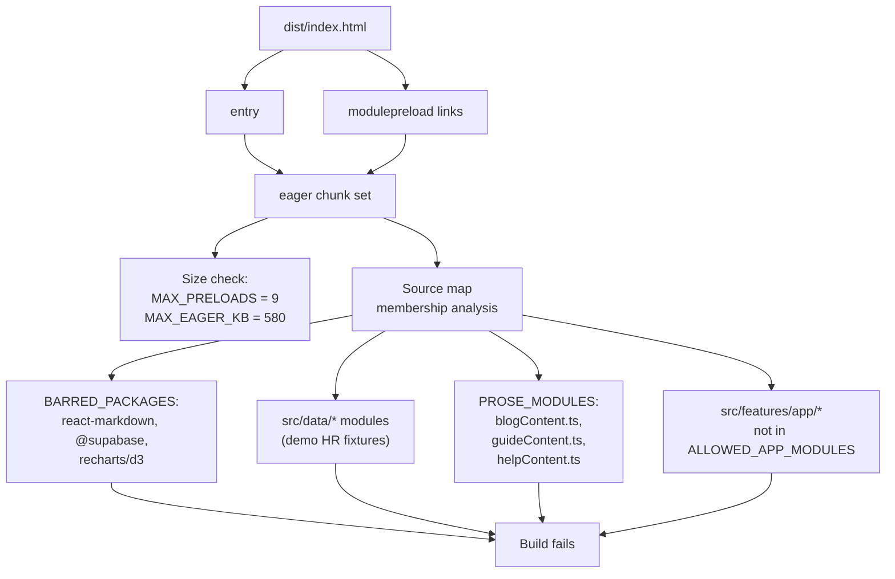
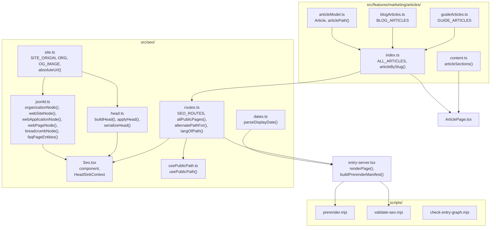

# SEO, Prerendering & Content Marketing

<details>
<summary>Relevant source files</summary>

The following files were used as context for generating this wiki page:

- [docs/SEO_GEO_IMPLEMENTATION.md](docs/SEO_GEO_IMPLEMENTATION.md)
- [docs/SEO_ROUTE_MATRIX.md](docs/SEO_ROUTE_MATRIX.md)
- [scripts/check-entry-graph.mjs](scripts/check-entry-graph.mjs)
- [scripts/prerender.mjs](scripts/prerender.mjs)
- [scripts/validate-seo.mjs](scripts/validate-seo.mjs)
- [src/app/routes.tsx](src/app/routes.tsx)
- [src/features/marketing/articles/articleModel.ts](src/features/marketing/articles/articleModel.ts)
- [src/features/marketing/articles/articles.test.ts](src/features/marketing/articles/articles.test.ts)
- [src/features/marketing/articles/blogArticles.ts](src/features/marketing/articles/blogArticles.ts)
- [src/features/marketing/articles/blogContent.ts](src/features/marketing/articles/blogContent.ts)
- [src/features/marketing/articles/content.ts](src/features/marketing/articles/content.ts)
- [src/features/marketing/articles/guideArticles.ts](src/features/marketing/articles/guideArticles.ts)
- [src/features/marketing/articles/guideContent.ts](src/features/marketing/articles/guideContent.ts)
- [src/features/marketing/pages/ArticlePage.test.tsx](src/features/marketing/pages/ArticlePage.test.tsx)
- [src/features/marketing/pages/ArticlePage.tsx](src/features/marketing/pages/ArticlePage.tsx)
- [src/features/marketing/pages/BlogIndexPage.test.tsx](src/features/marketing/pages/BlogIndexPage.test.tsx)
- [src/features/marketing/pages/BlogIndexPage.tsx](src/features/marketing/pages/BlogIndexPage.tsx)
- [src/features/marketing/pages/GuidesIndexPage.test.tsx](src/features/marketing/pages/GuidesIndexPage.test.tsx)
- [src/features/marketing/pages/GuidesIndexPage.tsx](src/features/marketing/pages/GuidesIndexPage.tsx)
- [src/features/marketing/pages/MarketingPage.tsx](src/features/marketing/pages/MarketingPage.tsx)
- [src/features/marketing/sections/Footer.tsx](src/features/marketing/sections/Footer.tsx)
- [src/i18n/messages/blog.ts](src/i18n/messages/blog.ts)
- [src/i18n/messages/guidesIndex.ts](src/i18n/messages/guidesIndex.ts)
- [src/seo/routes.ts](src/seo/routes.ts)
- [src/seo/seo.test.ts](src/seo/seo.test.ts)

</details>

This page covers the full SEO pipeline — from the route registry that declares every public URL, through the head-management layer that builds per-page metadata, the prerendering script that writes static HTML + sitemap + robots.txt + llms.txt, the post-build validator that fails the build on any violation, and the content marketing article system. It also details the entry-graph budget enforcer that keeps workspace code off the marketing critical path.

## Architecture Overview

The site is a Vite + React SPA whose **public pages are prerendered to static HTML at build time**. The authenticated workspace (`/app…`) stays fully client-rendered and is served from a noindex shell (`app.html`). The build pipeline runs four sequential post-build stages after `vite build`:

1. `vite build --ssr` — produces a Node render bundle (`dist-ssr/entry-server.js`)
2. `scripts/prerender.mjs` — renders every public URL to static HTML + generates sitemap/robots/llms.txt
3. `scripts/validate-seo.mjs` — crawls `dist/` and fails the build on any SEO violation
4. `scripts/check-entry-graph.mjs` — enforces the eager bundle size budget

Sources: [package.json:8-8](), [docs/SEO_GEO_IMPLEMENTATION.md:10-33]()

**SEO build pipeline**



Sources: [package.json:8-8](), [scripts/prerender.mjs:1-18]()

## Route Registry (`src/seo/routes.ts`)

The `SEO_ROUTES` array is the **single source of truth** for every public URL. The router, `<Seo>` tags, sitemap, robots.txt, and llms.txt are all derived from it. Adding a public page requires adding an entry here first.

### Static Routes (14)

The `SeoRouteId` union type defines 14 static route identifiers:

| Route ID           | EN Path                     | FR Path                               |
| ------------------ | --------------------------- | ------------------------------------- |
| `home`             | `/`                         | `/fr`                                 |
| `about`            | `/about`                    | `/fr/a-propos`                        |
| `faq`              | `/faq`                      | `/fr/faq`                             |
| `blog`             | `/blog`                     | `/fr/blogue`                          |
| `pricing`          | `/pricing`                  | `/fr/tarifs`                          |
| `templates`        | `/templates`                | `/fr/modeles`                         |
| `guides`           | `/guides`                   | `/fr/guides`                          |
| `templateUsage`    | `/guides/template-usage`    | `/fr/guides/utilisation-des-modeles`  |
| `knownLimitations` | `/known-limitations`        | `/fr/limites-connues`                 |
| `legal`            | `/legal`                    | `/fr/juridique`                       |
| `help`             | `/help`                     | `/fr/aide`                            |
| `contact`          | `/contact`                  | `/fr/contact`                         |
| `status`           | `/status`                   | `/fr/etat`                            |
| `jurisdictionTool` | `/tools/jurisdiction-check` | `/fr/outils/verification-juridiction` |

Each `SeoRoute` carries bilingual `path`, `title`, `description`, and an `indexable` boolean.

Sources: [src/seo/routes.ts:29-227]()

### Dynamic Page Collections

Beyond the 14 static routes, the registry dynamically incorporates three content collections into `allPublicPages()`:

| Collection             | Count                  | Source data                               | Key prefix                           |
| ---------------------- | ---------------------- | ----------------------------------------- | ------------------------------------ |
| Legal policy documents | 26                     | `LEGAL_HUB_GROUPS` from `legalHubData.ts` | `legalDoc:<slug>`                    |
| Help Centre articles   | 12                     | `HELP_ARTICLES` from `helpCenterData.ts`  | `helpDoc:<slug>`                     |
| Editorial articles     | 12 (6 guides + 6 blog) | `ALL_ARTICLES` from `articles/index.ts`   | `guideDoc:<slug>` / `blogDoc:<slug>` |

The `allPublicPages()` function merges all four sources into a single `PublicPage[]` array that drives prerendering and the sitemap. Total indexable page count: **63 pages × 2 locales = 126 URLs**.

Sources: [src/seo/routes.ts:319-369](), [src/seo/seo.test.ts:29-35](), [docs/SEO_ROUTE_MATRIX.md:14-21]()

### Bilingual URL Model

- English pages use unprefixed URLs (`/about`)
- French pages live under `/fr` with localized slugs (`/fr/a-propos`)
- The URL determines the page language via `ForcedLangProvider` — cookies/localStorage never alter what a crawler sees
- `langOfPath()` determines locale: `/fr…` → `fr`, everything else → `en`
- `alternatePathFor()` resolves the same page's pathname in the other locale

Sources: [src/seo/routes.ts:376-387](), [docs/SEO_GEO_IMPLEMENTATION.md:59-77]()

**Route registry to build artifact data flow**



Sources: [src/seo/routes.ts:319-369](), [src/entry-server.tsx:88-106](), [scripts/prerender.mjs:77-194]()

## Seo Component & Head Management

### `Seo.tsx` — The Head Declaration Component

Each page renders exactly one `<Seo>` component to declare its metadata. It operates in two modes:

1. **Client-side (browser)**: calls `applyHead()` in a `useEffect` to update `document.head` after each route transition
2. **Prerender (SSR)**: writes to a `HeadSink` context collected by `entry-server.tsx`, then serialized into static HTML

The component accepts either a `route` prop (referencing a `SeoRouteId` from the registry) or a `page` prop (for dynamic pages like policy documents). Optional props enrich the structured data: `pageType`, `datePublished`, `dateModified`, `breadcrumb`, `faq`, and `extraNodes`.

For indexable pages, `Seo` assembles a JSON-LD `@graph` containing `organizationNode`, `webSiteNode`, and `webPageNode`, plus optional `breadcrumbNode` and `faqPageEntities`.

Sources: [src/seo/Seo.tsx:62-112]()

### `head.ts` — Framework-Independent Head Model

The `HeadData` interface represents a complete set of managed head elements. Three key functions operate on it:

| Function              | Purpose                                                                                                                                                                                                  |
| --------------------- | -------------------------------------------------------------------------------------------------------------------------------------------------------------------------------------------------------- |
| `buildHead(input)`    | Assembles `HeadData` from page metadata: title, meta description, robots directive, canonical, hreflang alternates (en-CA, fr-CA, x-default), Open Graph tags, Twitter card tags, and serialized JSON-LD |
| `applyHead(head)`     | Client-side: removes all `[data-seo]`-marked elements from `document.head` and appends the new set — deterministic replace-all semantics, no duplicates                                                  |
| `serializeHead(head)` | Server-side: produces an HTML string for injection into the static `<head>`                                                                                                                              |

All managed elements carry a `data-seo` attribute marker. Noindex pages receive only title + description + robots — no canonical, hreflang, social tags, or JSON-LD, because those would invite indexing signals that contradict the robots directive.

Sources: [src/seo/head.ts:42-172]()

### `site.ts` — Canonical Identity

`SITE_ORIGIN` centralizes the production origin (`https://dutiva.ca`), overridable via `VITE_SITE_ORIGIN`. The `ORG` constant holds verified organization facts (legal name, brand name, support email, logo path). `absoluteUrl()` joins a pathname with the origin.

Sources: [src/seo/site.ts:1-61]()

### `dates.ts` — Content Date Parsing

`parseDisplayDate()` converts human-readable policy dates ("June 1, 2026" / "1er juin 2026") to ISO 8601 for JSON-LD `datePublished`/`dateModified` and sitemap `lastmod`. Returns `undefined` for unparseable input — metadata omits the date rather than guessing.

Sources: [src/seo/dates.ts:1-44]()

## JSON-LD Structured Data

The `jsonld.ts` module provides schema.org builders with stable `@id`s anchored on the canonical origin. Every indexable page emits a single `<script type="application/ld+json">` block containing a `@graph` array.

### Entity Types

| Builder Function                    | Schema Type                                            | `@id`                 | Used On                             |
| ----------------------------------- | ------------------------------------------------------ | --------------------- | ----------------------------------- |
| `organizationNode(lang)`            | `Organization`                                         | `…/#organization`     | Every indexable page                |
| `webSiteNode(lang)`                 | `WebSite`                                              | `…/#website`          | Every indexable page                |
| `webApplicationNode(lang, offers?)` | `SoftwareApplication` + `WebApplication`               | `…/#software`         | Landing, Pricing                    |
| `webPageNode(input)`                | `WebPage` / `AboutPage` / `CollectionPage` / `FAQPage` | `…/<path>#webpage`    | Every indexable page                |
| `breadcrumbNode(path, items)`       | `BreadcrumbList`                                       | `…/<path>#breadcrumb` | Articles, legal docs, help articles |
| `faqPageEntities(entries)`          | `Question[]` (mainEntity)                              | —                     | FAQ page                            |

Rules: only verified, visible facts. No ratings, reviews, awards, addresses, founding dates, or social profiles.

Sources: [src/seo/jsonld.ts:1-164]()

### Graph Composition in `Seo.tsx`

For each indexable page, the JSON-LD graph is composed as follows:

```
[organizationNode, webSiteNode, webPageNode, breadcrumbNode?, ...extraNodes?]
```

The FAQ page switches `webPageNode` to type `FAQPage` and attaches `mainEntity` from `faqPageEntities()` — built from the exact `GROUPS` rendered on the page, so the markup can never diverge from the structured data.

Sources: [src/seo/Seo.tsx:73-89](), [src/features/marketing/pages/FaqPage.tsx:44-53]()

## Prerendering Pipeline (`scripts/prerender.mjs`)

The prerenderer runs after both the client and SSR builds. It imports `entry-server.js` and produces six categories of output:

### 1. Public Pages

For each entry in the manifest (from `buildPrerenderManifest()`), `renderPage(pathname)` invokes React DOM's `prerender()` with `StaticRouterProvider`. The `HeadSinkContext` collects metadata instead of touching a DOM. The result is composed into a full HTML document via `composeDocument()`, which:

- Sets `<html lang>` to the page's locale (`en-CA` / `fr-CA`)
- Replaces the template's generic `<title>` and `<meta description>`
- Injects page-specific head HTML (serialized from `HeadData`)
- Injects optional verification tags (`GOOGLE_SITE_VERIFICATION`, `BING_SITE_VERIFICATION`)
- Fills `<div id="root">` with the rendered body

Sources: [scripts/prerender.mjs:77-97](), [src/entry-server.tsx:37-55]()

### 2. App Shell (`app.html`)

An empty-body, noindex shell for `/app/*` routes. Vercel rewrites workspace paths to this file. No canonical or hreflang tags.

Sources: [scripts/prerender.mjs:99-110]()

### 3. 404 Page

Rendered by navigating to `/__not-found__`, which hits the router's catch-all `NotFoundPage`. Served with a real 404 status by static hosting. Carries `noindex`.

Sources: [scripts/prerender.mjs:116-122]()

### 4. `sitemap.xml`

Generated from the indexable subset of the manifest. Each `<url>` entry includes:

- `<loc>` with the absolute URL
- `<lastmod>` when the content has a real date (policy documents, editorial articles — never the build date)
- Three `<xhtml:link>` alternates: `hreflang="en-CA"`, `hreflang="fr-CA"`, `hreflang="x-default"` (→ EN)

Element order follows the sitemaps.org 0.9 schema sequence: `loc`, `lastmod`, then xhtml extensions.

Sources: [scripts/prerender.mjs:128-154]()

### 5. `robots.txt`

Generated with a deliberate crawler policy:

| Category           | Bots                                                           | Policy                                                           |
| ------------------ | -------------------------------------------------------------- | ---------------------------------------------------------------- |
| General            | `*`                                                            | Allow public, disallow `/app`, `/app/`, `/app.html`, `/404.html` |
| AI search crawlers | `OAI-SearchBot`, `Claude-SearchBot`, `PerplexityBot`           | Same as general (welcome, with private-path exclusions)          |
| Training crawlers  | `GPTBot`, `ClaudeBot`, `CCBot`, `Amazonbot`, `Google-Extended` | Opted in (decided 2026-08-06), same private-path exclusions      |

Each named bot group repeats the private-path exclusions because a bot-specific group replaces the `*` group entirely.

Sources: [scripts/prerender.mjs:160-194]()

### 6. `llms.txt`

A markdown-formatted file for LLM consumption, structured into sections (Product, Resources, Legal & trust, Contact, Version française). Links point only to indexable public pages on the canonical origin. Includes the organization description and an explicit statement that the authenticated application is private.

Sources: [scripts/prerender.mjs:199-257]()

### `entry-server.tsx` — SSR Entry Point

The server entry exports `renderPage()` and `buildPrerenderManifest()`. The manifest iterates `allPublicPages()` × 2 locales, producing `ManifestEntry` records with computed `lastmod` values:

- Policy documents: parsed from the displayed "Last updated" date via `parseDisplayDate()`
- Editorial articles: from the `updated` field on the `Article` record
- All other pages: no `lastmod` (a date that moves on every build teaches crawlers to ignore it)

Sources: [src/entry-server.tsx:88-128]()

### Client Hydration

`src/main.tsx` detects whether the root element has children. Prerendered pages hydrate via `hydrateRoot()`; the empty app shell creates a fresh root via `createRoot()`. Suspense boundaries keep server HTML visible until lazy chunks arrive.

Sources: [src/main.tsx:36-39]()

## SEO Validation (`scripts/validate-seo.mjs`)

The post-build validator crawls the built `dist/` output (not React state) and **fails the build** on any violation. It compares `dist/` against the route registry re-derived from the SSR bundle.

### Per-Page Checks

| Check         | Description                                                                                                 |
| ------------- | ----------------------------------------------------------------------------------------------------------- |
| Title         | Unique, non-empty, no placeholders (`undefined`, `[object Object]`, `TODO`, `Lorem ipsum`)                  |
| Description   | Non-empty (≥ 40 chars), no placeholders                                                                     |
| Robots        | Exactly one `<meta name="robots">` per page                                                                 |
| `<html lang>` | `en-CA` for EN pages, `fr-CA` for FR pages                                                                  |
| Canonical     | Exactly one, self-referencing, unique across all pages                                                      |
| Hreflang      | `en-CA`, `fr-CA`, and `x-default` present; self-hreflang matches self; `x-default` equals `en-CA`           |
| Open Graph    | Exactly one each of `og:title`, `og:description`, `og:url`, `og:image`, `og:locale`; `og:image` file exists |
| JSON-LD       | Exactly one block per page; parses as valid JSON; no placeholders; all URLs on canonical origin             |
| Structure     | Exactly one `<h1>`; a `<main>` landmark; ≥ 500 chars of visible text                                        |

Sources: [scripts/validate-seo.mjs:83-190]()

### Cross-Page Checks

| Check                       | Description                                                                                                             |
| --------------------------- | ----------------------------------------------------------------------------------------------------------------------- |
| Hreflang reciprocity        | Every `hreflang` alternate points to a page that points back                                                            |
| Cross-locale canonical      | EN and FR pages never canonicalize to each other                                                                        |
| Coverage (registry → dist/) | Every registry page was prerendered                                                                                     |
| Coverage (dist/ → registry) | No extra prerendered pages exist outside the registry                                                                   |
| Sitemap ↔ file ↔ canonical  | Every sitemap URL has a prerendered file; every indexable page is in the sitemap; no private or noindex URLs in sitemap |
| Sitemap `lastmod` order     | `<lastmod>` precedes `<xhtml:link>` in each `<url>`                                                                     |
| Internal links              | Every `href="/<path>"` in page bodies resolves to a known route or existing asset                                       |
| robots.txt                  | Sitemap reference present; all named bot groups present with `/app` exclusions                                          |
| llms.txt                    | No off-origin URLs; no private URLs; all linked pages exist                                                             |
| App shell                   | `app.html` is noindex, has no canonical                                                                                 |
| 404                         | `404.html` is noindex                                                                                                   |

Sources: [scripts/validate-seo.mjs:192-348]()

### Unit Tests (`seo.test.ts`)

The `seo.test.ts` test suite enforces additional invariants at the type/data level:

- Registry covers static routes + 26 legal docs + help articles + editorial articles
- Guides and blog collections are disjoint (titles and slugs)
- Every page has a distinct pathname per locale; FR under `/fr`; no trailing slashes; lowercase
- Canonical URLs never shared between pages or locales
- Unique, non-empty titles and descriptions in both languages
- Legal slugs unique in both slug spaces (52 unique across EN+FR)
- Locale alternates reciprocal for every public page
- `buildHead` output correctness (canonical, hreflang, og:locale, noindex behavior)
- JSON-LD builder correctness (stable @ids, verified facts only)

Sources: [src/seo/seo.test.ts:26-277]()

## Content Marketing: Articles

### Article Data Model

The `Article` interface in `articleModel.ts` defines the metadata for editorial pages:

| Field            | Type                | Purpose                              |
| ---------------- | ------------------- | ------------------------------------ |
| `slug`           | `string`            | English slug, also stable id         |
| `frSlug`         | `string`            | Localized French slug                |
| `collection`     | `'guide' \| 'blog'` | Which collection                     |
| `topic`          | `Bi`                | Short topic label                    |
| `readingMinutes` | `number`            | Approximate reading time             |
| `updated`        | `string`            | ISO date, feeds sitemap `lastmod`    |
| `title`          | `Bi`                | Page title                           |
| `summary`        | `Bi`                | Blurb for cards and meta description |

Sources: [src/features/marketing/articles/articleModel.ts:57-88]()

### Collection Split

The two collections are deliberately disjoint in topic and purpose:

| Collection | Path            | Purpose                                                                                                                | Articles |
| ---------- | --------------- | ---------------------------------------------------------------------------------------------------------------------- | -------- |
| `guide`    | `/guides/:slug` | Documents and decisions an employer _produces_ (contracts, probation, accommodation, termination)                      | 6        |
| `blog`     | `/blog/:slug`   | Regimes and obligations that _apply_ before anything is drafted (jurisdictions, policies, records, leaves, harassment) | 6        |

The rule: "Is this about a document they are writing, or about a rule they are under?" The SEO constraint is that both indexes once listed the same topics — giving each a URL under both prefixes ships duplicate competing pages. `seo.test.ts` fails the build if the collections converge.

Sources: [src/features/marketing/articles/articleModel.ts:14-37](), [src/seo/seo.test.ts:37-47]()

### Prose Body Split

Article prose is deliberately **not** a field on `Article`. The SEO registry reads every article for slugs and titles, and the router imports the registry — so anything on the `Article` interface enters the eager entry graph of every public page. Bodies live in separate files, accessed through `articleSections()` in `content.ts`:

| File               | Content                                      |
| ------------------ | -------------------------------------------- |
| `guideArticles.ts` | 6 guide article metadata records             |
| `blogArticles.ts`  | 6 blog article metadata records              |
| `guideContent.ts`  | Guide article prose (keyed by slug)          |
| `blogContent.ts`   | Blog article prose (keyed by slug)           |
| `content.ts`       | `articleSections(collection, slug)` accessor |

`ArticlePage` is a lazy route, so the prose rides its chunk. The `articles.test.ts` test verifies that metadata and content cover the same slugs in both directions — metadata with no sections or sections with no metadata both fail.

Sources: [src/features/marketing/articles/articleModel.ts:90-108](), [src/features/marketing/articles/content.ts:1-31](), [src/features/marketing/articles/articles.test.ts:77-109]()

### Editorial Figure Guard

Articles deliberately do **not** publish statutory figures (notice-week tables, dollar thresholds, deadline counts). The `editorialFigureIn()` detector in `editorialFigures.ts` is checked by `articles.test.ts` against every authored string in every article. This rule exists because the pages are prerendered, indexed, and GEO-targeted at answer engines — a wrong figure gets quoted onward by machines without the disclaimer.

Sources: [src/features/marketing/articles/articles.test.ts:7-30]()

### `ArticlePage` Component

The `ArticlePage` component renders one editorial article. It:

1. Resolves the slug from URL params via `articleBySlug()` (falls back to the other locale's slug)
2. Redirects to the collection index if the slug is unknown
3. Renders `<Seo>` with dynamic `page` data and a `breadcrumb` trail
4. Renders visible `<Breadcrumbs>` matching the JSON-LD `BreadcrumbList`
5. Groups consecutive `li` blocks into semantic `<ul>` elements via `groupArticleBlocks()`
6. Includes a "Put this into practice" CTA linking to `/templates` and `/pricing`
7. Shows related articles from the same collection

Sources: [src/features/marketing/pages/ArticlePage.tsx:28-180]()

## `usePublicPath` — Locale-Aware Link Helper

The `usePublicPath()` hook provides three helpers for internal links on the public surface:

| Helper           | Signature               | Purpose                                              |
| ---------------- | ----------------------- | ---------------------------------------------------- |
| `p(id)`          | `(SeoRouteId) → string` | Pathname of a registry route in the current language |
| `legalDoc(slug)` | `(string) → string`     | Pathname of a policy document                        |
| `home(hash?)`    | `(string?) → string`    | Homepage with optional hash anchor                   |

English pages link to unprefixed URLs, French pages to `/fr` equivalents — crawlers see locale-consistent link graphs.

Sources: [src/seo/usePublicPath.ts:1-28]()

## Entry Graph Budget Enforcement (`check-entry-graph.mjs`)

This post-build script enforces what a first-time visitor to a public page downloads before anything is interactive — the entry script plus every `<link rel="modulepreload">`.

### Why It Exists

The workspace is route-split and every view is `lazy()`, so the split _looks_ right in source but drifts silently in the output. By 2026-08, `routes.tsx` → `appViews.tsx` → `ModeGate` → `navConfig` → `@/data` had dragged 113kB of demo HR fixtures, and the `vendor` group brought a 157kB Markdown parser, onto the marketing critical path. Nothing failed because nothing looked.

Sources: [scripts/check-entry-graph.mjs:1-25]()

### Budget Ceilings

| Budget         | Current Ceiling | Notes                                                  |
| -------------- | --------------- | ------------------------------------------------------ |
| `MAX_PRELOADS` | 9               | Maximum `<link rel="modulepreload">` count             |
| `MAX_EAGER_KB` | 580             | Maximum total raw (uncompressed) bytes of eager chunks |

These are a **ratchet, not a target** — going over requires a deliberate decision recorded in the source.

Sources: [scripts/check-entry-graph.mjs:48-49]()

### What It Checks

**Entry graph budget enforcement rules**



Sources: [scripts/check-entry-graph.mjs:86-199]()

Membership analysis reads from the build's own source maps (not by grepping minified output). For each eager chunk, it:

1. **Barred packages**: Fails if any of these dependency trees are present:
   - `react-markdown` / `remark` / `micromark` / `mdast-util` / `hast-util` / `unified` (Markdown parser)
   - `@supabase` (Supabase client)
   - `recharts` / `victory-vendor` / `d3-*` (charting)

2. **Fixture data**: Fails if any module under `src/data/` appears (demo HR data)

3. **Prose modules**: Fails if article body content files appear (`blogContent.ts`, `guideContent.ts`, `helpContent.ts`)

4. **Workspace modules**: Fails if any `src/features/app/*` module appears unless it's in `ALLOWED_APP_MODULES`:
   - `src/features/app/shell/navLabels.ts`
   - `src/features/app/workspaceMode/ModeGate.tsx`
   - `src/features/app/workspaceMode/ProductionEmptyState.tsx`
   - `src/features/app/workspaceMode/workspaceModeContext.ts`

Sources: [scripts/check-entry-graph.mjs:57-77](), [scripts/check-entry-graph.mjs:87-103](), [scripts/check-entry-graph.mjs:156-210]()

## System Integration: Code Entity Map

**SEO module relationships in code**



Sources: [src/seo/Seo.tsx:7-17](), [src/seo/head.ts:2-4](), [src/seo/routes.ts:1-9](), [src/entry-server.tsx:3-16]()

## Router Integration

The route table in `src/app/routes.tsx` derives its pathnames from the SEO registry via `seoRoute(id).path[lang]`. The `publicRoutes(lang)` function builds a `RouteObject` tree for one locale:

```
publicRoutes('en')  →  /          → LandingPage
                       /about     → AboutPage
                       /faq       → FaqPage
                       /blog      → BlogIndexPage
                       /blog/:slug → BlogArticlePage
                       ...etc
publicRoutes('fr')  →  /fr        → LandingPage
                       /fr/a-propos → AboutPage
                       ...etc
```

All marketing page components are `lazy()` imported, so marketing visitors never download workspace chunks. The `PricingShell` wraps `PricingPage` in `AuthProvider` + `PlanProvider` to isolate Supabase from the marketing entry chunk.

Sources: [src/app/routes.tsx:16-99](), [src/features/marketing/pages/PricingShell.tsx:1-20]()

## Indexing Policy Summary

| Surface                              | Robots                                      | Canonical      | Sitemap | Delivery                           |
| ------------------------------------ | ------------------------------------------- | -------------- | ------- | ---------------------------------- |
| Public marketing/legal/help/articles | `index, follow, max-image-preview:large`    | Self-canonical | Yes     | Prerendered static HTML            |
| `/app/*` (workspace)                 | `noindex, nofollow` + `X-Robots-Tag` header | None           | No      | Client-rendered `app.html`         |
| Unknown URLs                         | `noindex`                                   | None           | No      | `404.html` with 404 status         |
| Preview deployments (`*.vercel.app`) | `X-Robots-Tag: noindex, nofollow` header    | —              | —       | Same build, header blocks indexing |

Sources: [docs/SEO_GEO_IMPLEMENTATION.md:79-95]()

## Canonical Strategy

HTTPS + apex host only (`https://dutiva.ca`); `www` 308-redirects to apex; trailing slashes normalized off; paths lowercase. The origin is centralized in `SITE_ORIGIN` (`src/seo/site.ts`) and overridable via `VITE_SITE_ORIGIN`. Canonical URLs never carry query parameters.

Sources: [src/seo/site.ts:13-16](), [docs/SEO_GEO_IMPLEMENTATION.md:98-106]()

---
