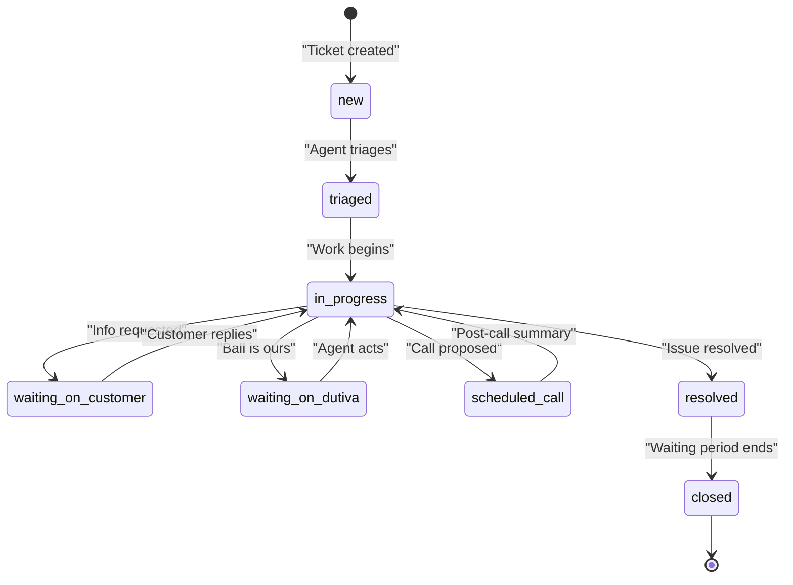
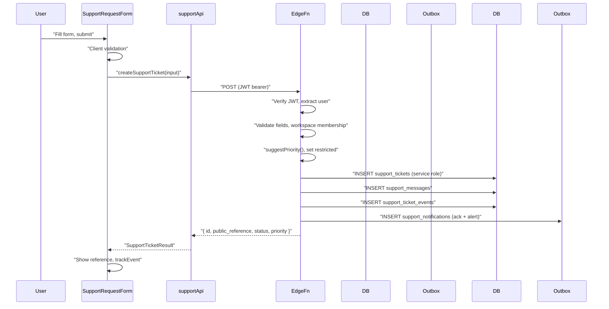
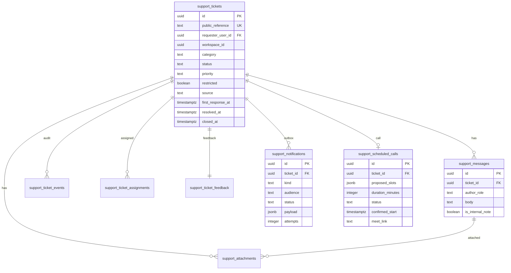
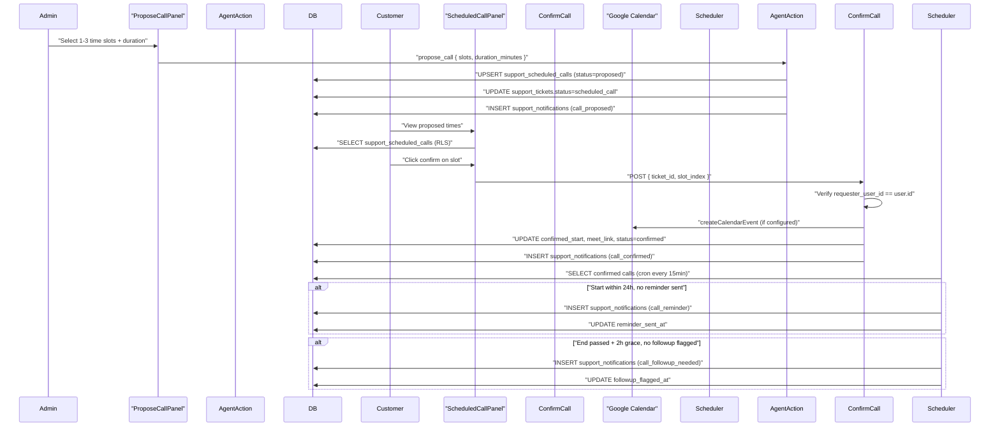
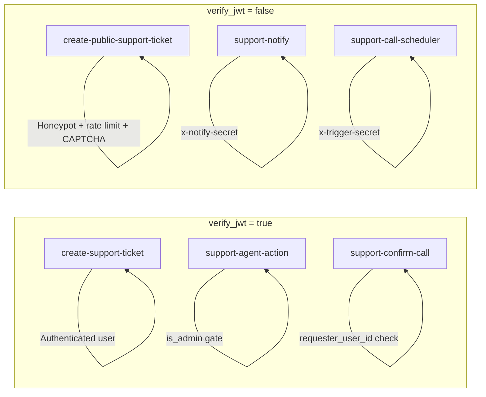

# Support Architecture & Ticket Lifecycle

<details>
<summary>Relevant source files</summary>

The following files were used as context for generating this wiki page:

- [.env.example](.env.example)
- [docs/SUPPORT_ARCHITECTURE.md](docs/SUPPORT_ARCHITECTURE.md)
- [docs/SUPPORT_RUNBOOK.md](docs/SUPPORT_RUNBOOK.md)
- [src/config/support.ts](src/config/support.ts)
- [src/features/app/views/support/ServiceStatusControl.tsx](src/features/app/views/support/ServiceStatusControl.tsx)
- [src/features/app/views/support/SupportAdminTicket.test.tsx](src/features/app/views/support/SupportAdminTicket.test.tsx)
- [src/features/app/views/support/SupportAdminTicket.tsx](src/features/app/views/support/SupportAdminTicket.tsx)
- [src/features/app/views/support/SupportAdminView.test.tsx](src/features/app/views/support/SupportAdminView.test.tsx)
- [src/features/app/views/support/SupportAdminView.tsx](src/features/app/views/support/SupportAdminView.tsx)
- [src/features/app/views/support/SupportRequestsList.test.tsx](src/features/app/views/support/SupportRequestsList.test.tsx)
- [src/features/app/views/support/SupportRequestsList.tsx](src/features/app/views/support/SupportRequestsList.tsx)
- [src/features/app/views/support/SupportSectionNav.tsx](src/features/app/views/support/SupportSectionNav.tsx)
- [src/features/app/views/support/SupportTicketDetail.test.tsx](src/features/app/views/support/SupportTicketDetail.test.tsx)
- [src/features/app/views/support/SupportTicketDetail.tsx](src/features/app/views/support/SupportTicketDetail.tsx)
- [src/features/app/views/support/SupportView.tsx](src/features/app/views/support/SupportView.tsx)
- [src/features/marketing/accessibility.test.tsx](src/features/marketing/accessibility.test.tsx)
- [src/features/marketing/legal/content/support-policy.en.ts](src/features/marketing/legal/content/support-policy.en.ts)
- [src/features/marketing/legal/content/support-policy.fr.ts](src/features/marketing/legal/content/support-policy.fr.ts)
- [src/features/marketing/pages/ContactPage.test.tsx](src/features/marketing/pages/ContactPage.test.tsx)
- [src/features/marketing/pages/ContactPage.tsx](src/features/marketing/pages/ContactPage.tsx)
- [src/features/marketing/pages/HelpCenterPage.tsx](src/features/marketing/pages/HelpCenterPage.tsx)
- [src/features/marketing/pages/StatusPage.test.tsx](src/features/marketing/pages/StatusPage.test.tsx)
- [src/features/marketing/pages/StatusPage.tsx](src/features/marketing/pages/StatusPage.tsx)
- [src/features/support/PublicSupportForm.test.tsx](src/features/support/PublicSupportForm.test.tsx)
- [src/features/support/PublicSupportForm.tsx](src/features/support/PublicSupportForm.tsx)
- [src/features/support/SupportAttachments.test.tsx](src/features/support/SupportAttachments.test.tsx)
- [src/features/support/SupportAttachments.tsx](src/features/support/SupportAttachments.tsx)
- [src/features/support/SupportRequestForm.test.tsx](src/features/support/SupportRequestForm.test.tsx)
- [src/features/support/attachmentsApi.test.ts](src/features/support/attachmentsApi.test.ts)
- [src/features/support/attachmentsApi.ts](src/features/support/attachmentsApi.ts)
- [src/features/support/diagnostics.ts](src/features/support/diagnostics.ts)
- [src/features/support/email/emailService.test.ts](src/features/support/email/emailService.test.ts)
- [src/features/support/email/emailService.ts](src/features/support/email/emailService.ts)
- [src/features/support/email/notifications.test.ts](src/features/support/email/notifications.test.ts)
- [src/features/support/email/notifications.ts](src/features/support/email/notifications.ts)
- [src/features/support/email/templates.test.ts](src/features/support/email/templates.test.ts)
- [src/features/support/email/templates.ts](src/features/support/email/templates.ts)
- [src/features/support/help/HelpContactCta.tsx](src/features/support/help/HelpContactCta.tsx)
- [src/features/support/publicSupportApi.test.ts](src/features/support/publicSupportApi.test.ts)
- [src/features/support/publicSupportApi.ts](src/features/support/publicSupportApi.ts)
- [src/features/support/statusApi.test.ts](src/features/support/statusApi.test.ts)
- [src/features/support/statusApi.ts](src/features/support/statusApi.ts)
- [src/features/support/supportAdminApi.ts](src/features/support/supportAdminApi.ts)
- [src/features/support/supportApi.ts](src/features/support/supportApi.ts)
- [src/features/support/triage.test.ts](src/features/support/triage.test.ts)
- [src/features/support/triage.ts](src/features/support/triage.ts)
- [supabase/functions/create-public-support-ticket/index.ts](supabase/functions/create-public-support-ticket/index.ts)
- [supabase/functions/create-support-ticket/index.ts](supabase/functions/create-support-ticket/index.ts)
- [supabase/functions/support-agent-action/index.ts](supabase/functions/support-agent-action/index.ts)
- [supabase/functions/support-attachment-action/index.ts](supabase/functions/support-attachment-action/index.ts)
- [supabase/functions/support-notify/index.ts](supabase/functions/support-notify/index.ts)
- [supabase/migrations/0014_support_system.sql](supabase/migrations/0014_support_system.sql)
- [supabase/migrations/0015_support_notifications.sql](supabase/migrations/0015_support_notifications.sql)
- [supabase/migrations/0048_fix_attachment_scan_trigger_auth.sql](supabase/migrations/0048_fix_attachment_scan_trigger_auth.sql)
- [supabase/migrations/0053_rls_grant_gaps_check.sql](supabase/migrations/0053_rls_grant_gaps_check.sql)

</details>

Dutiva's support system is a digital-first, asynchronous model with no routine inbound phone channel and no 24/7 staffed support. The customer journey progresses through self-service (Help Centre), written ticket-based resolution, and — only when required — a scheduled telephone/video call. All configuration is centralized in `src/config/support.ts`, which is the single source of truth for channels, business hours, response targets, and status/priority enumerations.

Sources: [docs/SUPPORT_ARCHITECTURE.md:1-12](), [src/config/support.ts:4-18]()

## System Overview

**Architecture diagram — major modules and data flow**

```mermaid
graph TB
    subgraph "Marketing Surface"
        ContactPage["ContactPage /contact"]
        PublicSupportForm["PublicSupportForm"]
    end

    subgraph "App Surface"
        SupportView["SupportView /app/support"]
        SupportRequestForm["SupportRequestForm"]
        SupportRequestsList["SupportRequestsList /app/support/requests"]
        SupportTicketDetail["SupportTicketDetail /app/support/requests/:ticketId"]
        SupportAdminView["SupportAdminView /app/support/admin"]
        SupportAdminTicket["SupportAdminTicket /app/support/admin/:ticketId"]
    end

    subgraph "Edge Functions"
        createSupportTicket["create-support-ticket"]
        createPublicSupportTicket["create-public-support-ticket"]
        supportAgentAction["support-agent-action"]
        supportConfirmCall["support-confirm-call"]
        supportNotify["support-notify"]
        supportCallScheduler["support-call-scheduler"]
    end

    subgraph "Database Tables"
        support_tickets["support_tickets"]
        support_messages["support_messages"]
        support_notifications["support_notifications"]
        support_scheduled_calls["support_scheduled_calls"]
        support_ticket_events["support_ticket_events"]
    end

    subgraph "External"
        Resend["Resend API"]
        GoogleCalendar["Google Calendar API"]
    end

    SupportRequestForm -- "supportApi.ts" --> createSupportTicket
    PublicSupportForm -- "publicSupportApi.ts" --> createPublicSupportTicket
    SupportAdminTicket -- "supportAdminApi.ts" --> supportAgentAction
    SupportTicketDetail -- "supportApi.ts" --> supportConfirmCall
    createSupportTicket --> support_tickets
    createPublicSupportTicket --> support_tickets
    createSupportTicket --> support_notifications
    createPublicSupportTicket --> support_notifications
    supportAgentAction --> support_messages
    supportAgentAction --> support_scheduled_calls
    supportConfirmCall --> support_scheduled_calls
    supportConfirmCall --> GoogleCalendar
    supportNotify --> support_notifications
    supportNotify --> Resend
    supportCallScheduler --> support_notifications
```



Sources: [src/app/appViews.tsx:43-48](), [src/app/appViews.tsx:101-110](), [docs/SUPPORT_ARCHITECTURE.md:245-280]()

## Configured-or-Inert Activation

The support system follows the platform-wide "configured-or-inert" pattern. No new required environment variables are introduced by the support subsystem itself; all behaviour changes are gated on optional secrets:

| Secret                        | Behaviour when unset                                         | Behaviour when set                                                          |
| ----------------------------- | ------------------------------------------------------------ | --------------------------------------------------------------------------- |
| `RESEND_API_KEY`              | `support-notify` leaves rows `pending` — no email sent       | Worker drains outbox, sends via Resend                                      |
| `SUPPORT_NOTIFY_SECRET`       | Worker is inert                                              | Required when `RESEND_API_KEY` is set; worker fails closed (403) without it |
| `CAPTCHA_SECRET_KEY`          | `create-public-support-ticket` skips CAPTCHA                 | Hard 403 on missing/bad token                                               |
| `SUPPORT_ATTACHMENT_SCAN_URL` | Attachments stay `pending`, downloads unaffected             | Worker scans backlog; downloads gated by verdict                            |
| `GOOGLE_CALENDAR_*`           | Call confirmation still succeeds; no calendar invite created | Calendar event + Meet link created on confirm                               |

This design means merging code never arms a feature — the operator enables it by setting secrets, and the backlog accumulated while unconfigured is processed on first activation.

Sources: [.env.example:62-104](), [docs/SUPPORT_ARCHITECTURE.md:130-148](), [supabase/functions/support-notify/index.ts:299-303](), [supabase/functions/support-confirm-call/index.ts:17-25]()

## Support Channels

Six channels are defined in `SUPPORT_CHANNELS` in `src/config/support.ts`. Each `SupportChannel` carries an `id`, `email`, `purpose` (bilingual `Bi`), `publicIntake` flag, and `restrictedHandling` flag.

| Channel ID      | Email                     | `publicIntake` | `restrictedHandling` |
| --------------- | ------------------------- | -------------- | -------------------- |
| `support`       | `support@dutiva.ca`       | yes            | no                   |
| `billing`       | `billing@dutiva.ca`       | no             | no                   |
| `privacy`       | `privacy@dutiva.ca`       | yes            | yes                  |
| `security`      | `security@dutiva.ca`      | yes            | yes                  |
| `accessibility` | `accessibility@dutiva.ca` | yes            | yes                  |
| `sales`         | `sales@dutiva.ca`         | yes            | no                   |

Each `SupportCategoryDef` in `SUPPORT_CATEGORIES` maps a ticket category to a channel via `channel: SupportChannelId`. Categories with `restrictedHandling: true` (privacy, security, accessibility, complaint) are hidden from workspace peers and excluded from ordinary analytics.

Sources: [src/config/support.ts:22-107](), [src/config/support.ts:218-313]()

## Ticket Status Lifecycle

The `SupportStatus` type defines eight states, ordered by `STATUS_ORDER`. Each state has bilingual customer-facing labels in `STATUS_LABELS`.



Status transitions are enforced server-side through the `support-agent-action` edge function, which validates the status value against the `STATUSES` array before updating. The `resolved_at` and `closed_at` timestamps are set automatically when transitioning to those states.

Sources: [src/config/support.ts:184-214](), [supabase/functions/support-agent-action/index.ts:27-30](), [supabase/functions/support-agent-action/index.ts:133-147]()

## Priority Model

### `suggestPriority()` Algorithm

Priority is `critical | high | standard | low`. The `suggestPriority()` function in `src/features/support/triage.ts` derives an initial priority from three inputs: `category`, `impact`, and `urgency`. It is deliberately **capped at `high`** — `critical` is only ever set by a human during triage.

The algorithm:

1. **Impact rank**: `blocking` → 2, `major`/`minor` → 1, `none` → 0
2. **Category floor**: `security` → 2; `account_access`, `accessibility`, `privacy`, `billing`, `complaint` → 1; others → 0
3. **Base rank**: `max(impactRank, categoryFloor)`
4. **Urgency nudge**: if `urgency === 'urgent'` AND `impact !== 'none'`, add 1
5. **Clamp**: `min(rank, 2)` (i.e., max is `high`)

The function is duplicated (kept in sync) in `create-support-ticket` and `create-public-support-ticket` edge functions.

Sources: [src/features/support/triage.ts:55-79](), [supabase/functions/create-support-ticket/index.ts:65-77](), [supabase/functions/create-public-support-ticket/index.ts:64-76]()

### Ontario Business Calendar

Response due dates are computed using the Ontario statutory holiday calendar. The `ontarioStatutoryHolidays()` function computes nine holidays per year, including Good Friday via the Anonymous Gregorian computus. Results are cached in `holidayCache`.

| Holiday        | Computation                  |
| -------------- | ---------------------------- |
| New Year's Day | January 1                    |
| Family Day     | 3rd Monday of February       |
| Good Friday    | Easter Sunday − 2 (computus) |
| Victoria Day   | Monday on or before May 24   |
| Canada Day     | July 1                       |
| Labour Day     | 1st Monday of September      |
| Thanksgiving   | 2nd Monday of October        |
| Christmas Day  | December 25                  |
| Boxing Day     | December 26                  |

The `isBusinessDay()` function checks that the day is a configured weekday (Mon–Fri from `SUPPORT_HOURS.businessDays`) and not in the holiday set. `initialResponseDueDate()` computes the target date at business-day granularity.

Sources: [src/features/support/triage.ts:100-203](), [src/config/support.ts:117-130]()

### Response Targets

Defined in `RESPONSE_TARGETS` — service targets, not contractual guarantees:

| Priority   | Target | Unit             |
| ---------- | ------ | ---------------- |
| `critical` | 4      | `business_hours` |
| `high`     | 1      | `business_days`  |
| `standard` | 2      | `business_days`  |
| `low`      | 5      | `business_days`  |

Sources: [src/config/support.ts:149-174]()

## Ticket Creation

### Authenticated Path: `create-support-ticket`

**Flow: Authenticated ticket creation**



Key implementation details:

- **Auth**: JWT bearer token verified via `userClient.auth.getUser()` — [supabase/functions/create-support-ticket/index.ts:113-122]()
- **Workspace verification**: a browser-supplied `workspace_id` is honoured only after `is_org_member` RPC check — [supabase/functions/create-support-ticket/index.ts:145-152]()
- **Rate limit**: max 5 tickets per user per 10-minute window — [supabase/functions/create-support-ticket/index.ts:155-162]()
- **Restricted flag**: `privacy`, `security`, `accessibility`, `complaint` categories are auto-flagged `restricted` — [supabase/functions/create-support-ticket/index.ts:43]()
- **Diagnostics**: stripped to an allowlist (`DIAGNOSTIC_KEYS`: plan, route, app_version, browser, os, locale, feature, correlation_id, error_code) — [supabase/functions/create-support-ticket/index.ts:57-59](), [src/features/support/diagnostics.ts:11-21]()
- **Notifications**: two outbox rows are enqueued — a customer acknowledgement (category-aware: `privacy_ack`, `security_ack`, `accessibility_ack`, `complaint_ack`, or `ticket_received`) and an `operator_alert` — [supabase/functions/create-support-ticket/index.ts:48-54](), [supabase/functions/create-support-ticket/index.ts:186-214]()

Client-side:

- `SupportRequestForm` at [src/features/support/SupportRequestForm.tsx:71-168]() collects category, subject, description, impact/urgency, language, response method, and optional diagnostics
- `supportApi.ts` at [src/features/support/supportApi.ts:47-74]() invokes the edge function and validates the response with a Zod schema
- `gatherDiagnostics()` at [src/features/support/diagnostics.ts:57-82]() produces a coarse browser/OS label (never the full UA string), app version, route, and a `randomUUID` correlation ID

Sources: [supabase/functions/create-support-ticket/index.ts:1-214](), [src/features/support/supportApi.ts:47-74](), [src/features/support/SupportRequestForm.tsx:71-168]()

### Public Path: `create-public-support-ticket`

The unauthenticated intake serves the marketing-surface Contact page (`/contact`). It differs from the authenticated path in several important ways:

| Aspect              | Authenticated                   | Public                                    |
| ------------------- | ------------------------------- | ----------------------------------------- |
| Auth                | JWT bearer                      | None (`verify_jwt: false`)                |
| Categories          | All 10                          | Only `allowPublic` (5)                    |
| Workspace context   | Verified if supplied            | Never                                     |
| Diagnostics         | Optional allowlist              | None                                      |
| Attachments         | Via `support-attachment-action` | Not supported                             |
| Anti-abuse          | Per-user rate limit (5/10min)   | Honeypot + CAPTCHA + IP/email rate limits |
| `requester_user_id` | Set from JWT                    | `null` (admin-only under RLS)             |

**Anti-abuse layers** (checked in order):

1. **Honeypot**: a hidden `contact_fax` field — if non-empty, the function returns fake success `{ ok: true }` without writing — [supabase/functions/create-public-support-ticket/index.ts:194-196]()
2. **Category gate**: only `PUBLIC_CATEGORIES` are accepted — [supabase/functions/create-public-support-ticket/index.ts:48-49](), [supabase/functions/create-public-support-ticket/index.ts:199-201]()
3. **Rate limits**: per-IP (3 per 15 min) and per-email (3 per 60 min), backed by `support_public_intake` storing **only salted SHA-256 hashes** — [supabase/functions/create-public-support-ticket/index.ts:114-117](), [supabase/functions/create-public-support-ticket/index.ts:220-236]()
4. **CAPTCHA** (Turnstile or hCaptcha): skipped when `CAPTCHA_SECRET_KEY` is unset; hard 403 when it is set and verification fails — [supabase/functions/create-public-support-ticket/index.ts:250-262]()

Client-side `PublicSupportForm` at [src/features/support/PublicSupportForm.tsx:71-179]() filters categories to `allowPublic` only, maps `honeypot` to `contact_fax` via `publicSupportApi.ts` at [src/features/support/publicSupportApi.ts:62-86](), and renders a `CaptchaField` only when `isCaptchaConfigured()` returns true (i.e., `VITE_CAPTCHA_SITE_KEY` is set) — [src/features/support/captcha.ts:78-79]().

Sources: [supabase/functions/create-public-support-ticket/index.ts:1-330](), [src/features/support/publicSupportApi.ts:1-86](), [src/features/support/captcha.ts:1-157]()

## Notification Outbox Pattern

Notifications are decoupled from ticket creation via an **outbox table** (`support_notifications`, migration 0015). Edge functions insert rows with `status: 'pending'`; a separate `support-notify` worker drains them.

**Schema** ([supabase/migrations/0015_support_notifications.sql:14-31]()):

| Column                | Type         | Purpose                                                                                                                                                   |
| --------------------- | ------------ | --------------------------------------------------------------------------------------------------------------------------------------------------------- |
| `kind`                | text (CHECK) | Notification type (18 kinds)                                                                                                                              |
| `audience`            | text         | `customer` or `operator`                                                                                                                                  |
| `recipient`           | text         | Email address                                                                                                                                             |
| `language`            | text         | `en` or `fr`                                                                                                                                              |
| `status`              | text         | `pending` → `sent` / `failed` / `skipped`                                                                                                                 |
| `payload`             | jsonb        | Non-sensitive only: ticket `{ reference, category, priority? }`; signup alerts add `source` / `plan` / `billing_period` / `province` and omit the address |
| `attempts`            | integer      | Retry counter                                                                                                                                             |
| `provider_message_id` | text         | Resend ID for delivery tracking                                                                                                                           |

**Outbox drain flow**

```mermaid
sequenceDiagram
    participant pg_cron
    participant "support-notify" as Worker
    participant support_notifications as Outbox
    participant Resend

    pg_cron->>"support-notify": "POST (x-notify-secret)"
    "support-notify"->>Outbox: "SELECT pending, attempts < 5, LIMIT 50"
    loop "Each pending row"
        "support-notify"->>"support-notify": "renderNotificationEmail(kind, ctx)"
        "support-notify"->>Resend: "resendSend(apiKey, from, email)"
        alt "Send succeeds"
            "support-notify"->>Outbox: "UPDATE status=sent, provider_message_id"
        else "Send fails"
            "support-notify"->>Outbox: "UPDATE attempts++, last_error; status=failed if attempts >= 5"
        end
    end
    "support-notify"-->>pg_cron: "{ processed, sent, failed }"
```

Key design decisions:

- **No provider → no-op**: when `RESEND_API_KEY` is unset, the worker returns `{ note: 'no_provider' }` and leaves rows `pending` — wiring the key later flushes the backlog — [supabase/functions/support-notify/index.ts:299-303]()
- **Fail closed**: if a provider key is set but `SUPPORT_NOTIFY_SECRET` is missing, the worker returns 403 — [supabase/functions/support-notify/index.ts:283-286]()
- **Batch size**: `BATCH_SIZE = 50`, `MAX_ATTEMPTS = 5` — [supabase/functions/support-notify/index.ts:38-39]()
- **Template rendering**: `renderNotificationEmail()` mirrors the client-side `renderSupportEmail()` from `src/features/support/email/templates.ts` — [supabase/functions/support-notify/index.ts:109-227]()
- **Delivery tracking**: `provider_message_id` is stored so the `resend-webhook` function can correlate delivery/bounce events — [supabase/functions/support-notify/index.ts:325]()

The 18 notification kinds span the ticket lifecycle plus signup alerts:

`ticket_received`, `agent_reply`, `info_requested`, `resolved`, `closed`, `call_proposed`, `call_confirmed`, `call_reminder`, `call_followup_needed`, `privacy_ack`, `accessibility_ack`, `security_ack`, `complaint_ack`, `operator_alert`, `beta_signup`, `beta_confirmation`, `account_signup`, `plan_signup`

Signup producers: `create-beta-signup` (`beta_signup` + `beta_confirmation`), `handle_new_user()` after `auth.users` insert (`account_signup`, migration 0093), and `stripe-webhook` after paid `checkout.session.completed` (`plan_signup`).

Sources: [supabase/functions/support-notify/index.ts:1-345](), [supabase/migrations/0015_support_notifications.sql:1-45](), [src/features/support/email/templates.ts:17-31](), [src/features/support/email/notifications.ts:21-58]()

## Data Model & RLS

Six core tables, all with RLS enabled (migration 0014), plus the notification outbox (migration 0015):



**`public_reference`** is the human-readable ID (`DUT-YYYY-NNNNNN`), generated by a `BEFORE INSERT` trigger using `support_ticket_ref_seq` — [supabase/migrations/0014_support_system.sql:147-165]().

**RLS summary** (helpers `is_admin(uuid)`, `is_org_member(org, uuid)`):

| Table                        | Who can SELECT                              | Who can INSERT                                  |
| ---------------------------- | ------------------------------------------- | ----------------------------------------------- |
| `support_tickets`            | Requester, workspace members, admin         | **Service role only** (no client INSERT policy) |
| `support_messages`           | Same as ticket (internal notes: admin only) | Requester (non-internal only); service role     |
| `support_attachments`        | Same as ticket                              | Service role via `support-attachment-action`    |
| `support_ticket_events`      | Admin only                                  | Service role                                    |
| `support_ticket_assignments` | Admin only                                  | Service role                                    |
| `support_ticket_feedback`    | Same as ticket                              | Requester on own ticket                         |
| `support_notifications`      | Admin only                                  | Service role                                    |

All privileged writes (triage, status changes, priority, internal notes) go through service-role edge functions and bypass RLS. The browser cannot forge tickets, spoof `workspace_id`, or insert directly into `support_tickets`.

Sources: [supabase/migrations/0014_support_system.sql:1-167](), [supabase/migrations/0015_support_notifications.sql:1-45](), [docs/SUPPORT_ARCHITECTURE.md:78-109]()

## Operator Dashboard

### `SupportAdminView`

The operator dashboard at `/app/support/admin` is rendered by `SupportAdminView`, which is admin-gated client-side via `isCurrentUserAdmin()` (calls the `is_admin` RPC) — [src/features/support/supportAdminApi.ts:107-114]().

Features:

- **Filters**: status, priority, category, restricted-only toggle, and text search (subject/reference) — [src/features/app/views/support/SupportAdminView.tsx:95-151]()
- **Ticket list**: table with subject, requester, priority, status, and date columns; links to detail view — [src/features/app/views/support/SupportAdminView.tsx:162-193]()
- **Open count**: tickets not in `resolved` or `closed` — [src/features/app/views/support/SupportAdminView.tsx:69]()
- **Service status control**: inline `ServiceStatusControl` for the status board — [src/features/app/views/support/SupportAdminView.tsx:84]()
- **Export audit link**: to `/app/support/admin/exports` — [src/features/app/views/support/SupportAdminView.tsx:87-93]()

The `adminListTickets()` function at [src/features/support/supportAdminApi.ts:116-130]() builds a filtered Supabase query with a 200-row limit.

Sources: [src/features/app/views/support/SupportAdminView.tsx:31-193](), [src/features/support/supportAdminApi.ts:107-130]()

### `SupportAdminTicket`

The detail view at `/app/support/admin/:ticketId` is rendered by `SupportAdminTicket` — [src/features/app/views/support/SupportAdminTicket.tsx:175-330](). It provides:

- **Agent reply**: customer-visible message via `runAgentAction(ticketId, { action: 'reply', body })` — [src/features/app/views/support/SupportAdminTicket.tsx:230-250]()
- **Internal note**: founder-only note via `{ action: 'note', body }` — [src/features/app/views/support/SupportAdminTicket.tsx:260-285]()
- **Status change**: dropdown with all 8 statuses via `{ action: 'status', status }` — [src/features/app/views/support/SupportAdminTicket.tsx:290-310]()
- **Priority change**: dropdown allowing `critical` (unlike customer intake) via `{ action: 'priority', priority }` — [src/features/app/views/support/SupportAdminTicket.tsx:310-325]()
- **Call scheduling**: `ProposeCallPanel` for proposing up to 3 time slots — [src/features/app/views/support/SupportAdminTicket.tsx:38-172]()
- **Attachments**: `SupportAttachments` component for viewing/uploading — [src/features/app/views/support/SupportAdminTicket.tsx:21]()

Sources: [src/features/app/views/support/SupportAdminTicket.tsx:1-330](), [src/features/support/supportAdminApi.ts:165-178]()

## Agent Actions: `support-agent-action`

The `support-agent-action` edge function is the single mutation endpoint for operator actions. It is gated by `is_admin` server-side — [supabase/functions/support-agent-action/index.ts:63-64]().

Five action types are defined in `ACTIONS`:

| Action         | Payload                         | Effect                                                                                                                                                          |
| -------------- | ------------------------------- | --------------------------------------------------------------------------------------------------------------------------------------------------------------- |
| `reply`        | `{ body }`                      | Insert customer-visible message; set `first_response_at` if first reply; transition `new`/`triaged` → `waiting_on_customer`; enqueue `agent_reply` notification |
| `note`         | `{ body }`                      | Insert internal note (admin-only visibility)                                                                                                                    |
| `status`       | `{ status }`                    | Update ticket status; set `resolved_at`/`closed_at` if applicable                                                                                               |
| `priority`     | `{ priority }`                  | Update priority (may set `critical` — unlike customer intake)                                                                                                   |
| `propose_call` | `{ slots[], duration_minutes }` | Upsert `support_scheduled_calls`; update ticket status to `scheduled_call`; enqueue `call_proposed` notification                                                |

Every action writes an `support_ticket_events` audit row — [supabase/functions/support-agent-action/index.ts:113-117]().

The `reply` action has automatic side effects: if the ticket has no `first_response_at`, it's set to the current timestamp; if status is `new` or `triaged`, it advances to `waiting_on_customer` — [supabase/functions/support-agent-action/index.ts:105-112]().

Sources: [supabase/functions/support-agent-action/index.ts:1-210]()

## Customer Ticket View: `SupportTicketDetail`

At `/app/support/requests/:ticketId`, the customer sees their ticket details and message thread. Reads go directly through Supabase client (RLS controls visibility) — [src/features/support/supportApi.ts:150-168](). Customer replies use `replyToSupportTicket()` which inserts a `customer`-role, non-internal message via RLS — [src/features/support/supportApi.ts:171-192]().

The `ScheduledCallPanel` component renders within the ticket detail when a call has been proposed. It shows proposed time slots and allows the customer to confirm one — [src/features/app/views/support/SupportTicketDetail.tsx:36-116]().

Sources: [src/features/app/views/support/SupportTicketDetail.tsx:118-232](), [src/features/support/supportApi.ts:140-192]()

## Call Scheduling Flow

The call scheduling subsystem spans four code modules and three edge functions:

**Call scheduling sequence**



### Shared Logic: `_shared/scheduledCalls.ts`

Pure functions shared across the three edge functions:

- `parseProposedSlots(input, now)` — validates 1–3 future `{start, end}` ranges — [supabase/functions/_shared/scheduledCalls.ts:26-41]()
- `parseSlotIndex(value, slotCount)` — validates customer-chosen index — [supabase/functions/_shared/scheduledCalls.ts:54-58]()
- `rowsNeedingReminder(rows, now)` — confirmed calls starting within 24h, not yet reminded — [supabase/functions/_shared/scheduledCalls.ts:69-78]()
- `rowsNeedingFollowup(rows, now)` — confirmed calls ended 2+ hours ago, not yet flagged — [supabase/functions/_shared/scheduledCalls.ts:81-86]()
- Constants: `MIN_SLOTS=1`, `MAX_SLOTS=3`, `MIN_DURATION_MINUTES=10`, `MAX_DURATION_MINUTES=120`, `REMINDER_WINDOW_HOURS=24`, `FOLLOWUP_GRACE_HOURS=2` — [supabase/functions/_shared/scheduledCalls.ts:10-18]()

### `support-confirm-call`

Deliberately separate from `support-agent-action` because it uses a different authorization rule: it checks `requester_user_id === user.id` (own-ticket only), not `is_admin` — [supabase/functions/support-confirm-call/index.ts:86]().

Google Calendar integration uses a service-account JWT-bearer flow (RFC 7523) via Web Crypto in `_shared/googleCalendar.ts` — [supabase/functions/_shared/googleCalendar.ts:1-15](). Calendar creation is **never blocking**: if secrets are unconfigured, the function records a `calendar_sync_skipped` event; if the API call fails, it records `calendar_sync_failed`. Confirmation always succeeds — [supabase/functions/support-confirm-call/index.ts:113-142]().

### `support-call-scheduler`

A cron sweep scheduled every 15 minutes. Uses `acquire_cron_lock`/`release_cron_lock` to prevent concurrent runs — [supabase/functions/support-call-scheduler/index.ts:76-86](). Authentication uses `x-trigger-secret` (matching `SUPPORT_NOTIFY_SECRET`) or exact-match service-role key — [supabase/functions/support-call-scheduler/index.ts:47-61]().

Sources: [supabase/functions/support-confirm-call/index.ts:1-182](), [supabase/functions/support-call-scheduler/index.ts:1-158](), [supabase/functions/_shared/scheduledCalls.ts:1-86](), [supabase/functions/_shared/googleCalendar.ts:1-160]()

## Route Structure

All support routes are registered in `appViewRoutes` and are lazy-loaded. Support views are **ungated** (not wrapped in `ModeGate`) — they are real features, not demo fixtures.

| Route                             | Component                 | Access                          |
| --------------------------------- | ------------------------- | ------------------------------- |
| `/app/support`                    | `SupportView`             | Authenticated                   |
| `/app/support/requests`           | `SupportRequestsList`     | Authenticated                   |
| `/app/support/requests/:ticketId` | `SupportTicketDetail`     | Authenticated (RLS: own ticket) |
| `/app/support/admin`              | `SupportAdminView`        | Admin (`is_admin`)              |
| `/app/support/admin/exports`      | `ExportAuditView`         | Admin                           |
| `/app/support/admin/:ticketId`    | `SupportAdminTicket`      | Admin                           |
| `/contact`                        | `ContactPage` (marketing) | Public                          |

Sources: [src/app/appViews.tsx:100-110](), [src/app/appViews.tsx:43-48]()

## Edge Functions Summary



| Function                       | Auth                                   | Purpose                                                              |
| ------------------------------ | -------------------------------------- | -------------------------------------------------------------------- |
| `create-support-ticket`        | JWT (authenticated user)               | Ticket creation from the in-app form                                 |
| `create-public-support-ticket` | None; anti-abuse controls              | Ticket creation from the public Contact page                         |
| `support-agent-action`         | JWT + `is_admin` RPC                   | All operator mutations (reply, note, status, priority, propose_call) |
| `support-confirm-call`         | JWT + requester ownership              | Customer confirms a proposed call slot                               |
| `support-notify`               | `x-notify-secret` header               | Outbox drain → Resend email delivery                                 |
| `support-call-scheduler`       | `x-trigger-secret` or service-role key | Cron: call reminders and follow-up flags                             |

Sources: [supabase/functions/create-support-ticket/index.ts:102-123](), [supabase/functions/create-public-support-ticket/index.ts:177-183](), [supabase/functions/support-agent-action/index.ts:38-64](), [supabase/functions/support-confirm-call/index.ts:43-86](), [supabase/functions/support-notify/index.ts:259-286](), [supabase/functions/support-call-scheduler/index.ts:47-69]()

## Client API Layer

Two API modules mediate between UI components and edge functions:

**`supportApi.ts`** (authenticated customer operations):

- `createSupportTicket()` — invoke `create-support-ticket` — [src/features/support/supportApi.ts:47-74]()
- `listMySupportTickets()` — direct Supabase query (RLS) — [src/features/support/supportApi.ts:140-148]()
- `getSupportTicket()` — ticket + messages via RLS — [src/features/support/supportApi.ts:150-168]()
- `replyToSupportTicket()` — direct INSERT (RLS allows customer non-internal reply) — [src/features/support/supportApi.ts:171-192]()
- `getScheduledCall()` — direct query on `support_scheduled_calls` — [src/features/support/supportApi.ts:240-248]()
- `confirmScheduledCall()` — invoke `support-confirm-call` — [src/features/support/supportApi.ts:251-264]()

**`supportAdminApi.ts`** (operator operations):

- `isCurrentUserAdmin()` — calls `is_admin` RPC — [src/features/support/supportAdminApi.ts:107-114]()
- `adminListTickets()` — filtered query (RLS grants admin read-all) — [src/features/support/supportAdminApi.ts:116-130]()
- `adminGetTicket()` — ticket + all messages (incl. internal notes) — [src/features/support/supportAdminApi.ts:132-158]()
- `runAgentAction()` — invoke `support-agent-action` — [src/features/support/supportAdminApi.ts:172-178]()
- `adminGetScheduledCall()` — read-only scheduled call state — [src/features/support/supportAdminApi.ts:207-226]()

Both modules return `[]` or `null` when `supabase` is `null` (configured-or-inert pattern).

Sources: [src/features/support/supportApi.ts:1-264](), [src/features/support/supportAdminApi.ts:1-226]()

## Support Analytics

Client-side analytics is handled by `trackEvent()` in `supportAnalytics.ts`. Events are batched (threshold: 10 events or 2-second timeout) and flushed to the `support-analytics-event` edge function, pinned to `ca-central-1` for PIPEDA data residency — [src/features/support/analytics/supportAnalytics.ts:52-74]().

Analytics is consent-gated: `trackEvent()` checks `hasAnalyticsConsent()` and records nothing until the visitor opts in (Quebec Law 25 s. 8.1 compliance) — [src/features/support/analytics/supportAnalytics.ts:79-80]().

Event types: `helpfulness_vote`, `help_search`, `help_article_view`, `ticket_submitted`, `ticket_status_changed` — [src/features/support/analytics/supportAnalytics.ts:32-37]().

Sources: [src/features/support/analytics/supportAnalytics.ts:1-137]()

## Email Template System

The `renderSupportEmail()` function in `src/features/support/email/templates.ts` is the tested source of truth for all 18 notification email templates. The `support-notify` edge function mirrors this as `renderNotificationEmail()`.

Templates follow strict rules:

- Support-ticket subjects carry **only** the public reference — never description or PII — [src/features/support/email/templates.ts:8-9]()
- Signup alert subjects name the event only, with customer details kept out of the outbox subject.
- Customer ticket bodies link to the authenticated ticket URL; beta signup alerts link to the operator workspace — [src/features/support/email/templates.ts:36-37]()
- Customer-facing templates include the legal disclaimer; ticket acknowledgements also include the sensitive-info warning — [src/features/support/email/templates.ts:56-69]()
- Category-aware acknowledgements exist for privacy, security, accessibility, and complaint — [src/features/support/email/templates.ts:95-120]()

The notification rule engine in `notifications.ts` determines:

- `acknowledgementKind(category)` — which ack template to use — [src/features/support/email/notifications.ts:21-33]()
- `operatorChannel(category, priority)` — `immediate` for security or critical/high; `digest` otherwise — [src/features/support/email/notifications.ts:41-48]()

Sources: [src/features/support/email/templates.ts:1-170](), [src/features/support/email/notifications.ts:1-75]()

---
