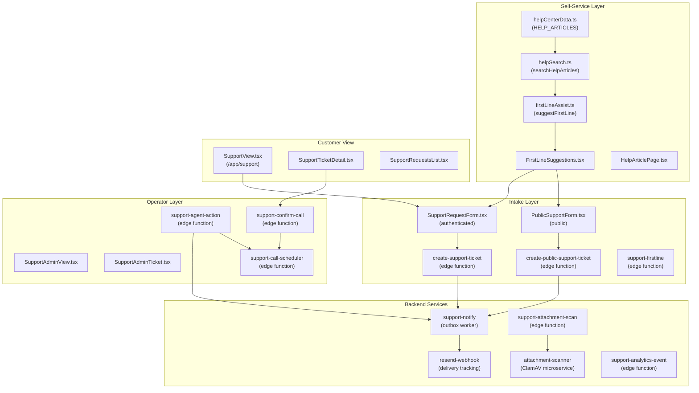
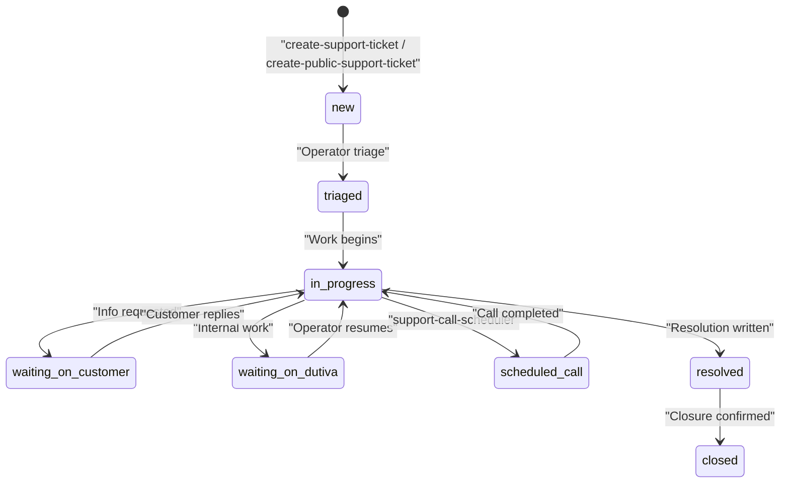
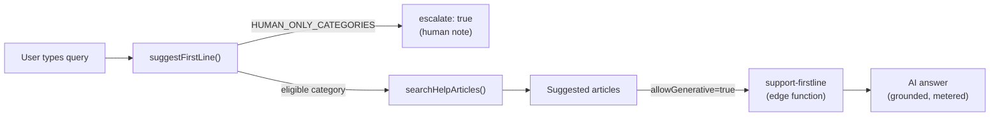
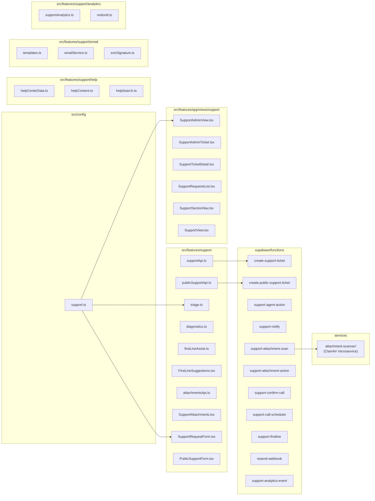

# Support System

Relevant source files

The following files were used as context for generating this wiki page:

- [.env.example](.env.example)
- [docs/SUPPORT_ARCHITECTURE.md](docs/SUPPORT_ARCHITECTURE.md)
- [docs/SUPPORT_RUNBOOK.md](docs/SUPPORT_RUNBOOK.md)
- [src/features/support/FirstLineSuggestions.test.tsx](src/features/support/FirstLineSuggestions.test.tsx)
- [src/features/support/FirstLineSuggestions.tsx](src/features/support/FirstLineSuggestions.tsx)
- [src/features/support/SupportRequestForm.tsx](src/features/support/SupportRequestForm.tsx)
- [src/features/support/firstLineApi.test.ts](src/features/support/firstLineApi.test.ts)
- [src/i18n/messages/support.ts](src/i18n/messages/support.ts)
- [supabase/functions/support-firstline/index.ts](supabase/functions/support-firstline/index.ts)
- [supabase/functions/support-notify/index.ts](supabase/functions/support-notify/index.ts)
- [supabase/migrations/0048_fix_attachment_scan_trigger_auth.sql](supabase/migrations/0048_fix_attachment_scan_trigger_auth.sql)
- [supabase/migrations/0053_rls_grant_gaps_check.sql](supabase/migrations/0053_rls_grant_gaps_check.sql)

Dutiva runs a **digital-first** customer support model: self-service and asynchronous by default, with scheduled telephone/video reserved for exceptional cases. There is no routine inbound phone channel and no 24/7 staffed support. The system is built around a centralized config file (`src/config/support.ts`), a six-table database model (migration `0014`), an outbox-driven notification pipeline, a ClamAV-based attachment scanner microservice, and a self-service Help Centre with optional AI first-line assist.

The customer journey follows a clear deflection-first path:

> Help Centre / contextual guidance → support request → automated acknowledgement → triage → written resolution → scheduled call (only when required) → written ticket summary → closure

Sources: [docs/SUPPORT_ARCHITECTURE.md:1-12](), [src/config/support.ts:4-18]()

## System Map

**Support system component map**

Sources: [src/config/support.ts:1-391](), [src/features/support/supportApi.ts:47-74](), [src/features/support/publicSupportApi.ts:62-86](), [supabase/functions/support-notify/index.ts:1-24](), [services/attachment-scanner/server.js:1-34]()

## Centralized Configuration

All support channels, business hours, response targets, priority/status/category vocabularies, and escalation reasons are defined in a single source of truth: `src/config/support.ts`. Components never hard-code email addresses, hours, or response targets inline — they read from this config.

| Config element     | Code symbol          | Purpose                                                                        |
| ------------------ | -------------------- | ------------------------------------------------------------------------------ |
| Channels           | `SUPPORT_CHANNELS`   | Six email channels (support, billing, privacy, security, accessibility, sales) |
| Business hours     | `SUPPORT_HOURS`      | Mon–Fri 09:00–17:00 America/Toronto                                            |
| Response targets   | `RESPONSE_TARGETS`   | Critical: 4 biz hours, High: 1 day, Standard: 2 days, Low: 5 days              |
| Priorities         | `SupportPriority`    | `critical`, `high`, `standard`, `low`                                          |
| Statuses           | `SupportStatus`      | 8-state lifecycle from `new` to `closed`                                       |
| Categories         | `SUPPORT_CATEGORIES` | 10 categories, each routing to a channel                                       |
| Escalation reasons | `ESCALATION_REASONS` | 8 narrow reasons for scheduled phone/video                                     |

Sources: [src/config/support.ts:46-107](), [src/config/support.ts:134-174](), [src/config/support.ts:185-215](), [src/config/support.ts:219-313](), [src/config/support.ts:339-373]()

## Ticket Lifecycle Overview

Tickets follow an eight-state lifecycle defined by the `SupportStatus` type. The customer describes impact and urgency; `suggestPriority()` derives a suggested priority **capped at `high`** — only a human operator can set `critical`. Ticket creation flows through service-role edge functions (`create-support-ticket` for authenticated users, `create-public-support-ticket` for public intake with CAPTCHA and honeypot), and the outbox pattern ensures that no acknowledgement is lost even when email delivery is not yet configured.

**Ticket status lifecycle**

For details on the full lifecycle, priority model, Ontario business calendar, and the outbox notification pattern, see [Support Architecture & Ticket Lifecycle](#6.1).

Sources: [src/config/support.ts:185-215](), [src/features/support/triage.ts:55-79](), [supabase/functions/create-support-ticket/index.ts:1-15](), [docs/SUPPORT_ARCHITECTURE.md:72-75]()

## Ticket Creation Paths

Two edge functions handle ticket creation, both re-validating all inputs server-side:

| Path                   | Edge function                  | Auth                                   | Client API                                            |
| ---------------------- | ------------------------------ | -------------------------------------- | ----------------------------------------------------- |
| Authenticated (in-app) | `create-support-ticket`        | JWT (verify_jwt=true)                  | `supportApi.ts` → `createSupportTicket()`             |
| Public (contact page)  | `create-public-support-ticket` | None (CAPTCHA + honeypot + rate limit) | `publicSupportApi.ts` → `createPublicSupportTicket()` |

The authenticated form (`SupportRequestForm`) collects category, subject, description, impact, urgency, language, preferred response method, and optional non-sensitive diagnostics (gathered by `gatherDiagnostics()` from `diagnostics.ts` — an allowlist of route, browser, OS, plan, version, and error code). The public form (`PublicSupportForm`) adds email, CASL consent, and CAPTCHA but carries no attachments.

Both paths insert tickets via the service role (the browser has no INSERT policy on `support_tickets`), queue an outbox notification, and return a `public_reference` in `DUT-YYYY-NNNNNN` format.

For details, see [Support Architecture & Ticket Lifecycle](#6.1).

Sources: [src/features/support/supportApi.ts:47-74](), [src/features/support/publicSupportApi.ts:62-86](), [src/features/support/SupportRequestForm.tsx:24-31](), [src/features/support/diagnostics.ts:11-21](), [supabase/functions/create-support-ticket/index.ts:5-15]()

## Operator Tools

The operator dashboard is `SupportAdminView`, accessible only to `is_admin()` users. It presents a filterable ticket queue (by status, priority, category) with an open-ticket count. On `≥768px` the queue is a table; below `md`, tickets render as stacked cards via `useMdUp()`. Ticket detail is in `SupportAdminTicket`, and all agent mutations flow through the `support-agent-action` edge function, which supports five action types:

| Action         | Description                                       |
| -------------- | ------------------------------------------------- |
| `reply`        | Customer-visible agent reply                      |
| `note`         | Internal-only note (hidden from customer)         |
| `status`       | Change ticket status                              |
| `priority`     | Set priority (may set `critical` — unlike intake) |
| `propose_call` | Propose up to 3 candidate call times              |

The call scheduling flow uses `support-call-scheduler` and `support-confirm-call` edge functions. The customer picks a slot from `SupportTicketDetail`'s `ScheduledCallPanel`, and — when Google Calendar integration is configured — a calendar event with a Meet link is created automatically.

For details, see [Support Architecture & Ticket Lifecycle](#6.1).

Sources: [src/features/app/views/support/SupportAdminView.tsx:31-57](), [supabase/functions/support-agent-action/index.ts:1-13](), [src/features/app/views/support/SupportTicketDetail.tsx:36-116](), [src/features/support/supportApi.ts:240-264]()

## Attachment Scanning

Attachments upload directly to the private `support-attachments` storage bucket. The `support-attachment-action` edge function records metadata after re-validating ownership, path, MIME type, and size (25 MB limit, executable MIME types excluded). The `scan_status` field starts at `pending` and is flipped by the `support-attachment-scan` worker, which delegates to a standalone ClamAV-based microservice at `services/attachment-scanner/`.

The scanner is a zero-dependency Node.js HTTP server that streams files through ClamAV's INSTREAM protocol. It runs in a Docker container with baked virus signatures, deployed to DigitalOcean Toronto for PIPEDA data-residency compliance. When no scanner URL is configured, the system degrades gracefully: rows stay `pending` and downloads are unaffected, so wiring a scanner later scans the backlog.

For details on the scanner microservice, scan_status lifecycle, and the INSTREAM protocol, see [Attachment Scanner, Help Centre & Notifications](#6.2).

Sources: [src/features/support/attachmentsApi.ts:1-12](), [services/attachment-scanner/server.js:1-57](), [src/features/support/attachmentsApi.ts:35-43](), [docs/SUPPORT_ARCHITECTURE.md:111-129]()

## Help Centre & First-Line Assist

The Help Centre is a self-service layer organized into six categories (`HELP_CATEGORIES`) with bilingual articles (`HELP_ARTICLES`) in `helpCenterData.ts`. Client-side search (`searchHelpArticles` in `helpSearch.ts`) performs accent- and case-insensitive matching, ranking results by field weight (title > summary > body).

The `FirstLineSuggestions` component surfaces relevant articles in real-time as users type in either intake form. For **human-only categories** (`HUMAN_ONLY_CATEGORIES` — privacy, security, accessibility, complaint, billing, account_access), it shows a plain "a person will handle this" note and never offers automated suggestions. For eligible categories, authenticated users can optionally request an AI-generated instant answer via the `support-firstline` edge function, which is grounded only in Help Centre excerpts and metered through the shared AI usage budget.

**First-line assist flow**

For details, see [Attachment Scanner, Help Centre & Notifications](#6.2).

Sources: [src/features/support/help/helpCenterData.ts:36-91](), [src/features/support/help/helpSearch.ts:75-103](), [src/features/support/firstLineAssist.ts:23-59](), [src/features/support/FirstLineSuggestions.tsx:25-135](), [supabase/functions/support-firstline/index.ts:14-31]()

## Notifications & Email Delivery

The support system uses an **outbox pattern** for email notifications. When a ticket is created or an agent action triggers a notification, a row is inserted into `support_notifications` with status `pending`. The `support-notify` edge function drains this outbox on a schedule (pg_cron), renders bilingual emails via `renderNotificationEmail()`, and sends them through Resend. If the provider is not configured, rows stay `pending` and nothing is silently dropped — wiring the API key later flushes the backlog.

Delivery tracking is handled by the `resend-webhook` edge function, which verifies Svix signatures and records delivery/bounce status against outbox rows. The webhook fails closed — without `RESEND_WEBHOOK_SECRET` configured, it returns 503 and never accepts unsigned events.

The notification system supports 18 email kinds including `ticket_received`, `agent_reply`, `call_proposed`, `call_confirmed`, `privacy_ack`, `security_ack`, `operator_alert`, `beta_signup`, `beta_confirmation`, `account_signup`, and `plan_signup`. Signup kinds are produced by `create-beta-signup`, `handle_new_user()` (migration 0093), and `stripe-webhook`; `support-notify` drains the outbox.

For details, see [Attachment Scanner, Help Centre & Notifications](#6.2).

Sources: [supabase/functions/support-notify/index.ts:1-24](), [supabase/functions/support-notify/index.ts:38-39](), [supabase/functions/resend-webhook/index.ts:1-19](), [src/features/support/email/templates.ts:17-32](), [docs/SUPPORT_RUNBOOK.md:104-107]()

## Service Status Board

The service status board exposes the operational state of four platform components (`platform`, `advisor`, `documents`, `support`) with four severity levels (`operational`, `degraded`, `maintenance`, `outage`). Reads are public (RLS `using (true)`); writes go through the admin-gated `set-service-status` edge function. The `overallStatus()` function rolls up the worst component status for the banner. When Supabase is unconfigured, the API returns all-`operational` defaults.

Sources: [src/features/support/statusApi.ts:14-92]()

## Analytics

Support analytics measures the full funnel: Help Centre searches, article views, helpfulness votes, ticket submissions, and status changes. The client-side `trackEvent()` function in `supportAnalytics.ts` is consent-gated (Quebec Law 25 s. 8.1 — off by default until the visitor opts in), queues events with a daily-rotated anonymous visitor ID, and flushes them to the `support-analytics-event` edge function pinned to `ca-central-1`.

| Event type              | Identification               | Fields                                                 |
| ----------------------- | ---------------------------- | ------------------------------------------------------ |
| `help_search`           | Anonymous (daily visitor ID) | `search_query`, `search_result_count`                  |
| `help_article_view`     | Anonymous                    | `article_slug`                                         |
| `helpfulness_vote`      | Anonymous                    | `article_slug`, `vote_value`                           |
| `ticket_submitted`      | Workspace-scoped             | `ticket_reference`, `ticket_category`, `ticket_source` |
| `ticket_status_changed` | Workspace-scoped             | `ticket_reference`, `ticket_category`                  |

No user IDs, ticket body text, document contents, or IP addresses are collected.

Sources: [src/features/support/analytics/supportAnalytics.ts:1-26](), [src/features/support/analytics/supportAnalytics.ts:32-49](), [docs/SUPPORT_ANALYTICS.md:1-56]()

## Code Organization

**Support system file mapping**

Sources: [src/config/support.ts:1-391](), [src/features/support/supportApi.ts:1-265](), [src/features/support/triage.ts:1-203](), [src/features/app/views/support/SupportView.tsx:1-77]()

## Key Environment Variables

The support system follows the "configured or inert" pattern — no env vars are required to run; the system degrades gracefully when they're absent.

| Variable                      | Used by                                     | Purpose                                  |
| ----------------------------- | ------------------------------------------- | ---------------------------------------- |
| `RESEND_API_KEY`              | `support-notify`                            | Transactional email delivery             |
| `SUPPORT_NOTIFY_SECRET`       | `support-notify`, `support-attachment-scan` | Shared secret for cron-triggered workers |
| `RESEND_WEBHOOK_SECRET`       | `resend-webhook`                            | Svix signature verification              |
| `SUPPORT_ATTACHMENT_SCAN_URL` | `support-attachment-scan`                   | ClamAV scanner endpoint URL              |
| `CAPTCHA_SECRET_KEY`          | `create-public-support-ticket`              | Server-side CAPTCHA verification         |
| `VITE_CAPTCHA_SITE_KEY`       | `PublicSupportForm`                         | Client-side CAPTCHA widget               |
| `SUPPORT_OPERATOR_EMAIL`      | `create-support-ticket`                     | Operator alert recipient                 |

Sources: [.env.example:62-104](), [docs/SUPPORT_RUNBOOK.md:109-123]()

## Child Pages

- **[Support Architecture & Ticket Lifecycle](#6.1)** — Deep dive into the SUPPORT_ARCHITECTURE.md design, outbox notification pattern, ticket status lifecycle, support channels, priority model with Ontario business calendar, ticket creation edge functions, the operator dashboard (`SupportAdminView`), agent actions, and call scheduling flow.

- **[Attachment Scanner, Help Centre & Notifications](#6.2)** — The ClamAV microservice architecture (zero-dependency Node server, INSTREAM protocol, Docker deployment to DigitalOcean Toronto), scan_status lifecycle, the `support-notify` outbox worker, Help Centre data model and search, first-line AI assist, service status board, Resend webhook delivery tracking with Svix signature verification.

---
