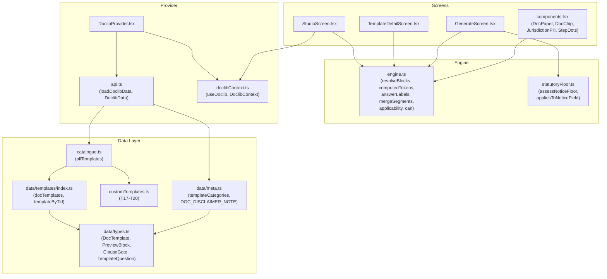
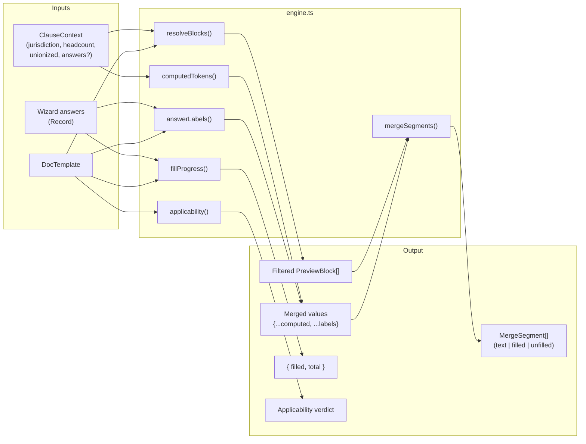
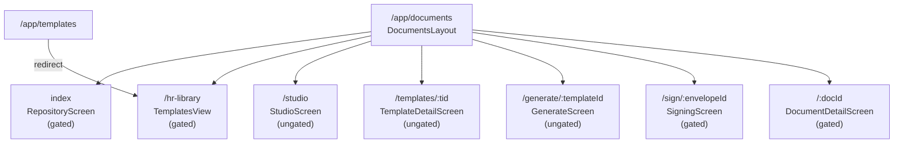
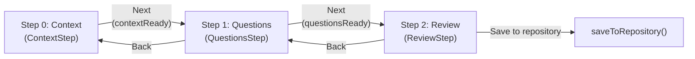
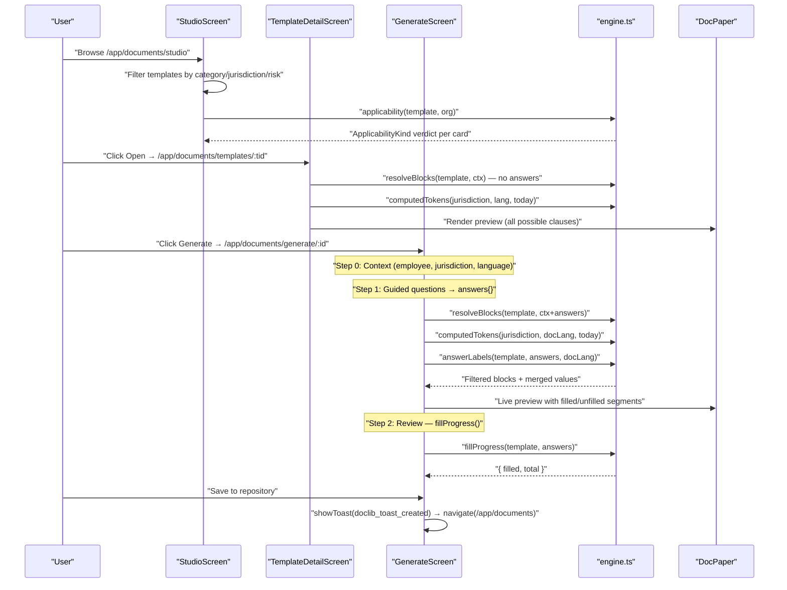

# Template Catalogue & Engine

<details>
<summary>Relevant source files</summary>

The following files were used as context for generating this wiki page:

- [docs/FOUR_RING_FRAMEWORK.md](docs/FOUR_RING_FRAMEWORK.md)
- [src/app/router.tsx](src/app/router.tsx)
- [src/features/app/AppProviders.tsx](src/features/app/AppProviders.tsx)
- [src/features/app/billing/PlanGate.tsx](src/features/app/billing/PlanGate.tsx)
- [src/features/app/docstudio/DocStudioOverlay.tsx](src/features/app/docstudio/DocStudioOverlay.tsx)
- [src/features/app/documents/**snapshots**/engine.test.ts.snap](src/features/app/documents/__snapshots__/engine.test.ts.snap)
- [src/features/app/documents/components.tsx](src/features/app/documents/components.tsx)
- [src/features/app/documents/data/meta.ts](src/features/app/documents/data/meta.ts)
- [src/features/app/documents/data/templates/authoredTemplates.test.ts](src/features/app/documents/data/templates/authoredTemplates.test.ts)
- [src/features/app/documents/data/templates/index.ts](src/features/app/documents/data/templates/index.ts)
- [src/features/app/documents/data/templates/t13-harassment-policy.ts](src/features/app/documents/data/templates/t13-harassment-policy.ts)
- [src/features/app/documents/data/templates/t24-undue-hardship-assessment.ts](src/features/app/documents/data/templates/t24-undue-hardship-assessment.ts)
- [src/features/app/documents/data/templates/t25-probationary-period-review.ts](src/features/app/documents/data/templates/t25-probationary-period-review.ts)
- [src/features/app/documents/data/templates/t26-promotion-salary-adjustment.ts](src/features/app/documents/data/templates/t26-promotion-salary-adjustment.ts)
- [src/features/app/documents/data/templates/t27-return-from-leave-confirmation.ts](src/features/app/documents/data/templates/t27-return-from-leave-confirmation.ts)
- [src/features/app/documents/data/templates/t28-attendance-policy.ts](src/features/app/documents/data/templates/t28-attendance-policy.ts)
- [src/features/app/documents/data/templates/t29-roe-preparation-guide.ts](src/features/app/documents/data/templates/t29-roe-preparation-guide.ts)
- [src/features/app/documents/data/templates/t30-reference-letter.ts](src/features/app/documents/data/templates/t30-reference-letter.ts)
- [src/features/app/documents/data/templates/t33-leave-request-form.ts](src/features/app/documents/data/templates/t33-leave-request-form.ts)
- [src/features/app/documents/data/templates/t34-sick-leave-policy.ts](src/features/app/documents/data/templates/t34-sick-leave-policy.ts)
- [src/features/app/documents/data/templates/t44-wellness-action-plan.ts](src/features/app/documents/data/templates/t44-wellness-action-plan.ts)
- [src/features/app/documents/data/types.ts](src/features/app/documents/data/types.ts)
- [src/features/app/documents/engine.test.ts](src/features/app/documents/engine.test.ts)
- [src/features/app/documents/engine.ts](src/features/app/documents/engine.ts)
- [src/features/app/documents/screens/GenerateScreen.test.tsx](src/features/app/documents/screens/GenerateScreen.test.tsx)
- [src/features/app/documents/screens/GenerateScreen.tsx](src/features/app/documents/screens/GenerateScreen.tsx)
- [src/features/app/documents/screens/TemplateDetailScreen.tsx](src/features/app/documents/screens/TemplateDetailScreen.tsx)
- [src/features/app/flows/data/dutyToAccommodate.ts](src/features/app/flows/data/dutyToAccommodate.ts)
- [src/features/app/flows/data/leaveOfAbsence.ts](src/features/app/flows/data/leaveOfAbsence.ts)
- [src/features/app/reference/data/functionalLimitations.ts](src/features/app/reference/data/functionalLimitations.ts)
- [src/features/app/views/templates/TemplatesView.test.tsx](src/features/app/views/templates/TemplatesView.test.tsx)
- [src/features/app/views/templates/TemplatesView.tsx](src/features/app/views/templates/TemplatesView.tsx)
- [src/i18n/messages/doclib.ts](src/i18n/messages/doclib.ts)

</details>

This page documents the template authoring system that powers Dutiva's HR Document Library. It covers the 50-template bilingual catalogue organized by the Four Ring Framework, the `engine.ts` resolution pipeline, jurisdiction-conditional clauses, the wizard-driven generation flow, and all surface-level screens.

## Architecture Overview

The template system spans four concerns: a **data layer** (typed template definitions), an **engine** (pure functions for merge-field resolution and clause gating), a **provider** (`DoclibProvider` managing state), and **screens** (UI surfaces for browsing, inspecting, generating, and signing documents).

**Template system to code entity mapping:**



Sources: [src/features/app/documents/catalogue.ts:1-24](), [src/features/app/documents/engine.ts:1-16](), [src/features/app/documents/api.ts:1-51](), [src/features/app/documents/DoclibProvider.tsx:1-8](), [src/features/app/documents/doclibContext.ts:1-36]()

## Template Data Model

### Core Type: `DocTemplate`

Defined in `data/types.ts`, `DocTemplate` is the schema for every template in the catalogue:

| Field                         | Type                                | Purpose                                                                               |
| ----------------------------- | ----------------------------------- | ------------------------------------------------------------------------------------- |
| `id`                          | `string`                            | Unique identifier, e.g. `'tpl_t01'`                                                   |
| `tid`                         | `string`                            | Display id, e.g. `'T01'` — used in routes and UI badges                               |
| `key`                         | `string`                            | Slug, e.g. `'offer_letter'`                                                           |
| `kind`                        | `string`                            | Document kind: `'letter'`, `'agreement'`, `'policy'`, `'checklist'`, `'record'`, etc. |
| `category`                    | `TemplateCategoryId`                | One of 10 lifecycle categories                                                        |
| `core`                        | `boolean`                           | Whether the template is marked as "Core" (essential)                                  |
| `name`                        | `Bi`                                | Bilingual display name                                                                |
| `desc`                        | `Bi`                                | Bilingual description                                                                 |
| `jurisdictions`               | `Jurisdiction[]`                    | Supported jurisdictions: `'ON'`, `'QC'`, `'FED'`                                      |
| `risk`                        | `DocRiskLevel`                      | `'low'` / `'medium'` / `'high'`                                                       |
| `review`                      | `ReviewStatus`                      | Review posture required                                                               |
| `requiresLawyerReview`        | `boolean`                           | Requires legal counsel before use                                                     |
| `version` / `versionNumber`   | `string` / `number`                 | Template version tracking                                                             |
| `effectiveDate` / `updatedAt` | `string`                            | ISO date strings                                                                      |
| `estMinutes`                  | `number`                            | Estimated wizard completion time                                                      |
| `usageCount`                  | `number`                            | Demo usage count                                                                      |
| `statutory`                   | `Bi[]`                              | Statutory references (bilingual)                                                      |
| `jurisdictionNotes`           | `Partial<Record<Jurisdiction, Bi>>` | Per-jurisdiction legal notes                                                          |
| `includes`                    | `Bi[]`                              | What the template covers                                                              |
| `questions`                   | `TemplateQuestion[]`                | Wizard questions for merge fields                                                     |
| `preview`                     | `PreviewBlock[]`                    | Ordered document blocks (the template body)                                           |
| `subject`                     | `TemplateSubject`                   | Who the document is about: `'candidate'`, `'employee'`, `'org'`, `'external'`         |
| `bodyHtmlEn?`                 | `string`                            | Optional full HTML body (handoff-era, EN-only)                                        |

Sources: [src/features/app/documents/data/types.ts:169-201]()

### `PreviewBlock` — Document Body Units

Each `PreviewBlock` is one rendered block in the document. The `type` field determines rendering:

| `type`     | Rendered as                                              | Key fields                 |
| ---------- | -------------------------------------------------------- | -------------------------- |
| `'title'`  | Centered bold heading                                    | `text`                     |
| `'meta'`   | Small centered metadata line (org · date · jurisdiction) | `text`                     |
| `'para'`   | Paragraph                                                | `text`                     |
| `'clause'` | Numbered legal clause with heading                       | `text`, `n`, `heading`     |
| `'fill'`   | Reader-fill form prompt with ruled lines                 | `text`, `heading`, `lines` |
| `'sig'`    | Signature lines                                          | `roles` (array of `Bi`)    |
| `'ack'`    | Italicized acknowledgement paragraph                     | `text`                     |
| `'note'`   | Callout box (info or risk severity)                      | `text`, `tone`             |

Every block may carry a `when?: ClauseGate` for conditional rendering.

Sources: [src/features/app/documents/data/types.ts:82-83](), [src/features/app/documents/data/types.ts:148-167]()

### `ClauseGate` — Conditional Clause Gates

`ClauseGate` controls whether a block renders. All present tests must pass (conjunction):

```typescript
interface ClauseGate {
  juris?: Jurisdiction // Only render for this jurisdiction
  min_headcount?: number // Only render when org headcount >= threshold
  union?: boolean // Only render for union (true) or non-union (false)
  answer?: { id: string; equals: string[] } // Only render when wizard answer matches
}
```

The `answer` gate was added in PR #128 for T40 (policy update notification), which asks whether a fresh acknowledgement is required and conditionally includes or omits the signature block.

Sources: [src/features/app/documents/data/types.ts:111-130]()

### `TemplateQuestion` — Wizard Inputs

Each question drives a merge field in the document body:

| Field                    | Type                       | Purpose                                                             |
| ------------------------ | -------------------------- | ------------------------------------------------------------------- |
| `id`                     | `string`                   | Matches `{{id}}` tokens in `PreviewBlock.text`                      |
| `section`                | `Bi`                       | Groups questions under a heading in the wizard                      |
| `label`                  | `Bi`                       | Input label                                                         |
| `type`                   | `QuestionType`             | `'text'`, `'textarea'`, `'date'`, `'number'`, `'select'`, `'radio'` |
| `required`               | `boolean`                  | Blocks generation when unfilled                                     |
| `placeholder?` / `hint?` | `Bi`                       | Input guidance                                                      |
| `options?`               | `TemplateQuestionOption[]` | For select/radio: `{ value, label: Bi }`                            |

Sources: [src/features/app/documents/data/types.ts:132-146]()

## Template Catalogue Organisation

### The Four Ring Framework

Templates are organized by an employment lifecycle category scheme, not by ring number. The framework doc records the mapping:

| Ring | Pillar                            | Question Answered                         | Category Mapping                                                                            |
| ---- | --------------------------------- | ----------------------------------------- | ------------------------------------------------------------------------------------------- |
| 1    | HR Compliance Core                | "What do I legally have to do?"           | `hiring`, `changes`, `agreements`, `policies`, `discipline`, `termination`, `accommodation` |
| 2    | Workplace Wellness                | "How do I support my employees properly?" | `accommodation` (Pillar B), `wellbeing` (Pillar C)                                          |
| 3    | Internal Communications           | "How do I communicate this to my team?"   | `communications`                                                                            |
| 4    | Compensation & Financial Literacy | "Am I paying fairly?"                     | `compensation`                                                                              |

Sources: [docs/FOUR_RING_FRAMEWORK.md:22-27](), [docs/FOUR_RING_FRAMEWORK.md:35-64]()

### Category Definitions

Ten categories are defined in `data/meta.ts`, ordered by the employment lifecycle:

| Order | `id`             | Ring | Templates                                   |
| ----- | ---------------- | ---- | ------------------------------------------- |
| 1     | `hiring`         | 1    | T01, T02, T09, T47, T49                     |
| 2     | `changes`        | 1    | T25, T26, T27                               |
| 3     | `agreements`     | 1    | T05, T07, T08                               |
| 4     | `policies`       | 1    | T04, T10, T11, T12, T13, T28, T34, T48, T50 |
| 5     | `discipline`     | 1    | T06, T16, T31                               |
| 6     | `accommodation`  | 1+2  | T19, T20, T21, T22, T23, T24                |
| 7     | `termination`    | 1    | T03, T14, T15, T17, T18, T29, T30, T32, T33 |
| 8     | `wellbeing`      | 2    | T44                                         |
| 9     | `compensation`   | 4    | T45, T46                                    |
| 10    | `communications` | 3    | T35–T43                                     |

Sources: [src/features/app/documents/data/meta.ts:56-224](), [src/features/app/documents/data/templates/index.ts:1-122]()

### Template Sources

Templates come from two files, unified by `catalogue.ts`:

1. **`data/templates/index.ts`** — 46 templates (T01–T16 handoff-generated, T21–T50 authored in-repo). Exports `docTemplates` array and `templateByTid` / `templateById` maps.
2. **`customTemplates.ts`** — 4 ported legacy templates (T17–T20) that bridge the old `src/data/documents.ts` fixture data.

The `allTemplates` array merges both sources, sorted by tid:

```typescript
export const allTemplates: DocTemplate[] = [...docTemplates, ...customTemplates].sort((a, b) =>
  a.tid.localeCompare(b.tid),
)
```

The tid numbering gap (T17–T20 in `customTemplates.ts`, T21+ in `data/templates/`) exists because the barrel file wins the `templateByTid.get(k) ?? customTemplateByTid.get(k)` lookup, so reusing a tid would silently shadow the custom template.

Sources: [src/features/app/documents/catalogue.ts:1-24](), [src/features/app/documents/data/templates/index.ts:1-122](), [src/features/app/documents/customTemplates.ts:1-527]()

## Engine: `engine.ts` Resolution Pipeline

The engine is a pure-function library with no side effects. It is the single source of truth for merge-field resolution, conditional clause evaluation, applicability determination, and role/action gating.

**Engine pipeline:**



Sources: [src/features/app/documents/engine.ts:1-295]()

### `gatePasses()` and `resolveBlocks()`

`gatePasses` evaluates a `ClauseGate` against a `ClauseContext`. All present tests must pass:

- `juris` — must match exactly
- `min_headcount` — context headcount must be ≥ threshold
- `union` — exact boolean match
- `answer` — if answers are supplied and the relevant answer is non-empty, it must be in the `equals` array. Unanswered or empty answers pass (the clause stays visible while the wizard is being filled in). When no `answers` object is provided (e.g. on `TemplateDetailScreen`), answer gates always pass, showing all possible clauses.

`resolveBlocks` filters a template's `preview` array to only the blocks whose gates pass:

```typescript
export function resolveBlocks(template: DocTemplate, ctx: ClauseContext): PreviewBlock[] {
  return template.preview.filter((block) => gatePasses(block.when, ctx))
}
```

Sources: [src/features/app/documents/engine.ts:43-60](), [src/features/app/documents/engine.test.ts:25-96]()

### `computedTokens()`

Four merge tokens are computed from the context rather than wizard answers:

| Token              | Source                                              |
| ------------------ | --------------------------------------------------- |
| `{{org}}`          | `DOC_ORG_NAME` constant                             |
| `{{today}}`        | The `today` parameter (formatted date string)       |
| `{{jurisdiction}}` | Localized jurisdiction name from `jurisdictionInfo` |
| `{{statute}}`      | Localized governing statute name                    |

```typescript
export function computedTokens(
  jurisdiction: Jurisdiction,
  lang: Lang,
  today: string,
): Record<string, string> {
  const info = jurisdictionInfo.find((j) => j.code === jurisdiction)
  return {
    org: DOC_ORG_NAME,
    today,
    jurisdiction: info ? pick(info.name, lang) : jurisdiction,
    statute: info ? pick(info.statute, lang) : '',
  }
}
```

Sources: [src/features/app/documents/engine.ts:73-85]()

### `answerLabels()`

Converts wizard answers from stored `option.value` keys to localized `option.label` text for select-type questions. Without this, a French document would render the English stored value (e.g. "2 weeks" instead of "2 semaines"). Free-text answers and unknown option values pass through unchanged.

Sources: [src/features/app/documents/engine.ts:87-117](), [src/features/app/documents/engine.test.ts:148-194]()

### `splitProseParagraphs()`

Splits template prose on `\n\n` first; when that yields a single chunk, splits on single newlines unless any line starts with `* ` (bullet list). Used by `DocPaper` for `'para'` and `'clause'` bodies and by `documentPlainText.ts` for export — so letter-style line breaks render as separate paragraphs without manual block splitting in template data.

Sources: [src/features/app/documents/engine.ts:161-178](), [src/features/app/documents/components.tsx:166-180](), [src/features/app/documents/engine.test.ts:318-335]()

### `mergeSegments()`

Splits block text on `{{token}}` boundaries into typed segments for the live-preview renderer:

| `kind`       | Meaning                    | Styling                                        |
| ------------ | -------------------------- | ---------------------------------------------- |
| `'text'`     | Literal text               | Normal                                         |
| `'filled'`   | Token with a value present | Accent background highlight                    |
| `'unfilled'` | Token with no value yet    | Warning background, human-readable placeholder |

```typescript
const TOKEN_RE = /\{\{([a-z0-9_]+)\}\}/g
```

Unfilled tokens render the token name with underscores replaced by spaces (e.g. `{{candidate_name}}` → "candidate name").

Sources: [src/features/app/documents/engine.ts:119-144](), [src/features/app/documents/engine.test.ts:127-139]()

### `fillProgress()`

Counts answer-backed tokens only (excludes `org`, `today`, `jurisdiction`, `statute`):

```typescript
export function fillProgress(
  template: DocTemplate,
  answers: Record<string, string>,
): { filled: number; total: number }
```

Sources: [src/features/app/documents/engine.ts:162-170]()

### `applicability()`

Determines how a template applies to the current `OrgProfile`. Precedence:

1. **Collective agreement** — if the template has union-gated blocks and the org is unionized → `'union'`
2. **Template-level size trigger** — e.g. T15 (group termination) triggers at 50+ employees → `'required'` or `'below'`
3. **Clause-level size gates** — e.g. T01's disconnect-from-work clause at 25+ → `'required'`
4. **Default** → `'applies'`

The `TEMPLATE_SIZE_TRIGGERS` map is: `{ T15: 50 }`.

Sources: [src/features/app/documents/engine.ts:172-235](), [src/features/app/documents/engine.test.ts:98-125]()

### Role & Document Action Gating

`can(role, capability)` checks the handoff's capability matrix. `docActionsFor(doc, role)` returns available actions based on role permissions and document status:

| Action               | Required capability  | Status constraints                               |
| -------------------- | -------------------- | ------------------------------------------------ |
| `edit`               | `edit`               | Not from signed/exported/archived/voided/deleted |
| `request_review`     | `request_review`     | Only from draft/needs_revision                   |
| `approve`            | `approve_review`     | Only from in_review                              |
| `send_for_signature` | `send_for_signature` | Only from approved                               |
| `export`             | `export`             | Not from archived/voided/deleted                 |
| `archive`            | `archive`            | Not from archived/voided/deleted                 |
| `restore`            | `restore`            | Only from archived                               |
| `void`               | `void`               | Not from voided/deleted/archived                 |

Sources: [src/features/app/documents/engine.ts:237-294](), [src/features/app/documents/engine.test.ts:205-240]()

## Statutory Floor Checking

`statutoryFloor.ts` checks hand-entered notice figures against the statutory minimum during template generation. It applies only to individual termination letters (T03) — not group termination (T15), because group notice is headcount-based (ESA s. 58), not tenure-based (ESA s. 57).

The `appliesToNoticeField` function gates applicability: the check only fires when the field is `notice_weeks` AND the template also collects `tenure_years`.

`assessNoticeFloor` returns one of five verdicts:

| Verdict            | Meaning                                                   |
| ------------------ | --------------------------------------------------------- |
| `'unavailable'`    | No grounded schedule for this jurisdiction (QC, FED)      |
| `'unknown-tenure'` | Tenure not yet entered                                    |
| `'informational'`  | Floor known, nothing entered — show as guidance           |
| `'meets'`          | Entered value ≥ statutory floor                           |
| `'below'`          | Entered value < statutory floor — triggers `role="alert"` |

The system deliberately advises rather than autofills: pre-filling the statutory floor would nudge employers toward the legal minimum when common-law reasonable notice is often much higher.

Sources: [src/features/app/documents/statutoryFloor.ts:1-105]()

## DoclibProvider & Data Loading

### `api.ts` — Data Source

`loadDoclibData()` returns bundled fixture data (no network call). The demo schema was dropped in migration `0021_drop_doclib_demo_schema.sql`. The `DoclibData` interface bundles:

- `templates` — from `allTemplates` (catalogue.ts)
- `categories` — from `templateCategories` (meta.ts)
- `documents` — from `sampleDocuments` (documents.ts)
- `employees` — from `docEmployees` (employees.ts)
- `cases` — from `docCases` (cases.ts)
- `source: 'fixtures'`

Sources: [src/features/app/documents/api.ts:1-51]()

### `DoclibProvider`

`DoclibProvider` manages feature state: the loaded catalogue, the "Viewing as" role (prototype permission demo), and the editable org compliance profile. It also provides `sendForSignature` and `applySignature` callbacks that mutate in-memory document state.

The initial role is read from `sessionStorage` under key `'dutiva-doclib-role'` (defaults to `'hr'`). The org profile starts from `defaultOrgProfile` (38 employees, non-union, Ontario, technology sector).

Sources: [src/features/app/documents/DoclibProvider.tsx:1-234](), [src/features/app/documents/doclibContext.ts:1-36]()

### `DoclibContext`

```typescript
interface DoclibContextValue {
  data: DoclibData | null // null while loading
  role: WorkspaceRole
  setRole: (role: WorkspaceRole) => void
  org: OrgProfile
  setOrg: (org: OrgProfile) => void
  sendForSignature: (docId: string, recipients: DocRecipient[]) => GeneratedDoc | undefined
  applySignature: (envelopeId, email, payload) => GeneratedDoc | undefined
  getDocumentForEnvelope: (envelopeId: string) => GeneratedDoc | undefined
}
```

Sources: [src/features/app/documents/doclibContext.ts:11-28]()

## Routing & Screen Architecture

### Route Table

All document screens are nested under `DocumentsLayout` at `/app/documents`:



`StudioScreen`, `TemplateDetailScreen`, and `GenerateScreen` are **ungated** — the template catalogue is real product content. Only the fixture-driven screens (repository, document detail, signing, HR library) are wrapped in `ModeGate`.

Sources: [src/app/appViews.tsx:153-166](), [src/app/appViews.tsx:9-22]()

### `DocumentsLayout`

Provides three shared concerns:

1. **`DoclibProvider`** — mounts the feature provider for all child screens
2. **`DocumentsTabs`** — three-tab nav: HR Library → Document Library → Document Studio
3. **`ViewingAsBar`** — role-switching control (prototype-only permission demo)

Sources: [src/features/app/documents/DocumentsLayout.tsx:1-103]()

## Screen: StudioScreen (Document Studio)

`StudioScreen` at `/app/documents/studio` is the primary template library. It renders:

1. **Header** — eyebrow, title ("Template library"), count badges for templates and jurisdictions
2. **OrgProfileBar** — live-editable org compliance profile (headcount slider, sector select, union toggle) that drives applicability chips on every card
3. **Toolbar** — search input, category/jurisdiction/risk dropdown filters
4. **Template grid** — cards grouped by `TemplateCategory.order`, each showing tid badge, risk chip, name, description, jurisdiction pills, applicability chip, version/time/usage metadata, and Open/Generate CTAs

The search placeholder dynamically includes the catalogue size: `"Search 50 templates…"`.

Each `TemplateCard` links to:

- **Open** → `/app/documents/templates/:tid` (TemplateDetailScreen)
- **Generate** → `/app/documents/generate/:id` (GenerateScreen)

Sources: [src/features/app/documents/screens/StudioScreen.tsx:247-448](), [src/features/app/documents/screens/StudioScreen.tsx:150-221]()

## Screen: TemplateDetailScreen

`TemplateDetailScreen` at `/app/documents/templates/:tid` shows a two-column layout:

**Left column:**

- Tid badge, risk chip, review flag
- Template name (h1), version/updated/est-time metadata
- Review-posture callout (lawyer review / HR review warning)
- About section (description)
- Applicability verdict based on current `org` profile (via `applicability()`)
- Supported jurisdictions with per-jurisdiction legal notes
- What's included / statutory references lists

**Right rail (sticky):**

- Sample preview rendered via `DocPaper` using `resolveBlocks()` and `computedTokens()`
- "Generate document" CTA linking to `/app/documents/generate/:id`
- `Disclaimer` component

On the template detail preview, no `answers` are passed to `resolveBlocks`, so answer-gated blocks render (showing everything the template can produce).

Sources: [src/features/app/documents/screens/TemplateDetailScreen.tsx:145-351]()

## Screen: GenerateScreen (Wizard)

`GenerateScreen` at `/app/documents/generate/:templateId` implements a 3-step wizard with sticky live preview.

### Wizard State

```typescript
interface WizardState {
  step: 0 | 1 | 2 // Context → Questions → Review
  employeeId?: string
  caseId?: string
  jurisdiction: Jurisdiction
  language: 'en' | 'fr' // Document language (independent of UI locale)
  answers: Record<string, string>
  saveState: SaveState // 'unsaved' | 'saving' | 'saved'
}
```

Sources: [src/features/app/documents/screens/GenerateScreen.tsx:50-58]()

### Three-step wizard flow:



**Step 0 — Context:** Employee/candidate picker (optional or required based on `template.subject`), case file picker, jurisdiction segmented control (ON/QC/FED), document language toggle (EN/FR). When an employee is selected, the name question is pre-filled via `prefilledAnswers()`.

**Step 1 — Guided Questions:** Questions grouped by `section` via `groupQuestions()`. Each `QuestionField` renders as the appropriate input type (text, textarea, select, radio, date, number). For termination templates, the `notice_weeks` field includes a statutory floor check via `assessNoticeFloor()`.

**Step 2 — Review & Risk Check:** Fill progress bar (`fillProgress()`), risk/review chips, jurisdiction/language summary, and required-field validation. Missing required fields are listed in a warning banner.

### Live Preview

A sticky right-column `DocPaper` renders `resolveBlocks()` output with merged values from `computedTokens()` + `answerLabels()`. The `docLang` prop ensures the document renders in its own language (not the UI locale).

### Simulated Autosave

Each answer change triggers a simulated autosave cycle: `unsaved` → 800ms debounce → `saving` → 650ms settle → `saved`. This is prototype-only; no data persists.

Sources: [src/features/app/documents/screens/GenerateScreen.tsx:610-928](), [src/features/app/documents/screens/GenerateScreen.tsx:321-335]()

## Screen: TemplatesView (HR Library)

`TemplatesView` at `/app/documents/hr-library` is the legacy template gallery from the original prototype. It renders a responsive auto-fill grid of template tiles from the `documentTemplates` fixture data. Clicking a tile calls `openDocFromLibrary()` on the `DocStudioProvider`, opening the `DocStudioOverlay` drawer.

This view honours global-search navigation: arriving with `location.state` containing `TemplatesSearchNavState { docKey }` auto-opens that template on mount, then clears the state via `navigate(path, { replace: true, state: null })`.

Sources: [src/features/app/views/templates/TemplatesView.tsx:1-74](), [src/features/app/views/templates/TemplatesView.test.tsx:1-70]()

## DocPaper — Rendered Document Component

`DocPaper` is the shared rendering component used by `TemplateDetailScreen`, `GenerateScreen`, and `DocumentDetailScreen`. It accepts pre-resolved blocks and merged values, rendering each block type with appropriate typography:

- `'title'` → centered bold display heading
- `'meta'` → centered small metadata line
- `'clause'` → numbered heading + paragraph body with merge-field highlighting (body split via `splitProseParagraphs()`)
- `'fill'` → italic guidance prompt + ruled lines for handwritten answers
- `'sig'` → signature-line grid
- `'note'` → callout box (risk = red, info = accent)
- `'ack'` → italicized acknowledgement
- `'para'` → one or more paragraphs via `splitProseParagraphs()` on the block body

Merge fields are rendered via `MergeSegmentSpan`: filled tokens get an accent background, unfilled tokens get a warning background.

The `docLang` prop controls which language branch of `Bi` values to render. When omitted (as in `TemplateDetailScreen`), it falls back to the UI locale.

Sources: [src/features/app/documents/components.tsx:183-312](), [src/features/app/documents/components.tsx:137-161]()

## Jurisdiction-Conditional Clauses in Practice

Conditional clauses are a key feature of the bilingual template engine. Here are the documented clause-gate patterns used across the catalogue:

| Template            | Gate                                           | Effect                                                   |
| ------------------- | ---------------------------------------------- | -------------------------------------------------------- |
| T01 (Offer letter)  | `{ juris: 'ON', min_headcount: 25 }`           | Disconnecting-from-work clause (Ontario 25+ requirement) |
| T03, T06, T15, T16  | `{ union: true }`                              | Collective-agreement clause for unionized orgs           |
| T40 (Policy update) | `{ answer: { id: 'reack', equals: ['yes'] } }` | Signature page only when acknowledgement requested       |
| Various             | `{ juris: 'QC' }`                              | Quebec-specific Civil Code provisions                    |

The test suite in `engine.test.ts` exercises these patterns with a `(template × jurisdiction × headcount × union)` matrix, including snapshot tests for T03's clause text stability.

Sources: [src/features/app/documents/engine.test.ts:25-96]()

## Test Coverage

### `authoredTemplates.test.ts`

Runs structural guards on every in-repo-authored template (T21+):

1. **Jurisdiction coverage** — every template covers all three jurisdictions, each with a note
2. **Category validity** — sits in a defined category
3. **Risk consistency** — high risk → lawyer review required
4. **Bilingual completeness** — every `Bi` string has non-empty EN and FR, FR ≠ EN for prose, no markdown in copy
5. **Merge-field resolution** — every `{{token}}` maps to a question or computed token
6. **Full fill check** — answering all questions leaves no unfilled fields (tested per-jurisdiction)

Whole-catalogue guards (T01–T50):

- **Clause numbering** — no duplicate clause numbers within any jurisdiction's resolved blocks
- **Disclaimer presence** — every template carries `DOC_DISCLAIMER_NOTE` as a `note` block
- **Disclaimer purity** — the disclaimer note is exactly the canonical text, not appended to

Sources: [src/features/app/documents/data/templates/authoredTemplates.test.ts:1-145](), [src/features/app/documents/data/templates/authoredTemplates.test.ts:149-260]()

### `engine.test.ts`

Covers the core engine functions:

- Conditional clause evaluation matrix
- Applicability engine (size triggers, union precedence, clause-level gates)
- Merge-field splitting and computed token localization
- `answerLabels` select resolution across the whole catalogue
- Role/status action gating

Sources: [src/features/app/documents/engine.test.ts:1-240]()

## Complete Data Flow: Template to Generated Document



Sources: [src/features/app/documents/screens/StudioScreen.tsx:247-448](), [src/features/app/documents/screens/TemplateDetailScreen.tsx:145-351](), [src/features/app/documents/screens/GenerateScreen.tsx:610-928]()

## Custom Templates (T17–T20)

Four templates in `customTemplates.ts` port content from the legacy `src/data/documents.ts` fixtures:

| Tid | Name                               | Category        | Risk |
| --- | ---------------------------------- | --------------- | ---- |
| T17 | Full & final release               | `termination`   | high |
| T18 | Offboarding checklist              | `termination`   | low  |
| T19 | Accommodation documentation        | `accommodation` | high |
| T20 | Medical information request letter | `accommodation` | high |

T19 and T20 were moved from `discipline` to `accommodation` to correct a categorical error. They were rewritten for ON/QC/FED coverage (originally BC-only content) since the `Jurisdiction` type only models `'ON' | 'QC' | 'FED'`.

Sources: [src/features/app/documents/customTemplates.ts:1-527]()

## Shared Disclaimer Pattern

All templates must carry `DOC_DISCLAIMER_NOTE` as a `note` block. This note is composed from the canonical `common.disclaimer` string with a document-specific prefix:

```typescript
export const DOC_DISCLAIMER_NOTE: Bi = {
  en: `Review before use. ${common.disclaimer.en}`,
  fr: `À réviser avant usage. ${common.disclaimer.fr}`,
}
```

The `authoredTemplates.test.ts` test suite enforces that every template includes this exact note and does not append additional text to it.

Sources: [src/features/app/documents/data/meta.ts:26-48](), [src/features/app/documents/data/templates/authoredTemplates.test.ts:173-220]()

## Key File Inventory

| File                                         | Role                                                                                                                                        |
| -------------------------------------------- | ------------------------------------------------------------------------------------------------------------------------------------------- |
| `documents/data/types.ts`                    | Core type definitions: `DocTemplate`, `PreviewBlock`, `ClauseGate`, `TemplateQuestion`, etc.                                                |
| `documents/data/meta.ts`                     | Category definitions, risk/review/status metadata, `DOC_DISCLAIMER_NOTE`                                                                    |
| `documents/data/templates/index.ts`          | 46-template barrel, `templateByTid`, `templateById` maps                                                                                    |
| `documents/customTemplates.ts`               | 4 ported legacy templates (T17–T20)                                                                                                         |
| `documents/catalogue.ts`                     | `allTemplates` — unified, tid-sorted catalogue from both sources                                                                            |
| `documents/engine.ts`                        | Pure functions: `resolveBlocks`, `computedTokens`, `answerLabels`, `mergeSegments`, `fillProgress`, `applicability`, `can`, `docActionsFor` |
| `documents/statutoryFloor.ts`                | Notice-floor checking for termination templates                                                                                             |
| `documents/api.ts`                           | `loadDoclibData()` — returns bundled fixture data                                                                                           |
| `documents/DoclibProvider.tsx`               | Feature state provider (catalogue, role, org profile, signature actions)                                                                    |
| `documents/doclibContext.ts`                 | `DoclibContext`, `useDoclib()` hook                                                                                                         |
| `documents/components.tsx`                   | `DocPaper`, `DocChip`, `JurisdictionPill`, `StepDots`, `ActBtn`                                                                             |
| `documents/DocumentsLayout.tsx`              | Shared layout with tabs and role bar                                                                                                        |
| `documents/screens/StudioScreen.tsx`         | Template library with filters and org profile bar                                                                                           |
| `documents/screens/TemplateDetailScreen.tsx` | Single-template detail with preview                                                                                                         |
| `documents/screens/GenerateScreen.tsx`       | 3-step generation wizard with live preview                                                                                                  |
| `views/templates/TemplatesView.tsx`          | Legacy template gallery (HR Library tab)                                                                                                    |
| `i18n/messages/doclib.ts`                    | 215+ bilingual i18n keys for the document library                                                                                           |
| `docs/FOUR_RING_FRAMEWORK.md`                | Four Ring Framework documentation                                                                                                           |
| `data/templates/authoredTemplates.test.ts`   | Structural test suite for all templates                                                                                                     |
| `documents/engine.test.ts`                   | Engine function test suite                                                                                                                  |

---
