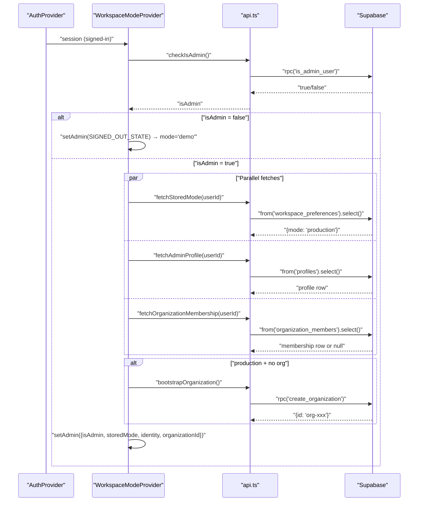
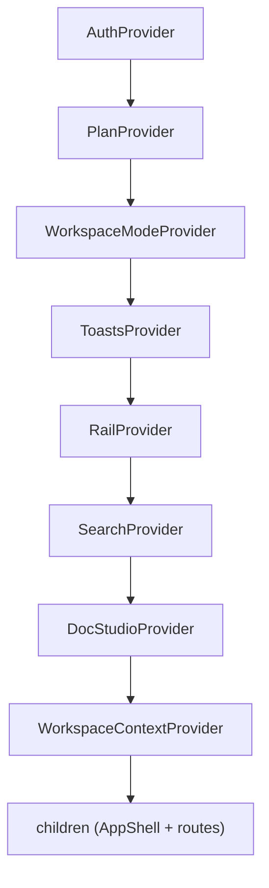
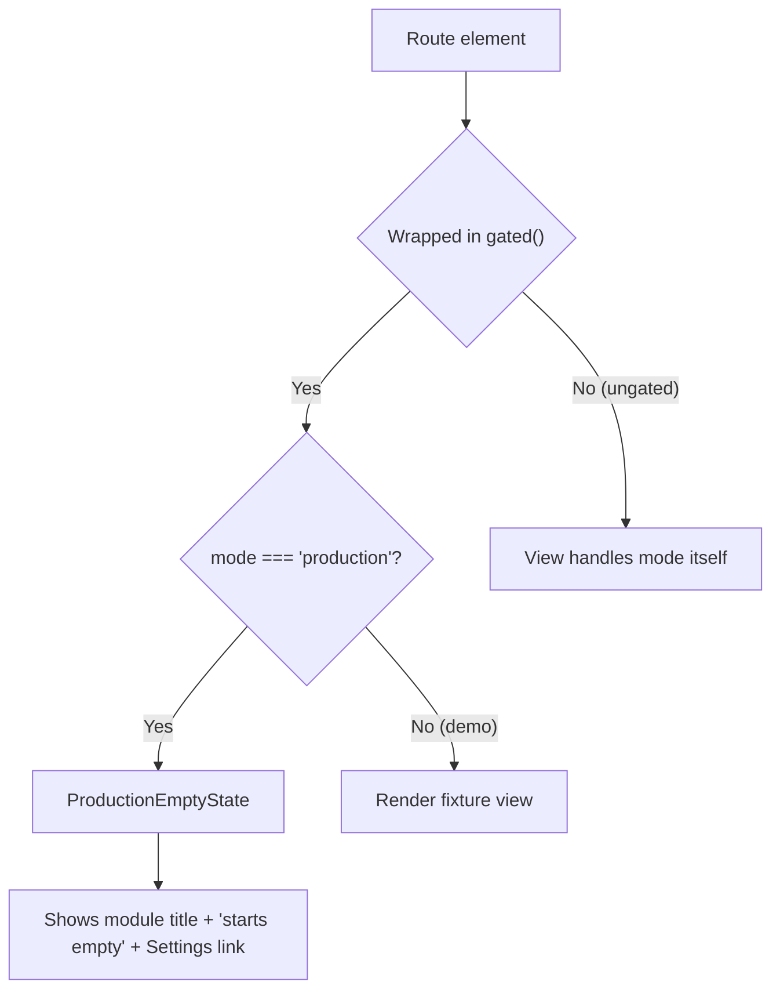
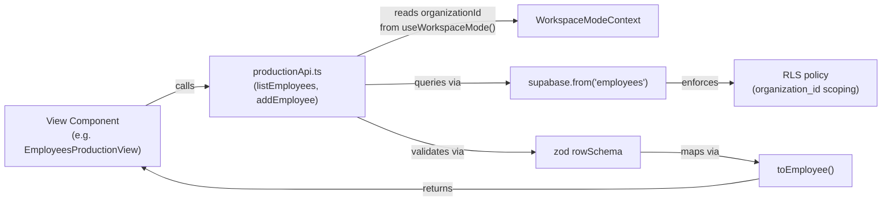
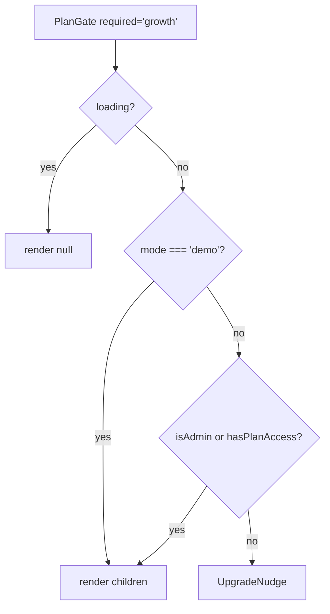
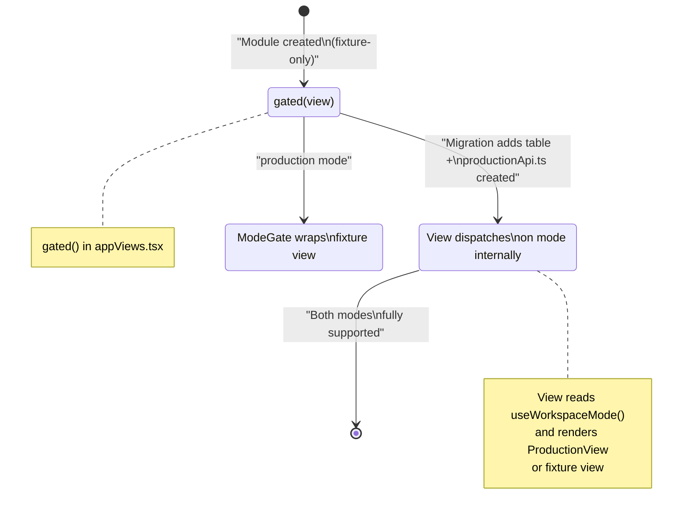

# Workspace Mode & Provider Stack

<details>
<summary>Relevant source files</summary>

The following files were used as context for generating this wiki page:

- [CONVENTIONS.md](CONVENTIONS.md)
- [src/app/router.tsx](src/app/router.tsx)
- [src/features/app/AppProviders.tsx](src/features/app/AppProviders.tsx)
- [src/features/app/billing/PlanGate.tsx](src/features/app/billing/PlanGate.tsx)
- [src/features/app/docstudio/DocStudioOverlay.tsx](src/features/app/docstudio/DocStudioOverlay.tsx)
- [src/features/app/views/employees/EmployeesProductionView.tsx](src/features/app/views/employees/EmployeesProductionView.tsx)
- [src/features/app/views/home/HomeCompliancePanel.tsx](src/features/app/views/home/HomeCompliancePanel.tsx)
- [src/features/app/views/home/HomeProductionView.tsx](src/features/app/views/home/HomeProductionView.tsx)
- [src/features/app/views/home/HomeView.test.tsx](src/features/app/views/home/HomeView.test.tsx)
- [src/features/app/views/home/HomeView.tsx](src/features/app/views/home/HomeView.tsx)
- [src/features/app/views/home/HomeWorkflowsCard.tsx](src/features/app/views/home/HomeWorkflowsCard.tsx)
- [src/features/app/views/settings/SettingsView.test.tsx](src/features/app/views/settings/SettingsView.test.tsx)
- [src/features/app/views/templates/TemplatesView.test.tsx](src/features/app/views/templates/TemplatesView.test.tsx)
- [src/features/app/views/templates/TemplatesView.tsx](src/features/app/views/templates/TemplatesView.tsx)
- [src/features/app/workspaceMode/ProductionEmptyState.tsx](src/features/app/workspaceMode/ProductionEmptyState.tsx)
- [src/features/app/workspaceMode/WorkspaceModeProvider.test.tsx](src/features/app/workspaceMode/WorkspaceModeProvider.test.tsx)
- [src/features/app/workspaceMode/WorkspaceModeProvider.tsx](src/features/app/workspaceMode/WorkspaceModeProvider.tsx)
- [src/features/app/workspaceMode/api.test.ts](src/features/app/workspaceMode/api.test.ts)
- [src/features/app/workspaceMode/api.ts](src/features/app/workspaceMode/api.ts)
- [src/features/app/workspaceMode/workspaceModeContext.ts](src/features/app/workspaceMode/workspaceModeContext.ts)
- [src/i18n/messages/home.ts](src/i18n/messages/home.ts)
- [src/i18n/messages/settings.ts](src/i18n/messages/settings.ts)

</details>

The Dutiva workspace supports two runtime modes — **demo** and **production** — that determine whether every module renders fixture data (the "Northgate Logistics Inc." prototype experience) or real Supabase-backed records scoped to an organization. This page covers the mode resolution lifecycle, the `AppProviders` composition tree, the per-module `productionApi.ts` data boundary pattern, and the phased rollout strategy for ungating modules.

## Workspace Mode Overview

`WorkspaceMode` is a discriminated string literal: `'demo' | 'production'`. Demo mode is the default for every visitor — it shows the full product with bilingual fixture data. Production mode activates only for a signed-in, RPC-confirmed admin who has explicitly stored that preference.

[src/features/app/workspaceMode/workspaceModeContext.ts:5-5]()

| Condition                                           | Resolved Mode |
| --------------------------------------------------- | ------------- |
| Supabase not configured (`supabase` is null)        | `demo`        |
| Signed out or auth loading                          | `demo`        |
| Signed in, `is_admin_user()` RPC returns false      | `demo`        |
| Signed in admin, no stored preference               | `demo`        |
| Signed in admin, stored preference = `'production'` | `production`  |

Sources: [src/features/app/workspaceMode/WorkspaceModeProvider.tsx:138-141](), [src/features/app/workspaceMode/api.ts:33-41]()

## WorkspaceModeProvider Resolution Lifecycle

`WorkspaceModeProvider` sits inside `AuthProvider` and reads the auth session to resolve the mode. On mount (or when the session changes), it runs an async `load()` sequence:

1. **Admin check** — calls `checkIsAdmin()`, which invokes the `is_admin_user()` Supabase RPC. Returns `false` if Supabase is unconfigured, the RPC errors, or the user is not an admin. [src/features/app/workspaceMode/api.ts:33-41]()
2. **Parallel fetch** — if admin, fetches three things concurrently via `Promise.all`: stored mode preference from `workspace_preferences`, admin profile from `profiles`, and organization membership from `organization_members`. [src/features/app/workspaceMode/WorkspaceModeProvider.tsx:73-77]()
3. **Org provisioning** — if the stored mode is `'production'` but no organization membership exists, calls `bootstrapOrganization()` which invokes the `create_organization()` RPC. This SECURITY DEFINER function atomically creates the org and inserts the caller as its active owner. [src/features/app/workspaceMode/api.ts:106-121](), [src/features/app/workspaceMode/WorkspaceModeProvider.tsx:87-89]()
4. **Identity assembly** — builds a `WorkspaceIdentity` from the profile (company name, contact name, province, city, email). In demo mode, this falls back to `DEMO_IDENTITY` (Northgate Logistics Inc.). [src/features/app/workspaceMode/WorkspaceModeProvider.tsx:19-19](), [src/features/app/workspaceMode/WorkspaceModeProvider.tsx:93-109]()

### Resolution Lifecycle Diagram



Sources: [src/features/app/workspaceMode/WorkspaceModeProvider.tsx:56-117](), [src/features/app/workspaceMode/api.ts:1-142]()

## Mode Toggle Persistence

The mode toggle is rendered only for confirmed admins (in SettingsView). Switching calls `setMode(next)` on the context, which:

1. Persists via `saveStoredMode()` — upserts the `workspace_preferences` table row keyed by `user_id`. [src/features/app/workspaceMode/api.ts:58-68]()
2. On first switch to production with no existing org, provisions via `bootstrapOrganization()`. [src/features/app/workspaceMode/WorkspaceModeProvider.tsx:128-130]()
3. Updates local state so the UI re-renders immediately. [src/features/app/workspaceMode/WorkspaceModeProvider.tsx:133-133]()

The `setMode` callback is a no-op for non-admins — the toggle UI is never rendered for them. [src/features/app/workspaceMode/WorkspaceModeProvider.tsx:121-121]()

Sources: [src/features/app/workspaceMode/WorkspaceModeProvider.tsx:119-136](), [src/features/app/views/settings/SettingsView.test.tsx:110-177]()

## WorkspaceModeContext Shape

The context value exposes everything downstream consumers need:

| Field            | Type                      | Description                                            |
| ---------------- | ------------------------- | ------------------------------------------------------ |
| `mode`           | `'demo' \| 'production'`  | Resolved mode                                          |
| `isAdmin`        | `boolean`                 | Real `is_admin_user()` RPC result                      |
| `identity`       | `WorkspaceIdentity`       | Northgate fixtures (demo) or real profile (production) |
| `organizationId` | `string \| null`          | The admin's org ID; always `null` in demo              |
| `memberRole`     | `OrgMemberRole \| null`   | From `organization_members.role`                       |
| `isOrgAdmin`     | `boolean`                 | Client mirror of RLS's `is_org_admin`                  |
| `setMode`        | `(mode) => Promise<void>` | Persists and switches mode                             |

The `useWorkspaceMode()` hook provides access and throws if called outside the provider. [src/features/app/workspaceMode/workspaceModeContext.ts:52-56]()

Sources: [src/features/app/workspaceMode/workspaceModeContext.ts:1-57]()

## Organization Member Roles

The `roles.ts` module defines the role vocabulary that mirrors the database's `organization_members.role` column:

```
viewer (0) → member (1) → manager (2) → admin (3) → owner (4)
```

Key predicates:

- `isAdminRole(role)` — true for `admin` or `owner`, matching RLS's `is_org_admin`. [src/features/app/workspaceMode/roles.ts:30-32]()
- `roleAtLeast(role, min)` — rank comparison for future role-gated surfaces. [src/features/app/workspaceMode/roles.ts:24-27]()

Sources: [src/features/app/workspaceMode/roles.ts:1-33]()

## Defensive Degradation in api.ts

Every function in `api.ts` wraps its Supabase call in a `try/catch` and checks for `null` client. This ensures the workspace mode system **never throws and strands the app**:

- `checkIsAdmin()` → returns `false` on any failure [src/features/app/workspaceMode/api.ts:33-41]()
- `fetchStoredMode()` → returns `'demo'` on any failure [src/features/app/workspaceMode/api.ts:43-56]()
- `fetchAdminProfile()` → returns `null` on any failure [src/features/app/workspaceMode/api.ts:123-142]()
- `bootstrapOrganization()` → returns `null` on any failure [src/features/app/workspaceMode/api.ts:106-121]()

This contrasts with the per-module `productionApi.ts` files (covered below), which **throw** on failure — they only run for signed-in admins in production mode where errors must surface.

Sources: [src/features/app/workspaceMode/api.ts:24-30](), [src/features/app/workspaceMode/api.test.ts:15-24]()

## AppProviders Composition

`AppProviders` is the workspace-scoped provider tree wrapping all `/app` routes. The nesting order is significant — each provider depends on those above it.

[src/features/app/AppProviders.tsx:25-43]()



### Provider Dependency Rationale

| Provider                   | Why it must be at this position                                                                                                                                                                                              |
| -------------------------- | ---------------------------------------------------------------------------------------------------------------------------------------------------------------------------------------------------------------------------- |
| `AuthProvider`             | Outermost — tracks Supabase session. Everything else reads auth state. [src/features/app/auth/AuthProvider.tsx:16-134]()                                                                                                     |
| `PlanProvider`             | Reads auth session to resolve user's billing plan from `profiles`. Must be inside `AuthProvider` but outside `WorkspaceModeProvider` (plan gates check mode themselves). [src/features/app/billing/PlanProvider.tsx:29-95]() |
| `WorkspaceModeProvider`    | Reads session from `useAuth()` to resolve demo/production. [src/features/app/workspaceMode/WorkspaceModeProvider.tsx:53-53]()                                                                                                |
| `ToastsProvider`           | Independent state (toast queue with 3600ms auto-dismiss), but must wrap `DocStudioProvider` which fires "draft ready" toasts. [src/features/app/toasts/ToastsProvider.tsx:9-45]()                                            |
| `RailProvider`             | Advisor contextual rail — manages slide-over state plus a streaming engine instance. [src/features/app/rail/RailProvider.tsx:29-98]()                                                                                        |
| `SearchProvider`           | Global search overlay state with ⌘K keyboard binding. [src/features/app/search/SearchProvider.tsx:5-25]()                                                                                                                    |
| `DocStudioProvider`        | Document Studio overlay state. Reads `AuthContext` and `WorkspaceModeContext` optionally for export protection identity. [src/features/app/docstudio/DocStudioProvider.tsx:141-149]()                                        |
| `WorkspaceContextProvider` | "Advisor is using …" pinned-entity banner state. Innermost. [src/features/app/workspaceContext/WorkspaceContextProvider.tsx:6-27]()                                                                                          |

Sources: [src/features/app/AppProviders.tsx:1-43]()

## ModeGate and gated() Wrapper

`ModeGate` is the route-level gate that controls whether a fixture-driven view renders or is replaced by `ProductionEmptyState`. [src/features/app/workspaceMode/ModeGate.tsx:20-29]()

The `gated()` helper in `appViews.tsx` wraps a view's element in `ModeGate`:

```typescript
function gated(view: ReactNode) {
  return <ModeGate>{view}</ModeGate>
}
```

[src/app/appViews.tsx:23-25]()

### Decision Flow



`ProductionEmptyState` renders a shared empty state with the module's label (derived from the route via `moduleLabelFor()`), an explanation that the production workspace starts empty, and a link to Settings where the demo/production toggle lives. [src/features/app/workspaceMode/ProductionEmptyState.tsx:13-47](), [src/features/app/shell/navLabels.ts:59-64]()

Sources: [src/features/app/workspaceMode/ModeGate.tsx:1-29](), [src/features/app/workspaceMode/ModeGate.test.tsx:29-71]()

## Per-Module productionApi.ts Boundary Pattern

Each workspace module that has gained real persistence exposes a `productionApi.ts` file — a strict data boundary between the React view and Supabase. These files follow a consistent contract:

1. **Zod-validated rows** — every row from Supabase is parsed through a `z.object()` schema before being returned
2. **Org-scoped queries** — every read/write includes `.eq('organization_id', organizationId)` (RLS enforces this server-side too)
3. **Throws on failure** — unlike `api.ts` in the workspace mode module, these throw errors because they only run for signed-in admins where failures must surface
4. **Snake-to-camel mapping** — a `toXxx()` function converts database column names to TypeScript interface fields

### productionApi.ts Inventory

| Module         | File                                    | DB Table(s)                                                        | Key Functions                                                                                                                                   |
| -------------- | --------------------------------------- | ------------------------------------------------------------------ | ----------------------------------------------------------------------------------------------------------------------------------------------- |
| Employees      | `views/employees/productionApi.ts`      | `employees`, `hr_expiry_records`, `hr_leaves`, `hr_employee_notes` | `listEmployees`, `addEmployee`, `removeEmployee`, `getEmployee`, `updateEmployeeStatus`, `listExpiryRecords`, `listLeaves`, `listEmployeeNotes` |
| Cases          | `views/cases/productionApi.ts`          | `hr_cases`, `hr_case_notes`                                        | `listCases`, `addCase`, `updateCaseStatus`, `removeCase`, `getCase`, `listCaseNotes`, `countOpenCases`                                          |
| Tasks          | `views/tasks/productionApi.ts`          | `compliance_tasks`                                                 | `listTasks`, `addTask`, `setTaskDone`, `removeTask`, `countOpenTasks`, `addProbationReviewTask`                                                 |
| Compliance     | `views/compliance/productionApi.ts`     | `compliance_findings`, `hr_obligations`                            | `listFindings`, `addFinding`, `setFindingResolved`, `countOpenFindings`, `listObligations`, `addObligation`                                     |
| Policies       | `views/policies/productionApi.ts`       | `hr_policies`                                                      | `listPolicies`, `addPolicy`, `setPolicyStatus`, `removePolicy`                                                                                  |
| Communications | `views/communications/productionApi.ts` | —                                                                  | —                                                                                                                                               |
| Compensation   | `views/compensation/productionApi.ts`   | —                                                                  | —                                                                                                                                               |
| Wellbeing      | `views/wellbeing/productionApi.ts`      | —                                                                  | —                                                                                                                                               |
| Analytics      | `views/analytics/productionApi.ts`      | —                                                                  | —                                                                                                                                               |

Sources: [src/features/app/views/employees/productionApi.ts:1-14](), [src/features/app/views/cases/productionApi.ts:1-10](), [src/features/app/views/tasks/productionApi.ts:1-17](), [src/features/app/views/compliance/productionApi.ts:1-16](), [src/features/app/views/policies/productionApi.ts:1-11]()

### productionApi Data Flow



Each production view (e.g. `EmployeesProductionView`) reads `organizationId` from `useWorkspaceMode()` and passes it to its `productionApi` functions. If `organizationId` is null (org not yet provisioned), the view renders `ProductionEmptyState`. [src/features/app/views/employees/EmployeesProductionView.tsx:51-51](), [src/features/app/views/employees/EmployeesProductionView.tsx:76-78]()

Sources: [src/features/app/views/employees/EmployeesProductionView.tsx:48-105](), [src/features/app/views/employees/productionApi.ts:70-83]()

## Production Nav Badges

`useProductionNavBadges()` replaces fixture-derived sidebar badge counts with live server-side head counts in production mode. It runs three parallel count queries on every route change:

- `countOpenCases(orgId)` from `cases/productionApi.ts` → badge on "Cases" [src/features/app/views/cases/productionApi.ts:176-185]()
- `countOpenTasks(orgId)` from `tasks/productionApi.ts` → badge on "Workforce Planning" [src/features/app/views/tasks/productionApi.ts:171-180]()
- `countOpenFindings(orgId)` from `compliance/productionApi.ts` → badge on "Compliance" (warn tone) [src/features/app/views/compliance/productionApi.ts:123-132]()

In demo mode or on any failure, the hook returns `{}` — fixture badges render as-is, and a nav badge is never worth an error state. [src/features/app/workspaceMode/useProductionNavBadges.ts:18-55]()

Sources: [src/features/app/workspaceMode/useProductionNavBadges.ts:1-55](), [src/features/app/workspaceMode/useProductionNavBadges.test.tsx:28-133]()

## PlanGate Integration

`PlanGate` is a billing-tier gate for paid views. Crucially, **demo mode bypasses the gate entirely** — every visitor sees the full product in the demo experience. Plan gates only enforce in production mode. [src/features/app/billing/PlanGate.tsx:25-39]()



During beta (`PAID_PLANS_DISABLED_DURING_BETA` = true), every user resolves to the `free` plan because the Stripe webhook never grants a paid plan. The gates exist and are wired but don't block until the flag is flipped. [src/features/app/billing/PlanGate.tsx:18-23]()

Sources: [src/features/app/billing/PlanGate.tsx:1-62](), [src/features/app/billing/PlanProvider.tsx:1-95]()

## View Mode Dispatch Pattern

Views that have gained real persistence handle mode dispatch internally rather than using `ModeGate`. The pattern is consistent:

```typescript
// HomeView.tsx — typical mode dispatch
const { mode } = useWorkspaceMode()
if (mode === 'production') {
  return <HomeProductionView ... />
}
// ... render demo fixture view
```

[src/features/app/views/home/HomeView.tsx:33-46]()

This lets ungated modules render entirely different component trees in production vs demo — e.g. `HomeProductionView` shows a live command centre with real counts and due-soon items, while the demo `HomeView` shows the Northgate Logistics fixtures.

Sources: [src/features/app/views/home/HomeView.tsx:29-93]()

## Phased Rollout Strategy for Ungating Modules

The route table in `appViews.tsx` documents the ungating lifecycle. As described in the comment at the top of that file:

> Remove a view's gate when it gains real persistence — communications, compensation and wellbeing came off this way (migrations 0039–0041) and now dispatch on mode themselves.

[src/app/appViews.tsx:9-22]()

### Current Gate Status

| Status                          | Routes                                                                                                                                                                               | Notes                                                            |
| ------------------------------- | ------------------------------------------------------------------------------------------------------------------------------------------------------------------------------------ | ---------------------------------------------------------------- |
| **Ungated — handle both modes** | `home`, `advisor`, `cases`, `cases/:caseId`, `employees`, `employees/:employeeId`, `compliance`, `policies`, `analytics`, `communications`, `compensation`, `wellbeing`, `workflows` | Each dispatches on `mode` internally                             |
| **Ungated — real content**      | `knowledge`, `knowledge/:slug`, `settings`, `support/*`, `documents/studio`, `documents/templates/:tid`, `documents/generate/:templateId`                                            | Template catalogue and reference guides are real product content |
| **Still gated via `gated()`**   | `documents` (index/repository), `documents/hr-library`, `documents/sign/:envelopeId`, `documents/:docId`, `settings/memory/*`                                                        | Fixture-driven, show `ProductionEmptyState` in production        |

[src/app/appViews.tsx:71-166]()

### Ungating Lifecycle



The ungating process for a module follows these steps:

1. **Database migration** — add the org-scoped table with RLS policies (e.g. `0006` for employees, `0007` for cases)
2. **Create `productionApi.ts`** — Zod-validated CRUD boundary file in the module's directory
3. **Create production view** — e.g. `EmployeesProductionView`, reading `organizationId` from `useWorkspaceMode()`
4. **Mode dispatch in parent view** — the main view checks `mode` and renders either the production or demo variant
5. **Remove `gated()` wrapper** — in `appViews.tsx`, change from `gated(<View />)` to plain `<View />`
6. **Add nav badge count** — optionally add a `countOpenXxx()` function and wire it into `useProductionNavBadges`

Sources: [src/app/appViews.tsx:9-22](), [src/app/appViews.tsx:71-166](), [CONVENTIONS.md:17-38]()

## Test Infrastructure

The workspace mode system uses a consistent test pattern: `vi.doMock('@/lib/supabaseClient')` per scenario, followed by `vi.resetModules()` and fresh imports. This lets each test control the Supabase client shape (unconfigured, partial test double, full mock). Key test files:

- `WorkspaceModeProvider.test.tsx` — seven scenarios covering signed-out, non-admin, admin with/without stored preference, org provisioning, and org reuse. [src/features/app/workspaceMode/WorkspaceModeProvider.test.tsx:1-206]()
- `api.test.ts` — validates defensive degradation when Supabase is null, missing methods, and real RPC responses. [src/features/app/workspaceMode/api.test.ts:1-123]()
- `ModeGate.test.tsx` — verifies demo passthrough and production empty-state rendering with module-titled heading. [src/features/app/workspaceMode/ModeGate.test.tsx:1-71]()
- `useProductionNavBadges.test.tsx` — exercises live badge counts through the Sidebar component. [src/features/app/workspaceMode/useProductionNavBadges.test.tsx:1-133]()

Sources: [src/features/app/workspaceMode/WorkspaceModeProvider.test.tsx:1-206](), [src/features/app/workspaceMode/api.test.ts:1-123]()

---
