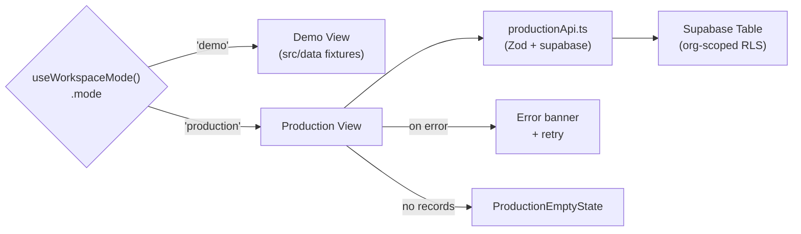
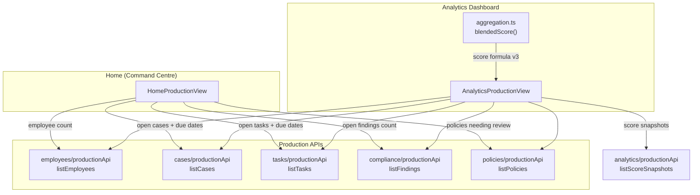

# Workspace Modules

Relevant source files

The following files were used as context for generating this wiki page:

- [CONVENTIONS.md](CONVENTIONS.md)
- [src/features/app/search/SearchOverlay.tsx](src/features/app/search/SearchOverlay.tsx)
- [src/features/app/views/communications/CommunicationsView.tsx](src/features/app/views/communications/CommunicationsView.tsx)
- [src/features/app/views/compensation/CompensationView.tsx](src/features/app/views/compensation/CompensationView.tsx)
- [src/features/app/views/employees/EmployeeDrawer.tsx](src/features/app/views/employees/EmployeeDrawer.tsx)
- [src/features/app/views/employees/EmployeesProductionView.tsx](src/features/app/views/employees/EmployeesProductionView.tsx)
- [src/features/app/views/employees/EmployeesView.tsx](src/features/app/views/employees/EmployeesView.tsx)
- [src/features/app/views/employees/OrgChart.tsx](src/features/app/views/employees/OrgChart.tsx)
- [src/features/app/views/home/HomePriorityQueue.tsx](src/features/app/views/home/HomePriorityQueue.tsx)
- [src/features/app/views/home/HomeWorkflowCatalog.tsx](src/features/app/views/home/HomeWorkflowCatalog.tsx)
- [src/features/app/views/wellbeing/WellbeingView.tsx](src/features/app/views/wellbeing/WellbeingView.tsx)
- [src/features/app/views/workflows/WorkflowsView.tsx](src/features/app/views/workflows/WorkflowsView.tsx)
- [src/features/app/views/comms/CommsView.tsx](src/features/app/views/comms/CommsView.tsx)
- [src/features/app/views/comms/data/types.ts](src/features/app/views/comms/data/types.ts)
- [src/features/app/views/comms/data/productionApi.ts](src/features/app/views/comms/data/productionApi.ts)
- [src/features/app/views/finance/FinanceView.tsx](src/features/app/views/finance/FinanceView.tsx)
- [src/features/app/views/finance/data/types.ts](src/features/app/views/finance/data/types.ts)
- [src/features/app/views/finance/data/productionApi.ts](src/features/app/views/finance/data/productionApi.ts)
- [src/features/app/views/finance/data/supabaseApi.ts](src/features/app/views/finance/data/supabaseApi.ts)
- [src/features/app/workspaceMode/ProductionEmptyState.tsx](src/features/app/workspaceMode/ProductionEmptyState.tsx)
- [src/features/app/workspaceMode/WorkspaceModeProvider.tsx](src/features/app/workspaceMode/WorkspaceModeProvider.tsx)
- [src/features/app/workspaceMode/api.ts](src/features/app/workspaceMode/api.ts)
- [src/features/app/workspaceMode/workspaceModeContext.ts](src/features/app/workspaceMode/workspaceModeContext.ts)

The Dutiva workspace contains **18+ feature modules** beyond the AI Advisor and Document Management systems covered in earlier pages. Each module follows a consistent **phased rollout pattern**: a demo mode renders rich fixture data (the "Northgate Logistics Inc." diorama from `src/data/`), while production mode reads and writes real Supabase tables through a per-module `productionApi.ts` boundary file. The mode dispatch happens either via the route-level `ModeGate` wrapper or inside the view component itself.

Two larger workspace modules — **Communications Platform** (`/app/comms`) and **Finance** (`/app/finance`) — follow a multi-screen layout pattern with their own data providers, context, bilingual message catalogues, and shared bulk-import adapters. These modules are integration-led: they connect to external accounting, payroll, and publishing systems rather than replacing them.

This page provides a high-level map of all workspace modules, their rollout status, and how they interconnect. For detailed coverage:

- **[Employees, Cases & HR Records](#10.1)** — the Employees and Cases modules with their production persistence layers, profile views, org chart, and case detail tabs.
- **[Planning, Settings & Other Modules](#10.2)** — Tasks, Calendar, Policies, Settings, Memory, Home, Communications, Compensation, Wellbeing, Knowledge, and the global Search overlay.

## Module Routing and Gating

All workspace modules are lazy-loaded through `React.lazy()` in the route table at `appViews.tsx`. The `gated()` helper wraps fixture-only views in `ModeGate`, which renders a `ProductionEmptyState` placeholder in production mode. Modules that have gained real persistence dispatch on `useWorkspaceMode().mode` internally and no longer use the gate.

[src/app/appViews.tsx:23-25]()
[src/features/app/workspaceMode/ModeGate.tsx:20-29]()

**Route-level gating** (via `gated()`) applies to modules that still lack production persistence — currently only the Memory sub-routes and several Document Library screens:

[src/app/appViews.tsx:142-143]()
[src/app/appViews.tsx:156-163]()

**Self-dispatching** modules check `workspaceMode` in their root component and render their own `*ProductionView` variant. This list includes Employees, Cases, Compliance, Policies, Tasks, Calendar, Analytics, Communications, Compensation, Wellbeing, Home, Comms Platform, Finance, and Hiring:

[src/app/appViews.tsx:79-118]()

**Ungated** modules render real content in both modes: Home (own production variant), Advisor (own variant), Knowledge (reference guides + guidance panel are real content), Settings (hosts the mode toggle), Workflows (guided flows are real), and Support:

[src/app/appViews.tsx:72-77]()
[src/app/appViews.tsx:97-101]()

Sources: [src/app/appViews.tsx:1-166](), [src/features/app/workspaceMode/ModeGate.tsx:1-29](), [src/features/app/workspaceMode/ProductionEmptyState.tsx:1-47]()

### Module routing map

```mermaid
graph TD
    subgraph "AppShell Outlet"
        R["/app/*"]
    end

    R --> HOME["/app/home\nHomeView"]
    R --> ADV["/app/advisor\nAdvisorView"]
    R --> EMP["/app/employees\nEmployeesView"]
    R --> EMPPROF["/app/employees/:employeeId\nEmployeeProfileView"]
    R --> CASES["/app/cases\nCasesView"]
    R --> CASEDET["/app/cases/:caseId\nCaseDetailView"]
    R --> COMP["/app/compliance\nComplianceView"]
    R --> POL["/app/policies\nPoliciesView"]
    R --> ANA["/app/analytics\nAnalyticsView"]
    R --> KNOW["/app/knowledge\nKnowledgeView"]

    R --> PLAN["/app/planning\nPlanningLayout"]
    PLAN --> TASKS["/app/planning/tasks\nTasksView"]
    PLAN --> CAL["/app/planning/calendar\nCalendarView"]

    R --> SET["/app/settings\nSettingsLayout"]
    SET --> SETV["/app/settings (index)\nSettingsView"]
    SET --> MEML["/app/settings/memory\nMemoryLayout (gated)"]
    MEML --> MEMM["MemoryManagerView"]
    MEML --> MEMP["PersonMemoryView"]
    MEML --> MEMC["CaseMemoryView"]
    MEML --> MEMR["ChatRecallView"]

    R --> COMMS["/app/communications\nCommunicationsView"]
    R --> COMMS2["/app/comms\nCommsView (8 screens)"]
    R --> COMPN["/app/compensation\nCompensationView"]
    R --> WELL["/app/wellbeing\nWellbeingView"]
    R --> WF["/app/workflows\nWorkflowsView"]
    R --> FIN["/app/finance\nFinanceView (10 screens)"]
    R --> HIRE["/app/hiring\nHiringView"]
```

Sources: [src/app/appViews.tsx:71-237]()

## Phased Rollout Pattern

Every workspace module follows a three-layer architecture:

1. **Demo view** — renders fixture data from `src/data/` (the `employees`, `cases`, `tasks`, etc. arrays). This is the "Northgate Logistics Inc." diorama that every visitor sees before signing in.
2. **Production view** — a leaner variant (`*ProductionView`) that reads real rows from Supabase through the module's `productionApi.ts` boundary. Only rendered for signed-in admins who have toggled to production mode.
3. **`productionApi.ts`** — a self-contained data boundary file per module. Each exports typed async functions (`listX`, `addX`, `removeX`, etc.) that call `supabase.from(table)` with Zod validation. These files throw on failure (unlike the workspace-mode API which degrades silently).

The `WorkspaceModeProvider` resolves the active mode and exposes `organizationId` for scoping every production query.

[src/features/app/workspaceMode/WorkspaceModeProvider.tsx:52-155]()
[src/features/app/workspaceMode/workspaceModeContext.ts:5-56]()

### Phased rollout data flow

Sources: [src/features/app/views/employees/EmployeesView.tsx:27-31](), [src/features/app/views/employees/productionApi.ts:1-13](), [src/features/app/workspaceMode/ProductionEmptyState.tsx:13-47]()

## Production API Boundary Files

Eleven modules have `productionApi.ts` files. Each follows the same contract: org-scoped queries, throw-on-failure semantics. The HR modules use Zod-validated Supabase rows; the Communications Platform and Finance modules use a context-provider pattern with localStorage demo persistence and Supabase production persistence.

| Module         | `productionApi.ts` path                 | Supabase Table(s)                                                  | Key Exports                                                                                                                                                                                                                                                                                                                                                                                                                                                                                                                                                                                                                                                                                                                                                                           |
| -------------- | --------------------------------------- | ------------------------------------------------------------------ | ------------------------------------------------------------------------------------------------------------------------------------------------------------------------------------------------------------------------------------------------------------------------------------------------------------------------------------------------------------------------------------------------------------------------------------------------------------------------------------------------------------------------------------------------------------------------------------------------------------------------------------------------------------------------------------------------------------------------------------------------------------------------------------- |
| Employees      | `views/employees/productionApi.ts`      | `employees`, `hr_employee_notes`, `hr_expiry_records`, `hr_leaves` | `listEmployees`, `addEmployee`, `removeEmployee`, `getEmployee`, `updateEmployeeStatus`, `listEmployeeNotes`, `addEmployeeNote`, `listExpiryRecords`, `listLeaves`, `addLeave`, `endLeave`                                                                                                                                                                                                                                                                                                                                                                                                                                                                                                                                                                                            |
| Cases          | `views/cases/productionApi.ts`          | `hr_cases`, `hr_case_notes`                                        | `listCases`, `addCase`, `updateCaseStatus`, `removeCase`, `getCase`, `listCaseNotes`, `addCaseNote`                                                                                                                                                                                                                                                                                                                                                                                                                                                                                                                                                                                                                                                                                   |
| Tasks          | `views/tasks/productionApi.ts`          | `compliance_tasks`                                                 | `listTasks`, `addTask`, `addProbationReviewTask`, `toggleTaskDone`, `removeTask`                                                                                                                                                                                                                                                                                                                                                                                                                                                                                                                                                                                                                                                                                                      |
| Compliance     | `views/compliance/productionApi.ts`     | `compliance_findings`, `hr_obligations`                            | `listFindings`, `addFinding`, `setFindingResolved`, `removeFinding`, `countOpenFindings`, `listObligations`, `addObligation`                                                                                                                                                                                                                                                                                                                                                                                                                                                                                                                                                                                                                                                          |
| Policies       | `views/policies/productionApi.ts`       | `hr_policies`                                                      | `listPolicies`, `addPolicy`, `setPolicyStatus`, `removePolicy`                                                                                                                                                                                                                                                                                                                                                                                                                                                                                                                                                                                                                                                                                                                        |
| Communications | `views/communications/productionApi.ts` | `hr_communications`                                                | `listCommunications`, `addCommunication`, `markCommunicationSent`, `removeCommunication`                                                                                                                                                                                                                                                                                                                                                                                                                                                                                                                                                                                                                                                                                              |
| Compensation   | `views/compensation/productionApi.ts`   | `hr_compensation_records`                                          | `listCompensationRecords`, `addCompensationRecord`, `removeCompensationRecord`, `deltaFromMidpoint`                                                                                                                                                                                                                                                                                                                                                                                                                                                                                                                                                                                                                                                                                   |
| Wellbeing      | `views/wellbeing/productionApi.ts`      | `hr_wellbeing_initiatives`                                         | `listInitiatives`, `addInitiative`, `setInitiativeStatus`, `removeInitiative`, `overdueReviews`                                                                                                                                                                                                                                                                                                                                                                                                                                                                                                                                                                                                                                                                                       |
| Analytics      | `views/analytics/productionApi.ts`      | `compliance_score_snapshots`                                       | `listScoreSnapshots`, `upsertScoreSnapshot`                                                                                                                                                                                                                                                                                                                                                                                                                                                                                                                                                                                                                                                                                                                                           |
| Comms Platform | `views/comms/data/productionApi.ts`     | localStorage (no migration yet)                                    | `loadCommsState`, `listInitiatives`, `addInitiative`, `updateInitiative`, `removeInitiative`, `listObjectives`, `addObjective`, `updateObjective`, `removeObjective`, `listContentItems`, `addContentItem`, `updateContentItem`, `removeContentItem`, `transitionDeliveryStatus`, `addSource`, `removeSource`, `addCoverageItem`, `removeCoverageItem`, `addSubmission`, `removeSubmission`, `addFeed`, `syncFeed`, `addContact`, `updateContact`, `removeContact`, `addOrganization`, `updateOrganization`, `removeOrganization`, `addInteraction`, `removeInteraction`, `addPolicyFile`, `removePolicyFile`, `addIssue`, `updateIssue`, `removeIssue`, `addMetric`, `updateMetric`, `removeMetric`, `addIntegration`, `updateIntegration`, `removeIntegration`, `addExecutionEvent` |
| Finance        | `views/finance/data/productionApi.ts`   | 32 `finance_*` tables (migration 0119)                             | `loadFinanceState`, `addInvoice`, `addSpendRequest`, `addJournal`, `transitionPayRunStatus`, `settlePayrollLiability`, `addTaxObligation`, `addBudget`, `reviseBudget`, `addTaxScenario`, `addScenario`, `addForecast`, `addReserveGoal`, `addBankAccount`, `addLedgerAccount`, `addParty`, `addSubscription`, `importBankStatement`, `deleteImportSession`, `runAutoCategorize`, `seedDefaultCategoryRules`, `addCategoryRule`, `updateCategoryRule`, `removeCategoryRule`, `updateAiImportSettings`, `buildExportBundles`                                                                                                                                                                                                                                                           |

Sources: [src/features/app/views/employees/productionApi.ts:1-405](), [src/features/app/views/cases/productionApi.ts:1-60](), [src/features/app/views/tasks/productionApi.ts:1-93](), [src/features/app/views/compliance/productionApi.ts:1-132](), [src/features/app/views/policies/productionApi.ts:1-107](), [src/features/app/views/communications/productionApi.ts:1-99](), [src/features/app/views/compensation/productionApi.ts:1-118](), [src/features/app/views/wellbeing/productionApi.ts:1-148](), [src/features/app/views/analytics/productionApi.ts:1-74](), [src/features/app/views/comms/data/productionApi.ts:1-552](), [src/features/app/views/finance/data/productionApi.ts:1-622]()

## Module Categories

The workspace modules group into four functional clusters.

### HR Records: Employees & Cases

The Employees module provides a roster view with People/Org Chart tabs (`EmployeesView`), employee profile pages (`EmployeeProfileView`), and an `EmployeeDrawer` for quick-view. The Cases module provides a case files list (`CasesView`) with `NewCaseModal` for creation, and a multi-tab `CaseDetailView` with progress steps and notes threads. Both modules are fully self-dispatching with rich production persistence including notes, status transitions, and lifecycle dates.

For details, see [Employees, Cases & HR Records](#10.1).

[src/features/app/views/employees/EmployeesView.tsx:27-31]()
[src/features/app/views/cases/CasesView.tsx:24-27]()

### Compliance & Risk: Compliance, Policies, Analytics

The Compliance module surfaces a findings register with severity levels and an obligation tracker. The Policies module maintains a policy status register (up-to-date / needs review / missing). The Analytics module is the dashboard hub, aggregating live data from all other modules' production APIs to compute compliance scores, attention queues, case aging, expiry buckets, and headcount trends.

For details on Compliance scoring, see page [5.2](). For Policies and Analytics views, see [Planning, Settings & Other Modules](#10.2).

[src/features/app/views/compliance/ComplianceView.tsx:64-67]()
[src/features/app/views/policies/PoliciesView.tsx:34-37]()
[src/features/app/views/analytics/AnalyticsView.tsx:69-72]()

### Planning & Operations: Tasks, Calendar, Workflows, Home

Tasks and Calendar live under a shared `PlanningLayout` with sub-tabs at `/app/planning/tasks` and `/app/planning/calendar`. Tasks are backed by `compliance_tasks`; Calendar is fixture-driven in demo mode with a production variant. The Workflows view blends real guided processes (`FlowRunner`) with fixture-driven in-flight rows. The Home module is the workspace command centre — production mode aggregates live counts from employees, cases, tasks, findings, and policies via their production APIs.

For details, see [Planning, Settings & Other Modules](#10.2).

[src/features/app/views/planning/PlanningLayout.tsx:43-51]()
[src/features/app/views/home/HomeView.tsx:29-46]()
[src/features/app/views/home/HomeProductionView.tsx:49-78]()

### Sensitive Data Modules: Communications, Compensation, Wellbeing

These three modules were ungated in migrations 0039–0041. Each self-dispatches on mode and intentionally narrows its production surface compared to demo:

- **Communications** — `/app/communications` logs what was sent, to whom, and when. The newer `/app/comms` workspace adds initiative planning, content calendar, relationships, engagement, intelligence, results, and bulk import, but it still does not analyse or review drafts.
- **Compensation** — records base salary and the employer's own band midpoint. No market-rate comparison in production — `deltaFromMidpoint` returns `null` when no midpoint is entered.
- **Wellbeing** — records employer-offered initiatives, **never per-person health signals**. The demo's `supportSignals` with confidence scores are explicitly not persisted, as they represent inferred health information (Ring 2 data the system avoids recording).

For details, see [Planning, Settings & Other Modules](#10.2).

[src/features/app/views/communications/CommunicationsView.tsx:40-43]()
[src/features/app/views/compensation/CompensationView.tsx:56-59]()
[src/features/app/views/wellbeing/WellbeingView.tsx:28-31]()
[src/features/app/views/wellbeing/productionApi.ts:4-20]()

### Multi-Screen Workspace Modules: Comms Platform & Finance

Two workspace modules follow a different pattern from the single-view modules above. Each has its own layout component, a multi-screen route tree, a dedicated data context/provider, and bilingual message catalogues. Both are **integration-led** — they connect to external systems rather than replacing them.

#### Communications Platform (`/app/comms`)

The Comms Platform is a planning-and-approval workspace for internal communications. It manages initiatives, content calendar, stakeholder relationships, engagement tracking, intelligence feeds (RSS/Atom), and results reporting. Eight screens are nested under `CommsLayout`:

| Screen           | Route                      | Purpose                                                                           |
| ---------------- | -------------------------- | --------------------------------------------------------------------------------- |
| Overview         | `/app/comms/overview`      | Initiative summary, active campaigns, coverage, recent activity log               |
| Initiatives      | `/app/comms/initiatives`   | Create/edit/pause communications initiatives and objectives                       |
| Content Calendar | `/app/comms/content`       | Content items with delivery status tracking and Markdown body support             |
| Relationships    | `/app/comms/relationships` | Stakeholder and audience mapping; bulk import contacts and organizations          |
| Engagement       | `/app/comms/engagement`    | Engagement metrics and outreach tracking                                          |
| Intelligence     | `/app/comms/intelligence`  | RSS/Atom feed monitoring, policy files, and issue tracking                        |
| Results          | `/app/comms/results`       | Submission tracking, metrics, coverage, and outcome reporting                     |
| Settings         | `/app/comms/settings`      | Feed sources, coverage items, integrations, usage controls, claims, and approvals |

The data layer (`views/comms/data/`) provides `CommsDataContext`, `CommsDataProvider`, `useCommsData`, typed fixtures, and a `productionApi.ts` with localStorage persistence. Bulk-import adapters live in `views/comms/bulkImport/` and reuse the shared `BulkImportWizard`. External publishing, ad execution, and AI drafting are intentionally out of scope. No Supabase migration exists yet — production mode uses localStorage.

Sources: [src/features/app/views/comms/CommsView.tsx:1-20](), [src/features/app/views/comms/CommsLayout.tsx:1-60](), [src/features/app/views/comms/data/types.ts:1-50](), [src/features/app/views/comms/data/productionApi.ts:1-552]()

#### Finance (`/app/finance`)

The Finance workspace is an integration-led financial management module for Canadian SMBs (Ontario and Québec initially). It answers: what do we own and owe, what money is available, what must be paid/collected/filed, what can we afford, and how will decisions affect the business. Ten screens are nested under `FinanceLayout`:

| Screen        | Route                        | Purpose                                                                                                      |
| ------------- | ---------------------------- | ------------------------------------------------------------------------------------------------------------ |
| Overview      | `/app/finance/overview`      | AR, AP, burn-rate KPIs, entity summary                                                                       |
| Transactions  | `/app/finance/transactions`  | Bank items, matching, reconciliation                                                                         |
| Sales         | `/app/finance/sales`         | Invoices, credits, AR lifecycle                                                                              |
| Purchases     | `/app/finance/purchases`     | Bills, expenses, spend requests, parties, subscriptions                                                      |
| Payroll       | `/app/finance/payroll`       | Pay runs, payroll liabilities (admin-restricted in production)                                               |
| Accounting    | `/app/finance/accounting`    | Journals, ledger accounts, close periods, books                                                              |
| Plans         | `/app/finance/plans`         | Budgets, scenarios, forecasts, variance reporting                                                            |
| Treasury      | `/app/finance/treasury`      | Bank accounts, reserves, holdings, debt                                                                      |
| Tax           | `/app/finance/tax`           | Tax obligations, tax-planning scenarios                                                                      |
| Evidence      | `/app/finance/evidence`      | Receipt upload, review, signed download URLs                                                                 |
| Import/Export | `/app/finance/import-export` | Bank statement and CSV import, auto-categorization, rule suggestions, export bundles, and bulk import wizard |

The data layer (`views/finance/data/`) provides `FinanceDataContext`, `FinanceDataProvider`, `useFinanceData`, typed fixtures, a `productionApi.ts` (localStorage demo), and a full Supabase persistence layer split across:

- `supabaseApi.ts` — full state load, invoice/journal/spend/tax/budget inserts, status transitions
- `supabaseCreates.ts` — scenario, forecast, reserve, holding, debt, external action, and master-data inserts
- `supabaseLifecycle.ts` — invoice, bill, journal, bank item, reconciliation, close period, expense transitions
- `supabaseEvidence.ts` — receipt file storage and signed URL generation
- `supabaseMappers.ts` — row-to-domain-object mappers
- `productionLifecycle.ts` — localStorage lifecycle transitions
- `useFinanceCreates.ts` — React hook for create/transition callbacks
- `importExport.ts` — export bundles and CSV download helpers
- `statementParser.ts` — bank statement file-to-CSV conversion
- `autoCategorize.ts` and `defaultCategoryRules.ts` — rule-based transaction categorization
- `ruleSuggestion.ts` — suggested category rules from imported transactions
- `aiImportAnalyzer.ts` and `productionAi.ts` — AI-assisted import analysis with rule fallback
- `bulkImport/bankStatementAdapter.ts`, `entityAdapter.ts`, `transactionAdapter.ts` — `BulkImportWizard` adapters

Migration `0119_add_finance_module.sql` creates 32 `finance_*` tables with org-scoped RLS. The migration is committed but **not yet applied** to the Supabase project — production mode falls back to localStorage until it is applied. Sensitive payroll tables are admin-only at the RLS level and gated by `useWorkspaceMode().memberRole` on the client.

The product does not provide native accounting, payroll, tax filing, investment execution, or professional advice. The selected accounting system remains authoritative for posted books; the payroll provider remains authoritative for completed pay runs. Dutiva owns budgets, forecasts, review work, approvals, and source-record links.

Sources: [src/features/app/views/finance/FinanceView.tsx](), [src/features/app/views/finance/data/types.ts:1-50](), [src/features/app/views/finance/data/FinanceDataContext.ts:1-60](), [src/features/app/views/finance/data/supabaseApi.ts:1-593](), [supabase/migrations/0119_add_finance_module.sql:1-50]()

## Cross-Module Bulk Import

A shared `BulkImportWizard` in `src/features/app/bulkImport/` provides a reusable upload → column mapping → preview → import flow. Adapters are colocated with each workspace module:

- `src/features/app/views/employees/bulkImport/employeeAdapter.ts`
- `src/features/app/views/finance/bulkImport/bankStatementAdapter.ts`, `entityAdapter.ts`, `transactionAdapter.ts`
- `src/features/app/views/comms/bulkImport/contactAdapter.ts`, `organizationAdapter.ts`, `contentAdapter.ts`

Each adapter defines a typed row, field labels (bilingual), header inference, validation, and the `import` callback that persists valid rows. The wizard supports CSV/TSV/TXT/XLSX and downloads a template. Imported text fields that are not yet translated are tagged for French or English review.

## Cross-Module Integration Diagram

Sources: [src/features/app/views/home/HomeProductionView.tsx:56-78](), [src/features/app/views/analytics/AnalyticsView.tsx:69-72]()

## Settings, Memory & Knowledge

**Settings** (`SettingsView`) is ungated because it hosts the demo/production mode toggle. It is wrapped in `SettingsLayout`, which provides a tab strip between General settings and Memory. Appearance (theme) and language toggles drive the real `ThemeProvider` and `LangProvider`.

**Memory** (`MemoryLayout`) is gated (demo-only) and provides sub-routes for `MemoryManagerView`, `PersonMemoryView`, `CaseMemoryView`, and `ChatRecallView`. It displays an Advisor memory store with fact rows, confidence levels, and governance controls.

**Knowledge** (`KnowledgeView`) is ungated and renders both fixture-driven article items and real content — reference guides from `src/features/app/reference/data` and the `GuidanceSourcesPanel` which shows live backend guidance source status.

For details, see [Planning, Settings & Other Modules](#10.2).

[src/features/app/views/settings/SettingsLayout.tsx:44-52]()
[src/features/app/views/memory/MemoryLayout.tsx:28-82]()
[src/features/app/views/knowledge/KnowledgeView.tsx:27-31]()
[src/app/appViews.tsx:134-151]()

## Global Search Overlay

The `SearchOverlay` is a workspace-wide ⌘K search dialog backed by `SearchProvider` / `useSearch()`. It filters fixture data across entity types (employees, cases, chats, documents, views) using `filterSearchEntries` from `searchCorpus`. In production mode, the search corpus is empty since there are no fixtures to search over.

The overlay supports keyboard navigation (arrow keys, Enter, Escape) and navigates to the appropriate module route when an entry is selected.

[src/features/app/search/SearchOverlay.tsx:23-27]()
[src/features/app/search/SearchOverlay.tsx:42-47]()
[src/features/app/search/searchContext.ts:1-16]()

Sources: [src/features/app/search/SearchOverlay.tsx:1-96]()

## Fixture Data Layer

All demo views consume typed fixture arrays exported from `src/data/`. The domain model is defined in `src/data/types.ts` and includes `Employee`, `CaseFile`, `Task`, `ComplianceItem`, `Obligation`, `Policy`, `Communication`, `CalendarEvent`, `MemoryFact`, and more. All display strings are typed `Bi` (bilingual EN/FR). The fixtures represent the "Northgate Logistics Inc." fictional company and maintain referential integrity (validated by `data.test.ts`).

The design intent is that fixture arrays will be replaced wholesale by Supabase data when each module reaches production — the `productionApi.ts` files are that replacement layer.

[src/data/types.ts:1-14]()

Sources: [src/data/types.ts:1-148](), [CONVENTIONS.md:17-38]()

## Module Rollout Status Summary

| Module         | Demo                                 | Production                                       | Gating                   |
| -------------- | ------------------------------------ | ------------------------------------------------ | ------------------------ |
| Home           | `HomeView`                           | `HomeProductionView`                             | Self-dispatch            |
| Employees      | `EmployeesDemoView`                  | `EmployeesProductionView`                        | Self-dispatch            |
| Cases          | `CasesDemoView`                      | `CasesProductionView`                            | Self-dispatch            |
| Compliance     | `ComplianceDemoView`                 | `ComplianceProductionView`                       | Self-dispatch            |
| Policies       | `PoliciesDemoView`                   | `PoliciesProductionView`                         | Self-dispatch            |
| Tasks          | `TasksDemoView`                      | `TasksProductionView`                            | Self-dispatch            |
| Calendar       | `CalendarView` (demo)                | `CalendarProductionView`                         | Self-dispatch            |
| Analytics      | `AnalyticsDemoView`                  | `AnalyticsProductionView`                        | Self-dispatch            |
| Communications | `CommunicationsDemoView`             | `CommunicationsProductionView`                   | Self-dispatch            |
| Compensation   | `CompensationDemoView`               | `CompensationProductionView`                     | Self-dispatch            |
| Wellbeing      | `WellbeingDemoView`                  | `WellbeingProductionView`                        | Self-dispatch            |
| Workflows      | `WorkflowsView` (mixed)              | Guided flows only                                | Self-dispatch (partial)  |
| Knowledge      | `KnowledgeView`                      | Same (real content)                              | Ungated                  |
| Settings       | `SettingsView`                       | Same (hosts toggle)                              | Ungated                  |
| Memory         | `MemoryLayout` + sub-views           | `ProductionEmptyState`                           | `gated()` via `ModeGate` |
| Hiring         | `HiringView` (demo)                  | `HiringView` (production)                        | Self-dispatch            |
| Comms Platform | `CommsDemoView` (8 screens)          | `CommsProductionView` (localStorage)             | Self-dispatch            |
| Finance        | `FinanceView` (10 screens, fixtures) | `FinanceView` (Supabase, migration 0119 pending) | Self-dispatch            |

Sources: [src/app/appViews.tsx:71-237](), [src/features/app/views/employees/EmployeesView.tsx:27-31](), [src/features/app/views/cases/CasesView.tsx:24-27](), [src/features/app/views/compliance/ComplianceView.tsx:64-67](), [src/features/app/views/tasks/TasksView.tsx:33-35](), [src/features/app/views/communications/CommunicationsView.tsx:40-43](), [src/features/app/views/compensation/CompensationView.tsx:56-59](), [src/features/app/views/wellbeing/WellbeingView.tsx:28-31](), [src/features/app/views/analytics/AnalyticsView.tsx:69-72](), [src/features/app/views/policies/PoliciesView.tsx:34-37](), [src/features/app/views/home/HomeView.tsx:29-46](), [src/features/app/views/knowledge/KnowledgeView.tsx:27-28](), [src/features/app/views/comms/CommsView.tsx:1-20](), [src/features/app/views/finance/FinanceView.tsx]()

---
